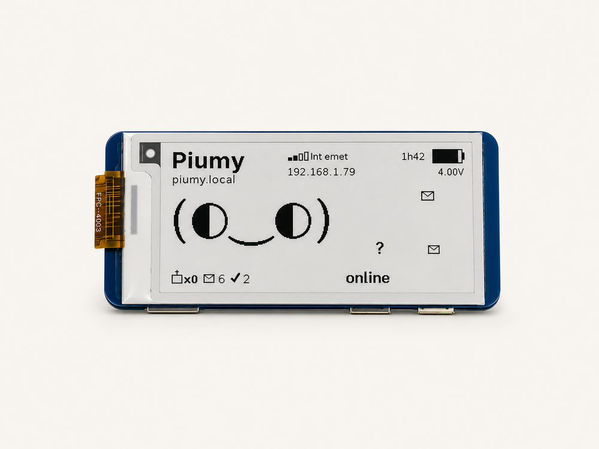
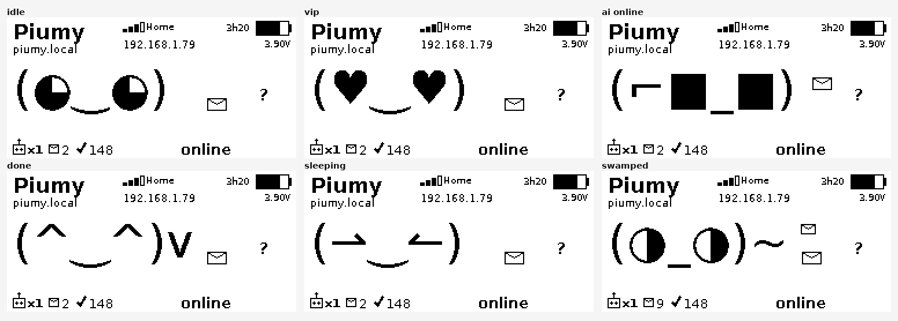
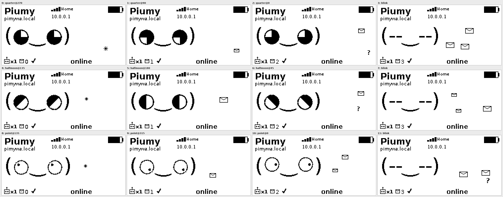
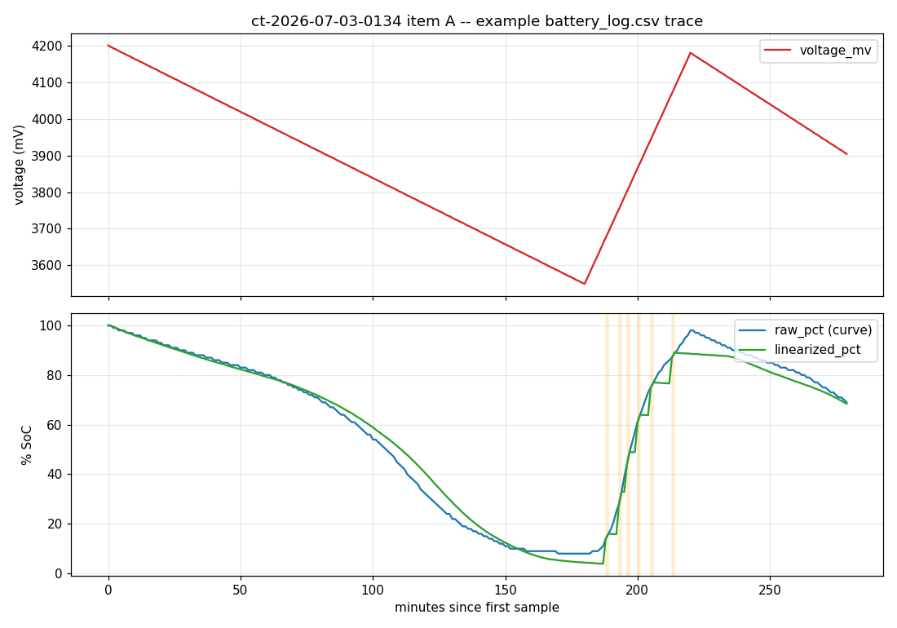
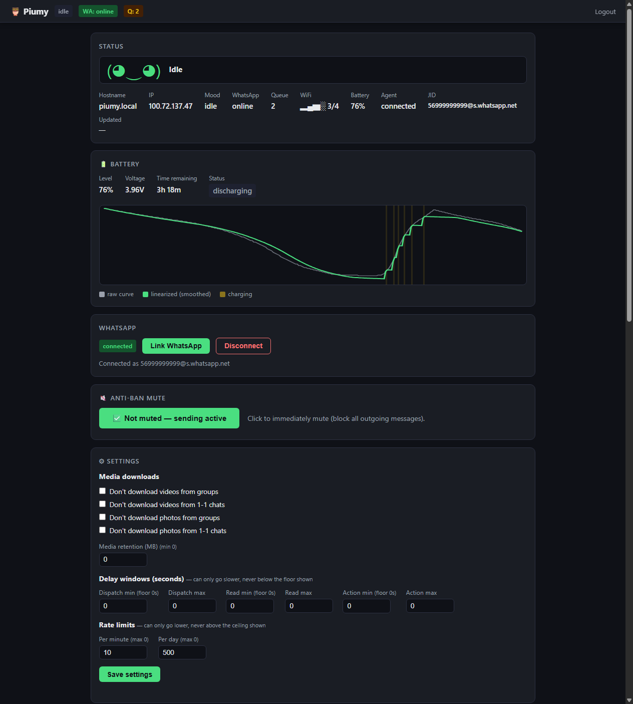

# Piumy 🦉

A **distributed, portable** WhatsApp assistant for ARM64 boards. A tiny board
**routes and stores** (the *switchboard*); the brain (AI) connects over **MCP**
from a machine with RAM. Everything hardware-specific lives behind **configurable
adapters**, so the same code runs on any ARM64 board.

> ## (⌐■_■) pwnagotchi has pwned hehehe
> Piumy's e-paper face is a homage to **[pwnagotchi](https://github.com/evilsocket/pwnagotchi)**
> by [@evilsocket](https://github.com/evilsocket). The expressions are inspired by its
> e-ink faces — original code, borrowed affection. 🫡



## Idea

```
WhatsApp (dedicated number)
      │
      ▼
  SWITCHBOARD (Go, tiny board) ── e-paper (Python adapter) → face
   · receives / stores (SQLite)     └ reads status.json
   · per-chat mode: auto | advanced
   · anti-ban governor · whitelist
   · exposes MCP ──────────────┐
        │ auto                 │ advanced (queue, pull)
        ▼                      ▼
   cheap API             AGENT over MCP (another machine with RAM)
   (optional)             Claude / Opus / OpenCode + tools
```

**The switchboard does not reply — it routes and stores.** Replies come from
whoever connects over MCP. The seams are **data contracts**: `status.json`
(core ↔ display) and MCP/HTTP (core ↔ agent).

## The face — real pwnagotchi kaomoji



Real pwnagotchi **kaomoji** faces (not vectors), rendered 1-bit on the e-paper.
Big eyes that actually **look around** — three eye styles rotating in a gaze
loop — blink, and react to what's happening (a new message, the agent
connecting, the battery draining). It moves when there's something to react to
and settles into a calm, low-power idle when quiet.



## Battery intelligence



A **self-calibrating** fuel gauge (CW2015 over I2C): reads the raw cell voltage,
learns *this* pack's real full→empty span from actual discharges, and reports an
**even, linear level** (voltage alone is famously jumpy) with an adaptive
time-remaining. A per-minute discharge log makes voltage traceable over time.

## Dashboard



A lightweight web dashboard, served by the same Go binary (LAN-only, login): the
**live face**, a battery chart (raw vs. linearized + charging bands), WhatsApp
link/QR, anti-ban mute, per-chat rules, rate limits, and router/whitelist.

## Stack

- **Core (switchboard):** Go — [`whatsmeow`](https://github.com/tulir/whatsmeow) (MPL-2.0) + `mcp-go` (MIT) + SQLite. Single, lightweight binary.
- **Display adapter:** Python + Pillow. Backends: `file` (PNG, dev) · `epaper-waveshare` · `none`.
- **Power adapter:** Python — CW2015 over I2C. Backends: `cw2015-i2c` · `none`.
- **Brain:** any agent that speaks MCP (it does not live on the board).

## Try it now (no hardware, no WhatsApp) — Contract #001

The core writes `status.json`; the `file` adapter draws it as a face.

```bash
# 1) the core (Go) writes a state
cd core && go run . responding

# 2) render the face
cd ../adapters/display/file
pip install -r requirements.txt
python render.py            # -> generates display.png
```

Valid states: `idle thinking responding sleeping working alert error qr`.

## Connecting the brain (MCP)

The MCP endpoint (`:8081`) is **fail-closed**: it rejects every request
until a token is configured — an open MCP endpoint has no trust boundary at
all (any tool, including the owner-scoped ones, would be reachable by
anyone on the LAN).

On a real install, `install.sh` runs this automatically and prints the
token once. To do it manually (or to rotate an existing token):

```bash
sudo /opt/pimywa/pimywa auth setup     # generates + saves one if none exists yet (idempotent)
sudo /opt/pimywa/pimywa auth rotate    # always generates a NEW one, invalidating the old
```

Both print the exact client config to paste into your MCP client
(Claude Code / OpenCode's `.mcp.json`):

```json
{"mcpServers": {"piumy": {"url": "http://<host>:8081/mcp",
  "headers": {"Authorization": "Bearer <token>"}}}}
```

The token is shown **once** — save it (a password manager, or hand it to
whoever runs the agent). It's stored in `/opt/pimywa/pimywa.env` as
`PIMYWA_MCP_KEY`, never committed to git. Restart `pimywa-core` after
`rotate` for the new token to take effect.

## Portability

Hardware is touched only through generic Linux interfaces (`spidev` / `libgpiod` /
`i2c-dev`), never through vendor-locked libraries. To port to another ARM64 board,
see [`HARDWARE.md`](HARDWARE.md).

## Status

**MVP feature-complete** and running on a Raspberry Pi Zero 2 W: core switchboard
(WhatsApp gateway, router, anti-ban governor, MCP server), the e-paper kaomoji
face + eye engine, self-calibrating battery intelligence, the web dashboard,
MCP **token auth**, and the client [skill](skill/piumy/SKILL.md). See the full
feature map — done / in progress / planned — in **[`ROUTEMAP.md`](ROUTEMAP.md)**.

## Built with

Piumy stands on excellent open-source work — the Go core is mostly glue around these:

- **[whatsmeow](https://github.com/tulir/whatsmeow)** by Tulir Asikainen — the WhatsApp Web multidevice library (MPL-2.0) that actually talks to WhatsApp.
- **[mcp-go](https://github.com/mark3labs/mcp-go)** by mark3labs — the Model Context Protocol server (MIT) the brain connects through.
- **[modernc.org/sqlite](https://pkg.go.dev/modernc.org/sqlite)** by Jan Mercl (cznic) — a pure-Go SQLite (BSD-3) so the core cross-compiles to ARM with no CGO.
- **[go-qrcode](https://github.com/skip2/go-qrcode)** by skip2 — the QR that links your phone (MIT).
- **[golang.org/x/crypto](https://pkg.go.dev/golang.org/x/crypto)** & **[google.golang.org/protobuf](https://pkg.go.dev/google.golang.org/protobuf)** by the Go Authors and Google (BSD-3).

…and their transitive dependencies. Thank you. 🙏

## License

**[AGPL-3.0](LICENSE)** (network copyleft). You are free to use, modify, and
distribute; your version — even if you run it as a service — must also be AGPL-3.0.

**Commercial license / dual-license:** want to use Piumy in a closed-source
product, without the AGPL obligations? The author can grant a commercial license —
[open an issue](../../issues) to coordinate.

---

Made by **Camilo Brossard** · [clever.cat](https://clever.cat) 🐱 · community: [r/Piumy](https://www.reddit.com/r/Piumy/)
