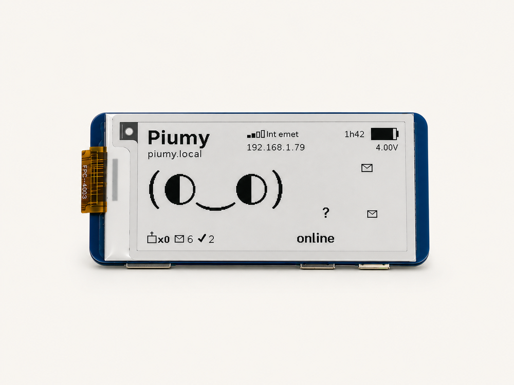
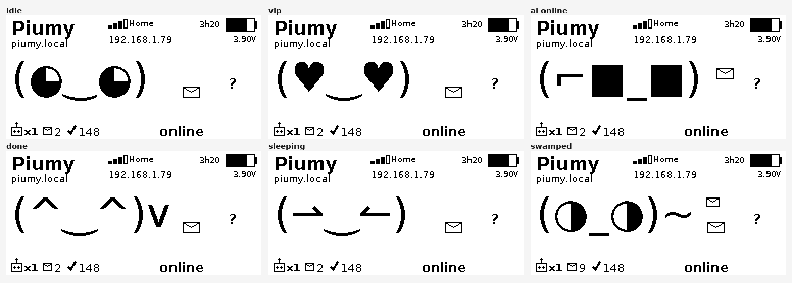
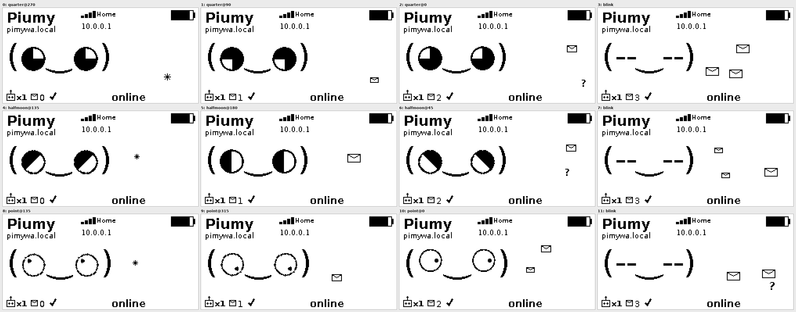
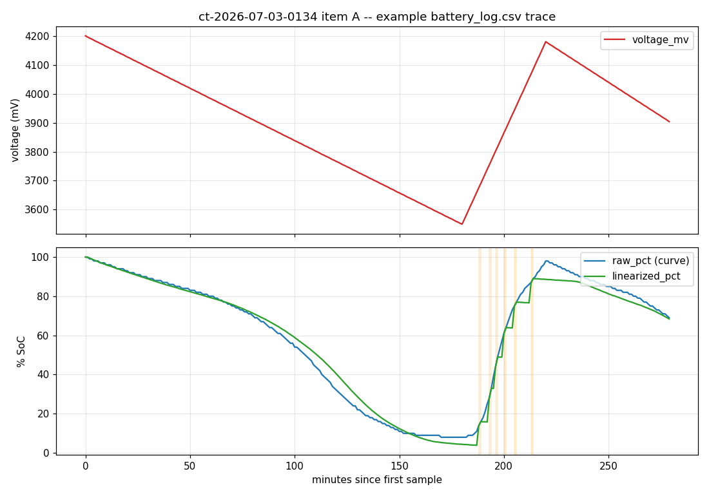

# Piumy 🦉

Your WhatsApp, **routed and stored** by a switchboard that never thinks; the
brain (your AI) connects over **MCP** and answers. Everything hardware-specific
lives behind **configurable adapters**, so the same core runs on a board or on
your PC.

## Current version

**Piumy for Windows** `0.1.1` — the full switchboard as a **CleverCoder
plugin**. One installer: it generates its own keys, asks you for a password,
and ends on the QR to link WhatsApp. No hardware needed.

[**↓ Download**](https://github.com/chamilonster/Piumy/releases/latest) · this
**is** the gateway: it holds WhatsApp, the database and the rules. The brain
stays outside — your agent connects over MCP and does the answering.

## ⚠️ OLD VERSIONS

Kept as source, **not supported and not what you want to install today**:

| | What it was | Where it ran |
|---|---|---|
| **Piumy Pi** | The switchboard on a **Raspberry Pi Zero 2 W** with a 2.13" e-paper face and UPS battery, always on. The original edition. | A board you hold in your hand |
| **Piumy Desktop** (`tools/desktop/`) | A floating, always-on-top widget that **showed** the e-paper face on your desktop and opened the dashboard. It never answered a message — it was a window into a Piumy running elsewhere. | Your desktop |

Everything below in this README that mentions boards, e-paper, batteries or
`deploy/install.sh` belongs to those old versions.

**A new Raspberry Pi build is coming back**, along with macOS and Linux — see
Platforms.

## An add-on for CleverCoder

Piumy is now a **plugin for [clevercoder.app](https://clevercoder.app)**. If you
already work with agents there, this hands them your WhatsApp: your chats reach
the same agents you use every day, over MCP, under rules you write per
conversation. You install it once and point your agent at it — no account to
create, no service in the middle, nothing leaving your machine.

It still works standalone with any MCP client (Claude Code, OpenCode, your own).
CleverCoder is where it fits best, not a requirement.

## Platforms

- **Windows** — available now ([download](https://github.com/chamilonster/Piumy/releases/latest)).
- **macOS and Linux** — coming soon. The core already builds for both
  (`CGO_ENABLED=0`, pure Go); what's missing is the packaging, not the engine.
- **Raspberry Pi** — the hardware edition, returning alongside them.

> ## (⌐■_■) pwnagotchi has pwned hehehe
> Piumy's e-paper face is a homage to **[pwnagotchi](https://github.com/evilsocket/pwnagotchi)**
> by [@evilsocket](https://github.com/evilsocket). The expressions are inspired by its
> e-ink faces — original code, borrowed affection. 🫡



## Idea

```
WhatsApp (dedicated number)
      │
      ▼
  SWITCHBOARD (Go, tiny board) ── e-paper (Python adapter) → face
   · receives / stores (SQLite)     └ reads status.json
   · per-chat mode: auto | dedicated
   · anti-ban governor · whitelist
   · exposes MCP ──────────────┐
        │ auto                 │ dedicated (queue, pull)
        ▼                      ▼
   cheap API             AGENT over MCP (another machine with RAM)
   (optional)             Claude / Opus / OpenCode + tools
```

**The switchboard does not reply — it routes and stores.** Replies come from
whoever connects over MCP. The seams are **data contracts**: `status.json`
(core ↔ display) and MCP/HTTP (core ↔ agent).

## The face — real pwnagotchi kaomoji



Real pwnagotchi **kaomoji** faces (not vectors), rendered 1-bit on the e-paper.
Big eyes that actually **look around** — three eye styles rotating in a gaze
loop — blink, and react to what's happening (a new message, the agent
connecting, the battery draining). It moves when there's something to react to
and settles into a calm, low-power idle when quiet.



## Battery intelligence



A **self-calibrating** fuel gauge (CW2015 over I2C): reads the raw cell voltage,
learns *this* pack's real full→empty span from actual discharges, and reports an
**even, linear level** (voltage alone is famously jumpy) with an adaptive
time-remaining. A per-minute discharge log makes voltage traceable over time.

## Dashboard


A lightweight web dashboard, served by the same Go binary (LAN-only, login): the
**live face**, a battery chart (raw vs. linearized + charging bands), WhatsApp
link/QR, anti-ban mute, per-chat rules, rate limits, and router/whitelist.

## Stack

- **Core (switchboard):** Go — [`whatsmeow`](https://github.com/tulir/whatsmeow) (MPL-2.0) + `mcp-go` (MIT) + SQLite. Single, lightweight binary.
- **Display adapter:** Python + Pillow. Backends: `file` (PNG, dev) · `epaper-waveshare` · `none`.
- **Power adapter:** Python — CW2015 over I2C. Backends: `cw2015-i2c` · `none`.
- **Brain:** any agent that speaks MCP (it does not live on the board).

## Try it now (no hardware, no WhatsApp) — Contract #001

The core writes `status.json`; the `file` adapter draws it as a face.

```bash
# 1) the core (Go) writes a state
cd core && go run . responding

# 2) render the face
cd ../adapters/display/file
pip install -r requirements.txt
python render.py            # -> generates display.png
```

Valid states: `idle thinking responding sleeping working alert error qr`.

## Connecting the brain (MCP)

The MCP endpoint (`:8081`) is **fail-closed**: it rejects every request
until a token is configured — an open MCP endpoint has no trust boundary at
all (any tool, including the owner-scoped ones, would be reachable by
anyone on the LAN).

On a real install, `install.sh` runs this automatically and prints the
token once. To do it manually (or to rotate an existing token):

```bash
sudo /opt/pimywa/pimywa auth setup     # generates + saves one if none exists yet (idempotent)
sudo /opt/pimywa/pimywa auth rotate    # always generates a NEW one, invalidating the old
```

Both print the exact client config to paste into your MCP client
(Claude Code / OpenCode's `.mcp.json`):

```json
{"mcpServers": {"piumy": {"url": "http://<host>:8081/mcp",
  "headers": {"Authorization": "Bearer <token>"}}}}
```

The token is shown **once** — save it (a password manager, or hand it to
whoever runs the agent). It's stored in `/opt/pimywa/pimywa.env` as
`PIMYWA_MCP_KEY`, never committed to git. Restart `pimywa-core` after
`rotate` for the new token to take effect.

## Portability

Hardware is touched only through generic Linux interfaces (`spidev` / `libgpiod` /
`i2c-dev`), never through vendor-locked libraries. To port to another ARM64 board,
see [`HARDWARE.md`](HARDWARE.md).

## Status

**MVP feature-complete** and running on a Raspberry Pi Zero 2 W: core switchboard
(WhatsApp gateway, router, anti-ban governor, MCP server), the e-paper kaomoji
face + eye engine, self-calibrating battery intelligence, the web dashboard,
MCP **token auth**, and the client [skill](skill/piumy/SKILL.md). See the full
feature map — done / in progress / planned — in **[`ROUTEMAP.md`](ROUTEMAP.md)**.

## Support

Piumy is free and open-source — and **donations are the cornerstone** that keep it going. WhatsApp is only the kickoff; the plan is a secure personal gateway for everyone. If it is useful to you, chip in what you want (even $0):

**[♥ Donate — pay what you want](https://clevercat.lemonsqueezy.com/checkout/buy/3e2ebe37-5116-4e2a-9400-2246c1199c8d)**

## Built with

Piumy stands on excellent open-source work — the Go core is mostly glue around these:

- **[whatsmeow](https://github.com/tulir/whatsmeow)** by Tulir Asikainen — the WhatsApp Web multidevice library (MPL-2.0) that actually talks to WhatsApp.
- **[mcp-go](https://github.com/mark3labs/mcp-go)** by mark3labs — the Model Context Protocol server (MIT) the brain connects through.
- **[modernc.org/sqlite](https://pkg.go.dev/modernc.org/sqlite)** by Jan Mercl (cznic) — a pure-Go SQLite (BSD-3) so the core cross-compiles to ARM with no CGO.
- **[go-qrcode](https://github.com/skip2/go-qrcode)** by skip2 — the QR that links your phone (MIT).
- **[golang.org/x/crypto](https://pkg.go.dev/golang.org/x/crypto)** & **[google.golang.org/protobuf](https://pkg.go.dev/google.golang.org/protobuf)** by the Go Authors and Google (BSD-3).

…and their transitive dependencies. Thank you. 🙏

## License

**[AGPL-3.0](LICENSE)** (network copyleft). You are free to use, modify, and
distribute; your version — even if you run it as a service — must also be AGPL-3.0.

**Commercial license / dual-license:** want to use Piumy in a closed-source
product, without the AGPL obligations? The author can grant a commercial license —
[open an issue](../../issues) to coordinate.

---

Made by **Camilo Brossard** · [clever.cat](https://clever.cat) 🐱 · community: [r/Piumy](https://www.reddit.com/r/Piumy/)
