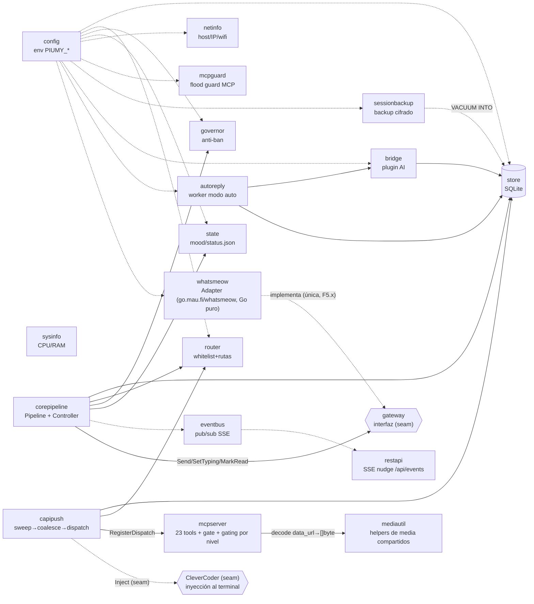

# Manual de piumy-gateway — nodos y botones

Mapa rápido de todo lo que existe hoy en `internal/`: qué hace cada
paquete (nodo) y cuáles son sus funciones/tipos exportados clave
(botones) — para no tener que leer la implementación entera solo para
saber qué se puede llamar. Cada nodo linkea al diagrama de su fase, si
existe.

**Regla de mantenimiento:** cuando un sub-cambio agrega o cambia un
botón (función/tipo exportado), actualizar la sección del nodo
correspondiente en el mismo commit — es parte de la disciplina de cierre,
igual que el diagrama Mermaid y el build verde.

## Cómo se conectan (vista de alto nivel)



`gateway`/`corepipeline` son de F2 (reescritura, no cherry-pick): la
interfaz es el seam contra cualquier cliente de mensajería. `open-wa` (F3)
fue el primer implementador real, pero su v4 quedó EOL y dejó de manejar
el WhatsApp Web actual; `whatsmeow` (F5.x, ct-2026-07-10-0420) lo
reemplazó, y `internal/openwa` se borró del todo en ST-E
(ct-2026-07-11-1444) una vez que las 5 tools de grupo/perfil que aún
dependían de él quedaron cableadas a whatsmeow. En tests, `fakeGateway`
(`corepipeline`) alcanza para probar todo sin WhatsApp real.

Todavía sin lógica propia (andamiaje F0, contenido llega en F4c/F4d):
`dashboard` (no es nodo de F4 en absoluto — ver `mcpserver`, sección
`reset_dashboard_password`).

---

## config — `internal/config`

Rol: carga `PIUMY_*` desde el entorno. Cero hardcode. Cada fase suma
solo los campos que sus propios paquetes necesitan.

- `Load() (Config, error)` — lee todo el entorno. Sigue siendo 100%
  env-only, no sabe ni le importa de dónde salió el valor (sin cambios por
  T11, abajo). Ya no falla si falta `PIUMY_DB_PATH` — ver T169 justo abajo,
  que le sacó ese caso especial junto con el resto de los defaults
  relativos.
- **T169 (ct-2026-09-19-1433) — cada ruta de datos cuelga de `DataDir()`,
  nunca del directorio de trabajo.** Boss verbatim, la causa raíz de los
  datos personales en el repo: *"el problema es que no separaron el
  programa instalado de lo que se programa... los archivos personales,
  obvios que no van al coderoot"*. Medido antes de contratar: `WADBPath`/
  `RouterPath`/`StatusPath`/`MediaDir`/`BackupDir` (y, de hecho, `DBPath`
  también, aunque ese no tenía default — ERRABA) resolvían relativo al
  directorio de trabajo, y ninguno de los 7 nombres resultantes estaba en
  `.gitignore` — correr el binario una sola vez parado en `coderoot` dejaba
  la sesión de WhatsApp, la base de conversaciones y las fotos DENTRO del
  árbol de código, sin ninguna red debajo (y explica, retroactivamente, una
  corrida de prueba de T153 que dejó `agent-connect.json`/`status.json`/
  `logs/` sueltos en la raíz — no fue un olvido del `cd`, era el default).
  - **`DataDir() (string, error)`** (`datadir.go`) — la única función que
    resuelve la raíz. `PIUMY_DATA_DIR` gana si está seteada, SIEMPRE
    verbatim (un solo interruptor para una instancia de prueba, reemplaza el
    truco viejo de setear cinco variables sueltas — T164/T165) — ni siquiera
    `PIUMY_ACCOUNT` le agrega nada encima. Si no, el directorio de datos
    estándar del SO, cross-platform desde el arranque (T113: Mac/
    Linux/Raspberry, no solo Windows) — `%LOCALAPPDATA%\Piumy` en Windows,
    `~/Library/Application Support/Piumy` en Mac, `~/.local/share/piumy` en
    Linux. Core puro testeable, `dataDirFor(goos, localAppData, home,
    account)` — recibe todo por parámetro en vez de leer `runtime.GOOS`/el
    entorno en vivo, así las cinco ramas (incluidas las dos de SO que esta
    máquina no corre) se testean sin fingir el SO.
  - **`PIUMY_ACCOUNT` — multi-cuenta S1 (`ct-2026-09-20-1100`).** Con esta
    variable seteada, `dataDirFor` cuelga un segmento más debajo de la raíz
    del SO: `<raíz>/accounts/<slug>` — dos cuentas en la misma máquina
    terminan en dos árboles de datos completamente separados, cada uno con
    su propio `whatsmeow.db`. `accountSlug(account)` valida el nombre —
    vacío (tras `TrimSpace`), `..`, cualquier separador (`/`, `\`) o `:` es
    un error de arranque explícito, nunca un colapso silencioso fuera de
    `accounts/`. Sin `PIUMY_ACCOUNT`, cero cambio de comportamiento — mismo
    directorio de siempre. Ver `docs/S1-DIAGRAMA-MULTICUENTA-AISLAMIENTO.md`.
  - **`envPath(k, secretsDir, def string) string`** (`config.go`) — el
    reemplazo de `env()` para toda ruta de archivo de datos: la variable de
    entorno, VERBATIM si está puesta (nunca se le une nada — así la
    instalación del dueño, con sus 5-6 `PIUMY_*_PATH`/`DIR` explícitas
    apuntando a `secrets\`, sigue exactamente igual), si no `def` colgado
    de `secretsDir` (`DataDir()/secrets` — el mismo subdirectorio que
    `piumy.iss` ya usa para DB/WA-DB/router/status/media; `logs/` queda
    afuera, hermano de `secrets/`, sin tocarse — sigue siendo
    `filepath.Dir(filepath.Dir(cfg.StatusPath))` en `main.go`, que da
    exactamente lo mismo con la nueva estructura, cero cambios ahí). Cada
    campo `*Path`/`*Dir` de `Config` que nombra un archivo de datos pasa
    por acá — nunca más por `env()`'s default relativo.
  - **`WarnLegacyData(cfg Config) []string`** (`legacydata.go`) — el
    riesgo que el contrato marcó como el único serio: alguien con datos
    reales arranca sin las variables explícitas y Piumy le abre una base
    vacía en otro lado, como si hubiera perdido todo. Compara, para
    `piumy.db`/`whatsmeow.db`/`router.json`/`status.json`/`media`, si el
    nombre viejo (relativo) existe en el directorio de trabajo actual
    MIENTRAS la ruta nueva resuelta todavía no tiene nada — si las dos
    cosas son ciertas, devuelve una línea por nombre para que `main.go` la
    loguee. Nunca migra ni decide — solo dice qué encontró y dónde está
    mirando; la decisión queda del lado de quien lea el log.
  - **Test del invariante, por patrón** (`paths_test.go`,
    `TestAllDataPathsAreAbsoluteByDefault`) — recorre los campos de
    `Config` por reflection (sufijo `Path`/`Dir`), no una lista de cinco
    nombres a mano (T108/T114 ya enseñaron que una lista deja huecos):
    falla si CUALQUIERA no es absoluto con el entorno limpio. Cualquier
    campo de ruta que se agregue después queda cubierto solo.
    `TestExplicitPathEnvVarsAreUsedVerbatim` es el que protege la
    instalación del dueño — con las variables puestas, las rutas salen
    EXACTAMENTE esas, byte a byte.
- **`ApplyFileDefaults() error` / `ApplyFileDefaultsIn(dir) error`**
  (`filedefaults.go`, T11, ct-2026-08-05-1214, boss verbatim: "se nota que
  se ejecuta un bat o algo, se puede hacer eso silencioso?") — corre en
  `main.go` ANTES de `Load()`: rellena los `PIUMY_*` que NO estén ya
  seteados, leyendo `piumy-config.json` (al lado del binario, resuelto vía
  `os.Executable()`) — o, si ese archivo todavía no existe, migrándolo
  desde un `run-piumy.bat` viejo (T6/T21/T22) que sí esté ahí. Precedencia
  explícita del contrato: variable de entorno primero, siempre — solo
  llena lo que falta, así que dev/`rl.bat`/tests no cambian en nada.
  - `piumy-config.json` es el archivo de ENTRADA (el gateway lo lee) —
    **nunca confundir con `agent-connect.json`** (`internal/agentconnect`,
    SALIDA: el gateway lo escribe para que un agente lo lea). Direcciones
    opuestas, archivos distintos, adrede.
  - **`PIUMY_ACCOUNT` — multi-cuenta S1 (`ct-2026-09-20-1100`):** con la
    variable seteada, `accountOwnedPathVars` (las 6 entradas de
    `knownBatVars` que son ruta de datos — `PIUMY_DB_PATH`/`WA_DB_PATH`/
    `ROUTER_PATH`/`STATUS_PATH`/`MEDIA_DIR`/`BACKUP_DIR`) se SALTAN al
    aplicar `piumy-config.json` — una cuenta con nombre es dueña de sus
    propias rutas bajo `DataDir()/accounts/<slug>`, nunca las de la
    instalación default que el archivo describe. El resto (claves
    `PIUMY_MCP_KEY`/`PIUMY_REST_KEY` incluidas, y `PIUMY_REST_ADDR` si
    estuviera) sigue aplicándose igual que siempre — sin esto, una cuenta
    nueva nace inservible para cualquier agente (`RequireBearerToken` es
    fail-closed) y no hay instalador que genere claves propias por cuenta
    todavía (`ponytail:` marcado en el código — claves propias cuando exista
    esa UI). Sin `PIUMY_ACCOUNT`, cero cambio: el archivo se aplica entero,
    exactamente como antes de S1.
  - `migrateFromBat(batPath)` porta a Go el MISMO parser tolerante que
    `piumy.iss` tiene para el `.bat` (T21/T22: `hasBOM`/`parseSetLine` —
    mayús/minús, comillas sin despojar del valor, última coincidencia
    gana). Exige las 3 claves base (MCP/REST/BACKUP) o aborta sin escribir
    nada — mismo "ante la duda, no se pisa nada". `PIUMY_CAPI_KEY` (si un
    `.bat` de antes de T28 todavía la tiene) se ignora — nada la lee más
    (T28, ct-2026-08-05-2242: el despacho dejó de tener una segunda capa
    de cifrado propia).
  - El instalador (`piumy.iss`, `ResolveKeys`) escribe `piumy-config.json`
    directamente desde T11 — ver `docs/T11-DIAGRAMA-CONFIG-FILE-NO-BAT.md`
    para el flujo completo (por qué `.vbs`/`.bat` salieron del camino de
    arranque, y cómo `ResolveKeys` prueba 3 fuentes en orden).
  - **T51 (ct-2026-08-10-1826) — `CompleteConfigJSON`, no reescribir un
    `piumy-config.json` existente:** `ResolveKeys` solo LEE 4 claves
    conocidas (MCP/REST/BACKUP + `PIUMY_REST_ADDR` opcional); hasta T51,
    `CurStepChanged` después REESCRIBÍA el archivo entero desde la
    plantilla fija de 9/10 líneas — cualquier variable que el usuario
    hubiera agregado a mano y el instalador no conociera (el caso real:
    Citrino perdió `PIUMY_DEFAULT_TERMINAL_ID` al actualizar a 0.1.16, en
    vivo, sin ningún aviso) desaparecía en la próxima instalación. Ahora,
    si el archivo ya existe, `CompleteConfigJSON(ExistingRaw, NewJSON)`
    (más `ConfigHasKey`, el mismo chequeo de línea que ya usaba
    `ReadConfigJSONValue`) trabaja línea por línea — mismo espíritu que el
    resto de este bloque, nunca un parser JSON en Pascal (T11 ya lo
    advierte): conserva TEXTUALMENTE cada línea del archivo existente
    (conocida por el instalador o no) y solo agrega, antes del cierre, las
    líneas de la plantilla cuya clave todavía no esté — asegurando coma en
    la última línea de contenido si hacía falta para seguir siendo JSON
    válido. Si el archivo ya tiene las 9/10 claves (el caso normal), es un
    no-op textual — verificado instalando de verdad, no razonando sobre el
    script: dos instalaciones reales sobre la instalación del dueño
    (`piumy-config.json` con `PIUMY_DEFAULT_TERMINAL_ID` real, y con una
    segunda clave de prueba agregada a mano) dieron hash SHA-256 idéntico
    antes y después.
    **Bug encontrado por Citrino antes de integrar, en el camino que SÍ
    agrega algo** (el "no-op" de arriba nunca lo ejercitaba): las líneas
    de la plantilla ya vienen con coma final salvo la última (ver
    `ConfigJSON` más abajo). La primera versión guardaba `Trimmed` tal
    cual en `ToAdd` —con su coma— y volvía a decidir la coma según la
    posición al escribir: doble coma si la línea ya la traía y no era la
    última, o coma colgante antes del cierre si la ÚNICA clave que
    faltaba (`addCount=1`) conservaba la suya. Las dos formas rompen el
    JSON — el gateway no arranca. Arreglo: sacarle la coma a `Trimmed`
    AL RECOLECTAR (antes de guardarlo en `ToAdd`), no al escribir —
    `ToAdd` guarda pares limpios, y la lógica de "coma en todos menos el
    último" pasa a ser correcta tal como estaba escrita. Verificado con
    una instalación aislada standalone (su propio `.iss` mínimo, sin
    `AppMutex` ni `CloseRunningInstance` — nunca toca el Piumy real) que
    corre la función real contra un archivo al que le falta
    `PIUMY_MEDIA_DIR` (clave del medio de la plantilla) y otra al que le
    faltan dos claves no consecutivas; el resultado se parseó con
    `json.load` de Python — no "se ve bien", parsea de verdad — y el
    valor de cada clave agregada coincide con el de la plantilla nueva,
    mientras el resto conserva el valor que ya tenía.
  - **T54 (ct-2026-08-10-1934) — el instalador verifica que Piumy.exe se
    reemplazó de verdad, no solo que Inno dijo que sí:** Citrino instaló
    0.1.17 con el gateway corriendo — el instalador cerró el proceso,
    completó el config, y NO reemplazó `Piumy.exe`; quedó el binario
    viejo, sin ningún error. Diagnóstico (las 4 hipótesis de Citrino,
    contra una instalación descartable propia, nunca la del dueño): el
    cierre corre antes de copiar (confirmado leyendo el código);
    `AppMutex` coincide carácter por carácter con `appmutex_windows.go`;
    el mecanismo de cierre+copia no se pudo reproducir fallando ni con el
    binario real corriendo aislado, ni a nivel de sistema (`taskkill` +
    `Copy-Item`, 6 iteraciones con hash real) — lo que SÍ es cierto,
    verificable por lectura: el código nunca comprobaba el resultado de
    la copia. Por eso no daba error, sea cual sea la causa puntual
    (timing, antivirus) que Citrino decidió no perseguir más.

    La verificación NO es por versión (medido: el binario no trae
    `VersionInfo` embebido — `Get-Item .VersionInfo` da `0.0.0.0`;
    `piumy_windows_amd64.syso` es un archivo estático de julio, solo
    ícono, nunca regenerado; reintroducir `goversioninfo` para arreglarlo
    fue evaluado y descartado — el mensaje del commit que creó el .syso
    ya decía "sin goversioninfo, zero-deps", y además ataría
    `build-all.sh` a tener red). Tampoco es por fecha (reinstalar la
    misma build no la mueve, medido). Es SHA-256 del archivo: `#define
    MyBuiltExeHash GetSHA256OfFile(MyBuiltExe)` (ISPP, tiempo de
    compilación, sobre el binario que se empaqueta) contra
    `ExeWasReplaced` (Pascal Scripting, misma función con el mismo
    nombre, motor distinto — ambas confirmadas existentes en Inno 6.7.3
    antes de codear, extrayendo el .chm de ayuda) sobre el `Piumy.exe`
    que quedó en disco, al principio de `ssPostInstall`, antes de tocar
    config o cualquier otra cosa. Si no coincide: `Log` siempre +
    `MsgBox` si hay alguien mirando + `Exit` sin arrancar la app (mismo
    patrón que el propio bloque de config ya usaba para su caso de
    "no se pudo escribir el archivo" — T22). Reinstalar la MISMA build
    sobre sí misma no falla: el hash esperado y el que queda coinciden
    igual, se haya copiado byte a byte o no hiciera falta tocarlo — la
    garantía que importa. Verificado con un `.iss` standalone propio
    (nombre de proceso e `AppId` distintos — nunca toca el Piumy real)
    que corre el algoritmo REAL: caso positivo (hash coincide) sin error;
    caso negativo forzado (el hash esperado se calculó sobre un binario
    y `[Files]` copia otro) detectado y logueado, incluso DESPUÉS de que
    Inno ya había registrado "Installation process succeeded" — el
    síntoma exacto que Citrino reportó.
- `DispatchDebounce` (`PIUMY_DISPATCH_DEBOUNCE`, default `60s`) — ventana de silencio antes de despachar un chat (ct-2026-07-13-2243).
- `MaxDispatchDebounce` (`PIUMY_MAX_DISPATCH_DEBOUNCE`, default `5m`) — techo anti-infinito: si el chat lleva más de este tiempo pendiente se despacha igual, sin importar el silencio (ct-2026-07-13-2243).
- `SMTPHost/Port/User/Pass/From` (`PIUMY_SMTP_HOST` sin default —
  `SMTPHost==""` es la señal de "email de recuperación no configurado";
  `PIUMY_SMTP_PORT` default `"587"`; `PIUMY_SMTP_USER`/`PIUMY_SMTP_PASS`/
  `PIUMY_SMTP_FROM` sin default) — el relay de correo saliente del boss
  (S1e-2, ct-2026-07-19-1716), consumido por `restapi.Deps.SMTP`
  (`recover.go`, `net/smtp.SendMail`). **Solo STARTTLS (puerto 587) —
  `net/smtp` de la stdlib no habla el handshake TLS-implícito de un relay
  en 465**, documentado como limitación conocida, no un bug.

---

## store — `internal/store`

Rol: persistencia SQLite (8 tablas). "El oro" — se migró literal desde
Piumy. Ver `docs/F1A-STORE-ACCESO.md`.

**Ciclo de vida** (`schema.go`)
- `Open(path) (*Store, error)` — abre/crea la DB, aplica esquema + migraciones.
  `MkdirAll`'s el directorio de `path` primero (T169, ct-2026-09-19-1433):
  `path` ahora suele colgar de `config.DataDir()`, que puede no existir
  todavía en una instalación recién estrenada — sqlite nunca crea un padre
  faltante, solo el archivo. Mismo patrón que `mediautil`/`sessionbackup`/
  `state`/`agentconnect`/`gwlog` ya usaban para su propio directorio; ahora
  `router.(*Manager).Update` y `whatsmeow.New` también lo hacen para el suyo.
- `(*Store) Close() error`

**Chats** (`chat.go`)
- `IsGroupJID(jid) bool` — `@g.us` vs `@s.whatsapp.net`/otros sufijos.
  Exportado (ct-2026-07-10-1758, antes privado) para que callers fuera del
  package (`corepipeline`) compartan el mismo criterio en vez de duplicar
  el chequeo de sufijo — mismo espíritu que ya evitaba duplicar en `store`.
- `StripDeviceSuffix(jid) string` (T45, ct-2026-08-10-1424) — quita el
  sufijo de dispositivo de WhatsApp: `usuario:NN@s.whatsapp.net` →
  `usuario@s.whatsapp.net`. `@lid` y `@g.us` nunca lo llevan, vuelven sin
  tocar. Llamada al inicio de `TouchChat` (sobre `jid`) y al inicio de
  `AddMessage` (sobre `m.ChatJID`, ANTES de usarlo en nada — si solo se
  normalizara dentro de `TouchChat`, el `INSERT INTO messages` de
  `AddMessage` seguiría escribiendo el jid crudo, desincronizando
  `messages.chat_jid` de `chats.jid` y rompiendo el `JOIN` que usa
  `PendingDedicated`). Red de seguridad genuina: los ~10 call sites de
  `TouchChat`/`AddMessage` en todo el repo (whatsmeow, corepipeline,
  restapi, y `AddMessage` mismo llamando `TouchChat` internamente) pasan,
  sin excepción, por estas dos funciones — confirmado leyendo cada
  llamador antes de codear, no asumido. Medido contra la instalación
  real: de 200 chats, exactamente uno tenía sufijo — la propia cuenta del
  dueño, desde `client.Store.ID` (`whatsmeow.recordOwnIdentity`), siempre
  device-qualified por diseño multi-dispositivo de WhatsApp, duplicada
  junto a la fila legítima sin sufijo, marcada `is_boss` las dos, y la
  del sufijo sin poder recibir nada nunca.
  **Regresión encontrada por Citrino antes de integrar (misma tarea,
  segunda vuelta):** normalizar solo acá NO alcanzaba. `markOwner`
  (`inbound.go`) llama `TouchChat(jid)` y LUEGO `MarkOwnerIfUntouched(jid)`
  con la MISMA variable — `TouchChat` normaliza y crea el chat limpio,
  pero `MarkOwnerIfUntouched` es un `UPDATE chats SET is_boss=1 WHERE
  jid = ?` puro, sin normalización propia; llamado con el jid crudo no
  matchea ninguna fila, sin error — el chat queda creado y limpio, pero
  SIN marcar como dueño (rompía T12, el auto-mark del propio número en
  una instalación nueva). El arreglo real y más chico: normalizar en el
  ORIGEN, `recordOwnIdentity` (`ownJID := store.StripDeviceSuffix(a.client.Store.ID.String())`)
  — el único productor de un jid con sufijo en todo el repo (todo lo
  demás ya resuelve vía `resolveChatJID`) — así que `markOwner` recibe el
  jid ya limpio en las dos llamadas, y de paso `state.Status.OwnJID`
  (`GET /api/status`) también queda limpio. `StripDeviceSuffix` dentro de
  `TouchChat`/`AddMessage` se queda como red de seguridad — no arregla
  esta costura puntual, pero atrapa el chat fantasma si aparece otro
  productor de jids con sufijo en el futuro.
- **T125 (ct-2026-09-02-2221) — la misma trampa, en su forma sistémica.**
  T118 arriba fue UN caso puntual (`MarkOwnerIfUntouched` sin normalizar).
  Citrino, investigando por qué 3 avisos `send_to_boss` de agosto nunca
  llegaron al dueño, encontró el patrón completo: de ~18 escrituras a
  `chats` en este archivo, solo `TouchChat` normalizaba — las otras 17
  (`SetIsBoss` entre ellas) insertaban lo que les pasaran. Una sola
  llamada con sufijo crea una fila fantasma paralela, sin error — la
  instalación real terminó con DOS chats `is_boss=1`, y `send_to_boss`
  (que encola a `store.BossJIDs()`) le escribía al fantasma, que
  whatsmeow rechaza (`"message recipient must be a user JID with no
  device part"`). Medido: `retry_count=4, dead_letter=1` en las tres —
  el mecanismo de reintento funcionó bien, se rindió correctamente; NO
  estaban gastando cupo del governor en un loop (lectura previa de
  Citrino, corregida).
  - **Fix**: `jid = StripDeviceSuffix(jid)` como primera línea de las 17
    funciones que faltaban + `SetConfigLevel`/`applyConfigLevelDefault`
    (ver abajo por qué estas dos también). **Decisión de diseño explícita
    — guarda por función, NO un wrapper único de `s.db.Exec`**: se
    consideró (Citrino lo pidió evaluar) un solo punto de normalización
    para las 17 escrituras `INSERT INTO chats`, donde `jid` es siempre el
    primer parámetro — ahí SÍ hubiera sido limpio. Pero varias funciones
    usan `jid` en MÁS de un lugar antes de esa escritura final —
    `SetActive` hace un `SELECT` y llama `MarkHandledBefore(jid, ...)`
    ANTES de su propio upsert (el barrido anti-avalancha S8, ver abajo);
    `SetConfigLevel` llama a otros cuatro setters MÁS
    `clearIgnoredStatus`, que hace su propio `GetChat(jid)`. Un wrapper
    alrededor solo de la llamada final a `s.db.Exec` habría dejado esos
    usos previos sin proteger — la guarda por función hacía falta de
    todos modos, y una vez ahí, un wrapper aparte solo agrega
    indirección sin sumar garantía (el "nodo puente que solo reenvía
    datos" que este proyecto evita explícitamente).
  - **`SetConfigLevel`** normaliza en su propio tope aunque NO tiene SQL
    literal en el cuerpo (delega todo a otros setters) — sin esto,
    `clearIgnoredStatus`'s propio `GetChat(jid)` (línea previa a su
    `SetStatus`) leería la fila sucia mientras los otros 4 setters ya
    escribieron correctamente en la limpia, y el paso de limpiar
    `status` quedaría silenciosamente salteado. `applyConfigLevelDefault`
    SÍ tiene 4 `UPDATE chats` literales — normaliza por eso mismo, aunque
    sus dos llamadores (`applyOriginDefaultIfUnset`, desde `TouchChat`/
    `SetContactName`) ya garantizan un jid limpio — defensa en
    profundidad barata, un `string` no cuesta nada de repetir.
  - **`MergeDeviceSuffixedOwnChat` queda EXENTO a propósito** — su trabajo
    entero es reparar filas YA sucias (encontradas con `LIKE`); normalizar
    ahí apuntaría a nada y anularía la reparación. Documentado en el
    propio test (ver abajo), no una excepción silenciosa.
  - **La guardia (el entregable principal, no el fix):**
    `TestChatWriteSettersNormalizeJID` (`chat_test.go`) — parsea
    `chat.go` con `go/parser` EN TIEMPO DE TEST: para cada función cuyo
    cuerpo contiene `"INSERT INTO chats"` o `"UPDATE chats"` (más
    `fn.Recv != nil`, descarta funciones libres), exige que el MISMO
    cuerpo llame `StripDeviceSuffix(`. Una lista enumerada de setters de
    hoy NO alcanzaba para "que el noveno setter falle solo" — un setter
    #19 agregado mañana sin acordarse de normalizar no estaría en
    ninguna lista a mano; el parser lo encuentra igual porque no mira
    una lista, mira el archivo real. Verificado en vivo: se le sacó la
    línea a `SetMode` a mano, el test rompió en rojo nombrando
    exactamente `SetMode`, se restauró, volvió a verde.
  - **La prueba de comportamiento (hoy es correcto, no solo "menciona la
    función"):** `TestSetterWithDeviceSuffixWritesNormalizedRowNotAGhost`
    — tabla que llama cada setter actual con un JID `555...` con sufijo
    de dispositivo sintético, confirma que NO aparece fila bajo el JID
    sucio y que la fila limpia tiene el valor esperado.
    `TestReleaseChatNormalizesJID`/`TestSetActiveSweepsBeforeFlippingWithDeviceSuffix`
    cubren los dos casos que la tabla no expresa bien (liberar un claim
    previo; el barrido S8 necesita un mensaje viejo real para barrer).
  - **Fuera de alcance, a propósito** (Citrino lo pidió así): la fila
    fantasma YA EXISTENTE en la instalación real no se tocó — sin
    migración de datos, la limpia Citrino a mano, verificada. Los 3
    mensajes `dead_letter` de agosto quedan como están.
- `TouchChat(jid, name, ts)` — upsert de last-seen; default de `status`/`confirmation_mode` por tipo: 1-1 → `none`, grupo → `always` (F4c audit: era `required`, el esquema legacy de Piumy — `send_message` chequea `== "always"`, `"required"` nunca matcheaba, el fail-safe quedaba muerto para grupos frescos; `migrateRequiredToAlways` en `schema.go` reconcilia filas viejas). `name=""` es un no-op sobre el nombre ya guardado (el upsert solo pisa si el nuevo valor es no-vacío) — la garantía que usa `corepipeline.handleInbound` para no pisar el nombre de un grupo (ver abajo).
- `SetMode(jid, mode)` — DELIBERADO: `set_mode`/`escalate` (MCP) y el
  endpoint REST admin lo llaman. Marca `mode_source='manual'`, así
  `SyncRouterMode` nunca lo vuelve a pisar (ST-B, ct-2026-07-11-0741 — antes
  el router revertía cualquier cambio manual en el próximo inbound).
- `SyncRouterMode(jid, mode)` — el espejo del router: lo llama
  `corepipeline.handleInbound` (cada inbound) y `whatsmeow.seedGroups` (cada
  reconexión). NO-OP si `mode_source` ya es `'manual'` — la perilla del
  owner/agente gana siempre. `chats.mode_source` (`'router'|'manual'`,
  default `'router'`) es la columna nueva.
- **`SetActive(jid, active)`/`SetArchived/SetStatus(jid, ...)`** — S8
  (ct-2026-07-30-031126): `SetActive(jid, true)` en una transición REAL
  inactivo→activo (nunca en `active=false`, nunca en una re-activación de
  un chat YA activo) barre a `handled=1` lo pendiente MÁS VIEJO que
  `activationSweepWindow` (`MarkHandledBefore(jid, now - window)`, reusado
  tal cual) ANTES de escribir el flag — activar un chat significa "de ahora
  en adelante", no "reprocesá su historia completa". Antes, activar un chat
  con meses de backlog sin atender lo volcaba ENTERO a `PendingDedicated`
  (que solo filtra por `active=1`, sin ventana temporal) de una sola vez,
  `ts ASC` — meses viejos antes que la conversación de hoy, y suficiente
  volumen como para disparar el backpressure de S3 por su cuenta (la
  ventana de S3, `SwampedWindow`, solo acota el UMBRAL de backpressure,
  nunca qué mensajes devuelve `PendingDedicated` — verificado antes de
  codear que no cubría esto). **Corrección de Citrino sobre el primer
  pase:** el corte NO puede ser `now` literal — el flujo real del boss
  ("atendé a este número 9849083") es ver un mensaje y RECIÉN AHÍ activar,
  segundos o minutos después, nunca simultáneo; barrer hasta `now` se comía
  justo el mensaje que motivó la orden. `activationSweepWindow` (default
  1h, `store.SettingActivationSweepWindow` en vivo, mismo patrón que
  `SwampedWindow` de S3) deja sobrevivir cualquier cosa reciente y barre
  solo lo genuinamente viejo. Nunca borra ni oculta nada: `GetMessages` no
  filtra por `handled` en absoluto, así que el historial (y la lista de
  mensajes del dashboard) queda exactamente igual — solo cambia lo que se
  le pide ATENDER al agente hacia adelante. Cubre las 3 llamadas indirectas de
  `SetConfigLevel` (`boss`/`auto`/`confirm`, todas activan) sin tocarlas —
  el chequeo vive en `SetActive`, la única fuente.
- `ClaimChat/ReleaseChat(jid, model, ttl)` — lock anti-doble-atención.
- `SetIsBoss` — **privilegiado**: boss-only por MCP (F4c) + REST. Marca
  `chats.is_boss_touched=1` en cada llamada (cualquier dirección) — ver
  `MarkOwnerIfUntouched` abajo. T121 (ct-2026-09-02-1722, boss verbatim:
  "boss es un numero"): rechaza `isBoss=true` sobre un JID de grupo
  (`IsGroupJID`) con error — un grupo no es una persona. Es la puerta
  única: `SetConfigLevel("boss")` y el REST admin (`/api/admin/is-boss`,
  `/api/admin/config-level`) pasan los dos por acá, sin guard duplicado.
  Desmarcar (`isBoss=false`) nunca se bloquea. La UI (`app.js`,
  `buildLevelControl`) saca "Boss" del `<select>` de un grupo — cosmético,
  el gate real es este.
- `SetChatRules` — privilegiado por REST desde siempre; por MCP también
  desde T31 (ct-2026-08-06-0244), sin ninguna restricción (decisión
  explícita del boss — ver la sección `mcpserver` más abajo para el
  porqué). `SetTypeRules` NO cambió — sigue REST-only (`SetDefaultRules`,
  su hermana, se sacó entera en T79, ct-2026-08-27-2034 — ver el bloque
  de esa fecha más abajo).
- **`MarkOwnerIfUntouched(jid) error`** (T12, ct-2026-08-05-1231, boss
  verbatim: "el selfnumber no se auto define como boss automaticamente") —
  marca `jid` dueño SOLO si `is_boss_touched=0` (nunca se decidió, ni a
  mano ni por este mismo auto-marcado antes). Único llamador:
  `whatsmeow.markOwner` (`inbound.go`), desde `recordOwnIdentity` — cada vez
  que se conecta/reconecta, con `state.OwnJID` (el número con el que se
  vinculó WhatsApp, dueño por definición). Requiere que la fila YA EXISTA
  con los defaults de un chat individual normal (`markOwner` llama
  `TouchChat` primero) — insertarla desde cero dejaría
  `confirmation_mode='always'` (el default crudo de grupo), y
  `send_message`'s gate (`send.go:174`) mira `confirmation_mode` sin
  importar `is_boss` — cada respuesta al dueño quedaría como draft
  esperando que se apruebe a sí mismo. `chats.is_boss_touched`
  (`ALTER...DEFAULT 0`, migración atómica propia — `migrateIsBossTouched`,
  backfillea **todas las filas preexistentes a 1** en la misma transacción,
  igual patrón que `migrateConfirmationMode`; un `DEFAULT` plano en el
  `ALTER` habría envenenado también las filas NUEVAS, porque `TouchChat`
  nunca nombra la columna) es independiente de `config_level_source` —
  rastrea SOLO `is_boss`, para que un cambio de `active`/`confirmation_mode`
  ajeno nunca lo marque "decidido" por error. Ver
  `docs/T12-DIAGRAMA-SELFNUMBER-OWNER.md` para el diagrama completo.
- `BossJIDs() ([]string, error)` (ct-2026-07-19-1652, S1e-1) — todos los JIDs
  con `is_boss=1`. Único consumidor: `restapi/recover.go`, el fan-out del
  código de recuperación de contraseña por WhatsApp (self number + is_boss).
- **`Chat.IsApprover` / `SetIsApprover(jid, bool)`** (Aprobador P1,
  ct-2026-07-31-0610, columna `is_approver`, aditiva como `is_boss`) — el
  pin de "aprueba pero no es boss" (boss verbatim: "util si la cuenta la
  administran muchas personas"). Ortogonal a `is_boss`/`ConfigLevel` a
  propósito: `SetIsApprover` NO toca `config_level_source` (a diferencia de
  `SetIsBoss`/`SetActive`/`SetConfirmationMode`, que sí lo marcan
  `'manual'` porque ESOS sí son uno de los 5 niveles unificados; el pin no
  es un 6to nivel). Un chat puede ser aprobador siendo boss, automático, o
  cualquier otra cosa — `capipush.LevelFor` lo lee después de `is_boss`.
  Settable por REST (`POST /api/admin/approver`, privilegio de dashboard)
  y por MCP (`set_is_approver`, `mcpserver/admin_tools.go`) — a diferencia
  de `is_boss`, el boss explícitamente quiere este alcanzable también por
  el agente, pero solo con `isActiveBossDispatch` activo (ver mcpserver
  abajo).
- **`ReconcileIdentities(resolve func(lidJID string) string) ([]ReconcileOutcome, error)`**
  (`reconcile.go`, S13 ct-2026-07-30-1835, firma revisada en C-3
  ct-2026-07-31-0136) — fusiona un chat `@lid` con su contraparte de
  número, cuando existe. Reactiva el diseño de F2 (ct-2026-07-11-0030,
  cancelado ct-2026-07-18-171940 por prioridad, nunca por falla técnica —
  su propio código de fusión nunca corrió contra datos reales antes de
  cancelarse) — mecánica intacta (transaccional, `rekeyReferencingRows`/
  `mergeUsageRows` mueven `messages`/`outbox`/`media`/`drafts`/`usage`;
  `group_members.member_jid` deliberadamente fuera de alcance — antes decía
  `chat_groups.member_jid`, esa tabla se retiró en T18B, ct-2026-08-05-1243),
  **política de
  merge reescrita**: el boss decidió "el número gana siempre... sin
  mezclas" — a diferencia del F2 original (que hacía OR de `is_boss`,
  tomaba el `confirmation_mode` más restrictivo, y dejaba ganar al `@lid`
  en un empate de contenido en rules/memory/context), `mergeChat` no toca
  NINGUNA columna de configuración de la fila del número
  (`is_boss`/`active`/`status`/`rules`/`memory`/`context`/
  `confirmation_mode`/`confirmer`/`config_level_source` quedan EXACTAMENTE
  como ya estaban) — solo `name`/`contact_name` (fallback SOLO si el
  número no tiene, un hueco de display, no una decisión de config) y
  `last_ts` (MAX, un hecho, no una política) se completan desde el `@lid`.
  Si no existe fila del número, `rekeyChat` simplemente renombra — nada que
  fusionar. `IsLIDJID` decide qué filas son candidatas (no
  `AddressingMode`: ese era el gate de `resolveNumberJID`, la pieza de F2
  que NO se reactivó — quedó redundante con `resolveChatJID`, ya arreglado
  por S7c, que cubre la ingesta en vivo).
  **Ejecutada contra datos reales desde S13 C-2** (ct-2026-07-30-2238):
  primera corrida abortó entera al primer par problemático (bug de diseño,
  no de dato) — **corregido en C-3**: `dedupeBeforeRekey` borra, ANTES del
  `UPDATE...SET chat_jid`, las filas de `messages`/`media` (única tabla con
  PK compuesta incluyendo `chat_jid` además de `messages`) cuyo id ya
  exista del lado destino — mismo mensaje, mismo id/ts/from_me, eco real de
  WhatsApp sobre el propio chat Note-to-Self (se entrega dos veces, una por
  cada forma de dirección) — sin esto la fila colisiona contra la PK al
  reclavar. `ReconcileIdentities` ya no aborta el barrido entero por un par
  malo: cada par corre en su propia transacción, un fallo hace rollback
  SOLO de ese par y se registra como `ReconcileOutcome{Action:"failed",
  Reason}`; el error de retorno queda reservado para fallas de infraestructura
  (ni siquiera poder leer `chats`). Ver `docs/S13-INFORME-UNIFICAR-IDENTIDAD.md`
  para el porqué completo del diseño.
- `SetChatMemory/SetChatContext` — escribibles por el agente.
- `SetChatSilence(jid, reason, ts)` (S11, ct-2026-07-30-1619) — el motivo
  (opcional) y cuándo el agente eligió `silent_act` sobre `send_message` por
  última vez; un solo slot, mismo criterio que `Memory`/`Context`, no
  historial. `Chat.SilenceReason`/`SilenceAt`, columnas
  `silence_reason`/`silence_at`. Único writer: `silent_act` (`send.go`).
- `SetConfirmationMode/SetConfirmer/SetChatDescription/SetGroupInviteLink` —
  `ConfirmationMode` ∈ `none|discretion|always` (F4-DESIGN §4); validar el
  enum es responsabilidad del caller (mcpserver/restapi), no de este método.
- `ListChats(limit)` / `GetChat(jid) (Chat, ok, error)`
- `ChatOrigin(jid)` — inbound_spoke | group_discovered | synced_contact.
  `inbound_spoke` = existe un mensaje REAL (`realMessageSQL`, excluye ruido
  de protocolo y `status@broadcast`) en CUALQUIER dirección — no exige que
  el contacto haya hablado. T18 (ct-2026-08-05-1243): antes solo miraba
  `from_me=0`, así que un chat que el dueño inició y nadie contestó caía en
  `group_discovered`/`synced_contact` en vez de `inbound_spoke` — arreglado
  reusando `realMessageSQL` tal cual, la misma fuente que ya usa
  `ChatJIDsWithMessages`. El valor `inbound_spoke` se mantuvo (no se
  renombró — viaja por `list_chats`/`get_chat` (MCP) y `decision-policy.md`,
  romperlo cuesta más de lo que arregla) aunque ya no es literalmente
  "entrante" — no dice de quién es el turno de responder, eso es
  `last_speaker`, un campo aparte.
  - **Resuelto en T18B (ct-2026-08-05-1243).** El hallazgo de T18: `group_discovered`
    leía `chat_groups` (`AddGroupMember`/`GroupsOf`) — una tabla **sin
    ningún escritor en código de producción**, solo en tests. El sync real
    de grupos (`whatsmeow.seedGroups`, `inbound.go`) escribía `group_members`
    vía `UpsertGroupMember` **a propósito, no `AddGroupMember`** (comentario
    propio de la época: "chat_groups, a different table, untouched"). Así,
    `group_discovered` nunca disparaba en producción — todo caía en
    `synced_contact` (mismo resultado práctico, etiqueta mentirosa), y
    `get_chat_groups` (MCP) siempre devolvía vacío. Decisión de Citrino: se
    **retira `chat_groups`** — dos tablas para la misma relación, con una
    sola viva, es la deuda que ya veníamos pagando; `group_members` (la que
    el sync real escribe) queda como fuente única. `ChatOrigin` y
    `GroupsOf` leen `group_members` ahora; `AddGroupMember`/
    `RemoveGroupMember` y la tabla `chat_groups` se borraron enteros (sin
    migración de datos — nunca hubo nada adentro en producción, confirmado
    antes de borrar). `group_discovered` dispara de verdad desde acá, y
    `get_chat_groups` responde con datos reales por primera vez.
    **Cuidado documentado, no resuelto (no hacía falta para esta
    decisión):** `group_members` se llena por `seedGroups`, que corre solo
    al conectar/reconectar o con un `KickResync` explícito — no hay
    handler para el evento de WhatsApp de "cambió la membresía del grupo"
    (`events.GroupInfo`/`events.JoinedGroup`, existen en la librería,
    ninguno está cableado acá). Un grupo o miembro nuevo no aparece hasta
    la próxima reconexión. No es peor que antes (que nunca funcionaba) —
    si se quiere en vivo, es un sub-cambio aparte.
- **Falso amigo — "origen" nombra TRES cosas distintas en este código:**
  (1) `ChatOrigin`/`chatOut.Origin` (arriba) — de dónde salió el chat
  (inbound_spoke/group_discovered/synced_contact), consumido por el agente
  (`list_chats`/`get_chat`, MCP) y desde T18 también por la pestaña Chats
  del tablero (`app.js#isRealConversation`). (2) El eje "origen" de M5
  (`SettingRulesDefaultNewNumber`/`SettingRulesDefaultContact`,
  `origin_new_rules`/`origin_contact_rules` en la pestaña Reglas) — un
  split BINARIO por `is_contact` (contacto de agenda o no), para la
  jerarquía de reglas — sin relación con `ChatOrigin`. (3) `chatOut.IsContact`
  (P5, ver más abajo) — el mismo binario `is_contact`, pero para partir la
  pestaña Contactos en "Contactos"/"Números". (2) y (3) comparten criterio
  (`contact_name != ""`); (1) es un eje de tres valores completamente
  distinto. Confundir cuál "origen" se está tocando es exactamente el tipo
  de cosa que hace tocar el eje equivocado — si vas a cambiar algo con esa
  palabra, confirmá primero cuál de los tres es.
- `EffectiveRules(jid)` — jerarquía particular → (GRUPO: `rules_type_group`
  | INDIVIDUAL: **eje origen, M5** — contacto vs número nuevo, contacto
  GANA) → "". `rules_type_individual` ya NO se lee para un chat individual
  desde M5 (ct-2026-07-22-1903) — el eje origen ocupa exactamente su lugar
  en la cadena, más específico que un balde único "todo lo individual".
  **T79 (ct-2026-08-27-2034, boss verbatim: "regla general ya no va por
  que no tiene a donde ir") sacó el tier `default global` que cerraba la
  cadena** — medido en la instalación real que las tres casillas que se
  consultan (tipo-grupo, origen-contacto, origen-nuevo) siempre están
  llenas, así que ese cuarto nivel era inalcanzable; la partición de arriba
  es exhaustiva (grupo o no; si no, con contacto o sin él — no hay un
  cuarto caso). `rules_type_individual` también salió del todo en el mismo
  contrato (la constante, no solo la lectura — ya no queda ni la clave
  Go). Ver el bloque T79 más abajo para el detalle completo (settings/REST/
  MCP/dashboard). Ver el bloque M5 más abajo para el eje origen.
- **`EffectiveAgentDefault(jid)`** (T71, ct-2026-08-27-1410; sumó grupos/boss
  en T72, ct-2026-08-27-1625) — el eje origen de `EffectiveRules` de arriba,
  pero para RUTEO en vez de reglas. CUATRO tipos ahora, boss el más
  específico (chequeado primero, mismo orden que `LevelFor`): boss
  (`SettingAgentDefaultBoss`, `c.IsBoss`) → grupo (`SettingAgentDefaultGroup`,
  `IsGroupJID`) → contacto/número-nuevo (`SettingAgentDefaultContact`/
  `SettingAgentDefaultNewNumber`, contacto GANA, mismo criterio
  `c.ContactName != ""`). Sin tier particular propio (`capipush.dispatch`
  ya chequea `agent_exclusive` ANTES de llamar acá, para chats no-boss) ni
  tier general propio (`""` cae al `PortFallback` que `dispatch` ya tenía
  — no hay una quinta key "agent_default_general" que sembrar, para
  NINGUNO de los 4 tipos). Consumido por `capipush.go`'s `dispatch` vía
  `originDefaultTerminal` en precedencia (3.5) para no-boss, y directo en
  la rama boss (T72) — ver el bloque M4 más abajo.
- `SetTypeRules(rules)` — group-only desde T79 (perdió el param `chatType`,
  no había nada más para elegir).
- **`SettingIdentity` (`identity`, T13, ct-2026-08-05-123147)** — "asistente
  de qué" (boss verbatim: "una empresa de x cosa, una persona ocupada,
  etc."), el campo que rige el tono de las 4 reglas de arriba. Mismo patrón
  CRUD plano que ellas — `GET/POST /api/admin/identity`
  (`handleGetIdentity`/`handleSetIdentity`, `admin.go`), sin wiring en
  `EffectiveRules` (es un campo propio, no una quinta capa de la cadena de
  reglas).
- **`SettingLanguage` (`language`, T153 etapa 1, ct-2026-09-08-1656)** — el
  override manual de idioma (`es`/`en`, vacío = "nunca elegido"). Se lee vía
  `GET /api/i18n` (junto al idioma efectivo y el catálogo) y se escribe con
  `POST /api/admin/language` (`restapi/i18n.go`). Ver `internal/i18n` para
  el catálogo y la autodetección.
- **`Store.KVExists(key) (bool, error)`** (T13) — a diferencia de
  `KVGet` (devuelve `""` tanto si la fila no existe como si existe con
  valor vacío), distingue "nunca se escribió" de "se escribió vacío a
  propósito". Necesario para `SeedFactoryRulesIfUnset` de abajo — mismo
  problema que `chats.is_boss_touched` (T12) resolvió con una columna
  dedicada; acá alcanza con un `EXISTS` liso porque nada más escribe estas
  claves antes de esta feature.
- **`Store.SeedFactoryRulesIfUnset() ([]string, error)`** (`rules_seed.go`,
  T13, ajustado en T79) — siembra `identity` + las 3 reglas que quedan con
  su texto de fábrica (`FactoryIdentity`/`FactoryRulesTypeGroup`/
  `FactoryRulesDefaultContact`/`FactoryRulesDefaultNewNumber`) SOLO para
  las claves que `KVExists` dice que nunca se escribieron. Boss verbatim en
  T13: "apruebo las 4 reglas" — eran 4 en ese momento, el default global
  (`FactoryRulesDefault`) era una de ellas; T79 (ct-2026-08-27-2034) la
  sacó del todo, la constante Go incluida — el historial de qué aprobó
  queda en git, no en el archivo vivo. Llamada una vez al arrancar
  (`main.go`, después de `SeedRecoveryEmailFromEnv`) — cubre tanto una
  instalación limpia como una YA CORRIENDO que actualiza a esta versión.
  Sin esto, el gate duro "sin reglas efectivas, la IA nunca actúa"
  (`EffectiveRules`) deja a una instalación limpia muda para siempre —
  devuelve `keysSeeded` (las que sí sembró) para que `main.go` lo loguee,
  no para nada más.
- **Pestaña Rules del tablero** (`index.html`/`app.js`) — los campos que
  antes vivían sueltos arriba de las pestañas (M5) se mudaron acá, +
  `identity` arriba de todos ("porque los gobierna a todos", boss
  verbatim). Mismo `.origindefault-row`/nivel-selector que ya existían
  (Mensajes nuevos/Contactos conservan su selector de nivel al lado — es
  el mismo par modo+reglas de M5, no se separó — T71, ct-2026-08-27-1410,
  suma un TERCER selector ahí mismo, agente por defecto, ver el bloque T71
  abajo). `flashSaveResult(elId)`
  (`app.js`) — "✓ Guardado." por 2.5s tras cada guardado exitoso, sin
  recargar la página (mismo patrón que `config_email_save` ya usaba,
  factorizado porque la pestaña lo repite 4 veces — T79 sacó la quinta,
  el default general, del tablero entero: fila, textarea, botón, endpoint).
- **T79 (ct-2026-08-27-2034) — se saca la regla general, de todos lados,
  junto con los cables.** Boss verbatim: *"regla general ya no va por que
  no tiene a donde ir"* — ampliado el mismo día a *"saca la de todos lados,
  junto con los cables"* cuando confirmó el alcance completo (no solo la
  pantalla, todo el código que la nombra). Medido antes de tocar nada, no
  supuesto: en la instalación real las tres casillas que
  `EffectiveRules` consulta después de "particular" (tipo-grupo,
  origen-contacto, origen-nuevo) están siempre llenas — la partición es
  exhaustiva (un chat es grupo o no; si no, tiene `ContactName` o no, sin
  cuarto caso), verificado también contra `status@broadcast` y un `@lid`
  sin resolver (los dos caen en números-nuevos). La general era
  inalcanzable por cualquier camino; sacarla no cambia comportamiento.
  - **Barrido completo, no solo el tier vivo** — `store.SettingRulesDefault`/
    `store.SettingRulesTypeIndividual` (esta última, dead desde M5, cayó en
    el mismo contrato: "si arrastra más de lo que vale, decímelo... pero no
    la dejes documentada como viva"), `Store.SetDefaultRules`,
    `FactoryRulesDefault` (`rules_seed.go`), los dos endpoints REST
    (`GET`/`POST /api/admin/default-rules`) y su registro en el mux, el
    `chat_type` de `type-rules` (ahora `SetTypeRules(rules)`, group-only,
    sin parámetro que elegir), la tool MCP `set_default_rules` entera (su
    refusal ya no tenía a qué apuntar) y su entrada en `selfGatedTools`, el
    control del tablero (fila, textarea, botón, endpoint) y las 3 llamadas
    de `loadOriginDefaults` que lo cargaban.
  - **TRAMPA del prefijo, señalada por el dueño antes de que se pisara:**
    `rules_default_contact`/`rules_default_new_number`
    (`SettingRulesDefaultContact`/`SettingRulesDefaultNewNumber`)
    COMPARTEN el prefijo `rules_default` con la clave que se va y SE
    QUEDAN — son las dos casillas que hacen que sacar la general sea
    inofensivo. Un `git grep rules_default` sin cuidado se las lleva
    puestas. Verificado con la forma exacta (`SettingRulesDefault\b`, sin
    agarrar sus hermanas) antes de cerrar.
  - **Dato existente: código, no DB.** Ninguna migración — las filas
    `rules_default`/`rules_type_individual` que ya existieran en una
    instalación real quedan huérfanas en el KV, inertes, reversibles a
    mano si algún día hiciera falta. Solo el código dejó de leerlas y de
    ofrecerlas.
  - **Tests dados vuelta, no solo borrados**: `TestEffectiveRulesOriginAxis`
    (store) — el caso "grupo sin tipo" pasó de esperar el default global a
    esperar `""`. `TestChatsEndpointRulesSource` (restapi) — mismo giro
    para `rules_source`, más una fila "groupbare" en su propio store
    (mismo motivo que el "nada" que ya existía: `SetTypeRules`/las KV de
    origen son valores GLOBALES, no por-chat, así que un caso que no debe
    ver el tier de un hermano necesita su propio store). Los ~30 call
    sites que usaban `SetDefaultRules` como atajo de siembra ("que
    cualquier chat tenga ALGUNA regla", sin importar cuál tier) pasaron a
    `seedAnyChatRules` (helper nuevo, `mcpserver/helpers_test.go`, siembra
    las 3 casillas sobrevivientes a la vez) o al `KVSet` puntual del tier
    que ese chat de prueba realmente usa, en los paquetes que no comparten
    ese helper (`capipush`, `autoreply`).
  - **Manuales**: `piumy-operator/SKILL.md` sacó `set_default_rules` de
    "Lo que NO tocas"; `piumy-orchestrator/perillas.md` pasó de tres
    niveles de reglas ("del chat" → "del tipo" → "generales") a dos (no
    hay un tercero al que caer). Resincronizados con el test de sincronía
    de T74 (`TestSkillCopiesMatchSource`) — verde antes de cerrar, no
    supuesto.
  - **Diff neto negativo**, pedido explícito del contrato — `ponytail-review`
    sin nada más para cortar.
- `ConfigLevel(c Chat) string` / `SetConfigLevel(jid, level string) error` —
  capa de traducción PURA sobre los 4 campos de arriba (is_boss/status/
  active/confirmation_mode), unificados en un solo nivel de 5 valores
  (`boss|auto|confirm|unattended|ignored`) para la interfaz (MCP/REST). NO
  es una columna nueva ni una fuente de verdad nueva — el motor (`LevelFor`,
  el gate, `send.go`) sigue leyendo los 4 campos directo, sin tocar. `Set`
  REUSA los setters existentes (cero SQL nuevo). Mapeo completo en el doc
  comment de `ConfigLevel`/`SetConfigLevel`, `chat.go`. Los tres niveles que
  implican que el agente vea el chat (`boss`/`auto`/`confirm`) limpian un
  `status` `ignored`/`blacklist` leftover vía el helper compartido
  `clearIgnoredStatus` — un grupo nace con `status="ignored"` (`TouchChat`)
  y sin esto, elegir `confirm`/`boss` para un grupo se releía `ignored`
  (`ConfigLevel` prioriza `status`) y no despachaba nada (T120,
  ct-2026-09-02-1712). `unattended`/`ignored` no tocan esto — apagar sigue
  siendo su trabajo. M5 (ct-2026-07-22-1903): `SetIsBoss`/`SetActive`/
  `SetConfirmationMode` ahora TAMBIÉN marcan
  `chats.config_level_source = 'manual'` en el mismo UPSERT — ver el
  bloque M5 abajo.
- **M5 (ct-2026-07-22-1903) — defaults de atención por origen, el
  pipeline completo (checkpoint cerrado con Citrino):**
  - **4 settings KV nuevas** (`settings.go`): `config_level_default_new`/
    `config_level_default_contact` (modo) y `rules_default_new_number`/
    `rules_default_contact` (reglas, ya consumidas por `EffectiveRules`
    arriba). GET/POST × 4 en `admin.go` (calco de
    `handleGetRecoveryEmail`/`handleSetRecoveryEmail`); `validConfigLevelDefault`
    es un enum de 4 valores SIN `"boss"` (un default nunca es la identidad
    del dueño) — distinto de `validConfigLevel` (5 valores, incluye boss).
  - **`Store.EffectiveConfigLevelDefault(settingKey)`** (ct-2026-07-22-2100,
    sumado al lote de fixes de datos) — el KV vacío (nunca configurado)
    resuelve a `"unattended"`, NO a "sin efecto": default de seguridad
    ("por defecto el agente NO atiende, hasta que el dueño configure
    explícitamente", boss verbatim). UN solo lugar para esa sustitución,
    compartido por `applyOriginDefaultIfUnset` (el efecto real en el
    pipeline) y los 2 `GET` de arriba (para que el combo box de la
    cabecera muestre "Desatendido" seleccionado en vez de caer en la
    primera opción de la lista por casualidad — sin este cableado, el
    `<select>` mentía sobre lo que el pipeline en verdad iba a hacer).
    Encaja con D4 (reset "partir de 0"): cada chat nuevo tras el reset
    entra desatendido hasta que el dueño lo configure.
  - **`chats.config_level_source`** (`'manual'|'default'`, `ALTER` con
    `DEFAULT 'manual'`) — 'manual' = una decisión EXPLÍCITA del dueño fija
    el modo, nunca se pisa; 'default' = todavía elegible para que el
    origen (contacto/nuevo) decida. **Todas las filas preexistentes
    migran a 'manual'** (congeladas) — a diferencia de `mode_source`
    (que sí retro-marca todo a 'router'), acá había ~700+ chats ya
    triados a mano durante todo el MVP; marcarlos 'default' arriesgaba
    que un re-sync de agenda futuro les pisara el estado ya establecido,
    rompiendo el criterio de aceptación "chats ya configurados a mano:
    sin cambios".
  - **`applyOriginDefaultIfUnset(jid)`** (privada) — el corazón del
    pipeline: si `config_level_source=='manual'` o `jid` es grupo, NO-OP
    (grupos quedan FUERA del eje origen por completo, ratificado por
    Citrino). Si no, lee `contact_name` fresco (mismo criterio que
    `IsContact` de `read.go`) y aplica el KV correspondiente vía
    `applyConfigLevelDefault` — SIN pasar por `SetIsBoss`/`SetActive`/
    `SetConfirmationMode` (que ahora marcan 'manual'), para no auto-
    congelarse a sí misma. `config_level_source` queda en 'default' tras
    aplicar — permite que se vuelva a aplicar si el origen cambia de
    nuevo (p.ej. otro mensaje de un contacto ya conocido re-afirma el
    default de "contacto", sin efecto visible, idempotente).
  - **2 puntos de disparo, no 3 lugares de lectura caliente:** `TouchChat`
    (CADA touch, no solo la creación — un mensaje posterior de un contacto
    ya conocido tiene que seguir re-afirmando el default de contacto) y
    `SetContactName` (la transición vacío→no-vacío de `contact_name` — el
    disparador REAL es esa transición, no "quién crea la fila primero":
    `whatsmeow.backfillContacts` llama TouchChat y RECIÉN DESPUÉS
    SetContactName, así que `contact_name` nunca está presente en el
    instante exacto en que TouchChat crea la fila, ni siquiera dentro del
    mismo sync pass). Se decidió ASÍ (no dinámico en cada read) porque
    `PendingDedicated`/`CountPendingDedicated` (pending.go) son SQL CRUDO
    sobre columnas materializadas (`active`/`status`) — resolver origen
    dinámico ahí habría exigido un JOIN contra `kv` duplicado en 3 lugares
    (esas 2 queries + `ConfigLevel`'s propia proyección), frágil de
    mantener sincronizado. Materializar en 2 puntos de escritura, cero
    cambios a esas 3 lecturas calientes.
    - ponytail: la transición INVERSA (contacto borrado de la agenda,
      `contact_name` vuelto a "") NO re-clasifica hacia "número nuevo" —
      `syncContacts` nunca limpia `contact_name` hoy, y el borrado manual
      vía dashboard es raro/deliberado. `SetContactName` documenta el
      límite; revisar si se vuelve una necesidad real.
  - **`MarkConfigManual(jid)`** (pública) — el complemento para
    `SetStatus`-based paths, que se mantiene NEUTRAL a propósito
    (`TouchChat` lo usa para crear la fila, `assign_chat_to_agent`/M3-M4
    lo usan para `agent_exclusive:<id>` — ninguno de los dos es una
    decisión de modo). Se llama explícitamente desde: `handleSetIgnored`
    (REST, Tramo C) y el tool MCP `set_chat_status` — este último SOLO
    para sus valores de triage reales (whitelist/blacklist/new/ignored),
    NUNCA para `agent_exclusive:<id>` (`store.AgentExclusiveID` decide
    cuál es cuál, mismo helper de M1).
  - **`capipush.dispatch`/`LevelFor` sin tocar** — el modo (auto/confirm/
    unattended/ignored) y el semáforo (boss/caution/danger, M4's propio
    análisis) son EJES DISTINTOS; M5 solo escribe columnas que ya existían
    (`active`/`status`/`confirmation_mode`), el resto de la maquinaria
    (`PendingDedicated`, `LevelFor`, el gate) las sigue leyendo
    exactamente igual que antes — cero cambio de comportamiento fuera de
    "qué valor tienen esas columnas al momento de leerlas".
  - **Frontend** (`index.html`/`app.js`): 2 pares — descritos acá tal como
    los dejó M5 — con un `<select>` de nivel (mismo array `LEVELS` de la
    columna Nivel, filtrado SIN `"boss"` — `ORIGIN_LEVELS`) que guarda al
    cambiar, y un `<textarea>` de reglas con botón "Guardar reglas"
    explícito (NO el modal compartido `#editmodal` de chat/grupo — acá no
    hace falta preview+editar, hay lugar de sobra para 2 cajas completas;
    desviación deliberada de "reusa buildRulesControl" del contrato, más
    simple para este caso). Sin poll periódico — estos 4 valores solo
    cambian por acción del propio dashboard, se cargan una vez al
    login/arranque.
    > **Ubicación desactualizada (hallazgo de T14, ct-2026-08-05-1232,
    > sumado por Citrino en T19)**: decía "entre el buscador y
    > `.tabs-head`, dentro de la card 'Conversaciones'" — ya no es ahí.
    > T13 (ct-2026-08-05-123147) mudó estos 4 campos a la pestaña Reglas
    > (`data-panel="rules"`, `index.html`); el buscador en sí se movió
    > después, dentro de las pestañas, en T14 (ver `CHANGELOG.md`). El
    > resto de este párrafo — QUÉ hace cada campo — sigue siendo correcto,
    > no se reescribe.
- **T71 (ct-2026-08-27-1410) — Parte A: el boss no lleva reglas encima; Parte
  B: agente por defecto por origen (ruteo, no reglas — ver `EffectiveAgentDefault`
  arriba y el bloque M4 más abajo para el efecto en `dispatch`):**
  - **Parte A** — `capipush.dispatchPayload`: el bloque ` ```rules.md``` `
    ahora vive DENTRO de la rama `else` (no-boss), no ya incondicional. Antes
    de este contrato, un pedido del boss del 2026-08-06 ("si soy boss tiene
    que decir is boss, y si no, el preámbulo son las reglas") se había
    implementado como SUMA (identidad + reglas para todos); leído bien, es
    una ALTERNATIVA. El boss lo repitió el 2026-08-27 con otras palabras:
    "el boss no debe tener reglas, debe caer el mensaje directo por capí,
    como si te escribiese directo al terminal". La línea `is_boss: true` NO
    se tocó — sigue SIEMPRE presente, ese es el otro medio del mismo pedido.
  - **Parte B** — **2 settings KV nuevas** (`settings.go`):
    `agent_default_new_number`/`agent_default_contact`, mismo patrón que
    las 2 de `rules_default_*` (M5). GET/POST × 2 en `admin.go` —
    `handleGetAgentDefault(key)`/`handleSetAgentDefault(key)`, CERRADAS
    sobre la key (no 4 funciones separadas como config-level-default/
    rules-default de arriba — decisión fresca para este par nuevo, no una
    reescritura de esos). Valida `agent_id` igual que `POST
    /api/admin/agent-assign` (T70): la principal es válida sin fila en
    `agents`, cualquier otro `agent_id` debe existir vía `GetAgent`, `""`
    limpia el default.
  - **`app.js`**: `buildAgentSelect(currentAgentID)` — el `<select>` "Sin
    asignar" + `state.agents` factorizado de `buildAgentAssignControl`
    (T56/T70) para que `buildOriginAgentControl` (nuevo, mismo patrón que
    `buildOriginLevelControl` de M5) lo reuse sin duplicar el loop de
    opciones — cada uno pone su propio `onchange` (revert-on-error para
    la celda de asignación por chat; solo `alert` para el default de
    origen, mismo criterio que `buildOriginLevelControl`). `#origin_new_agent`/
    `#origin_contact_agent` (`index.html`) — un tercer `<div>` junto al de
    nivel en cada fila de origen, poblado por `loadOriginDefaults`.
- **T72 (ct-2026-08-27-1625) — tipos de chat desde la ficha del agente, +
  grupos y boss como tipos.** Boss verbatim: "quiero que sumemos a que en
  la parte de agentes, se le asignen también los mensajes nuevos, de
  contacto, de grupos o al boss" + "el agente principal se asigna al
  boss". Decisión de arquitectura de Citrino (no re-litigada): UNA sola
  fuente de verdad, dos vistas — nada de tabla/clave KV paralela para
  "tipos que atiende este agente", se DERIVA de las mismas 4 claves de
  T71/T72 recorriéndolas y viendo cuál apunta a este `agent_id`.
  - **Parte A — 2 tipos nuevos en `EffectiveAgentDefault`** (`chat.go`):
    grupo (`SettingAgentDefaultGroup`, `IsGroupJID`) y boss
    (`SettingAgentDefaultBoss`, `c.IsBoss`) — mismo patrón de dos líneas
    que `EffectiveRules` ya usa para separar grupo/individual, sin
    inventar otro. Boss chequeado PRIMERO (más específico, mismo orden
    que `LevelFor`) — un chat boss nunca es grupo, el orden entre esos
    dos nunca importa en la práctica.
  - **Parte B — el boss entra a la cadena de ruteo, LA TRAMPA del
    contrato.** Ver el bloque M4 más abajo para el detalle completo del
    cambio en `dispatch()` y `originDefaultTerminal`.
  - **Parte C — default principal↔boss.** Sin configurar el tipo "boss",
    `EffectiveAgentDefault` devuelve `""` y `dispatch()` cae a
    `PortFallback` — el comportamiento de hoy, intacto y verificado con
    test explícito (`TestBossUnconfiguredDefaultStaysOnPortFallback`).
  - **Parte D — la ficha del agente, vista inversa** (`app.js`):
    - `AGENT_DEFAULT_TYPES` — la lista de los 4 tipos (key/label/endpoint/
      domId), UNA sola fuente para las DOS vistas: `loadOriginDefaults`
      (por-tipo, pestaña Reglas) y `buildAgentTypesControl` (por-agente,
      la ficha). Reemplaza los 2 fetches hardcodeados de T71 por un
      `.map` sobre esta lista — agregar un 5º tipo el día de mañana es
      una línea acá, no un fetch nuevo a mano.
    - `state.originAgentDefaults` (`{new_number, contact, group, boss} →
      agent_id`) — poblado por `loadOriginDefaults`, leído por
      `buildAgentTypesControl` para decidir qué checkbox tildar.
    - `buildAgentTypesControl(a)` (nueva, llamada desde `renderAgentCard`
      justo después de la línea "ID: …") — un checkbox por tipo. Tildar
      hace `POST` al MISMO endpoint que la pestaña Reglas con
      `agent_id: a.agent_id`; destildar, con `agent_id: ""`. Sin gates
      nuevos (instrucción explícita — van tres candados sacados en la
      sesión): cualquier agente puede tildar cualquier tipo, incluso
      "robándoselo" a otro (el POST simplemente sobreescribe la key KV,
      mismo comportamiento que ya tenía el selector de la pestaña Reglas).
    - **Sincronía sin recargar**: `loadOriginDefaults` llama `renderAgents()`
      al final (antes no lo hacía) — así un cambio hecho desde Reglas
      repinta las fichas de agentes sin que el dueño tenga que cambiar de
      pestaña. Y el `onchange` de cada checkbox llama `loadOriginDefaults()`
      de vuelta (no solo re-pinta su propia ficha) — así un cambio hecho
      desde la ficha también actualiza los `<select>` de Reglas.
    - **`index.html`**: `#origin_group_agent` (fila Grupos, ya existía) y
      una fila NUEVA "Boss" (`#origin_boss_agent`) — SOLO el selector de
      agente, sin `<textarea>` de reglas ni selector de modo (T71 ya sacó
      `rules.md` del despacho al boss; no hay `config-level-default-boss`).
    - **`style.css`**: `.agenttypes`/`.agenttype-row` — fila de checkboxes
      inline, mismo lenguaje visual (`--text`/`--dim`/`--border`) que el
      resto de la ficha.
  - **Tests nuevos**: `TestEffectiveAgentDefaultOriginAxis` extendido
    (grupo/boss, boss GANA sobre contacto); `TestOriginAgentDefaultRoutesGroupChat`/
    `-BossChat`, `TestBossUnconfiguredDefaultStaysOnPortFallback`,
    `TestBossIgnoresRouterJSONEvenWithTypeDefault` (capipush);
    `TestAgentDefaultOriginEndpoints` con `group`/`boss` agregados a la
    tabla existente (restapi).
- **Reglas invisibles (ct-2026-07-31) — los 4 niveles se ven y se editan,
  y un chat sin reglas propias dice cuál lo rige (boss: "las reglas por
  defecto no se ven").** Citrino lo verificó antes de despachar: `app.js`
  nunca llamaba `/api/admin/default-rules` ni `/api/admin/type-rules` —
  existían, funcionaban, y nadie podía verlos desde el tablero.
  - **`GET /api/admin/type-rules` y `GET /api/admin/default-rules`**
    (`admin.go`) — faltaban, eran POST-only. Mismo patrón que
    `rules-default-new-number`/`rules-default-contact`. ~~`chat_type=
    group|individual`, `chat_type=individual` sigue respondiendo~~ —
    **T79 (ct-2026-08-27-2034) sacó `default-rules` entera (GET y POST) y
    `chat_type` de `type-rules`** (ver ese bloque más abajo): `type-rules`
    ya solo sirve grupos, sin parámetro que elegir.
  - ~~**`rules_type_individual` queda como trampa conocida, sin
    resolver.**~~ **Resuelta en T79 (ct-2026-08-27-2034):** la clave se
    sacó del todo — la constante Go, el setter, el getter — no quedó como
    perilla muerta. Ver ese bloque más abajo para el detalle.
  - **`rulesSourceFor(c, isGroup, typeGroup, originNew, originContact)
    string`** (`read.go`, no exportada) — calcula `rules_source` para
    `GET /api/chats` (campo en `chatOut`): `"particular"` | `"tipo:grupo"`
    | `"origen:nuevo"` | `"origen:contacto"` | `""` (nada en ningún
    nivel — **desde T79 no hay un quinto valor `"general"`**, ver ese
    bloque). Misma rama que `EffectiveRules` (chat.go) pero SEPARADA a
    propósito — llamar a `EffectiveRules` una vez por fila habría
    significado hasta `dashboardChatLimit` round-trips extra a la DB por
    request; acá las KV se leen UNA sola vez en `handleChats` y se pasan a
    cada fila (I/O compartido, branching conceptualmente igual). Si la
    jerarquía de `EffectiveRules` cambia, esta función tiene que cambiar
    con ella — documentado en su propio doc comment.
  - **Opción A sobre B, decidida explícitamente:** la jerarquía se calcula
    en el backend (una sola fuente de verdad) en vez de que el JS la
    reproduzca client-side con los 4 valores ya cargados — la alternativa
    dejaba la misma regla escrita en Go y en JS, con el riesgo de que una
    cambie y la otra mienta (el bug que este cambio corrige, de nuevo).
  - **Frontend**: mismo bloque `#origindefaults` (index.html), 2 filas
    nuevas ("General", "Grupos") arriba de las 2 de M5 (orden: General →
    Grupos → Mensajes nuevos → Contactos), sin selector de nivel (son solo
    reglas, M5 ya trae el modo). Leyenda fija de una línea arriba de las 4
    filas explicando la precedencia, para que no haya que deducirla del
    layout. **La fila "General" se sacó en T79** (ct-2026-08-27-2034) — quedan
    3 filas (Grupos → Mensajes nuevos → Contactos), leyenda reescrita sin
    mencionarla (ver ese bloque más abajo). `buildRulesControl` (antes: `c.rules || "(sin reglas
    propias)"`, que mentía por omisión) ahora distingue "sin regla propia
    pero gobernada por X" (`RULES_SOURCE_LABEL[c.rules_source]`) de "sin
    reglas en ningún nivel" (`rules_source == ""`) — dos estados
    distintos, texto distinto.

**Mensajes** (`message.go`)
- `AddMessage(Message)` — dedup por PK (chat_jid, id).
- `SetDelivered/SetRead(chatJID, id, ts)` — receipts.
- `MarkDecryptRetry(chatJID, id, ts)` (T35, ct-2026-08-08-1258) — marca la
  columna `decrypt_retry_at`: la señal de que un mensaje que ENVIAMOS llegó
  al dispositivo del destinatario pero no se pudo descifrar (WhatsApp lo
  avisa con un retry receipt). Antes solo se logueaba (`log.Printf`, invisible
  en producción — sin archivo de log, `-H windowsgui` sin consola); ahora
  además queda persistida y expuesta en `GET /api/messages`
  (`decrypt_retry_at`). No tocar una fila que no existe no es error — nada
  que marcar. Cableada nil-safe desde `whatsmeow.handleRetryReceipt`.
- `LastMessage/LastOutboundModel(chatJID)`
- `GetMessages(jid, limit)`
- `GetMessageByID(chatJID, id) (m Message, ok bool, err error)` (T43,
  ct-2026-08-08-2043) — lookup por PK exacta. Lo usa `capipush.dispatch`
  para resolver, dado el `QuotedID` de un reply entrante, el
  `origin_terminal_id` del mensaje citado.
- `ChatJIDsWithMessages() (map[string]bool, error)` (ct-2026-07-19-1801, S1g;
  filtro de contenido real ct-2026-07-29) — el set de `chat_jid` con AL
  MENOS un mensaje REAL (`realMessageSQL`, `chat.go`): texto o tipo no
  vacíos, y nunca `StatusBroadcastJID`. Un chat solo tocado por `TouchChat`
  (backfill de `syncContacts`, `ts=0`, o `whitelist-add`) NO aparece acá —
  únicamente `AddMessage` inserta en `messages`. Tampoco cuenta una fila de
  `messages` con texto Y tipo vacíos — ruido de protocolo de WhatsApp
  (receipts/reacciones/ecos de voto de encuesta) que `AddMessage` persiste
  igual que un mensaje real; medido: 401 de 405 chats `@lid` "con mensaje"
  eran 100% de estas filas vacías, miembros de grupo con los que el boss
  nunca habló 1:1. `realMessageSQL` (constante compartida, `chat.go`) es la
  MISMA condición usada por `BackupCounts` y `HistorySummary` — no puede
  desalinearse entre el badge y la lista.
- `StatusBroadcastJID = "status@broadcast"` (`chat.go`, ct-2026-07-29) — el
  pseudo-chat compartido de WhatsApp para Estados/Historias; su `name`
  refleja el último contacto cuyo estado se vio, no una identidad real.
  Nunca una conversación/contacto/grupo — excluido de `realMessageSQL` y de
  `handleChats` (`read.go`) explícitamente. **T84 (ct-2026-08-27-2314) lo
  suma a las cuatro queries de despacho** (`PendingDedicated`,
  `PendingChatsDispatch`, `CountPendingDedicated`,
  `CountRecentPendingNonBoss` — ver el bloque de Pendientes abajo): recibir
  y archivar un estado sigue igual, solo deja de entrar a la cola. Cortado
  por el JID exacto, no por sufijo `@broadcast` — una lista de difusión
  propia del dueño es TAMBIÉN `<id>@broadcast` (`types.IsBroadcastList` de
  whatsmeow) y sí es un destino real; verificado que hoy WhatsApp nunca
  entrega respuestas de una lista bajo el JID de la lista misma (así que
  esto no ocurre en la práctica), pero el corte es por JID exacto de todos
  modos, no una regla que dependa de que eso siga siendo cierto.

**Pendientes** (`pending.go`)
- `PendingChats(limit, now)` — último mensaje inbound, más viejo primero.
- `PendingDedicated(limit)` — cola de despacho al agente. Desde T5
  (ct-2026-08-05-0311, boss verbatim: "todos los mensajes automaticos y
  por confirmacion deben empezar a entrar solos"), `mode IN ('dedicated',
  'auto')` — antes solo `mode='dedicated'`, y un chat `auto` sin nadie
  atendiéndolo (`internal/autoreply` inerte sin `PIUMY_BRIDGE=direct-api`,
  apagado en producción) quedaba sin contestar y sin nada que lo mostrara.
  Entrar y responder son dos cosas distintas: `mode`/`confirmation_mode`
  deciden cómo sale la respuesta (el propio gate de `send_message`), nunca
  si el agente llega a ver el mensaje. Excluye chats `unattended`
  (`active=false`) o apagados (`offStatusSQL`, ver abajo) (ct-2026-07-21-1853:
  el config_level corta el despacho de verdad, no solo se ve en la UI —
  mismo criterio que `ConfigLevel`, sin ser su fuente). `is_boss=1` es
  bypass incondicional de ese filtro (mismo orden de precedencia que
  `ConfigLevel`: is_boss es su primer caso, gana aunque active/status digan
  lo contrario) — el chat del boss suele nunca pasar por
  `set_chat_active`/`set_config_level`, así que exigirle active=true lo
  hubiera dejado sin respuesta.
  **RESUELTO en T67 (ct-2026-08-11-172135)** el hallazgo que quedó abierto
  en T65: el filtro SQL excluía `status='ignored'` pero NUNCA
  `status='blacklist'` — como `SetStatus` no toca `active`, un chat
  blacklisteado con `active=1` (el caso común) seguía despachándose,
  aunque `send.go` ya lo frenaba en la salida. **`ChatIsOff(status) bool`**
  (`chat.go`) es ahora la única definición de "apagado" — devuelve `true`
  para `ignored` y `blacklist`, `false` para todo lo demás — y su gemelo
  SQL, la constante `offStatusSQL = "c.status NOT IN ('ignored',
  'blacklist')"` (`pending.go`), es el fragmento que interpolan LAS
  CUATRO queries de este archivo (`PendingChatsDispatch`,
  `PendingDedicated`, `CountPendingDedicated`, `CountRecentPendingNonBoss`
  — las cuatro tenían la misma condición vieja copiada a mano, ninguna con
  `blacklist`). Mismo cuarteto, mismo lockstep — **T84 (ct-2026-08-27-2314)
  les suma `AND c.jid != StatusBroadcastJID`** a las cuatro: un estado de
  WhatsApp satisfacía este mismo filtro exactamente como un chat real (mode
  `auto` por default de esquema, `active` según el default de config-level
  vigente) y entraba a despachar en bucle — ver la entrada T84 más abajo
  para la medición completa. `mcpserver/send.go` y `resolve_chat`
  (`mcpserver/server.go`) llaman `store.ChatIsOff` directo — un solo lugar
  decide qué es "apagado", consultado desde los tres puntos (despacho,
  envío, lo que informa `resolve_chat`) en vez de tres copias que podían
  volver a divergir. Verificado matando el proceso de verdad (instalación
  descartable, `PIUMY_SMOKE_DISPATCH_PATH`): un chat blacklisteado con
  mensaje sin atender NUNCA apareció en el archivo de despacho tras varios
  ciclos de sweep, mientras un chat normal sí.
- `MarkHandled(jid, id)`
- `MarkHandledBefore(chatJID, tsResp)` — marca handled todos los inbound con ts<=tsResp (ct-2026-07-13-2105: auto-liberación del gate tras send_message/approve_draft).
- **`MarkHandledBeforeForSender(chatJID, sender, tsResp)` (T108, ct-2026-09-01-1413)** —
  hermano por-hablante de `MarkHandledBefore`: mismo `WHERE`, suma `AND sender = ?`.
  En un GRUPO, `capipush.dueChats` agrupa el pendiente por `(chat, sender)` — cada
  hablante genera su propio despacho — así que contestarle a UNO no puede seguir
  cerrando los mensajes de TODOS los demás (el defecto medido: "el cliente que
  preguntó algo queda sin respuesta y el sistema cree que fue atendido"). Función
  APARTE, no un parámetro agregado a `MarkHandledBefore` — nueve call sites ya usan
  la forma llana para un 1:1 (un solo hablante, acotar sería no-op) o un cierre
  DELIBERADAMENTE de todo el chat (el barrido de `SetActive`, la respuesta del dueño
  desde el teléfono, T100) — ver `mcpserver.markHandledForDispatch` (`send.go`) para
  el mapa completo de cuál caller usa cuál.
- `MarkPendingBefore(chatJID, tsResp)` (T15, ct-2026-08-05-123241) — inverso exacto de `MarkHandledBefore` (mismo bound de ts): `reject_draft` la llama cuando el borrador rechazado no llegó al tope de rondas, para que el mensaje que lo disparó vuelva a `PendingDedicated` y el próximo sweep de `capipush` lo redespache — estado honesto (el pedido sigue sin contestar), no un canal aparte para "rechazado".
- `CountPendingDedicated()` — mismo filtro que `PendingDedicated` (T5:
  también `mode IN ('dedicated','auto')`, en lockstep — un conteo distinto
  haría mentir al semáforo) / `CountOutboundSince(ts)`
- `CountRecentPendingNonBoss(sinceTS)` (S3, ct-2026-07-30-030948) —
  `capipush`'s propio conteo de backpressure: filtro INVERSO al de
  `PendingDedicated` (`is_boss = 0`, nunca 1) más `ts >= sinceTS` — un chat
  del boss nunca cuenta acá, y un mensaje más viejo que la ventana tampoco.
  **`mode IN ('dedicated','auto')`, en lockstep con `PendingDedicated`/
  `CountPendingDedicated` (T20, ct-2026-08-05-1301)** — T5 ensanchó qué
  DESPACHA para incluir chats `auto`, pero esta TERCERA query con el mismo
  filtro quedó en `mode = 'dedicated'` (hallazgo de la revisión de
  Amatista, R1) — una avalancha de chats `auto` era invisible para el
  freno de saturación, aunque sí despachaba. No abre la salida (los
  candados de `send.go` quedan intactos) — el semáforo mentía por omisión
  sobre cuánta carga había de verdad. **T84 (ct-2026-08-27-2314)** suma
  `AND c.jid != StatusBroadcastJID` acá también — `is_boss=0` para un
  estado como para cualquier chat, así que su bucle de 34 horas también
  inflaba este contador y podía frenar chats reales por una lectura de
  backpressure que nunca fue real.

- **T84 (ct-2026-08-27-2314) — los estados de WhatsApp entraban como si
  fueran un chat: 44.359 líneas de bucle.** Citrino, ya conectado como
  agente por cAPI, recibió dos despachos de `status@broadcast` con
  `[image][image]` — los Estados/Historias que publican los contactos del
  dueño, entrando como si alguien le hubiera escrito. Al medirlo resultó
  ser el mismo defecto que Citrino había reportado esa mañana sin
  identificar ("el gateway lleva 34 horas dando vueltas").
  - **La medición**, sobre los 3 logs rotados de la instalación real:
    44.387 líneas con `status@broadcast`, de esas 44.359 el bucle de
    "redispatch cap" — un `status@broadcast` reintentando despacharse
    cada 5s, tocando el tope de 7 redespachos, y volviendo a loguear que
    lo tocó, para siempre. ~14 MB de log en 2 días enterrando cualquier
    línea que importara; y con un agente ya conectado, esos despachos
    empezaron a LLEGARLE y a ocuparle el turno del canal.
  - **La causa**: `chats.mode` tiene default de esquema `'auto'`, y
    `applyOriginDefaultIfUnset` (M5, ct-2026-07-22-1903) activa `active=1`
    según el config-level-default vigente para números nuevos — el mismo
    default que activa cualquier contacto nuevo legítimo activaba, de
    arrastre, a `status@broadcast`, que `TouchChat`/`AddMessage` tratan
    como un chat 1:1 más porque estructuralmente lo parece (no es
    `@g.us`). Las cuatro queries de despacho de este archivo nunca
    excluían ese UN JID reservado.
  - **El corte**: en las cuatro queries de este archivo (ver el bloque de
    arriba), no en la ingesta (`internal/whatsmeow/inbound.go`) — recibir
    y archivar un estado sigue exactamente igual (`AddMessage`/`TouchChat`
    sin tocar), el contrato fue explícito: "recibir y guardar está bien;
    despachar no". El precedente de descarte en la ingesta ("mensaje sin
    texto ni media descartado") es para protocolo VACÍO que nunca llega
    al store — un estado SÍ tiene contenido real (media), así que ese
    punto no aplicaba: hubiera roto el archivado.
  - **Por JID exacto, no por sufijo** — instrucción explícita del
    contrato, verificada antes de cerrar: `status@broadcast` es el ÚNICO
    JID reservado del servidor `broadcast`; una lista de difusión propia
    del dueño es TAMBIÉN `<id>@broadcast` (`types.IsBroadcastList` de
    whatsmeow, que ya distingue "broadcast list, pero no el status") y SÍ
    es un destino real al que el dueño le escribe. Hoy WhatsApp nunca
    entrega respuestas de una lista bajo el JID de la lista misma, así que
    ninguna aparece de hecho en `messages` con `from_me=0` — pero el corte
    es por `StatusBroadcastJID` exacto de todos modos, no una regla que
    dependiera de que eso siguiera siendo cierto. Test
    `TestPendingDedicatedDoesNotSweepOtherBroadcastJIDs` fija esto con un
    JID `<id>@broadcast` inventado que NO es el status.
  - **No es un filtro de media** — el dueño ya rechazó tres veces filtrar
    media por tipo; esto es un tipo de "chat" que no es un chat, un JID
    reservado de WhatsApp sin destinatario a quien responder, no una
    regla sobre qué CONTENIDO se despacha.
  - **No se tocó el tope de redespacho** — hizo su trabajo (evitó un bucle
    infinito sin cap), el defecto era lo que entró a la cola, no el freno.
  - **Visto en el camino, no corregido acá**: `PendingChats` (usada por
    `internal/autoreply`, inerte sin `PIUMY_BRIDGE` configurado, apagado
    en producción) tiene el mismo hueco estructural — no está en las
    cuatro queries de despacho de `capipush` y no la tocó este contrato,
    pero si `autoreply` se activa alguna vez sin este mismo corte,
    `status@broadcast` volvería a colarse por ahí. Reportado a Citrino,
    no arreglado sin que lo pida — está inerte hoy.
  - Tests: `TestPendingDedicatedExcludesStatusBroadcast`,
    `TestPendingDedicatedStillIncludesNormalChats`,
    `TestPendingDedicatedDoesNotSweepOtherBroadcastJIDs`,
    `TestCountRecentPendingNonBossExcludesStatusBroadcast`.

**Outbox** (`outbox.go`)
- `Enqueue/EnqueueWithModel(toJID, text, ts, model)`
- **`EnqueueMediaWithModel(toJID, caption string, mediaPath, mediaMime, mediaKind string, seconds int, ts int64, model string)`**
  (T122, ct-2026-09-02-2045; firma T123, ct-2026-09-02-2121 sumó `seconds`)
  — el sibling de media, sin tocar la firma de `EnqueueWithModel`
  (`capipush`/`autoreply`/`restapi` la siguen llamando igual). `caption`
  viaja en la misma columna `text` de siempre. `seconds` es la duración de
  una nota de voz — 0 (default) para todo lo demás, incluida "photo".
- `Outbox{..., MediaPath, MediaMime, MediaKind string, MediaSeconds int}`
  (T122; `MediaSeconds` T123) — las cuatro vacías/cero (default de la
  migración aditiva) es el item de texto de siempre; `processOutbox`
  bifurca en `MediaKind != ""`, ver `corepipeline` arriba.
- `PendingOutbox(limit)` / `DueOutbox(limit, now)` — respeta backoff.
- `SetOutboxRetry(seq, ...)` / `DeadLetterOutbox(seq, ...)` / `MarkSent(seq)`

**Drafts** (`draft.go`)
- `AddDraft(chatJID, text, model, ts)` — wrapper sin confirmer ni burstMaxTS (ambos cero).
- `AddDraftWithConfirmer(chatJID, text, model, confirmer, sender string, burstMaxTS int64, ts int64)` — `burstMaxTS` es el TS del último msg del burst despachado (ct-2026-07-13-2243); 0 = draft sin dispatch previo (autoreply, pre-ct-2243). Desde T15 (ct-2026-08-05-123241) también calcula `round` vía `nextDraftRound` — continúa la cadena reject→redraft del chat (round del último draft de ese chat +1, si ese último quedó `rejected`) o arranca en 1 si es un hilo nuevo. **`sender` (T108, ct-2026-09-01-1413)** — el hablante canónico de grupo que este draft contesta; `""` para un 1:1 (`AddDraft`, el wrapper, siempre pasa `""`) o para el draft de `autoreply` (sin noción de despacho/hablante, ese bridge nunca pasa por el gate).
- **`AddMediaDraftWithConfirmer(chatJID, text, model, confirmer, sender, mediaPath, mediaMime, mediaKind string, seconds int, burstMaxTS, ts int64)`**
  (T122; firma T123 sumó `seconds`) — el sibling de media de
  `AddDraftWithConfirmer`, misma firma más los campos de media.
  `send_message` (mcpserver) la llama cuando `confirmation_mode ==
  "always"` Y viene `image_data_url` o `audio_data_url`.
- `Draft{..., BurstMaxTS int64, Round int, RejectReason string, Sender string, MediaPath string /* json:"-" */, MediaMime, MediaKind string, MediaSeconds int}` (`MediaSeconds` T123) — `Status` suma un cuarto valor, `rejected` (T15). `RejectReason` solo tiene contenido cuando `Status == "rejected"`. `Sender` (T108) es lo que `approve_draft` necesita para cerrar solo ESE hablante — ver `ApproveDraft`. **`MediaPath` NUNCA se marshalea a JSON** (T122) — `get_drafts` (mcpserver) nunca debe filtrar una ruta local de disco a un caller MCP que puede estar en otra máquina; ver `EncodeDataURL`/`get_drafts` más abajo para cómo SÍ se entrega la foto/el audio.
- `MaxDraftRounds = 3` (T15) — tope de rondas automáticas; ver `RejectDraft`.
- `PendingDrafts(limit)` — incluye `round` desde T15 (sigue filtrando `status = 'pending'`, así que un draft `rejected` no aparece acá — ver `PendingRejectionNote`).
- **`GetDraft(id) (Draft, ok bool, err error)`** (T122) — por id, CUALQUIER
  status (a diferencia de `PendingDrafts`) — `get_drafts(draft_id=…)` lo
  usa porque para cuando el caller pide la foto el draft ya puede estar
  resuelto.
- `ApproveDraft(id, textOverride, ts) (chatJID string, burstMaxTS int64, sender string, ok bool, err error)` — retorna 5 valores (T108, ct-2026-09-01-1413, sumó `sender` — antes 4, ct-2026-07-13-2243): `burstMaxTS` para `MarkHandledBefore`; 0 si el draft es pre-ct-2243 (caller usa `now` como fallback). `sender` es el del draft (ver arriba) — `""` degrada al cierre de todo el chat, nunca rompe con un draft viejo. **T122**: si el draft tiene media, encola vía `EnqueueMediaWithModel` en vez de `EnqueueWithModel` — mismo chequeo `mediaPath != ""` que decide el resto del pipeline; `mediaSeconds` (T123) viaja incondicionalmente en esa misma llamada.
- `DiscardDraft(id) (ok, error)` — terminal: nunca se redespacha.
- `RejectDraft(id, reason) (chatJID string, burstMaxTS int64, round int, ok bool, err error)` (T15) — a diferencia de `DiscardDraft`, pide OTRO intento: guarda `reason` EN el draft (no en un campo aparte — Citrino: "el motivo tiene que viajar con el mensaje, no aparte"), pasa `status` a `rejected`. El caller (MCP/REST) compara `round` contra `MaxDraftRounds` para decidir si llama `MarkPendingBefore` (reabre el redespacho) o deja el chat tal cual (tope alcanzado — `edit_draft`/`discard_draft` resuelven a mano).
- `EditDraft(id, text) (ok, error)` (T15) — "editar sin aprobar": reemplaza el texto, `status` queda `pending`, sigue esperando `approve_draft`. Mismo guard `AND status = 'pending'` que `ApproveDraft`/`DiscardDraft`/`RejectDraft`.
- `PendingRejectionNote(chatJID) (reason, text string, ok bool, err error)` (T15) — el draft MÁS RECIENTE del chat, solo si sigue `rejected` (nadie redraft-eó todavía). Autolimpia solo: en cuanto existe un draft nuevo para ese chat (cualquier status), la consulta por `created_ts DESC LIMIT 1` deja de traer el rechazado. La llama `capipush.dispatchPayload` en cada despacho — ver `capipush` abajo.

**Media** (`media.go`, F4d: `full_path` + `GetMedia` nuevos)
- `Media{MsgID, ChatJID, Path, FullPath, Mime, Size, TS}` — `Path` es lo que
  `get_media` sirve por defecto (el JPEG low-q para imágenes); `FullPath`
  es siempre el original sin comprimir (`get_media_full`). Para media
  no-imagen (video/audio/documento) `Path == FullPath` — no hay "low-q"
  razonable todavía.
- `AddMedia(Media)` / `ListMedia(chatJID, limit)` / `DeleteMedia(chatJID, msgID)`
- `GetMedia(chatJID, msgID) (Media, ok, error)` — lookup por PK exacta
  (`get_media_full` la necesita).
- `MediaKind(mimeType) (kind string, ok bool)` — clasifica un mime
  (`messages.type`) al kind que muestra el popup: `photo`/`audio`/`sticker`
  (siempre `image/webp`)/`video`/`doc`. `ok=false` para un tipo no-media
  (texto, notificaciones). Los prefijos se mantienen en sync con el WHERE
  de `PendingMedia` — misma clasificación, dos formas.
- `MediaMsgIDs(chatJID) (map[string]bool, error)` — set de `msg_id` con
  fila `media` ya descargada en ese chat (membership check en bulk).
- `PendingMedia(chatJID) ([]Message, error)` — mensajes tipo-media SIN fila
  `media` todavía, oldest-first — el backlog FIFO que un worker de descarga
  drena de a uno.
- **`media_pending`** (tabla nueva, ct-2026-07-21-1437 parte 1) —
  `MediaPending{ChatJID, MsgID, Mime, Kind, DirectPath, MediaKey,
  FileSHA256, FileEncSHA256, FileLength, TS, Attempts}`: la referencia cruda
  de descarga de whatsmeow (`DownloadableMessage` — directPath/mediaKey/
  fileSHA256/fileEncSHA256 — más fileLength) capturada en el momento de la
  ingesta, porque el protobuf que la trae se descarta apenas esa función
  retorna — es la única chance de recuperarla más tarde. `Attempts`
  (parte 2) cuenta los intentos fallidos del worker de fondo.
  `AddMediaPending(MediaPending)` (INSERT OR REPLACE, resetea `Attempts` a
  0 — reprocesar el mismo mensaje es una referencia fresca) /
  `GetMediaPending(chatJID, msgID) (MediaPending, ok, error)` /
  `NextMediaPending(maxAttempts) (MediaPending, ok, error)` (la más vieja
  GLOBAL — cross-chat — bajo el tope de reintentos; parte 2) /
  `MediaPendingForChat(chatJID, maxAttempts) ([]MediaPending, error)` (el
  backlog de UN chat, oldest-first, bajo el tope; parte 3) /
  `IncrementMediaPendingAttempts(chatJID, msgID)` (parte 2/3) /
  `DeleteMediaPending(chatJID, msgID)` (una vez descargada o limpiada).
  Únicos llamadores: `internal/whatsmeow`'s `captureMediaPending` (escribe),
  `mediabgworker.go`'s worker de fondo Y `mediaworker.go`'s fetch on-demand
  (ambos leen/incrementan/borran vía `downloadMediaPending`, coordinados
  por `claimMediaDownload` para no bajar la misma fila dos veces).
  - `MaxMediaPendingAttempts = 3` (ct-2026-07-29, movida acá desde
    `internal/whatsmeow`) — única fuente de verdad del tope de reintentos;
    `restapi` la necesita para `MediaPendingFailedMsgIDs` sin importar
    `whatsmeow` (mismo layering de `Deps`).
  - `FailMediaPendingPermanently(chatJID, msgID) error` — salta `attempts`
    derecho a `MaxMediaPendingAttempts` en UNA llamada (fix: antes un 403/410
    llamaba `IncrementMediaPendingAttempts`, el mismo +1 de un fallo
    transitorio — tardaba 2 reintentos reales más, ambos condenados, en
    alcanzar el tope pese a que el log ya decía "giving up after 1
    attempt"). Llamada por `applyMediaDownloadFailure`
    (`internal/whatsmeow/media.go`) cuando `isPermanentMediaDownloadError`.
  - `MediaPendingFailedMsgIDs(chatJID) (map[string]bool, error)` — los
    `msg_id` de `chatJID` que ya agotaron `MaxMediaPendingAttempts`: nunca
    más los toca `NextMediaPending`/`MediaPendingForChat`, la fila queda
    como el registro honesto de "nos dimos por vencidos". `handleMessages`
    (`restapi/read.go`) la usa para exponer `messageMediaOut.Failed` — el
    dashboard deja de mostrar "descargando…" para un adjunto que no va a
    llegar nunca (boss: "los audios dicen descargando... un adjunto que
    falló con 403 no puede decir 'descargando' para siempre").

**Usage / metering** (`usage.go`, F4d — tabla nueva)
- `Usage{ChatJID, Day, OutChars, InChars, Images, Audio, Messages, TokensReal}`
  — contadores CRUDOS por `(chat_jid, día)`. El estimado/blend se calculan
  al leer (nunca precomputados en la fila) — recalibrar pesos no exige
  re-migrar históricos.
- `UsageWeights{OutCharWeight, InCharWeight, ImageCost, AudioCost, MessageCost}`
  — vienen de `config`, cero hardcode.
- `Today() string` — el día UTC (`"YYYY-MM-DD"`) que todo lo demás usa.
- `AddUsage(chatJID, day, UsageDelta) error` — upsert-incrementa (un campo
  en cero de `UsageDelta` es no-op para ese contador).
- `UsageForDay(chatJID, day) (Usage, error)` — cero-valor si no hay fila.
- `EstimateTokens(Usage, UsageWeights) float64` — `est ≈ out_chars/4·W_OUT
  + in_chars/4·W_IN + img·IMG_COST + audio·AUDIO_COST + msg·MSG_COST`.
- `BlendUsage(Usage, UsageWeights) float64` — `0.7·tokens_real + 0.3·est`
  si hay tokens reales reportados, si no el estimado puro (esto ES el
  "corre sin el seam de tokens todavía", sale gratis de la fórmula).
- `(*Store) TotalUsageToday(UsageWeights) (float64, error)` — suma
  blended de TODOS los chats del día — lo lee `capipush` para la cuota
  (global, single-account por ahora).
- **`audio` existe en el schema/fórmula pero nada lo incrementa** — no hay
  tool de audio en F4d (`send_voice` es un seam post-F4, F4-DESIGN §9).

**Grupos** (`group.go`) — UNA sola tabla desde T18B (ct-2026-08-05-1243;
antes había dos, `chat_groups` + `group_members`, "direcciones de consulta
opuestas" — la primera se retiró, ver el porqué en la sección `store`,
bullet `ChatOrigin`, arriba):
- `group_members` (group_jid, member_jid, member_name, added_ts — PRIMARY
  KEY group_jid-first, ct-2026-07-19-0102, backup Sub 1) — el scraping de
  miembros del boss ("scrapear los numeros de los miembros de los grupos"):
  "¿quiénes son los miembros de este grupo, y cómo se llaman?". Sub 1 es
  SOLO schema — el backfill que la puebla es Sub 2. Desde T18B, también la
  ÚNICA fuente para la pregunta inversa ("¿en qué grupos está este
  número?") — antes la respondía `chat_groups`/`GroupsOf`, una tabla sin
  escritor real; ahora `GroupsOf` lee acá.
  - `GroupMember{GroupJID, MemberJID, MemberName, AddedTS}`
  - `UpsertGroupMember(groupJID, memberJID, memberName string, addedTS int64) error` —
    ON CONFLICT DO UPDATE; un re-scrape con nombre vacío NUNCA borra un
    nombre ya conocido (`CASE WHEN excluded.member_name != ''...`), pero
    `added_ts` siempre se refresca. El escritor de ALTAS de membresía de
    grupo (T18B) — corre desde `whatsmeow.seedGroups` (conexión/reconexión
    o `KickResync`) Y, desde T138 (ct-2026-09-03-1722), también por evento
    en vivo (`events.GroupInfo.Join`/`events.JoinedGroup`, ambos
    cableados) — un grupo o miembro nuevo ya no espera la próxima
    reconexión. **Esta entrada estaba desactualizada** (decía "ninguno
    cableado" — quedó así de T138 en más; corregido acá al encontrarlo,
    T139).
  - **`RemoveGroupMember(groupJID, memberJID string) error` /
    `ReconcileGroupMembers(groupJID string, currentMemberJIDs []string)
    error` (T139, ct-2026-09-03-1900)** — el defecto de fondo: hasta acá,
    `group_members` NUNCA tuvo un camino de borrado — solo acumulaba (731
    filas medidas en producción, sin forma de saber cuántas eran de gente
    que ya se había ido). `RemoveGroupMember` es la única vía de borrado,
    y borra SOLO la fila de membresía — nunca el chat de esa persona ni
    sus marcas de `is_boss`/`is_approver`, que viven en `chats`, una tabla
    que esta función ni lee ni escribe. `ReconcileGroupMembers` deja
    `group_members` de UN grupo igual a `currentMemberJIDs` (lo que
    `GetJoinedGroups` reportó AHORA) — quita a quien ya no está, sin
    migración aparte.
    - **El guard, no la poda, es el corazón del contrato** (palabras de
      Citrino): `currentMemberJIDs` vacío es NO PODA NADA,
      incondicionalmente — nunca "este grupo no tiene miembros" (un grupo
      real siempre tiene al menos la cuenta propia; una lista vacía es
      síntoma de una respuesta parcial/rota para ESE grupo, no un hecho
      para actuar). Podar con datos malos borraría membresías reales que
      nadie pidió borrar — peor que dejar filas viejas un rato más.
      Verificado en vivo sacando el guard (`if false && len(...)==0`):
      rompió exactamente los dos tests que lo verifican (uno en `store`,
      uno en `whatsmeow` contra `seedGroups`), ninguno más.
    - **Decisión, pedida por el contrato: podar SÍ en la reconexión**
      (`seedGroups`), no solo por evento — es lo único que repara el
      histórico acumulado sin una migración aparte, y es seguro
      PRECISAMENTE porque el guard de arriba es sólido (la propia lectura
      de Citrino en el contrato, confirmada tras verificar el guard
      rompiéndolo, no solo leyéndolo).
    - `whatsmeow.seedGroups` (ver `whatsmeow`, abajo) junta
      `memberJIDs` de `g.Participants` ANTES del loop de `UpsertGroupMember`
      — refleja lo que WhatsApp reportó, no "a quién se logró escribir
      recién", para que un fallo de escritura en UN participante nunca
      lea como "ya no es miembro" y lo pode por error.
  - `ListGroupMembers(groupJID) ([]GroupMember, error)` — ORDER BY added_ts.
  - `ListAllGroupMembers() ([]GroupMember, error)` (ct-2026-07-19-1801, S1g)
    — TODOS los grupos en una sola query (sin WHERE), en vez de
    `ListGroupMembers` una vez por grupo (N+1) — la zona de grupos
    colapsables del dashboard necesita todos los miembros de todos los
    grupos en una sola pasada.
  - `GroupsOf(memberJID) ([]string, error)` (T18B) — la reversa: en qué
    grupos está `memberJID`. Usa `get_chat_groups` (MCP) y
    `enrichChat`'s origin `group_discovered`. `group_members`' propia
    PRIMARY KEY (group_jid, member_jid) ya garantiza una fila por par, así
    que no hace falta `DISTINCT` acá.
- `chats.contact_name` (columna aditiva, ct-2026-07-19-0102) — el nombre de
  la AGENDA del teléfono ("respaldar el nombre de contacto si esta en el
  telefono", boss verbatim), distinto de `chats.name` (el nombre de
  WhatsApp que `TouchChat` mantiene al día en cada mensaje entrante).
  `Chat.ContactName` (expuesto en `GetChat`/`ListChats`, `chatColumns`/
  `scanChat`) + `SetContactName(jid, name) error`. Sub 2 lo puebla.

**Agregados** (`counts.go`)
- `BackupCounts() (chats, groups, contacts, numbers int, err error)`
  (ct-2026-07-19-1823, S1b; recategorizado por categoría en Tramo B,
  ct-2026-07-22-0436 P2c — el mix original mensajes+miembros+contactos no
  distinguía chats de grupos ni contactos de números) — 4 `COUNT(*)`
  livianos, sin caché: el badge "Backup" del dashboard, cuánto del backfill
  anti-ban realmente llegó a la DB, por categoría. `chats` = chats p2p (no
  `@g.us`, no `StatusBroadcastJID`) con ≥1 mensaje REAL (`realMessageSQL`,
  ver `ChatJIDsWithMessages` — mismo criterio, ct-2026-07-29);
  `groups` = filas `chats` con jid `@g.us`;
  `contacts` = `chats` con `contact_name` YA scrapeado (Sub 2a) — no toda
  fila de `chats` (eso duplicaría grupos/1:1 sin nombre de agenda
  conocido); `numbers` = `member_jid` distintos de `group_members` que NO
  son también un contacto conocido (mismo criterio que `chatOut.IsContact`,
  sin la resolución `@lid` — esa necesita `LIDResolver`+context,
  restapi-only, una comparación de jid crudo alcanza para un conteo
  resumen). El campo "sin leer" que el mockup del boss pedía **no se
  agregó** — investigado (`chats.unread` existe en el schema pero ninguna
  ruta de código lo escribe, siempre queda en 0 — dato muerto, no fabricado).

**Agentes secundarios** (`agents.go`, Multi-agente F1)
- `Agent{AgentID, Endpoint, AntennaTerminalID, Pinpass, Role}` — `Role ∈ "principal"|"secondary"`.
- `UpsertAgent(Agent) error` — ON CONFLICT DO UPDATE.
- `GetAgent(agentID) (Agent, bool, error)`
- `ListAgents() ([]Agent, error)` — ORDER BY agent_id.
- **`AgentsByAntenna(antennaID string) ([]Agent, error)`** (T129,
  ct-2026-09-03-0200) — todo agente SECUNDARIO (nunca el principal — no
  tiene fila real, ver `PrincipalAgent`) cuyo `antenna_terminal_id` sea
  `antennaID`. Más de una fila = dos agentes comparten esa antena —
  `mcpserver.Gate.registerAntennaAliasLocked` usa el LARGO del resultado
  para decidir resolver (1) o rechazar en silencio (≠1), nunca toma la
  primera fila a ciegas. `antennaID==""` devuelve vacío sin consultar.
- `DeleteAgent(agentID) error`
- `UnassignAllChatsForAgent(agentID) (int64, error)` (agentes paso 1,
  ct-2026-07-29) — `UPDATE chats SET status='new' WHERE status =
  agent_exclusive:<agentID>`, una sola query; devuelve cuántos chats tocó.
  El llamador único hasta ahora era `POST /api/admin/agent-delete`; desde
  paso 3 también `delete_agent` (MCP) — mismo store call, dos entry points.
- `PrincipalAgent(principalID) (a Agent, ok bool, err error)` / `SetPrincipalAgent(name, endpoint, terminalID, pinpass) error`
  (agentes paso 3, ct-2026-07-29) — el principal NUNCA se movió a la tabla
  `agents` (vive en KV: `SettingCAPIEndpoint`/`TerminalID`/`Pinpass` +
  `SettingPrincipalName` nuevo), pero antes de paso 3 cada llamador
  (`GET /api/agents`, `POST /api/admin/agent-update`, y ahora
  `set_capi_connector`/`list_agents` por MCP) leía/escribía esas 4 keys a
  mano — un cuarto lugar tocando el mismo KV era el momento de sacar el
  duplicado, no de agregar uno más. `PrincipalAgent` sintetiza un `Agent{Role:
  "principal"}` de solo lectura desde el KV (`ok=false` solo si
  `principalID==""`, nunca refleja "hay datos guardados o no" — no confundir
  con `GetAgent`). `SetPrincipalAgent` es la única escritura — **gate duro
  nuevo, no solo cosmético de UI**: hasta paso 3 nada en el backend
  enforceaba nada sobre el endpoint del principal, solo el dashboard (paso
  2, campo `readonly`, cosmético); por MCP (`set_capi_connector`, viejo,
  sin check) o un curl directo a `agent-update` no había ninguna barrera.
  Encontrado como efecto colateral de cablear el nombre por MCP, no
  buscado — se reportó igual (regla "verlo, decirlo").
  - **Primera versión, corregida el mismo día:** el primer gate exigía
    literal `http://127.0.0.1:` — el boss lo cazó de inmediato: el gateway
    está pensado para correr en una **Raspberry Pi** con la antena del
    principal en OTRA máquina de la misma LAN (backlog #4, CLAUDE.md:
    "Raspberry Pi, Linux en general, Apple"); con ese candado, Piumy en una
    Pi era inconfigurable. La invariante real nunca fue "esta máquina", es
    "nunca una dirección pública".
  - `IsAllowedPrincipalEndpoint(endpoint) (allowed bool, host string, err
    error)` (exportada en T77 — ver esa entrada más abajo) — el ÚNICO lugar
    donde vive esa decisión. Parsea la URL (`net/url`), y evalúa el host por
    RANGO de IP (`net.IP.IsLoopback`/`IsPrivate`/`IsLinkLocalUnicast` — no
    por prefijo de string: eso ya fallaba con `localhost`, `https://`, IPv6
    o un puerto raro). Permitido: loopback (`127.0.0.0/8`, `::1`), privado
    RFC1918/RFC4193 (`10/8`, `172.16/12`, `192.168/16`, `fc00::/7`),
    link-local (`169.254.0.0/16`) **salvo `169.254.169.254`, la IP de
    metadata de nube — bloqueada puntual desde T78, ver esa entrada más
    abajo, el resto del rango intacto**, y los nombres `localhost`/`*.local`
    (mDNS, sin resolución DNS real — un hostname que no es ninguno de esos y
    no parsea como IP literal se trata como dominio público). Rechazado:
    cualquier IP pública o dominio — `ErrPrincipalEndpointPublic`
    (`errors.Is`-checkable, `restapi/admin.go` lo mapea a 400), con el host
    concreto en el mensaje, no un "not local" genérico.
  - **Caso túnel/VPS (IP pública), deliberadamente NO construido:** el boss
    ya avisó que el MCP va a vivir detrás de un túnel más adelante ("después
    vemos eso de otra manera") — cuando esa decisión esté tomada, se amplía
    `IsAllowedPrincipalEndpoint` (un solo lugar), no se agrega un flag ni
    una whitelist configurable hoy por las dudas (YAGNI, CLAUDE.md).
  - **`SetPrincipalAgent` acepta endpoint vacío** (T76, ct-2026-08-27) — el
    check de `isAllowedPrincipalEndpoint` quedó envuelto en
    `if endpoint != ""`. Necesario para promover un secundario SIN antena
    configurada (caso normal: un agente recién creado, todavía sin
    `capi_credentials` pegadas) — un endpoint vacío es "sin configurar
    todavía", no "endpoint inválido", y no debe chocar contra un candado
    pensado para rechazar direcciones públicas. Corregido en la ÚNICA
    fuente — beneficia a los 3 callers existentes por igual (paso 2,
    `set_capi_connector`, y ahora `PromoteToPrincipal`), no un bypass
    local para el caso nuevo.
  - `PromoteToPrincipal(principalID, secondaryAgentID string) (demotedAgentID
    string, err error)` (T76, ct-2026-08-27) — intercambia rol entre el
    principal actual y un secundario, sin borrar a ninguno de los dos
    ("no se borra, es un intercambio" — boss). **La trampa que Citrino
    marcó de antemano:** el principal no es una fila real en `agents` (es
    el KV sintetizado por `PrincipalAgent`, ver arriba), así que "cambiar
    de rol" cruza dos representaciones distintas — no es un `UPDATE role
    = ...` de una columna. Además `PrincipalTerminalID` (el mismo valor
    que en otros lados se llama `PortFallback`/`cfg.DefaultTerminalID`) es
    una SLOT KEY estable usada en ~25 call-sites de comparación en
    `mcpserver`/`restapi` — no puede cambiar de valor en un swap, solo las
    credenciales que hay detrás de esa slot. Resuelto reusando el patrón
    que ya probó `set_capi_connector`/`SetPrincipalAgent`: escribir las
    credenciales del secundario promovido en el KV del principal
    (`SetPrincipalAgent`), y escribir los datos del viejo principal en la
    fila `agents` que el promovido ACABA DE VACAR (su propio
    `secondaryAgentID`, nunca `principalID`) — un intercambio de
    identidad literal, sin inventar un `agent_id` nuevo para el demovido
    (evita chocar con `AntennaTerminalID`, que en el caso común coincide
    con `PrincipalTerminalID` y produciría una colisión de rutas en
    `capipush.Pusher.injectors`). Rechaza `secondaryAgentID` desconocido
    (`GetAgent` primero).
    - **T88 (ct-2026-08-28-0626) — "no se borra" tenía una excepción que
      T76 no cubrió: boss "hay 2 citrinos en opciones pero existe solo
      uno".** Si el que baja no tiene NADA que preservar (sin `Endpoint` Y
      sin `AntennaTerminalID` — el estado de una instalación fresca, o el
      que deja `ClearPrincipalAgent`/borrar el único agente), escribir esa
      nada en la fila vacada no es "guardar los datos del viejo
      principal", es fabricar un fantasma: un agente que existe, aparece
      en cada selector (`buildAgentSelect`, dashboard) y jamás puede
      recibir un despacho (`capipush.InjectorFor` lo registra pero
      `Configured()` da falso siempre). Criterio explícitamente SIN
      `Name`/`Pinpass`: un agente con nombre pero sin endpoint/antena es
      igual de inalcanzable que uno sin nombre. En ese caso,
      `PromoteToPrincipal` borra la fila vacada (`DeleteAgent`) en vez de
      escribirla — nada más que hacer, la identidad del principal ya se
      movió arriba vía `SetPrincipalAgent`. `demotedAgentID` se sigue
      devolviendo igual (mismo valor, aunque no haya fila) para que
      `handlePromoteAgent`/`promote_to_principal` (MCP) sigan
      funcionando sin cambios: su propio `GetAgent(demotedID)` da
      `ok=false` y el `OnAgentUpsert` correspondiente queda naturalmente
      sin disparar — nada que registrar. Doc string de la tool MCP
      actualizada (ya no dice "nothing is deleted" sin matices).
      Verificado en vivo contra un dashboard descartable: antes de
      promover, el desplegable de asignación mostraba 3 opciones ("Sin
      asignar" + el principal vacío, listado por su `agent_id` crudo +
      el secundario real); después de promover y RECARGAR la página, 2
      ("Sin asignar" + el agente promovido, una sola vez) — confirmado
      también contra `GET /api/agents` crudo.
      - **Hallazgo aparte, NO corregido (reportado a Citrino):** justo
        después del click en "Promover a principal", SIN recargar, los
        `<select>` de asignación de las pestañas Chats/Reglas seguían
        mostrando las 3 opciones viejas — el mismo tipo de bug que T85
        encontró en Agentes/Drafts (una sección ya pintada que no está en
        la cadena de repintado de la acción que la volvió stale), acá
        para el botón "Promover a principal" en vez del ojito de
        privacidad. Con F5 se resuelve solo. Fuera del alcance de T88
        (que es sobre la fila fantasma en la DB/API, no sobre este
        repintado del lado del tablero).
    - Tests: `TestPromoteToPrincipalSwapsRoles`,
      `TestPromoteToPrincipalBothDirections` (A→B→A, round-trip),
      `TestPromoteToPrincipalAllowsUnconfiguredSecondary`,
      `TestPromoteToPrincipalRejectsUnknownAgent`,
      `TestPromoteToPrincipalDeletesEmptyDemoted` (T88, store),
      `TestPromoteAgentEndpointEmptyPrincipalLeavesNoGhost` (T88,
      end-to-end vía REST: `OnAgentUpsert` no dispara para la fila
      borrada, `GET /api/agents` da exactamente 1 entrada).
    - **T89 (ct-2026-08-28-0628) — "asignar al PUESTO, no al agente que hoy
      lo ocupa": la función YA EXISTÍA, mal etiquetada.** Boss: "falta
      opcion 'principal' para que se auto asigne en caso de cambio". El
      diseño original de Citrino (un valor reservado `@principal`, tocar
      `exclusiveAssignmentTerminal`) quedó DESCARTADO al medir
      `buildAgentSelect`: `opt.value = a.agent_id` para el principal YA es
      `PrincipalTerminalID` — un valor de configuración fijo que
      `PromoteToPrincipal` nunca cambia (solo las credenciales detrás,
      vía `SetPrincipalAgent`). Elegir "Citrino" en el desplegable YA
      guardaba `agent_exclusive:<PrincipalTerminalID>`, que sobrevive
      cualquier promoción — la función pedida ya estaba. El defecto real:
      la etiqueta decía el nombre de una PERSONA (`a.name || a.agent_id`)
      mientras guardaba un PUESTO — un usuario que elegía "Citrino" creía
      atar el chat a Citrino, sin saber que en realidad ataba al cargo.
      - **Diferencia con "Sin asignar" (documentada acá para que nadie las
        "simplifique" en una sola — pedido explícito de Citrino):** "Sin
        asignar" es *"no decidí"* — recorre la cadena entera de
        precedencia (`capipush.dispatch`: default de tipo → PortFallback),
        y un default de tipo configurado lo desvía. "Principal — X" es una
        asignación EXPLÍCITA — gana sobre el default de tipo, como
        cualquier `agent_exclusive`, exactamente igual que asignar a un
        secundario por nombre. Ambas hoy caen en el mismo agente si no hay
        default de tipo configurado, pero la precedencia que cada una
        respeta es distinta — no son la misma decisión con dos nombres.
      - **La corrección, una línea** (`buildAgentSelect`, `app.js`):
        `opt.textContent = a.role === "principal" ? "Principal — " +
        (a.name || a.agent_id) : (a.name || a.agent_id)`. Comparte función
        con `buildAgentAssignControl` (Chats) Y `buildOriginAgentControl`
        (Reglas) — un solo cambio cubre las dos pestañas, ya factorizado
        desde T71.
      - **Lo que sí entra acá: el hallazgo de asignaciones de T88.**
        Decisión de Citrino: va en T89, no en un commit extra a T88 (T88
        ya cerrado/mergeado; T89 es exactamente "que la asignación siga al
        puesto", misma familia). `PromoteToPrincipal` ahora migra:
        `UPDATE chats SET status = AgentExclusiveStatus(principalID)
        WHERE status = AgentExclusiveStatus(secondaryAgentID)` — un chat
        asignado EXPLÍCITAMENTE a la persona que se promueve sigue
        apuntando a ella (ahora en el slot fijo del principal), en vez de
        quedar apuntando al `agent_id` vacado. Reusa `AgentExclusiveStatus`
        y el patrón `s.db.Exec` que ya usa `UnassignAllChatsForAgent` — sin
        helper nuevo. Scopeado al `agent_id` EXACTO que se vacía: un chat
        asignado a otro agente no se toca.
      - Explícitamente FUERA de alcance (Citrino, reescritura del
        contrato): no se toca la precedencia general de `dispatch()`, no
        hay tier nuevo, no se migran asignaciones existentes que no
        apunten al `agent_id` que se está vaciando en ESTA promoción.
      - Verificado en vivo contra un dashboard descartable, de punta a
        punta vía la API real (no solo los tests): chat asignado a
        "Citrino" (secundario) → `agent_exclusive:term-citrino`; promover
        a Citrino → el mismo chat pasa solo a `agent_exclusive:principal-
        term`, sin tocarlo; promover a un TERCER agente ("Otro") → el
        chat queda intacto en `agent_exclusive:principal-term` (nada que
        migrar, ya apuntaba al puesto) y el desplegable ahora muestra
        "Principal — Otro" — el chat "siguió al puesto" a través de DOS
        promociones sin que nadie lo reasignara.
      - Tests: `TestPromoteToPrincipalMigratesAssignments` (el corazón —
        sigue a la persona después de que la promuevan),
        `TestPromoteToPrincipalLeavesOtherAssignmentsAlone` (el caso
        inverso — un chat asignado a un agente que NO se promueve queda
        intacto, la migración no barre de más).
  - `ClearPrincipalAgent() error` (T76, ct-2026-08-27) — vacía las 4
    settings del principal (`SetCAPIConnector("", "", "")` +
    `SettingPrincipalName`), mismo estado que una instalación fresca sin
    configurar. Es lo que usa el borrado del principal (`agent-delete`,
    REST y MCP, ver sección `restapi`/`mcpserver` abajo) — dejar el
    gateway con cero agentes es un resultado ACEPTADO (cae a
    `PortFallback`, como ya hacía sin configurar), no un estado a
    prevenir. Test: `TestClearPrincipalAgent`.

**Settings / KV** (`settings.go`)
- `KVGet/KVSet(key, val)`
- `SettingBool/SetSettingBool`, `SettingDuration/SetSettingDuration`, `SettingInt/SetSettingInt`
- Consts `Setting*` — nombres de keys compartidos (rate limits, delays, rules hierarchy, mcpguard, dashboard).
- `RotateDashSessionSecret() error` (ct-2026-07-19-1616, S1d) — genera 32
  bytes random y los persiste en `SettingDashSessionSecret`: el HMAC que
  firma la cookie de sesión del dashboard (`restapi/auth.go`). Rotar
  invalida TODA cookie firmada con el secreto anterior en una sola
  escritura — es lo que "cerrar todas las sesiones" significa acá (no hay
  tabla de sesiones server-side). Dos llamadores: `restapi`'s
  `POST /api/admin/password` (cambio normal) y `mcpserver`'s
  `reset_dashboard_password` (reset de emergencia) — ambos deben matar
  sesiones de navegador existentes, no solo la que hizo el cambio.
- `SettingDashRecoveryEmail = "dashboard_recovery_email"` (ct-2026-07-19-1716,
  S1e-2) — el correo del boss para el canal email de recuperación. Sin
  método/getter dedicado — `restapi/admin.go`'s
  `GET/POST /api/admin/recovery-email` y `restapi/recover.go`'s
  `recoveryEmailAddress` leen/escriben con `KVGet`/`KVSet` directo, mismo
  criterio que `SettingDashPassHash`.

---

## router — `internal/router`

Rol: rutas → `Decision` (modo/plugin/modelo/`terminal_id`), y marcar VIPs
(`IsVIP`, para el ánimo del ícono de bandeja). Ver `docs/F1B-INFRA-ROUTING.md`
(ojo: ese doc es histórico, de cuando el whitelist todavía gateaba).

**Falso amigo** (encontrado en T30, ct-2026-08-06-0159): `store.Chat.Status`
también usa los valores literales `"whitelist"`/`"blacklist"` (ver
`store.SetConfigLevel` en la sección `store`) — es un concepto de UI para el
triage por-chat, sin ninguna relación con el `Whitelist []string` de acá
abajo. Mismo nombre, dos sistemas completamente distintos; no confundir uno
por otro al buscar quién gatea qué.

**El whitelist NO gatea nada** (T65, ct-2026-08-11-1642 — sacado a pedido
explícito y repetido del dueño, "yo quierp todo en witelist"). Hasta T65 lo
consultaban `corepipeline.handleInbound` (entrada, is_boss exento desde T30),
`mcpserver.validateSend` (salida, misma excepción) y `whatsmeow.handleMessage`
(descarga de media) — los tres se sacaron enteros. `ignorado`/`blacklist`
(`store.Chat.Status`, ver el "falso amigo" arriba) es el único freno de envío
que queda (`store.ChatIsOff`, T67).

`Decision.Allowed` y `Config.AllowAll` — que hasta T67 alimentaban ese gate
muerto — se borraron en T64 (ct-2026-08-11-1627), incluido `router_allow_all`
en `get_status` (informaba una perilla que ya no existía). `Config.Whitelist`
**se queda** — es el único consumidor vivo de `IsVIP` — pero hoy solo marca
VIPs, no gatea; no se renombró la clave JSON para no perderle al dueño los
VIPs ya guardados en su `router.json`.

- `Load(path) Config` — lee `router.json`; default dedicated.
- `(Config) Resolve(jid) Decision` — exacto gana sobre `"*"`.
  `Decision.Mode`/`.Plugin`/`.Model`/`.TerminalID` — el semáforo de nivel y
  el ruteo por `terminal_id` no son parte de esto (`capipush.dispatch` sigue
  leyendo `.TerminalID` para rutear, confía en el gate que ya aplicó
  `PendingDedicated` vía `ignorado`/`blacklist`).
- `(Config) IsVIP(jid) bool` — `Whitelist` (match exacto) o una `Route` con
  `vip:true` (`"*"` hace VIP a todos).
- `NewManager(path) *Manager` — wrapper con lock + persistencia.
- `(*Manager) Resolve/IsVIP/Snapshot(...)`
- `(*Manager) Update(fn func(*Config)) error` — muta y persiste a disco.
  `MkdirAll`'s el directorio de `path` antes de escribir (T169,
  ct-2026-09-19-1433 — ver el bullet de `store.Open` en la sección `store`
  para el porqué completo).

---

## governor — `internal/governor`

Rol: anti-ban — rate limiter + kill switch + pacing humano.

- `NewLimiter(max, window) *Limiter`
- `(*Limiter) Allow() bool` — token bucket + cap diario + kill switch.
- `SetMax/SetDailyMax/SeedDailyCount/SetKill(...)`
- `NewDelayWindow(min, max, defMin, defMax) DelayWindow`
- `(DelayWindow) Random() time.Duration` / `(DelayWindow) Sleep(ctx)`
- **`SetKill` sigue siendo memoria pura** — este paquete no persiste nada,
  a propósito (no conoce `store`). T19 (ct-2026-08-05-1249) agregó la
  persistencia AFUERA: `store.SettingKillSwitch` (KV) + `main.go`'s
  `restoreKillSwitch`, que llama a este mismo `SetKill` al arrancar, antes
  de que nada pueda mandar — ver la sección `main.go` más abajo.

---

## mcpguard — `internal/mcpguard`

Rol: anti-flood del lado MCP-inbound (distinto de `governor`, que es
WhatsApp-outbound).

- `New(Config) *Guard`
- `(*Guard) Check(clientKey, emit) Verdict` — token bucket por cliente + circuit breaker.
- `SetRatePerMin/SetEmitRatePerMin/SetBlockThreshold/SetBlockCooldown(...)`
- `(*Guard) Status() Status` — snapshot para dashboard/REST (F4).

---

## sessionbackup — `internal/sessionbackup`

Rol: backup cifrado y rotado del **`store.db` propio** (reinterpretado
de Piumy — ver `docs/F1C-*.md`).

⚠️ **`whatsmeow.db` NO se respalda — por nadie.** El texto anterior decía
"no hay sesión whatsmeow que respaldar": era cierto pre-pivote a whatsmeow
(ST-E) y hoy es FALSO. `WADBPath` guarda el pareo del teléfono y ningún
backup lo toca (`restapi/admin.go` lo declara explícito: "NEVER touches
whatsmeow.db"). Si ese archivo se pierde, el único camino es re-parear por
QR: `store.db` sobrevive (historial/reglas/memoria), la sesión no.

- `New(Config) *Backuper` — `Key` vacío desliga el backup (fail-safe-off).
- `(*Backuper) BackupNow(ctx) (Result, error)`
- `(*Backuper) RunPeriodic(ctx)` / `BackupIfDue(ctx, minInterval)`
- `(*Backuper) Status() Status` / `Enabled() bool`
- `MarkServing/UnmarkServing(sessionDBPath)` — lock anti-doble-proceso.
- `CheckNotServing(sessionDBPath, force) error` — gate antes de restaurar.
- `Restore(backupPath, sessionDBPath, passphrase) error`
- `WarnIfSameVolume(backupDir, sessionDir, logf)`

---

## bridge — `internal/bridge`

Rol: conexión pluggable a un modelo AI para el modo auto. **Sin cablear en
`main.go` desde T5** (ct-2026-08-05-0311) — ver la nota en `autoreply`
abajo, misma razón. Paquete intacto, solo desconectado del arranque.

- `New(Config) Bridge` — `"direct-api"` → `*DeepSeekBridge`; si no, `NoneBridge` (fail-safe).
- `Bridge` interfaz: `Draft(ctx, chatMessages, policy, ChatInfo) (Decision, error)`
- `NewBudget(max) *Budget` / `(*Budget) Allow() bool` — tope duro anti-gasto.
- `ErrBudgetExhausted` — error centinela cuando el budget corta antes de llamar.

---

## autoreply — `internal/autoreply`

Rol: worker del modo auto — sweep → `EffectiveRules` (gate duro) → `Bridge.Draft` → outbox o draft.

**Sin arrancar desde `main.go` desde T5** (ct-2026-08-05-0311): con `mode
IN ('dedicated','auto')` en `PendingDedicated` (ver `store`), un chat
`auto` ahora también llega al agente por cAPI — dejar este worker
barriéndolo en paralelo duplicaría la respuesta al mismo mensaje. El
paquete y `internal/bridge` **no se borraron**: si el auto-reply por IA
propia vuelve, es decisión del boss, no daño colateral — recablear `br
:= bridge.New(...)` + `w := &autoreply.Worker{...}` + sumar `w.Run` al
slice de goroutines de `main.go` es lo único que hace falta.

- `PolicyText(path) string` — archivo externo si existe, si no el `decision-policy.md` embebido.
- `Worker{Store, Bridge, Policy, ModelName, Interval, Delay}`
- `(*Worker) Run(ctx)` — sweep periódico hasta cancelar el contexto.
- `bridge.ChatInfo.DefaultConfirm bool` se deriva de `c.ConfirmationMode !=
  "none"` (F4c) — colapsa el esquema de 3 estados a un bool porque este
  worker no tiene un agente vivo para ejercer "discretion" mensaje a
  mensaje; tanto `discretion` como `always` bajan por el lado conservador
  (`DefaultConfirm=true`). Flagueado a Citrino, no una decisión unilateral.
- `eligible(store.Pending) bool` (privada) — auto-mode + activo + no
  blacklisted + no `ignored`. **ST-B fix (ct-2026-07-11-0741):** antes el
  chequeo de `ignored` era `!isGroupJID(p.JID) || p.Status != "ignored"` —
  vacuamente `true` para cualquier 1-1 (el `!isGroupJID` ya lo satisfacía),
  así que un 1-1 silenciado por el owner igual recibía autoreply. Ahora
  `p.Status != "ignored"` aplica parejo a todo tipo de chat.

---

## eventbus — `internal/eventbus`

Rol: pub/sub in-process para notificar a un agente conectado (sin contenido, solo "algo cambió").

- `New() *Bus`
- `(*Bus) Subscribe() (ch, unsubscribe)` — el caller DEBE llamar `unsubscribe`.
- `(*Bus) Publish(Event)` — nunca bloquea al publisher. Nil-safe (un `*Bus`
  nil no-opea) — un caller nunca necesita chequear antes de llamar.
- `(*Bus) Subscribers() int`
- `Event.Type` hoy: `"message"` (corepipeline, inbound en vivo), `"wa_connected"`/
  `"wa_disconnected"`/`"history_batch"` (whatsmeow), `"draft"` (T16,
  ct-2026-08-05-123257 — un borrador se crea o se resuelve; sin `jid`,
  el dashboard refetchea la lista entera igual que con `wa_connected`) y
  `"heartbeat"` (`restapi.handleEvents`, cada 20s). Publicado desde
  `mcpserver.publishDraftChanged`/`restapi.publishDraftChanged` — dos
  helpers idénticos, uno por paquete a propósito (no comparten internals) —
  en cada punto donde un draft se crea (`draft`/`send_message`, send.go) o
  se resuelve (`approve_draft`/`discard_draft`/`reject_draft`/`edit_draft`,
  admin_tools.go, y sus 4 equivalentes REST en admin.go).

---

## state — `internal/state`

Rol: contrato mood/`status.json` para un consumidor de display externo (opcional, no cableado hoy).

- `NewManager(path, swampedAt) *Manager`
- `(*Manager) Update/UpdateMood(mut func(*Status)) error`
- `SetMood/SetResting/React(mood, speech, ttl)/SetMuted(...)` — `React`/`SetResting` respetan el tier del mood actual.
- `(*Manager) Snapshot() Status`
- `Write(path, Status) error` — escritura atómica standalone.
- `Status.OwnJID`/`OwnName` (ct-2026-07-10-2312) — el JID/nombre de la
  cuenta vinculada. Antes definidos pero nunca escritos; ahora
  `whatsmeow.Adapter.recordOwnIdentity` los llena al conectar (lee
  `client.Store.ID`/`PushName`). `Status.ShowQR`/`QRData`: mismo caso —
  `main.go`'s loop de QR ahora los escribe en cada código (antes solo
  imprimían por consola).
  - **T17 Parte 1 (ct-2026-08-05-1240) — el bug real detrás de "(sin
    nombre)".** El boss vio la cabecera con un número real pero sin
    nombre, CON el gateway corriendo (no solo al arrancar). Reproducido a
    nivel código (sin pareo real — `seedFakeDevice`, mismo patrón que
    `TestNewLogsExistingSessionFound`): un dispositivo YA pareado
    (`Store.ID != nil`) puede tener `Store.PushName == ""` — confirmado
    contra la librería whatsmeow vendorizada, `Store.PushName` lo escribe
    EXCLUSIVAMENTE la mutación de appstate `PushNameSetting`
    (`appstate.go:367`, único lugar en todo el módulo) y no hay ninguna
    llamada consultable para pedirlo (`GetUserInfo` no trae nombre, solo
    `Status`/`PictureID`/`Devices`). Esa mutación puede no volver a
    replicarse nunca para una cuenta ya asentada. Antes de este fix,
    `recordOwnIdentity` escribía `OwnName` SIN CONDICIÓN en cada
    `*events.Connected` — si `PushName` volvía vacío, borraba cualquier
    nombre ya conocido, cada vez, para siempre (no un parpadeo al
    arrancar — el estado permanente mientras esa cuenta no reciba la
    mutación de nuevo). La hipótesis original de Citrino (arranca vacío,
    el archivo no se relee) quedó descartada como explicación COMPLETA
    por ella misma: `OwnJID`/`OwnName` los escribe la misma llamada, así
    que un arranque en blanco dejaría los dos vacíos, no solo el nombre —
    el número sí aparecía en la captura del boss.
  - **Fix, dos mitades:**
    1. `recordOwnIdentity` (`inbound.go`) solo pisa `OwnName` cuando
       `Store.PushName` NO es vacío — mismo criterio "nunca blanquear un
       valor conocido" que `TouchChat` ya aplica a `chats.name`
       (`chat.go`), reusado, no un patrón nuevo. `OwnJID` sigue
       incondicional (un JID pareado no "deja de pasar").
    2. `NewManager` siembra `OwnName`/`OwnJID` desde un `status.json`
       existente al arrancar — deliberadamente ANGOSTO: solo esos dos
       campos de identidad, nunca el resto del `Status` (`Mood`,
       `WAConnected`, `Queue`, `Muted`, ...), que debe arrancar fresco
       siempre — sembrar un `Mood="responding"` o `WAConnected=true`
       viejo de una corrida caída mentiría sobre el proceso ACTUAL, un
       bug peor que el que esto arregla. Archivo ausente o corrupto cae
       al mismo `Status{Mood:"idle"}` de siempre.
  - Tests: `TestRecordOwnIdentityWithEmptyPushNameLeavesNameBlank`
    (reproduce el bug — antes), `TestRecordOwnIdentityPreservesKnownNameWhenPushNameEmpty`
    (confirma el fix — después), ambos en `adapter_test.go`.
    `TestNewManagerSeedsOwnIdentityFromExistingFile`/
    `_MissingFileStartsBlank`/`_CorruptFileStartsBlank` en `state_test.go`.
- **T106 (ct-2026-08-29-2234) — se borra el mood `'paused'`.** Era el
  circuit breaker viejo de Piumy ("me rendí, actuá vos", a los 5 fallos
  de reconexión) — el pivote a whatsmeow cortó el productor y quedó todo
  lo demás en pie, sin nadie que lo escribiera (ver la entrada de T99
  arriba, que decidió dejarlo INERTE, no borrarlo, mientras el mecanismo
  pudiera resucitar). Con T99 cerrado — la reconexión nunca se rinde —
  el estado dejó de tener cuándo ocurrir: no es un cable cortado, es un
  concepto que el producto descartó por decisión del dueño.
  - **Se borra, no se blanquea:** `ValidMoods["paused"]` y el caso
    `"paused"` de `moodTier` (`state.go`), y el campo
    `Status.ReconnectPaused`/`json:"reconnect_paused"` entero — única
    aparición en todo Go, sin productor, confirmado con grep sobre el
    módulo completo antes de tocar nada.
  - **Cruza a un consumidor externo — las dos puntas van juntas.**
    `adapters/display/render.py` lee el JSON de estado: la entrada
    `"paused"` de `KAOMOJI_CATALOG` (cara `(◒_◒)` + `"paused -- check
    link"`) y, más importante, `_status_text()` — el campo tenía la
    precedencia MÁS ALTA de las cuatro palabras del pie (`if
    status.get("reconnect_paused"): return "paused"`, chequeado ANTES
    que `muted`), así que un display que nunca iba a ver ese campo en
    `true` igual pagaba el chequeo primero en cada frame. Verificado con
    el self-check del propio módulo (`python render.py`, ya existía,
    ponytail: "lo no trivial deja su test") antes y después — la lista
    de moods renderizados deja de incluir `paused`, todo lo demás
    idéntico.
  - **`contracts/status.schema.json` — NO EXISTE en este repo.** El
    contrato lo listaba en `files_in_scope` (verificado contra el Piumy
    viejo, donde SÍ vive: `C:\proyectos\Piumy\coderoot\contracts\
    status.schema.json`) pero nunca se portó a piumy-gateway — ni ese
    archivo ni el directorio `contracts/` existen acá; `render.py` solo
    lo MENCIONA en su propio docstring como referencia
    (`status dict fields (status.schema.json):`), documentación viva sin
    archivo real detrás. Nada que borrar de un archivo que no existe —
    reportado a Citrino antes de cerrar el contrato, no asumido.
  - **No confundir con `alert`** (T98, arriba) — ese sí tiene productor
    (`StreamReplaced`) y se queda intacto; ni tocado por este contrato.
  - Tests: `TestSystemTierGuardsReact`/`TestSystemTierGuardsSetResting`
    pierden `"paused"` de su tabla de moods de sistema (siguen cubriendo
    `error/qr/sleeping/muted/alert`, ahora los 5 reales).
    `TestPausedSurvivesStaleRevert` → renombrado
    `TestSystemMoodSurvivesStaleRevert`, usa `"error"` en vez de
    `"paused"` como el mood tier-3 de ejemplo — el test nunca fue SOBRE
    `paused` específicamente, cualquier mood de ese tier ejercita el
    mismo mecanismo de precedencia.

---

## agentconnect — `internal/agentconnect`

Rol: escribe `agent-connect.json` — lo único que un agente en cualquier
máquina necesita leer para saber cómo hablarle al gateway, sin parsear el
`run-piumy.bat` del instalador de Windows (`installer/windows/piumy.iss`).

- `Write(Params) error` — escritura atómica (tmp + rename, mismo patrón que
  `state.Write`), se reescribe entera en cada arranque (las claves pueden
  cambiar entre reinstalaciones). Crea `Params.DataDir` si no existe
  (`os.MkdirAll`).
- `Params{DataDir, MCPAddr, RESTAddr, MCPKey, RESTKey}` — struct en vez de
  posicionales (T1): con varios strings seguidos el riesgo real es
  transponer dos por error en el call site.
- `Info{MCPURL, RESTURL, MCPKey, RESTKey}` — sin `omitempty`: una clave sin
  setear queda como `""` en el JSON, nunca se omite el campo (el archivo
  refleja la realidad, no la maquilla). `CAPIKey`/`AgentClientPath` (T2)
  salieron en T28 (ct-2026-08-05-2242, decisión del boss): el despacho ya
  no lleva una segunda capa de cifrado propia, así que no hay clave que
  descifrar ni un `cmd/agentclient` que publicar la ruta de — `cmd/agentclient`
  se borró del todo, no quedó atrás como opcional.
- `localURL(addr, path)` (no exportado) — convierte un bind address
  (`host:port`, típicamente `:8091`) en una URL de loopback dialeable: host
  vacío, `0.0.0.0` o `::` (bind-a-todo, no dialeable — el wildcard IPv6
  arreglado en la auditoría de T1) mapea a `127.0.0.1`; un host explícito
  (p. ej. una IP LAN real) se conserva tal cual.
- Permisos `0600` — en Unix aplica directo; en Windows el bit owner-write
  presente evita el atributo read-only, así que hereda la ACL normal de la
  carpeta (`ponytail:` en el código — mismo techo sin cifrar que ya tiene
  `store.db` en esa carpeta).
- Enganchado en `main.go` justo después de `state.NewManager(cfg.StatusPath, ...)`:
  `agentconnect.Write(agentconnect.Params{DataDir: filepath.Dir(cfg.StatusPath), ...})`
  — mismo data dir donde ya vive `status.json`, derivado de la config, no
  clavado. Fallo no es fatal, solo se loguea (mismo criterio que
  `SeedRecoveryEmailFromEnv`).

---

## gwlog — `internal/gwlog`

Rol: redirige la salida del paquete estándar `log` a un archivo rotado por
tamaño. El binario se compila `-H=windowsgui` (sin consola) y el instalador
lo lanza directo — sin esto, todo lo que `log.Printf` escribe se evapora
(T53, ct-2026-08-10-1849). No cambia qué se loguea, solo dónde aterriza lo
que ya existía.

- `Setup(dir string) error` — crea `dir` si no existe, abre (o continúa)
  `dir/piumy.log` en modo append y hace `log.SetOutput(...)`. Falla no-fatal:
  el gateway sigue arrancando aunque no pueda abrir el archivo (mismo
  criterio que `agentconnect.Write`).
- Rotación propia (`rotatingWriter`, no exportado), sin dependencia nueva —
  `lumberjack` no estaba en `go.mod` y agregar una dependencia pide OK
  explícito (constitución §6); la rotación por tamaño son ~30 líneas.
  `maxSize=5MB`, `maxBackups=3` (hardcode — nadie pidió que fuera
  configurable): al cruzar `maxSize`, el archivo actual pasa a `.1`
  (corriendo `.1→.2→.3`, lo que cae en `.4` se borra) y se abre uno nuevo.
  Verificado forzando el tamaño en el test (`gwlog_test.go`), no razonando
  sobre el código.
- Enganchado en `main.go` justo después de `config.Load()`:
  `gwlog.Setup(filepath.Join(filepath.Dir(filepath.Dir(cfg.StatusPath)), "logs"))`
  — en `logs/`, **hermano de `secrets/`, no adentro** (Citrino, antes de
  publicar): este archivo existe para pedírselo a un usuario cuando algo no
  le llega, y la forma natural de mandarlo es comprimir la carpeta que lo
  contiene — `secrets/` tiene `PIUMY_MCP_KEY`/`PIUMY_REST_KEY` y la sesión de
  WhatsApp, no puede vivir junto a eso. En una instalación estándar de
  Windows: `%LOCALAPPDATA%\Piumy\logs\piumy.log`. Va lo antes posible: solo
  las 1-2 líneas de `ApplyFileDefaults`/`config.Load` en sí (que fallan
  fatal si algo anda tan mal) quedan fuera del archivo.
- El archivo **no contiene texto de conversaciones** — verificado corriendo
  el binario real contra un data dir sintético (sin sesión de WhatsApp,
  cero contactos reales) y leyendo el `piumy.log` resultante: solo líneas
  de arranque (`store`, `whatsmeow`, `capipush`, `sessionbackup`,
  `mcpserver`), sin cuerpo de mensaje. Las líneas existentes de
  `capipush`/`whatsmeow` cerca del despacho ya solo loguean IDs, JIDs y
  nombres de campo, nunca el texto — sin cambios de este contrato (fuera de
  alcance: no se agregó logging nuevo).
- Reiniciar no borra el historial — `os.O_APPEND`, confirmado con el
  binario real: un segundo arranque contra el mismo `dir` agrega líneas
  nuevas al final, las del primer arranque siguen ahí.

---

## sysinfo — `internal/sysinfo`

Rol: CPU/RAM desde `/proc` (Linux-only, degrada a `ok=false` en cualquier otra plataforma).

- `CPUPercent() (pct, ok)` / `RAMPercent() (pct, ok)`

---

## netinfo — `internal/netinfo`

Rol: hostname/IP/wifi/SSID, best-effort.

- `Gather(hostnameOverride, wifiIface) Info`

---

## gateway — `internal/gateway`

Rol: el seam — el core (`corepipeline`) NUNCA importa un cliente de
mensajería real, solo esta interfaz. Implementador único: `internal/whatsmeow`
(F5.x) + un fake en tests de `corepipeline`. `internal/openwa` (el primer
implementador, F3) se borró del todo en ST-E (ct-2026-07-11-1444). Ver
`docs/F2-PIPELINE.md`.

- `Inbound{ChatJID, SenderJID, MsgID, Text, Type, TS, PushName}` — mensaje entrante agnóstico.
  `SenderJID` llega ya canónico (forma número) para TODO mensaje, grupo
  incluido, desde T107 (ct-2026-09-01-1344, `whatsmeow.resolveSenderJID`) —
  antes solo `ChatJID` se resolvía así; el `Sender` de un mensaje de grupo
  llegaba crudo en `@lid` (medido: 100%). El core nunca aprende qué es un
  `@lid` — la traducción vive enteramente en el adaptador.
- `SendResult{MsgID, TS}` / `Status{Connected}`
- `Gateway` interfaz: `Start(ctx) error`, `Stop()`, `Connected() bool`, `Inbound() <-chan Inbound`, `Send(ctx, toJID, text) (SendResult, error)`, `SendMedia(ctx, toJID string, media OutboundMedia) (SendResult, error)`, `SetTyping(ctx, toJID, on) error`, `MarkRead(ctx, chatJID, senderJID string, msgIDs []string) error` (senderJID desde T127, ct-2026-09-02-2249 — antes solo `chatJID`), `MarkDelivered(ctx, chatJID, msgIDs) error`, `QRChannel(ctx) (<-chan string, error)`.
- `OutboundMedia{Kind, Data []byte, Mime, Caption string, Seconds int}`
  (T123, ct-2026-09-02-2121) — `SendMedia` pasó de 6 parámetros posicionales
  (T122) a este struct. Motivo medido, no estético: la PRIMERA vez que un
  segundo `kind` (audio) necesitó un campo propio (`Seconds`, la duración de
  una nota de voz) la firma posicional ya estaba en el punto donde sumar un
  séptimo argumento ciego es frágil — y el hallazgo real fue más profundo:
  T122 nunca previó metadatos por-tipo-de-media, así que Citrino tuvo que
  levantar temporalmente la prohibición sobre `store/schema.go` e
  `internal/corepipeline/outbox.go` (puesta ahí justo para detectar esto)
  para sumar la columna `media_seconds` de punta a punta. Descartado antes
  de esto: codificar `Seconds` como sufijo de `Mime` (`"audio/ogg;
  codecs=opus;seconds=12"`) — rechazado porque ese mismo string se guarda
  tal cual en la tabla `media` (`store.AddMedia`, ver `corepipeline` abajo)
  y lo leen `get_media`/`get_media_full`/el tablero, todos esperando un
  mime real — un "cable escondido" clásico, no una columna honesta.
- `SendMedia` (T122, ct-2026-09-02-2045; firma T123): UN método para toda
  media saliente, distinguida por `media.Kind` ("photo" T122, "audio"
  T123) — no un método por formato, para que un tercer tipo no vuelva a
  duplicar todo. El único implementador real (`whatsmeow.Adapter.SendMedia`)
  despacha por `Kind` y reusa `SendImage`/`SendAudio` verbatim — `SendImage`
  ya existía y funcionaba, solo estaba desconectada; `SendAudio` es nueva
  (T123). `media.Data` ya llega VALIDADO/convertido — quien llama
  (`mcpserver/send.go`) corrió `mediautil.DecodeDataURL` + `EnsureJPEG`
  (foto) o `+ IsOggOpus` (audio, sin convertir) antes; este método nunca
  re-decodifica ni re-valida. `media.Mime` se acepta por simetría con el
  registro guardado pero NUNCA se usa para el envío real: tanto
  `SendImage` como `SendAudio` hardcodean su propio mime canónico
  (`"image/jpeg"` / `"audio/ogg; codecs=opus"`), nunca el string del
  llamador.
- `QRChannel` (F5.x, ct-2026-07-10-0420): entrega los códigos de QR del
  primer login — whatsmeow lo necesita (embebido, sin proceso Node
  aparte). Llamar ANTES de `Start`. `(nil, nil)` = no hace falta QR ahora
  (ya emparejado, o el implementador no usa QR pairing en absoluto).

---

## corepipeline — `internal/corepipeline`

Rol: la lógica agnóstica reescrita desde el `gateway.go` de Piumy (1302
líneas que mezclaban whatsmeow + esto) — loop inbound, drain de outbox,
retry/backoff/dead-letter, y el facade `Controller`. Ver
`docs/F2-PIPELINE.md`.

- `New(gw, store, router, governor, state, Config) *Pipeline`
- `(*Pipeline) Run(ctx)` — lanza el loop inbound + el drain de outbox; bloquea hasta cancelar `ctx`.
- `processOutbox` (ST-D, ct-2026-07-11-074139): tras un `gw.Send` exitoso +
  `MarkSent`, llama `store.AddUsage{OutChars, Messages:1}` — el ÚNICO
  punto de metering de salida de todo el codebase (ver la sección de
  `mcpserver`/`send.go` para el porqué se movió acá). `processOutbox` es
  también el ÚNICO caller de `gw.Send` — todo lo demás (`send_message`,
  `approve_draft`, el auto-send de `autoreply`) solo encola.
  - **T101 (ct-2026-08-29-1651) — respuestas largas se parten, sin
    metralla.** Boss verbatim: *"partirla en pedazos pero que no se envien
    como metralla, pequeño delay"*. Decisión de arquitectura de Citrino,
    explícita: el corte va ACÁ, en el buzón del núcleo — no en
    `whatsmeow/outbound.go` (el adaptador) — porque `processOutbox` es el
    ÚNICO punto de salida real, el governor ya vive acá, y el día que
    entre otro canal hereda el comportamiento sin reimplementarlo.
  - `chunk.go` (nuevo) — `splitIntoChunks(text, maxLen) []string`, función
    pura: corta por PÁRRAFO (`\n\n`) primero, empaquetando párrafos cortos
    juntos hasta `maxLen`; solo si un párrafo SUELTO excede `maxLen` cae a
    `hardCut` (corta en el último `\n` o espacio dentro del límite, nunca a
    mitad de palabra — y si no hay ningún espacio/salto en absoluto, ni
    siquiera busca hacia adelante: deja el token entero, por largo que sea,
    intacto — "ante la duda, un pedazo más largo antes que romper algo").
    `paragraphUnits` (mismo archivo) re-une cualquier corrida de párrafos
    que abra y cierre un fence ` ``` ` de código antes de aplicar el corte
    — una línea en blanco DENTRO de un bloque de código nunca cuenta como
    separador de párrafo. Si la unidad entera (con el fence) igual excede
    `maxLen`, se manda entera sin tocar — `hardCut` no sabe nada de fences
    y la despedazaría. `len(text) <= maxLen` (la mayoría de las respuestas)
    devuelve `[]string{text}` sin tocar nada — el caller usa
    `len(chunks)==1` para saltear toda la maquinaria nueva.
  - **`sendItemChunks(ctx, item, chunks) (stop bool)`** (nuevo,
    `outbox.go`) reemplaza el `gw.Send` único que hacía `processOutbox`
    directamente — mismo ciclo `SetTyping`/composing/`Send`/`SetTyping` por
    CADA chunk (se ve tan humano partido como entero: cada burbuja
    "escribe" antes de aparecer). Un chunk que no es el primero de ESTA
    llamada suma `chunkDelay()` (ventana propia, más corta que
    `dispatchDelay` — esa pacea ENTRE mensajes distintos, esta pacea DENTRO
    del mismo) y un `governor.Allow()` fresco (cada chunk es un envío real
    a WhatsApp, cuenta contra el rate limit como cualquier otro — el
    chequeo del loop externo solo cubre el primero).
  - **El punto que Citrino marcó como el más peligroso — el reintento
    parcial —** se resuelve con `store.Outbox.ChunksSent` (nueva columna
    `chunks_sent`) + `Store.SetOutboxChunkProgress(seq, n)`, escrita tras
    CADA chunk exitoso (incluido el último — más simple que distinguir "es
    el último"). Si el chunk 3 de 5 falla, `retryOrDeadLetter` opera igual
    que siempre (backoff exponencial sobre el ITEM completo,
    `RetryCount`/`NextRetryTS`), pero `sendItemChunks` arranca su loop en
    `item.ChunksSent` (2), no en 0 — los chunks 1-2, YA entregados al
    contacto, nunca se re-envían. `SetOutboxChunkProgress` es
    DELIBERADAMENTE independiente de `SetOutboxRetry` (ninguna toca los
    campos de la otra) — un chunk exitoso no es un evento de retry, y un
    fallo posterior no debe borrar el progreso ya hecho.
  - `sentMessageRow` cambió de firma — antes tomaba `item.Text` implícito,
    ahora recibe el `text` real enviado (`chatJID, text string, item,
    res`) — cada chunk exitoso es su PROPIA fila en `messages`, con su
    PROPIO `res.MsgID` real de WhatsApp (no una fila repetida con el texto
    completo). `AddUsage` igual: se mide por chunk, no por item — cada uno
    es un mensaje real, no un intento lógico.
  - Config nueva (`internal/config/config.go` + `corepipeline.Config`):
    `ChunkMaxLen` (default 4000, la referencia de OpenClaw, no un dogma,
    env `PIUMY_CHUNK_MAX_LEN`) + `ChunkDelayMin`/`Max` (400ms/1.5s, env
    `PIUMY_DELAY_CHUNK_MIN`/`MAX`) — mismo patrón completo que
    `dispatchDelay`/`readDelay`: `Pipeline.chunkDelay()`/`chunkMaxLen()`
    leen primero el KV en vivo (`store.SettingChunkDelayMin`/`Max`/
    `SettingChunkMaxLen`, dashboard-editable sin reiniciar) y caen a
    `cfg` si no hay override.
  - Fuera de alcance, explícito en el contrato: media, y el texto que
    acompaña a un adjunto — no tocado (T101). **Cerrado por T122**, ver
    `sendMediaItem` abajo.
  - **`sendMediaItem(ctx, item) (stop bool)`** (T122, ct-2026-09-02-2045,
    `outbox.go`) — la contraparte de `sendItemChunks` para un item con
    `MediaKind != ""`: NUNCA se parte (una foto no se corta como texto
    largo), mismo ciclo `SetTyping`/composing/`governor` que un chunk único,
    pero llama `gw.SendMedia` en vez de `gw.Send`. `processOutbox` bifurca
    ANTES de `splitIntoChunks` — `MediaKind == ""` (todo item de antes de
    T122, y todo texto plano desde entonces) sigue el camino exacto de
    siempre, sin tocar. Lee los bytes de `item.MediaPath` (el enqueue ya
    los guardó en disco vía `mediautil.SaveOutboundMedia` — el outbox nunca
    tuvo los bytes). Al éxito: `store.AddMedia` (misma tabla que un medio
    entrante — `get_media`/`get_media_full` y el bubble del tablero lo leen
    igual, sin distinguir dirección) + `AddUsage` — el mismo costo real que
    `get_media_full` ya cobra por un original, ahora también en la salida.
    `processOutbox` es también el ÚNICO caller de `gw.SendMedia`, mismo
    criterio que `gw.Send`.
    - **T123 (ct-2026-09-02-2121):** el `AddUsage` de arriba cobra en el eje
      correcto — `Images:1` para `MediaKind == "photo"`, `Audio:1` para
      `"audio"` (nunca los dos, `store.UsageDelta` tiene contadores
      separados). Hasta T123 esto estaba hardcodeado a `Images:1` porque
      "photo" era el único `kind` que existía — quedó como bug latente que
      T123 mismo encontró y cerró al agregar audio (medido: sin este fix,
      cada nota de voz enviada se hubiera contado como una foto).
      `gw.SendMedia` recibe `item.MediaSeconds` (columna nueva, aditiva,
      DEFAULT 0) dentro de `gateway.OutboundMedia{...Seconds: ...}` — ver
      la entrada `OutboundMedia` en `gateway` arriba para por qué es una
      columna honesta y no un sufijo de `MediaMime`.
  - Tests: `chunk_test.go` (nuevo, unitarios sobre `splitIntoChunks` —
    corto sin tocar, empaquetado por párrafo, hard-cut sin partir palabra,
    token sin espacios sobrevive entero, fence de código intacto).
    `TestProcessOutboxShortMessageUnchanged`/
    `TestProcessOutboxSplitsLongMessageIntoMultipleSends`/
    `TestProcessOutboxResumesFromLastSuccessfulChunkAfterFailure`
    (`outbox_test.go`, el último es el pedido explícito de Citrino: chunk 3
    de 5 falla, se retoma, los chunks 1-2 no se repiten — verificado
    comparando el orden y el conteo EXACTO de envíos antes y después del
    reintento). `fakeGateway` sumó `setSendFailAt(n)` — falla SOLO la
    n-ésima llamada a `Send`, no todas (`setSendErr` ya existente sigue
    para el caso "todo falla").
- `handleInbound` — guarda TODO mensaje entrante, sin gate. **Hasta T65
  (ct-2026-08-11-1642) la primera línea era `router.Resolve(msg.ChatJID).Allowed`**:
  si el chat no estaba en la whitelist, el mensaje se descartaba ahí mismo,
  antes de `store.AddMessage` — sin log, sin publicar al eventbus, sin
  aparecer nunca en el tablero. Sacado por pedido explícito y repetido del
  dueño ("yo quierp todo en witelist... para algo esta ignorar, eso ya apaga
  el chat" — verbatim, 2026-08-11): dos intentos previos (2026-07-18,
  2026-08-11 temprano) habían suavizado el candado en vez de sacarlo, y
  esta vez la instrucción explícita fue no dejar nada en su lugar. La
  función `isBossChat` (T30, la excepción que este gate necesitaba para no
  hacer desaparecer los propios mensajes del dueño) se borró con el gate —
  no tenía otro caller. `ignored`/`blacklist` (ver `mcpserver`/`send.go`
  abajo) siguen frenando el ENVÍO, pero no la entrada: todo mensaje que
  llega se guarda y se ve, sea quien sea.
  - `msg.FromMe` (T100, ct-2026-08-29-1649) bifurca ANTES de que
    `handleInbound` haga nada — el mensaje NO es trabajo nuevo para el
    agente, es lo opuesto: el dueño ya contestó, desde otro dispositivo (el
    celular), a un contacto real. Enrutado a `handleOwnerReply`.
- **`handleOwnerReply(msg gateway.Inbound)` (nuevo, T100, ct-2026-08-29-1649)
  — el defecto que corrige: el dueño contestaba desde el teléfono y el
  agente contestaba ENCIMA**, porque `whatsmeow.handleMessage` tiraba ese
  saliente antes de que llegara a la base (nada contra qué comparar) y
  `store.MarkHandledBefore` (`pending.go:212`) solo lo llaman 5 caminos
  internos — ninguno se dispara cuando quien responde es el dueño desde su
  propio celular. El entrante del contacto quedaba `handled=0`, seguía en
  `PendingDedicated`, y el agente lo despachaba.
  - Guarda el saliente (`store.AddMessage`, `FromMe:true`, `Model:"boss"` —
    constante `ownerReplyModel`, para no confundirlo con la respuesta de un
    modelo de IA) — **deliberado, no solo cerrar el pendiente**: el tablero
    tampoco mostraba lo que el dueño escribió desde el teléfono, así que la
    conversación se veía incompleta y el agente perdía el contexto de lo ya
    dicho. Mismo dato que ya existía (`gateway.Inbound`), sin pipeline nuevo.
  - `store.MarkHandledBefore(msg.ChatJID, msg.TS)` — el bound es el
    **timestamp del saliente**, nunca `time.Now()`, igual que los 5 callers
    existentes (`send.go` x4, `admin_tools.go`, `chat.go`): un mensaje que
    llega a ese chat DESPUÉS de la respuesta del dueño queda pendiente, no
    se traga.
  - Deliberadamente NO llama `SyncRouterMode` ni dispara la reacción de
    mood `vip`/`new_msg` que `handleInbound` sí aplica al inbound real —
    esto no es trabajo esperando al agente, es lo contrario: el dueño ya lo
    cerró. Sí actualiza `state.Queue` (vía `CountPendingDedicated`), para
    que el badge de pendientes baje en el momento, no en el próximo evento.
  - Fuera de alcance, explícito en el contrato: la ventana de descarte por
    antigüedad (el dueño la mató — "para mi caducado es que otro ya lo
    respondio", no que sea vieja) y qué hace el agente cuando llega tarde y
    NADIE respondió (otro contrato, card `ceba8a60`).
- `TouchChat` recibe `msg.PushName` (nombre del REMITENTE) solo si el chat es
  1:1; si es grupo (`store.IsGroupJID`) pasa `""` (ct-2026-07-10-1758, escalado por el boss desde
  el smoke ct-2026-07-10-1656: un mensaje real de un grupo pisó su nombre sembrado por
  `whatsmeow.seedGroups` — "QUELENTARO INFORMADO" → "Bakery", el pushname de quien escribió). El
  `Sender` (JID de quien habló) sigue guardándose por-mensaje sin cambios — la base para
  comportamiento por-persona dentro de un grupo ya existe, sin columnas nuevas (YAGNI).
  **Desde T107 (ct-2026-09-01-1344) el valor guardado ahí, para un mensaje de
  grupo, ya no es el `@lid` crudo** — llega canónico desde
  `whatsmeow.resolveSenderJID` antes de cruzar el seam (`gateway.Inbound`);
  `AddMessage` sigue sin normalizar `Sender` porque ya no hace falta.
- `killSwitchActive()` — `governor.Killed()` **o** `state.Snapshot().Muted` (H2+H3
  hardening, ct-2026-07-10-0540: antes se chequeaba solo el governor — el kill switch los pone
  en true juntos, pero un futuro caller que solo toque uno de los dos no debe dejar nada
  corriendo). `processOutbox` lo chequea dos veces (antes del rate-limit y de nuevo tras el
  delay de pacing humano, por si cambió mientras dormía). `MarkRead` (abajo) también lo chequea
  — auditoría de Citrino sobre H6 (M1, escalado a esta misma tanda): un LoggedOut/TemporaryBan
  activa el kill switch, pero antes de este fix los recibos de lectura seguían saliendo a
  WhatsApp igual — "matar todo" no era cierto del todo.
- `(*Pipeline) SetBus(*eventbus.Bus)` — opcional, seguro llamar en cualquier momento.
- `(*Pipeline) MarkRead(chatJID, msgs)` — recibos honestos con el read delay anti-ban, no
  bloquea al caller; su goroutine de fondo aborta si `killSwitchActive()` (ver arriba) además
  del chequeo de `ctx.Err()` que ya tenía.
  - **T127 (ct-2026-09-02-2249) — agrupa por `msg.Sender`, no un solo
    `gw.MarkRead` por llamada.** `msgs` acá es la lista cruda de un chat
    (`get_messages`), a diferencia del burst de `capipush.dispatch`
    (single-sender por construcción, T108) — un grupo puede mezclar
    varios participantes en la misma lista. Cada remitente recibe su
    propio `gw.MarkRead`, dirigido a él; que uno falle no frena a los
    demás (`continue`, no `return`). Test:
    `TestMarkReadRoutesEachSenderSeparately`.
  - **T91 (ct-2026-08-28) — un `gw.MarkRead` fallido dejaba de recibirse
    para siempre.** Evidencia del log real del dueño: `despacho OK ...
    mensajes=2` seguido de `mark read chat=...: websocket not connected`
    — el error se logueaba y el recibo se perdía, sin reintento, en LOS
    DOS sitios que llaman `MarkRead` (este método Y `capipush.dispatch`,
    directo, sin pasar por acá). `messages.read_ts == 0` YA era la señal
    durable de "todavía debe un recibo" — ninguno de los dos sitios
    marca `SetRead` salvo éxito — así que no hizo falta una cola nueva,
    solo volver a preguntarle al store qué sigue pendiente.
    - `store.PendingReadReceipts(olderThan, limit)` (nuevo,
      `store/message.go`) — `WHERE from_me=0 AND read_ts=0 AND ts<=?`,
      más viejo primero, tope `limit` — mismo molde que `DueOutbox`.
    - `(*Pipeline) retryReadReceipts(ctx)` (nuevo, privado) —
      `readReceiptRetryAge` (60s) excluye lo demasiado fresco: un
      mensaje recién llegado puede no haber tenido siquiera su PRIMER
      intento todavía (el propio `readDelay` de `MarkRead`, o el
      llamado inmediato de `capipush`) — reintentarlo tan pronto
      correría contra ese intento, no recuperaría uno fallido.
    - **Anti-ban, el corazón del contrato** (boss: si se acumularon 40
      recibos sin marcar y vuelve la conexión, marcarlos de golpe es el
      patrón que WhatsApp castiga — ventanas aleatorias, nunca un
      número fijo): agrupa por **(chat, sender)** — T127,
      ct-2026-09-02-2249, extendió la clave más allá de solo `chatJID`
      por la misma razón que `MarkRead` de arriba: un backlog pendiente
      puede mezclar participantes de un mismo grupo — UN `MarkRead` por
      par, no uno por mensaje (mismo criterio de burst que
      `capipush.dispatch` ya usaba) y procesa las claves SECUENCIALMENTE,
      con `readDelay().Random()` bloqueante ENTRE cada una — a propósito
      DISTINTO de `MarkRead` de arriba, que dispara una goroutine por
      llamada: N goroutines concurrentes despertarían todas dentro de la
      misma ventana de 2-8s, exactamente la ráfaga que este método existe
      para evitar. Llamado desde el mismo ticker de `outboxLoop`
      (`p.cfg.OutboxPoll`, sin ticker nuevo) — cada tick solo saca un
      lote acotado, así que una cola grande se drena a lo largo de varios
      ticks también, no de uno solo.
    - Tests: `TestRetryReadReceiptsRecoversFailedMarkRead`,
      `TestRetryReadReceiptsSkipsFreshMessages` (el piso de edad),
      `TestRetryReadReceiptsSkipsWhenDisconnected`/
      `SkipsWhenKillSwitchActive`, `TestRetryReadReceiptsGroupsByChat`,
      `TestRetryReadReceiptsGroupsBySenderWithinAChat` (T127 — dos
      participantes del mismo grupo, dos llamadas separadas),
      `TestRetryReadReceiptsContinuesPastOneChatFailure` (que un chat
      fallido no frene a los demás — mismo `continue` que
      `processOutbox` ya usa para un `Send` fallido); del lado del
      store, `TestPendingReadReceipts` (filtra outbound/ya-leído/
      demasiado fresco) y `TestPendingReadReceiptsOrderAndLimit`.
- `NewController(gw, pipe) *Controller`
- `(*Controller) Start() error` / `Stop()` / `Resume() error` — idempotentes.
- `(*Controller) Status() gateway.Status`
- `(*Controller) SetBus(*eventbus.Bus)` / `(*Controller) MarkRead(chatJID, msgs)` — delegan a `Pipeline`, `MarkRead` es no-op si no está corriendo.

Sin QR/pairing/reconnect propio — eso lo maneja el adaptador
(`internal/whatsmeow`). Media inbound: el adapter la baja y persiste
(ct-2026-07-14-0024); `corepipeline` no la toca — solo guarda `Inbound.Type`
(el mime real) e `Inbound.Text` (el caption). El `Inbound` sigue limpio,
sin tipos de whatsmeow.

---

## whatsmeow — `internal/whatsmeow`

Rol: el ÚNICO implementador de `gateway.Gateway` — el único paquete que
importa `go.mau.fi/whatsmeow` (cliente WhatsApp multi-device 100% Go, sin
proceso Node externo). F5.x (ct-2026-07-10-0420) reemplazó a open-wa;
`internal/openwa` se borró del todo en ST-E (ct-2026-07-11-1444). Validado
con un smoke aislado antes de escribir el paquete (ct-2026-07-10-0338): conecta,
`GetJoinedGroups` lista grupos reales, recibe `events.Message` reales,
compila `CGO_ENABLED=0` estático, device name anti-ban confirmado contra
una cuenta real.

**Regla de oro (no negociable):** este paquete NUNCA envía por su cuenta,
nunca auto-responde, no tiene camino de envío propio — todo sale del
outbox del core vía `Send`/`SetTyping`/`MarkRead`, llamados solo por
`corepipeline`. El muro anti-ban del ENVÍO (rate limits, delays humanos
antes de mandar/leer) vive enteramente en `governor`/`corepipeline`, nunca
acá. Matiz (ct-2026-07-19-0115, backup Sub 2a): el backfill de contactos
(`sync.go`, abajo) SÍ pacea internamente con `governor.DelayWindow` —
nunca manda un mensaje, solo lee el store local de whatsmeow y escribe al
store propio, pero igual necesita ser lento (server-facing reads cuentan
para el rate-limiting de WhatsApp) — mismo mecanismo que dispatch/read, en
la única capa que orquesta este sweep.

**Ciclo de vida** (`adapter.go`)
- `New(ctx, Config) (*Adapter, error)` — `Config{DBPath, DeviceName, Store,
  Router, Bus, State, Governor, MediaDir, LowQJPEGQuality, ActionDelayMin,
  ActionDelayMax, AvatarRecheckMin, AvatarRecheckMax, ReconnectBaseDelay,
  ReconnectMaxDelay, ReconnectStableAfter}` — todos menos los dos
  primeros opcionales, nil-safe
  (`Store`/`Router` alimentan `seedGroups`; `Bus`/`State`/`Governor` son la
  hardening H6 de "muerte silenciosa", ver `inbound.go` abajo).
  `ActionDelayMin/Max` (ct-2026-07-19-0115) pacean el backfill de contactos
  — ver `sync.go` abajo. `MediaDir` = carpeta donde se guarda
  el media inbound (original + copia low-q JPEG); vacío deshabilita la
  descarga (el mensaje igual fluye, con `Type`=mime y `Text`=caption).
  `LowQJPEGQuality` (1-100, default 60) = calidad del JPEG low-q de imágenes.
  `MkdirAll`'s el directorio de `DBPath` antes de abrirlo (T169,
  ct-2026-09-19-1433 — ver el bullet de `store.Open` en la sección `store`).
  Abre el store de sesión propio (`modernc.org/sqlite`, `CGO_ENABLED=0`,
  DSN `?_pragma=foreign_keys(1)` — sintaxis distinta a mattn/go-sqlite3's
  `?_foreign_keys=on`, confirmada leyendo el source de modernc, no
  asumida) con `db.SetMaxOpenConns(1)` (el `SQLITE_BUSY` visto en el
  smoke bajo carga concurrente — history sync + decrypt pegándole al
  store al mismo tiempo). `store.DeviceProps.Os`/`PlatformType` se setean
  ANTES de construir el cliente (var de paquete de whatsmeow, no
  per-cliente) — `DeviceName` vacío cae a `"Piumy (Desktop)"`
  (`defaultDeviceName`) — anti-ban: el default de la librería
  (`"whatsmeow"`) delata un cliente no oficial en Dispositivos vinculados
  (catch del boss, confirmado en una cuenta real). `PlatformType` es
  `DeviceProps_DESKTOP` (ct-2026-07-24 — antes `CHROME`, contradecía pedir
  profundidad de historial "como Desktop" mientras nos declarábamos Web;
  FAQ de WhatsApp: "WhatsApp Desktop syncs more message history than
  WhatsApp Web"). `client.SetForceActiveDeliveryReceipts(true)`
  (ct-2026-07-15, fix del "1 tick" reportado por el boss) — por default
  whatsmeow manda los recibos de entrega con `type="inactive"` (llegan,
  pero WhatsApp no los pinta como el segundo tick gris) a menos que el
  cliente esté marcado online; esto fuerza el tipo normal SIN mandar
  presencia "online" (`SendPresence` haría lo mismo pero delataría la
  cuenta como siempre-conectada — anti-ban, mismo espíritu que el pacing
  humano de `governor`).
- **Flags de full sync** (M1, ct-2026-07-22-2342, re-pareo del historial):
  junto a `Os`/`PlatformType`, `New` también setea
  `store.DeviceProps.RequireFullSync = true` +
  `HistorySyncConfig.FullSyncDaysLimit = 365` +
  `FullSyncSizeMbLimit = 10240` — mismo mecanismo (var de paquete, debe
  setearse ANTES del pairing, solo tiene efecto en un pareo NUEVO). El
  pareo original (10 jul) quedó sin push real de historial porque
  `RequireFullSync` era `false` (default de la librería) — diagnóstico
  confirmado cruzando la fecha de ese pareo contra el commit que agregó
  `history.go` (18 jul, 8 días después). 365 días es lo que pide WhatsApp
  Desktop (referencia real, no un número inventado); el teléfono capea el
  payload igual, así que pedir más no garantiza traer más — subir el
  límite es la única línea a tocar si un futuro re-pareo necesita ir más
  atrás. `FullSyncSizeMbLimit` iguala el `StorageQuotaMb` (10GB) que la
  librería ya trae por default, un solo presupuesto de tamaño en vez de
  dos números sueltos. Descargar más historial no es riesgo anti-ban
  (asimétrico al envío masivo) — solo el ENVÍO paga el pacing de
  `governor`.
  **Precaución operativa:** no reiniciar el proceso del gateway durante la
  ventana de sync post-pareo — los chunks de `HistorySyncNotification`
  viajan en un canal en memoria, no exportado, interno a whatsmeow
  (`cli.historySyncNotifications`), y el recibo de entrega se manda a
  WhatsApp ANTES de terminar de procesar el chunk; un reinicio en esa
  ventana pierde ese chunk para siempre (no hay reintento — WhatsApp ya
  lo dio por entregado).
- `(*Adapter) QRChannel(ctx) (<-chan string, error)` — canal único creado
  en `New`, seguro de llamar en cualquier momento relativo a `Start`.
- `(*Adapter) Start(ctx) error` — primero stashea `ctx` en `runCtx`
  (guardado por `runMu`, leído por `context()` — ver `sync.go`) y lanza
  `go syncLoop(ctx)` (ct-2026-07-19-0115), INCONDICIONAL, antes de la
  rama de pairing de abajo — igual que Piumy's `Start` lanza `syncLoop`
  junto a sus otros loops de fondo. Si el store no tiene device ID (nunca
  emparejado), corre el loop de pairing él mismo: `GetQRChannel` →
  publica cada código en el canal de `QRChannel` → `Connect` → si la
  ronda termina sin parear (nadie escaneó a tiempo — whatsmeow cierra esa
  ronda con evento `"timeout"`, confirmado en el smoke), pide una ronda
  nueva. Bloquea hasta parear o cancelar `ctx` — aceptable para este
  gateway de un solo dueño, bootstrap manual (parear pasa una vez; cada
  reinicio después reusa la sesión guardada, sin bloqueo). Al parear con
  éxito (M2, ct-2026-07-22-2342) estampa `pairedAt` (guardado por
  `pairedAtMu`) — leído por `freshPairingSyncWindow()` (`history.go`) para
  la señal "el push pasivo puede seguir en vuelo" del dashboard
  (`HistorySyncStatus`). Una reconexión de rutina (`Store.ID != nil` al
  entrar a `Start`) nunca corre `pairLoop`, así que nunca estampa
  `pairedAt` — la señal es exclusiva del pareo NUEVO. (Ya no llama
  `store.ResetAllHistoryState()` — se borró junto al worker on-demand,
  ct-2026-07-24-2004.)
- `(*Adapter) context() context.Context` (ct-2026-07-19-0115, Piumy
  `runCtx`/`context()` cherry-pickeado verbatim) — el `ctx` de `Start()`,
  o `context.Background()` si `Start` todavía no corrió. Existe porque
  `handleConnected` (llamado sincrónicamente por el dispatcher de eventos
  de whatsmeow) no recibe `ctx` — es el único modo de darle al backfill un
  `ctx` cancelable sin hilar `ctx` por la firma del callback de whatsmeow.
- `(*Adapter) Logout(ctx) error` (M3, ct-2026-07-22-2342) — el botón
  "Desconectar" del dashboard. `client.Logout(ctx)`: pide el unlink,
  desconecta, y **borra el device store local** (`device.ID = nil`,
  vendored `store/store.go`) — DISTINTO de `Disconnect()`, que solo
  cierra el socket y deja la sesión intacta (un restart la reusaría tal
  cual, sin pareo nuevo, sin que los flags de M1 apliquen nunca). Tras un
  `Logout()` en caliente, el proceso NO vuelve a entrar al loop de pareo
  por sí solo — `pairLoop` corre una sola vez, desde `Start()`, al
  arrancar; ahora `Reconnect()` (Fix 2, ct-2026-07-23-0047, abajo)
  re-entra a `pairLoop` sin reiniciar. Antes de Fix 2 el flujo requería
  reiniciar el proceso.
- `(*Adapter) Reconnect(ctx) error` (Fix 2, ct-2026-07-23-0047) — re-entra
  a `pairLoop` tras un `Logout()` que puso `Store.ID = nil`. Guarda con
  `pairingActive` (bool bajo `pairingActiveMu`) para que nunca haya más de
  un escritor de `qrOut` a la vez; `Store.ID != nil` → error
  `"already paired"`. Resetea `pairedAt` (freshPairingSyncWindow) y
  `historySyncStats` (conteos de `GET /api/status`). Reusa el mismo `qrOut`
  long-lived de `New` (jamás cerrado, sin swap), y el mismo `runCtx` de
   `Start`. Diseño auditado por Citrino (msg 558d155d) — ver Fix 2 en la
   sección de contrato M3 abajo.
- `(*Adapter) QRState() (code string, expiresAt time.Time, expired bool)`
   (P2, ct-2026-07-24-0015) — live QR-pairing state for GET /api/status.
   Idempotent. Underlying `qrState` (campo `a.qr`, guardado por `qrMu`):
   `Code` (código actual), `ExpiresAt` (item.Timeout desde whatsmew),
   `Expired` (true cuando la ronda terminó sin parear). pairLoop es ahora
   **una sola ronda**: ya no re-intenta al expirar (P2 mata el auto-spam).
   `Start()` ya no arranca pairLoop sin sesión — espera a Reconnect.
- `(*Adapter) Stop()` / `Connected()` (delega a `client.IsConnected()`,
  sin duplicar estado) / `Inbound() <-chan gateway.Inbound`.

**Inbound** (`inbound.go`)
- `handleEvent` — el único `AddEventHandler` registrado (en `New`);
  despacha `*events.Connected` / `*events.Message` / `*events.HistorySync`
  (`go handleHistorySync`, ct-2026-07-19-0148 — ver `history.go` abajo) /
  los 5 eventos de desconexión de abajo (H6 hardening, ct-2026-07-10-0540) /
  `*events.Receipt` con `Type == types.ReceiptTypeRetry` → `handleRetryReceipt`
  (ver abajo) / **`*events.GroupInfo` → `handleGroupInfoChange`,
  `*events.Picture` → `invalidateAvatar`, `*events.JoinedGroup` →
  `seedGroups` (T138, ct-2026-09-03-1722 — ver la entrada propia más
  abajo)**.
- **T138 (ct-2026-09-03-1722) — escuchar los avisos de cambio de
  WhatsApp, no solo aprender al conectar.** El dueño: *"cuantas cosas nos
  e actualizan automaticamente? ejemplo las fotos de los grupos"* — un
  renombre, un cambio de foto o alguien entrando a un grupo no se veían
  hasta el próximo reinicio, porque whatsmeow emite `events.GroupInfo`/
  `events.Picture`/`events.JoinedGroup` y el adaptador no escuchaba
  ninguno de los tres. Sin almacenamiento nuevo — cablea el evento a lo
  que `seedGroups` ya escribe.
  - **`handleGroupInfoChange(v *events.GroupInfo)`** — `TouchChat` si
    `v.Name != nil` (un rename), `UpsertGroupMember` por cada JID en
    `v.Join` (alguien entrando), `RemoveGroupMember` por cada JID en
    `v.Leave` (alguien saliendo — T139, ver abajo, la mitad que T138
    dejó afuera a propósito). Un evento sin `Name`/`Join` (algún
    otro campo cambió — tema, bloqueo, etc.) no pisa nada: `TouchChat` y
    `UpsertGroupMember` ya tienen su propio guard "no pisar con vacío"
    (verificado sacando el `if v.Name != nil` en vivo: el guard de
    `TouchChat` solo ya alcanzaba a proteger el nombre — la doble
    protección es deliberada, no redundancia inútil, documenta la
    intención y evita una escritura de más para un evento que no cambió
    el nombre).
  - **`*events.JoinedGroup` reusa `seedGroups` verbatim** —
    `a.seedGroups([]*types.GroupInfo{&v.GroupInfo})`, el mismo
    `types.GroupInfo` que `GetJoinedGroups` ya le pasa a `seedGroups` en
    cada conexión. Un grupo nuevo al que se agrega la cuenta aparece de
    inmediato, sin esperar el próximo arranque.
- **T139 (ct-2026-09-03-1900) — `group_members` deja de acumular para
  siempre.** El dueño, ante el hallazgo: *"Si dale, la verdad es que el
  agente debe hacer lo que el boss pida"*. `group_members` nunca tuvo un
  camino de borrado — T138 sumó el alta por evento (`Join`) pero dejó
  `Leave` deliberadamente afuera porque no había dónde escribir la baja;
  este contrato es esa otra mitad, más la reconciliación al reconectar
  (ver `RemoveGroupMember`/`ReconcileGroupMembers`, sección `store`
  arriba).
  - **`handleGroupInfoChange`** ahora también maneja `v.Leave` (arriba).
  - **`seedGroups`** junta `memberJIDs` de `g.Participants` (los JID tal
    cual, antes del loop de `UpsertGroupMember` — nunca condicionado a que
    cada upsert individual haya tenido éxito) y llama
    `store.ReconcileGroupMembers(jid, memberJIDs)` DESPUÉS del loop —
    deja la membresía de ESE grupo igual a lo que WhatsApp reportó ahora,
    reparando el histórico acumulado sin migración aparte. El riesgo acá
    se invierte respecto del resto de T138/T139: antes el problema era
    acumular de más, acá el peligro es borrar gente real por un dato
    parcial — por eso `ReconcileGroupMembers` se niega a podar con una
    lista vacía (ver su propio guard, sección `store`), y por eso
    `seedGroups` nunca reconcilia un grupo que no vino en la respuesta de
    `GetJoinedGroups` (el loop solo itera sobre lo que WhatsApp mandó).
  - Tests en `inbound_test.go`: `TestGroupInfoEventLeaveRemovesParticipant`,
    `TestSeedGroupsReconcilesStaleMembers`,
    `TestSeedGroupsWithEmptyParticipantsDoesNotPrune` (verificado
    rojo-antes-verde: sacar el guard de `ReconcileGroupMembers` hizo
    fallar exactamente este test y el análogo en `store`, ningún otro),
    `TestSeedGroupsDoesNotTouchAbsentGroup`. JIDs `555` en los cinco
    (cuatro acá más el smoke de `TestJoinedGroupEventSeedsTheGroup`, sin
    cambios).
- **`handleRetryReceipt(evt)`** (ct-2026-08-07, caso real: un mensaje
  nuestro llegó ilegible a un contacto y el gateway nunca se enteró hasta
  una captura de pantalla un día después) — `types.ReceiptTypeRetry` es
  la señal de whatsmeow para "llegó al dispositivo, no se pudo descifrar".
  Solo loguea (un `log.Printf` por `MessageIDs`, con el chat y el id) —
  no reintenta, no reenvía, no toca el direccionamiento del envío.
  `*events.Receipt` llega para TODO tipo de acuse (entregado, leído,
  reproducido); `handleEvent` filtra por `Type` ANTES de llamar a esta
  función, así que solo el caso retry deja rastro — el resto no genera
  ruido. No persiste contra `messages` (el schema no tiene columna para
  esto hoy).
- `handleConnected` — `clearErrorState()` (limpia el mood "error"
  display-only, ver abajo) + `recordOwnIdentity()` (`OwnJID`/`OwnName` en
  `state` + `markOwner`, ver abajo) + dispara `go syncContacts(context())`
  (ct-2026-07-19-0115, backfill inicial one-shot — en background,
  ANTES del fetch de grupos de abajo, para que un `GetJoinedGroups`
  fallido nunca se lo salte) + llama y loguea `GetJoinedGroups` tras
  conectar, alimentando el store vía `seedGroups` (ver Config.Store/Router
  arriba).
- `recordOwnIdentity` — vuelca `client.Store.ID`/`PushName` a
  `state.OwnJID`/`OwnName` (corre en cada `*events.Connected` Y en
  `*events.PushNameSetting`, el retry para cuando el pushname llega
  asincrónico tras un pareo fresco) + llama `markOwner(ownJID, ownName)`.
- **`markOwner(jid, name)`** (T12, ct-2026-08-05-1231) — `TouchChat(jid,
  name, now)` (garantiza la fila con los defaults de chat individual) +
  `store.MarkOwnerIfUntouched(jid)` (marca dueño solo si nadie lo decidió
  antes — ver `MarkOwnerIfUntouched` en el bloque `store` arriba). Corre en
  CADA conexión/reconexión, no solo el pareo inicial — idempotente por el
  guard de `is_boss_touched`. `nil`-safe (`a.store == nil`), mismo criterio
  que el resto del paquete.
- `seedGroups(groups []*types.GroupInfo)` — por cada grupo: `TouchChat` +
  `SyncRouterMode` (si hay router) ya existían; ct-2026-07-19-0138 (backup
  Sub 2b) agregó `SetChatDescription(jid, g.Topic)` + un loop de
  `g.Participants` → `UpsertGroupMember(groupJID, participantJID,
  p.DisplayName, now)` — el scraping de miembros que pidió el boss.
  **Store-only, SIN `actionDelay`**: a diferencia del backfill de contactos
  (`sync.go`), `g.Topic`/`g.Participants` ya vinieron con `GetJoinedGroups`
  — no hay llamada extra al servidor acá. `p.DisplayName` (whatsmeow) solo
  se puebla para participantes anónimos de grupos de anuncios — vacío para
  un miembro normal, lo cual está bien: `UpsertGroupMember` nunca pisa un
  nombre ya conocido con uno vacío (Sub 1). Único escritor de membresía de
  grupo en todo el código desde T18B (ct-2026-08-05-1243) — `chat_groups`
  (la tabla que este mismo sub-cambio, en su momento, dejaba deliberadamente
  sin tocar) se retiró entera.
- `handleMessage` — mapea a `gateway.Inbound`; `IsFromMe` se separa en tres
  casos, no dos (T100, ct-2026-08-29-1649 amplió el carve-out de Pieza D,
  ct-2026-07-24-0527 — ver `ANTENA-PIEZA-D-NOTE-TO-SELF.md`):
  - el propio eco multi-device del gateway (`isOwnDevice`, mismo `Device`
    que `client.Store.ID`) — **siempre descartado**, cualquier chat: ya está
    guardado (`send.go`'s propio `AddMessage`), dejarlo pasar lo duplicaría,
    y en el self-chat el gateway se auto-dispararía respondiéndose a sí
    mismo en loop.
  - una nota al self-chat (Note-to-Self) mandada desde OTRO dispositivo
    vinculado (el celular) — `isSelfChat` (mismo archivo) la distingue —
    entra como inbound ordinario, `FromMe:false`. **Sin cambios por T100.**
  - **T100 (nuevo): el DUEÑO respondiéndole a un contacto real desde OTRO
    dispositivo** (ni self-chat ni el propio device) — hasta T100 caía en
    el mismo descarte que el eco propio, silenciosamente: el contacto
    recibía la respuesta del dueño Y, minutos después, una segunda del
    agente encima, porque el saliente nunca llegó a la base para comparar
    contra qué. Ahora entra como `gateway.Inbound{FromMe:true, ...}` —
    `corepipeline.handleOwnerReply` (abajo) lo toma desde ahí.
  - **Bug real atrapado por el propio test antes de mergear (no en producción):**
    la primera versión de este cambio chequeaba `Store.ID.User == ""` para
    distinguir "todavía no pareado" — funcionaba en producción (whatsmeow
    real deja `Store.ID` genuinamente `nil` antes del handshake QR) pero
    fallaba en el test: `newTestWmeowClient` (helper compartido) SIEMPRE
    asigna un JID sintético no-vacío (`User:"testdevice"`) a `Store.ID`
    porque el store SQL lo necesita para sus queries — nunca lo deja nil de
    verdad. El caso de test "no pareado" terminaba comparándose contra ese
    placeholder, no contra `nil`, y el mensaje pasaba mal-marcado
    `FromMe:true`. Arreglado en el TEST (forzar `client.Store.ID = nil`
    explícitamente para simular el estado real), no en el código de
    producción — el guard simple (`Store.ID == nil`) ya era correcto.
  `Text` cae a `ExtendedTextMessage.GetText()` si
  `GetConversation()` viene vacío (respuestas/links llegan como
  extended, no conversation plana); grupos (`@g.us`) fluyen igual que
  1:1 — el core ya distingue por sufijo de JID (`store.isGroupJID`), sin
  necesidad de nada whatsmeow-específico acá. Media (Image/Video/Audio/
  Document/Sticker) → `detectMedia` + `downloadAndStoreMedia` (`media.go`):
  el caption va a `Inbound.Text` y el mime a `Inbound.Type`, el seam queda
  sin tipos de whatsmeow.
  - **S5 (ct-2026-07-30-031027) — un evento que no es texto no se guarda
    como texto.** `evt.Info.Type` es el atributo `type` del stanza CRUDO
    (whatsmeow's `parseMessageInfo` lo lee del nodo, nunca del payload
    descifrado) — vale `"text"` para reacciones, mensajes de protocolo
    (notificaciones de history-sync, reparto de claves app-state, revokes...),
    votos de poll, y decenas de otras variantes de `waE2E.Message` que no
    tienen `Conversation`/`ExtendedTextMessage`. Antes de este fix,
    `handleMessage` guardaba esos eventos igual: `type:"text"`, `text:""` —
    indistinguible de un mensaje realmente vacío. Evidencia: el chat
    Note-to-Self del boss, **nueve mensajes
    en quince segundos**, todos `from_me:false type:"text" text:""` — uno
    de esos fue el envelope que capipush despachó al agente durante el
    incidente que disparó S2 (el agente no tenía nada que hacer con un
    envelope en blanco, no cerró el gate, canal trabado detrás).
    **Qué eran, con la evidencia que hay:** no se puede reconstruir el
    protobuf EXACTO de esos nueve puntuales — el esquema `messages` nunca
    guardó el payload crudo, solo `type`/`text`, que es justo lo que salía
    mal. Lo que sí es cierto por código: `Info.Type` no distingue nada de
    esto, así que decir "eran texto" nunca fue verdad. El patrón encaja con
    tráfico de sincronización multi-device de WhatsApp (protocol messages:
    history-sync notifications, reparto de claves app-state) — comportamiento
    documentado de WhatsApp que fluye por el chat Note-to-Self entre los
    dispositivos vinculados del propio boss, coherente con `from_me:false`
    + ráfaga de nueve en quince segundos. Para que la próxima ocurrencia
    quede identificada con certeza (no solo teorizada), el fix agrega
    diagnóstico permanente, no un log temporal de una sola vez.
  - **Fix:** si tras extraer texto Y intentar `detectMedia` NINGUNO de los
    dos dio contenido, el evento no es un mensaje de chat real — se
    descarta ACÁ (nunca llega al store ni al pipeline de despacho, sin
    tocar `capipush`/`gate`, tal como pedía el contrato) y se loguea CON QUÉ
    campo venía poblado. `firstSetFieldName(msg *waE2E.Message) string`
    (nuevo) usa reflection de protobuf (`msg.ProtoReflect().Range`) en vez
    de un switch a mano — `waE2E.Message` tiene 100+ variantes oneof
    (reacciones, protocolo, polls, y lo que WhatsApp siga agregando), un
    switch quedaría desactualizado la primera vez que aparezca una nueva.
    Salta `messageContextInfo` explícitamente (metadata que viaja junto a
    casi cualquier otro tipo de contenido — campo 35, MÁS BAJO que
    `reactionMessage`/`pollUpdateMessage`/etc., así que sin este salto
    reflection podría nombrar la metadata en vez del contenido real).
  - **Trade-off señalado, no silencioso:** el descarte es amplio (cualquier
    evento sin texto Y sin media detectada), no una lista de tipos
    "conocidos seguros de tirar" — la alternativa (enumerar
    Protocol/Reaction/PollUpdate/etc. a mano) tiene el mismo problema de
    fondo que evitar un switch en el log: queda desactualizada. Un tipo de
    contenido real no cubierto por `detectMedia` hoy (location/contact/
    list/order/product) también caería acá — pero NUNCA en silencio: el log
    nombra el campo exacto, así que se ve inmediatamente si empieza a pasar
    y se puede sumar soporte explícito como su propio contrato.
- **`resolveChatJID(info)` (S7b, ct-2026-07-30-0332 + S7c,
  ct-2026-07-30-0524)** — completa el fix de identidad que `ResolvePN` ya
  hacía en despacho (`capipush.go`) y lectura (`restapi/read.go`), pero
  nunca en la ESCRITURA: antes, `handleMessage` guardaba
  `chatJID := evt.Info.Chat.String()` crudo, así que un contacto con número
  ya conocido igual quedaba escrito bajo su `@lid` — 557 pares duplicados
  medidos en la base del boss antes del fix (`secrets/investigate-lid-dup/`,
  read-only). Usado DENTRO de `handleMessage` (antes de todo lo demás —
  router/media/Inbound, un solo punto de resolución) Y de
  `persistHistoryMessage` (`history.go`, S7c — el mismo `chatJID` crudo
  vivía ahí también, sin tocar). No toca grupos (`IsGroup`).
  **El gate (S7c) es la identidad del propio JID** —
  `Chat.Server == types.HiddenUserServer`, el mismo chequeo que
  `ResolvePN`/`GetPNForLID` — **no** `info.AddressingMode`. S7b arrancó con
  el gate por `AddressingMode` y pasó sus 8 tests, pero nunca resolvió en
  producción: `AddressingMode` es un atributo de stanza independiente de
  qué `Server` termina teniendo el JID (`parseMessageSource`, whatsmeow) —
  un mensaje real del boss (2026-07-30 09:03) llegó con
  `addressing_mode=""` y un `SenderAlt` con el número perfectamente
  resuelto, y el gate viejo retornaba ANTES de mirarlo. Verificado con un
  log temporal (`S7C-DEBUG-TEMP`, sacado en el fix final) contra ese
  mensaje real antes de tocar el gate — no se asumió la hipótesis.
  Prioriza el alt JID que el propio stanza de whatsmeow ya trae resuelto
  (cero llamada extra a `whatsmeow.db`): `SenderAlt` para un inbound real
  (`Chat == Sender`, la otra persona) o `RecipientAlt` cuando `IsFromMe`
  (mensaje propio sincronizado desde otro dispositivo — ahí `Sender` es la
  CUENTA DEL GATEWAY, no el contacto; usar `SenderAlt` ahí escribiría el
  número del gateway en el chat de otra persona — confirmado contra
  `message.go`'s `parseMessageSource` antes de codear). `GetPNForLID` (la
  misma llamada de `ResolvePN`) solo como fallback, y esa ya está cacheada
  en RAM por whatsmeow (`sqlstore.CachedLIDMap`) — sin capa de cache propia.
  **En history sync, `GetPNForLID` es el ÚNICO camino que resuelve algo**:
  `ParseWebMessage` (whatsmeow's own history constructor, `client.go:949`)
  nunca llena `AddressingMode`/`SenderAlt`/`RecipientAlt` — son campos de
  stanza en vivo, no existen en el formato protobuf de history. Sin alt y
  sin mapeo todavía → el `@lid` crudo, nunca se pierde el chat.
  **No migra** los 557 pares ya duplicados — eso queda aparte, con OK
  explícito del boss.
  **`resolveChatJID(src types.MessageSource)` (T36, ct-2026-08-08-1312) —
  firma bajada de `types.MessageInfo` a `types.MessageSource`**, el struct
  que `MessageInfo` embebe y que `events.Receipt` embebe también
  (`parseMessageSource` arma los dos igual, whatsmeow). El cuerpo no cambió
  — solo usa campos que ya vivían en `MessageSource`. Motivo: un retry
  receipt llega con el mismo `Chat` `@lid` sin resolver que un mensaje —
  `handleRetryReceipt` marcaba con `evt.Chat` crudo, así que la marca nunca
  encontraba la fila de un chat LID (guardada bajo el número por
  `resolveChatJID`). Ahora `handleMessage`, `persistHistoryMessage`
  (`history.go`) y `handleRetryReceipt` (`MarkDecryptRetry`, T35) llaman a
  la MISMA función — el guardado y la marca no pueden volver a divergir.
- **`resolveSenderJID(src types.MessageSource)` (T107, ct-2026-09-01-1344) —
  el mismo problema de `@lid`, pero para el REMITENTE de un grupo, no el
  chat.** Medido: WhatsApp direcciona el 100% de los participantes de grupo
  en `@lid`; el identificador `is_boss` del dueño vive en el espacio de
  número — comparar uno contra el otro no podía tener éxito nunca, y el
  dueño ya estaba hablando dentro de un grupo sin que el gateway lo
  reconociera. Deliberadamente una función APARTE, sin compartir código con
  `resolveChatJID` — el propio contrato lo pidió así ("esto es otra cosa y
  va en otro lugar"), para no tener que tocar el camino 1:1/self-chat ya
  probado. Solo hace algo para `IsGroup && Sender.Server == HiddenUserServer`
  — un remitente 1:1 nunca llega `@lid` (verificado contra
  `parseMessageSource`: `participant_pn`/`participant_lid` — lo que puebla
  `SenderAlt` para el REMITENTE — solo se llenan en la rama de grupo; la
  rama 1:1 solo llena `SenderAlt`/`RecipientAlt` para el CHAT). Prioriza
  `SenderAlt` (gratis, ya viene en la estanza) antes de caer a
  `GetPNForLID`, acotado por `resolveSenderTimeout` (2s, mismo criterio que
  el techo de T103 en `get_status`) — la base de sesión es local, pero esto
  corre en el camino caliente de ingesta (el dispatcher síncrono de eventos
  de whatsmeow) y no puede quedar colgado. Degrada al `@lid` crudo ante
  cualquier falla o caso sin resolver — nunca se pierde el mensaje. Llamado
  desde `handleMessage`, que arma `Inbound.SenderJID` con el resultado en
  vez de `evt.Info.Sender.String()` crudo.
  - **La trampa que el contrato advirtió, evitada a propósito:**
    `store.StripDeviceSuffix` es un no-op silencioso para `@lid` (arranca
    con `if !strings.HasSuffix(jid, "@s.whatsapp.net") { return jid }`) —
    `resolveSenderJID` nunca la usa; la normalización real es
    `pn.ToNonAD()`, la misma que `resolveChatJID` ya aplica.
  - `capipush.authorPrefixes` (ver más abajo) es quien consume el `Sender`
    ya canónico para anteponer el nombre/número del hablante al burst — la
    autoría llegando hasta el agente es el punto 2 del mismo contrato.
- **"Muerte silenciosa" (H6 hardening, ct-2026-07-10-0540):** antes,
  `handleEvent` solo cubría `Connected`/`Message` — una sesión deauth/
  baneada/reemplazada desaparecía sin señal (un solo log crudo de la
  librería). `handleDisconnect(reason, kill)` es el path compartido:
  loguea, marca `state` (`Mood="error"`, `WAConnected=false`, y si
  `kill`, `Muted=true`), publica `eventbus.Event{Type:"wa_disconnected"}`.
  `kill=true` (`*events.LoggedOut`/`*events.TemporaryBan`) además llama
  `governor.SetKill(true)` — la cuenta no se recupera sola, hay que
  frenar hasta que el dueño intervenga. `*events.StreamReplaced`/
  `*events.ClientOutdated`/`*events.Disconnected` NO matan (este último
  es el caso auto-reconectante propio de whatsmeow, fuera de su
  `PermanentDisconnect`). `clearErrorState()` (llamado desde
  `handleConnected`) limpia `Mood`/`WAConnected` al reconectar pero
  **NUNCA** el kill switch — des-matar es decisión explícita del dueño
  (`set_kill_switch`), nunca implícita en un reconnect. Todos
  nil-safe (`Bus`/`State`/`Governor` sin wirear = solo se saltea esa
  mitad).
  - **S1f (ct-2026-07-19-1735):** `clearErrorState()` ahora TAMBIÉN
    resetea `Mood` si vale `"qr"` (antes solo `"error"`) — `main.go`'s
    loop del `QRChannel` setea `st.Mood = "qr"` junto a `ShowQR=true`
    cuando hay un código pendiente (faltaba, encontrado auditando este
    sub); sin el reset acá el mood quedaba pegado en "qr" para siempre
    tras el PRIMER vínculo. Y publica `eventbus.Event{Type:"wa_connected"}`
    — el mismo nudge que `handleDisconnect` ya hace para
    `"wa_disconnected"`, en la dirección contraria: el dashboard
    (`app.js`) lo escucha por SSE para transicionar en vivo de la
    pantalla de QR al panel admin sin esperar el próximo poll de 15s.
- **El freno de reconexión anti-ban (T99, ct-2026-08-29-1607) — `reconnect.go`.**
  Repone lo que el Piumy viejo tenía (`core/internal/gateway/gateway.go:370-410`)
  y se perdió en el pivote a whatsmeow, pero NO tal cual: el viejo, a los
  5 fallos consecutivos, DEJABA DE REINTENTAR y esperaba una acción del
  dueño. Decisión del dueño, verbatim: *"la reconexion debe ser automatica,
  no martillante constante"* — este freno nunca se rinde; el delay entre
  intentos crece con jitter hasta un techo, para siempre.
  - **Por qué hacía falta tomar el control, no ajustar parámetros:**
    whatsmeow resetea su PROPIO contador (`client.AutoReconnectErrors`) a 0
    en CADA handshake exitoso (`connectionevents.go:165`,
    `handleConnectSuccess`), aunque esa conexión dure dos segundos — un
    ciclo conecta-cae-conecta reintenta con delay ~0 para siempre (el
    patrón que le costó a OpenClaw 3.500 ciclos en 3h y una restricción de
    72h+, issue #16270). `AutoReconnectHook` NO sirve de enganche: solo se
    llama cuando el intento de conectar FALLA — en el martilleo el
    handshake tiene éxito (por eso resetea) y cae después, así que el hook
    nunca se dispara. Ambas afirmaciones verificadas línea por línea
    contra el whatsmeow vendored (`v0.0.0-20260806224404-e277b766ab33`)
    antes de escribir el código, no asumidas.
  - **`New()` apaga `client.EnableAutoReconnect`** — verificado antes de
    apagarlo que `LoggedOut`/`StreamReplaced`/`ClientOutdated`/
    `device_removed` YA llaman `expectDisconnect()` por su cuenta en la
    librería y nunca dependieron de esta bandera para quedar terminales;
    solo afecta el camino de `*events.Disconnected` liso (el del
    martilleo) y el reintento del connect inicial (`ConnectContext`,
    `keepAliveLoop`'s reconnect forzado comparte el mismo mecanismo).
  - **`scheduleReconnect(ctx)`** (disparado desde el `case
    *events.Disconnected` de `handleEvent`) — contador propio
    (`reconnectFailures`), delay `jitteredBackoff` (5s×2^(fallos-1),
    techo **5 minutos** por config, jitter ±20% constante interna — "es
    cómo randomizar, no una perilla de producto", Citrino). Fail-open por
    construcción: la única forma de que deje de reintentar es la
    cancelación de `ctx` — no hay ninguna rama que devuelva sin haber
    programado el siguiente intento (`reconnect_test.go`,
    `TestScheduleReconnectIsFailOpen`, pedido explícito de Citrino).
  - **Por qué el techo es 5 minutos y no la 1h del outbox** (corrección de
    Citrino sobre mi propuesta original): los números del outbox son
    correctos PARA EL OUTBOX — ahí un mensaje puede esperar una hora sin
    drama. Este freno nunca se rinde, así que su techo deja de ser "cuánto
    esperar antes de rendirse" y pasa a ser la espera máxima PERMANENTE:
    con 1h, la red del dueño podría volver y Piumy tardar hasta una hora
    en enterarse — se siente muerto, no automático. Con 5 minutos son
    ~12 intentos/hora en el peor caso; OpenClaw eran ~19 por MINUTO — tres
    órdenes de magnitud de margen.
  - **`armReconnectStableTimer()`** (disparado desde `handleConnected` en
    CADA handshake exitoso) — el corazón del contrato: `reconnectFailures`
    solo se resetea a 0 tras `reconnectStableAfter` (default 60s, config)
    de conexión SOSTENIDA, no en el primer handshake. Si un
    `*events.Disconnected` nuevo llega antes de que el timer dispare,
    `scheduleReconnect` lo cancela — un ciclo de martilleo nunca llega a
    resetear nada (`reconnect_test.go`,
    `TestReconnectResetsOnlyAfterSustainedConnection`, las dos ramas).
    `reconnectGen` (mismo idioma que `state.Manager.reactGen`) cierra la
    carrera donde el timer dispara en el mismo instante que llega una
    caída nueva.
  - **`connectOrScheduleRetry(ctx)`** — el arranque sin red (la máquina del
    dueño arranca antes de que la red levante, todos los días). Antes de
    T99, un fallo del PRIMER `Connect()` en `Start()` volvía tal cual
    hasta `corepipeline.Controller.Start`, que NUNCA levanta el pipeline/
    MCP/REST si `gw.Start` falla, y `main.go`'s `log.Fatalf` mataba el
    proceso ENTERO — no solo WhatsApp. `InitialAutoReconnect` (el
    enmascarado propio de whatsmeow para este caso) nunca estuvo activo
    en este repo (default `false`, nunca seteado), así que este agujero
    era real, no hipotético. Ahora `Start()` siempre devuelve `nil` y un
    fallo inicial queda agendado en el mismo freno que cualquier caída
    posterior (`reconnect_test.go`,
    `TestConnectOrScheduleRetryAlwaysReturnsNilAndSchedulesOnFailure`,
    pedido explícito de Citrino).
  - **`ReconnectPaused`/mood `"paused"` (viejo Piumy, `state.go`) NO se
    reusan** — decisión explícita, corrección mía sobre el contrato
    original de Citrino, que él aceptó: ese significado es "me rendí,
    actuá vos"; este freno nunca se rinde, así que reusarlos mentiría
    sobre lo que está pasando en un contrato que existe justamente porque
    el tablero mentía. Quedan inertes, tal como estaban antes de T99 —
    declarados en el schema, sin ningún productor. **(Cierre: T106,
    ct-2026-08-29-2234, los borró de verdad — ya no quedan inertes, ni
    hay tal schema en este repo. Con la reconexión que este mismo
    contrato de T99 dejó nunca-se-rinde ya cerrada y probada, dejaron de
    tener cuándo ocurrir. Ver la entrada de T106 más abajo, `state.go`,
    para el detalle completo.)**
    El tablero no gana
    nada nuevo: `WAConnected=false` (badge "🔴 desconectado") y
    `Mood="error"` YA se seteaban en cada `Disconnected` — "el dashboard
    avisa que no está online" (el dueño) ya estaba cubierto; arreglar el
    corazón del contrato baja sola la frecuencia de parpadeo del badge
    (menos ciclos de martilleo = menos parpadeo), sin tocar la UI.
  - **Config nueva** (`PIUMY_RECONNECT_BASE_DELAY`/`MAX_DELAY`/
    `STABLE_AFTER`, defaults 5s/5min/60s) — `internal/config`, cableada a
    `whatsmeow.Config` en `main.go`. `New()` aplica defaults defensivos
    (mismo patrón que `LowQJPEGQuality`) si algún caller la arma con
    ceros.
- **Tres señales de canal degradado que el gateway recibía y descartaba
  (T98, ct-2026-08-29-0621).** `handleEvent` ya escuchaba 5 eventos de
  desconexión (H6, arriba); `KeepAliveTimeout`/`KeepAliveRestored` y
  `ConnectFailure` no estaban en el switch — invisibles — y
  `StreamReplaced` ya estaba pero pasaba como una línea de log más, la
  misma severidad que cualquier otro disconnect.
  - **`handleDisconnect(reason, kill, mood)`** gana un tercer parámetro —
    antes hardcodeaba `Mood="error"` para los 5 casos que lo llaman; ahora
    cada caller lo pasa explícito. Los 5 existentes siguen con `"error"`
    (comportamiento sin cambios); solo `StreamReplaced` pasa distinto.
  - **`StreamReplaced` → mood `"alert"`**, no `"error"` — la señal EXACTA
    de "otro proceso te tomó la sesión de WhatsApp" necesitaba avisar
    fuerte, no enterrarse en el log genérico. `"alert"` ya vivía en
    `ValidMoods`/el schema y YA tenía cara propia en `app.js`
    (`alert: "(☓o☓)!"`, más dramática que la de error) — nadie lo
    producía. **Verificado antes de reusarlo** que no arrastra un
    significado previo en conflicto (el mismo error que casi se comete con
    `paused` en T99): el Piumy viejo NUNCA asignó `"alert"` en ningún
    lado — su comentario de cabecera (`gateway.go:19`) dice "mood 'alert'"
    para el estado de "me rendí", pero es un comentario desactualizado; el
    código real (línea ~399) usa `Mood="paused"`, con un comentario ahí
    mismo que dice explícitamente "NOT... the transient 'alert'". `"alert"`
    suma a `moodTier` (tier 3, `state.go`) y a la condición de reset de
    `clearErrorState()` (junto a `"error"`/`"qr"`) — un reconnect real
    resuelve la alerta igual que resuelve un error genérico.
  - **`ConnectFailure`** — el cajón de rechazos que whatsmeow no clasifica
    (incluye `ConnectFailureBadUserAgent`/409, whatsmeow quedando viejo
    contra el servidor). Nuevo `case` → `handleDisconnect("connect
    failure: "+razón, false, "error")`, mismo tier que `ClientOutdated`.
    **Sin reintento a propósito**: la librería ya llama
    `expectDisconnect()` para este cajón (verificado en
    `connectionevents.go` antes de codear) — un 409 es estructural,
    reintentar con el mismo cliente desactualizado falla igual para
    siempre, sin beneficio y pegándole al connect endpoint en banda (costo
    anti-ban). La decisión de la librería de no reintentar era la
    correcta; lo que faltaba era verla.
  - **`KeepAliveTimeout`/`KeepAliveRestored`** — `handleKeepAliveTimeout`
    degrada (`handleDisconnect(..., false, "error")`) en cada ping
    fallido (whatsmeow pinguea cada 20-30s); `KeepAliveRestored` llama
    `clearErrorState()` directo, SIN tocar el contador de T99
    (`reconnectFailures`) — un blip de keepalive no es una reconexión
    real.
  - **La regresión zombie que T99 introdujo, encontrada auditando este
    mismo contrato, cerrada ACÁ primero (antes que la visibilidad, por
    pedido de Citrino) — el hallazgo con más peso de la tarea.**
    `keepalive.go`'s propio force-reconnect a los `KeepAliveMaxFailTime`
    (3 min) de fallos seguidos está gateado por `EnableAutoReconnect`
    (`if cli.EnableAutoReconnect && time.Since(lastSuccess) >
    KeepAliveMaxFailTime { cli.Disconnect(); ...; go
    cli.autoReconnect(ctx) }`) — con el flag apagado (T99, `New()`) ese
    bloque nunca entra: el socket zombie no se cierra nunca, no dispara
    `*events.Disconnected`, y `scheduleReconnect` nunca se entera. Antes
    de T99 esto se autorreparaba solo (invisible — el agujero que este
    contrato tapa); después de T99, dejó de autorepararse del todo. El
    gateway queda muerto creyéndose vivo, para siempre.
    - **El cierre**: `handleKeepAliveTimeout` reusa
      `wmeow.KeepAliveMaxFailTime` (la MISMA constante exportada de la
      librería, no un número inventado) — al cruzarlo, llama
      `a.client.Disconnect()` (cierra el socket zombie — NO emite
      `*events.Disconnected`, por diseño de la librería) seguido de
      `a.scheduleReconnect(ctx)` DIRECTO, sin esperar un evento que nunca
      va a llegar.
    - **Verificado antes de codear** (pedido explícito de Citrino) qué
      deja marcado el `expectDisconnect()` interno de `Disconnect()`:
      nada que interfiera. El PRÓXIMO `Connect()` (mi propio reintento) lo
      limpia solo — `unlockedConnect` llama `resetExpectedDisconnect()`
      en su primera línea (vendored, verificado) — así que ninguna caída
      genuina POSTERIOR queda suprimida por la ventana entre el
      `Disconnect()` manual y el reintento agendado.
    - **Autolimitado**: una vez cerrado el socket, ESE `keepAliveLoop`
      puntual deja de correr (su `connCtx` muere con el frame socket), así
      que no puede dispararse dos veces por el mismo episodio.
    - Tests (`inbound_test.go`): el caso pedido explícitamente por Citrino
      — `TestHandleEventKeepAliveTimeoutZombieEndsInReconnectWithoutDisconnectedEvent`,
      un `KeepAliveTimeout` que cruza el umbral SIN ningún `Disconnected`
      de por medio termina en un reintento — más el negativo (por debajo
      del umbral, `connectFn` nunca se llama) y los dos casos de
      display puro (degrada / restaura).
  - **No se movió `main.go`, ni el candado de instancia única** — ambos
    explícitamente fuera de scope del contrato (el de Windows ya existe
    desde T59; el de Linux/Mac pertenece al backlog post-MVP).

**Contact backfill** (`sync.go`, ct-2026-07-19-0115, backup Sub 2a — cherry-pick
de Piumy `gateway/sync.go:24-62`, SOLO contactos; grupos son el Sub 2b aparte)
- Boss verbatim: *"al conectar un numero, lenta pero progresivamente, guardar
  en la DB toda, absolutamente toda la info de todos los numeros y grupos...
  Progresivo, lento, antiban."*
- `syncInterval = 6 * time.Hour` — el re-sweep periódico. Idempotente por
  diseño: `GetAllContacts` siempre trae el set completo actual, así que
  re-barrer es un upsert inofensivo (`TouchChat`/`SetContactName` ya
  protegen contra pisar con vacío).
- `(*Adapter) actionDelay() governor.DelayWindow` — mismo mecanismo que
  `corepipeline` usa para pacear dispatch/read, acá para el backfill: lee
  el KV-override (`store.SettingActionDelayMin/Max`) con fallback a
  `Config.ActionDelayMin/Max` (`PIUMY_DELAY_ACTION_MIN/MAX`, default 1s/4s).
- `(*Adapter) syncLoop(ctx)` — `time.Ticker(syncInterval)`; en cada tick, si
  `client.IsConnected()`, corre `syncContacts(ctx)`. Lanzado desde `Start`
  (ver arriba), corre mientras el `ctx` de `Start` viva.
- `(*Adapter) syncContacts(ctx)` — nil-safe (`a.store == nil` → no-op, mismo
  patrón que `seedGroups`). `client.Store.Contacts.GetAllContacts(ctx)` →
  delega a `backfillContacts`.
- `(*Adapter) backfillContacts(ctx, contacts map[types.JID]types.ContactInfo)`
  — el loop pausado, separado de `syncContacts` a propósito para ser
  testeable con un mapa sintético (sin cliente whatsmeow real/conectado).
  Por CADA contacto: `ctx.Err() != nil` → corta (cancelación limpia) →
  `actionDelay().Sleep(ctx)` ANTES de tocar el store (el corazón anti-ban
  del sub) → `TouchChat(jid, info.PushName, 0)` (ts=0 nunca baja el
  `last_ts` existente) → nombre de AGENDA: `info.FullName`, con
  `info.FirstName` de fallback — **NUNCA** `info.PushName` (ese es el
  nombre que el contacto se puso, ya escrito arriba como `chats.name`) —
  vacío nunca se escribe (`SetContactName` no se llama; el guard vive acá,
  no en `SetContactName` mismo, que no tiene su propio CASE de "no pisar
  con vacío" — a diferencia de `UpsertGroupMember`, Sub 1).
- **Disparo por evento, no solo por reloj (ct-2026-07-31, "no llegan
  contactos en una instalación nueva").** Diagnóstico: `is_contact`/
  `chats.name` llegaban a ~0 en una instalación recién pareada porque
  `syncContacts` corría UNA vez al conectar (`handleConnected`) y recién de
  nuevo 6 horas después (`syncLoop`) — carrera casi segura contra la propia
  sincronización asíncrona de whatsmeow (app-state de contactos, o un chunk
  `PUSH_NAME` de HistorySync), que puede tardar "minutos a horas" (mismo
  orden que HistorySync). La instancia dev tenía nombres no por código
  distinto, sino porque cada reconexión + cada tick de 6h a lo largo de su
  vida le dio muchas más chances de que ALGUNA corrida cayera después de
  que los datos ya habían llegado (`TouchChat`/`SetContactName` son upserts
  persistentes — basta una vez).
  - **`(*Adapter) scheduleContactsSync()`** (nueva, `sync.go`) — arma/rearma
    un `time.AfterFunc` debounced que corre `syncContacts` una sola vez por
    ráfaga. `contactsSyncDebounceDefault = 10s` (más que el burst real
    observado, "4 chunks en ~7s", documentado en `history.go`) —
    overridable vía `Adapter.contactsSyncDebounce` (seam de test únicamente,
    NO KV-backed: es un detalle de coalescing interno, sin razón operativa
    para que el boss lo toque).
  - **Disparador 1 — chunk `PUSH_NAME` de HistorySync** (`handleHistorySync`,
    history.go): antes se descartaba como "degenerado" (cero conversaciones)
    sin comentar por qué eso está bien Y por qué ahora además dispara algo
    — comentario agregado a propósito para que nadie lo "limpie" en 6
    meses. whatsmeow escribe los pushnames a su propio `Store.Contacts`
    (`handleHistoricalPushNames`, vendored `user.go:641`) ANTES de
    despachar este evento — el chunk llegando acá ES la señal de que
    `Store.Contacts` acaba de cambiar.
  - **Disparador 2 — `*events.AppStateSyncComplete`** (`handleEvent`,
    inbound.go), filtrado por `Name == appstate.WAPatchCriticalUnblockLow`
    — verificado leyendo la librería vendored (`appstate/keys.go`: *"contains
    the user's contact list"*), no asumido; el nombre obvio ("regular") es
    otra colección (config local de chat — mute/starred), no contactos.
    Solo se dispara en un full-sync (primera vez de esa colección desde el
    pareo, o un resync forzado) — nunca en un patch incremental de rutina.
  - **El tick de 6h queda como red de seguridad**, sin bajar — con el
    disparo por evento andando, deja de ser el mecanismo principal.
  - **Verificado sin cuenta de WhatsApp en vivo** (condición explícita de
    Citrino: el bug solo se reproduce en una instalación nueva, y la del
    boss ya pasó ese momento — esperar su próximo tick de 6h no hubiera
    probado nada). `newTestWmeowClient` (media_test.go) se extendió para
    wirear `Store.Contacts` con un device sintético persistido (antes solo
    `Store.LIDs` estaba wireado) — reproduce la carrera real offline:
    `TestScheduleContactsSyncDebouncesBurstAndPicksUpData` arma una ráfaga
    de 3 llamadas, escribe un push name DIRECTO en `Store.Contacts` a mitad
    de ráfaga (mismo orden que producción), y prueba que el único
    `syncContacts` que corre después de la ventana de debounce lo recoge.

**HistorySync** (`history.go`, ct-2026-07-19-0148, backup Sub 3 — sin
referencia de Piumy, patrón oficial de whatsmeow `client.go:940-948`)
- WhatsApp empuja historial reciente al vincular (y a veces después) vía
  `*events.HistorySync` — **PASIVO** (nunca lo pedimos, solo procesamos lo
  que llega), así que **sin delay anti-ban**, a diferencia de `sync.go`
  (que sí pega contra el servidor por contacto/grupo).
- `ParseWebMessage(chatJID, webMsg) (*events.Message, error)` (de
  whatsmeow, NO nuestro) convierte cada mensaje histórico al MISMO tipo
  `*events.Message` que un mensaje en vivo — es lo que hace el sub simple,
  nada que inventar.
- `(*Adapter) handleHistorySync(evt)` — `evt.Data.GetConversations()` →
  por cada `conv`, `types.ParseJID(conv.GetID())` → `conv.GetMessages()` →
  `client.ParseWebMessage(chatJID, histMsg.GetMessage())` →
  `persistHistoryMessage`. Best-effort por mensaje: un JID o mensaje que no
  parsea logea y sigue, nunca aborta el sync completo. Disparado
  backgrounded desde `handleEvent` (`go handleHistorySync(v)`) — un solo
  HistorySync puede traer miles de mensajes, nunca bloquear el dispatcher
  de eventos de whatsmeow procesándolo.
- `(*Adapter) persistHistoryMessage(evt *events.Message)` — separado de
  `handleHistorySync` a propósito para ser testeable con un
  `*events.Message` sintético, sin protobuf `waHistorySync` real (mismo
  enfoque que `backfillContacts`, Sub 2a). Escribe **DIRECTO al store**
  (`AddMessage` + `TouchChat` con `PushName`), **NUNCA** por `a.inbound` —
  el historial no debe llegarle al agente como si fuera nuevo. Dos
  diferencias deliberadas con `handleMessage` (el path en vivo):
  - **NO filtra `IsFromMe`** — el histórico trae los mensajes PROPIOS
    viejos del dueño también, y el backup los quiere ("guardar...
    absolutamente toda la info", boss verbatim). `handleMessage` sí filtra
    (salvo la nota Note-to-Self de Pieza D, arriba) porque un self-send en
    vivo ya se captura por el outbox al salir — ese camino nunca aplica al
    historial.
  - **NO baja el archivo** (`downloadAndStoreMedia` nunca se llama) — un
    HistorySync puede traer miles de mensajes; bajar toda esa media
    inundaría el servidor (anti-ban). SÍ detecta media (`detectMedia`),
    alinea `Type` al mime real y usa el caption como fallback de `Text`
    (mismo criterio que `handleMessage`), y llama `captureMediaPending`
    (ct-2026-07-21-1437 parte 1) para persistir la referencia de descarga
    — el protobuf se descarta apenas la función retorna, así que sin esto
    un worker futuro no tendría de dónde bajar la media histórica.
  - `AddMessage` ya deduplica (`INSERT OR IGNORE`) — reprocesar un
    HistorySync (WhatsApp puede empujar más de uno) es inofensivo.
  - **S5 (ct-2026-07-30-031027), extendido acá por pedido explícito de
    Citrino antes de integrar** (misma lección de S7c: arreglar solo el
    path en vivo y dejar `history.go` igual ya costó un subcontrato entero
    hoy) **— mismo chequeo que `handleMessage`**: si ni texto ni media dan
    contenido, el mensaje se descarta ACÁ (nunca llega a `AddMessage`) y se
    loguea con `firstSetFieldName` (ver la sección de `handleMessage`
    arriba) qué campo venía poblado. Verificado antes de aplicar: aunque
    `ParseWebMessage` (whatsmeow) nunca llena `Info.Type` (queda `""`, a
    diferencia del `"text"` del path en vivo), SÍ llama `UnwrapRaw()`
    internamente igual que el path en vivo — `evt.Message` tiene la MISMA
    forma en ambos casos, así que `firstSetFieldName` sigue teniendo algo
    útil que nombrar; y `firstSetFieldName(nil)` es seguro (no explota,
    devuelve `"(sin campos poblados)"` en vez de una cadena vacía). El
    backfill es MÁS expuesto que el path en vivo, no menos: un solo
    `HistorySync` puede traer miles de mensajes.
  - **S9 (ct-2026-07-30-031143) — el hallazgo de arriba, resuelto.** Un
    mensaje de texto legítimo del histórico quedaba guardado con `type:""`
    (porque `Info.Type` nunca se llena acá) en vez de `type:"text"` como en
    el path en vivo — dos mensajes idénticos tratados distinto según por
    dónde entraron, la misma familia de asimetría silenciosa que costó S7c.
    Fix: si el chequeo de S5 ya descartó el caso sin-texto-ni-media, lo que
    queda ACÁ es necesariamente un mensaje de texto real — `msgType` se
    completa a `"text"` cuando llega vacío, alineando el histórico con lo
    que el path en vivo hubiera guardado para el mismo contenido.

**Gradual on-demand history backfill — BORRADO (ct-2026-07-24-2004)**. Vivía
en `historyworker.go` (ct-2026-07-21-1306, refinado ct-2026-07-21-2120, fix
de atasco ct-2026-07-22-0114 — el diagrama de ese fix,
`docs/HISTORY-WORKER-STALLFIX-DIAGRAMA.md`, queda como registro histórico).
Medición real: 26 pedidos ON_DEMAND contra chats CON mensajes, 26 respuestas
`COMPLETE_AND_NO_MORE_MESSAGE_REMAIN_ON_PRIMARY`, cero mensajes recuperados
— WhatsApp solo espeja una porción del historial del teléfono a un
dispositivo companion, por diseño (FAQ de Meta, confirmado), no existe
"más" que rescatar pidiendo distinto. El boss redefinió el objetivo:
profundidad se construye HACIA ADELANTE, acumulando lo que llega en vivo —
no rescatando el pasado. Ver `docs/HISTORY-SYNC-REGRESION-2026-07-24.md`
para el análisis completo. Se borraron `historyWorkerLoop`,
`requestNextHistoryPage`, `buildHistoryAnchor`, `ownChatJID`,
`nextHistoryPageSize`, `historyLoopDelay`, `historySyncDelay` y los pasos
ON_DEMAND de `handleHistorySync` (`isOnDemandHistorySync`,
`updateHistoryState`, `historyPageIsFinal`, `markHistoryLoaded`) —
`internal/whatsmeow` ahora solo tiene el camino pasivo (ver arriba).
`killSwitchActive()` (compartida con los workers de media) se movió a
`adapter.go`; `freshPairingSyncWindow`/`HistorySyncStatus`/`pairedAt` se
quedan (viven en `history.go` ahora) como la señal de "el push pasivo sigue
en vuelo" del dashboard — ya no gatean ningún worker, es puramente
informativo. Los store helpers que solo servían a este worker
(`NextHistoryChat`, `OldestMessage`, `MarkHistoryRequested`,
`ClearHistoryRequestPending`, `SetHistoryState`, `ResetAllHistoryState`,
`IncrementHistoryEmptyPages`, `ResetHistoryEmptyPages`) también se
borraron. Las columnas `chats.history_state`/`history_requested_at`/
`history_request_attempts`/`history_empty_pages` SIGUEN en el schema —
no se migró nada, ninguna las escribe más, `store.HistorySummary()` ya no
las lee (ver abajo). El badge por-chat `history_state` que expone
`GET /api/chats` (`app.js`'s `HISTORY_BADGES`) queda congelado con lo que
ya tenía — un chat nunca más pasa a `downloading`, y un `loaded` viejo no
significa nada nuevo; se dejó así (cosmético, sin dato falso, fuera del
scope de este sub-cambio) — flagueado para quien quiera limpiarlo después.
`store.HistorySummary()` ahora es honesto: cuántos chats tienen ≥1 mensaje
REAL (`realMessageSQL`, ct-2026-07-29 — mismo criterio que
`ChatJIDsWithMessages`/`BackupCounts`) sobre el total — avanza con lo que
entra en vivo, nunca retrocede.

**Outbound** (`outbound.go`)
- `Send`→`SendMessage` (texto plano), `SetTyping`→`SendChatPresence`
  (`composing`/`paused`), `MarkRead(ctx, chatJID, senderJID, msgIDs)`→
  `MarkRead`, `MarkDelivered` no-op — WhatsApp ackea delivery a nivel de
  protocolo, sin una llamada explícita por mensaje; el lever real es el
  flag de sesión de `New` (arriba, `SetForceActiveDeliveryReceipts`), no
  algo por-mensaje acá.
- **`MarkRead` lleva `senderJID` desde T127 (ct-2026-09-02-2249).**
  whatsmeow pide el sender ORIGINAL de cada mensaje (en un grupo el recibo
  va dirigido per-participante, no al grupo); antes de T127
  `gateway.Gateway.MarkRead` solo llevaba `chatJID` y se pasaba también
  como sender — correcto en 1:1 (sender==chat ahí), pero en grupos era el
  bug reportado por el dueño ("no se tiñen los tildes azules"). Ahora el
  llamador pasa el sender real; `senderJID==""` cae a `chatJID` (el caso
  1:1 — el `dispatchKey` de capipush, T108, nunca lleva sender ahí, no hay
  más de un remitente posible). Normalizado con `.ToNonAD()` antes de
  cruzar a whatsmeow (la trampa del sufijo de dispositivo, T118/T125).

**Media inbound** (`media.go`)
- `detectMedia(evt)` — detecta Image/Video/Audio/Document/Sticker desde el
  proto; devuelve mime + caption (filename para documentos) + `ref`
  (el sub-mensaje concreto, ya tipado como `downloadableRef` — evita un
  segundo type-switch en `captureMediaPending`). Texto → `ok=false`.
- `downloadAndStoreMedia(ctx, msgID, chatJID, ts, m)` — `client.DownloadAny`
  + `saveMedia` + `store.AddMedia`. Errores logueados, nunca bloquean el
  pipeline; siempre devuelve mime/caption (para que `Inbound` sea correcto
  aunque falle la descarga). Descarga **sincrónica** en el handler de eventos
  (mismo trade-off que `GetJoinedGroups`; ~200ms, absorbido por el debounce
  de capipush). Nil-safe: `MediaDir`/`Store` vacíos = detecta pero no guarda.
  Si la descarga falla, llama `captureMediaPending` (ver abajo) — sin eso,
  la referencia se pierde para siempre apenas retorna la función.
- `(*Adapter) captureMediaPending(chatJID, msgID, ts, m)` (ct-2026-07-21-1437
  parte 1) — persiste `store.MediaPending` (directPath/mediaKey/
  fileSHA256/fileEncSHA256/fileLength + mime/kind) a partir de `m.ref`.
  Único punto que escribe `media_pending`; lo llaman tanto el path de falla
  de `downloadAndStoreMedia` (en vivo) como `persistHistoryMessage`
  (histórico, `history.go`) — prerequisito de cualquier worker de descarga
  posterior (fondo/on-demand): sin esta fila, un mensaje "pendiente" no
  tiene de dónde bajar el archivo real.
- `mediaPendingType(kind)` — mapea el `Kind` de `store.MediaPending`
  (`photo`/`sticker`/`video`/`audio`/`doc`, salida de `store.MediaKind`) al
  `wmeow.MediaType` que pide `client.DownloadMediaWithPath` (misma
  clasificación que `classToMediaType` de la librería, ej. sticker →
  `MediaImage`, igual que `StickerMessage`).
- `(*Adapter) downloadMediaPending(ctx, p store.MediaPending) error`
  (ct-2026-07-21-1437 parte 2) — baja el archivo referenciado por `p` vía
  `client.DownloadMediaWithPath` (la forma de campos crudos — `media_pending`
  solo guarda los campos, no el sub-mensaje proto original) + `saveMedia` +
  `store.AddMedia`; éxito borra la fila de `media_pending`
  (`DeleteMediaPending`) para no reintentarla. Único punto que CONSUME
  `media_pending` — contraparte de `captureMediaPending` — compartido por
  el worker de fondo (parte 2) Y el fetch on-demand (parte 3).
- `(*Adapter) claimMediaDownload(chatJID, msgID) bool` /
  `releaseMediaDownload(chatJID, msgID)` (ct-2026-07-21-1437 parte 3,
  Citrino catch: "que no se pisen bajando el mismo ítem") — reserva en
  memoria (`Adapter.mediaInFlight`, `sync.Map`) para que el worker de fondo
  y el fetch on-demand nunca bajen la MISMA fila a la vez.
  `downloadMediaPending` toma el claim al entrar y lo libera con `defer`;
  si ya está tomado, retorna `errMediaDownloadInFlight` — ambos callers
  (`downloadNextPendingMedia`, `fetchOnePendingMedia`) lo reconocen y NO lo
  cuentan como intento fallido (no suman `attempts`).
- `saveMedia` → original + low-q JPEG (imágenes no-webp). `path`=low-q (lo que
  sirve `get_media`), `fullPath`=original (`get_media_full`).
  `saveLowQJPEG`/`safeMediaName`/`extensionFor` reconstruidos acá (antes
  openwa-only, ver mediautil).

**Media — worker de fondo** (`mediabgworker.go`, ct-2026-07-21-1437 parte 2)
- Cola FIFO cronológica **global** (todos los chats, no uno) — el "default"
  del diseño híbrido: llena la media pendiente gradualmente, siempre
  corriendo, sin necesitar que el boss abra ningún chat. Contraparte "abrir
  chat" (paralela, prioritaria, por-chat) es la parte 3, ver abajo.
- `(*Adapter) mediaBgWorkerLoop(ctx)` — lanzado incondicional desde `Start`
  (mismo patrón que `syncLoop`): `actionDelay().Sleep`
  (mismo pacing anti-ban que el backfill de contactos — la descarga pega
  contra el servidor de WhatsApp, no el teléfono) → si desconectado o
  kill-switch activo, `continue` sin gastar el turno → si no,
  `downloadNextPendingMedia`. Nil-safe: `Store`/`MediaDir` vacíos = no corre
  (mismo criterio que `downloadAndStoreMedia`: `MediaDir=""` desactiva la
  descarga de media por completo).
- `(*Adapter) downloadNextPendingMedia(ctx)` — un ítem por llamada (separado
  del loop para ser testeable sin timing real):
  `store.NextMediaPending(maxMediaPendingAttempts)`
  (el más viejo bajo el tope, cross-chat) → `downloadMediaPending`. Backlog
  vacío = no-op. Si falla: `IncrementMediaPendingAttempts` + log (distingue
  "intento N/max" de "me rindo, se saltea de la cola" al llegar al tope).
- **Tope de reintentos** (`media_pending.attempts`, Citrino catch,
  ct-2026-07-21-1437 parte 2): el `directPath` de WhatsApp **expira** — y la
  media que trae el HistorySync pasivo viene de mensajes VIEJOS, con más
  chance de tener el path ya vencido. Sin tope, una fila rota bloquearía
  TODA la cola FIFO detrás (siempre sería "la más vieja").
  `maxMediaPendingAttempts = 3` (mediabgworker.go, no es config — nadie lo
  va a tocar).
  `NextMediaPending(maxAttempts)` saltea filas con `attempts >= maxAttempts`
  (no las borra: un re-`AddMediaPending` — ej. el historial vuelve a traer
  el mismo mensaje con un path fresco — resetea `attempts` a 0 sin
  intervención extra).
- `store.NextMediaPending(maxAttempts)` — la fila `media_pending` con el
  `ts` más chico de TODA la tabla (no por chat, a diferencia de
  `PendingMedia`) entre las que tienen `attempts < maxAttempts` — la cola
  del worker de fondo.
- `store.IncrementMediaPendingAttempts(chatJID, msgID)` — la contraparte:
  suma 1 al contador tras un intento fallido.

**Identidad — sweep de reconciliación** (`identity_reconcile.go`, S13
ct-2026-07-30-1835)
- `(*Adapter) reconcileIdentitiesSweepLoop(ctx)` — lanzado incondicional
  desde `Start` (mismo patrón que `syncLoop`/`mediaBgWorkerLoop`):
  `time.Ticker(identityReconcileSweepInterval)` (1h, código fijo — no es
  una perilla que el boss vaya a tocar, a diferencia de otros sweeps) →
  `reconcileIdentitiesOnce`. `Store == nil` = no corre.
- `(*Adapter) reconcileIdentitiesOnce(ctx)` — separado del loop para ser
  testeable sin ticker real. Primero chequea
  `store.SettingIdentityAutoReconcile` (default `false`) — si está apagado,
  no-op TOTAL, ni siquiera intenta resolver nada. Si está prendido, llama
  `store.ReconcileIdentities` con un `resolve` armado sobre `ResolvePN`
  (nunca `resolveNumberJID` — esa pieza de F2 no se reactivó, quedó
  redundante con `resolveChatJID`, S7c). **Deliberadamente inerte por
  default**: el loop SÍ corre desde el boot (para que "activar" sea solo
  flippear el setting, no un deploy nuevo), pero mientras el setting esté
  apagado no fusiona ni borra nada — la regla dura del contrato ("nada
  destructivo sin OK explícito del boss y con backup verificado") no
  depende de que nadie recuerde comentar código, depende de un booleano
  en `false`.

**Media — fetch on-demand paralelo** (`mediaworker.go`, ct-2026-07-21-1437
parte 3 — reemplaza el placeholder FIFO de ct-2026-07-21-1358, que nunca
pudo bajar nada porque el gap de metadata todavía no estaba cerrado)
- Disparado por `POST /api/media/fetch` (`restapi.Deps.MediaFetcher`,
  `internal/restapi/media_fetch.go`, sin cambios) cuando el popup abre un
  chat: baja SU backlog en paralelo, rápido, SIN el pacing del worker de
  fondo — mimetiza un browser cargando las miniaturas de una conversación.
  Prioridad implícita: no espera turno detrás de la cola global del worker
  de fondo, solo compite por el claim de un ítem puntual si ambos lo tocan
  a la vez (ver coordinación abajo).
- `(*Adapter) FetchPendingMedia(chatJID)` — satisface `restapi.MediaFetcher`
  (interfaz sin cambios); fire-and-forget, igual que antes.
- `(*Adapter) fetchPendingMediaParallel(ctx, chatJID)` —
  `store.MediaPendingForChat(chatJID, maxMediaPendingAttempts)` (el backlog
  de ESE chat, oldest-first, mismo tope de intentos que el worker de fondo
  — reintentar más rápido no revive un `directPath` vencido) → pool
  acotado (`onDemandMediaConcurrency = 4`, canal-semáforo + `sync.WaitGroup`)
  → `fetchOnePendingMedia` por ítem. Kill-switch chequeado antes de lanzar
  cada descarga.
- `(*Adapter) fetchOnePendingMedia(ctx, p)` — llama `downloadMediaPending`
  (media.go, la MISMA función que usa el worker de fondo); si falla de
  verdad, `IncrementMediaPendingAttempts` + log; si el error es
  `errMediaDownloadInFlight` (el worker de fondo ya tiene la fila), no
  cuenta como fallo.
- `store.MediaPendingForChat(chatJID, maxAttempts)` — el backlog de UN
  chat, oldest-first, bajo el tope (contraparte por-chat de
  `NextMediaPending`, que es global).

**Catálogo** (`whatsmeow_catalog.go`)
- **Usados**: lo de arriba, más `CreateGroup`/`AddParticipant`/
  `SetGroupPhoto`/`SetGroupDescription`/`SetProfileStatus` — cableadas a
  `mcpserver/group_tools.go` (ST-E, ct-2026-07-11-1444, reemplazan las 6
  tools de grupo/perfil que dependían de `internal/openwa`, borrado).
  **`SendImage`** (T122, ct-2026-09-02-2045) y **`SendAudio`** (T123,
  ct-2026-09-02-2121) — cableadas vía `Adapter.SendMedia`, el despachador
  por `kind` de `gateway.Gateway`'s media seam (ver `gateway`/`corepipeline`
  arriba). `SendImage` YA EXISTÍA desde antes de T122 (código muerto, nadie
  la llamaba); `SendAudio` es enteramente nueva. Ninguna de las dos se
  ejecutó nunca contra WhatsApp real hasta el smoke de la instalación del
  dueño — ver la nota del contrato en `send_message`/T122/T123 más abajo.
  - **`SendAudio(ctx, toJID, opus []byte, seconds int) (SendResult, error)`**
    — sube con `wmeow.MediaAudio` (mismo tipo que `mediaPendingType`
    inbound ya mapea) y arma un `AudioMessage` con `PTT: true` (verificado
    en el protobuf — sin esto, WhatsApp lo muestra como archivo adjunto,
    no como nota de voz, exactamente lo que el dueño NO pidió) y
    `Mimetype` hardcodeado a `"audio/ogg; codecs=opus"` — nunca el mime
    del llamador, mismo criterio que `SendImage` con `"image/jpeg"`.
    `seconds <= 0` deja `AudioMessage.Seconds` sin setear (`nil`, no `0`
    — WhatsApp no muestra duración) en vez de escribir un cero engañoso.
- **Por usar** (wrappers ya escritos, listos para cablear en 1 línea):
  `React`, `SendSticker`, `IsOnWhatsApp`. (`DownloadMedia` ya se usa —
  media inbound, `media.go`.)
  Edit/delete no necesitan wrapper (`client.BuildEdit`/`RevokeMessage`
  directos).
- **No usar** (evaluado y descartado, con motivo en el archivo):
  newsletters, calls (no es esta librería), polls, FB downloads, proxy,
  sticker-packs.

Config nueva: `PIUMY_WA_DB_PATH` (default `whatsmeow.db`) — sesión propia
de whatsmeow (identidad/crypto), separada de `PIUMY_DB_PATH` (el store de
piumy-gateway). `PIUMY_WA_DEVICE_NAME` (default `""` → cae al
`"Piumy (Desktop)"` de `internal/whatsmeow`).

**Avatar — foto de perfil, bajo demanda y paceada** (`avatar.go`, T17
Parte 3, ct-2026-08-05-1240). La parte delicada del contrato: pedir fotos
de perfil ES actividad hacia WhatsApp, cuenta para el anti-ban igual que
cualquier otra acción server-facing — el boss tiene 719 números/591
contactos, un barrido de eso es exactamente el patrón que tira una cuenta.
Regla dura: **nunca un sweep**, `RequestAvatar` solo se llama desde
`restapi` para un chat que el tablero está mostrando AHORA MISMO (cabecera
o una fila visible de la lista).
- `RequestAvatar(jid)` — encola `jid` en `avatarQueue` (buffer 64,
  `avatarQueueCap`), de-dupeado por `avatarQueued` (`sync.Map`). No
  bloqueante: cola llena o jid ya encolado → se descarta el hint, silencioso
  (la próxima vez que se vea ese chat se vuelve a pedir). Nil-safe (sin
  store, no hace nada).
- `avatarWorkerLoop(ctx)` (lanzado desde `Start`, igual que
  `mediaBgWorkerLoop`) — drena la cola UNO A LA VEZ. `actionDelay().Sleep`
  corre SIEMPRE, apenas se saca un jid de la cola, ANTES de mirar si hay
  conexión — "bajo demanda sin cola paceada sería una ráfaga disfrazada"
  (la razón de ser de este loop, no un detalle de implementación): una
  página del tablero con varios chats visibles a la vez encola varios
  `jid` de un saque, pero solo UNO sale cada vez, espaciado con el MISMO
  mecanismo (`governor.DelayWindow`, vía `actionDelay()`) que ya pacea el
  backfill de contactos/media.
- `checkAvatar(ctx, jid)` — UN chequeo real. Primero lee el cache
  (`store.GetAvatar`): si `next_check_at` todavía no llegó, **cero llamada
  al protocolo** — `RequestAvatar` no sabe si el cache ya está fresco, la
  decisión real vive acá. Si toca chequear, `GetProfilePictureInfo(ctx,
  jid, &GetProfilePictureParams{ExistingID: <picture_id cacheado>})` —
  verificado contra la librería vendorizada: si la foto no cambió, WhatsApp
  responde `(nil, nil)` **sin transferir ningún byte** — el chequeo
  "¿cambió?" es barato del lado del protocolo, lo que hace que el riesgo
  anti-ban sea la FRECUENCIA de preguntar, no el peso de bajar. Tres
  desenlaces:
  - `ErrProfilePictureNotSet` → confirmado sin foto: borra el archivo
    cacheado (si había uno — la persona pudo haberla sacado) y limpia
    `picture_id`/`path`, para que el tablero caiga a iniciales.
  - cualquier otro error (privacidad/red/protocolo) → cuenta igual como
    "ya preguntamos" — bumpea `next_check_at` sin tocar el cache existente
    (el lever anti-ban es la frecuencia de preguntar, no el éxito).
  - `info == nil` (sin cambios) → solo bumpea `next_check_at`.
  - `info` real (nueva foto o la primera) → `downloadAndCacheAvatar`: UN
    `http.GET` plano a `info.URL` (la llamada anti-ban-relevante ya pasó
    arriba, esto es bajar bytes de una URL, igual que cualquier media
    inbound), guardado en `mediaDir/avatars/` (mismo `safeMediaName`/
    `extensionFor` que `media.go` ya usa — reusados, no reinventados),
    `store.UpsertAvatar` con el `picture_id`/`path`/`next_check_at` nuevos.
- **`invalidateAvatar(jid)`** (T138, ct-2026-09-03-1722) — reacciona a un
  `*events.Picture` en vivo (contacto o grupo, WhatsApp manda el mismo
  evento para los dos) tirando `next_check_at` a "vencido ya" (`0`), SIN
  bajar nada ni tocar `picture_id`/`path`/`fetched_at`. La próxima vez que
  ese jid pase por el camino paceado de siempre (`RequestAvatar` desde una
  visita al tablero → `checkAvatar`), `checkAvatar` hace un chequeo real
  en vez de cortar por "todavía fresco" — nunca antes de eso. **No
  negociable del contrato**: bajar la foto directo desde el evento sería
  exactamente el sweep-disfrazado que este archivo entero existe para
  evitar — verificado en vivo sabotéandolo (agregar una llamada a
  `checkAvatar` ahí mismo) y confirmando que el test dedicado
  (`inbound_test.go`, ver la entrada de T138 arriba) lo detecta.
  `ok=false` de `GetAvatar` (jid nunca cacheado) es no-op silencioso —
  nada que invalidar, el primer chequeo real ya es incondicional.
- **`avatarRecheckWindow()`** — la ventana ALEATORIA (no un intervalo fijo)
  antes de que valga la pena volver a preguntar por un jid. Corrección
  explícita de Citrino sobre el primer borrador de este contrato (que
  proponía "cada 7 días" liso): **un intervalo fijo es un patrón, y los
  patrones son lo que se detecta**. Mismo mecanismo `governor.DelayWindow`
  (`Random()`) que las pacing de segundos usan en este mismo paquete,
  escala de días en vez de segundos — sorteado de nuevo en CADA chequeo,
  nunca el mismo offset dos veces para el mismo número. Default
  código-nivel `3-9 días` (`defaultAvatarRecheckMin/Max`), override en
  caliente vía `store.SettingAvatarRecheckMin/Max` — mismo patrón
  `SettingActionDelayMin/Max` de siempre. `PIUMY_AVATAR_RECHECK_MIN/MAX`
  en `config.Load()`.
- `store.Avatar{JID, PictureID, Path, FetchedAt, NextCheckAt}` — tabla
  `avatars`, cacheada por jid. Deliberadamente **fuera de `resetTables`**
  (`store/reset.go`): es un cache de la foto ACTUAL de WhatsApp, no
  historial de mensajes del boss — un "partir de 0" borra sus datos, no lo
  que WhatsApp reporta sobre un número que sigue existiendo.
- `internal/restapi`'s `GET /api/avatar?jid=` (`avatar_read.go`) sirve los
  bytes cacheados (mismo patrón binario que `GET /api/media`,
  `d.auth()`-gateado porque un `` no puede mandar `X-API-Key`) y
  llama `d.Avatars.RequestAvatar(jid)` de paso — nunca espera esa llamada,
  sirve lo que ya haya (o 404 si nada, para que el frontend caiga a
  iniciales de una). `restapi.AvatarRequester` (interfaz local, mismo
  motivo que `MediaFetcher`/`Injector` — evitar importar `whatsmeow`) —
  `Adapter` la satisface, cableada en `main.go` (`Avatars: gw`).
- Frontend (`app.js`): `buildAvatar(jid, label, sizeClass)` — un
  `` con `onerror` que cae a iniciales
  (`initialsFor`, hasta 2 letras, nunca vacío). Cableado en la cabecera
  (`#heroavatar`, `.avatar-lg`) y en cada fila de la lista de chats
  (`.avatar-sm`, dentro de `renderRow`) — los dos lugares que pidió el
  contrato.
- **Evidencia del pacing** (pedido explícito, "es la parte que puede
  costar una cuenta"):
  `TestAvatarWorkerLoopPacesRequestsWithVariableGaps` (`avatar_test.go`)
  drena la cola real con el loop real y mide, con tiempo de reloj real, la
  separación entre pedidos consecutivos — nunca por debajo del mínimo
  configurado, nunca la misma separación dos veces seguidas.

---

## mediautil — `internal/mediautil`

Rol: helpers de media chicos y vendor-agnósticos, compartidos entre
adaptadores/tools. Primer inquilino: `DecodeDataURL`,
movido acá desde `internal/openwa/media.go` (ST-E, ct-2026-07-11-1444)
justo antes de borrar ese paquete — `mcpserver/group_tools.go`'s
`set_group_icon` lo necesita para convertir el `data_url` de la tool a los
`[]byte` que `whatsmeow.SetGroupPhoto` pide. `safeMediaName`/`extensionFor`/
`saveLowQJPEG` (el resto de `openwa/media.go`) NO se movieron acá — al
retomar media inbound (ct-2026-07-14-0024) se reconstruyeron dentro de
`internal/whatsmeow/media.go`, junto a su único caller.

- `DecodeDataURL(dataURL) (data []byte, mime string, err error)` — parsea
  `data:<mime>;base64,<payload>`.
- **`EnsureJPEG(data []byte) ([]byte, error)`** (T111, ct-2026-09-01-1442)
  — segundo inquilino, mismos motivos de existir: compartido entre
  `set_group_icon` y `set_profile_photo` (`mcpserver/group_tools.go`), que
  de otro modo duplicarían la misma conversión. Decide por el FORMATO REAL
  que `image.Decode` detecta (nunca el mime declarado por el `data_url` —
  un cliente puede mentirlo); ya-JPEG pasa intacto, sin re-codificar; PNG/GIF
  se componen sobre blanco sólido (`image/draw` — JPEG no tiene canal
  alfa) y se re-codifican. Solo stdlib: `image/png`+`image/gif` (blank
  import, solo para registrar el decoder) + `image/jpeg` (encode) — cero
  dependencias nuevas. Ver la entrada T111 de `mcpserver`/`whatsmeow` más
  abajo para el resto del contrato (chequeo de tamaño, el error de
  whatsmeow reescrito).
- **`EncodeDataURL(data []byte, mime string) string`** (T122, ct-2026-09-
  02-2045) — la inversa exacta de `DecodeDataURL`, tercer inquilino. Mismo
  motivo que la entrada: un `data_url` viaja dentro de la llamada, sirve
  sin importar en qué máquina corre el agente — antes solo se usaba para
  ENTRAR bytes (`set_group_icon`/`set_profile_photo`/`send_message`), acá
  se usa para SACARLOS (`get_drafts(draft_id=…)`, mcpserver/server.go) sin
  repetir el problema de ruta-solo-local que `get_media` ya tiene.
- **`SaveOutboundMedia(mediaDir string, data []byte, ext string) (path string, err error)`**
  (T122) — guarda bytes salientes bajo `mediaDir` con nombre por
  content-hash (`sha256(data)+ext`) — dedup gratis (mismo contenido, mismo
  archivo) y sin necesitar un `msgID` real todavía (a diferencia de
  `whatsmeow.saveMedia`, que guarda entrante YA con el `msgID` de
  WhatsApp — outbound no lo tiene hasta después de enviar). `ext` es
  parámetro, no fijo a imagen — reusado tal cual por T123 (audio, `.ogg`),
  sin escribir una función casi idéntica.
- **`IsOggOpus(data []byte) bool`** (T123, ct-2026-09-02-2121) — ¿es esto
  un audio que WhatsApp reproduce como nota de voz? Chequea BYTES REALES,
  mismo principio que `EnsureJPEG` (nunca confiar en un mime declarado por
  el llamador): el magic header `"OggS"` de todo contenedor Ogg, Y el
  header de identificación `"OpusHead"` que RFC 7845 exige como PRIMER
  paquete de un stream Opus — los dos, no uno solo (un Ogg/Vorbis pasa el
  primer chequeo y falla el segundo; "OpusHead" suelto en bytes random
  pasa el segundo y falla el primero). Deliberadamente NO decodifica —
  nada de libopus, nada de CGO, los 6 targets del build mantienen
  `CGO_ENABLED=0`. Un formato que falla esto se rechaza entero
  (`mcpserver/send.go`), nunca se manda igual — llegaría a WhatsApp como
  adjunto roto/no reproducible, leído como "Piumy está fallando" cuando el
  error real es el formato de quien llamó. La trampa medida del contrato:
  `talk(save_to=...)` de CleverCoder entrega un `.wav` sin comprimir — eso
  falla el chequeo (no arranca con `"OggS"`), a propósito.
- **`OpusWaveform(data []byte) []byte`** (T128, ct-2026-09-03-0133) — las
  64 barras del waveform de una nota de voz, aproximadas SIN decodificar
  Opus (misma frontera de `IsOggOpus`: cero libopus, cero CGO). Opus es de
  bitrate variable, así que el TAMAÑO de cada paquete es un proxy honesto
  de energía — silencio comprime chico, voz fuerte comprime grande —
  leyendo solo la tabla de segmentos del contenedor OGG, nunca el audio
  codificado adentro. Reemplaza a `diagnosticWaveformT126` (T126,
  ct-2026-09-02-2246): el dueño confirmó que agregar CUALQUIER waveform
  arregla la línea recta, pero el sintético se veía "geométrico, como
  hecho a mano" — sin relación con el audio real.
  - `oggPacketSizes(data []byte) []int` (privada) — reconstruye paquetes
    acumulando segmentos hasta uno con lacing `<255` (un paquete de más de
    255 bytes cruza más de un segmento, a veces más de una página).
    **Tomar el primer byte de cada SEGMENTO como si fuera su propio
    paquete es el error que Citrino midió en T126** leyendo TOC bytes —
    esto reusa el criterio correcto que Tourmaline ya había escrito ahí.
    Solo devuelve tamaños (nunca copia el payload — una barra necesita el
    tamaño del paquete, no su contenido). Los primeros 2 paquetes
    (OpusHead/OpusTags, RFC 7845) son cabecera, no audio, y `OpusWaveform`
    los descarta antes de repartir en barras.
  - Reparto en 64 barras: cada barra `i` promedia el rango proporcional
    `[i*N/64, (i+1)*N/64)` de los N paquetes de audio — UNA sola regla
    para cualquier N, sin rama especial para "menos de 64". `N==0`
    (stream vacío o sin paquetes de audio) da las 64 barras en cero, una
    línea plana honesta en vez de inventar variación, ANTES de calcular
    ninguna normalización. `1<=N<64` reparte los pocos paquetes reales
    entre las 64 barras, algunas comparten el valor del paquete más
    cercano en vez de inventar uno — la onda de un audio corto se ve más
    gruesa, nunca mal.
  - **Normalización MIN-MAX (T128 iteración 1, el dueño instaló e
    hizo el juicio en vivo — DoD 6).** La primera versión normalizaba
    dividiendo solo por la barra más alta; como el overhead de cabecera
    por paquete hace que ni el paquete más chico de un Opus con voz mida
    nunca cero, el piso real quedaba alto (medido: ~55/100) y el dibujo
    entero se apretujaba en la mitad de arriba — el dueño: *"esta mas
    plano... necesita mas diferencias de altos y bajos"*. Min-max
    arregla esto sin tocar la medición (que ya estaba bien): la barra más
    chica mapea a 0, la más grande a 100, el resto proporcional en el
    medio — usa SIEMPRE el rango completo, sea cual sea el piso real.
    **Caso borde que min-max introduce y max-only no tenía:** si todas
    las barras miden lo mismo (`max-min == 0` — un tono constante, o
    `N==1` donde las 64 barras colapsan sobre el mismo único paquete), la
    división por cero nunca se ejecuta — se corta antes y esas 64 barras
    quedan en 50 fijo: hay audio real y no-vacío (a diferencia de `N==0`)
    pero no hay variación que repartir, así que una línea plana a mitad
    de escala es la respuesta honesta (ni el 0 de silencio ni el 100 que
    una versión anterior le daba a un solo paquete por descarte).
  - Tests: `TestOggPacketSizesReconstructsMultiSegmentPackets` (un paquete
    de 300 bytes cruza 2 segmentos — el detalle de arriba, verificado),
    `TestOpusWaveformDeterministicAndDistinct`,
    `TestOpusWaveformLowBarsForLeadingSilence` (paquetes chicos al
    principio → barras bajas al principio),
    `TestOpusWaveformUsesFullRangeEvenWithoutASilentPacket` (iteración 1
    — un audio sin ningún paquete cercano a 0 bytes igual tiene que dar
    una barra en 0 y otra en 100, la prueba de que se usa el rango
    completo),
    `TestOpusWaveformFlatWhenEveryPacketMatchesSize` (el caso borde
    nuevo — todas las 64 barras en 50, nunca NaN ni panic),
    `TestOpusWaveformDegenerateCasesStayInRange` (vacío, solo cabeceras,
    un paquete, menos de 64 — las 64 barras siempre en rango 0-100).
  - `whatsmeow_catalog.go`'s `SendAudio` llama `mediautil.OpusWaveform(opus)`
    para `AudioMessage.Waveform` — antes era `diagnosticWaveformT126` (T126,
    ya borrado). Desde T128 iteración 2 (ver abajo), es el RESPALDO: gana
    un sidecar si `send_message` trajo uno.
- **`WaveformFromInts([]int) ([]byte, bool)` / `SaveWaveformSidecar` /
  `LoadWaveformSidecar` (T128 iteración 2, ct-2026-09-03-0133)** — CleverCoder
  puede medir la onda del audio ORIGINAL sin comprimir (mejor dato que la
  aproximación de `OpusWaveform` sobre el Opus ya comprimido) y entregarla
  junto al archivo; `send_message` gana `audio_waveform` para recibirla.
  - `WaveformFromInts` valida (largo != 64 o cualquier valor fuera de
    0-100 → `ok=false`) y convierte — dato externo directo a un campo de
    WhatsApp, nunca confiado. `validWaveformBytes` (privada) es el mismo
    chequeo sobre `[]byte`, reusado por `LoadWaveformSidecar` para no
    confiar tampoco en lo que ya está en disco.
  - `SaveWaveformSidecar(mediaDir, audioData, waveform)` /
    `LoadWaveformSidecar(mediaDir, audioData) ([]byte, bool)` — el
    waveform vive en `mediaDir/sha256(audioData)+".waveform"`, el MISMO
    hash que `SaveOutboundMedia` ya usa para nombrar el `.ogg`. **Sin
    columna de DB nueva, sin tocar `outbox.go`/`schema.go`** (ambos fuera
    de alcance del contrato): el hash del audio es la clave de unión —
    `SendAudio` ya tiene los bytes del audio en mano al enviar, recalcula
    el mismo hash y busca el sidecar solo. Sin sidecar (nunca se mandó
    `audio_waveform`, o vino inválido): `ok=false`, cae a `OpusWaveform`.
  - Tests: `TestWaveformFromIntsAcceptsAWellFormedWaveform`,
    `TestWaveformFromIntsRejectsMalformedInput` (vacío, corto, largo,
    valor>100, valor negativo — las 5 formas de dato malo),
    `TestWaveformSidecarRoundTrips`, `TestWaveformSidecarMissingFallsBackCleanly`,
    `TestWaveformSidecarCorruptedOnDiskIsRejected` (un archivo en disco con
    contenido corrupto se rechaza igual que uno ausente).
- **`NormalizeOggOpus(data []byte) []byte`** (T131, ct-2026-09-03-0621) —
  receta CONFIRMADA para que WhatsApp móvil reproduzca una nota de voz:
  cuatro cosas, ninguna alcanza sola (medido por eliminación, el dueño en
  su celular: "Ahora si se escucha!!!"). El modo SILK-only/WB del
  bitstream es del ENCODER (CleverCoder, fuera de este paquete); las
  otras tres son del CONTENEDOR y las hace esta función, sin decodificar
  audio, en Go puro: declara `sample_rate=16000` y `pre_skip=312` en el
  `OpusHead`, y repagina a ~30 paquetes de audio por página (Concentus
  emite 248; WhatsApp usa 32). **Los bytes del audio nunca se tocan** —
  solo se reorganiza el envoltorio y se reescriben dos campos de
  cabecera.
  - **Nunca falla.** `IsOggOpus` primero (mismo chequeo que el resto del
    archivo); si `oggParsedPackets` no puede reconstruir la secuencia
    completa de paquetes (archivo truncado, más de un stream lógico,
    header roto) o no hay paquetes de audio, devuelve `data` intacto. La
    normalización es una mejora que el contrato pide, no un requisito
    del que un envío pueda depender.
  - **Idempotente por construcción, no por un caso especial.** La salida
    se reconstruye entera desde el stream de paquetes real, así que
    normalizar un archivo ya normalizado reproduce los mismos bytes
    (repaginar los mismos paquetes en grupos del mismo tamaño es
    determinístico) — un audio que ya cumple nunca sale peor.
  - **`oggParsedPackets(data) (packets [][]byte, serial uint32, ok bool)`**
    — reconstruye cada paquete Opus COMPLETO (no solo su tamaño, a
    diferencia de `oggPacketSizes`, que solo necesita eso para el
    waveform). Deliberadamente un walker SEPARADO, no uno compartido:
    `oggPacketSizes` degrada con gracia (devuelve lo que juntó hasta el
    corte — una barra más gruesa es mejor que ninguna); acá hace falta
    todo-o-nada, porque una reconstrucción parcial corrompería el stream
    de una forma que "dejarlo intacto" nunca hace. `ok=false` también
    ante un segundo BOS (más de un stream lógico) o un stream truncado a
    mitad de paquete.
  - **`buildOggPage(headerType, granule, serial, sequence, packets)
    []byte`** — arma una página completa (ningún paquete se parte entre
    páginas) y firma el CRC32 al final, con el campo de checksum en cero
    mientras se calcula, como pide el spec de OGG.
  - **`oggCRC32`/`oggCRC32Table`** — el checksum de página de OGG tal
    cual lo define el spec: polinomio `0x04c11db7`, valor inicial 0,
    **sin reflexión, sin XOR final** — un algoritmo DISTINTO al CRC-32
    reflejado mucho más común (zlib/PNG/gzip), pese a compartir la misma
    constante de polinomio. Recalcularlo (no copiarlo) es el punto del
    contrato: saltearlo deja la página corrupta con el mismo síntoma que
    el resto del contrato arregla.
  - **`whatsmeow_catalog.go`'s `SendAudio`** llama `NormalizeOggOpus(opus)`
    justo antes de `client.Upload` — el waveform (sidecar u
    `OpusWaveform`) se calcula ANTES, sobre el `opus` original: el hash
    con el que `LoadWaveformSidecar` busca el archivo es el que
    `SaveOutboundMedia` usó al guardarlo, y los paquetes de audio no
    cambian con la normalización, así que el orden no cambia el
    resultado — solo evita que quien lea el código tenga que verificarlo
    él mismo.
  - Tests en `mediautil_test.go` (fixture hecha a mano con
    `writeTestOggPage`/`buildOggOpusFile`, deliberadamente SIN usar
    `buildOggPage` — para que un bug compartido entre constructor y
    función bajo prueba no se esconda):
    `TestNormalizeOggOpusRepagesAndFixesHeader` (248→≤30 paquetes/página,
    cabecera 16000/312, BOS/EOS, CRC válido en cada página — verificado
    con un CRC32 SEGUNDO e independiente, `independentOggCRC32`, sin
    tabla, para no validar el algoritmo contra sí mismo),
    `TestNormalizeOggOpusKeepsPacketBytesIdentical`,
    `TestNormalizeOggOpusPreservesTotalDuration` (el granule final no
    cambia), `TestNormalizeOggOpusIsIdempotent`,
    `TestNormalizeOggOpusPassesThroughUnparseableInput` (basura y un
    archivo truncado a mitad de página). Verificado rojo-antes-verde
    tres veces por separado: saboteado el CRC (falla solo el test de
    CRC), saboteado el techo de paquetes-por-página (falla solo ese
    test, y encontró que la primera versión del test comparaba contra la
    MISMA constante de producción en vez de contra el número `30` real
    del contrato — no detectaba nada, corregido a un literal
    independiente), saboteada la copia de payload (fallan los dos tests
    que dependen del contenido).

---

## mcpserver — `internal/mcpserver`

Rol: expone las tools MCP del agente — el seam core<->cerebro. El core NO
responde solo; expone la cola y las acciones. Ver `docs/F4A-DIAGRAMA.md` +
`docs/F4A-DIAGRAMA-GATE.md` (F4a) + `docs/F4B-DIAGRAMA-FAILCLOSED.md` (F4b,
el modelo vigente: tracking por `terminal_id`, default DENY) +
`docs/F4C-DIAGRAMA.md` (F4c: confirmation_mode/draft, DB-admin, grupo/perfil).

**Server + 57 tools** (`server.go`)
- `New(ctx, Deps) *server.MCPServer` — arma el server, el flood-guard y el
  gate-por-nivel como middleware (`s.Use(...)`), y todas las tools
  (`send.go`, `gate_tools.go`, `admin_tools.go`, `group_tools.go`,
  `agent_tools.go`).
- `Deps{Store, State, Router, ReadMarker, PolicyPath, Guard, Gate, Governor,
  Gateway, GroupProfile, ClaimTTLDefault, MCPAuthConfigured, AgentIdle,
  PrincipalTerminalID, OnAgentUpsert}` —
  `Guard`/`Gate` nil construyen uno default (fail-safe); `GroupProfile` nil
  hace que las 5 tools de grupo/perfil respondan "not available" en vez de
  nil-panic (ST-E, ct-2026-07-11-1444 — `*whatsmeow.Adapter` la satisface,
  `main.go` la cablea). `Governor` (`*governor.Limiter`, sumado en hardening H2+H3,
  ct-2026-07-10-0540) nil-safe igual: `set_kill_switch` solo no-opea el
  lado del governor si no está. `Gateway` (`gateway.Gateway`, H6 hardening,
  ct-2026-07-10-0540) nil-safe: `send_message` solo salta el chequeo de
  `Connected()` si no está wireado. `PrincipalTerminalID` (`cfg.DefaultTerminalID`)
  es la cadena reservada: `set_agent_capi` la rechaza como `agent_id`
  destino (T142 la dejó intacta — el candado que cayó fue el de
  `register_agent` sobre QUIÉN LLAMA, no este). `OnAgentUpsert
  func(agentID, endpoint, terminalID, pinpass)` cablea el injector nuevo al
  `capipush.Pusher` en caliente desde main.go (evita import circular).
- Las 23 migradas de Piumy: get_status, list_chats, get_messages, get_queue,
  get_decision_policy, send_message, set_mode, escalate, mark_handled,
  resolve_chat, get_outbox, get_chat, set_chat_status, set_chat_active,
  claim_chat, release_chat, set_chat_memory, set_chat_context, get_media,
  get_chat_groups, get_pending, get_drafts, reset_dashboard_password.
- **`get_manual(role)`** (ct-2026-07-31-1541, rol `connect` sumado en T3
  ct-2026-08-05-0225) — los manuales de Piumy (`piumy-orchestrator`/
  `piumy-operator`/`piumy-connect`, hasta acá solo skills de Claude Code en
  `.claude/skills/`, inútiles para cualquier OTRO agente conectado por MCP
  — DeepSeek, un modelo local, lo que sea) viajan embebidos en el binario y
  se piden por tool, una sola con `role` ∈ `connect|orchestrator|operator`
  (no tres — son el mismo tipo de recurso, y N tools implica una más cada
  vez que aparece un rol nuevo). Mismo patrón que `get_decision_policy`
  (`//go:embed`, copiado a propósito, no reinventado):
  `orchestratorManualSkill/Escenarios/Perillas/Operacion/Direccion` +
  `operatorManual` + `connectManual`, siete `//go:embed` de una sola línea
  cada uno. `manualFor(role)` arma el manual del orquestador uniendo sus 5
  archivos en el MISMO orden que la tabla "Módulos" de su propio `SKILL.md`
  (entry point primero, después cada detalle) — un agente sin Skill tool no
  tiene forma de abrir `escenarios.md` por su cuenta cuando lo necesita,
  así que recibe todo de una. El del operador y el de connect son cada uno
  un solo archivo autocontenido. **Nunca gateada por nivel** — mismo
  criterio que `get_decision_policy`: no está en `bossOnlyTools`/
  `enumerationTools`/`chatScopedArg`, así que `levelGateMiddleware` la deja
  pasar sin mirar el dispatch — un agente tiene que poder leer su manual
  antes de tener trabajo asignado (para `connect`, literalmente ANTES de
  tener siquiera un dispatch bindeable).
  **Fuente única (la decisión que evita la deriva):** el repo
  (`internal/mcpserver/manuals/{orchestrator,operator,connect}/*.md`) pasa
  a ser la fuente de verdad; `.claude/skills/piumy-*/` quedan como COPIAS,
  cada una con una línea arriba diciéndolo (`> Copia de
  coderoot/internal/mcpserver/manuals/.../archivo.md — la fuente de
  verdad vive ahí... Editar esta copia no tiene efecto en el binario.`).
  ~~Sin script de sincronización — la nota alcanza.~~ **Perdida esa apuesta
  (T74, ct-2026-08-27-1725) — ver más abajo.** Contenido de los 6 archivos
  originales sin reescribir, solo movidos y expuestos (alcance explícito
  del contrato original); `connect` es contenido nuevo de T3.
  **Nota de T3:** las copias `.claude/skills/piumy-operator/` y
  `piumy-orchestrator/` que estos comentarios describen no existen como
  archivos trackeados por git en ningún checkout del repo (verificado:
  `git ls-files` no devuelve nada bajo `.claude/`, en ningún worktree) —
  `.claude/` se comporta en todo el proyecto como estado local no
  versionado, sincronizado por la herramienta, no por git. Escribí
  `.claude/skills/piumy-connect/SKILL.md` en disco (mismo patrón que pide
  el subcontrato) pero no lo agregué al commit, siguiendo el precedente
  real de los otros dos — si la intención era trackearlo, es una
  corrección de una línea (`git add`).
  - **T74 (ct-2026-08-27-1725) — la apuesta de T3 se perdió, medida en
    vivo.** `piumy-operator` divergió 23 líneas de su fuente — le faltaba
    el flujo 17 entero ("iniciar tú, sin despacho", T64) y la aclaración
    de que `send_message`/`draft` no necesitan despacho: un agente que
    leyera la copia creía que el candado de T64 seguía puesto, tres
    pedidos del boss después de sacarlo. `piumy-orchestrator` divergió 2
    líneas, `piumy` (connect) 3 — y su fuente apuntaba a una carpeta que
    no existe (`piumy-connect/`, la real es `piumy/`), corregido de paso.
    Se buscó un mecanismo de CleverCoder para extraer las skills del
    binario directamente (habría hecho el problema desaparecer — "un
    archivo que no existe no puede desincronizarse") — el dueño confirmó
    que **no existe**. Plan B, el único que quedaba:
    `TestSkillCopiesMatchSource` (`internal/mcpserver/manuals_sync_test.go`)
    compara cada uno de los 7 embeds contra su copia bajo `.claude/skills/`
    (ignorando SOLO la línea de encabezado, la única diferencia legítima)
    en cada `go test` — sin timer, sin script que alguien tenga que
    acordarse de correr. `findSkillsCopyRoot` camina hacia arriba desde el
    cwd del test buscando `.claude/skills/` (sin asumir profundidad fija:
    un worktree y un checkout directo difieren) — `t.Skip` si no la
    encuentra (un clone aislado/CI nunca tuvo copias que comparar, no es
    un fallo), `t.Errorf` con el path exacto si la encuentra desincronizada.
    Probado en los dos sentidos antes de cerrar (pedido explícito del
    contrato — "un test que nunca viste fallar no sirve"): verde con las 7
    copias resincronizadas a mano; en rojo al ensuciar una copia a
    propósito (una línea de texto intruso); verde de nuevo al restaurarla.
    Las 7 copias quedaron resincronizadas en las DOS ubicaciones
    encontradas en disco — `C:\proyectos\piumy-gateway\.claude\skills\` (la
    que documenta el LEEME de Citrino) y la copia local del worktree de
    quien cierra el contrato — con contenido idéntico entre ambas al
    momento de resincronizar (no se confirmó el mecanismo que las mantiene
    iguales — symlink, junction, o redistribución de CleverCoder — pero
    escribir ambas no depende de entenderlo).
  - **T152 (ct-2026-09-07-1917) — `TestSkillCopiesMatchSource` se sacó
    entero. Se rompió CINCO veces en un día** (T143, T148, T149, T151, y
    una vez del propio Citrino) — no por descuido: el mecanismo no podía
    funcionar. Responde, medido, la pregunta que T74 dejó abierta arriba
    ("no se confirmó el mecanismo que las mantiene iguales"):
    - **Sí hay una sincronización en vivo, y no es symlink ni junction.**
      `piumy-gateway/.claude/skills/piumy-operator/SKILL.md` (la raíz del
      proyecto) y la copia de un worktree son archivos con **inode
      distinto** (`fsutil reparsepoint query` en Windows descarta
      symlink/junction) que igual quedan con contenido idéntico minutos
      después de una edición — CleverCoder las mantiene al día por su
      cuenta, en vivo, durante la sesión.
    - **Y el propio `findSkillsCopyRoot` agravaba el problema en vez de
      esquivarlo:** devolvía el PRIMER `.claude/skills/` que encontraba
      caminando hacia arriba desde el cwd, sin verificar que tuviera los 7
      archivos que iba a comparar. Corrido desde worktrees distintos del
      mismo repo (medido: `coderoot/worktrees/tourmaline`,
      `coderoot/worktrees/amatista`, `worktrees/citrino`, cada uno con su
      propio `.claude/` — o sin ninguno) encontraba ubicaciones DISTINTAS:
      una copia recién sincronizada, una vieja sin ningún `piumy-*`, o
      directamente ninguna. El test no era solo inestable — su verde no
      significaba lo mismo dos veces según desde qué worktree corriera, lo
      que lo hacía una garantía FALSA, no una débil.
    - **Combinado, sacarlo no deja un hueco: saca una duplicación que
      además mentía.** El test vigilaba una ubicación que otro sistema ya
      mantiene al día por su cuenta, mirando además un lugar distinto cada
      vez. Un `t.Log` en vez de `t.Errorf` (aflojar en vez de sacar) se
      descartó por el mismo motivo: un aviso sobre un check que a veces
      mira el lugar equivocado es ruido con apariencia de señal — peor que
      silencio, porque parece informar y no informa nada confiable. Mismo
      criterio que T147's "probable force-replace": un mensaje que afirma
      lo que no sabe cuesta más que no decir nada.
    - **Un script de resincronización automática, descartado explícito**
      (pedido de Citrino, antes de codear) — sería automatizar la pelea
      contra un sistema que va a volver a pisar el archivo.
    - **Lo que queda, deliberadamente sin mecanismo:** la disciplina que ya
      regía desde T148 ("si tocás algo en manuals/, resincronizá tu copia
      local antes de reportar verde"), ahora escrita en el propio
      `internal/mcpserver/manuals_sync_test.go` — sin test, solo el
      comentario de archivo explicando el porqué completo (no solo que se
      sacó, para que nadie lo "arregle" de vuelta en tres meses creyendo
      que se perdió cobertura). `manualCopies`/`findSkillsCopyRoot`/
      `stripHeaderNote` se borraron con el test — nada quedó de scope
      muerto.
  **Sello de versión (ct-2026-08-07):** cada manual servido termina con
  `<!-- piumy-skill-version: X.Y.Z -->`, agregado por `manualWithVersionStamp`
  al responder — nunca escrito en el `.md` embebido, lee `version.Version`
  en el momento de la llamada, así nunca puede desincronizarse del binario
  que lo sirve. Motivador: el rescate de contenido solo-en-copias mostró
  que hoy no hay forma de saber si un manual leído es el de la versión que
  corre.

**Agentes secundarios** (`agent_tools.go`, Multi-agente F1)
- `register_agent(endpoint, antenna_terminal_id, pinpass, name?, agent_id?)`
  — registra como secundario (role="secondary") al `agent_id` pasado, o al
  terminal que llama (`callerID`, terminal_id del Bearer) si se omite.
  **T142 (ct-2026-09-07-1222), boss verbatim "quiten ese candado, no tiene
  logica":** ya NO rechaza si el llamador es el principal — ese rechazo no
  protegía nada (`POST /api/admin/agent-create` ya crea cualquier agente
  sin ese gate) y solo impedía lo que el boss pidió: que el principal dé de
  alta a otro. El injector del principal sigue sin poder secuestrarse por
  acá: esa protección real vive en `capipush.Pusher.RegisterInjector`
  (no-opea si `agentID == PortFallback`), sin tocar.
  `name` (M1, ct-2026-07-22-1301): display name opcional, default vacío
  ("los agentes se registran por nombre, después lo cableamos bien" —
  verbatim del boss) — sin identidad/auth atada, solo texto libre.
- `set_agent_capi(agent_id, endpoint?, antenna_terminal_id?, pinpass?,
  name?)` — actualiza credenciales de un secundario existente (M1: `name`
  también, mismo patrón "solo pisa si viene no-vacío" que los demás
  campos). RECHAZA si `agent_id == PrincipalTerminalID`. Principal puede
  actualizar cualquiera; secundario solo lo suyo (`callerID == agent_id`).
  **S9 (ct-2026-07-30-031143) — el mensaje del rechazo nombra la puerta
  real.** Antes decía solo "update via the dashboard" — Citrino lo sufrió
  en vivo, tuvo que encontrar `set_capi_connector` leyendo el listado de
  tools. En su momento, verificado ANTES de nombrarla: `set_capi_connector`
  estaba en `bossOnlyTools` (`levelgate.go`), así que solo era alcanzable
  desde el terminal principal o mientras se atendía un dispatch nivel boss
  activo. **Desde T148 (ct-2026-09-07-1644, ver más abajo) ya no aplica**
  — `set_capi_connector` salió de `bossOnlyTools`, es alcanzable por
  cualquier agente; el mensaje de rechazo (`agent_tools.go`) se actualizó
  para no seguir prometiendo una restricción que ya no existe.
- `list_agents()` — lista todos los agentes con `name` (M1) + `pinpass_set:
  bool`, NUNCA el pinpass en claro. No en `bossOnlyTools` — control de
  acceso interno.
- Las tres fires `OnAgentUpsert` tras persistir, para registrar el injector
  en el mapa de `capipush.Pusher` en caliente.
- **M1 (ct-2026-07-22-1301) — schema + agent_exclusive:** `agents.name`
  (`ALTER` aditivo, `schema.go`) — `store.Agent.Name`, wireado en
  `UpsertAgent`/`GetAgent`/`ListAgents` (`agents.go`). `store.
  AgentExclusiveStatus(agentID)`/`AgentExclusiveID(status) (id, ok)` — la
  ÚNICA fuente del formato `agent_exclusive:<id>` de `chats.status` (ya
  válido desde antes vía `set_chat_status`/`SetStatus`, chat.go:198);
  `mcpserver.validChatStatus` ahora reusa `AgentExclusiveID` en vez de
  duplicar el `strings.HasPrefix`. `store.ChatsForAgent(agentID)` — mismas
  `chatColumns`/`scanChat` que `ListChats`/`GetChat`, `WHERE status =
  agent_exclusive:<agentID>` — el query de M3 ("números asignados" por
  agente), ya wireado aunque su UI/endpoint llega en M3.
- `assign_chat_to_agent(chat_id, agent_id?)` (M4, ct-2026-07-22-1301) —
  PRINCIPAL-ONLY: `callerID != d.PrincipalTerminalID` → `forbidden`. Mismo
  gate style que `delete_agent`/`set_agent_capi` (chequeo interno de
  `PrincipalTerminalID` — `register_agent` ya NO tiene este chequeo desde
  T142), DELIBERADAMENTE no en `bossOnlyTools` — ese gate
  es otro eje ("usable mientras se atiende un dispatch que vino del boss",
  el bypass de principal de `levelGateMiddleware` es aparte) que dejaría a
  un SECUNDARIO asignar chats mientras atiende un mensaje boss; el
  verbatim del boss pide el agente principal, siempre, sin excepción.
  `agent_id` vacío/omitido DESASIGNA (`SetStatus(chat_id, "new")`); con
  `agent_id` escribe `store.AgentExclusiveStatus(agent_id)` — mismo write
  path que `POST /api/admin/agent-assign` (M3), mismas dos validaciones
  (rechaza asignar al principal, rechaza `agent_id` desconocido vía
  `GetAgent`).
- **T148 (ct-2026-09-07-1644) — los tres candados PRINCIPAL-ONLY de esta
  sección salieron.** Boss verbatim, directo: *"le pedí a un agente que
  cree un grupo, y no lo ha podido hacer... quiero que quites ese
  candado"*, y el mismo día: *"quiero que sea amplio"*. `set_agent_capi`
  ya no rechaza `callerID != agentID` para un secundario (línea de arriba,
  "Principal puede actualizar cualquiera; secundario solo lo suyo" — ya NO
  es así, cualquiera actualiza cualquiera; el rechazo de `agent_id ==
  PrincipalTerminalID` SIGUE, es invariante estructural, no candado de
  autoridad). `assign_chat_to_agent` ya no exige `callerID ==
  PrincipalTerminalID` — el boss, en agosto, ya había dicho por qué: *"la
  asignación es RUTEO, no permiso... los agentes se asignan para que capi
  los inyecte al terminal, pero no para hacer puertas de bloqueo"*; el
  rechazo de asignar al principal SIGUE (mismo motivo: invariante, no
  autoridad). `delete_agent` (más abajo, "Agentes paso 3") pierde el mismo
  chequeo — cualquier agente puede borrar cualquier agente, principal
  incluido (T76 ya lo permitía para el propio principal borrándose a sí
  mismo; T148 solo amplía QUIÉN puede invocarlo). Tests:
  `TestSecondaryCanUpdateOtherAgent`, `TestSecondaryCanAssignChatToAgent`,
  `TestDeleteAgentAllowsNonPrincipalCaller` (`agent_tools_test.go`).
- **M4 (ct-2026-07-22-1301) — capipush.dispatch lee agent_exclusive:**
  precedencia ratificada por el boss, fijada con Citrino, actualizada por
  T83 (ver abajo): (1) boss → `agent_exclusive:<id>` si está seteado y
  alcanzable (T83) → si no, un default de tipo "boss" configurado (T72,
  ver abajo) → si no, principal > (2, SOLO no-boss) `agent_exclusive:<id>`
  (M3) → ese agente, GANA sobre `router.json` > (3, SOLO no-boss)
  `router.Resolve` (si define `terminal_id`) > (3.5, T71/T72,
  ct-2026-08-27-1410/1625) `originDefaultTerminal(jid)` →
  `store.EffectiveAgentDefault(jid)` — agente por defecto por origen
  (números nuevos/contactos/grupos/boss, dashboard) — > (4) nada de lo
  anterior → `PortFallback`. `router.json` sigue sin aplicar NUNCA al boss
  — ver T83 abajo, es la única pieza de M4/T72 que T83 no tocó.
  `resolvedByAssignment` en `dispatch()` también se pone en `true` tras un
  `router.Resolve` con `terminal_id` (antes no hacía falta: nada más lo
  leía después) — sin eso, T71 pisaría por error una ruta de `router.json`
  ya resuelta.
  - **T72 (ct-2026-08-27-1625) — el boss entra a la cadena, LA TRAMPA del
    contrato:** hasta acá, `level == LevelBoss` saltaba TODO el bloque de
    ruteo (`else if level != LevelBoss`) — el boss iba SIEMPRE directo a
    `PortFallback`, sin excepción, ni router.json ni agent_exclusive lo
    tocaban. El dueño pidió poder asignarle un agente al tipo "boss" desde
    la ficha ("el agente principal se asigna al boss" — el default,
    verbatim). La condición se partió en 3 ramas (`isReply` / `level ==
    LevelBoss` / `else`): la rama boss llamaba SOLO
    `originDefaultTerminal(chatJID)` — router.json seguía sin tocarla,
    "boss → principal SIEMPRE" (ct-2026-07-13-0302) seguía siendo la
    invariante de seguridad, ahora con UN escape explícito y
    dashboard-controlado en vez de cero. **Corregido por T83: la rama
    boss también leía `agent_exclusive` como "SOLO no-boss" — ver abajo,
    esa parte de la trampa resultó ser un bug, no una decisión.**
    Sin configurar nada, `EffectiveAgentDefault` devuelve `""` para un chat
    boss y `terminalID` se queda en `PortFallback` — el comportamiento de
    HOY, intacto (Parte C del contrato, tests
    `TestBossUnconfiguredDefaultStaysOnPortFallback`/
    `TestBossIgnoresRouterJSONEvenWithTypeDefault`).
  - **T83 (ct-2026-08-27-2257) — la asignación manual también pisa al
    default en el chat del dueño.** El dueño le había fijado a Citrino la
    regla general ("si el principal es A pero asigno a B, B gana") y
    Citrino la confirmó como universal sin chequear la excepción que T72
    introdujo — el chat del dueño era el único lugar donde `agent_exclusive`
    JAMÁS se consultaba. El dueño se asignó a sí mismo a "Citrino" desde
    el desplegable del tablero, quedó guardado (`agent_exclusive:citrino`,
    visible), y el despacho lo ignoró — 8 mensajes se acumularon en
    `PendingDedicated` hasta que Citrino lo destrabó a mano apuntando el
    default de tipo "boss" (un rodeo, no el arreglo real).
    - Orden nuevo en la rama boss, mismo guard `InjectorFor` que la rama
      no-boss ya usaba (una asignación a un `agentID` sin injector real no
      debe varar el mensaje — cae al siguiente tier, no al vacío): (1)
      `agent_exclusive` si alcanzable → (2) default de tipo "boss" (T72) →
      (3) `PortFallback`, sin cambios.
    - **`router.json` sigue sin aplicar a un chat boss** — la única pieza
      de la trampa de T72 que se queda igual, a propósito: una asignación
      manual es una decisión explícita del dueño sobre ESE chat; una ruta
      de `router.json` es ruteo automático y general, una decisión de otra
      naturaleza que el dueño nunca tomó sobre su propio chat. Se agrega
      el día que lo pida — no lo pidió.
    - La invariante de T71 (un despacho boss-level nunca lleva bloque
      `rules.md`) sigue intacta vaya a donde vaya el despacho —
      `TestDispatchBossGetsIdentityLineNoRules`/
      `TestOriginAgentDefaultRoutesBossChat` sin tocar.
    - `TestBossIgnoresAgentExclusive` se dio vuelta y renombró a
      `TestBossRespectsAgentExclusiveWhenReachable` (documentaba
      exactamente el bug); test nuevo,
      `TestBossAgentExclusiveWinsOverTypeDefault`, fija la precedencia
      entre los dos tiers nuevos del boss cuando ambos están configurados
      a la vez.
    - Séptimo candado del mismo tipo sacado ese día — sin confirmaciones
      ni validaciones nuevas, mandato explícito del dueño.
  - **`originDefaultTerminal(chatJID) string`** (`capipush.go`) — factoriza
    el lookup+guard que antes vivía SOLO en la precedencia (3.5): llama
    `EffectiveAgentDefault`, si viene vacío o el `InjectorFor` del agente
    no está registrado devuelve `""` (mismo criterio de robustez que
    `agent_exclusive` ya usaba). Compartido por la rama boss (T72) y la
    rama no-boss (T71) — antes de T72 era código único inline, duplicarlo
    para la rama boss hubiera sido dos copias de las mismas 6 líneas.
  - **T71/T72 y Parte A siguen siendo compatibles**: la rama boss de
    `dispatch()` decide A QUIÉN llega el mensaje (T72); `dispatchPayload`
    decide QUÉ lleva el mensaje (T71, sin `rules.md` para boss) — son ejes
    independientes. Un boss redirigido a un secundario sigue recibiendo
    `is_boss: true` y CERO bloque de reglas (test
    `TestOriginAgentDefaultRoutesBossChat` fija los dos a la vez).
  `terminalID` pasa a ser `agentID` DIRECTO — el mismo espacio de
  identidad que ya usa la key del mapa `injectors` de `Pusher`
  (`RegisterInjector`/`OnAgentUpsert` siempre indexan por `agent_id`,
  nunca por `antenna_terminal_id` — verificado contra `main.go:192/235`
  con Citrino antes de cablearlo; el contrato original decía
  "resolver vía `store.GetAgent`→`antenna_terminal_id`", que Citrino
  confirmó como imprecisión suya: eso hubiera hecho que `injectorFor`
  buscara con una key que jamás se registra, cayendo siempre a
  `LogInjector`). **Guarda de robustez** (pedida por Citrino): un
  `agent_exclusive` que apunta a un `agentID` SIN injector real
  registrado (asignado pero nunca configurado con credenciales cAPI) NO
  cae al skip silencioso de `injectorFor`/`LogInjector` — eso lo dejaría
  varado para siempre (cada re-sweep resuelve la misma `agentID` muerta);
  cae a la precedencia (3), el mismo fallback de un chat sin asignar.
  `Pusher.InjectorFor` (M2) es el check — su booleano `ok` es justo lo
  que permite distinguir "agente sin injector real" de "sí tiene uno".
  Cero cambio a `level`/gate/`confirmation_mode` — `agent_exclusive`
  cambia SOLO a qué terminal va el mensaje, el riesgo se procesa igual
  que siempre en el destino (instrucción explícita de Citrino: no abrir
  la interacción semáforo×asignación, eso es "reglas multiagente",
  aplazado por el boss). **Verificado transparente para T5**
  (ct-2026-08-05-0311): `AgentExclusiveID` lee `c.Status`, nunca `c.Mode`
  — con los chats `auto` entrando ahora a `PendingDedicated`, el ruteo al
  preasignado aplica exactamente igual, sin tocar código acá.
- **T43 (ct-2026-08-08-2043) — reply-routing, precedencia (0), por ENCIMA
  de boss → principal:** pedido del dueño verbatim — "si yo le respondo a
  un mensaje de un agente, se le responda a ese terminal... en un chat
  puedo tener diferentes destinos, dependiendo a quién le respondo".
  `Pusher.resolveReplyTarget(chatJID, burst)` mira el `QuotedID` del
  ÚLTIMO mensaje del burst (el que disparó este sweep); si esa fila citada
  existe (`store.GetMessageByID`) y tiene `OriginTerminalID` no vacío
  (T39: el mensaje lo mandó un agente vía `send_to_boss`), **ese es el
  destino — incluso para un chat `is_boss`**, saltando (1) por completo.
  Sin `QuotedID`, fila citada inexistente, o mensaje citado no escrito por
  un agente: cae, sin cambios, a la precedencia (1)-(4) de M4. Todo el
  burst viaja a UN SOLO destino (invariante ya existente, sin fragmentar);
  si el dueño quiere responder a dos agentes distintos en el mismo chat,
  cada reply debe llegar en su propio sweep (el burst anterior ya
  `handled`). **Corrección de T44 (ver abajo):** la versión original de
  T43 exigía además que el agente tuviera un injector real (`InjectorFor`)
  — si no, caía a la precedencia (1)-(4) igual que "no es reply". T44
  sacó ese chequeo de acá: un reply SIEMPRE tiene como destino el agente
  citado, tenga antena o no.
- **T44 (ct-2026-08-08-2251) — un reply nunca cae al principal en
  silencio:** corrección del propio Citrino sobre T43. Pedido del dueño
  verbatim — "siempre que el boss responda a un mensaje de agente is boss
  le llega a ese terminal, y si el mensaje no llega, entonces que diga
  'agente sin conexion'". `resolveReplyTarget` ya no chequea `InjectorFor`
  (ver nota de T43 arriba) — el destino de un reply es siempre el agente
  citado. La reachability se decide en `dispatch`, más abajo, con un `bool
  isReply` que distingue "sin antena, pero es un reply" de "sin antena, es
  el caso de siempre" (M4/T43): si el terminal resuelto por reply no tiene
  antena viva, en vez de la retención silenciosa de siempre (`return nil`,
  el mensaje sigue en `PendingDedicated`), `Pusher.notifyAgentUnreachable`
  encola (`Store.Enqueue`, nunca `EnqueueFromAgent` — es un mensaje
  automático de Piumy, boss verbatim, nunca la voz de un agente, sin
  prefijo `[nombre]`) el texto EXACTO `agente sin conexión` al chat de
  donde vino el reply. Lo que NO cambia: un mensaje sin `QuotedID`, o que
  cita algo que no escribió un agente, sigue yendo al principal
  exactamente como antes — esto es solo para el reply a un agente.
  **Corrección de T47 (ver abajo):** la versión original de T44 cerraba
  el burst ENTERO con `MarkHandledBefore` — perdía en silencio cualquier
  mensaje normal mezclado en el mismo burst. T47 lo corrigió: ahora cierra
  solo los mensajes que son reply a ESE terminal.
- **T47 (ct-2026-08-08-233459) — los dos huecos que quedaban en el aviso
  "agente sin conexión":** Citrino los encontró leyendo el código y con un
  test de reproducción (corrido y borrado, no quedó en el repo). Ninguno
  es un defecto de T44, son casos que T44 no cubría.
  - **Hueco 1 — agente con antena CONFIGURADA pero máquina caída.** T44
    solo avisaba cuando no había antena registrada/configurada
    (`LogInjector` o `!Configured()`). Si el agente tiene credenciales
    válidas pero `Inject()` falla por conexión (máquina apagada, otra
    red), `dispatch` caía en `recordChannelDown` y reintentaba cada sweep
    para siempre, en silencio — el caso más común de "el agente no está
    conectado" en la vida real. Corrección: nueva constante
    `channelDownNoticeThreshold` (60 s) y `Pusher.maybeNotifyChannelDown`,
    llamada desde el path de fallo de `Inject()` solo cuando `isReply`.
    Reusa el estado que ya existía (`channelDownSince`/`channelDownFails`,
    limpiados por `recordChannelRecovered`) — no inventa un reloj nuevo.
    Un blip bajo el umbral no avisa (el dueño pidió explícitamente que el
    canal aguante un corte de 48 h sin perder nada, S4b/ct-2026-07-30-1255,
    sin tocar). Pasado el umbral, avisa UNA vez por caída y por chat —
    `channelDownNotified map[terminalID]map[chatJID]bool`, limpiado por
    `recordChannelRecovered` para que un corte posterior vuelva a poder
    avisar. **A diferencia del hueco de "sin antena", acá NO se cierra
    nada** — el agente puede volver, el mensaje sigue esperándolo. Caso
    vecino que ya funcionaba y no se tocó: si el terminal se cerró pero su
    CleverCoder sigue vivo, el servidor responde `terminal_gone`,
    `markDead()` descarta la credencial, y el sweep siguiente entra por
    `!Configured()` → avisa por el camino de T44, sin pasar por acá.
  - **Hueco 2 — el burst mixto perdía los mensajes que no eran replies.**
    Más grave: pérdida de mensajes del dueño, en silencio.
    `resolveReplyTarget` mira SOLO el último mensaje del burst para decidir
    el destino (T43, sin cambios — rediseñar el agrupamiento del burst es
    otro contrato, acá solo se corrige la pérdida). Pero
    `notifyAgentUnreachable` cerraba el burst ENTERO con
    `MarkHandledBefore(chat, TS del último)` — incluidos mensajes
    anteriores del burst que no eran replies y le tocaban al principal.
    Corrección: nueva función `Pusher.repliesTo(chatJID, msg, terminalID)`
    (mismo lookup que `resolveReplyTarget`, aplicado a CUALQUIER mensaje
    del burst, no solo al último) y `notifyAgentUnreachable` ahora itera
    el burst marcando `MarkHandled` solo los mensajes para los que
    `repliesTo` da true — el resto queda pendiente, y el sweep siguiente
    los enruta normalmente (sin el reply adelante, `resolveReplyTarget` ya
    no dispara para ellos). Efecto secundario correcto, no un defecto: un
    burst con replies a dos agentes caídos distintos produce un aviso por
    agente, en sweeps consecutivos (`notifyAgentUnreachable` sigue
    llamándose una sola vez por `dispatch()` — nunca por mensaje — pero
    puede marcar más de un mensaje handled si varios citan al mismo
    terminal).
- **T77 (ct-2026-08-27-1753) — antena efímera: cualquier agente le escribe
  al dueño sin registrarse, y la respuesta le vuelve a ÉL, no al
  principal.** Dueño, dictado por voz: *"un agente me habla por MCP
  usando 'to boss'... registra su antena... en una pura salida, envía un
  mensaje único, volátil, con registración volátil... y así se puede
  comunicar cualquier agente sin pisar al agente principal"*.
  - **El "bug" que reportó no era un bug — medido por Citrino antes de
    codear** (pedido explícito del contrato): `send_to_boss` entregaba
    bien (log `sent outbox seq=43/44`, contador `152 -> 154`). Lo que
    fallaba era la exigencia de `register_agent` PREVIO
    (`senderNameFor`'s `ok=false` → rechazo — ver T39 arriba). Eso es
    justo lo que este contrato saca: `send_to_boss` ya NO rechaza un
    `terminal_id` sin registrar — `!registered` deja de ser un error,
    pasa a ser "usá el `terminal_id` crudo como firma" (mismo fallback que
    ya existía para "sin `Name` registrado").
  - **3 parámetros nuevos, opcionales, en `send_to_boss`**: `endpoint`,
    `antenna_terminal_id`, `pinpass` — MISMOS 3 campos que `register_agent`
    ya pide, mismo nombre, para que no haya una segunda convención que
    aprender. Van juntos o ninguno (`hasAntenna` sin los 3 completos →
    error explícito, un antena a medias no se puede pingear). **Ignorados
    por completo si el llamador YA está registrado** (principal o
    secundario) — su firma sigue siendo `[nombre] texto`, sin header,
    y `SendToBossAntenna` ni se llama: su injector YA es permanente, nada
    que un registro efímero mejore, y pisarlo con uno de TTL corto sería
    downgrade puro. Decisión mía (no la re-litigues sin evidencia nueva):
    la trampa de "clonar" un registro permanente con uno efímero (que
    después expira y se lleva puesto al agente real) se evita ENTERO acá
    — nunca se llega a intentar.
  - **El header, forma final tras 3 notas del dueño** (reemplaza "elegí
    vos la forma de la tool" del contrato original — el dueño la definió
    él mismo probando T73... digo, T76, y viendo fallar la primera
    versión en vivo):
    `[nombre] 📡 ✅` (llega) / `[nombre] 📡 ❌` (no llega) — nombre PRIMERO
    (T39, para elegir a quién responder con varios agentes escribiendo),
    antena en el medio, estado al final. **Una sola línea, ARRIBA del
    texto** (`"[" + name + "] 📡 " + status + "\n" + text`) — nunca dentro
    de un chat normal con un tercero (rompería el test de Turing, regla ya
    asentada en `send_message`) — este header vive solo acá, en el aviso
    suelto al chat propio del dueño.
  - **El ✅ sale de un PING REAL, no de "el campo vino lleno"** — dueño
    verbatim: *"no es de papel, tiene que ser validado con un PING
    antes"*. `capipush.PingWithTimeout(inj, SendToBossPingTimeout)` — el
    MISMO camino que `POST /api/admin/capi-ping` ya usa (`Inject` con un
    payload marcado `NC:<nonce>`, no solo un handshake: P8,
    ct-2026-07-22-0422, corrigió precisamente que un handshake solo no
    prueba que un mensaje llegue) — no una segunda implementación del
    ping, la MISMA forma de payload, replicada porque `mcpserver` no
    importa `restapi` (arquitectura ya establecida, T76). `SendToBossPingTimeout
    = 4s` (mi elección — LAN cAPI normal es sub-segundo; 4s cubre una
    antena lenta-pero-viva sin hacer notorio el bloqueo de una realmente
    muerta). Nunca bloquea el envío pasado el timeout — dueño verbatim:
    *"el mensaje nunca se bloquea por un ping lento"* — `PingWithTimeout`
    corre el `Inject` real en una goroutine y hace `select` contra
    `time.After(timeout)`; si gana el timeout, devuelve error y sigue de
    largo — la goroutine termina sola (acotada por el propio timeout HTTP
    del injector), simplemente deja de bloquear al llamador.
  - **`capipush.RegisterEphemeralInjector(terminalID, inj, ttl)`** — el
    registro efímero, "fuera de la tabla `agents`": reusa el MISMO mapa
    `injectors` donde vive un secundario real (`p.injectors`), así
    `resolveReplyTarget`→`injectorFor` (T43/T44 arriba) encuentra el
    destino de una cita SIN código nuevo — es literalmente por qué Citrino
    pudo decir "la mitad de la vuelta ya está construida". La única pieza
    nueva es que expira: un mapa paralelo, `ephemeralExpiry map[string]
    time.Time`, mismo `injMu`. `RegisterInjector`/`UnregisterInjector`
    (ya existían) ahora también limpian `ephemeralExpiry` de esa id — un
    registro PERMANENTE nunca puede quedar marcado para expirar por un
    efímero anterior bajo el mismo id. Se registra SIEMPRE, gane o pierda
    el ping (recomendación de Citrino: así un destino ya conocido-caído
    tiene una entrada real — `Configured()==true` — y una cita posterior
    entra por el camino de "canal caído" (`maybeNotifyChannelDown`, T47
    hueco 1) en vez de "sin antena" (`notifyAgentUnreachable`, T44): un
    aviso más preciso, gratis, sin flag nuevo que recordar el resultado
    del ping — la MECÁNICA existente ya distingue los dos casos por sí
    sola en cuanto el injector queda `Configured()`.
  - **`EphemeralAgentTTL = 24h`** (mi elección) — "vive lo que dure la
    conversación" no es una duración fija; 24h alcanza para que el dueño
    responda "más tarde" o "mañana a la mañana" sin que un mensaje suelto
    deje memoria ocupada para siempre. Nunca fue pedido como configurable
    (YAGNI, CLAUDE.md) — a diferencia de
    `SettingCapipushDispatchStaleAfter`, que sí lo es porque alguien lo
    pidió.
  - **`pruneExpiredEphemeral()`** — se llama una vez por `sweepOnce`
    (T77), el mismo ciclo (`SweepInterval`, 5s default) que ya corre para
    dispatch — sin timer nuevo. Guard de memoria, no de corrección: nada
    rutea a un id vencido más rápido de lo que el próximo sweep lo
    limpiaría, y con un TTL de horas, unos segundos de rezago no cambian
    ningún comportamiento observable.
  - **`mcpserver.Deps.SendToBossAntenna func(termID, endpoint,
    antennaTerminalID, pinpass string) (pingOK bool)`** — mismo patrón que
    `OnAgentUpsert`: `mcpserver` nunca importa `capipush`
    (arquitectura ya establecida), así que el cableado real (construir el
    `*CleverInjector`, pingear, registrar) vive en un closure de
    `main.go`, pasado por `Deps`. `nil` → header siempre `❌` (tests que
    no cablean un `Pusher`).
  - **La vuelta por cita, verificada de punta a punta, no asumida** — el
    corazón del contrato, y lo que Citrino marcó como "nunca demostrado
    en vivo" (su propia reproducción citó un mensaje cuyo origen YA era el
    principal — probó que la cita resuelve y avisa, no que rutea a un
    destino DISTINTO). Verificación real hecha para T77 (mux propio
    `internal/tmpservet77`, borrado antes de commitear, datos 555):
    servidor MCP real + `capipush.Pusher` con `Run()` tickeando de verdad
    (no `sweepOnce()` manual) + una antena cAPI falsa real por HTTP
    (`/handshake`+`/message`, mismo protocolo que `clever_injector.go`
    habla). Secuencia por `curl` contra `/mcp` (protocolo MCP streamable
    HTTP real, con `initialize` + `Mcp-Session-Id`, no una llamada Go
    interna): `send_to_boss` con antena → log confirma `/handshake` +
    `/message` reales contra la antena falsa, header sale `✅`; se simula
    el mensaje ya enviado (mismo dato que `corepipeline.sentMessageRow`
    dejaría) y la cita del dueño; el sweep real (tickeando cada 1s)
    despacha — log: `capipush: despacho OK ... terminal=efimero-live-2
    nivel=boss` — **`nivel=boss` (debería ir al principal por default) Y
    el destino es el terminal efímero, NO `555000077-principal`** — la
    antena falsa recibe un SEGUNDO `/message` real (el despacho de la
    respuesta, no el ping). Esa es la prueba que faltaba: un efímero
    NO-principal recibiendo la respuesta, con HTTP real de por medio en
    las dos puntas. Sin antena adjunta también se probó en vivo: el
    mensaje sale igual, marcado `❌`. Deliberadamente NO se cableó
    `corepipeline`/un gateway falso en este mux — la promoción
    `outbox`→`messages` (lo que en producción crea la fila que después se
    cita) es código de T39 sin tocar por T77, y ya tiene su propio test
    (`TestProcessOutboxRecordsOriginTerminalIDOnSentRow`,
    `corepipeline/outbox_test.go`) — reproducirlo en vivo acá hubiera sido
    reprobar algo que T77 no cambia, no verificar lo que sí cambia.
  - **Tests nuevos** — `capipush`:
    `TestEphemeralInjectorRoutesReplyToNonPrincipalTerminal` (el caso
    automatizado equivalente a la prueba en vivo de arriba, mismo patrón
    que `TestReplyToAgentMessageRoutesEvenFromBossChat` pero con
    `RegisterEphemeralInjector` en vez de `RegisterInjector`),
    `TestEphemeralInjectorNeverOverwritesPrincipal`,
    `TestEphemeralInjectorExpiresThenNotifiesUnreachable`,
    `TestPruneExpiredEphemeralLeavesUnexpiredAlone`,
    `TestRegisterInjectorClearsLeftoverEphemeralTTL`,
    `TestPingWithTimeoutReturnsInjectorResult`,
    `TestPingWithTimeoutNeverBlocksPastItsBound` (TTL negativo para
    vencer una entrada al instante — sin `sleep` real, determinístico).
    `mcpserver`: `TestSendToBossUnregisteredTerminalSendsWithFallbackNameAndNoHeader`
    (reemplaza el viejo `...RefusesAndQueuesNothing`, mismo caso, refusal
    invertido), `TestSendToBossAntennaPingSucceedsShowsCheckmark`,
    `TestSendToBossAntennaPingFailsShowsX`,
    `TestSendToBossAntennaPartialFieldsRefuses`,
    `TestSendToBossRegisteredAgentIgnoresAntennaParams`.
  - **Corrección post-merge (ct-2026-08-27, review de seguridad en
    background — SSRF):** `endpoint` en `sendToBossAntenna` (`main.go`) era
    caller-supplied por CUALQUIER agente con la clave MCP, sin validar —
    un `endpoint` hostil se pingeaba (HTTP real, desde la posición de red
    del propio gateway) y, si respondía 200, quedaba registrado como
    destino de despacho vivo por `EphemeralAgentTTL`. Mismo invariante que
    el endpoint del principal ("nunca una dirección pública") — en vez de
    una segunda copia de la lógica de rangos de IP, se exportó
    `store.isAllowedPrincipalEndpoint` → **`store.IsAllowedPrincipalEndpoint`**
    (rename por export únicamente, lógica intacta — sigue siendo la MISMA
    función que `SetPrincipalAgent` ya usaba, con su propio test,
    `TestSetPrincipalAgentRejectsPublicEndpoint`, sin tocar) y
    `sendToBossAntenna` la llama ANTES de construir el injector — un
    endpoint rechazado nunca se pinguea ni se registra, ni siquiera con el
    criterio de "fallar cerrado a ❌" (rechazo ≠ ping fallido: ninguno de
    los dos bloquea el envío del mensaje, pero solo el ping fallido deja
    una entrada efímera registrada). El rango link-local (`169.254.0.0/16`)
    seguía PERMITIDO en su totalidad acá — el mismo rango que el
    mDNS/descubrimiento local del caso Raspberry Pi necesita, pero también
    el rango clásico de metadata de nube (`169.254.169.254` en AWS/GCP/
    Azure). Quedó anotado como pendiente de decisión de producto — **cerrado
    en T78, ver abajo**.
  - **T78 (ct-2026-08-27-1952) — la IP de metadata de nube, bloqueada
    puntual, el resto del link-local intacto.** Decisión de Citrino,
    argumentada: bloquear TODO el rango rompería el caso Pi (le quitaría
    una capacidad real al dueño); bloquear SOLO `169.254.169.254` no le
    quita nada (esa dirección no existe en una instalación Windows/LAN/Pi
    real) y cierra el vector — esa IP entrega credenciales de la instancia
    sin autenticación, el payoff clásico de un SSRF. Explícitamente NO es
    "endurecer permisos" contra el modelo permisivo del proyecto: ese
    modelo cubre lo que un agente autorizado puede hacer DENTRO de Piumy,
    esto es impedir que Piumy sea el intermediario para robarle
    credenciales a la máquina donde corre — una distinción de categoría,
    no un candado nuevo sobre la misma cosa.
    - `cloudMetadataIP = net.ParseIP("169.254.169.254")` (`agents.go`),
      comparado por valor (`net.IP.Equal`) antes del chequeo de rango — no
      por string, para que una notación alternativa de la misma IP
      (ceros a la izquierda, forma IPv4-mapeada-a-IPv6) no se cuele. El
      chequeo va ANTES del `return ip.IsLoopback() || ip.IsPrivate() ||
      ip.IsLinkLocalUnicast()` final — la única línea que cambia de
      comportamiento; el resto del validador, intacto (pedido explícito:
      "no toques nada más").
    - El error nombra el motivo — "es el endpoint de metadata de nube...
      bloqueado aunque 169.254.0.0/16 esté permitido para descubrimiento
      local" — para que quien lo vea en un log no lo lea como un bug de
      configuración (pedido explícito del contrato).
    - Dos tests, uno por cada mitad de la distinción — `ct-2026-07-29`'s
      propio criterio de que un candado nuevo trae SU contraprueba, no
      solo la prueba de que rechaza:
      `TestSetPrincipalAgentRejectsCloudMetadataEndpoint` (dos puertos +
      un path, confirma que el mensaje nombra "cloud-metadata", nada
      persistido) y `TestSetPrincipalAgentAllowsOrdinaryLinkLocalEndpoint`
      — la que protege el caso Pi de un futuro endurecimiento bien
      intencionado que generalice "bloqueá esa IP" a "bloqueá el rango".
  - **T97 (ct-2026-08-29) — el gateway daba por desconectado a un agente
    vivo.** Dueño verbatim: *"que extraño te envie texto y tiene los tikes
    azxules como que te llegaron pero no respondiste"*. Log real: *"agent
    idle — clearing AgentConnected"* — el sweeper de `agentTracker`
    (`server.go`) marcaba `AgentConnected=false` tras `AgentIdle` sin
    llamadas MCP, confundiendo "no me llamó" con "no está". Citrino estaba
    vivo (compilando/mergeando, sin usar tools de piumy) — su antena
    respondía perfecto.
    - **Medido antes de tocar nada, dos veces (Tourmaline y Citrino por
      separado, mismo resultado):** `AgentConnected`/`Agents` tienen CERO
      ocurrencias en `capipush`/`gate.go` — el ÚNICO lector es
      `restapi/read.go` para `/api/status`. Marcar idle nunca frenó ningún
      despacho. La causa real del síntoma que reportó Citrino ("la cola
      quedó en 2 sin entregar") era `gate.InFlight(terminalID)` — turnos
      que el propio Citrino dejó abiertos contestando por el terminal en
      vez de cerrar con `send_message`/`silent_act`, 15 minutos cada uno,
      **sin relación con este contrato**. Alcance corregido en el propio
      contrato antes de codear: T97 arregla que el TABLERO diga la verdad
      sobre si el agente sigue ahí — no una cola trabada, que nunca fue
      causada por el idle-tracking.
    - **`sessionInfo{lastSeen, terminalID}`** reemplaza el `time.Time`
      suelto que `agentTracker.sessions` guardaba — `terminalID` viaja
      desde `seen(ctx)` (que ya tenía el `ctx`, solo faltaba guardarlo) para
      que el sweep sepa A QUIÉN pinguear antes de evictear, no solo QUE
      alguien se puso viejo.
    - **`Deps.PingAgent func(terminalID string) bool`** — mismo patrón que
      `SendToBossAntenna` arriba: una closure cableada por `main.go`, CERO
      import de `capipush` en `mcpserver`.
    - **`agentTracker.sweepOnce()`** (extraído de `sweep`, testeable
      sincrónico sin esperar el ticker de 10s real): una sesión que cruzó
      `idleAfter` recibe UNA verificación antes de evictear — nunca a
      todas las sesiones, nunca más de una por pasada (costo acotado,
      pedido explícito). Si responde: el reloj se renueva (así no vuelve a
      verificarse cada 10s, sino una vez por ventana de `idleAfter`). Si
      no responde: evict, con el `terminal_id` y el motivo real en el LOG
      en vez del genérico "agent idle" de antes.
    - **Guard contra una carrera real** (la verificación es una llamada de
      red, no instantánea): si una llamada MCP genuina llega para esa
      sesión MIENTRAS está en vuelo, `seen()` ya refrescó `lastSeen` — el
      resultado se descarta comparando el snapshot exacto verificado
      contra el estado actual (`cur.lastSeen.Equal(info.lastSeen)`), nunca
      pisa una prueba de vida más nueva que la que se estaba verificando.
    - **`ponytail-review` sobre el diff** encontró un guard `!ok` de
      re-lectura que nunca podía dispararse (`sweepOnce` es el ÚNICO lugar
      que borra de `sessions`, corre en un solo goroutine — un candidato
      del snapshot no puede desaparecer antes de procesarlo) — sacado, el
      snapshot ya trae `sessionInfo` completo, sin re-fetch.
    - **Remate — auditoría de Citrino sobre el primer commit (edc6724),
      antes de integrar:** el primer diseño usaba
      `capipush.PingWithTimeout`, que termina en `Inject`/`postMessage` —
      un mensaje REAL, visible en el contexto del agente pingueado.
      Correcto para `SendToBossAntenna` (T77 quiere que el dueño VEA el
      ping al configurar una antena), equivocado acá: con `AgentIdle` en
      su default (`main.go` nunca lo setea), un agente vivo pero callado
      —el caso exacto que T97 vino a arreglar— recibía ~30 mensajes/hora,
      ~240 en una jornada, con un texto que además decía "antena efímera
      de send_to_boss" (ya no era de ahí). *"Cambiar el tablero de
      mentiroso a ruidoso no es arreglarlo."* Corregido a
      `*CleverInjector.TestHandshake()` (`clever_injector.go`, YA
      EXISTÍA — el mismo método que ya usa el botón "probar conexión" del
      tablero vía `restapi.CAPIConnector`): negocia el handshake y lo
      descarta, sin `postMessage`, silencioso. El closure hace un
      type-assert contra `interface{ TestHandshake() error }` sobre lo
      que devuelve `pusher.InjectorFor` — un injector que no la
      implementa (`LogInjector`/`FileInjector`) da `false`, el mismo
      fallback de "no puedo verificar" que ya existía. Mismo timeout de
      4s (`capipush.SendToBossPingTimeout`), mismo patrón goroutine+select
      que `PingWithTimeout` — pero envolviendo `TestHandshake`, no
      `Inject`. `PingWithTimeout` en sí **no se tocó** — T77 lo sigue
      necesitando visible.
      - Dos remates de aseo en el mismo diff: `terminal.go`'s comentario
        sobre `ExtractTerminalID` decía "not done yet — main.go doesn't
        build one" — está cableado desde hace rato
        (`server.WithHTTPContextFunc`, `main.go:524`), corregido. Y el log
        de eviction decía "clearing AgentConnected" una vez por sesión
        evictada aunque `AgentConnected` no cambiara (quedaban otras
        sesiones vivas) — el motivo real ahora se calcula DESPUÉS del
        loop, con el conteo final `n` a mano, para no mentir sobre si de
        verdad se limpió.
    - Tests (`agent_tracker_test.go`, nuevo — `agentTracker` no tenía
      archivo propio): `TestAgentTrackerSurvivesIdleWithLivePing`/
      `EvictsWithDeadPingAndLogsReason` (los dos casos del criterio de
      listo), `TestAgentTrackerNeverPingsActiveSessions` (el guard de
      costo — nunca verifica una sesión que sigue llamando),
      `TestAgentTrackerNoTerminalIDFallsBackToPlainEvict` (el bucket
      compartido de `sessionKey`'s doc, sin nada que verificar),
      `TestAgentTrackerPingRaceDoesNotClobberRealActivity` (la carrera de
      arriba, simulada) — sin cambios funcionales tras el remate:
      `Deps.PingAgent` sigue siendo la misma firma abstracta
      (`func(terminalID string) bool`), los tests inyectan su propio fake
      directo, nunca pasan por `TestHandshake`/`PingWithTimeout` reales.
- **Agentes paso 1 (ct-2026-07-29) — CRUD REST + limpieza de huérfanos.**
  Antes de codear: medí el punto 5 del boss ("que si a un agente secundario
  le llega un mensaje a un chat asignado se envíe por su cAPI") y encontré
  que YA funciona — es exactamente M4 arriba, ya testeado
  (`TestAgentExclusiveRoutesToItsAgent` y hermanos). Cero código nuevo ahí.
  Lo que faltaba era el lado REST de editar/crear/borrar (MCP ya tenía
  `register_agent`/`set_agent_capi`/`list_agents`/`assign_chat_to_agent`
  con desasignación incluida — el "falta quitar" de Citrino era un error
  suyo, corregido con los tests existentes).
  - **Decisión de arquitectura (boss + Citrino, no negociable):** unificar
    la API, NO el storage. El principal sigue viviendo en KV
    (`SettingCAPIEndpoint`/`TerminalID`/`Pinpass`, +
    `SettingPrincipalName` nuevo — nunca tuvo nombre en ningún lado antes);
    los secundarios siguen en la tabla `agents`. Migrar al principal a
    `agents` tocaría `ListAgents`/`list_agents`/`handleAgents` sin comprar
    nada — rechazado explícitamente. Lo único unificado es la FORMA del
    endpoint: `POST /api/admin/agent-update` bifurca por dentro
    (`agent_id == PrincipalTerminalID` → KV + `Connector.SetConfig`;
    si no → `UpsertAgent` + `OnAgentUpsert`) pero paso 2 (pestaña Agentes)
    solo necesita conocer UN patrón, no dos.
  - `POST /api/admin/agent-create {agent_id, name, endpoint,
    antenna_terminal_id, pinpass}` (`admin.go`) — alta de un secundario.
    **T155 (ct-2026-09-11-1613, boss verbatim: "jamas que se vuelva a negar
    el registro por el puerto chocante... el problema es doble" — negar el
    alta deja afuera al agente vivo Y adentro al que ya no responde,
    comiéndose los despachos):** ya NO rechaza un `agent_id` que ya
    existe — mismo `UpsertAgent` que ya usaba, el que llega toma el lugar
    del que estaba, y la respuesta dice `status:"updated"` (en vez de
    `"created"`) para que el tablero distinga alta de toma de control.
    El id del principal tampoco se rechaza: enruta por
    `store.SetPrincipalAgent` (el MISMO camino que la rama principal de
    `agent-update`, nunca `UpsertAgent`) y responde
    `{"status":"updated","role":"principal"}` — nunca crea una fila
    secundaria bajo el id del principal (el fantasma de T88). El único 400
    que queda es por campos faltantes — eso no es negar un alta válida, es
    un formulario incompleto. `d.OnAgentUpsert` hot-registra el injector
    (rama secundaria); `d.Connector.SetConfig` hace el equivalente para el
    principal (rama principal).
  - `POST /api/admin/agent-update {agent_id, name?, endpoint?,
    antenna_terminal_id?, pinpass?}` (`admin.go`) — edita un agente
    EXISTENTE, principal o secundario. Todo excepto `agent_id` es un
    puntero (`*string`) — "omit to keep current", mismo contrato que
    `set_agent_capi` (MCP) ya usaba. Ver la decisión de arquitectura arriba
    para la bifurcación principal/secundario.
  - `POST /api/admin/agent-delete {agent_id}` (`admin.go`) — bifurca por
    `isPrincipal` (`agent_id == PrincipalTerminalID`). **Ya NO rechaza al
    principal** (T76, ct-2026-08-27, boss verbatim: *"Me da lo mismo que
    piensen que van a haber problemas. A mí no me interesa eso. Yo lo
    quiero, como yo lo digo."` — candado sacado sin sustituto, ni
    confirmación extra ni "debe quedar al menos un agente"; si el borrado
    deja cero agentes, el gateway cae a `PortFallback` — resultado
    aceptado, no un estado a evitar). Dos ramas, cada una con sus limpiezas
    OBLIGATORIAS, ninguna opcional (boss: "ningún chat queda apuntando a
    un agente que ya no existe" / "un borrado que deja las credenciales
    vivas es un borrado que miente" — mismo pecado que el dashboard-que-
    miente corregido más temprano el mismo día del paso 1):
    - **Secundario** (rama original, sin cambios): `GetAgent` primero
      (404 si no existe), después:
      1. `store.UnassignAllChatsForAgent(agentID)` — revierte a `"new"` TODO
         chat con `agent_exclusive:<agentID>`, de una sola query
         (`UPDATE ... WHERE status = ?`), devuelve cuántos para una respuesta
         honesta (`chats_unassigned`). Sin esto, el dangling `agent_exclusive`
         cae al fallback en silencio (funciona por el guard de M4, pero el
         boss nunca se entera de que sus mensajes cambiaron de destino).
      2. `capipush.Pusher.UnregisterInjector` vía `d.OnAgentDelete` — saca el
         injector vivo del mapa; sin esto un mensaje que TODAVÍA llegara a
         ese `agent_id` (p. ej. si el paso 1 fallara a mitad de camino) se
         despacharía igual con las credenciales borradas. Test de
         COMPORTAMIENTO, no de que la función exista:
         `TestUnregisterInjectorStopsDispatchToOldCredentials`
         (`capipush_test.go`) — dispara un mensaje, confirma que llega al
         agente; desregistra; dispara OTRO mensaje; confirma que ese NO
         llega al agente (cae a `PortFallback`, igual que un agente jamás
         registrado).
    - **Principal** (rama nueva, T76): no hay `GetAgent` que consultar — el
      principal no es una fila real, así que no hay 404 posible. Llama
      `store.ClearPrincipalAgent()` (vacía las 4 settings KV — endpoint,
      terminal ID, pinpass, nombre — al estado de instalación fresca) y
      `d.Connector.SetConfig("", "", "")` (mismo hot-reload sin restart que
      ya usaba `set_capi_connector`). `chats_unassigned` sigue siendo
      honesto: el principal no tiene `agent_exclusive` (nunca fue target de
      asignación — T70 lo hizo asignable a *chats*, no cambia esto), así
      que siempre es 0, no hardcodeado sino porque
      `UnassignAllChatsForAgent(PrincipalTerminalID)` no tiene nada que
      revertir. Test de que no explota si esto deja el gateway sin ningún
      agente: `TestDeleteAgentEndpointPrincipalWithNoOtherAgentsDoesNotExplode`
      y su gemelo en `capipush`,
      `TestBossDispatchAfterPrincipalDeletedDoesNotExplode` (un dispatch de
      nivel boss después de vaciar el principal no panickea, el mensaje
      queda en `PendingDedicated`, no en `InFlight`).
  - `POST /api/admin/agent-promote {agent_id}` (`admin.go`, T76) —
    intercambia de rol al secundario `agent_id` con el principal actual:
    "no se borra, es un intercambio" (boss). Ver `store.PromoteToPrincipal`
    (sección `store` arriba) para el detalle de por qué NO es un simple
    UPDATE — cruza la frontera KV↔fila-`agents`. Tras el swap: `Connector.
    SetConfig` con las credenciales del agente promovido (el principal
    nuevo) y `d.OnAgentUpsert` para el agente demovido (ahora vive como fila
    en `agents`, con SU PROPIO `agent_id` — el que tenía como secundario,
    nunca `PrincipalTerminalID`). Sin confirmación, un click — mismo pedido
    del boss que sacó el candado de borrado. `handlePromoteAgent` en
    `admin.go`, test `TestPromoteAgentEndpoint` +
    `TestPromoteAgentEndpointRejectsUnknownAgent` (404 si `agent_id` no
    existe como secundario).
  - `restapi.Deps.OnAgentUpsert`/`OnAgentDelete` (`restapi.go`) — gemelos
    REST de `mcpserver.Deps.OnAgentUpsert` (M1): dos Deps distintos, dos
    entry points, mismo efecto (`pusher.RegisterInjector`/
    `UnregisterInjector`). `main.go` define los closures UNA vez
    (`onAgentUpsert`/`onAgentDelete`) y los pasa a ambos Deps — nada
    duplicado.
  - `GET /api/agents` (`read.go`) actualizado para leer
    `SettingPrincipalName` — el lado de lectura del nombre nuevo del
    principal (antes mostraba "(sin nombre)" sin excepción, no había dónde
    guardarlo).
- **Agentes paso 2 (ct-2026-07-29) — pestaña Agentes: editar/crear/borrar +
  buscador + el modal Antena desaparece.** Puro frontend
  (`app.js`/`index.html`/`style.css`), cablea contra los endpoints del paso
  1, cero cambio de backend.
  - `renderAgentCard(a)` (`app.js`) reemplaza los `agentField()` de solo
    lectura por `.field`/`.inp` editables (nombre/endpoint/terminal/pin) +
    botón "Guardar" → `POST agent-update`. Mismo patrón de tarjeta para
    principal y secundario — el punto de unificar la API en el paso 1.
    Originalmente el `endpoint` del PRINCIPAL quedó `readonly` ("siempre
    local, NAT del owner" — editarlo mandaría el despacho del boss a una
    dirección equivocada); **destrabado en paso 3** (ver más abajo) cuando
    el boss corrigió que esa invariante rompía el caso Raspberry Pi — el
    campo es libre para principal y secundario por igual ahora, el gate
    real vive en el backend (`store.isAllowedPrincipalEndpoint`), no en
    este `readonly`. `pinpass` solo viaja en el body si el boss tecleó algo
    nuevo (el campo arranca vacío siempre, nunca muestra el secreto
    guardado — "vacío" = no tocar).
  - **Botón "Promover a principal" (T76, ct-2026-08-27)** — solo en cards
    de SECUNDARIO (`!isPrincipal`, simétrico al botón de borrar de antes de
    T76). Click directo, sin modal de confirmación — `POST
    /api/admin/agent-promote {agent_id}` → `loadAgents()` en el `.then()`
    de éxito, mismo patrón "sin F5" que el resto de los botones admin.
    Mismo pedido del boss que sacó el candado de borrado: nada de
    "¿estás seguro?" nuevo. Verificación: tras promover, el viejo
    principal reaparece como card de secundario con sus datos intactos
    (endpoint/terminal/pin/nombre), en su propio `agent_id` — no
    desaparece, se intercambia (ver `store.PromoteToPrincipal` arriba).
  - "Borrar agente" — MOVIDO fuera del gate `!isPrincipal` (T76): antes de
    T76 solo existía en cards de secundario, ahora aparece en las dos
    (mismo `openDeleteAgentModal(a)`, ver su entrada más abajo).
  - **T86 (ct-2026-08-28-0451) — el mismo gate quedó, un cabo suelto que
    T76 marcó y no se levantó a tiempo.** T76 abrió al principal como
    destino de asignación (M3/T70 ya lo permitían del lado del backend),
    pero el `if (!isPrincipal)` que ocultaba "Números asignados" en la
    ficha quedó sin tocar — el propio comentario que vivía ahí decía
    "ponytail: quedó desactualizado... lo marco en el reporte para
    Citrino" (T76). El reporte se escribió, no se levantó a contrato — el
    dueño lo encontró usándolo: se asignó su propio chat al principal
    desde el desplegable, después fue a ver "Números asignados" en la
    ficha y la sección no estaba (aunque `store.ChatsForAgent`/
    `GET /api/agents/chats` sí tenían el dato — el corte era puramente del
    lado del tablero). Sacado el `if`: la sección aplica al principal
    igual que a cualquier secundario, sin caso especial. Caso vacío
    (instalación fresca, o el principal recién quedó sin asignaciones)
    probado explícitamente: `renderAssignedNumbers` ya devolvía "Sin
    números asignados." para CUALQUIER agente sin chats — nunca hizo
    falta un camino nuevo, solo dejar de esconder la sección para el
    principal.
    - **Defecto aparte, misma ficha**: el campo Terminal ID (un
      identificador de antena, largo por naturaleza) chocaba visualmente
      contra el borde del `<input>` en vez de truncarse. `.agentcard-body
      .inp { text-overflow: ellipsis }` — mismo idioma que
      `.origindefault-row .inp` ya usa un poco más arriba en el archivo:
      una regla de `.inp` propia de ESTA zona, no un cambio al `.inp`
      global. El valor completo sigue disponible y copiable porque sigue
      siendo un `<input>` real (nunca fue un texto recortado) — clic +
      seleccionar todo lo alcanza igual, ellipsis es solo la vista SIN
      foco.
    - **Botones con espaciado irregular**: "Borrar agente" vivía suelto,
      appendeado directo a `card` sin el wrapper `.agentcard-actions` que
      "Guardar" y "Ping" ya usaban — heredaba el `margin-top:10px` de
      NINGÚN lado, así que el espacio contra "Ping" quedaba distinto del
      espacio entre las otras filas. Envuelto en su propio
      `.agentcard-actions`, mismo patrón que las otras dos filas de
      botones de la ficha.
    - Verificado en vivo con datos `555` en los tres casos que pedía el
      criterio de listo: principal CON un chat asignado (lo lista),
      principal SIN configurar (recién borrado el único asignado — "Sin
      números asignados.", sin error), y un secundario (sigue exactamente
      igual que antes). Zona de credenciales revisada a ancho de
      escritorio (valor completo entra, sin desborde) y a ~390px (corte
      con "…" limpio, dentro del borde del campo, en Endpoint Y Terminal
      ID — "la zona", no una sola línea).
  - `renderCreateAgentForm()` (`app.js`) — alta de secundario, colapsada
    detrás de un botón "+ Nuevo agente" → `POST agent-create`. **Sobrevive
    al auto-refresco mientras está abierta, y sus 5 campos individuales
    quedan detrás de "Editar campos manualmente" (T140, más abajo).**
    - **Pegado de credenciales (T73, ct-2026-08-27-1713)** — boss verbatim:
      "cuando yo copio una antena, el string completo en mi porta papeles
      es este: `<ip>:<puerto>  chat_id:<terminal_id>  pin:<pin-base64>`...
      me gustaria un auto detect... que se pegue automaticamente y llene
      todos los campos". Decisión de mecanismo (Citrino, tomada): `onpaste`
      SOBRE LOS 5 CAMPOS QUE YA EXISTEN, nada de un campo "pegá acá" nuevo
      — el navegador ya sabe interceptar un paste sobre un input real
      (YAGNI). Implementado como un solo listener en `form` (el paste
      burbujea desde cualquier input hijo), no 5 copias. **Revertido en
      parte por T75** (ver más abajo): sin un lugar visible que diga "pegá
      acá", el dueño no encontró la función y pegó en el campo Endpoint por
      error — la decisión de "ningún campo nuevo" resultó equivocada, el
      onpaste sobre los 5 campos se mantiene pero deja de ser el ÚNICO
      lugar.
    - **`internal/dashboard/web/agentpaste.js`** (archivo nuevo, cargado en
      `index.html` ANTES de `app.js`) — las dos funciones puras del
      parseo, `parseAgentCredentialsPaste(text)`/
      `deriveAgentNameFromChatID(chatID)`, SIN `document`/`fetch`/
      `location` a propósito. `app.js` sigue siendo "no build step, no
      framework" — dos `<script>` planos, cero bundler; las funciones son
      globales (sin namespace, un script de una sola página no lo
      necesita) porque `agentpaste.js` carga antes.
    - **La trampa real: el proyecto puede llevar guiones.**
      `capi_credentials` documenta dos formatos de `chat_id`: CON
      identidad (`capi-<proyecto>-<agente>-<verificador>`) y SIN identidad
      (`capi-<proyecto>-<verificador>-<N>`, N un número corto). Como
      `<proyecto>` puede tener guiones (`piumy-gateway`, dos segmentos),
      contar segmentos DESDE EL PRINCIPIO rompe — `deriveAgentNameFromChatID`
      parsea desde el FINAL: último segmento numérico → sin identidad, sin
      nombre; si no, el agente es el PENÚLTIMO segmento (`agentID`, nunca
      cambia — sigue siendo solo esto, la clave de `agent-create`).
      `ponytail:` un nombre de agente o de proyecto que él mismo lleve
      guiones se detecta con esos guiones tal cual (no resuelto a
      propósito, el dueño dijo que edita el nombre si hace falta).
      - **`name` combina agente + proyecto (T140, ct-2026-09-05-1607)** —
        el dueño: "que la antena le ponga el nombre + proyecto y agrege
        mayuscula inial". El proyecto es todo lo que queda entre "capi" y
        el agente (uno o más segmentos, unidos con "-" tal cual estaban);
        `capitalizeFirst` (nueva, compartida) capitaliza SOLO la primera
        letra de cada mitad — nunca intenta reproducir una mayúscula
        interna de marca ("CleverCoder"), eso necesitaría una lista de
        casos especiales que nadie pidió mantener. `capi-clevercoder-
        citrino-caaed305` → `Citrino Clevercoder`. Formato sin identidad
        (verificador numérico al final): `name` sigue vacío — nunca se
        inventa un nombre a partir del verificador, "un nombre inventado
        es peor que un campo vacío porque parece correcto" (el propio
        contrato).
    - **`parseAgentCredentialsPaste(text)`** — `null` si el texto no trae
      NI "chat_id:" NI "pin:" (esa es la señal de "esto es una
      credencial", no un `host:puerto` suelto — demasiado ambiguo con un
      paste normal en Endpoint, se ignora). Si hay marca, devuelve SOLO
      los campos que encuentra (regex por token, no split por posición —
      el pin es base64 y puede terminar en `=`/`==`, nunca se corta). El
      caller (`app.js`) pisa SOLO esos campos — "no borres lo que el
      usuario ya había escrito" con un match parcial (contrato) es gratis
      así, sin lógica extra.
    - **`app.js` — el listener**: `preventDefault()` solo si `parsed` no
      es `null`; llena Endpoint (con `http://` agregado, el string no lo
      trae)/Terminal ID/PIN/Nombre/ID; aviso discreto reusando el mismo
      `<span class="agentpingresult">` que ya mostraba "Creando…"/errores
      ("✓ Detectado — campos completados.", se borra solo a los 2.5s,
      mismo patrón que `flashSaveResult`). NO dispara `Crear` — el dueño
      lo pidió explícito ("el usuario pone guardar" después de revisar).
      Todos los campos quedan editables, sin `readonly`. El llenado en sí
      (pisar los 5 campos + el aviso) vive en `applyParsedCredentials(parsed)`
      (T75) — un solo lugar, compartido con la zona propia de abajo, para
      no repetir las mismas 5 líneas de asignación dos veces.
    - **Zona propia de pegado (T75, ct-2026-08-27-1752)** — el dueño probó
      T73 y pegó en el campo Endpoint por error: la decisión de "ningún
      campo nuevo" (arriba) daba por sentado que el onpaste sobre los 5
      campos era descubrible solo, y no lo fue — "sin un lugar visible que
      diga 'pegá acá' nadie sabe que la función existe" (Citrino). Un campo
      NUEVO, "Pegar credenciales", PRIMERO en el form (antes de "ID del
      agente") — lo primero que se ve al abrir "+ Nuevo agente". Mismo
      `parseAgentCredentialsPaste` (sin tocar, sigue con sus 8 casos
      verdes — pedido explícito: "no reescribas el parseo... solo cambia
      de dónde le llega el texto"), mismo llenado
      (`applyParsedCredentials`). El onpaste de los 5 campos original
      **se mantiene intacto** — el dueño ya lo usó así (T75: "el onpaste
      sobre los 5 campos SE QUEDA"), esta zona es ADITIVA, no un
      reemplazo.
      - Escucha `input`/`change` en vez de `paste` (pedido explícito de
        Citrino) — un Ctrl+V real sigue disparando los tres, pero un paste
        por menú contextual (mouse) o texto tipeado a mano solo dispara
        input/change; con solo `paste` esos dos casos quedaban sin
        detectar. Efecto colateral bienvenido: `element.value` puesto por
        código (`browser_fill` de Verdesk, o cualquier automatización que
        dispare esos mismos eventos) también dispara el detect — **cierra
        el hueco de verificación en vivo que quedó abierto en T73** (un
        Ctrl+V sintético vía CDP no dispara un evento `paste` real, límite
        del navegador documentado ahí, no del código). Verificado en vivo
        con `browser_fill` (throwaway mux :18075, datos 555): los 5 campos
        se completaron correctamente y la zona se vació sola tras el
        match.
      - Se vacía a sí misma tras un match exitoso (`pasteZoneInput.value =
        ""`) — es una zona de tránsito, nunca viaja en el body de
        `agent-create` (`createBtn.onclick` ni siquiera la lee). Un match
        parcial (ni "chat_id:" ni "pin:" presentes) no la toca — mismo
        criterio "no borres lo que no reconocés" que ya aplicaba en el
        onpaste original.
    - **`internal/dashboard/agentpaste_test.js`** — el chequeo del parseo
      (contrato: "el parseo es lógica con ramas: deja su chequeo
      corrido"), sin framework, `node internal/dashboard/agentpaste_test.js`.
      Vive UN NIVEL AFUERA de `web/` a propósito: `//go:embed web`
      (`embed.go`) empaqueta todo lo que hay adentro de ese directorio en
      el binario, y un script de test no tiene nada que hacer servido por
      el dashboard. 9 casos (T140 sumó uno — el ejemplo de un solo
      segmento de proyecto del propio contrato): proyecto con guiones,
      proyecto de un segmento, formato sin identidad, pin terminado en
      `=` y en `==`, espacios de más entre los tres pedazos, pegado
      parcial (sin pin), y un pegado que NO es una credencial (pasa de
      largo). Valores sintéticos — nunca la credencial real del dueño
      (constitución §2b).
  - **T140 (ct-2026-09-05-1607) — el formulario se cerraba solo, y pedía
    editar a mano lo que ya venía pegado.** El dueño no llegó a re-anotar
    la antena de un agente a tiempo: `renderCreateAgentForm()` se llamaba
    desde `renderAgents()`, que corre en CADA refresco automático
    (`loadAgents`, cada 15s) — cada refresco reconstruía el form desde
    cero y colapsado, llevándose lo que se estaba escribiendo. El
    auto-refresco (pedido del dueño, "cero F5") rompiendo el form de alta
    (también pedido del dueño) — dos funcionalidades correctas
    chocando.
    - **`renderAgents()` separa el form de la lista de tarjetas en dos
      sub-contenedores** dentro de `#agentlist`: `#createagentform`
      (el form, id estable) y `#agentcardlist` (las tarjetas, se
      reconstruyen SIEMPRE — "cero F5" del resto del tablero intacto).
      `isCreateAgentFormOpen(formEl)` mira si `.agentcard-body` NO tiene
      la clase `hidden` — si está abierto, `renderAgents()` no lo toca en
      absoluto; si está colapsado o no existe, lo reconstruye fresco (sin
      costo: nada que perder ahí). Ningún pausado global del refresco —
      la restricción explícita del contrato ("si tu solución apaga el
      refresco de la sección entera... no sirve").
    - **Los 5 campos individuales quedan detrás de "Editar campos
      manualmente"** (nuevo toggle, colapsado por defecto, sea que el
      pegado los haya llenado todos o no) — "que solo se requiera el
      campo del pegado de antena, nada de ediciones a mano" (el dueño).
      `createBtn.onclick` reabre esta sección si la validación falla —
      el mensaje "obligatorios" no sirve de nada si los campos que faltan
      quedan escondidos.
    - Verificado en vivo (instancia aislada, mismo método que T119 —
      mutex de `singleinstance_windows.go` renombrado SOLO en el binario
      de prueba, revertido antes de commitear): formulario abierto con
      texto escrito sobrevivió intacto un refresco automático real (20s
      de espera, mismo `@ref` de Verdesk antes y después); un pegado
      completo llenó los 5 campos con "Citrino Clevercoder"; un `chat_id`
      sin identidad dejó nombre/ID vacíos; "Crear" con datos incompletos
      reabrió la sección manual y mostró el error.
  - **T141 (ct-2026-09-07-1155) — actualizar un agente pegando su link de
    antena, en vez de borrar y agregar.** Boss verbatim: "en vez de borrar
    y agregar a un agente, tambien es necesario actualizarlo con su link
    de antena de una linea". Backend YA soportaba el update
    (`agent-update`/`set_agent_capi`, paso 1) — el gap era 100% de UI: el
    pegado de una línea existía solo en el form de alta, no en la
    edición.
    - `renderAgentCard(a)` suma la MISMA zona "Pegar credenciales" que
      `renderCreateAgentForm()`, primera en la ficha (antes de Nombre) —
      mismo `parseAgentCredentialsPaste` sin tocar, mismo doble camino
      (`input`/`change` sobre la zona propia + `paste` delegado sobre
      `.agentcard-body` entero). Una sola diferencia a propósito con el
      alta: **el Nombre no se pisa si el agente ya tiene uno** — solo se
      completa cuando `nameInput.value` está vacío al momento del pegado
      (el dueño ya nombró sus agentes, pegar una antena nueva no debería
      rebautizarlos). Nunca dispara "Guardar" solo — el botón que ya
      existía sigue siendo el único gatillo de escritura.
    - **El refresco de 15s reaparecía el bug de T140, ahora en cada
      tarjeta** — `renderAgents()` hacía `list.innerHTML = ""` +
      reconstruía las N tarjetas SIEMPRE, así que pegar en una card y
      esperar el auto-refresco la borraba antes de guardar. Mismo
      espíritu que T140, extendido de "un form" a "N tarjetas":
      `editingAgentIDs` (objeto `agent_id -> true`, en memoria) marca una
      tarjeta "sucia" en cualquier `input` dentro de `.agentcard-body`
      (tipeo a mano O pegado, matcheado o no); `renderAgents()` arma un
      `DocumentFragment` por-agente — si está sucia y su nodo ya existe,
      lo MUEVE tal cual (reparentar no borra el valor de un `<input>`, a
      diferencia de reconstruirlo); si no, llama `renderAgentCard(a)`
      fresco. El resto del tablero sigue refrescándose sin cambios — nada
      de pausar el ciclo global. La marca se limpia recién en el
      `.then()` de éxito de "Guardar" (antes de `loadAgents()`), nunca
      por el paso del tiempo — mismo criterio que el form de alta
      quedando "abierto" indefinidamente en T140.
    - `card.id = agentCardElementID(a.agent_id)` ("agentcard-" + el id) —
      el mismo mecanismo de id estable que `#createagentform` (T140), uno
      por agente en vez de uno solo; `document.getElementById` no
      necesita escapar el id aunque `agent_id` traiga guiones/dos puntos.
    - Verificado en vivo contra una instancia de piumy-gateway aislada
      (DB/puertos/mutex propios, WAConnected forzado a `true` SOLO en el
      binario de prueba — los tres parches revertidos antes de
      commitear; nunca el `Piumy.exe` real): pegado en un secundario CON
      nombre (no se pisa), en uno SIN nombre (se completa), y en la card
      del principal (misma zona, mismo comportamiento); 16s de espera
      cruzando un ciclo de refresco real sin perder lo pegado en la
      tarjeta sucia, mientras otra tarjeta sin tocar seguía viva en el
      DOM; "Guardar" persistió el cambio (confirmado releyendo
      `GET /api/agents` después).
  - `openDeleteAgentModal(a)`/`#agentdeletemodal` (`index.html`/`app.js`) —
    modal propio, nada de `window.confirm` (pedido explícito del boss).
    Cuenta los chats asignados ANTES de borrar via el MISMO
    `GET /api/agents/chats?agent_id=` que ya alimenta "Números asignados"
    (sin endpoint nuevo) — "que el boss sepa qué está soltando antes de
    soltarlo" es antes del click de borrar, no en el resultado. El
    resultado post-borrado SÍ usa `chats_unassigned` de la respuesta de
    `agent-delete` (fuente distinta, ambas con el mismo número salvo una
    carrera rarísima). Desde T76 (ct-2026-08-27), el botón "Borrar agente"
    que abre este modal ya NO está tapado por `if (!isPrincipal)` en
    `renderAgentCard` — aparece también en la card del principal, mismo
    modal, mismo flujo, sin caso especial (el conteo de chats asignados da
    0 para el principal, ver `agent-delete` arriba).
  - **T82 (ct-2026-08-27-2256) — el diálogo quedaba abierto, con los dos
    botones vivos, después de que la acción ya había salido bien.** Boss
    verbatim: "borré a selenita, pero es extraño, la ventana no cierra...
    o cancelar se convierte en cerrar". Reportó "Borrar agente" seguía
    armado sobre un agente que ya no existía, y "Cancelar" ya no
    significaba nada — la única salida era una acción destructiva o una
    palabra que mentía.
    - **Decisión (Citrino, entre las dos que ofreció el dueño): "Cancelar"
      pasa a "Cerrar", NO cerrar solo.** Cerrar solo se lleva puesta la
      confirmación (`"✓ Borrado. N chats desasignados."` es información
      real que el dueño no alcanza a leer si la ventana se cierra sola).
    - En el `.then()` de `agent-delete`: `agentdelete_confirm.classList.add("hidden")`
      (el botón destructivo se VA, no queda deshabilitado — uno
      deshabilitado sigue invitando a apretarlo) y
      `agentdelete_cancel2.textContent = "Cerrar"`. Si la acción FALLA
      (`.catch`), sin cambios — los dos botones siguen vivos, reintentar y
      cancelar tienen sentido ahí.
    - `openDeleteAgentModal(a)` repone el estado (botón visible, texto
      "Cancelar") ANTES de mostrar el próximo agente a confirmar — sin
      esto, borrar un agente dejaría el modal permanentemente sin botón
      destructivo para el siguiente.
    - **¿Componente compartido o copias?** Copias — cada modal de
      confirmación del tablero tiene su propio handler en `app.js`, no hay
      un helper compartido. Revisados `#approvermodal`, `#draftRejectModal`
      y `#disconnectmodal`: los tres YA cierran el modal solos en su
      propio `.then()` de éxito (`closeApproverModal()`/
      `closeDraftRejectModal()`/ocultar `#disconnectmodal` inline) — no
      comparten el defecto reportado (dos botones vivos + resultado sin
      salida clara). Ninguno de los tres se tocó — no era el mismo bug,
      cambiarles el patrón de auto-cierre hubiera sido un rediseño no
      pedido.
    - Verificado en vivo contra un dashboard descartable: éxito (botón
      destructivo fuera, "Cerrar" en su lugar, resultado visible) y error
      forzado (borrando el agente por `curl` ANTES de confirmar en el
      modal ya abierto, para que el POST del modal devuelva 400) — ahí los
      dos botones siguen exactamente como hoy.
  - `renderAssignSearch(agentID, assignedList)` (`app.js`) reemplaza el
    `<input>` de JID crudo por un buscador — reusa `matchesNeedle`/
    `foldAccents`, la MISMA lógica del buscador de Conversaciones
    (`#search`), sobre `state.chats` (contactos y conversaciones son la
    misma fuente que ya comparten los tabs Chats/Contactos). Dropdown de
    hasta 8 resultados; cada fila usa `mousedown` (no `click`) para ganarle
    al `blur` del input, que si no esconde la lista antes de que el click
    llegue a registrarse.
  - Modal Antena (`#antenamodal`/`#antenabtn`) BORRADO — su contenido
    (endpoint fijo, terminal, pin) vive ahora en la card del principal. El
    endpoint viejo `POST/GET /api/admin/capi-connector*` sigue vivo en el
    backend sin tocar (lo sigue usando `set_capi_connector`, MCP) — solo se
    sacó la UI que lo llamaba. El badge de solo-estado `#badgeantena`
    (⚪/✅ en la barra de estado) NO se tocó — es un indicador pasivo, no
    abre nada.
  - **Bug preexistente encontrado y corregido de paso** (no pedido, se
    reporta igual — regla de "verlo, decirlo"): todo el JS del modal
    Antena (+ una copia duplicada de `loadChats`/`loadAgents`/etc. del
    bootstrap) estaba anidado por error DENTRO del callback de éxito de
    `submitLogin()` — el botón Antena nunca tenía su `addEventListener`
    para una sesión ya autenticada por cookie (sin pasar por el form de
    login). Quedó irrelevante al borrar el modal entero, pero el patrón
    (una segunda copia del bootstrap dentro de `submitLogin`, líneas
    ~1504-1510 viejas) sigue ahí, ahora sin el agregado accidental — no
    tocado, fuera de este pedido.
  - Sin cambios de backend: ninguna acción admin (esta o las que ya
    existían) publica al eventbus. "Sin F5" para las acciones del boss se
    logra con el patrón ya establecido — cada botón llama `loadAgents()`
    en su propio `.then()` de éxito; el polling de 15s ya armado
    (`setInterval(loadAgents, 15000)`) cubre cambios externos (ej. un
    secundario que se autorregistra por MCP con el dashboard abierto).
- **Agentes paso 3 (ct-2026-07-29) — cierre del ciclo completo por MCP.**
  Pedido de Citrino: `delete_agent` nuevo (lo único que faltaba — dar de
  baja ya existía solo por REST desde paso 1), cobertura del principal en
  las tools existentes, y nombre del principal legible/escribible por MCP.
  Explícitamente NO una tanda de tools nuevas — "si algo ya existe y solo
  le falta un campo, agregá el campo".
  - `delete_agent(agent_id)` (`agent_tools.go`) — PRINCIPAL-ONLY (mismo
    gate style que `assign_chat_to_agent`: `callerID !=
    d.PrincipalTerminalID` → `forbidden`, no en `bossOnlyTools`). Reusa el
    MISMO camino que `POST /api/admin/agent-delete` (paso 1) llamada por
    llamada — `Store.UnassignAllChatsForAgent` → `Store.DeleteAgent` →
    `d.OnAgentDelete` — no una reimplementación: si mañana cambia la baja,
    cambia en un solo lugar (el pedido explícito de Citrino). Rechaza un
    `agent_id` desconocido (`GetAgent` primero, solo en la rama
    secundario). **`agent_id == PrincipalTerminalID` ya NO se rechaza**
    (T76, ct-2026-08-27 — mismo candado, mismo motivo, misma orden del
    boss que en `POST /api/admin/agent-delete` arriba): bifurca por
    `isPrincipal` igual que el REST, rama principal llama
    `store.ClearPrincipalAgent()` + `Connector.SetConfig("", "", "")` en
    vez de `DeleteAgent`/`OnAgentDelete`. Responde
    `{agent_id, status:"deleted", chats_unassigned}` — mismo dato honesto
    que la respuesta REST (0 para el principal, nunca tuvo
    `agent_exclusive`). Test de que el efecto real es EL MISMO que por
    REST, no solo que la tool existe: `TestDeleteAgentUnassignsChatsAndNotifies`
    (`agent_tools_test.go`) confirma vía el mismo store (chats revierten a
    `"new"`, la fila desaparece, `OnAgentDelete` dispara con el `agentID`
    correcto) — que ese callback realmente corta el despacho ya está
    probado, una vez, en la fuente (`capipush`'s
    `TestUnregisterInjectorStopsDispatchToOldCredentials`, paso 1): REST y
    MCP wirean el MISMO closure en `main.go`, así que probarlo dos veces
    sería redundante, no más seguro. `TestDeleteAgentAllowsPrincipalAsTarget`
    (T76) cubre la rama nueva.
  - `promote_to_principal()` (`agent_tools.go`, T76) — SELF-SERVICE, sin
    parámetros: el agente que llama se promueve a sí mismo, usando
    `terminalIDFromContext(ctx)` como identidad — no hay `target`, no hay
    intervención del boss (boss verbatim, contrato de Citrino: *"que
    también el agente lo puede hacer por MCP... intercambiando el
    principal entre ellos"*). Rechaza si el caller YA es el principal
    (`"ya sos el principal"`) o si el caller no está registrado como
    secundario (`GetAgent` primero). Mismo intercambio que
    `POST /api/admin/agent-promote`: `store.PromoteToPrincipal` +
    `Connector.SetConfig` (credenciales del promovido) +
    `d.OnAgentUpsert` (el demovido, ahora fila `agents` con su propio
    `agent_id` — nunca `PrincipalTerminalID`). Sin argumento de agente
    destino a propósito: un agente solo puede promoverse a SÍ MISMO, nunca
    a un tercero — eso seguiría siendo una decisión del boss, y no es lo
    que pidió abrir. Tests: `TestPromoteToPrincipalTool`,
    `TestPromoteToPrincipalRejectsAlreadyPrincipal`,
    `TestPromoteToPrincipalRejectsUnregisteredCaller`.
  - `mcpserver.Deps.OnAgentDelete func(agentID string)` (`server.go`) — el
    gemelo MCP de `restapi.Deps.OnAgentDelete` (paso 1); `main.go` pasa el
    MISMO closure `onAgentDelete` a ambos Deps (ya lo hacía con
    `OnAgentUpsert`).
  - `list_agents()` ahora antepone la fila del principal (vía
    `Store.PrincipalAgent`) antes de los secundarios — antes solo veía
    `ListAgents()` (tabla `agents`, secundarios exclusivamente), gap que
    Citrino pidió cerrar explícitamente ("si por MCP el principal quedó
    afuera, emparejalo"). Mismo orden que `GET /api/agents` (REST) ya usa.
  - `set_capi_connector` — ver su propia entrada arriba (ahora también
    escribe el nombre del principal, `connector_string` pasó a opcional).
  - **Corrección same-day del gate del endpoint:** el `ErrPrincipalEndpointNotLocal`
    (literal `http://127.0.0.1:`) reportado arriba fue reemplazado por
    `store.isAllowedPrincipalEndpoint` (loopback + red privada por rango de
    IP, `ErrPrincipalEndpointPublic`) — el boss cazó que el candado
    original rompía el deploy en Raspberry Pi. Ver la entrada de
    `PrincipalAgent`/`SetPrincipalAgent` en la sección `store` arriba para
    el detalle completo; el endpoint del principal en el dashboard (paso 2)
    dejó de ser `readonly` como consecuencia.

**send_message + draft** (`send.go`, F4c completa la rama `ready → send|draft`)
- `validateSend(ctx context.Context, d Deps, active ActiveDispatch, bound bool, to, model, policyVersion string) (store.Chat, string)`
  — firma actualizada por T147 (ct-2026-09-07): ya no recibe `*Gate` y
  llama `gate.Active` internamente (dos lecturas independientes por
  handler era el TOCTOU que T147 nació de arreglar) — el caller lee
  `gate.Active(termID)` UNA vez y pasa `(active, bound)` ya resueltos, ver
  la entrada T147 en la sección del gate más abajo. El check de
  `policy_version` + los checks de Piumy (muted, JID
  válido, claim, EffectiveRules, `ignored`/`blacklist`) + el check
  del gate (sin dispatch → DENY; caution/danger → `ready` + chat-match).
  Compartido por `send_message` y `draft` (2 callers reales) — `draft` no
  pedía `policy_version` hasta la auditoría de F4c (Medium: su descripción
  decía "mismos guardrails" y no era cierto).
  **`c.Status == "ignored" || c.Status == "blacklist"` (T65,
  ct-2026-08-11-1642) frena el envío a CUALQUIER chat** — hasta T65 la
  condición vieja era `isGroupJID(to) && c.Status == "ignored"`, así que un
  1:1 ignorado igual recibía el mensaje; el propio dueño lo marcó como el
  bug real ("para algo esta ignorar, eso ya apaga el chat" — no apagaba).
  Mismo criterio que `autoreply/worker.go`'s `eligible()` ya usaba para el
  auto-reply (frena por los dos status, no solo uno). **El check de
  whitelist que vivía acá (`d.Router.Resolve(to).Allowed`, con excepción
  para `c.IsBoss`) se sacó entero, no se suavizó** — pedido explícito y
  repetido del dueño (tercer intento; los dos anteriores habían dejado una
  versión más blanda del mismo candado en vez de sacarlo). T64
  (ct-2026-08-11-1627) terminó de limpiar el struct: `router.Config` ya no
  tiene `AllowAll` (ver la sección `router` arriba).
- **Cualquier agente registrado puede iniciar, sin dispatch previo** (T64,
  ct-2026-08-11-1627, boss verbatim: *"pero que el agente escriba primero es
  un peduido que llevo mas de 5 dias pidiendolo... y ustedes lo returcen y
  lo vuelven a quitar"*) — tercera vez que se pide esto: ct-2026-07-13-0538
  lo abrió, ct-2026-07-18-1438's "candado versión segura" lo volvió a acotar
  a `isPrincipal && initiateAuthorized(d, to)` (solo el principal, solo a
  `chat.IsBoss` o `chat.Active`), T64 lo sacó del todo — `isPrincipal` e
  `initiateAuthorized` ya no existen en `send.go`. Lo que sigue atado a un
  dispatch YA vinculado (gate de nivel, no de iniciación, explícitamente
  fuera del pedido de T64): `Ready` — pero **solo para el chat DE ESE
  despacho** (T150, ver más abajo, corrige lo que este párrafo afirmaba
  antes: que `Ready` aplicaba sin condición a cualquier `to`) — y el
  anti-leakage caution/danger, que solo rige mientras el despacho está
  genuinamente `Ready` (no puede redirigir a otro chat MIENTRAS lo está
  atendiendo; una vez consumido, ya no hay nada "en curso" que redirigir).
  El resto de los checks (claim, `EffectiveRules`, `ignored`/`blacklist`) se
  aplican igual para cualquiera, con o sin dispatch — nunca fue lo que se
  pedía abrir.
  - **T150 (ct-2026-09-07-1839, PRIORIDAD ALTA) — un despacho consumido
    (o nunca tocado) YA NO bloquea escribir a un chat DISTINTO del suyo.**
    Reportado en vivo por el propio Citrino, cinco minutos después del
    reporte de `get_status` de arriba: quiso avisar en un grupo donde el
    dueño esperaba y `send_message` lo rechazó con
    `"locked: this dispatch was already consumed"` — siendo el terminal
    PRINCIPAL. Causa: `Consume` deja el despacho bound en `byTerminal`
    para siempre (marcado `done`, `Ready=false` — "queda gateado hasta
    que un `get_instructions` NUEVO lo vincule", doc propia de `Consume`
    en `gate.go`), y el chequeo viejo (`if !active.Ready { return
    locked }`) corría ANTES de mirar si `to` era siquiera el chat de ese
    despacho — una terminal que alguna vez consumió UN despacho quedaba
    bloqueada para escribir a CUALQUIER chat hasta que llegara uno nuevo,
    sin importar cuán ajeno fuera ese chat al despacho consumido. Fix:
    `validateSend` separa el caso `to == active.ChatJID` (reusar ESE
    despacho para SU chat — sigue bloqueado si no está `Ready`, sin
    cambios, el DoD lo pide explícito) del caso `to != active.ChatJID`
    (otro chat — cae al mismo camino que "sin despacho en absoluto", T64
    arriba, que ya lo permitía sin condición). El anti-leakage
    caution/danger (arriba) se movió al `else` de `Ready==true` — sigue
    rigiendo idéntico mientras el despacho está activo, ya no se evalúa
    antes de tiempo cuando está consumido. Tests:
    `TestSendMessageToADifferentChatSucceedsAfterConsumedDispatch` (boss),
    `TestSendMessageToADifferentChatSucceedsAfterConsumedDispatchNonBoss`
    (caution), `TestPrincipalSendMessageToADifferentChatNotBlockedByConsumedDispatch`
    (reproduce el incidente textual del principal) — los tres
    `send_test.go`. El caso que en ese entonces SEGUÍA bloqueado
    (`TestSendMessageLockedDistinguishesAlreadyConsumedFromNeverTouched`):
    reusar el MISMO despacho consumido para SU PROPIO chat — **desde T167
    (ct-2026-09-17-1255, más abajo) ya no es rechazo inmediato: hasta
    `maxSendsPerDispatch` (4) reusos de ESE chat pasan, recién el siguiente
    se rechaza** — ese mismo test se extendió para probarlo, no se dejó
    intacto. La otra mitad del mismo bug — `levelGateMiddleware` bloqueando
    tools nunca gateadas — está en la sección "Gating por nivel" más abajo.
- **Escribir a un número sin ficha la crea** (T64, ct-2026-08-11-1627, boss
  verbatim: *"hazte cargo de estos 3 numertos, la ia se registra por mcp y
  atiende a esos numeros"*) — `validateSend` llama `store.TouchChat` (mismo
  upsert que `whitelist-add` ya usaba) cuando `GetChat` no encuentra fila,
  en vez de rechazar con "no rules on this chat" antes de darle una
  oportunidad al agente. La fila recién creada sigue las mismas leyes que
  cualquier otra (rules/claim/status) — esto solo saca el "no existe fila =
  me rindo", no la ley de rules.
- `send_message` — además de los checks: si `chat.ConfirmationMode ==
  "always"` crea un draft (`store.AddDraftWithConfirmer`) y NO envía
  ("held for confirmation") — fail-safe por código. `none`/`discretion`
  envían directo. Rechaza outright si `Deps.Gateway != nil &&
  !Gateway.Connected()` (H6 hardening, ct-2026-07-10-0540) — antes
  encolaba igual aunque el gateway estuviera desconectado, y el agente
  leía "queued for sending" como éxito aunque el mensaje nunca fuera a
  salir (sesión deauth/baneada — ver `internal/whatsmeow`'s manejo de
  desconexión arriba). `draft` no lleva este chequeo: nunca envía, la
  conectividad no importa para retener un borrador.
  - **`image_data_url` (T122, ct-2026-09-02-2045)** — parámetro opcional
    nuevo, NO una tool nueva (decisión explícita del contrato: `send_message`
    ya tiene los 5 candados — rules/policy_version/gate/confirmation/claim
    — duplicarlos en una tool aparte es el bug que se olvida el sexto).
    `saveOutboundImage` (`send.go`) decodifica+convierte+guarda ANTES de
    bifurcar confirm/auto — `mediautil.DecodeDataURL` + `EnsureJPEG` (las
    mismas que `set_group_icon`/`set_profile_photo`, sin reinventar) +
    `SaveOutboundMedia(Deps.MediaDir, …)`. `Deps.MediaDir` vacío rechaza con
    error legible, nunca escribe a ningún lado. `message` es el pie de foto
    (puede ir vacío) — no hay un campo de caption aparte. Con
    `image_data_url`, la rama `confirm` llama `AddMediaDraftWithConfirmer`
    en vez de `AddDraftWithConfirmer`; la rama `auto` llama
    `EnqueueMediaWithModel` en vez de `EnqueueWithModel` — `mediaKind == ""`
    (todo `send_message` de solo texto, antes y después de T122) toma la
    rama de siempre, sin tocar.
  - **`audio_data_url` / `audio_seconds` (T123, ct-2026-09-02-2121)** —
    mismo patrón que `image_data_url`, parámetro propio (NO reusa/funde
    con `image_data_url`: el audio tiene un requisito duro que la foto no
    tiene — debe ser Opus, nunca se convierte — y un campo propio,
    duración; un parámetro genérico escondería eso). `saveOutboundAudio`
    (`send.go`) decodifica + `mediautil.IsOggOpus` (VALIDA, no convierte —
    convertir a Opus exige libopus/CGO, rompería `CGO_ENABLED=0` en los 6
    targets) + `SaveOutboundMedia(Deps.MediaDir, …, ".ogg")`. Un formato
    que no es Opus se rechaza con `"invalid audio_data_url: expected
    OGG/Opus…"`, nunca se manda igual. `image_data_url` y `audio_data_url`
    juntos en la misma llamada: rechazo explícito ("pass at most one of
    ..."), ambiguo cuál mandar. `audio_seconds` (opcional, `mcp.WithNumber`)
    viaja como `mediaSeconds` hacia `AddMediaDraftWithConfirmer`/
    `EnqueueMediaWithModel` — 0 si se omite, NUNCA calculado parseando el
    OGG (decisión explícita del contrato). `message` sigue siendo el
    campo obligatorio de siempre, pero un `AudioMessage` de WhatsApp no
    tiene campo de caption (verificado en el protobuf) — no se ve en la
    burbuja de la nota de voz, aunque quede guardado en el registro
    (`messages.text`).
  - **`audio_waveform` (T128 iteración 2, ct-2026-09-03-0133)** — opcional,
    `mcp.WithArray` de 64 enteros 0-100: la onda YA medida por quien tiene
    el mejor dato (CleverCoder, sobre el WAV original sin comprimir, antes
    de pasarlo a Opus). Si viene y es válida, gana sobre el cálculo propio
    de Piumy (`mediautil.OpusWaveform`, que solo puede inferir del tamaño
    de los paquetes Opus ya comprimidos — una aproximación, no una
    medición real). `mediautil.WaveformFromInts` valida (largo != 64 o
    cualquier valor fuera de 0-100 → `ok=false`, se descarta, nunca falla
    el envío) y convierte a `[]byte`. Si es válida, `saveOutboundAudio`
    la guarda con `mediautil.SaveWaveformSidecar(Deps.MediaDir, raw, …)` —
    un archivo `.waveform` junto al `.ogg`, nombrado con el MISMO sha256
    que `SaveOutboundMedia` ya usa para el audio. **Sin columna nueva de
    DB, sin tocar `outbox.go`**: el propio hash del audio es la clave de
    unión — `whatsmeow.Adapter.SendAudio` ya tiene los bytes del audio en
    mano al momento de enviar, así que puede recalcular el mismo hash y
    buscar el sidecar por su cuenta (`mediautil.LoadWaveformSidecar`,
    re-valida antes de confiar — un archivo en disco es un dato externo
    igual que el parámetro MCP que lo originó). Si no hay sidecar (nunca
    se mandó `audio_waveform`, o vino mal formado), `SendAudio` cae al
    `OpusWaveform` de siempre — el cálculo propio de T128 pasa de única
    vía a respaldo, nada de lo construido se borra.
- `draft` (tool nueva) — mismos checks (incl. `policy_version`), SIEMPRE
  crea un draft, disponible en cualquier modo (el agente puede optar por
  frenar aunque el chat esté en `none`; la checklist de contenido sensible
  es de la skill `/piumy`).
- **`send_to_boss(text)` (tool nueva, `send_to_boss.go`, T39,
  ct-2026-08-08-1619, boss verbatim: "que tal una herramienta: send to boss
  en el mcp, que pueda usarlo cualqueira que tenga el mcp?" — enmienda
  inmediata: "pero que el agente se identifique")** — un canal directo al
  dueño para un terminal SIN despacho activo (el caso real: un agente en
  medio de una tarea, "avisame cuando termines", no tiene nada que
  contestar y hasta esta tool no tenía cómo llegarle). Tres decisiones, las
  tres deliberadas:
  - **Sin argumento de destino** — el destino sale SIEMPRE de
    `store.BossJIDs()` (fan-out: una fila por cada chat `is_boss=1`, mismo
    patrón que `restapi/recover.go`'s código de recuperación). Aceptar un
    `chat_id` acá sería `send_message` sin el gate anti-leakage.
  - **Identidad resuelta por la CONEXIÓN, nunca declarada** —
    `terminalIDFromContext(ctx)` (`X-Piumy-Terminal-Id`), jamás un
    parámetro (sería falsificable). `senderNameFor(d, termID)` matchea
    contra `agents.antenna_terminal_id` (vía `ListAgents`, sin query
    nueva) — **a propósito NO `store.GetAgent(termID)`/`agent_id`**:
    `agent_id` queda fijo desde `register_agent` (el que se le pasó, o el
    del llamador si se omitió, AL MOMENTO de registrarse), pero
    `antenna_terminal_id` es el
    campo que `set_agent_capi` sí actualiza después — un agente cuyo
    `antenna_terminal_id` cambió tras registrarse seguiría conectando con
    un `X-Piumy-Terminal-Id` distinto de su `agent_id` original;
    `GetAgent(termID)` lo rechazaría igual siendo un agente legítimo. El
    principal se resuelve aparte, vía `store.PrincipalAgent` (nunca vive
    en `agents`). **Sin terminal_id en el contexto: error explícito, nada
    se encola** (el gap que CleverCoder pidió por escrito cerrar: un
    terminal_id desconocido hoy pasaba en silencio). **Un terminal_id NO
    registrado, en cambio, ya NO se rechaza desde T77** — ver esa entrada
    (sección `capipush`/T44 de abajo) para el motivo completo: la exigencia
    de `register_agent` previo ERA el "bug" que el dueño reportó.
  - **Firma visible**: `[nombre] texto` — el `Name` registrado si existe,
    si no el `terminal_id` crudo (revisable, decisión de Citrino: el boss
    pidió "el ID de capi"; el nombre se usa cuando existe por legible, el
    id como respaldo que siempre funciona). No cosmética: con varios
    agentes escribiéndole al mismo chat, el dueño necesita ver cuál es
    cuál para elegir a cuál responderle (la tarea siguiente, ruteo por
    cita). **Desde T77**, un llamador NO registrado (`ok=false`) recibe una
    firma DISTINTA: `[terminal_id] 📡 ✅|❌`, header propio en su línea
    aparte, arriba del texto — ver la entrada de T77 para el detalle
    completo (por qué solo ahí y nunca en un chat normal, de dónde sale el
    ✅/❌). Un llamador YA registrado sigue con `[nombre] texto`, sin
    cambios.
  - **Encola, nunca envía directo** — `store.EnqueueFromAgent(jid, signed,
    now, termID)`, un `for` por cada `BossJIDs()` (igual patrón que
    `recover.go`). El drenado del outbox (governor + ventanas aleatorias)
    es el único lugar donde algo sale de verdad — varios agentes llamando
    a la vez nunca produce una ráfaga instantánea.
  - **Fuera de `levelGateMiddleware` a propósito** (comentario propio en
    `levelgate.go` y en `server.go`, no un olvido) — el primer tool
    ungated con efecto real (un envío), no solo una lectura como
    `get_status`/`get_decision_policy`/`get_manual`. Seguro por las dos
    razones de arriba: sin `chat_id` que filtrar, identidad que no se
    puede declarar.
  - **`origin_terminal_id`** (columna nueva en `outbox` y `messages`,
    `schema.go`, mismo patrón `CREATE TABLE` + `columnMigrations` que
    `decrypt_retry_at` en T35) — el `terminal_id` que originó el envío,
    copiado de `outbox` a `messages` en `sentMessageRow`
    (`corepipeline/outbox.go`) junto al `MsgID` real. Vacío para
    cualquier otro origen (`send_message`/`draft`/autoreply/REST) — lo
    normal, no un error. Guardado desde T39 sin esperar a que exista el
    consumidor — que llegó primero con T43's `resolveReplyTarget`
    (`capipush`, más abajo) y desde T77 también decide a dónde vuelve una
    cita cuando el remitente fue un agente EFÍMERO (nunca registrado en
    `agents`) — esta línea quedaba desactualizada ("no se lee en ningún
    lado todavía") desde T43, corregida de paso acá.
  - **Fuera de alcance, descartado por el dueño explícitamente**: sin
    límite de mensajes por agente, sin temporizador (verbatim: "si se
    logra solucionar lo de responderle a la gente, entonces ya no se
    necesitaría un timer fijo... es cosa de responderle, ya no me escribas
    tanto") y sin interruptor de encendido/apagado propio — mismo modelo
    que el voice de CleverCoder: la tool avisa, no se prende ni se apaga a
    sí misma; el control duro lo pone el dueño desde CleverCoder capando
    la tool.
- **T33 (ct-2026-08-06-1526) — `markDispatchChatIfDifferent`, cierra
  también el despacho activo cuando `to` es OTRO chat.** Caso real, en
  vivo: el boss ordenó por WhatsApp escribirle a un tercer número,
  cambiarle las reglas y anotarle memoria/contexto — su propio mensaje le
  llegó dos veces. `send_message`/`draft` marcaban `MarkHandledBefore(to,
  ...)` — SOLO el destino; cuando el despacho que se está atendiendo es
  un chat DISTINTO del destino, ese despacho nunca se marcaba, quedaba
  pendiente y el sweep lo re-despachaba. `silent_act` nunca tuvo este
  bug (no tiene `to`, siempre marca `active.ChatJID`).
  - **No es un bug nuevo de T31** (ct-2026-08-06-0244) — corrección al
    contrato original, registrada en `docs/T33-DIAGRAMA-CERRAR-DESPACHO-OTRO-CHAT.md`
    sin reescribir lo que se creyó primero: los bypasses de
    `levelGateMiddleware` (terminal principal, despacho boss) ya dejaban
    a `send_message`/`draft` apuntar a otro chat ANTES de T31 — T31 solo
    hizo eso el caso cotidiano (el dueño pidiendo acción sobre un
    tercero) en vez de uno raro que nadie ejercitaba.
  - **Recorrido completo antes de codear**: grep exhaustivo de
    `gate.Consume`/`MarkHandledBefore` en todo `internal/mcpserver` — 4
    call sites, 2 archivos, ninguno escondido. `approve_draft` marca el
    chat DEL BORRADOR (correcto) pero nunca llama `gate.Consume` — a
    propósito, para aprobar varios pendientes sin liberar el terminal en
    el primero; el despacho propio de quien llama se cierra aparte, no
    es un bug de la misma familia. Ninguna otra tool
    (`set_chat_rules`/`set_chat_memory`/`set_chat_context`/
    `set_chat_status`/`set_chat_active`/`set_mode`/`escalate`/
    `claim_chat`/`release_chat`/`mark_handled`/`resolve_chat`/los
    `get_*`) toca el turno, nunca lo tocó — si el turno entero de un
    agente es una de estas, el despacho queda atado-sin-consumir hasta
    `DispatchStaleAfter` (15 min), y **el terminal entero queda
    bloqueado ese tiempo**, no solo ese chat (`gate.InFlight`). Decisión
    con Citrino: no cerrar automático ahí — un cierre implícito en
    `set_chat_rules` le robaría el turno a un agente que todavía va a
    responder. Fix: la skill del operador, ver más abajo.
  - `markDispatchChatIfDifferent(d Deps, active ActiveDispatch, bound
    bool, to string)` (`send.go`) — un solo helper, 3 call sites
    (`send_message` × 2 ramas, `draft`). No-op si no hay despacho atado
    o si `active.ChatJID == to` (el caso de siempre, cero escritura
    doble). Usa `active.BurstMaxTS`, nunca `now` — mismo criterio que
    `silent_act` ya aplicaba: un mensaje que llegó al chat del despacho
    DESPUÉS de la ráfaga atendida queda pendiente, no se marca de más.
    `gate.Active(termID)` pasó a mirarse siempre (antes solo para
    no-principal, ya que `markTS` no lo necesitaba para el principal) —
    el despacho activo importa para este chequeo sea principal o no
    quien llama.
  - Tests: `TestSendMessageToAnotherChatAlsoClosesDispatchChat`/
    `TestDraftToAnotherChatAlsoClosesDispatchChat` reproducen el caso
    real — confirmados que FALLAN sin el fix (revertido, corrido,
    restaurado) antes de darlos por buenos.
    `TestSendMessageToAnotherChatDoesNotMarkDispatchMessagesAfterBurst`
    (no marca de más) y `TestSendMessageSameChatDoesNotDoubleMark` (el
    caso de siempre, sin cambios).
  - **Skill del operador** (`internal/mcpserver/manuals/operator/SKILL.md`
    — la fuente real; `.claude/skills/piumy-operator/` es una copia sin
    efecto) — tres afirmaciones que el código no respaldaba, mismo
    patrón que el cifrado de T28 ("el texto que un agente lee como
    instrucción diciendo algo que el código no hace"): (1) la tabla
    decía `"Cerrar el turno | mark_handled · resolve_chat"` —
    contradecía a la línea 25 del mismo documento, que sí decía la
    verdad; ninguna de las dos cierra el turno. (2) `"Todas, salvo
    set_chat_rules, operan sobre el chat de tu despacho"` — verdad solo
    para caution/danger, falsa para boss/principal. (3) el diagrama del
    circuito completo tenía un paso final `"mark_handled si el tema
    quedó cerrado"` — mismo error del punto 1, encontrado de paso.
    Corregidas las tres; `resolve_chat` reclasificado a "Entender el
    chat" (lectura pura), `mark_handled` a "Estado del chat". Agregado
    también el costo real de no cerrar (el terminal entero, no solo el
    mensaje) y la instrucción explícita: un turno puramente
    administrativo sobre otro chat se cierra igual con `silent_act`.
- **T108 (ct-2026-09-01-1413) — el cierre se acota por hablante en un
  grupo.** El defecto medido: contestarle a UNA persona de un grupo
  marcaba como atendidos los mensajes de TODAS las demás (`MarkHandledBefore`
  cierra por CHAT, sin predicado de remitente) — el cliente que preguntó
  algo quedaba sin respuesta y el sistema creía que había sido atendido.
  Habilitado por T107 (identidad canónica del hablante) + `capipush.dueChats`
  agrupando por `(chat, sender)` en grupo (ver `capipush` más abajo).
  - **`markHandledForDispatch(d Deps, chatJID, sender string, ts int64)
    error`** (`send.go`) — el único punto de decisión: si `sender != "" &&
    store.IsGroupJID(chatJID)`, llama `MarkHandledBeforeForSender`; si no,
    cae a `MarkHandledBefore` de siempre. Un 1:1 nunca acota (su `sender`
    siempre llega `""` desde el gate) — cero cambio de comportamiento ahí.
  - **`dispatchSpeaker(active ActiveDispatch, bound bool, to string)
    string`** (`send.go`) — resuelve a qué hablante acotar un `to`: 
    `active.Sender` SOLO cuando `to == active.ChatJID` (el caso normal,
    contestando el propio despacho); `""` cuando `to` es OTRO chat (T33 —
    ahí no hay hablante conocido, el agente actúa por su cuenta, no
    contestándole a alguien puntual).
  - **El mapa completo de los nueve puntos de cierre** (propuesto a
    Citrino antes de codear, aprobado con una corrección — ver abajo):
    - **Por-hablante** (`markHandledForDispatch`/`dispatchSpeaker`):
      `send.go:159` (`markDispatchChatIfDifferent`, siempre
      `active.Sender`), `send.go:228`/`251` (`send_message`, las dos
      ramas, `dispatchSpeaker`), `send.go:300` (`draft`, `dispatchSpeaker`
      — el `sender` resultante se persiste en el `Draft` mismo, ver
      abajo), `send.go:332` (`silent_act`, siempre `active.Sender`),
      `admin_tools.go:250`/`restapi/admin.go:436` (`approve_draft` MCP y
      REST — el mismo mecanismo, el `sender` sale del `Draft`, no del
      despacho activo de quien aprueba).
    - **Por-chat, sin cambios** (higiene/decisión humana sobre TODO el
      chat, no una respuesta a alguien puntual): `store/chat.go:341`
      (`SetActive`, el barrido de activación) y `pipeline.go:364`
      (`handleOwnerReply`, T100 — si el dueño contesta en el grupo desde
      el teléfono, WhatsApp no dice a quién le contestó; contestó a la
      conversación).
    - **Corrección de Citrino sobre su propia lectura**: `restapi/admin.go:436`
      NO es un barrido administrativo del tablero — es el mismo botón
      "aprobar" de UN draft puntual que `admin_tools.go:250`, mecanismo
      idéntico. La propuesta original lo agrupaba mal bajo "administrativo".
  - **`Draft.Sender`** (`store/draft.go`, columna nueva `sender TEXT NOT
    NULL DEFAULT ''`, migración idempotente igual patrón que
    `chunks_sent` de T101) — sin esto `approve_draft` no tiene de dónde
    sacar el hablante: un grupo nace `confirmation_mode = 'always'`
    (`chat.go`'s `TouchChat`), así que el camino de aprobación es el
    NORMAL en un grupo, no un caso raro — dejarlo por-chat hubiera
    reabierto el mismo defecto un paso más allá. `""` (draft de antes de
    T108, o de `autoreply`, que no pasa por el gate) degrada al cierre de
    todo el chat, nunca rompe.
  - **`capipush.dueChats` agrupa por `(chatJID, sender)`** cuando
    `store.IsGroupJID(chatJID)` — antes agrupaba solo por chat
    (`map[string][]store.Message`), ahora por `dispatchKey{ChatJID,
    Sender}`. Cada hablante distinto de un grupo genera su PROPIO burst,
    su propio despacho, su propio turno; varios mensajes SEGUIDOS del
    MISMO hablante siguen coalescidos en un solo despacho (el debounce no
    cambia, solo se le sumó el hablante a la clave de su log para no
    interferir entre hablantes del mismo chat). `dispatchAnchor{chatJID,
    msgID}` (S4b) no necesitó tocarse — el ID del último mensaje de un
    burst ya es distinto por hablante (WhatsApp los asigna globalmente
    únicos), así que redispatch/backoff siguen funcionando sin saber nada
    de hablantes.
  - **El compromiso, dicho de frente (verbatim del contrato)**: esto
    multiplica los despachos de un grupo conversador, y el turno del gate
    es por TERMINAL (`gate.byTerminal`), no por hablante — dos personas
    hablando en el mismo grupo se atienden una tras otra, no en paralelo.
    Más lento que antes, pero completo — antes se atendía a una sola y
    las demás se daban por atendidas sin serlo.
  - **1:1 no se toca** — el guard `store.IsGroupJID` en cada punto de
    decisión asegura que ningún camino nuevo se activa fuera de un grupo.
  - Fuera de alcance, no construido acá: que el NIVEL/autoridad salga del
    hablante (contrato siguiente, ahora chico porque cada despacho ya
    tiene un solo hablante), los tres defectos de base de R20 (freno de 8
    mensajes, buffer que descarta en silencio, orden azaroso del barrido
    — verificado que T108 no los empeora, pero no los arregla), y los
    modos pasivo/activo (se configuran con reglas, no se programan).
- Nota: un dispatch `boss` no es one-shot como caution/danger (`Level ==
  boss` no exige `ready`, así que un dispatch ya consumido sigue "sirviendo"
  hasta que un nuevo `get_instructions` lo reemplaza) — consistente con
  "boss = sin gate" de F4a/F4b, no un bug de F4c.
- **`silent_act` (tool nueva, S11 ct-2026-07-30-1619, idea del boss: "falta
  un silent act").** Absorbe y reencuadra el defecto 5 de S4b: `gate.Consume`
  se llamaba SOLO desde `send_message`/`draft` — decidir no responder dejaba
  el dispatch `InFlight` hasta que `dispatchStaleAfter` (15min) lo reclamara,
  un premio mecánico a hablar por sobre callarse que contradecía de frente
  `autoreply/decision-policy.md` punto 1 ("NO siempre respondas... es un
  error garrafal"). Cuando la política pide una cosa y la mecánica premia la
  contraria, gana la mecánica — no depende del criterio del modelo, es la
  estructura. No comparte `validateSend` (no hay contenido que validar, no
  hay `to`: opera siempre sobre el chat del dispatch actual, igual que
  `remember`/`skip`) pero exige el MISMO gate — `gate.Active(termID)` bound
  + `Ready` — antes de actuar: la decisión de callarse pesa lo mismo que la
  de enviar, así que no puede saltarse el checkpoint unlock/remember-skip
  que enviar sí exige. Tres efectos, en el mismo orden que
  `send_message`/`draft` ya usan:
  1. `store.SetChatSilence(chatJID, reason, now)` — registra el motivo
     (opcional, texto libre) y cuándo. Antes de esto el silencio era
     indistinguible de un agente colgado o un dispatch que nunca llegó; con
     el motivo, el dueño puede auditar el criterio del agente en vez de
     confiar a ciegas. Nueva columna par (`Chat.SilenceReason`/`SilenceAt`,
     `chats.silence_reason`/`silence_at`) — un solo slot ("la última vez"),
     mismo criterio que `Memory`/`Context`, no una tabla de historial.
  2. `markHandledForDispatch(d, chatJID, active.Sender, active.BurstMaxTS)`
     (T108, ct-2026-09-01-1413 — antes `store.MarkHandledBefore` a secas) —
     el burst despachado no vuelve a re-despacharse (mismo bound que
     `send_message`/`draft` ya aplican: solo hasta el último mensaje del
     burst, lo que llegó mientras tanto queda pendiente); en un grupo,
     acotado al hablante DE ESE despacho — quedarse callado con una
     persona no puede cerrar en silencio la pregunta sin contestar de otra.
  3. `gate.Consume(termID)` — **la que mata el sesgo real**: mismo call site
     exacto que usa `send_message`/`draft`, así que el terminal se libera
     al instante, no en 15 minutos.
  - No se tocó `gate.go`: `Consume` ya era exportado y genérico (no sabe si
    lo llama un envío o un silencio) — no hizo falta ningún método nuevo ahí.
  - **Por qué tool nueva y no extender `skip`:** `skip` ya significa otra
    cosa — el checkpoint `noting → ready` ("nada que recordar", DESPUÉS de
    lo cual el agente TODAVÍA puede enviar). `silent_act` es una acción
    TERMINAL, como `send_message`/`draft` (la decisión de NO enviar, no un
    paso previo a poder hacerlo). Fusionar los dos significados en un botón
    es exactamente lo que vuelve incomprensible un sistema más adelante.
  - **La herramienta sin la política no cierra el sesgo** (Citrino, tras
    auditar): `internal/mcpserver/decision-policy.md` punto 1 ahora nombra
    `silent_act` explícitamente ("Callarse es una acción, no una omisión...
    Silenciar cuesta lo mismo que responder") — sin esto el agente sabía que
    "no responder siempre" es correcto pero no que hay un botón para
    cerrarlo, y el sesgo mecánico seguía intacto pese a la tool existir.
    **OJO — hay DOS `decision-policy.md`**, no uno:
    `internal/mcpserver/`'s (embebido, servido por `get_decision_policy`/
    `policy_version` — el que lee el agente con sesión MCP/gate) y
    `internal/autoreply/`'s (embebido, alimenta a `autoreply.Worker`'s
    `bridge.Bridge` — un worker SIN sesión MCP, SIN gate, SIN `silent_act`
    disponible). Ya habían divergido entre sí antes de esto (puntos 5 y 8
    con texto distinto). Editado SOLO el de `mcpserver` — el único que
    gobierna hoy (`PolicyPath`/`PIUMY_POLICY_PATH` por defecto `""`, cae al
    embebido, F5-DESIGN.md) y el único contexto donde `silent_act` existe;
    mencionarlo en el de `autoreply` sería instrucción rota (ese worker no
    puede llamar ninguna tool MCP). La divergencia entre los dos archivos
    queda señalada, no resuelta — unificarlos es una decisión de
    arquitectura fuera de S11.

**DB-admin + draft-approval** (`admin_tools.go`, F4c + S10 ct-2026-07-30-1349)
- **S10 — el candado real, no el de la descripción.** Hasta acá estos 6
  botones decían "OWNER-ONLY" en el texto pero el ÚNICO control real vivía
  en `bossOnlyTools` (`levelGateMiddleware`) — y esa gate tiene un bypass
  para el terminal principal ("full authority, no dispatch needed") que no
  mira si hay un dispatch boss activo. Verificado en vivo (Citrino,
  2026-07-30): cualquier llamada MCP desde ese terminal reescribía reglas/
  is_boss sin ningún chequeo. Violaba CLAUDE.md #4 ("el gate duro va en el
  código, no en skills ni prompts") — el "OWNER-ONLY" era el prompt.
  **Fix: las 6 tools ahora se sacaron de `bossOnlyTools` y su handler
  propio (acá, en `admin_tools.go`) hace el chequeo real** — sostiene
  aunque el middleware cambie mañana. `selfGatedTools` (`levelgate.go`) es
  solo un set-testigo para los tests, no parte de la enforcement.
- `set_type_rules`, `set_is_boss` — **MCP-BLOCKED incondicional**: el
  handler devuelve un error SIN llamar al store, sin mirar nivel de
  dispatch ni terminal principal, siempre. Reglas por tipo = un cambio de
  alcance amplio que el boss nunca pidió abrir; `is_boss` = la llave
  maestra. Único camino: el dashboard (mismos métodos de `store`, llamados
  directo por `internal/restapi/admin.go`, sin pasar nunca por MCP).
  `set_chat_rules` estaba en esta lista, S10 hasta T30 — **T31 la sacó, ver
  el bullet siguiente.** `set_default_rules` también estuvo acá — **T79
  (ct-2026-08-27-2034) la sacó del todo**, junto con el tier global que
  gateaba (ver ese bloque más abajo).
- **T31 (ct-2026-08-06-0244) — `set_chat_rules` se desbloquea, sin
  condiciones.** Reversión explícita del boss, sobre dos versiones propias
  de Citrino que él rechazó (una llave — despacho del chat del dueño —,
  después dos — esa MÁS ser el agente principal). Su argumento, verbatim:
  *"No pongas condiciones, que la skill recomiende nada mas, me cargan que
  metan tantas limitaciones y frenos miedosos... con que la skill
  recomiende entonces ya es responsabilidad del usuario."* Respaldado con
  la evidencia del propio día: el whitelist que lo bloqueaba a él mismo
  (T30), las reglas vacías que dejaban todo mudo (T5), el cifrado
  obligatorio (T28) — frenos agregados por precaución, todos deshechos
  después.
  - El handler llama `d.Store.SetChatRules(jid, rules)` directo — sin
    chequeo de nivel, sin `chatScopedArg` (puede tocar CUALQUIER chat_id,
    no solo el del despacho propio — a propósito, "sin condiciones" es
    literal), sin requerir siquiera un despacho atado. Ausente de
    `bossOnlyTools`, `chatScopedArg` Y `selfGatedTools` — no queda ningún
    gate, en ningún lado.
  - `set_type_rules` (reglas de alcance amplio) **no** se tocó — sigue
    MCP-BLOCKED incondicional, exactamente como S10 la dejó. El boss pidió
    destrabar las reglas de un chat, no las de tipo. (`set_default_rules`,
    su hermana de esta lista en ese momento, se sacó del todo en T79.)
  - La arquitectura que el boss sí quiere (agentes separados: uno con esta
    capacidad, otro que atienda desconocidos sin tenerla) queda escrita
    como **recomendación**, no como gate — en la skill `piumy-operator`,
    tono de consejo de diseño, no de advertencia de seguridad.
  - `internal/mcpserver/no_boss_tool_test.go`: `intentionallyUngated` —
    set-testigo de un solo nombre, para que el chequeo genérico
    ("¿algo con un argumento `rules` sin gatear?") no vuelva a fallar
    silenciosamente contra esta excepción a propósito, y para que una
    tool FUTURA con un argumento parecido siga cayendo bajo el chequeo.
  - **Corrección (T33, ct-2026-08-06-1526)**: `set_chat_rules` NO fue la
    primera tool en poder apuntar a otro chat que el del despacho activo
    — `levelGateMiddleware`'s bypass de terminal-principal y de despacho
    boss (ambos preexistentes) ya lo permitían para todo `chatScopedArg`.
    T31 la sumó a esa lista, no abrió la posibilidad — la volvió el caso
    cotidiano (el dueño pidiendo acción sobre un tercero) en vez de uno
    raro. Ver `docs/T33-DIAGRAMA-CERRAR-DESPACHO-OTRO-CHAT.md` para el
    bug real que eso destapó (`send_message`/`draft` marcaban el chat
    destino, nunca el del despacho activo).
- `set_confirmation_mode(chat_id, mode)` — **partido por el VALOR del
  argumento** (no boss-o-nada): `always`/`discretion` RESTRINGEN (exigen
  confirmación antes de enviar) → siempre permitido, cualquier nivel.
  `none` LIBERA (deja enviar sin confirmar) → exige
  `isActiveBossDispatch(gate, ctx)` — el DESPACHO ACTUAL del terminal
  llamante tiene que ser nivel boss y `Ready` (mismo criterio ST-A,
  ct-2026-07-11-0740, que `validateSend` ya exige). Es la síntesis del boss:
  "atendé a este número" (dispatch boss en curso) puede liberar; el propio
  interesado pidiendo lo mismo (dispatch caution/danger) no puede.
- `set_config_level(chat_id, level)` — capa de traducción sobre `set_is_boss`/
  `set_chat_active`/`set_confirmation_mode`/`set_chat_status` (`level` ∈
  `boss|auto|confirm|unattended|ignored`, `store.SetConfigLevel`). NO
  reemplaza las tools viejas — coexiste. **Mismo split que
  `set_confirmation_mode` (S10):** `confirm`/`unattended`/`ignored`
  restringen → siempre permitido; `auto` libera → exige
  `isActiveBossDispatch`; `level=boss` (pone `is_boss=true`) → **MCP-BLOCKED
  incondicional**, igual que `set_is_boss`. Mismo endpoint también por REST
  (`POST /api/admin/config-level`, `internal/restapi/admin.go`) — el
  dashboard nunca pasa por este handler ni por `levelGateMiddleware`, así
  que el bloqueo MCP no le toca nada.
- **`approve_draft`/`discard_draft` (S12, ct-2026-07-30-1622) — el mismo
  agujero de S10, un botón distinto.** Hasta acá seguían en `bossOnlyTools`
  (ver arriba) — el ÚNICO control real, y el mismo bypass del terminal
  principal las salteaba enteras: el agente principal podía aprobar y
  ENVIAR un borrador retenido sin que el boss lo pidiera, vaciando el
  sentido de poner números desconocidos en `confirm` (retener sus
  respuestas para que el boss las revise). Verificado en vivo el mismo
  patrón que S10 — un desconocido solo necesita convencer al agente de
  aprobar la respuesta dirigida a él mismo.
  - `approve_draft` (envía → **libera**) sale de `bossOnlyTools`, pasa a
    `selfGatedTools`, y su handler exige `isActiveBossDispatch(gate, ctx)`
    directo — MISMO helper que `set_confirmation_mode`/`set_config_level`
    ya usan (S10), no duplicado. "aprobá los pendientes" del boss sigue
    andando igual: ese pedido llega como dispatch nivel boss, así que
    `isActiveBossDispatch` da `true`.
  - `discard_draft` (nunca envía → **restringe**) también sale de
    `bossOnlyTools` — pero sin ningún chequeo nuevo: siempre permitido,
    cualquier nivel, mismo criterio que `always`/`discretion`/`confirm`/
    `unattended`/`ignored`. Si manipulan al agente para usarlo, el costo es
    una respuesta que no sale — molesto, no peligroso.
  - Descripciones actualizadas: ya no dicen "OWNER-ONLY" (era mentira para
    el principal, mismo tipo de falla que S10 corrigió) — dicen lo que el
    código realmente hace cumplir.
  - Mismos 2 expuestos también por REST privilegiado
    (`internal/restapi/admin.go`, llama `store.ApproveDraft`/`DiscardDraft`
    directo) — no pasa por `gate` ni por este handler, así que el fix no le
    toca nada a esa ruta.
- **`reject_draft`/`edit_draft` (T15, ct-2026-08-05-123241) — misma familia
  que `discard_draft`, no `approve_draft`.** Ninguno de los dos envía, así
  que ninguno pide nivel de dispatch — mismo criterio "restringir es
  gratis", `selfGatedTools` sin chequeo propio en el handler.
  - `reject_draft(id, reason)` — a diferencia de `discard_draft` (final),
    pide OTRO intento: `store.RejectDraft` guarda `reason` EN el draft
    (`status` → `rejected`) y devuelve `round`. Si `round < store.MaxDraftRounds`
    (3), el handler llama `store.MarkPendingBefore(chatJID, burstMaxTS)` —
    reabre el/los mensaje(s) que dispararon el draft para que el próximo
    sweep de `capipush` los redespache, y `dispatchPayload` (`capipush.go`,
    ver esa sección) antepone el motivo al payload — **viaja con el
    mensaje, no en una consulta aparte** (pedido explícito de Citrino). Si
    `round == MaxDraftRounds`, NO redespacha — el motivo queda igual
    registrado (`PendingRejectionNote` lo sigue mostrando si el chat vuelve
    a dispararse por otra vía), pero el ciclo automático para acá: el
    dueño resuelve con `edit_draft`/`discard_draft`.
  - `edit_draft(id, text)` — "editar sin aprobar": `store.EditDraft`
    reemplaza el texto, `status` queda `pending`. Ninguna otra cosa cambia
    — sigue esperando `approve_draft` como cualquier draft nuevo.
  - Mismos 2 expuestos también por REST (`POST /api/admin/reject-draft` /
    `POST /api/admin/edit-draft`, `internal/restapi/admin.go`) — mismo
    patrón que approve/discard, llaman el store directo, sin pasar por
    `gate`.
- **Pin de aprobador — Aprobador P1 (ct-2026-07-31-0610).** "Aprueba pero
  no es boss" (boss verbatim): un chat marcado `is_approver` gana EXACTAMENTE
  una cosa más que un dispatch caution/danger normal — aprobar/descartar
  borradores, incluidos los de otros chats — nada más. No es un boss
  chiquito: es un permiso de una sola función.
  - `LevelApprover` (`gate.go`) — nivel de dispatch nuevo, entre boss y
    caution. `capipush.LevelFor`: `is_boss` ⇒ Boss (gana); si no,
    `is_approver` ⇒ Approver, sin importar `status` (un chat automático
    puede ser aprobador); si no, la regla de siempre (new⇒danger,
    resto⇒caution). Nace `gateLocked` como caution/danger — SOLO boss nace
    `gateReady` — así que un aprobador completa el ritual normal
    (`get_instructions`→`unlock`→`remember`/`skip`) antes de poder actuar.
  - `levelGateMiddleware` (`levelgate.go`): bypass NARROW, no el bypass en
    bloque de boss — `approverEnumerationTools` (`get_drafts`/`get_pending`,
    y SOLO esos dos) se abre para `LevelApprover` con `Ready`, cae al resto
    del middleware sin tocarlo — `bossOnlyTools`/el resto de
    `enumerationTools` (`list_chats`/`get_queue`/`get_chat_groups`/
    `get_outbox`)/`chatScopedArg` siguen aplicando a un aprobador
    IDÉNTICO a caution/danger. Ensanchar ese mapa ensancha qué significa
    "aprobador" — no se toca sin la misma decisión explícita del boss.
  - `isActiveApproverDispatch(gate, ctx)` (`admin_tools.go`) — `Level ==
    Boss OR Approver`, y `Ready`. Usado **únicamente** por `approve_draft`
    (widened desde `isActiveBossDispatch`). `set_confirmation_mode("none")`/
    `set_config_level("auto")`/`set_is_approver` siguen exigiendo
    `isActiveBossDispatch` puro — el aprobador aprueba el texto que sale,
    nada de apagar supervisión ni tocar el pin (decisión explícita del
    boss, "lo que tiene que quedar cierto" #3 del contrato).
  - `set_is_approver(chat_id, is_approver)` — tool nueva, **selfGatedTools**
    (no `bossOnlyTools`, mismo patrón S10/S12: el candado vive en el
    handler). A diferencia de `set_is_boss` (MCP-BLOCKED incondicional),
    esta SÍ tiene camino MCP — aclaración del boss verbatim: "la ia tambien
    puede cambiar el pin por mcp pero solo si el boss lo manda" — gateada
    por `isActiveBossDispatch`: un aprobador nunca puede cambiar el pin, ni
    el propio. Mismo endpoint también por REST (`POST /api/admin/approver`,
    `internal/restapi/admin.go` → `store.SetIsApprover`).
  - Ver `internal/mcpserver/approver_test.go` — el ritual completo hasta
    `Ready`, el caso positivo (aprueba el borrador de OTRO chat) y la
    batería negativa completa (no hereda `bossOnlyTools`, ni el resto de
    `enumerationTools`, ni `chatScopedArg` de otro chat, ni puede tocar
    reglas/confirmación/nivel/pines).
- `set_kill_switch(kill bool)` (hardening H2+H3, ct-2026-07-10-0540) — el
  caller que faltaba para `governor.SetKill`/`state.SetMuted` (existían sin
  ningún caller de producción). Flipea AMBOS juntos (antes dos flags
  divergentes: el governor frenaba `processOutbox`, `state.Muted` solo
  reflejaba mood en display). Boss-only (`bossOnlyTools`) — un agente nunca
  puede des-matarse a sí mismo. Mismo endpoint también por REST
  (`POST /api/admin/kill`, `internal/restapi/admin.go`).
  - **T19 (ct-2026-08-05-1249) — el freno ya sobrevive un reinicio.**
    Descubierto probando la instancia con sesión real (T10): un power-cut/
    update/crash (no hipotético — le pasó al PC del boss, hibernó y el
    gateway se cayó) soltaba el freno en silencio porque
    `governor.SetKill`/`state.Muted` viven solo en memoria — si estaba
    frenado por una razón real, el gateway volvía mandando. Los dos
    call sites (esta tool y `handleSetKillSwitch` en REST) ahora también
    persisten a `store.SettingKillSwitch` (KV), ANTES del efecto en vivo
    — best-effort, logueado, nunca bloquea el freno en sí por un problema
    de disco. `main.go`'s `restoreKillSwitch` lo relee al arrancar y
    aplica AMBAS mitades juntas (`gov.SetKill(true)` +
    `sm.SetMuted(true)`) — llamado justo después de que `gov`/`sm` existen,
    muchísimo antes de `ctrl.Start()` (el único call que puede hacer que
    el pipeline mande algo). El tablero ya mostraba "⛔ kill"
    (`badgegovernor`) y la carita en mood `muted` cuando el freno estaba
    puesto en vivo — con el freno restaurado correctamente desde el
    arranque, esos MISMOS indicadores ahora también reflejan un freno que
    sobrevivió un reinicio, sin UI nueva.
- `set_capi_connector(connector_string?, name?)` (ct-2026-07-18-1638, boss
  verbatim: "un solo comando pequeñito, que lo haga automáticamente") —
  re-cablea la antena cAPI en un paso: recibe el string tal cual lo imprime
  `capi_credentials` (`<ip:puerto> chat_id:<uuid> pin:<base64>`),
  `capiconn.ParseConnectorString` (`internal/capiconn`, ct-2026-07-19-1556 —
  factorizado desde acá para que el dashboard REST también lo reuse sin
  duplicar el parseo) lo parsea tolerando espacios variables y orden de
  campos, arma el endpoint con la IP TAL CUAL vino en el string, y llama
  `Store.SetPrincipalAgent` + `Deps.Connector.SetConfig` — el mismo write
  path que `POST /api/admin/agent-update` usa para el principal (agentes
  paso 1/3, `capiconn`-parseo aparte). `SetPrincipalAgent` (vía
  `isAllowedPrincipalEndpoint`) es el ÚNICO lugar que decide si ese endpoint
  se acepta (loopback/red privada, sí; público, no) — **S6 (ct-2026-07-30-
  031048): antes esta tool forzaba `http://127.0.0.1:<puerto>` y descartaba
  la IP ANTES de que esa validación la viera** (`ParseConnectorString`
  devolvía solo puerto/chat_id/pin, nunca la IP), anulando el fix que la
  habilita a aceptar rangos privados justo para el caso Raspberry Pi
  (gateway en la Pi, agente en otra máquina de la LAN) — el mismo error que
  ya se había cometido una vez (tomar "siempre local" como invariante del
  producto en vez de una observación del setup del boss), sobreviviendo en
  un segundo lugar. `handleSetCAPIConnectorLine` (REST, `internal/restapi/
  admin.go`, mismo `ParseConnectorString` compartido) tenía el mismo
  defecto Y encima escribía por `Store.SetCAPIConnector` (sin validar en
  absoluto) — ahora pasa por `SetPrincipalAgent` igual que esta tool.
  `Deps.Connector` es una interfaz local (`CAPIConnector{SetConfig}`) —
  mismo patrón que `LIDResolver`: mcpserver nunca importa restapi ni
  capipush, `*capipush.CleverInjector` satisface ambas formas. Fue
  boss-only (`bossOnlyTools`) hasta T148 (ct-2026-09-07-1644, ver más
  abajo) — hoy sin candado de autoridad. **Agentes paso 3 (ct-2026-07-29):**
  `connector_string`
  pasó de requerido a opcional y se sumó `name` — el nombre del principal
  (`SettingPrincipalName`) no tenía ningún camino de escritura por MCP
  (solo por `POST /api/admin/agent-update`, dashboard). Ambos parámetros son
  opcionales pero al menos uno es obligatorio; cada uno pisa solo lo suyo
  (`PrincipalAgent` lee el estado actual como base, mismo contrato "omit to
  keep current" que `set_agent_capi`/`agent-update` ya usan) — no se
  agregó una tool nueva para el nombre, se le agregó el campo a la que ya
  existía (pedido explícito de Citrino: "si algo ya existe y solo le falta
  un campo, agregá el campo").
  - **Hot-reload real (S6, ct-2026-07-30-031048).** El hallazgo de fondo: el
    hot-reload YA funcionaba cuando `cleverInj` era el injector realmente
    registrado en `PortFallback` — `SetConfig` muta ESE mismo puntero, y
    `dispatch()` lo usa directo (verificado con un test end-to-end,
    `TestSetConfigOnPrincipalInjectorHotReloadsWithoutRestart`). El bug real
    era más angosto que "el slot inmutable bloquea todo": `main.go` solo
    registraba `cleverInj` como injector de `PortFallback` SI el endpoint
    era no-vacío al boot — si arrancaba vacío, quedaba un `LogInjector{}`
    registrado y `cleverInj` vivía HUÉRFANO; `SetConfig` sobre el huérfano no
    llegaba a ningún lado, porque `RegisterInjector` se niega a tocar el
    slot del principal (invariante correcta, sin relación con este bug —
    existe para que un agente secundario nunca pueda secuestrar el slot del
    principal, no para la reconfiguración del propio principal). **Fix:**
    `main.go` ahora registra `cleverInj` SIEMPRE (tenga o no endpoint al
    boot) — `(*CleverInjector) Configured() bool` (nuevo, `clever_injector.go`)
    le dice a `dispatch()` que trate un endpoint vacío igual que
    `LogInjector` (retención silenciosa, sin intentar un `Inject()` real
    contra `""`), en vez de necesitar un segundo objeto. `RegisterInjector`
    no se tocó.

**Grupo/perfil** (`group_tools.go`, F4c + ST-E ct-2026-07-11-1444 — abierto,
ya no boss-only, desde T148 ct-2026-09-07-1644; con freno de ritmo propio
desde T149 ct-2026-09-07-1730 — ver sus propias entradas más abajo)
- `GroupProfile` interfaz (definida en `group_tools.go`, no importada de
  `whatsmeow`, para que un fake pueda ejercitar la lógica del archivo en
  tests sin sesión real): `CreateGroup`, `AddParticipant`, `SetGroupPhoto`,
  `SetGroupDescription`, `SetProfileStatus`, **`GetProfileStatus`** (T103,
  ct-2026-08-29-1759 — sumada a la interfaz; el método ya existía en
  `*whatsmeow.Adapter` desde T96, más abajo, solo lo consumía el REST hasta
  ahora — ver la entrada T104/T103 en la sección del gate más abajo),
  **`PromoteParticipants`** (T135, ct-2026-09-03-1546 — ver su entrada al
  final de esta sección). `*whatsmeow.Adapter` la satisface directo. No es
  parte de `gateway.Gateway`
  (esa interfaz es el
  seam de F2 para Send/SetTyping/MarkRead, no para grupo/perfil — inflarla
  acoplaría a todo futuro adaptador a una forma de grupos que solo
  WhatsApp tiene). `Deps.GroupProfile` nil-safe → "not available".
- `create_group`, `add_participant`, `set_group_icon`,
  `set_group_description` — cablean 1:1 a los métodos homónimos del
  catálogo whatsmeow. `set_group_icon` decodifica `data_url` a `[]byte`
  vía `mediautil.DecodeDataURL` ANTES de llamar `SetGroupPhoto` (whatsmeow
  quiere bytes crudos, no un data URL) — un `data_url` malformado se
  rechaza sin llegar a tocar el cliente. **Desde T111 (ct-2026-09-01-1442)
  también pasa por `mediautil.EnsureJPEG`** antes de `SetGroupPhoto` — ver
  la entrada T111 más abajo.
- `set_profile_status` — **decisión A del boss**, renombrada desde
  `set_profile_name` (recomendación de Amatista: no dejar el nombre viejo
  con significado nuevo, confunde agentes/skills). Llama
  `SetProfileStatus` (envuelve `whatsmeow.SetStatusMessage`) — el texto de
  "Info/Estado" ("About"), **NO el display name** (whatsmeow no expone
  cambiarlo).
- `set_profile_pic` — **borrada** (no renombrada, no dejada como stub de
  error): whatsmeow no tiene API para cambiar la foto de perfil propia.
  **T111 (ct-2026-09-01-1442) encontró esta premisa falsa** —
  `client.SetGroupPhoto` no es específica de grupos (el destinatario es un
  parámetro; con el JID propio cambia la foto de perfil de la cuenta). La
  capacidad existe ahora bajo un nombre NUEVO, `set_profile_photo` — ver la
  entrada T111 más abajo. `set_profile_pic`, el nombre puntual que esta
  frase describe, sigue sin existir — nada lo revivió.
- Retornos normalizados: los wrappers whatsmeow devuelven `error` como
  única señal de fallo (no un `bool` aparte, como hacía open-wa) — las
  tools chequean `err != nil` directo, sin el patrón residual
  `if !ok { "open-wa reported failure" }`.
- `create_group`/`add_participant`/`set_group_icon`/`set_group_description`/
  `set_profile_pic`: solo MCP, sin REST (no está en el contrato F4c).
  `set_profile_status` SÍ tiene un segundo entry point REST desde T92 (ver
  abajo) — el resto de este grupo sigue MCP-only, sin pedido del boss para
  moverlo al tablero. `set_profile_photo` (T111, más abajo) también nace
  MCP-only, mismo criterio.
- **T111 (ct-2026-09-01-1442) — la foto de perfil de la cuenta, y el
  conversor de imagen compartido.** El boss: *"se puede modificar la
  imagen de whatsapp?"*, ampliado dos mensajes después a *"quiero cambiar
  la foto de perfil y la foto de grupo... que lo convierta a jpg"*.
  - **`Adapter.SetProfilePhoto(ctx, jpeg []byte) (string, error)`**
    (`whatsmeow_catalog.go`) — NO reimplementa nada: `client.SetGroupPhoto`
    no es específica de grupos pese al nombre (verificado contra
    `group.go:330` antes de codear — el destinatario es un parámetro,
    `Target: jid` dentro del IQ `w:profile:picture`); reusa
    `Adapter.SetGroupPhoto` verbatim, pasándole
    `a.client.Store.ID.ToNonAD().String()` como el `groupJID` que esa
    función ya espera. `nil` de `Store.ID` (no pareado) → error explícito,
    antes de intentar nada.
  - **`checkPhotoSize`/`profilePhotoMaxBytes`** (`whatsmeow_catalog.go`) —
    el IQ que lleva la foto la embebe CRUDA dentro del stanza (a diferencia
    de `SendImage`, que sube a un CDN y manda solo una referencia), así que
    está acotada por el techo de frame del propio socket de whatsmeow
    (`wsocket.FrameMaxSize`, importado del paquete público
    `go.mau.fi/whatsmeow/socket` — no un número copiado a mano). Medido, no
    el límite real del SERVIDOR para una foto de perfil específicamente
    (eso no se puede medir sin una petición real contra la cuenta de
    producción — Citrino, explícito: "no vale el dato"). Corre ANTES de
    `ParseJID`, cubre `set_group_icon` y `set_profile_photo` por igual (los
    dos pasan por `SetGroupPhoto`).
  - **`wrapSetPhotoError`** (`whatsmeow_catalog.go`) — el hallazgo del
    contrato: whatsmeow mapea CUALQUIER rechazo del servidor (IQ 406
    "not-acceptable") a `ErrInvalidImageFormat`, sin distinguir formato de
    tamaño/dimensión (`group.go:346-347`). Devolver ese texto tal cual al
    dueño sería el mismo defecto que T104/T87 ya cerraron en otro lado —
    "un error que manda a buscar en la dirección equivocada", esta vez
    heredado de la librería, no arreglable ahí. Reescribe el mensaje para
    nombrar LAS DOS causas posibles, honesto sobre lo que no se sabe, más
    una pista accionable (probar con una imagen más chica) — nunca inventa
    cuál de las dos fue. Además loguea el peso real y las dimensiones
    decodificadas (`image.DecodeConfig`, best-effort) del payload que
    falló — el dato que hoy no existe sobre dónde está el límite real del
    servidor, capturado gratis en el primer rechazo real, en vez de
    provocar uno a propósito contra la cuenta del dueño.
  - **`mediautil.EnsureJPEG(data []byte) ([]byte, error)`**
    (`internal/mediautil`) — decide por el FORMATO REAL que `image.Decode`
    detecta, nunca por el mime que declaró el `data_url` (un cliente puede
    mentirlo). Ya-JPEG: bytes intactos, sin re-codificar (degradaría un
    formato lossy sin motivo). Otro formato (PNG, GIF — la stdlib alcanza,
    `image/png`+`image/gif` con blank import, `image/jpeg` para el
    encode, CERO dependencias nuevas): compone sobre blanco sólido
    (`image/draw`) antes de codificar — JPEG no tiene canal alfa, y
    blanco es lo convencional para una foto de perfil (Citrino) — **es
    la de WhatsApp, no la del tablero, los dos temas no tienen nada que
    ver**. Lo que no decodifica como ninguna imagen registrada, error
    explicando qué pasó. `set_group_icon` Y `set_profile_photo` llaman a
    esta MISMA función — un conversor, no dos.
  - **`set_profile_photo`** (`group_tools.go`) — tool NUEVA, no un
    `group_id` opcional sobre `set_group_icon` (propuesto y aprobado antes
    de codear): son dos destinos distintos (JID propio vs. de grupo), y un
    `group_id` vacío significando "mi propia foto" es la perilla implícita
    que nadie recuerda después. `data_url` (opcional) + `remove` (bool,
    opcional) — `remove=true` gana sobre cualquier `data_url` presente y
    llama con `nil` (la señal de "borrar" propia de whatsmeow, gratis con
    la misma llamada). Ni `data_url` ni `remove`: error explícito, nunca
    un no-op silencioso. Boss-only (`bossOnlyTools`), mismo criterio que
    `set_group_icon`/`set_profile_status` — acción irreversible hacia
    afuera, la ve toda la cuenta al instante.
  - `set_profile_pic` (la tool vieja, borrada en ST-E) sigue sin existir —
    ver su propia entrada, arriba, con la nota de por qué la premisa que
    la borró resultó falsa.
  - Documentado en `manuals/orchestrator/perillas.md`, junto a
    `set_profile_status` (mismo par que el contrato pidió) — copia en
    `.claude/skills/piumy-orchestrator/` resincronizada.
- **T148 (ct-2026-09-07-1644) — las 7 tools de esta sección salen de
  `bossOnlyTools`.** Boss verbatim, directo, tras no poder pedirle a un
  agente que le creara un grupo: *"quiero que quites ese candado, si le
  pido a un agente que cree un grupo, quiero que lo haga"* — y el mismo
  día, ampliando: *"quiero que sea amplio, lo unico que hay que cuidar
  realmente es no cagarla con whatsapp espamear su ip"*. `create_group`,
  `add_participant`, `promote_group_admin`, `set_group_icon`,
  `set_group_description`, `set_profile_status`, `set_profile_photo` —
  las 7, sin excepción. Ninguna de las 7 escribe al outbox ni toca el
  ritmo de envío (`internal/corepipeline`, aplicado igual sin importar
  quién llame), que es lo único que el boss pidió cuidar — verificado
  explícitamente al cerrar el contrato. Cada mención de "boss-only"/
  "OWNER-ONLY" más arriba en esta sección describe el estado histórico al
  momento en que esa tool se agregó, no el actual — las descripciones
  `mcp.WithDescription` también se corrigieron (ya no dicen "OWNER-ONLY.",
  las leía el agente directo del servidor MCP, pesan más que este manual —
  T143 otra vez). `set_kill_switch` es la ÚNICA tool que sigue en
  `bossOnlyTools` en todo el gateway, y no por decisión de Citrino/
  Tourmaline: es el freno de emergencia anti-ban, razón explícita del
  boss. Tests: `TestFormerlyBossOnlyToolsNowWorkFromNonBoss`
  (`admin_tools_test.go`), `TestGroupProfileToolsAreNoLongerBossOnly`
  (`no_boss_tool_test.go`), `TestPromoteGroupAdminWorksFromANonBossDispatch`
  (`group_tools_test.go`).
- **T149 (ct-2026-09-07-1730) — un freno de ritmo para las mismas 7,
  no un candado nuevo.** Al cerrar T148, Citrino le reportó al boss que
  quitar los candados dejaba las 7 sin ningún control de ráfaga (crear
  grupos/agregar gente no pasa por el governor del outbox). Respuesta del
  boss, la que define toda la arquitectura de este contrato: *"esos frenos
  de en masa deven ir como frenos, no como candados"* — y, sobre las
  skills: *"que queden bien claras para que sepan que den hacer y como en
  vez de romper y espamear"*. La distinción es el contrato entero: un
  freno hace esperar, un candado rechaza.
  - **`groupActionSpacing` (`group_tools.go`, `governor.DelayWindow`,
    8-25s)** — deliberadamente MÁS ANCHA que cualquier ventana de mensajes
    del proyecto (`DispatchDelayMin/Max` 1-5s, `ReadDelayMin/Max` 2-8s —
    `internal/config/config.go`): un humano manda mensajes todo el tiempo,
    pero crea un grupo o agrega un participante rara vez — varios de ESOS
    segundos apartados es mucho más sospechoso para WhatsApp que un
    intercambio de texto rápido. Sin knob de config — nadie lo pidió
    todavía (YAGNI, mismo criterio que `promoteRetryWindow`, T145).
  - **`groupActionPacer` (`group_tools.go`)** — struct con mutex +
    `firedAt time.Time`. Su método `pace(ctx)` NUNCA devuelve error ni un
    bool que el caller pueda usar para rechazar — solo espera y deja
    pasar; si alguna vez rechazara, volvería a ser el candado que T148
    sacó. **UNA sola instancia por llamada a `addGroupTools`** (rule 4 del
    contrato: "un solo punto de aplicación... si lo escribís siete veces,
    la octava tool que agreguemos se va a olvidar") — las 7 handlers
    llaman `pacer.pace(ctx)`, justo después de su chequeo
    `d.GroupProfile == nil`, antes de tocar el cliente. `main.go` arma
    `New(...)` una sola vez para todo el proceso (un número de WhatsApp,
    un presupuesto compartido entre todos los agentes — "el número es uno
    solo"); en tests, cada `New(...)` arma un pacer nuevo — no hay estado
    de paquete que resetear entre tests, y ningún test existente se
    ralentiza (el primer llamado en un server fresco siempre sale
    inmediato).
  - **Mecánica de `pace`:** si `firedAt` es cero (nada pasó todavía) o más
    viejo que `groupActionSpacing.Max`, sale inmediato — la regla "una
    sola llamada aislada no paga nada". Si no, espera un `Sleep`
    ALEATORIO fresco (nunca el resto exacto de una ventana — sería
    predecible) antes de dejar pasar. Mantiene el mutex tomado DURANTE la
    espera, a propósito: llamadas que llegan juntas quedan en fila, cada
    una saca su propia espera aleatoria — así es como una ráfaga se
    espacia de verdad, en vez de que todas las que esperaban disparen
    juntas apenas termina la primera espera.
  - Tests nuevos en `group_tools_test.go`:
    `TestGroupActionSpacingIsRandomizedNotFixed` (estructural, mismo
    patrón que `TestPromoteRetryWindowIsRandomizedNotFixed` de T145),
    `TestEveryGroupProfileToolCallsThePaceBrake` (tabla de las 7: primera
    llamada en server fresco = inmediata, segunda llamada de LA MISMA tool
    pegada = espera medible — prueba rule 2+3 por tool, no una vez
    global), `TestGroupActionPaceIsSharedAcrossDifferentTools`
    (`create_group` seguido de `add_participant`, DOS tools distintas,
    prueba que comparten una sola instancia — regresión directa de la
    rule 4), `TestGroupActionBrakeNeverRejectsOnlyDelays` (4 llamadas
    seguidas, TODAS deben tener éxito — nunca `isError:true` — y el tiempo
    total debe reflejar las 3 esperas entre medio). `fastGroupActionSpacing(t)`
    (helper, mismo patrón que `fastPromoteRetries`) baja la ventana a
    30-60ms para que estos tests corran rápido sin mockear la lógica real.
  - **Las skills, no solo el código.** `manuals/operator/SKILL.md` y
    `manuals/orchestrator/SKILL.md` explican ahora las 4 cosas que el
    contrato pidió explícitamente (qué son, el riesgo real del baneo —
    un número solo, todos los agentes sin canal si cae —, que el freno
    existe y por qué las esperas no son una falla, y cómo se hace bien:
    crear lo que hace falta cuando hace falta, sumar gente de a una con
    tiempo entre medio). Copias en `.claude/skills/piumy-operator/` y
    `.claude/skills/piumy-orchestrator/` resincronizadas en el mismo
    commit — el gap que T148 dejó pasar (`TestSkillCopiesMatchSource`).
  - **Lo que NO se tocó:** `bossOnlyTools` (`levelgate.go`) — en
    `files_forbidden` del contrato a propósito. Ningún candado volvió;
    `set_kill_switch` sigue siendo el único, sin cambios.
- **T92 (ct-2026-08-28) — el tablero gana un segundo entry point para
  `SetProfileStatus`, y el nombre queda explícitamente FUERA.** El dueño,
  encuadrando su propio pedido: *"2 cosas me gustarian ANTES DE DECIDIR
  PUSH"* — bloqueaba una decisión suya sobre publicar el código, no una
  mejora más. *"no veo donde modificar ni el estado ni el nombre de la
  cta"*.
  - **El nombre no entra — verificado, no asumido.** Antes de tocar
    código: grep de `Set(PushName|DisplayName|ProfileName)` sobre las 3
    versiones de whatsmeow cacheadas en este proyecto (2026-06-22,
    2026-07-09, 2026-08-06 — la que está pineada en `go.mod`). Ninguna
    expone una API de escritura. `Store.PushName` existe (`store/store.go`)
    pero es un espejo de SOLO LECTURA: se pisa cuando llega una mutación
    de appstate (`IndexSettingPushName`, `appstate.go`) originada en OTRO
    dispositivo (el teléfono) — nunca se envía de vuelta al servidor. El
    comentario de `group_tools.go:10` sigue siendo cierto. Consecuencia de
    diseño: **no hay campo de nombre en el tablero, ni editable ni de solo
    lectura con un input que invite a tocarlo** — en su lugar, una sola
    línea de `dimnote` explica DÓNDE se cambia de verdad (el teléfono,
    WhatsApp → Ajustes → Perfil). Un campo que pareciera editable y no lo
    es es peor que no tenerlo (instrucción explícita de Citrino).
  - **`restapi.ProfileStatusSetter`** (interfaz nueva, `restapi.go`, mismo
    patrón "definida acá, no importa whatsmeow" que `Disconnecter`/
    `MediaFetcher` — un solo método, `SetProfileStatus(ctx, status)
    error`). `*whatsmeow.Adapter` ya la satisface: es EL MISMO método que
    `set_profile_status` (MCP, arriba) llama a través de `GroupProfile` —
    un solo lugar hace el trabajo real (`Adapter.SetProfileStatus` →
    `client.SetStatusMessage`), dos entry points lo disparan. `Deps.
    ProfileStatus` nil-safe → 503, mismo convenio que el resto de los
    campos opcionales de `Deps`.
  - **`POST /api/admin/profile-status`** (`admin.go`) — decodifica
    `{status}`, llama `d.ProfileStatus.SetProfileStatus`. Write-only a
    propósito, mismo patrón que contraseña/correo en `#configmodal`
    (ningún GET pre-llena el valor actual) — DISTINTO del patrón de
    `dispatch-debounce` (T90/T95, arriba), que sí tiene su propio GET. La
    razón de la asimetría: leer el "About" actual necesitaría un wrapper
    nuevo sobre `whatsmeow.GetUserInfo` cuyo comportamiento contra el
    propio JID no se pudo verificar en vivo (whatsmeow no ofrece mock de
    protocolo, y no había una sesión de WhatsApp de prueba disponible para
    probarlo sin arriesgar la cuenta real del dueño) — Citrino no pidió
    lectura explícitamente ("un solo lugar llamando a `SetProfileStatus`",
    nada de `Get`), así que se construyó SOLO lo pedido y lo verificable.
    Reportado como decisión abierta, no como pendiente silencioso.
  - **Sección nueva en `#configmodal`**: "Perfil de WhatsApp" —
    `dimnote` (dónde se cambia el nombre de verdad) + campo "Estado" +
    botón "Guardar" + `.result`, mismo patrón visual que Correo/Espera ya
    usaban en este modal.
  - Tests: `TestSetProfileStatusEndpointCallsSetProfileStatus`,
    `TestSetProfileStatusEndpointUnavailableWithoutProfileStatus`,
    `TestSetProfileStatusEndpointReportsError` (`restapi`, mismo patrón
    mock que `mockDisconnecter`).
  - **Verificado en vivo, sin tocar la cuenta real** (mandato explícito de
    Citrino sobre esta tarea en particular): harness Go descartable con un
    `ProfileStatusSetter` FALSO (cero conexión WhatsApp) + Playwright —
    confirmado que el modal muestra exactamente 7 inputs y NINGUNO es de
    nombre, que el POST llega con el texto tipeado tal cual (log del
    fake: `SetProfileStatus llamado con status="De vacaciones hasta el
    lunes"`), y que el resultado se pinta `✓ Guardado.`. Harness borrado
    antes de comitear.
- **T96 (ct-2026-08-28-1743) — la mitad que faltó de T92: leer el estado, no
  solo escribirlo.** El pedido original del dueño tenía dos partes ("editar
  el estado... y que se vea debajo del nombre"); T92 solo entregó la
  edición. Esto NO reemplaza la asimetría descripta arriba en T92 —la
  actualiza: `POST /api/admin/profile-status` ya no es write-only, ahora
  tiene su propio GET, mismo patrón que `dispatch-debounce` (T90/T95).
  - **`whatsmeow.Adapter.GetProfileStatus(ctx) (string, error)`**
    (`whatsmeow_catalog.go`) — lee el "About" propio EN VIVO: `client.
    GetUserInfo(ctx, []types.JID{ownJID})` (query `usync`, la misma que
    dispara indirectamente el tablero para Contactos/Números de otros JIDs)
    y devuelve `info[ownJID].Status`. `ownJID` sale de `a.client.Store.ID`
    (nil antes de parear — error explícito en ese caso). Sin caché: cada
    llamada golpea WhatsApp de nuevo, a propósito (ver abajo por qué el
    frontend no la llama en el poll de 15s).
  - **`restapi.ProfileStatusSetter` → `restapi.ProfileStatus`**: la
    interfaz de T92 se ensancha con `GetProfileStatus(ctx) (string, error)`
    — Go la satisface por tipado estructural, `*whatsmeow.Adapter` ya
    cumple ambos métodos sin tocar el wiring de `main.go`.
  - **`GET /api/admin/profile-status`** (`admin.go`,
    `handleGetProfileStatus`) — mismo GET alimenta DOS consumidores: la
    línea del hero y el pre-fill del modal (sin duplicar la llamada al
    endpoint en dos rutas distintas). `ProfileStatus == nil` → 503 (mismo
    convenio que el resto de Deps); un error de lectura real → 500 (es
    responsabilidad del FRONTEND, no del backend, tratar ese 500 igual que
    un estado vacío — ver debajo).
  - **Estado vacío: decisión de diseño, no bug.** Un estado en blanco es
    normal en WhatsApp (la mayoría de las cuentas nunca configura uno) —
    tratarlo como error, o mostrar un placeholder tipo "(sin estado)",
    haría parecer roto algo que no lo está. `GetProfileStatus` devuelve
    `""` sin error en ese caso; `app.js#loadProfileStatus` oculta el
    renglón entero (`classList.add("hidden")`) en vez de dejar un hueco o
    un texto de relleno — mismo tratamiento para un error de lectura real
    (`.catch`) que para un estado legítimamente vacío: en ambos casos "el
    estado es un adorno, no un dato crítico" (Citrino), así que el hero
    nunca se rompe ni muestra un error crudo.
  - **`.hero-status`** (`index.html`/`style.css`) — nuevo renglón entre
    `.hero-name` y `.hero-number`, `hidden` por defecto, en itálica/dim
    para leerse como decorativo. `app.js#loadProfileStatus()` lo llena UNA
    vez al cargar la página (encadenado con `loadStatus()`, junto a
    `loadChats`/`loadAgents`) — deliberadamente NO en el poll de 15s de
    `loadStatus`: es una query `usync` en vivo contra WhatsApp cada
    llamada (sin caché, ver arriba), y sondear eso para siempre cada 15s
    por un campo puramente decorativo no vale el tráfico extra contra la
    cuenta real. Se vuelve a llamar cada vez que se abre `#configmodal`
    (mismo patrón GET-al-abrir que `dispatch-debounce`), para pre-llenar
    `#config_profile_status` con el valor actual — antes (T92) el campo
    arrancaba siempre vacío, así que guardar sin tocarlo borraba el estado
    ya puesto.
  - Tests nuevos (`restapi`, mismo mock `mockProfileStatus` ensanchado con
    `getStatus`/`getErr`): `TestGetProfileStatusEndpointReturnsCurrentStatus`,
    `TestGetProfileStatusEndpointReturnsEmptyStatusWithoutError`,
    `TestGetProfileStatusEndpointReportsError`,
    `TestGetProfileStatusEndpointUnavailableWithoutProfileStatus`.
  - **Verificado con harness, NO contra la cuenta real** (mismo mandato
    que T92, reforzado dos veces por Citrino para esta tarea en
    particular): servidor descartable con un `ProfileStatus` FALSO en 3
    modos — confirmado por Playwright/captura que (1) con texto, el hero
    muestra el estado en itálica bajo el nombre y el modal lo pre-llena;
    (2) vacío, el renglón desaparece sin hueco ni placeholder, nombre/
    número siguen normales; (3) con error simulado, el hero no se rompe,
    sin banner crudo. Harness borrado antes de comitear. **Lo que falta
    verificar contra la cuenta real de producción (Citrino, sin tocarla
    yo)**: la firma es `Adapter.GetProfileStatus(ctx context.Context)
    (string, error)`, se espera que devuelva el texto plano del "About"
    actual (puede ser `""`, eso es válido) sin error para una cuenta
    logueada. Si vuelve vacío: confirmar si `info[ownJID]` está presente
    en el mapa que devuelve `GetUserInfo` (¿la cuenta nunca configuró un
    estado, o el usync omitió la propia entrada?) — cualquiera de los dos
    casos es "vacío legítimo" para este código, pero distinguirlos ayuda a
    confirmar que el parsing es correcto. Si vuelve con error: reportar el
    mensaje tal cual (`err.Error()`) para confirmar si es un error de
    conexión/timeout esperable o algo que el código no está manejando.
- **T112c (ct-2026-09-01-145755) — el hero: foto + estado editables, nombre
  con nota, número sin cambios.** Subcontrato de T112 (dashboard). El dueño:
  *"que sea mas grande y editable: foto + nombre + estado (grende y
  editable, los 3 y abajo el numero)"* — el contrato pedía los TRES
  editables; el nombre no lo es, ver abajo.
  - **El nombre re-verificado, no heredado de T92 sin mirar.** Antes de
    codear: mismo grep de T92 (`Set(PushName|DisplayName|ProfileName)`)
    corrido de nuevo contra la versión de whatsmeow ACTUALMENTE pineada en
    `go.mod` (una librería que se actualiza — un hallazgo de hace semanas no
    es un hecho vigente hasta que se vuelve a mirar). Cero resultados, igual
    que T92. Citrino además listó el universo completo de `Set*` del
    cliente y confirmó por su cuenta: `SetStatusMessage`/`SetGroupPhoto`/
    `SetGroupName` existen, nada para el nombre de la CUENTA propia. El
    error de haber escrito "los 3 editables" en el contrato fue de Citrino,
    no una premisa que hubiera que descubrir en el código — reportado antes
    de tocar nada, siguiendo el mismo patrón de T104/T106/T108.
  - **`.hero-namenote`** (`index.html`/`style.css`) — la nota bajo el
    nombre dice DÓNDE cambiarlo ("El nombre se cambia desde WhatsApp en tu
    teléfono (Ajustes → Perfil)"), no solo que acá no se puede — la
    diferencia que T104/T87 ya establecieron para otros mensajes. Oculta
    mientras no hay cuenta vinculada (junto con `#editprofilebtn`, en
    `applyLinkGate`), igual criterio que `disconnectbtn`.
  - **`restapi.ProfilePhoto`** (interfaz nueva, `restapi.go`, mismo patrón
    "definida acá, no importa whatsmeow" que `ProfileStatus` — un solo
    método, `SetProfilePhoto(ctx, jpeg []byte) (string, error)`, separada
    de `ProfileStatus` en vez de sumada: escriben campos de WhatsApp
    distintos, nada necesita los dos a la vez). `*whatsmeow.Adapter` (T111)
    ya la satisface sin tocar el adapter. `Deps.ProfilePhoto` nil-safe →
    503, mismo convenio que el resto.
  - **`POST /api/admin/profile-photo`** (`admin.go`) — decodifica
    `{data_url}`, MISMO camino que `set_profile_photo` (MCP, T111):
    `mediautil.DecodeDataURL` → `mediautil.EnsureJPEG` →
    `d.ProfilePhoto.SetProfilePhoto`. Un `data_url` vacío o que no decodifica
    como imagen → 400 antes de llegar a WhatsApp, nunca un 500 genérico. Sin
    GET — el avatar propio ya se lee por `GET /api/avatar?jid=...` (T17),
    un segundo camino de lectura para el mismo dato hubiera sido un nodo de
    más.
  - **Modal `#profilemodal`** (`index.html`) — "Editar perfil de WhatsApp":
    foto (preview + `<input type=file>` + Guardar), nombre (solo la nota,
    sin campo), estado. La sección "Perfil de WhatsApp" que vivía dentro de
    `#configmodal` (T92/T96) se MOVIÓ acá completa, no se duplicó — el
    dueño pidió que las tres cosas vivan en el bloque grande del hero, no
    escondidas en Config. Botón `#editprofilebtn` en el hero abre el modal.
  - **Guardar solo al confirmar, y sin refrescar a mano — el mecanismo real
    es un re-fetch dirigido, no el bus de eventos (SSE) del proyecto.** El
    contrato decía "el tablero ya tiene el mecanismo (el bus de eventos)"
    para esto — revisado antes de codear: T96 (la referencia que el
    contrato cita) en realidad NO pasa por `eventbus`/SSE para su propio
    caso — hace `post(...).then(loadProfileStatus)`, un GET dirigido al
    mismo campo que se acaba de guardar. `eventbus` sí existe en el
    proyecto (`draft`/`wa_connected`/`history_batch`, para notificar a un
    cliente PASIVO), pero no es lo que resuelve este caso: acá quien guarda
    es el mismo tablero que mira el resultado, así que un re-fetch directo
    alcanza y es más simple. Replicado para el estado (movido tal cual) y,
    para la foto, algo más directo todavía: en vez de re-pedir
    `/api/avatar?jid=...` (sirve desde un caché en disco poblado por un
    re-check PACEADO en background, `avatar_read.go` — podría devolver
    todavía la foto vieja justo después de guardar), el avatar del hero se
    repinta con los mismos bytes (`data:` URL) que el navegador ya leyó del
    archivo elegido — cero red extra, y ninguna carrera contra el caché.
  - **Fallo: mensaje explica qué pasó, valor anterior queda visible.**
    Mismo patrón que todo `.result` del proyecto — un POST que falla escribe
    "Error: " + el mensaje en `#profile_photo_result`/`#profile_status_result`
    sin tocar el preview ni el avatar del hero; el `<input>` de estado no se
    limpia en el `.catch`.
  - **Avatar del hero, más grande** (`.avatar-xl`, 96px — antes `.avatar-lg`,
    64px, solo usada ahí, así que se sube sin afectar otro consumidor) +
    `.hero-name`/`.hero-status`/`.hero-number` con más tamaño de fuente.
    Ninguna paleta/tipografía nueva — todo sale de las variables ya
    definidas en `:root` (`style.css`).
  - **Amend (Citrino, auditoría) — tope al cuerpo del POST, ANTES de leer
    nada.** `handleSetProfilePhoto` leía el body entero sin límite:
    `DecodeDataURL` lo duplica al pasar de base64 a bytes, y `EnsureJPEG`
    decodifica la imagen encima — para cuando `checkPhotoSize` (T111) corría,
    el daño de memoria ya estaba hecho, y ese chequeo ni siquiera se llega a
    ejecutar si el body es gigante (falla antes, en el propio JSON decode).
    No es un ataque: el selector de archivos del navegador no filtra por
    formato, así que el dueño eligiendo un video en vez de una foto —en un
    proceso que a la vez atiende WhatsApp— alcanza para tumbar el gateway
    por memoria. **`maxProfilePhotoBodyBytes = 32 << 20`** (`admin.go`) —
    24 MiB de archivo original × ~4/3 de overhead de base64 (dato de
    Citrino) ≈ 32 MiB de body: generoso para cualquier foto de cámara real,
    decisivo contra un video o un RAW absurdo. `http.MaxBytesReader(w,
    r.Body, ...)` ANTES del decode — el handler ya no usa el `decode()`
    compartido (JSON genérico de admin.go), decodifica localmente para
    poder distinguir `*http.MaxBytesError` (`errors.As`) del resto de
    errores de parseo y devolver 413 con "la imagen es demasiado grande" en
    vez del "invalid JSON body" genérico. Test:
    `TestSetProfilePhotoEndpointRejectsOversizedBody` (body de
    `maxProfilePhotoBodyBytes+1`, confirma 413 + el mensaje + que
    `SetProfilePhoto` nunca se llama).
  - Tests (`restapi`, mismo patrón mock que `ProfileStatus`):
    `TestSetProfilePhotoEndpointDecodesAndConvertsToJPEG`,
    `TestSetProfilePhotoEndpointRejectsEmptyDataURL`,
    `TestSetProfilePhotoEndpointRejectsUndecodableImage`,
    `TestSetProfilePhotoEndpointReportsError`,
    `TestSetProfilePhotoEndpointUnavailableWithoutProfilePhoto`,
    `TestSetProfilePhotoEndpointRejectsOversizedBody`.
  - **Verificado con harness, NO contra la cuenta real** (Chrome/Claude in
    Chrome no disponible en la sesión, igual que en T110): servidor Go
    descartable (`Store` real, `ProfilePhoto`/`ProfileStatus` nil a
    propósito) sirviendo el binario COMPILADO con estos cambios — confirmado
    por `curl` que `/dashboard/` sirve el HTML/CSS/JS nuevos (ids
    `editprofilebtn`/`profilemodal`/`namenote`, clase `avatar-xl`
    presentes), que `POST /api/admin/profile-photo` y
    `GET /api/admin/profile-status` responden 503 limpio sin `Deps`
    conectado (sin panics), y chequeo cruzado de que todo `getElementById`
    nuevo en `app.js` tiene su `id` en `index.html` y viceversa. Harness
    borrado antes de comitear.
- **T112b (ct-2026-09-01-1457) + T112d (ct-2026-09-01-1819) — hechos juntos,
  a pedido de Citrino, porque tocan el mismo bloque en el orden correcto.**
  - **T112b — la carita más chica, "piumy" al lado.** El dueño: *"achicar
    la carita y que diga piumy al lado (mismo tamaño): deben estar juntos
    uno mas chico lo otro mas grande pero coerente visualmente, alineacion
    izquierda"*. Único subcontrato puramente estético de T112 — propuesta
    mandada y aprobada ANTES de codear (regla explícita del contrato: *"si
    no me convence lo hablamos en una vuelta, no en cinco"*). La propuesta
    encontró que el patrón "carita chica + nombre al lado" YA EXISTÍA en el
    modal de login (`index.html`, `.login-head`/`.face.sm`/`.who`) — pero
    esa carita es ESTÁTICA (sin `id`, sin moods); la del hero es la viva
    (`id="face"`, `applyMood`/`animateFace` la repintan). No se clona el
    markup del login: se reusa `.face.sm` (ya calibrada, 34-48px vs. los
    52-88px de la carita grande) sobre el MISMO `<div id="face">`, y se
    arma un layout propio en fila+izquierda (el del login es
    columna+centrado, no sirve tal cual). `applyMood`/`animateFace` operan
    por `id`, nunca por clase — agregar `.sm` no las toca.
  - **T112d — una sola barra de título, no dos.** El dueño pidió
    originalmente un webview propio (*"que sea una sola ventana... y
    compila para mac linux y windows"*) — descartado explícitamente: TODO
    webview embebido (WebView2/WebKitGTK/WKWebView) ata interfaz nativa por
    plataforma y rompe `CGO_ENABLED=0`, la propiedad por la que se eligió
    whatsmeow — con webview haría falta una Mac real para compilar Mac. El
    dueño vio el costo y decidió lo barato: *"Quitar la barra decorativa —
    una sola ventana ya"*. El tablero se abre con `--app=<url>` (ventana de
    navegador sin barra de direcciones); quedaban DOS barras apiladas: la
    nativa del sistema y la `.titlebar` decorativa de la propia página
    (los tres puntos + "piumy@gateway: ~"). Se saca SOLO esa instancia
    (`index.html:14`, la de `.term` en la raíz) — `.titlebar` aparece 12
    veces en el archivo; las otras 11 son de los MODALES (cada una con su
    `close-x`) y quedan intactas, la regla CSS tampoco se toca.
  - **Por qué van juntos y en ese orden (T112b antes, T112d después,
    hechos en el mismo cambio):** la `.titlebar` que T112d saca es la que
    hoy dice "piumy" — T112b muda ese nombre al encabezado (junto a la
    carita) ANTES de que T112d se lo lleve puesto; al revés, el tablero
    queda un rato sin decir cómo se llama. El propio contrato de T112d
    ofrecía la opción de hacerlos juntos si resultaba más limpio — lo era:
    el bloque `brand-id` que T112b ya estaba creando (nombre arriba, línea
    de ánimo abajo) es el lugar natural donde mudar `#status` (el indicador
    de conexión que vivía en la `.titlebar` vieja), en vez de inventarle
    sitio en un segundo pase.
  - **`#status` no se pierde — se muda, y no se fusiona con `#moodlabel`.**
    Son dos datos DISTINTOS: `#moodlabel` (`app.js:202`) es el ánimo del
    gateway ("alive · idle"); `#status` (`app.js:331`, dentro de
    `loadStatus`) es la conexión, se pone rojo al desconectarse. Quedan
    como dos `<span>` separados por "·" dentro del mismo `.live`, cada uno
    con su propio texto/color — compartir la fila no es fusionarlos.
  - **`.brandrow`/`.brand-id`/`.brand-name`** (`index.html`/`style.css`,
    reemplaza `.facewrap`) — fila (no columna): `.face.sm` + un bloque
    columna con "piumy" (`.brand-name`, `--phos`, negrita, mismo glow
    suave que ya usa `.face`, `clamp(20px,5vw,28px)` para no desbordar en
    ventana angosta) arriba, y `.live` (con `#moodlabel` + `#status`)
    abajo. `align-self: flex-start` en `.brandrow` lo pega a la izquierda
    dentro del `.dash-hero` (que sigue centrado para `.hero-panel`/
    `.mini-stats` — eso no se tocó, fuera de alcance).
  - **`.badge`/`.badge.disconnected`** — antes scopeadas a `.titlebar`
    (`.titlebar .badge`); como la única `.titlebar` de la página se fue,
    se generalizan (se saca el scope, no se duplica la regla) para seguir
    aplicando donde `#status` vive ahora. `.live .badge { text-transform:
    none }` — `.live` es todo mayúsculas (la estética de "alive · idle"),
    sin esto el badge heredaría el uppercase y "conectado" se leería
    "CONECTADO", un cambio visual que nadie pidió.
  - **T112c amend 2 (Citrino, ct-2026-09-01, mismo cambio — pedido del
    dueño verbatim tras ver el resultado): "vale, pero sin nota, se edita
    desde el celular nada mas".** El dueño acepta que el nombre no sea
    editable, pero no quiere la nota (`.hero-namenote`/`#namenote`) que lo
    explicaba al lado — la regla de T92 ("un campo que parece editable y
    no lo es es peor que no tenerlo") apuntaba al CAMPO, no a la nota; sin
    ningún control de edición junto al nombre, nadie esperaba poder
    tocarlo ahí, así que la nota explicaba algo que la pantalla ya decía
    sola. Sacada del HTML (con su comentario), el CSS (`.hero-namenote`) y
    el JS (los dos togglers en `applyLinkGate`) — sin dejar hueco: el
    `margin-top` que tenía `.hero-status` (el renglón siguiente) ya
    aportaba el único espaciado que hacía falta, y ese renglón sigue
    `hidden` por defecto igual que antes. La nota EQUIVALENTE que vive
    dentro de `#profilemodal` (el modal de edición, sección "Nombre") NO
    se tocó — el pedido apuntaba a lo que el dueño vio en la captura del
    hero, no a un modal que ni siquiera abrió; reportado a Citrino como
    observación aparte, no asumido unilateralmente.
  - **Verificado con harness, NO contra la cuenta real** (Chrome no
    disponible, mismo patrón que T110/T112c): binario compilado real,
    confirmado por `curl` que `/dashboard/` sirve exactamente 11
    `.titlebar` (ninguna suelta en la página), que `.brandrow`/`.face
    sm`/`.brand-name`/`#status`/`#moodlabel` están presentes, y que
    `namenote`/`facewrap` ya no aparecen en ningún lado servido (HTML,
    JS, CSS — la única mención de "facewrap" que queda es un comentario
    explicando el "antes"). Balance de tags `<div>`/`</div>` verificado
    con un conteo sobre el HTML completo (154/154). Harness borrado antes
    de comitear.
- **T112a (ct-2026-09-01-145654) — el pie del tablero: de dónde salió
  Piumy, quién lo hizo y a dónde ir.** El dueño: *"al final del dashboard
  quiero que agregues el github, gracias por usar, el link de clever.cat
  con el logo, hecho por camilo brossard y el link de reddit"*. Datos
  verificados por Citrino antes de codear (regla explícita del contrato:
  no inventar ninguna URL) — GitHub `github.com/chamilonster/Piumy`
  (coincide con la que ya usa `connect/SKILL.md`), Reddit
  `reddit.com/r/piumy`, logo `clevercat-logo.png` (dado por el dueño, sin
  modificar, 487×487 RGBA, 3069 bytes).
  - **`.dash-footer`** (`index.html`/`style.css`) — fuera de `#adminpanel`
    a propósito: visible SIEMPRE, no solo con WhatsApp conectado. Los 3
    links (`GitHub`/`clever.cat`/`Reddit`) llevan `target="_blank"
    rel="noopener"`. El logo se sirve por el MISMO `go:embed` que ya
    embebe `favicon.png` (`internal/dashboard/embed.go` embebe el
    directorio `web/` entero) — cero cambio de código Go, cero llamada a
    internet para dibujarse. Escalado por CSS (`.footer-logo`,
    16×16px), sin re-dibujarlo ni convertirlo.
  - Sin estilo base de `<a>` en todo el tema (primera vez que el
    dashboard usa un link de texto plano, no un `.btn`) — se define uno
    mínimo, `--dim` con hover `--phos`, coherente con el resto.
  - **Verificado con harness, NO contra la cuenta real**: binario
    compilado real, `curl` confirmó el footer servido con los 5 textos, y
    el logo servido desde `/dashboard/clevercat-logo.png` con
    `Content-Type: image/png` y 3069 bytes exactos (el archivo del dueño,
    intacto). Harness borrado antes de comitear.
  - **Contrato en pausa, no cerrado** — Citrino reordenó la cola con
    T114 primero (pedido del dueño, seguridad de datos personales antes
    de publicar). Este trabajo queda commiteado en su propia rama,
    build/vet/test verdes, esperando auditoría cuando se retome.
- **T116 (ct-2026-09-01-2040) — la marca a una topbar arriba a la derecha,
  el estado editable con un lápiz, avatar mucho más grande, la foto propia
  se refresca rápido, y los grupos muestran su foto.** El dueño, con tres
  capturas del tablero recién instalado (0.8.4): *"quiero eso mas pequeño
  y arriba, como una topbar... alineado a la derecha"*, *"falta el estado
  de whatsapp entre el numero y el nombre"*, *"quiero el estado con un
  lapiz (modificable)"* — más cuatro pedidos sumados en notas del mismo
  contrato: esconder `#editprofilebtn`, agrandar el avatar, arreglar el
  refresco de la foto propia, y mostrar la foto de los grupos en la lista.
  1. **`.topbar`** (`index.html`/`style.css`, reemplaza `.brandrow` de
     T112b+T112d) — se saca de `.dash-hero` y sube a ser el primer
     elemento de `.screen`, antes incluso de las alarmas. `justify-content:
     flex-end` (antes `align-self: flex-start`); `.face.xs` (nueva, más
     chica que `.face.sm` — esa sigue siendo la del modal de login, sin
     tocar); `.brand-name` con `clamp` más chico. `.screen`'s padding-top
     baja de 30px a 14px — la topbar ya aporta su propio espaciado, y el
     dueño reportó "mucho margen superior" con los dos sumados.
     `#moodlabel`/`#status` siguen siendo dos datos distintos, separados
     por "·", sin fusionar (regla de T112b/d, sin cambios).
  2. **`#herostatus` ya no nace `hidden`** — vivía en el lugar correcto
     desde T96, el dueño lo leía como "falta" porque un estado vacío
     ocultaba el renglón entero. Con el lápiz del punto 3 el renglón ES el
     lugar de edición, así que tiene que estar siempre.
  3. **El lápiz** — `renderHeroStatusView(text)`/`openHeroStatusEdit(text)`
     (`app.js`), un solo contenedor (`#herostatus`) que JS reconstruye
     entre modo vista (texto + `✎`) y modo edición (input + Guardar +
     Cancelar), sin un segundo bloque HTML estático. `.hero-status-text:
     empty::before { content: "Agregar estado…" }` — placeholder puramente
     CSS, sin lógica JS de "si vacío, mostrar X". Guarda con el MISMO
     `POST /api/admin/profile-status` que `#profilemodal` ya usaba (no un
     segundo camino) y el mismo patrón de aviso ya resuelto en el proyecto
     (botón deshabilitado + "Guardando…", el mensaje real del servidor si
     falla — `post()` ya lo hace desde antes de este contrato). Al éxito,
     `renderHeroStatusView` repinta sin recargar.
  4. **`#editprofilebtn` oculto SIEMPRE** — pedido del dueño verbatim:
     *"y ese boton escondelo ya que lo unico cambiable es el estado que
     ahora tendra un lapiz directo"*. El toggle dinámico se sacó de
     `applyLinkGate`; el HTML queda con `hidden` fijo. El MODAL
     (`#profilemodal`) y su código NO se tocan — sigue siendo el único
     acceso a la foto de perfil, y si T115 la destraba ese acceso tiene
     que volver, pero NO como este botón: un lápiz sobre el avatar,
     mismo patrón que el del estado — dejado anotado en el comentario
     junto al botón para quien retome esa pieza.
  5. **`.avatar-xl` de 96px (T112c) a 200px** — `width:200px; max-width:
     40vw; aspect-ratio:1/1; height:auto` en vez de un `height` fijo:
     con `width` Y `height` ambos fijos, `max-width` sola en una ventana
     angosta habría ovalado el círculo (el `border-radius:50%` de
     `.avatar` produce una elipse si ancho≠alto) — `aspect-ratio`+
     `height:auto` mantiene el círculo perfecto en cualquier ancho.
  6. **La foto propia no se refrescaba — causa ya diagnosticada por
     Citrino, no buscada de nuevo**: `defaultAvatarRecheckMin/Max`
     (`avatar.go`, 3-9 días) es correcta para CONTACTOS (anti-ban — miles
     de fotos ajenas) pero absurda para la foto PROPIA (una sola foto,
     tráfico contra WhatsApp que no es hacia terceros, sin forma de
     barrido). **Propuesto antes de codear** (el contrato lo exigía):
     camino A, una ventana propia más corta — descartado el camino B
     (botón de refrescar) porque se habría confundido con "cambiar la
     foto" y pisado el lápiz que el punto 4 ya reserva para ese lugar
     cuando T115 lo destrabe. Primera propuesta (1-3h) ajustada por
     Citrino a **5-15 minutos, aleatoria** — el caso real que motivó el
     punto fue el dueño reportando "no se actualiza" MINUTOS después de
     cambiar la foto, no horas.
     - **`defaultOwnAvatarRecheckMin/Max`** (`avatar.go`) — 5-15 min,
       igual mecanismo (`governor.DelayWindow`) que la ventana de
       contactos, sin KV setting nuevo (YAGNI — nadie pidió ajustarla
       todavía, a diferencia de la de contactos). Sin cambiar
       `defaultAvatarRecheckMin/Max` para nadie más — los grupos y
       contactos siguen con la ventana de 3-9 días sin tocar.
     - **`recheckWindowFor(jid)`** (nueva, `avatar.go`) — extraída de
       `checkAvatar` para que la SELECCIÓN de ventana sea testeable sin
       un cliente whatsmeow vivo (`checkAvatar`'s propia llamada a
       `GetProfilePictureInfo` sí lo necesita, esta decisión no). Compara
       `jid` contra `a.client.Store.ID.ToNonAD().String()` — verificado
       con un test aparte (`TestOwnJIDNormalizationMatches`, descartable,
       no comiteado) que esta forma y la que usa `state.OwnJID`
       (`StripDeviceSuffix`, otro camino) dan el MISMO string para un jid
       propio real, antes de confiar en que ambas identifican la misma
       fila del store.
     - **`invalidateOwnAvatarCache`** (nueva, `restapi/admin.go`) —
       pedido aparte de Citrino, resuelto ahora aunque hoy nunca se
       dispare (la escritura de foto falla, T115): tras un
       `SetProfilePhoto` exitoso, fuerza `NextCheckAt=0` en la fila del
       jid propio (leída primero con `GetAvatar` para preservar
       `PictureID`/`Path`/`FetchedAt` — un `UpsertAvatar` directo con
       campos vacíos habría borrado la foto cacheada hasta el próximo
       chequeo real). Usa `d.State.Snapshot().OwnJID` (mismo campo que
       `read.go`/`recover.go` ya leen) — best-effort, un fallo acá no
       deshace el cambio de foto que ya tuvo éxito.
     - Tests: `TestRecheckWindowForOwnJIDUsesShortWindow`,
       `TestRecheckWindowForOtherJIDUsesContactsWindow` (mismo valor no
       es el de la propia, para que el test signifique algo),
       `TestRecheckWindowForNilClientUsesContactsWindow` (no debe
       panicar con `a.client==nil`, caso real de otros tests del
       paquete) — los tres usan `newTestWmeowClient` (`media_test.go`,
       mismo paquete), un cliente real sin red. Del lado restapi:
       `TestSetProfilePhotoEndpointInvalidatesOwnAvatarCache`.
  7. **Los grupos muestran su foto en la lista** — `renderGroups`
     (`app.js`) nunca llamaba `buildAvatar`, a diferencia de `renderRow`
     (los chats normales). Un `header.appendChild(buildAvatar(g.jid,
     g.name || jidNumber(g.jid), "avatar-sm"))` más — mismo tamaño que
     usa una fila de chat, mismo fallback a iniciales que `buildAvatar`
     ya resuelve (un grupo sin foto es el caso común). **Verificado que
     el camino de avatares soporta `@g.us` — por LECTURA de código, no
     contra la cuenta real**: `checkAvatar`/`RequestAvatar` no tienen
     ninguna rama por tipo de jid, y whatsmeow's propio
     `GetProfilePictureInfo` (`user.go` de la librería vendored) solo
     bifurca en `params.IsCommunity` (que este código nunca setea) — un
     grupo normal sigue el mismo camino `else` genérico que un contacto.
     Reportado a Citrino que la prueba EN VIVO contra un grupo real
     (pedida explícitamente, "clevercat") queda pendiente de que él la
     corra — sin acceso al gateway conectado a la cuenta real desde acá.
  - Verificado con harness, NO contra la cuenta real: binario compilado
    servido, confirmado por `curl` que `.topbar`/`.face.xs`,
    `#herostatus`/`#herostatus_pencil` sin `hidden`, `#editprofilebtn`
    con `hidden` fijo en el HTML crudo, `.avatar-xl` en 200px, y las
    funciones nuevas de `app.js` — todo presente en lo servido. Harness
    borrado antes de comitear.
  - Build/vet/test verdes en todo el módulo.
- **T117 (ct-2026-09-01-2119) — cuatro cosas que quedaron mal tras el
  rediseño de T116 (0.9.0 recién instalada), más un punto 5 sumado
  después.** El dueño, probando la 0.9.0: *"1: el estado actual no se ve
  / 2: la foto de perfil no se ve la actual / 3: la carita de piumy esta
  estatica / 4: la caririta y el nombre piumy va junto quiero que re
  posiciones 3 cosas"* — y después, mismo lote: *"y las fotos de los
  chats y grupos la quiero 200% mas grande (el doble)"*.
  1. **El estado — diagnóstico confirmado, no era un bug de lógica.**
     Armado un stub de DOM (Chrome no disponible) que ejecuta el código
     REAL de `renderHeroStatusView`/`loadProfileStatus` contra el caso
     exacto de la cuenta (`status:""`): el `<span>` queda genuinamente
     vacío, sin `hidden` en ningún lado, el placeholder CSS
     (`:empty::before`) bien puesto. Conclusión: SE VEÍA, pero tan sutil
     (`opacity:.6`, itálica heredada, lápiz de 14px) que se perdía entre
     el nombre de 36px y el número — el dueño no lo leyó como "el
     estado". `.hero-status-text:empty::before` sube de opacidad y pierde
     la itálica; `.hero-status-pencil` gana un borde propio (mismo
     `--border` del tema) — un control de verdad, no un glifo flotando.
  2. **La foto propia — DOS causas reales, una confirmada por Citrino
     contra la base real, otra descartada por él contra la misma
     medición.**
     - **El techo al leer.** La ventana de 5-15 min de T116 estaba bien
       puesta pero nunca se ESTRENABA: `checkAvatar` (`avatar.go`)
       cortaba en cuanto veía `NextCheckAt` futuro, sin importar CUÁNTO —
       una fila agendada con la ventana VIEJA (3-9 días, antes de que
       T116 existiera) seguía ganando ese corte por más de una semana.
       Ahora, dentro de ese mismo corte: si el techo real del jid
       (`recheckWindowFor(jid).Max`) es más cercano que lo agendado, se
       recorta y persiste ahí mismo — sin forzar un chequeo inmediato
       (evita una ráfaga si muchas filas viejas se corrigen a la vez),
       solo adelanta la PRÓXIMA vez que se pregunte. Los contactos, sin
       tocar: el mismo corte, si su agendamiento está dentro de SU propia
       ventana (3-9 días), sale sin cambios — verificado con un test que
       lo confirma byte a byte, mismo patrón que
       `TestCheckAvatarSkipsWhenStillFresh` ya usaba.
     - **La causa raíz de la segunda fila (14 dígitos) — mi primera
       hipótesis (`seedGroups`/`p.JID` vs `p.PhoneNumber`) NO era la
       causa; Citrino la descartó midiendo contra una copia de la base
       real (0 apariciones en `group_members`) y encontró la real: el
       JID propio con SUFIJO DE DISPOSITIVO (`:15`) sin normalizar,
       colado en una fila de `chats` — el chat propio quedaba
       DUPLICADO.** Rastreado hasta `resolveChatJID`/`resolveSenderJID`
       (`inbound.go`): su camino de retorno TEMPRANO (`src.IsGroup ||
       Chat.Server != HiddenUserServer`, resp. el equivalente para
       Sender) devolvía el JID SIN `.ToNonAD()` — a diferencia de TODOS
       los demás caminos de la misma función, que sí lo aplican. Un
       self-chat (Note to Self) puede llegar con `Chat`/`Sender`
       cargando el sufijo de UN DISPOSITIVO específico, no la identidad
       canónica — ese sufijo sucio viajaba hasta
       `corepipeline.handleInbound`, donde `SyncRouterMode` (a diferencia
       de `TouchChat`, que sí normaliza internamente) lo usaba tal cual y
       creaba una segunda fila. Fix: `.ToNonAD()` en ambos retornos
       tempranos — no-op para un grupo o un número ya limpio, así que
       seguro para los dos casos que ese camino cubre. **TDD**: dos tests
       nuevos reproducen el bug exacto (JID con `Device` seteado,
       mismo hallazgo de Citrino) confirmados en rojo antes del fix,
       verdes después; toda la suite de `resolveChatJID`/
       `resolveSenderJID` (13 tests) sigue verde, sin regresiones.
     - **Instinto correcto, problema aparte:** la hipótesis inicial sobre
       `seedGroups`/`p.JID` sí encontró algo real, medido por Citrino: **731 filas
       en `group_members`, TODAS en `@lid`, cero en `s.whatsapp.net`** —
       el mismo terreno de identidades que T107 cerró para mensajes,
       nunca cerrado para miembros de grupo. **Anotado, no tocado en
       este contrato** — toca el mismo terreno sensible y merece su
       propio contrato, no un apéndice de este.
  3. **La carita estática — hipótesis de escala, sin bug de lógica
     encontrado.** `applyMood`/`animateFace` no cambiaron en T116; el
     markup interno (`.eye`/`.mouth`/`.paren`) es idéntico a antes;
     `animation: bob` sigue en `.face`. A 20-26px (`.face.xs`, T116) el
     movimiento (bob de 3px, parpadeo por rotación) se vuelve casi
     imperceptible — mucho más chico que los 34-48px de `.face.sm` de
     antes. Resuelto subiendo el tamaño (ver punto 4).
  4. **Reposicionamiento — propuesta acordada con Citrino antes de
     codear (el contrato lo exigía).** No se pudo reproducir la causa
     técnica exacta de "carita a la izquierda, piumy a la derecha,
     separados por toda la pantalla" con el CSS de T116 (`justify-
     content:flex-end` en un flex de 2 hijos debería agruparlos) — sin
     Chrome disponible, se optó por no perseguir un bug no reproducible
     y en cambio construir algo ESTRUCTURALMENTE más robusto que no
     dependa solo del spacing de un flex padre:
     - **`.brand`** (nuevo, reemplaza `.brand-id`) — un "chip" con borde
       propio (`--border`, `border-radius:20px`, mismo fondo sutil que
       otros controles del tema) que envuelve `.face.xs` + `.brand-name`
       — quedan juntos porque están DENTRO del mismo contenedor, no solo
       porque el padre los empuja con `gap`.
     - `.live` (ánimo + conexión) pasa a ser HERMANO de `.brand` dentro
       de `.topbar` (antes apilada debajo de "piumy") — `flex-wrap` en
       `.topbar` para que cualquiera de los dos caiga a su propia línea
       en ventana angosta.
     - `.face.xs` sube de `clamp(20-26px)` a `clamp(24-30px)` — ayuda
       también al punto 3.
     - **El botón Desconectar NO se movió** — decisión propia, aprobada
       por Citrino: el dueño sugirió "abajo a la derecha (quizás)" pero
       dio libertad explícita para decidir. Es una acción DESTRUCTIVA
       sobre la SESIÓN (con su propio modal de confirmación), pertenece
       junto a la identidad de LA CUENTA (nombre/avatar/número), no junto
       a la marca decorativa del producto — meterlo en una topbar chica y
       discreta le restaría la prominencia que necesita. Queda en `.cta`,
       donde ya estaba.
  5. **`.avatar-sm` al doble** (36px→72px, iniciales 14px→28px en la
     misma proporción) — comparten esta clase las filas de chat
     (`renderRow`) y, desde T116 punto 7, las de grupo (`renderGroups`):
     un cambio cubre los dos casos que el dueño nombró. `.avatar-lg`
     (preview del modal) y `.avatar-xl` (el hero, T116) sin tocar — el
     pedido es sobre las listas. Duplica el alto de cada fila —
     consecuencia aceptada, es su pedido explícito.
  - Verificado con harness, NO contra la cuenta real: binario compilado
    servido, `curl` confirmó `.brand`/`.topbar`/`.face.xs`, y las reglas
    CSS nuevas (`.brand`, `.hero-status-pencil` con borde, `.avatar-sm`
    en 72px) presentes en lo servido. Harness borrado antes de comitear.
  - Build/vet/test verdes en todo el módulo, incluidos los tests nuevos
    de `resolveChatJID`/`resolveSenderJID`/`checkAvatar` (TDD, rojo
    confirmado antes de cada fix).
- **T118 (ct-2026-09-01-2205) — el techo de T117 no se aplicaba en el
  camino real, y el botón Desconectar volvió a su lugar de siempre pese a
  que T117 ya lo había movido "de vuelta".** Citrino, tras instalar la
  0.9.1 y medir contra la base real: *"pedí el avatar propio dos veces...
  el next_check_at sigue en 11.803 minutos. No se recortó nada"* — y,
  aparte, el dueño repitiendo por tercera vez: *"el boton de desconectar
  no me gusta ahi ya te dije"*.
  - **La causa real del techo que no aplicaba — no era que `checkAvatar`
    no se llamara, era que reconocía MAL el jid propio.** T117's
    `recheckWindowFor` comparaba `jid == a.client.Store.ID.ToNonAD()
    .String()` — igualdad de STRINGS crudos. Pero el jid que
    `RequestAvatar`/`checkAvatar` reciben en producción no está
    garantizado sin sufijo de dispositivo (`state.OwnJID` solo se
    refresca en `recordOwnIdentity`, que corre en cada RECONEXIÓN — un
    proceso que sigue corriendo desde antes de un fix no necesariamente
    reconecta). Un jid propio CON sufijo nunca matcheaba el string limpio
    de `Store.ID` — caía silenciosamente a la ventana de CONTACTOS (3-9
    días), que es **mayor o igual** a la mayoría de los valores ya
    agendados, así que la propia condición del recorte de T117
    (`existing.NextCheckAt > ceiling`) daba `false` y no corregía nada —
    exactamente el síntoma medido. **Reproducido y confirmado en rojo**
    revirtiendo el fix temporalmente (`git stash`) y corriendo los tests
    nuevos contra el código viejo: dieron la ventana de contactos
    (`216h0m0s`) en vez de la corta, byte a byte el mismo patrón que
    Citrino midió.
    - **`isOwnJID(jid)`** (nueva, `avatar.go`) — reemplaza la comparación
      de strings: parsea `jid`, normaliza AMBOS lados (`.ToNonAD()`, no
      solo el de `Store.ID`) y compara `User`+`Server`. Reconoce el jid
      propio con o sin sufijo de dispositivo, sin importar de qué camino
      exacto venga la discrepancia. `recheckWindowFor` delega en ella.
    - **Test de integración de punta a punta** (pedido explícito de
      Citrino: *"no lo des por bueno con un test unitario... seguí el
      camino completo"*) — `TestRequestAvatarThroughRealWorkerLoop
      ReachesConnectivityGate` dispara `RequestAvatar` (el mismo método
      que `restapi.handleAvatar` llama) a través del `avatarWorkerLoop`
      REAL (no `checkAvatar` llamado directo), confirma que el jid sale
      de la cola. El límite honesto documentado en el propio test:
      `client.IsConnected()` (el gate justo antes de `checkAvatar`) es
      nil-receiver-safe y devuelve `false` sin una conexión real — no hay
      forma de fingir "conectado" en un test unitario sin inventar una
      red falsa; ese tramo queda cubierto por los tests directos de
      `checkAvatar`/`recheckWindowFor`, no por este.
  - **Limpieza activa de lo que ya existe, no solo prevención de lo
    nuevo.** El fix de `resolveChatJID`/`resolveSenderJID` (T117) impide
    que se CREE una fila nueva con sufijo, pero la que ya existía en la
    base real (medida por Citrino: chat propio duplicado, una fila limpia
    y una sucia vencida hace 23.000 minutos) no se arregla sola.
    **`store.MergeDeviceSuffixedOwnChat(ownJID)`** (nueva, `chat.go`) —
    busca filas de `chats` con forma `<user propio>:<cualquier dispositivo>
    @s.whatsapp.net`, RE-APUNTA cualquier mensaje bajo esa fila sucia
    hacia el jid limpio (`UPDATE OR IGNORE messages` — fusión, no
    borrado; `OR IGNORE` cubre el caso borde de un id de mensaje
    duplicado bajo las dos formas, sin abortar toda la limpieza por esa
    fila), y recién ahí borra la fila sucia de `chats` y su fantasma en
    `avatars`. Llamada desde `recordOwnIdentity` (`inbound.go`) en CADA
    reconexión — idempotente, un no-op una vez que no queda nada sucio,
    así que correrla de nuevo no cuesta nada en el caso común.
  - **El botón Desconectar, movido de verdad esta vez.** T117 lo había
    dejado deliberadamente en `.cta` (argumento propio, aceptado entonces
    por Citrino) — pero el dueño ya lo había pedido movido ANTES de esa
    decisión, y volvió a pedirlo después: tres veces en total. `#
    disconnectbtn` sale de `.cta` (donde competía con "Conectar QR",
    centrado bajo el avatar) a `.hero-footer-actions`, un contenedor
    nuevo al final de `.dash-hero` — `align-self: stretch` (para ocupar
    el ancho completo pese al `align-items: center` del padre) +
    `justify-content: flex-end` adentro, así queda abajo del todo y a la
    derecha, tal cual el pedido. Su modal de confirmación
    (`#disconnectmodal`) no se tocó.
  - Verificado con harness, NO contra la cuenta real: binario compilado
    servido, `curl` confirmó `.hero-footer-actions` con `#disconnectbtn`
    adentro, en el HTML/CSS realmente servidos.
  - Build/vet/test verdes en todo el módulo — incluidos 8 tests nuevos
    (`isOwnJID`/`recheckWindowFor`/`checkAvatar` con jid sufijado, el
    test de integración del worker loop real,
    `MergeDeviceSuffixedOwnChat` en `store` y su wiring en
    `recordOwnIdentity`), todos con evidencia de rojo-antes-verde-después
    donde aplicaba TDD retroactivo (revertir el fix, confirmar el
    fallo, restaurar).

- **T135 (ct-2026-09-03-1546) — el dueño queda administrador del grupo que
  crea, y `create_group` deja de tirar a la basura lo que WhatsApp ya le
  devuelve.** Pedido directo del dueño: *"cuando crees un grupo al boss
  siempre se le otorga administracion del grupo"*, más un segundo hueco que
  Citrino midió sobre el grupo "piumy" real: `chats.name=""` y
  `group_members` con 0 filas pese a que la respuesta de WhatsApp ya traía
  las dos cosas (por esto T124 mostraba el JID crudo del grupo en vez de su
  nombre). Regla no negociable del contrato, para las dos partes: si la
  promoción falla, o si guardar nombre/miembros falla, **el grupo queda
  creado igual** — son operaciones de red separadas de la creación misma,
  perder el grupo por un follow-up fallido sería peor que el problema.
  - **`Adapter.PromoteParticipants(ctx, groupJID string, participantJIDs
    []string) ([]types.GroupParticipant, error)`** (`whatsmeow_catalog.go`)
    — no reimplementa nada: whatsmeow ya expone esto vía
    `client.UpdateGroupParticipants(ctx, jid, participants,
    wmeow.ParticipantChangePromote)` (el paquete raíz
    `go.mau.fi/whatsmeow`, no `types`), Piumy nunca lo llamaba. Toma varios
    JIDs en una sola petición — la operación de WhatsApp ya viene en lote,
    no hay motivo para serializarla acá.
  - **`GroupProfile` (interfaz, arriba) suma `PromoteParticipants`** —
    mismo criterio que el resto de la interfaz: sin esto un fake no podría
    ejercitar `create_group`'s nueva lógica sin una sesión real.
  - **`canonicalParticipantJID(p types.GroupParticipant) types.JID`**
    (`group_tools.go`) — prefiere `.PhoneNumber`, cae a `.JID` si está
    vacío. Mismo criterio que `whatsmeow/inbound.go`'s `seedGroups` ya usa
    (leído su `parseParticipant` antes de codear, no asumido): si el
    participante ya vino como `@s.whatsapp.net`, `.PhoneNumber` SIEMPRE es
    no-vacío (`= .JID`); si vino como `@lid`, `.PhoneNumber` depende de que
    el servidor haya incluido el atributo — puede faltar. `chats` siempre
    está indexada por número de teléfono (T107), nunca por `@lid`, así que
    preferir `.PhoneNumber` es lo que hace que el cruce contra `is_boss`
    tenga sentido.
  - **`seedCreatedGroup(d Deps, info *types.GroupInfo) []string`**
    (`group_tools.go`) — el mismo shape que `seedGroups` usa en el connect
    scrape (`TouchChat` + `UpsertGroupMember` por participante), acá para
    el momento exacto en que el grupo nace, en vez de esperar una
    reconexión o un primer mensaje. Best-effort: una falla de escritura
    vuelve como string en el slice de warnings, nunca como error de la
    tool — un `nil` de `d.Store` es no-op silencioso (mismo patrón que el
    resto del archivo con `GroupProfile` nil).
  - **`promoteBossParticipants(ctx, d Deps, info *types.GroupInfo)
    []string`** (`group_tools.go`) — identidad SOLO desde
    `store.Chat.IsBoss`, cruzado por `canonicalParticipantJID` pasado por
    `store.StripDeviceSuffix` (el mismo hueco que T118/T125/T132 ya habían
    encontrado: `GetChat` corre un `WHERE jid=?` crudo, sin normalizar por
    su cuenta — un participante con sufijo de dispositivo sin normalizar
    nunca cruzaría contra la fila `is_boss` del dueño). Nunca una
    display-name, que controla el propio participante. Una sola llamada a
    `PromoteParticipants` POR INTENTO, aunque haya más de un match — la
    operación de WhatsApp ya viene en lote. Best-effort igual que
    `seedCreatedGroup`.
  - **T145 (ct-2026-09-07) — reintento con espera aleatoria.** Medido en
    vivo: `PromoteParticipants` sobre un grupo RECIÉN creado puede dar 403
    ("info query returned status 403: forbidden") aunque el identificador
    del dueño sea correcto — WhatsApp todavía no acepta operaciones de
    admin sobre ese grupo. Un reintento manual ~1 minuto después funcionó
    a la primera. Hipótesis alternativa (forma del JID, `@lid` vs número)
    descartada por deducción propia en el mismo contrato: `GetChat` hace
    `WHERE jid=?` crudo sin resolver LID, y el warning solo se emite si
    `toPromote` no estaba vacío — luego el candidato que se pasó YA era el
    número, no el `@lid`. Fix: hasta `maxPromoteAttempts=3` intentos
    totales, sin espera antes del primero (el 403 real fue instantáneo),
    con `promoteRetryWindow` (`governor.DelayWindow`, 2-7s, aleatorio,
    nunca fijo ni redondo — misma disciplina anti-ban que
    `whatsmeow/avatar.go`'s propias ventanas) entre reintentos. Sin knob
    de config — nadie pidió afinarlo todavía (YAGNI). El grupo queda
    creado igual si los 3 intentos fallan (regla de T135, sin tocar). Sin
    grupos de prueba: la verificación en vivo queda para el próximo grupo
    real que pida el dueño, no para este contrato.
    Tests: `TestCreateGroupPromotionRetriesAndSucceedsOnTransientFailure`,
    `TestCreateGroupPromotionFailureStillReturnsTheGroup` (actualizado),
    `TestPromoteRetryWindowIsRandomizedNotFixed` (`group_tools_test.go`).
  - **`create_group`** — tras `CreateGroup` exitoso, llama los dos
    helpers de arriba y agrega un campo `warnings []string` a la
    respuesta JSON solo si hubo alguno; sin warnings, la forma de la
    respuesta es idéntica a antes de T135.
  - **Decidido, y no agregado EN T135: una tool separada para "promover en
    un grupo ya existente".** El contrato lo dejaba a criterio propio,
    marcando "no la agregues solo por simetría". Se descartó porque (a)
    el contrato mismo ofrece la salida nativa de WhatsApp para el caso
    puntual del grupo "piumy" ya creado; (b) una tool genérica de
    "promover a cualquier participante" abre una ambigüedad sin resolver
    sobre si la regla "nunca promover a alguien que no es boss" aplica
    igual a una llamada manual y deliberada del dueño que a la decisión
    automática de `create_group`; (c) hubiera requerido tocar
    `levelgate.go`'s `bossOnlyTools`, fuera del `files_in_scope` del
    contrato. **T136 (más abajo) la agregó** cuando apareció el caso de
    uso real y el dueño dio luz verde — la decisión de T135 fue correcta
    EN SU MOMENTO, no un error a corregir; (b) se contestó explícitamente
    en T136 (la respuesta es "no aplica igual", y esa es la razón de
    fondo), y (c) dejó de aplicar porque T136 sí tenía `levelgate.go` en
    su `files_in_scope`.
  - Tests nuevos en `group_tools_test.go`:
    `TestCreateGroupPromotesOwnerToAdmin`,
    `TestCreateGroupDoesNotPromoteNonBossParticipants`,
    `TestCreateGroupPromotionFailureStillReturnsTheGroup` (DoD explícito:
    el grupo se devuelve igual, con la falla como warning),
    `TestCreateGroupSeedsNameAndMembersWithoutWaitingForAMessage`,
    `TestCreateGroupPromotionNormalizesDeviceSuffix` (verificado
    rojo-antes-verde: sacar el `StripDeviceSuffix` hace fallar
    exactamente este test y ningún otro). JIDs `555` en los cinco.
    `serverWithGroupProfileAndStore` (nuevo helper, sibling de
    `serverWithGroupProfile` — no cambia su firma) da acceso al `*store.
    Store` para sembrar `is_boss` y verificar lo que `create_group`
    realmente persistió.

- **T136 (ct-2026-09-03-1627) — `promote_group_admin`, la tool que T135
  dejó afuera.** El caso de uso apareció de verdad: el grupo "piumy" ya
  existía con el dueño como participante común, y la alternativa era
  crear un grupo de prueba que después nadie puede borrar. El dueño dio
  luz verde explícita y propuso él mismo la salida.
  - **La pregunta que T135 dejó abierta, contestada:** ¿la regla "nunca
    promover a quien no es boss" aplica igual a una llamada deliberada
    del dueño que a la automática de `create_group`? **No.** En
    `create_group` la promoción es automática — nadie la pidió, ahí
    restringir a `is_boss` es correcto porque el sistema no debe elegir a
    quién darle poder. En `promote_group_admin` es el dueño pidiéndolo
    explícitamente para alguien que ÉL elige — restringirlo a `is_boss` la
    dejaría inútil para el caso más obvio: darle administración a alguien
    de su equipo que no es el dueño de la cuenta. Coherente con el
    criterio del proyecto — permisivo a propósito, la responsabilidad es
    de quien lo usa.
  - **`promote_group_admin(group_id, participant_id)`** (`group_tools.go`)
    — acepta CUALQUIER participante, sin filtro `is_boss`. Estuvo en
    `bossOnlyTools` (`levelgate.go`) hasta T148 (ct-2026-09-07-1644, ver su
    entrada en la sección de `group_tools.go` más arriba) — hoy sin
    candado de autoridad, cualquier agente registrado la puede llamar.
    Reusa
    `Adapter.PromoteParticipants` de T135 verbatim — la capacidad ya
    existía, solo faltaba exponerla. `participant_id` pasa por
    `store.StripDeviceSuffix` antes de llamar al adaptador (mismo hueco de
    T118/T125/T132/T135: un JID con sufijo de dispositivo que
    `UpdateGroupParticipants` no espera).
  - **El error "no es participante del grupo" no llega como `error` de
    Go.** `UpdateGroupParticipants` (whatsmeow) lo reporta como un
    `GroupParticipant.Error` (código `int`) por participante, en una
    respuesta que a nivel transporte fue exitosa — confirmado leyendo
    `parseParticipant` en el propio whatsmeow, no asumido. La tool
    itera el resultado y convierte cualquier `Error != 0` en un
    `mcp.NewToolResultError` legible: sin esto, promover a alguien fuera
    del grupo leería como éxito silencioso, exactamente lo que el
    contrato prohibía ("ni panic, ni romper — pero tampoco un éxito
    falso").
  - Tests nuevos en `group_tools_test.go`:
    `TestPromoteGroupAdminCallsGroupProfile`,
    `TestPromoteGroupAdminAcceptsNonBossParticipant` (el caso de uso, no
    una excepción — sin filtro `is_boss`, a propósito),
    `TestPromoteGroupAdminBlockedForNonOwnerDispatch` (un despacho caution
    nunca llega a `GroupProfile`),
    `TestPromoteGroupAdminNormalizesDeviceSuffix` (verificado
    rojo-antes-verde: sacar el `StripDeviceSuffix` hace fallar
    exactamente este test y ningún otro),
    `TestPromoteGroupAdminParticipantNotInGroupReturnsLegibleError`
    (`fakeGroupProfile.promoteResult`, campo nuevo, independiente de
    `promoteErr` — simula el `Error` por-participante sin un `error` de
    Go). JIDs `555` en los cinco.

**Auth + anti-flood** (`auth.go`, `floodguard.go`)
- `RequireBearerToken(mcpKey, http.Handler) http.Handler` — fail-closed:
  key vacía rechaza TODO, nunca "abierto por default".
- `floodGuardMiddleware(*mcpguard.Guard)` — envuelve cada tool vía `s.Use`.

**Identidad de terminal** (`terminal.go`, F4b)
- `TerminalIDHeader` (`X-Piumy-Terminal-Id`) — header que la sesión MCP de
  cada terminal presenta, mismo patrón que el Bearer de `auth.go`.
- `ExtractTerminalID` — `server.HTTPContextFunc`: lee el header y lo mete en
  el contexto. Documentado, **sin cablear a un transporte HTTP real**
  todavía (`main.go` no monta el server MCP sobre HTTP — eso es F5/smoke).
- En tests: `withTerminalID(ctx, id)` inyecta el valor directo, mismo
  criterio que `sessionKey(ctx)` (tampoco pasa por transporte real).

**Gate state machine** (`gate.go`) — el gate DURO en código (CLAUDE.md #4)
- `NewGate() *Gate` — `locked → get_instructions(nonce) → unlock(token) →
  noting → remember|skip → ready → send_message` (consume, one-shot: `Consume`
  retira el despacho en el PRIMER `send_message`/`draft`/`silent_act`, sigue
  igual — lo que `send.go` deja hacer DESPUÉS de eso, al mismo chat, es
  política de T167, no un cambio de este estado — ver el bullet T167 más
  abajo).
- `(*Gate) RegisterDispatch(nonce, chatJID, level, terminalID string, burstMaxTS int64, sender string) error` — la
  llama capipush o un test sintético; no es una tool MCP. `level` ∈
  `LevelBoss|LevelApprover|LevelCaution|LevelDanger` (`LevelApprover`
  agregado en Aprobador P1, ct-2026-07-31-0610 — nace `gateLocked` como
  caution/danger, SOLO boss nace `gateReady`). `burstMaxTS` = TS del último msg del burst (ct-2026-07-13-2243); expuesto en `ActiveDispatch.BurstMaxTS` para que `send_message`/`draft`/`approve_draft` lo usen en `MarkHandledBefore`. **`sender` (T108, ct-2026-09-01-1413)** — el hablante canónico de grupo que este despacho es PARA (`""` en 1:1); expuesto en `ActiveDispatch.Sender` para que `send.go`/`silent_act` cierren solo ESE hablante (`MarkHandledBeforeForSender`), nunca el chat entero. `capipush.dispatch` lo pasa directo desde `dueChats`' propia clave `(chat, sender)`. **Bindea `byTerminal[terminalID]`
  al dispatch nuevo DE INMEDIATO** (fix post-F4c: antes solo tocaba
  `byNonce`, dejando una ventana de privilegio residual — un terminal
  bindeado a un dispatch `boss` ya consumido seguía "sirviendo" como boss
  hasta que el agente llamara `get_instructions` del dispatch nuevo; ver
  `docs/F4B-DIAGRAMA-PRIVILEGE-TRANSITION-FIX.md`).
  - **T129 (ct-2026-09-03-0200) — resuelve `byTerminal` por `agent_id` O
    `antenna_terminal_id`.** El bug real: un agente con `agent_id` y
    `antenna_terminal_id` distintos (el dueño lo dio de alta con el pegado
    automático — que trae la antena correcta — y DESPUÉS le cambió el
    `agent_id` a mano para no confundirlo con otro agente del mismo nombre)
    quedaba mudo — el terminal se presenta SIEMPRE con su antena
    (`X-Piumy-Terminal-Id`, estable, calculada por CleverCoder), pero el
    despacho se registraba bajo el `agent_id` (editable, lo que routing usa)
    — ningún despacho quedaba nunca alcanzable para ese terminal, sin un
    solo error visible (10 despachos repetidos del mismo mensaje, canal de
    salida mudo). Decisión (no que el terminal cambie lo que presenta): el
    `terminal_id` es lo que un terminal ES, calculado, no elegible; el
    `agent_id` es un nombre editable — exigir que coincidan hace que un
    renombre inocente corte el canal en silencio. El argumento que lo
    cierra: el gateway YA calcula esta relación (`identity.go`'s
    `resolveOwnIdentity`, T104) y hasta T129 la usaba solo para advertir en
    `get_status` — usarla para resolver, no solo para quejarse, no es una
    función nueva.
    - `Gate.SetAgentStore(*store.Store)` — wireado UNA vez en
      `server.go`'s `New` (cubre producción y todo test que pase por
      `serverWithGate`/`buildAgentServer`, sin tocar `main.go`).
      `agentStore == nil` es un estado válido — `RegisterDispatch`
      simplemente no resuelve por antena, igual que siempre antes de T129.
    - `registerAntennaAliasLocked(d)` — tras bindear `byTerminal[terminalID]`,
      busca `agentStore.GetAgent(terminalID)`; si su
      `AntennaTerminalID` existe y es DISTINTA de `terminalID`, indexa
      TAMBIÉN `byTerminal[antenna] = d` (el mismo puntero) — un terminal
      que se presenta con cualquiera de los dos IDs encuentra el mismo
      despacho, sin que `capipush.go` (fuera de alcance, nunca tocado)
      necesite saber nada de antenas.
    - **Ambigüedad — dos agentes con la misma antena.** Nunca se elige uno
      en silencio: `agentStore.AgentsByAntenna(antena)` (nuevo,
      `store/agents.go`, reusable — devuelve TODOS los agentes que
      comparten esa antena) — si trae más de 1, el alias NO se registra
      (el despacho sigue alcanzable por su `agent_id`, como si T129 no
      existiera para ese caso) y se loguea explícito
      (`TestRegisterDispatchAmbiguousAntennaNeverAliasesSilently`) — el
      silencio es el defecto real que este contrato ataca, más que el
      cruce en sí.
    - `dispatch.antennaAlias` guarda la segunda clave usada, para que
      `evictLocked` (sweep por stale, `CancelDispatch`, y el force-replace
      de `RegisterDispatch` sobre un `prev`) limpie LAS DOS — un alias que
      sobrevive a su dispatch sería una entrada colgada que resolvería un
      terminal futuro a un despacho muerto para siempre
      (`TestEvictLockedRemovesAntennaAliasToo`).
    - Tests: `TestRegisterDispatchResolvesByAntennaTerminalID` (el ritual
      completo, get_instructions→unlock→skip→send_message, presentándose
      con la antena), `TestRegisterDispatchByAgentIDStillWorksWithAntennaConfigured`
      (regresión: presentarse con `agent_id` sigue igual aunque el agente
      tenga antena configurada), `TestRegisterDispatchUnknownIDStaysRejected`
      (un id que no resuelve por ninguna vía, rechazado como siempre).
  - **T133 (ct-2026-09-03-0634) — la misma resolución, para el PRINCIPAL.**
    Hallazgo de Tourmaline investigando T130: el principal **no tiene fila
    en `agents`** (`PrincipalAgent` lo sintetiza de KV), así que
    `registerAntennaAliasLocked`'s `GetAgent(d.terminalID)` nunca lo
    encuentra — su `PrincipalTerminalID` (routing, env
    `PIUMY_DEFAULT_TERMINAL_ID`) y su antena real (`SettingCAPITerminalID`,
    lo que escriben `set_capi_connector`/el tablero) son dos valores
    INDEPENDIENTES que "funcionan por casualidad" (coinciden porque nadie
    los tocó) — no por garantía. Divergen, y es el bug de T129 otra vez,
    pero para el fallback de TODO chat sin asignar.
    - `Gate.SetPrincipalTerminalID(id string)` — wireado en `server.go`'s
      `New`, mismo call site que `SetAgentStore`. `""` es estado válido
      (sin principal configurado, esa rama nunca corre).
    - `registerAntennaAliasLocked` ahora ramifica ANTES de tocar
      `GetAgent`: si `d.terminalID == principalTerminalID`, delega a
      `registerPrincipalAntennaAliasLocked` (nuevo, propio) — que consulta
      `agentStore.PrincipalAgent(principalTerminalID)` en vez de
      `GetAgent`, y aplica la MISMA regla de ambigüedad
      (`AgentsByAntenna`): si algún SECUNDARIO comparte la antena del
      principal, el alias se salta y se loguea, nunca se elige en
      silencio. La rama de secundarios (T129) queda intacta, sin tocar.
    - `GetInstructions`'s chequeo `d.terminalID != terminalID &&
      d.antennaAlias != terminalID` (T129, arriba) cubre al principal
      gratis — no necesitó su propio ajuste, ya comparaba contra
      `antennaAlias` en general, sea de un secundario o del principal.
    - Tests: `TestRegisterDispatchResolvesPrincipalByAntennaWhenDivergent`
      (el ritual completo presentándose con la antena real, divergente de
      `PrincipalTerminalID`), `TestRegisterDispatchPrincipalByRoutingIDStillWorksWhenCoincide`
      (regresión: coinciden, sigue andando igual),
      `TestPrincipalAntennaHijackStillFails` (anti-hijack intacto — un
      terminal ajeno rechazado, el principal por su antena sigue
      funcionando), `TestPrincipalAntennaAmbiguousWhenSharedWithSecondaryNeverAliasesSilently`.
      Verificado rompiendo la rama del principal en vivo (`if false &&
      ...`) y confirmando que el primer test cae exactamente con "dispatch
      registrado para otro terminal" — después restaurado.
- `(*Gate) GetInstructions(terminalID, nonce, st) (Instructions, error)` —
  **rechaza si el nonce fue registrado para OTRO terminal** (el chequeo
  anti-hijack: el terminal B nunca puede consumir un dispatch de A aunque
  conozca el nonce — `TestGateCrossTerminalHijackFails`). **T129:** este
  chequeo es el ÚNICO método del Gate que NO pasa por `byTerminal` (busca
  por nonce primero, a propósito — es la garantía anti-hijack) — por eso
  necesitó su PROPIO ajuste, aparte del alias en `byTerminal`: compara
  contra `d.terminalID` **O** `d.antennaAlias`. Sin este segundo ajuste, un
  terminal que se presenta por antena pasaba el bindeo en `RegisterDispatch`
  pero `get_instructions` lo rechazaba igual como "dispatch registrado para
  otro terminal" — el ritual ni podía arrancar (encontrado por el propio
  test end-to-end de T129, no por inspección). `Instructions{Rules,
  Memory, Context, IsBoss, IsApprover, Token}` — `IsBoss`/`IsApprover`
  (ct-2026-08-06, T-preámbulo) leídos del `store.GetChat` que ya hacía esta
  función, mismo dato que la línea de identidad de `capipush.dispatchPayload`
  — un agente que se reconecta a mitad de camino (nonce vivo, el preámbulo
  cAPI original ya no) los busca acá.
- `(*Gate) NonceActive(nonce string) bool` (ct-2026-07-18-1851-B) — lectura
  simple de `byNonce`; `capipush.newNonce` la usa para regenerar el nonce
  corto (4 hex) en caso de colisión, en vez de registrar encima de un
  dispatch activo no relacionado.
- `(*Gate) Unlock/Remember/Skip/Active/Consume(terminalID, ...)` (`Consume`
  toma `(terminalID, nonce)` desde T147, ver más abajo) — tracking
  por `terminal_id` (F4b; F4a trackeaba por MCP session ID, efímero — se
  cambió porque capipush solo conoce el terminal_id al registrar, nunca una
  sesión MCP que todavía no existe). `unlock(token)` compara contra el
  dispatch activo DE ESE terminal — anti-replay gratis, sin índice global.
  `token == ""` se rechaza explícito (H4 hardening, ct-2026-07-10-0540):
  `d.token` es `""` (zero value) hasta que `GetInstructions` lo setea, así
  que sin el chequeo explícito un agente que nunca llama `get_instructions`
  podía `unlock(token="")` y saltarse por completo la ingesta de
  rules/memory/context.
- **S2 — `Unlock`/`advanceToReady` (`remember`/`skip`) son idempotentes
  desde el estado ya-alcanzado** (ct-2026-07-30-030928, hallazgo del smoke
  2026-07-29): un dispatch `boss` nace en `gateReady` (ST-A, arriba), pero
  `Unlock`/`advanceToReady` comparaban contra UN solo estado esperado y
  trataban cualquier otro como el mismo error genérico — un agente que
  igual llamaba `unlock`→`skip` por hábito (aunque `get_instructions`
  avisa que boss está exento) se topaba con `unlock` diciendo "already
  unlocked" y `skip` diciendo "not unlocked — call unlock first": las dos
  tools contradiciéndose sobre el MISMO estado (`ready`), sin salida por la
  API — el terminal quedaba `InFlight` para siempre (hasta el stale sweep).
  Ahora: `noting`/`ready` en `Unlock`, y `ready` en `advanceToReady`, son
  **éxito silencioso (no-op)** — vale para boss y también para un
  doble-llamado inofensivo en cualquier nivel. `gateDone` sigue siendo un
  error, pero con SU PROPIO mensaje ("dispatch already consumed"), nunca
  más el mismo texto que el caso idempotente. `gateLocked` en
  `advanceToReady` conserva su error real ("not unlocked — call unlock
  first"), legítimo, no una contradicción. `RegisterDispatch`'s
  force-replace **no se tocó** (la garantía de seguridad). Tests:
  `TestBossUnlockAndSkipAreIdempotentNoLongerContradict`,
  `TestUnlockAndSkipIdempotentOnDoubleCall`,
  `TestUnlockAndSkipErrorDistinctlyAfterConsume` (`gate_test.go`).
- `(*Gate) Active(terminalID) (ActiveDispatch, bool)` — `false` = sin
  dispatch → **DENY** en las tools gateadas (default DENY, F4b — antes,
  F4a, esto caía a irrestricto; gap cerrado). `ActiveDispatch{ChatJID, Level, Ready, BurstMaxTS, Sender, Nonce, Done, SendCount}`:
  `BurstMaxTS` (ct-2026-07-13-2243) es el TS del último msg del burst registrado — `send_message`/`draft`
  lo usan en `MarkHandledBefore` para no marcar mensajes que el agente nunca recibió.
  `Sender` (T108, ct-2026-09-01-1413) es el hablante de grupo, `""` en 1:1 — ver `RegisterDispatch`.
  `Nonce`/`Done` (T147, ct-2026-09-07) — ver más abajo. `SendCount` (T167, ct-2026-09-17-1255) — ver más abajo.
  `Level == boss` → sin restricción de chat/checkpoint, pero solo viene de un dispatch
  `level=boss` EXPLÍCITO, nunca de la ausencia de dispatch, y **desde
  ST-A (ct-2026-07-11-0740) también exige `Ready`** — ver el fix de
  escalada de privilegios abajo. Refleja el nivel del dispatch MÁS RECIENTE
  para ese terminal siempre (nunca uno residual — ver `RegisterDispatch`).
- **T147 (ct-2026-09-07, CRITICAL, pérdida silenciosa de mensajes del
  dueño) — `Consume` cierra por IDENTIDAD, no por terminal.** Hallado en
  vivo: un despacho del boss en un grupo activo desapareció sin error
  visible — `get_instructions` decía "unknown nonce", `send_message` decía
  "locked", y a los 15 minutos el terminal se liberaba solo, pero el
  mensaje jamás se contestó. Causa: `Consume(terminalID)` cerraba "lo que
  haya AHORA en `byTerminal[terminalID]`", no el despacho puntual que
  `validateSend` había validado como `Ready` — si un despacho MÁS NUEVO
  reemplazaba al viejo (`RegisterDispatch`'s force-replace, que no mira el
  estado del anterior) entre el chequeo de `validateSend` y el `Consume`
  final del handler, `send_message` cerraba y marcaba `handled` el
  despacho nuevo, nunca abierto por nadie. Agravado por `markTS` del
  principal: `send.go` usaba `time.Now()` sin atarse a ningún despacho
  (excepción `isPrincipal`, ya eliminada) — así que CUALQUIER
  `send_message` del principal, con o sin despacho abierto, marcaba
  `handled` todo lo pendiente en el chat con `ts <= ahora`. Fix, cuatro
  piezas:
  1. **`Consume(terminalID, nonce)`** — compara `nonce` contra
     `byTerminal[terminalID].nonce`; si no coincide (o no hay nada bound),
     es un no-op LOGUEADO, nunca cierra el despacho ajeno.
  2. **`markTS`/`burstMaxTS` sale SIEMPRE del despacho activo, nunca del
     reloj** — si `bound == false` (T64: iniciar sin despacho previo),
     `send_message`/`draft` no llaman `markHandledForDispatch` NI
     `Consume` en absoluto — "no abriste un despacho, no marcás nada como
     atendido", sin excepción para el principal.
  3. **Una sola lectura de `gate.Active(termID)` por handler** —
     `validateSend` ya no llama `gate.Active` internamente; recibe
     `(active ActiveDispatch, bound bool)` ya leídos por el caller UNA vez,
     reusados para validar, marcar y consumir — antes había DOS lecturas
     independientes (`validateSend` + una suelta más abajo) sin nada que
     las atara entre sí.
  4. **Mensajes honestos, no adivinanzas** — `Gate.retiredReason
     map[string]string` (acotado: nonces son 4-hex, máx 65536 entradas)
     guarda POR QUÉ un nonce salió de `byNonce` (consumido / reemplazado
     por uno más nuevo / expirado por el sweep / cancelado — las 4 rutas
     que borran de `byNonce`, ver abajo), escrito ANTES de borrar.
     `GetInstructions` consulta esa razón antes de adivinar — el viejo
     `"no hay dispatch registrado (probable force-replace...)"` afirmaba
     una causa nunca verificada, y mandó el diagnóstico real por el camino
     equivocado tres veces. `ActiveDispatch.Done` (arriba) hace lo mismo
     para "locked": distingue "nunca se tocó" de "ya se consumió" en
     `send_message`/`draft`/`silent_act`, mensajes antes idénticos.
  - **Remate de la auditoría de Citrino (mismo T147, misma tarde):**
    `CancelDispatch` (`gate.go`, el único camino de producción que
    `evictLocked` sin pasar por `Consume` o `sweepLocked` — lo usa
    `capipush.go` cuando `Inject` falla, para soltar el terminal en vez de
    dejarlo trabado) NO registraba su propia razón — ahora sí
    (`"cancelled — delivery to the terminal failed..."`). Y el hallazgo
    de fondo: `retiredReason` nunca se poda, y los nonces son 4-hex
    (65536 valores) — con tráfico real se reusan bastante antes de lo
    intuitivo (~50% de colisión a los ~300 despachos). Sin podarlo,
    reusar un nonce para un despacho nuevo dejaba la razón VIEJA
    ("consumed") esperando a que ALGUNA ruta de retiro futura la
    reportara sobre un despacho que nunca tuvo esa suerte —
    exactamente el bug que este contrato existe para matar, colándose
    por la puerta de atrás. Fix estructural: `RegisterDispatch` borra
    `retiredReason[nonce]` en cada registro, cubriendo cualquier ruta de
    retiro, incluidas las que se agreguen después y se olviden de esto.
    Tests: `TestConsumeIgnoresAMismatchedNonce`,
     `TestConsumeStillClosesTheMatchingDispatch`,
     `TestGetInstructionsAfterConsumeSaysConsumedNotUnknown`,
     `TestGetInstructionsAfterForceReplaceSaysReplaced`,
     `TestRegisterDispatchClearsStaleRetiredReasonOnNonceReuse`,
     `TestCancelDispatchRetiresItsOwnReason` (`gate_test.go`);
     `TestSendMessageWithoutDispatchNeverMarksPendingMessagesHandled`,
     `TestSendMessageLockedDistinguishesAlreadyConsumedFromNeverTouched`
     (`send_test.go`).
- **T167 (ct-2026-09-17-1255) — hasta 4 envíos por despacho al chat propio,
  boss verbatim: "quiero que lo quiten o aumenten a 4 mensajes" (caso:
  mandar un mensaje y después un sticker).** `Consume` NO se tocó — sigue
  cerrando el turno (`gateDone`, `InFlight` → `false`) en el PRIMER
  `send_message`/`draft`/`silent_act`, exactamente como antes. Lo que cambia
  es `send.go`'s `validateSend`: cuando `active.Done && sameChat`, en vez de
  rechazar directo con "already consumed", ahora deja pasar mientras
  `active.SendCount < maxSendsPerDispatch` (const en `send.go`, hoy 4 — el
  único lugar donde vive ese número). `(*Gate) RecordSend(terminalID,
  nonce)` — nuevo, mismo guard de identidad que `Consume` (T147: no-op si
  `nonce` no es el de `byTerminal[terminalID]`) — incrementa
  `dispatch.sends` (expuesto como `ActiveDispatch.SendCount`); `send.go` lo
  llama junto a CADA `gate.Consume` de `send_message`/`draft` (no de
  `silent_act` — ver abajo). El 5° envío al chat del despacho sigue
  devolviendo "already consumed", igual que antes de este contrato.
  - **Por qué el contador NO vive en `Consume` (mecanismo descartado,
    Tourmaline → Citrino, T167):** la primera versión ponía el contador
    DENTRO de `Consume` (compartido entre las 3 tools), de forma que el
    dispatch solo pasaba a `gateDone` en el 4° `Consume`. Repro que lo tumbó:
    un turno que termina en un SOLO `silent_act` (el caso más común, la
    decision policy empuja activamente a callarse) quedaba en `sends=1/4`,
    `InFlight` seguía `true`, y `capipush.go` (línea ~1252, "terminal
    ocupado — dispatch en vuelo") posterga TODOS los demás chats de ese
    terminal hasta el stale sweep (15 min) — exactamente el problema que S4b
    ya arregló una vez (bajó el stale de 1h a 15m por esto mismo). El mismo
    defecto alcanzaba a `send_message` solo (el caso mayoritario: mandar UN
    mensaje y terminar). Mecanismo final: el contador vive en `send.go`, no
    en el ciclo de vida del gate — `Consume`/`InFlight` se liberan al
    instante en el primer envío SIEMPRE, cero regresión; el cupo de 4 es
    pura política de "cuántos envíos MÁS acepto a este chato después de
    consumido", ortogonal al lock/ready/done.
  - **`silent_act` no se toca** — nunca llama `RecordSend`, sigue siendo una
    sola llamada, siempre final (su propia promesa, "releases your turn
    immediately", intacta).
  - **Guarda ST-A no se toca:** el cupo de 4 solo aplica dentro de
    `if sameChat` — un dispatch caution/danger no lo puede usar para
    escribirle a un TERCER chat; eso sigue siendo el camino de T150 (más
    abajo), sin cambios.
  - **Capa 2 (texto):** las descripciones de `list_chats`/`get_chat`/
    `get_pending` y la de `send_message` (`server.go`/`send.go`), el manual
    del operador (`internal/mcpserver/manuals/operator/SKILL.md`, "El turno
    se cierra con una de esas tres") y `internal/mcpserver/decision-policy.md`
    (punto 1, el texto que gobierna `policy_version`) ahora distinguen
    "insistirle a un contacto que no contestó" (sigue mal criterio) de
    "completar una respuesta en varias piezas en el mismo turno" (permitido).
    `internal/autoreply/decision-policy.md` NO se tocó — ese worker no tiene
    MCP/gate/`silent_act` (mismo criterio que dejó S11 sin tocarlo).
  - Tests: `TestSendMessageThenStickerSameTurn` (el caso literal del boss),
    `TestSendMessageLockedDistinguishesAlreadyConsumedFromNeverTouched`
    (extendido: 2°-4° pasan, 5° "already consumed"),
    `TestDraftAndSendMessageShareTheSameFourSendCap` (`send_message`/`draft`
    comparten UN cupo, mezclados),
    `TestGateBossConsumedDispatchNoLongerGrantsPrivileges` (ST-A extendida:
    2°-4° pasan, 5° sigue denegado — el residuo de privilegio sigue acotado,
    ya no en cero) (`send_test.go`/`gate_test.go`).
- **ST-A — escalada de privilegios permanente (ct-2026-07-11-0740, CRITICAL,
  hallado en auditoría de Amatista):** `Consume` marca `gateDone` pero deja
  la entrada en `byTerminal` — `Active` seguía devolviendo `Level=boss`
  para siempre, y `validateSend`/`levelGateMiddleware` saltaban TODOS los
  checks con `Level==LevelBoss` sin mirar `Ready`. Un terminal que consumió
  UN dispatch boss podía seguir mandando a cualquier JID y usando tools
  boss indefinidamente, sin dispatch nuevo. Fix: `RegisterDispatch` arranca
  los dispatches `boss` directo en `gateReady` (boss nunca necesitó el
  checkpoint unlock/remember/skip) en vez de `gateLocked`, así `Ready` sí
  refleja "no consumido todavía" también para boss; `validateSend` y
  `levelGateMiddleware` ahora exigen `Ready` para TODO nivel, boss incluido
  — `Consume` lo pone en `false` igual que a cualquier otro. Tests:
  `TestGateBossConsumedDispatchNoLongerGrantsPrivileges`,
  `TestRegisterDispatchClosesResidualPrivilegeWindow` (`gate_test.go`).
- `(*Gate) InFlight(terminalID) bool` — `true` si hay un dispatch bound y
  no `done` (locked/noting/ready). Lo usa `capipush` para no interrumpir
  trabajo en curso (refinamiento de eficiencia, no la garantía de
  seguridad — esa es `RegisterDispatch`'s force-replace).
- Tools nuevas (`gate_tools.go`): `get_instructions`, `unlock`, `remember`,
  `skip` — ninguna lleva terminal_id explícito (se lee del contexto);
  `get_instructions(nonce)`/`unlock(token)` son las únicas con parámetro
  propio del gate.
- **"Wedge" fix — el fix H5 (ct-2026-07-10-0540):** antes, un agente que
  crasheaba después de `get_instructions` (o un `Encrypt`/`Inject` fallido
  en `capipush`) dejaba `InFlight(terminalID) == true` PARA SIEMPRE — y
  como `capipush` chequea `InFlight` antes de llamar `RegisterDispatch`
  (para no interrumpir trabajo legítimo en curso), un terminal wedgeado
  dejaba de recibir `RegisterDispatch` — y `sweepLocked` (antes) solo
  corría INLINE dentro de `RegisterDispatch`, así que el sweep tampoco
  volvía a correr para ese terminal. Dos piezas cierran esto:
  - `dispatch.lastActivity` (reemplaza `registered`) se actualiza en CADA
    transición (`RegisterDispatch`, `GetInstructions`, `Unlock`,
    `Remember`/`Skip` vía `advanceToReady`) — `sweepLocked` ahora expira
    CUALQUIER dispatch inactivo por `Gate.staleAfter` (default
    `dispatchStaleAfter`, **5min desde T105, ct-2026-08-29-2129 — 15min
    entre S4b (ct-2026-07-30-1255) y T105, 1h antes de S4b**: "red de
    último recurso para que no pase nunca" no es lo mismo que "recuperarse
    rápido", y 15min seguía siendo un turno entero de terminal bloqueado
    para un agente que se colgó — 5min sigue siendo más que el paso más
    largo del backoff Fibonacci de `capipush`, 13min, ver su sección
    abajo), bound o no (antes solo los nunca-pulled, `!boundToTerm`).
  - `(*Gate) SetStaleAfter(d time.Duration)` (ct-2026-07-11-074123, hardening
    post-incidente) — sobreescribe la ventana de reclamo; `d<=0` se ignora
    (queda el valor previo). Sin esto el timeout estaba clavado en código —
    un dispatch huérfano (agente que crashea a mitad de ritual) bloqueaba
    su terminal hasta 1h. `main.go` lo llama UNA vez al boot con
    `cfg.GateStaleAfter` (env `PIUMY_GATE_STALE_AFTER`, default 5min desde
    T105) — **y desde S4b, `capipush.sweepOnce` lo vuelve a llamar EN VIVO
    en cada sweep** con `store.SettingCapipushDispatchStaleAfter`, así el
    valor se puede ajustar sin reiniciar (mismo criterio que `SwampedAt` en
    S3), sin darle a `Gate` una dependencia nueva de `store`. **S2 (ct-2026-07-30-030928):**
    `sweepLocked` reclamaba en silencio hasta ahora — cada evicción por
    timeout deja una línea (`nonce/chat/terminal/nivel/idle`), mismo canal
    que S1 (`TestStaleSweepLogsReclaim`). `GetInstructions` también
    loguea sus dos rechazos (nonce desconocido — el caso más probable es
    el force-replace de `RegisterDispatch` orfanando un dispatch más viejo
    del mismo terminal; nonce de OTRO terminal) — antes solo llegaban como
    error MCP al agente, sin rastro del lado del gateway
    (`TestGetInstructionsLogsUnknownNonce`).
  - `(*Gate) Sweep(ctx)` — ticker propio (`gateSweepInterval`, 5min),
    lanzado como goroutine desde `mcpserver.New` (`go gate.Sweep(ctx)`) —
    independiente de que alguien llame `RegisterDispatch`, que es
    exactamente lo que rompía el caso wedgeado.
  - `(*Gate) CancelDispatch(nonce, terminalID)` — revierte un
    `RegisterDispatch` que nunca llegó a destino (usado por
    `capipush.dispatch` si `Inject` falla DESPUÉS de registrar — ver
    sección `capipush` abajo). No-op si el nonce/terminal ya no coincide
    con lo registrado (una `RegisterDispatch` más nueva ya lo reemplazó) —
    nunca cancela el dispatch EQUIVOCADO.
  - `evictLocked(d)` — helper compartido por `sweepLocked`/`CancelDispatch`
    (borra de ambos índices, cuidando no pisar un reemplazo más nuevo en
    `byTerminal`) — la misma guardia duplicada en dos lugares hubiera sido
    un riesgo real de que diverjan.
- **T87 (ct-2026-08-28) — el error que mentía al reiniciar: "refused ...
  default DENY" para un despacho que SÍ existió.** Dueño verbatim: le llegó
  un despacho con una foto, `get_media` le devolvió *"refused: no active
  dispatch for this terminal (default DENY)"*. Causa medida, no asumida: el
  gateway se reinició instalando una actualización (15 veces en un día,
  contexto del propio Citrino) — `byNonce`/`byTerminal` son mapas EN
  MEMORIA, un reinicio los vacía, y el próximo `get_media`/`get_instructions`
  del agente cae en el mismo "no hay nada acá" que un nonce genuinamente
  inventado. **El mensaje mentía sobre la causa**, no sobre el rechazo en
  sí: se leía como permiso denegado (el agente debe PARAR) cuando la
  verdad era un turno que venció técnicamente (el agente debe ESPERAR — el
  mensaje nunca se marcó atendido, así que `capipush` lo redespacha solo
  con un nonce nuevo, sin tocar nada de este contrato).
  - **NO se persiste el Gate — decisión explícita, no un pendiente.** Un
    despacho a medio ritual que sobreviviera a un reinicio quedaría
    viciado: el proceso del AGENTE también pudo reiniciarse, y el burst
    original pudo cambiar. Redespachar limpio (ya funcionaba, sin tocar)
    es más correcto que resucitar un turno muerto.
  - **`Gate.startedAt`** (nuevo campo, seteado en `NewGate()`) es la ÚNICA
    señal para distinguir los dos casos, sin tabla nueva (instrucción
    explícita de Citrino — "si encontrás una señal más precisa, mejor,
    pero no inventes una tabla nueva"). `(*Gate) recentlyStartedLocked() bool`
    (caller ya debe tener `g.mu` — lee `staleAfter`, que `SetStaleAfter`
    muta en vivo bajo el mismo lock en cada sweep de `capipush`):
    `time.Since(startedAt) < staleAfter`. Dentro de esa ventana, CUALQUIER
    dispatch que hubiera existido antes de un reinicio hipotético
    todavía "no habría vencido" si el proceso nunca se hubiera
    reiniciado — así que un nonce/terminal desconocido ahí es, en
    palabras de Citrino, "casi con certeza" caso 2, no una fabricación.
    Pasada esa ventana, la misma suposición se equivoca más de lo que
    acierta, así que vuelve al rechazo duro de siempre, byte a byte
    IGUAL que antes (Citrino: "no lo aflojes").
  - **`(*Gate) noDispatchMessage(terminalID, reason, hardReject string)
    string`** (y su par `Locked` para `Unlock`/`advanceToReady`, que ya
    tienen `g.mu` tomado) — el CALLER pasa su propio texto de rechazo
    duro histórico (`hardReject`), sin cambiar una letra: `levelgate.go`
    sigue diciendo `"refused: ..."`, `silent_act` sigue diciendo
    `"locked: ..."`, `Unlock`/`advanceToReady` siguen sin prefijo — T87
    no unificó el vocabulario de cada sitio, solo lo que dicen cuando
    `recentlyStartedLocked()` es cierto. `gateNoDispatchExplain` (constante,
    compartida) es ese texto nuevo: explica que no se perdió nada, que
    va a redespacharse solo, y que la respuesta correcta es esperar, no
    reportar un problema de permisos. `logRecentlyStartedLocked` (nuevo)
    es la línea de LOG, compartida entre `noDispatchMessageLocked` y
    `GetInstructions` para que el formato no diverja entre las dos
    familias de llamador.
  - **4 call sites migrados**: `levelGateMiddleware` (`levelgate.go`,
    el que vio el dueño), `silent_act` (`send.go`), `GetInstructions`
    (mensaje propio con el nonce, mismo criterio), `Unlock`/
    `advanceToReady` (mismo "no active dispatch" que ya tenían). Cada
    caso "recién arrancado" deja una línea de LOG con `(T87)` — pedido
    explícito de Citrino ("hoy este caso es invisible desde afuera").
  - **Manual del operador actualizado** (`manuals/operator/SKILL.md`, la
    FUENTE — y su copia en `.claude/skills/piumy-operator/SKILL.md`,
    resincronizada a mano, `TestSkillCopiesMatchSource` de T74 verde):
    nuevo párrafo junto a la explicación de "default DENY" ya existente,
    explicando el caso *"not denied"* y que la respuesta correcta es
    esperar.
  - Tests (`gate_test.go`, `principal_test.go`, `send_test.go`) — LOS DOS
    casos, pedido explícito del criterio de listo: `TestGate
    DefaultDenyWithNoDispatch`/`TestNonPrincipalStillGatedWithoutDispatch`/
    `TestSilentActRequiresBoundReadyDispatch` (gate ENVEJECIDO más allá
    de `staleAfter`, vía `gate.startedAt` puesto a mano — package interno,
    sin exponer un setter nuevo — siguen recibiendo el rechazo duro sin
    cambios) y `TestGateNewlyStartedGetsRestartMessageNotDeny`/
    `TestGateNewlyStartedLogsTheDistinction` (gate recién creado, nada
    envejecido — reciben el mensaje nuevo y la línea de log). Fuera de
    alcance, no tocado: el redespacho y el tope de reintentos de
    `capipush` (ya funcionaban), el gate de permisos del caso 1 (sigue
    igual de duro), sin configuración nueva.

**T104 (ct-2026-08-29-1818) — el hermano opaco del error de T87.** Mismo
gate, mismo `GetInstructions`, un caso distinto: el nonce SÍ existe, pero
está registrado para OTRO `terminal_id` (`d.terminalID != terminalID`). El
log siempre supo la causa exacta (`"dispatch registrado para otro terminal
(%s)"`) y hasta nombraba cuál era el otro — pero el mensaje que llegaba al
agente (`"this dispatch was not registered for this terminal"`) la tiraba
entera, y sonaba a permiso denegado. Evidencia en producción: Citrino leyó
ese mensaje, concluyó que no era el agente principal, y se lo afirmó al
dueño — dos veces, incorrecto las dos.
- **`gateWrongTerminalMessage(registeredFor, presented string) string`**
  (nuevo, `gate.go`) — mismo molde que `gateNoDispatchExplain` (T87):
  nombra qué pasó de verdad (el despacho existe, es de otro terminal),
  nombra los dos ids (el registrado y el que se presentó), da la causa
  probable (cableado cruzado `agent_id`/`antenna_terminal_id`, no un
  ataque), dice qué hacer (`get_status`, ver abajo), y cierra la puerta al
  diagnóstico de permisos explícitamente. `GetInstructions` la usa en vez
  de la constante vieja; el `log.Printf` del mismo bloque invierte el orden
  de la frase — `"nonce mal dirigido o intento de hijack"`, la causa
  frecuente primero, la alarmante segunda (antes al revés).
- **`resolveOwnIdentity(d Deps, ownTerminalID string) OwnIdentity`** (nuevo
  archivo, `identity.go`) — la mitad "saber quién sos" del mismo contrato.
  Directiva del dueño de fusionar T104+T103 en un solo cambio ("a veces es
  mejor menos herramientas que entreguen mas informacion"): nada de tool
  nueva, los campos viajan dentro de `get_status`, que un agente ya llama
  siempre. Arma el mismo set de candidatos que `list_agents` (principal
  sintético vía `Store.PrincipalAgent` + `Store.ListAgents()`) y compara
  contra el `terminal_id` del LLAMADOR (no lista para que un humano lo
  lea, como `list_agents`): `own_terminal_id` (crudo, de
  `terminalIDFromContext`), `is_principal` (`== d.PrincipalTerminalID`),
  `matched_agent_id`/`name` si el `agent_id` de algún candidato coincide
  (match exacto, corta ahí), y si no — segunda pasada —
  `antenna_resolved_agent_id`/`note` si el `antenna_terminal_id` de algún
  candidato coincide en cambio: exactamente el caso de producción
  (`agent_id="principal"`, `antenna_terminal_id="capi-piumy-gateway-
  citrino-6220d378"`, el terminal presentándose con el segundo).
  - **T129 (ct-2026-09-03-0200) renombró estos campos** — antes
    `cross_wired_agent_id`/`warning`, con un log `"CABLEADO CRUZADO"` en
    cada `get_status` que lo detectaba. Con `gate.RegisterDispatch`
    resolviendo esta misma relación (ver `gate.go` arriba), presentarse
    por antena ya NO es un cableado roto — es una identidad válida por la
    vía secundaria, los despachos igual llegan. El campo pasó de
    advertencia a informativo, y **el log por-llamada se sacó**: un agente
    puede autenticarse por su antena para siempre ahora (estado sano, no
    una rareza a corregir), y loguear en cada `get_status` habría sido
    puro ruido para un caso que ya funciona. El log que sí queda vivo es
    el de `Gate.registerAntennaAliasLocked` — dispara solo cuando la
    antena es AMBIGUA entre dos agentes, que es la situación que de
    verdad amerita la atención de quien opera el gateway.
- **`get_status` (`server.go`) enriquecido** con `OwnIdentity` embebido +
  `profile_status string` + `profile_status_available bool` (T103,
  ct-2026-08-29-1759 — mismo contrato combinado). `GroupProfile` nil deja
  ambos en cero (`""`/`false`) — mismo criterio "decorativo, no crítico"
  que ya usa `handleGetProfileStatus` (`restapi/admin.go`): `get_status`
  nunca debe fallar entero por un sub-dato que no vino.
  - **Auditoría de Citrino, mismo commit — defecto real, corregido antes de
    integrar:** el corte original llamaba `GroupProfile.GetProfileStatus(ctx)`
    en línea, sin techo de tiempo — y ese método (`whatsmeow_catalog.go:200`,
    T96) es una llamada de red EN VIVO a WhatsApp (`client.GetUserInfo`).
    `get_status` es la tool que `connect/SKILL.md` designa como el
    instrumento para diagnosticar una conexión caída ("si `get_status`
    también falla, entonces sí es la conexión") — colgarse ahí mismo
    contradice su propio propósito, la misma familia de defecto que T104
    existe para cerrar, un piso más abajo. Y como `get_status` es la tool
    más llamada del sistema, cada llamada disparaba tráfico real hacia
    WhatsApp.
  - **`profileStatusCache`** (nuevo archivo, `profile_status.go`) —
    resuelve los tres puntos de la auditoría en un solo lugar: (1)
    **techo de tiempo** — `profileStatusTimeout` (2s) envuelve la lectura
    en un `context.WithTimeout` derivado del `ctx` de la llamada; si vence
    o falla, `get_status` responde igual, nunca se cuelga; (2) **`""` deja
    de significar dos cosas** — `get(ctx, gp) (status string, ok bool)`:
    `ok=false` es "no se pudo leer ahora" (timeout, error, o nunca
    intentado); `ok=true` con `status=""` es el caso legítimo (no hay
    estado puesto). Una lectura fallida/vencida NO se cachea — el próximo
    `get_status` reintenta, no repite el error; (3) **cache con TTL** —
    `profileStatusTTL` (30s): un valor leído con éxito se reusa ese rato
    antes de volver a golpear WhatsApp, protegido por mutex propio (varios
    terminales pueden llamar `get_status` a la vez). Construido UNA vez
    dentro de `New()` (variable local capturada por el closure de
    `get_status`, no un campo de `Deps` — es un detalle de implementación,
    no algo que `main.go` necesite configurar).
- **`GroupProfile` (interfaz, `group_tools.go`) suma `GetProfileStatus(ctx)
  (string, error)`** — no hubo que escribir el método, `*whatsmeow.Adapter`
  ya lo tenía (`whatsmeow_catalog.go:200`, T96); solo exponerlo en la
  interfaz que `group_tools.go` ya usa. `fakeGroupProfile`
  (`group_tools_test.go`) lo implementa con `getProfileStatus`/
  `getProfileStatusErr` propios, independientes del `err` genérico del mock,
  más `blockUntilCtxDone` (nuevo, para la auditoría) — bloquea hasta que el
  `ctx` recibido se cancela, para probar que el TIMEOUT del sitio de
  llamada corta la espera, no que el mock simplemente responde rápido.
- **Documentado** en `manuals/operator/SKILL.md` (nueva sección "Quién sos
  vos, para el gateway — `get_status`", antes de "Lo que SÍ tocas" —
  explica `profile_status_available` y el cache) y
  `manuals/orchestrator/perillas.md` (nueva sección "Leer el estado de
  WhatsApp: libre. Escribirlo: del dueño") — copias de `.claude/skills/`
  resincronizadas, `TestSkillCopiesMatchSource` verde.
- Tests: `TestGetInstructionsWrongTerminalNamesTheCause`/
  `TestGetInstructionsWrongTerminalLogOrdersTheLikelyCauseFirst`
  (`gate_test.go`); `TestGetStatusReportsOwnTerminalIDAndIsPrincipal`/
  `TestGetStatusIsPrincipalFalseForSecondary`/
  `TestGetStatusMatchesRegisteredSecondaryAgent`/
  `TestGetStatusReportsAntennaResolvedPrincipalTerminal` (reproduce el caso
  de producción exacto — renombrado en T129, valida el campo informativo Y
  que NO logue)/`TestGetStatusUnknownTerminalLeavesIdentityFieldsEmpty`
  (`identity_test.go`); `TestGetStatusReportsProfileStatus`/
  `TestGetStatusProfileStatusCachesAcrossCalls`/
  `TestGetStatusProfileStatusEmptyIsNotAnError`/
  `TestGetStatusProfileStatusEmptyWithoutGroupProfile`/
  `TestGetStatusProfileStatusEmptyOnAdapterError`/
  `TestGetStatusProfileStatusTimesOutOnSlowGroupProfile` (el pedido
  explícito de la auditoría — con un `GroupProfile` que nunca responde,
  `get_status` contesta igual, acotado por el timeout, con
  `available=false`) (`group_tools_test.go`);
  `TestProfileStatusCacheReusesFreshValue`/
  `TestProfileStatusCacheRefetchesAfterTTL`/
  `TestProfileStatusCacheTimesOutOnSlowRead`/
  `TestProfileStatusCacheReportsUnavailableOnError` (`profile_status_test.go`,
  nuevo — unitarios sobre el cache directo, sin pasar por MCP, para que las
  ramas de timeout/expiración de TTL sean rápidas de correr).
  `TestGateCrossTerminalHijackFails` (seguridad, sin tocar) actualizado
  para no depender del texto viejo del mensaje.
- **Fuera de alcance, explícito en el contrato:** cambiar cómo CleverCoder
  cablea el header `X-Piumy-Terminal-Id` — eso vive fuera de este repo. El
  desajuste de ESTA instalación ya se corrigió aparte, vaciando
  `PIUMY_DEFAULT_TERMINAL_ID` (ver `config.go`'s `resolveDefaultTerminalID`,
  T25) — este contrato es para que el próximo cableado cruzado, en
  cualquier instalación, se note solo.

**Gating por nivel** (`levelgate.go`) — anti-leakage de 2 capas para
caution/danger (boss sin restricción; sin dispatch → DENY en lo gateado):
- Tools de enumeración (`list_chats`, `get_pending`, `get_queue`,
  `get_chat_groups`, **`get_outbox`, `get_drafts`** — estas 2 últimas
  sumadas tras auditoría F4b: `PendingOutbox`/`PendingDrafts` devuelven
  TODOS los chats sin filtro, mismo tipo de fuga) — no disponibles en
  absoluto para caution/danger.
- Tools con `chat_id` — solo el chat del dispatch (`chatScopedArg`).
  `send_message` hace su propio check equivalente (vive en `server.go`,
  ya necesita leer el dispatch para el estado `ready`).
- `bossOnlyTools`: **1 sola tool desde T148 (ct-2026-09-07-1644)** —
  `set_kill_switch` (H2+H3, ct-2026-07-10-0540), el freno de emergencia
  anti-ban. Boss verbatim, directo: *"quiero que quites ese candado, si le
  pido a un agente que cree un grupo, quiero que lo haga"*, y el mismo día,
  ampliando: *"quiero que sea amplio, lo unico que hay que cuidar realmente
  es no cagarla con whatsapp espamear su ip"*. Salieron `reset_dashboard_
  password`, `set_capi_connector` y las 7 de grupo/perfil (`create_group`,
  `add_participant`, `promote_group_admin`, `set_group_icon`,
  `set_group_description`, `set_profile_status`, `set_profile_photo`) —
  ninguna toca el outbox ni el ritmo de envío (eso vive en
  `internal/corepipeline`, aplicado igual sin importar quién llama), que es
  lo único que el boss pidió cuidar. `set_kill_switch` queda por su propia
  razón, no por decisión de Citrino/Tourmaline: un agente que pudiera
  apagar su propio freno anti-ban lo dejaría sin efecto. Cubierto por
  `TestPrivilegedToolsRefuseNonBoss` (el único caso que queda) y
  `TestFormerlyBossOnlyToolsNowWorkFromNonBoss`/
  `TestGroupProfileToolsAreNoLongerBossOnly` (la apertura).
  **`selfGatedTools`** (S10, ct-2026-07-30-1349; `approve_draft`/
  `discard_draft` sumadas en S12, ct-2026-07-30-1622; `reject_draft`/
  `edit_draft` sumadas en T15, ct-2026-08-05-123241; `set_is_approver`
  sumada en Aprobador P1, ct-2026-07-31-0610 — ver sección `admin_tools.go`
  arriba; `set_default_rules` SALIÓ del set en T79, ct-2026-08-27-2034, la
  tool se sacó entera): las otras 9 (`set_type_rules`/
  `set_is_boss`/`set_confirmation_mode`/
  `set_config_level`/`approve_draft`/`discard_draft`/`reject_draft`/
  `edit_draft`/`set_is_approver`) —
  su gate real vive en el HANDLER, no acá; este set es solo testigo para
  los tests
  (`TestPrivilegedToolsAreAllBossOnly`/`TestPrivilegedToolsExistAndRegistered`
  aceptan ambos sets). **`set_chat_rules` NO está** — desde T31
  (ct-2026-08-06-0244) el boss la desbloqueó sin condición y no queda
  gating en su handler; ausente de los tres sets a propósito.
  10 tools "privilegiadas" en total entre los dos (1 + 9 — bajó de 18
  cuando T148 vació `bossOnlyTools` de 8 a 1).
  **`approverEnumerationTools`** (Aprobador P1, `levelgate.go`) es un
  tercer set, deliberadamente chico y separado de los dos de arriba:
  `get_drafts`/`get_pending`, la ÚNICA ampliación que `LevelApprover` recibe
  sobre lo que ya puede caution/danger — no es "boss-only" ni "self-gated",
  es "approver-only", ver la sección del pin arriba.
- **T150 (ct-2026-09-07-1839, PRIORIDAD ALTA, mordió en producción) —
  `isGated` se consulta ANTES de mirar `gate.Active`, no solo en la rama
  sin-despacho.** Reportado en vivo por Citrino de temascal: `get_status`
  (nunca gateada — no está en ninguno de los tres sets de arriba) se
  rechazaba con `"locked: this dispatch was already consumed"` con un
  despacho boss consumido encima. Causa: el código viejo calculaba
  `isGated` arriba pero solo lo leía en la rama `!ok` (sin despacho
  alguno) — con un despacho `ok==true` pero `Ready==false` (consumido),
  saltaba derecho al chequeo `Level==LevelBoss { if !Ready { locked } }`
  SIN pasar por `isGated` primero. Una tool que nunca pidió permiso
  quedaba bloqueada igual que una gateada de verdad. Principio del boss:
  *"una herramienta que no requiere gate no se bloquea nunca, sin importar
  el estado del despacho — el estado del despacho decide sobre las
  gateadas; para el resto es información, no permiso."* Fix: el chequeo
  `if !isGated { return next(ctx, req) }` corre antes de llamar
  `gate.Active` — una tool ungateada pasa siempre, esté el terminal sin
  despacho, con uno activo, o con uno consumido, boss o no. **Lo que SIGUE
  protegido, sin cambios:** las tools gateadas de verdad
  (`bossOnlyTools`/`enumerationTools`/`chatScopedArg`) — `Ready` se sigue
  exigiendo exactamente igual para ellas (T150 no las tocó, solo movió
  CUÁNDO se consulta `isGated`, no qué hace el resto de la función).
  Verificado con `TestGatedToolStillBlockedByConsumedBossDispatch` y
  `TestGatedToolStillDeniedWithNoDispatchAtAll` (`levelgate_test.go`,
  archivo nuevo). Tests del bug real:
  `TestUngatedToolNeverBlockedByConsumedDispatch`,
  `TestUngatedToolNeverBlockedByConsumedNonBossDispatch`
  (`levelgate_test.go`). La segunda capa del mismo bug — la validación
  propia de `send_message`, un mecanismo aparte de `levelGateMiddleware` —
  está documentada en la entrada de `validateSend`, sección
  `send_message + draft` más arriba.
  - **Dos tests preexistentes de `gate_test.go` (fuera de `files_in_scope`,
    tocados con autorización explícita de Citrino tras revisar el fix —
    `gate.go` NO se tocó, sigue prohibido) tenían aserciones que dejaron
    de ser ciertas, no por un aflojamiento real:**
    `TestGateBossConsumedDispatchNoLongerGrantsPrivileges` esperaba
    `"locked:"` de `set_is_boss` con un despacho boss consumido — ese
    mensaje venía de `levelGateMiddleware` interceptándola ANTES de
    llegar a su handler; `set_is_boss` no está en `bossOnlyTools` desde
    S10 (ct-2026-07-30-1349, un mes y medio antes de T150), así que con
    el fix llega directo a su propio handler, que la sigue bloqueando
    SIEMPRE, sin condición — mismo candado, mensaje distinto.
    `TestRegisterDispatchClosesResidualPrivilegeWindow` tiene DOS
    aserciones: `set_kill_switch` (la garantía real que protege — una
    tool gateada, sigue "boss-only", intacta) y `send_message` al chat
    del despacho boss YA consumido, con un despacho danger NUEVO sin
    tocar sobre la misma terminal — esa segunda aserción esperaba
    rechazo, pero T64 (arriba) ya permitía escribir ahí con CERO
    despacho; el fix solo deja que la misma puerta que T64 abrió se
    alcance por esta vía también, no abre una nueva. Las dos quedaron
    documentadas in situ, en el propio test, con qué protegían antes,
    por qué dejó de aplicar, y dónde sigue viva la garantía real —
    pedido explícito de Citrino, para que esto se lea sin arqueología
    dentro de dos meses.

**get_media_full** (`media_tools.go`, F4d)
- `get_media_full(chat_id, msg_id)` — el original sin comprimir
  (`store.GetMedia`, PK exacta). Chat-scoped (`chatScopedArg`), igual que
  `get_media`. Devuelve el `store.Media` completo (incluye `full_path`) —
  es la ÚNICA tool que lo revela.
- **Incentivo de metering, implementado literal:** `get_media_full`
  cobra el costo de imagen (`store.AddUsage{Images:1}`); `get_media`
  (low-q, ya migrada F4a) NO cobra nada — "pedir el original paga más"
  sale directo del código, no es una metáfora.
- `get_media` (`server.go`) serializa `summarizeMedia(items)`
  (`mediaSummary` en `media_tools.go`: `msg_id, chat_jid, path, mime, size,
  ts` — deliberadamente SIN `full_path`). Fix de un HIGH de la auditoría
  F4d: antes serializaba el `store.Media` crudo, así que el agente leía el
  original sin comprimir directo de la respuesta y nunca pagaba
  `get_media_full` — el incentivo de metering estaba muerto en los datos.
- **`get_media`'s description ya no subdeclara** (T122, ct-2026-09-02-2045):
  decía "images/videos/stickers" pero `ListMedia` no filtra por tipo — ya
  entregaba audios (medido: 28 descargados en la instalación real) y un
  agente que leía la descripción vieja concluía que no podía pedirlos. La
  descripción cambió; el comportamiento no (nunca filtró).

**get_drafts con foto/audio** (`server.go`, T122 ct-2026-09-02-2045, T123 ct-2026-09-02-2121)
- Mismo par barato/caro que `get_media`/`get_media_full`, aplicado a
  drafts: la respuesta default de `get_drafts` (`draftOutFor`, `store.Draft`
  embebido + `media_size` calculado con `os.Stat`, NUNCA con `os.ReadFile`)
  muestra que un draft tiene media (`media_mime`) sin traerla — evita
  repetir en drafts el mismo agujero que `get_media` ya tapó (el F4d audit
  de arriba). El parámetro nuevo `draft_id` trae UN draft (`Store.GetDraft`,
  cualquier `status`) con `media_data_url` (`mediautil.EncodeDataURL` sobre
  el archivo real) — cobra `AddUsage`, el MISMO costo real que
  `get_media_full` ya cobra por un original, solo que llega por esta puerta.
  Sin `draft_id`, cero metering — igual que `get_media` (low-q) no cobra.
  **T123**: el eje del cobro se elige por `dr.MediaKind` — `Audio:1` para
  "audio", `Images:1` para todo lo demás (incluido "photo"); hasta T123
  esto cobraba `Images:1` siempre porque "photo" era el único `kind`
  posible — el mismo bug latente que `corepipeline.sendMediaItem` tenía
  (ver arriba), corregido en el mismo commit.
- Por qué existe: el contrato es explícito — *"un borrador que no muestra
  la foto obliga a aprobar a ciegas — eso es peor que no tener la
  función"*. `app.js`/`restapi` estaban fuera de alcance en este contrato
  (el tablero queda para otro), así que MCP es la ÚNICA superficie donde
  "mostrar" podía resolverse acá.
- **ST-D (ct-2026-07-11-074139):** el metering de salida se movió de acá
  (`meterOutput`, ahora eliminado — vivía en `send_message`/`draft`,
  a la hora de ENCOLAR) a `corepipeline.processOutbox`, el único choke-point
  de envío real (ver esa sección). Antes: `usage` medía "costo de
  generación" (contaba hasta un draft descartado). Ahora: `usage` mide
  "lo que realmente salió a WhatsApp" — un draft descartado o un envío
  fallido/dead-letterado no cuenta; un envío exitoso cuenta UNA vez, sin
  importar si vino de `send_message`, un draft aprobado, o el auto-send de
  `autoreply`, porque los tres solo encolan (`Enqueue`/`EnqueueWithModel`)
  y salen todos por el mismo lugar.

---

## capi — borrado (T28, ct-2026-08-05-2242)

Existió: productor cAPI, cifraba `{header, message}` con AES-256-GCM antes
de despachar — una segunda capa de cifrado propia, adentro del túnel que
cAPI (CleverCoder) ya cifra por su cuenta. Decisión del boss: esa segunda
capa solo protegía el contenido de CleverCoder mismo, y CleverCoder es
suyo, en su propia máquina — no había de qué protegerse, y costaba una
clave más, un binario más (`cmd/agentclient`, también borrado) y un paso
más en cada despacho. Sin flag, sin interruptor: `PIUMY_CAPI_PLAINTEXT`
también se sacó. Detalle completo en
`docs/T28-DIAGRAMA-CAPI-SIN-CIFRADO.md`.

---

## capiconn — `internal/capiconn`

Rol: parseo del connector string que el boss pega desde `capi_credentials`
(ct-2026-07-19-1556, S1c) — factorizado desde `mcpserver.parseCAPIConnectorString`
para que `restapi` (antena-por-línea del dashboard) lo reuse sin duplicar la
lógica; el único otro consumidor es `mcpserver`'s `set_capi_connector`.

- `ParseConnectorString(raw string) (ip, port, chatID, pin string, err error)`
  — parsea `<ip:puerto> chat_id:<uuid> pin:<base64>`, tolerante a espacios
  variables (`strings.Fields`) y orden de campos. **S6 (ct-2026-07-30-
  031048): devuelve la IP también** — antes la descartaba y el llamador
  forzaba `127.0.0.1`, decidiendo "qué endpoint se acepta" ACÁ, antes de que
  `store.isAllowedPrincipalEndpoint` (el único lugar que debe decidir eso)
  tuviera un voto — anulaba el fix que habilita rangos privados para el
  caso Raspberry Pi. Ambos llamadores (`mcpserver.set_capi_connector`,
  `restapi.handleSetCAPIConnectorLine`) arman el endpoint con la IP tal cual
  vino y dejan que `Store.SetPrincipalAgent` decida.

---

## agentclient — borrado (T28, ct-2026-08-05-2242)

Existió (ct-2026-07-13-0302): mini-servidor MCP nativo del lado del agente,
UNA tool (`decrypt_dispatch`) para descifrar un despacho cAPI cifrado con
`internal/capi`. Borrado junto con `internal/capi` — sin cifrado propio que
descifrar, no hay tool que ofrecer. El flujo del agente principal sigue
igual salvo el primer paso: ya no hace falta `decrypt_dispatch(blob)` antes
de `get_instructions(nonce)` — el despacho llega legible directo.

---

## capipush — `internal/capipush`

Rol: el pipeline de despacho — `PendingDedicated` → coalesce por chat →
backpressure → in-flight check → `RegisterDispatch` → armar el payload →
`Injector` (seam). Construcción nueva. Ver `docs/F4B-DIAGRAMA-CAPI-CAPIPUSH.md`
+ `docs/F4B-DIAGRAMA-PRIVILEGE-TRANSITION-FIX.md` (históricos — el cifrado
propio que describen se sacó en T28, ver `docs/T28-DIAGRAMA-CAPI-SIN-CIFRADO.md`).

- **`is_boss` → principal por defecto (ct-2026-07-13-0302):** `dispatch`
  resuelve `LevelFor(c)` PRIMERO (antes calculaba el terminal antes de leer
  el chat) — si el nivel es `LevelBoss`, el terminal SIEMPRE es
  `Config.PortFallback` ("el principal"), sin importar lo que diga
  `router.json`'s `terminal_id` para ese chat. La ruta por-chat solo aplica
  para caution/danger (un futuro agente "suplente", ct-2026-07-13-0242) —
  el dueño llega al agente principal con cero configuración de ruteo.
  **`Config.PortFallback` vacío ⟹ TODO mensaje `is_boss` falla** con "no
  terminal_id ... no port fallback configured" apenas hay algo para
  despachar — `router.json` nunca se consulta para ese chat, no hay
  fallback alternativo. `main.go` (ct-2026-07-15, incidente real: costó
  horas de debugging encontrar esto) loguea un WARNING fuerte al arrancar
  si el terminal por defecto queda vacío, en vez de dejar que el primer
  sweep con un mensaje del dueño lo descubra en un log que se repite cada
  `SweepInterval`.
  - **`resolveDefaultTerminalID(env, antennaTerminalID) string`**
    (`main.go`, T25 hallazgo 2, ct-2026-08-05-1833, decisión de Citrino) —
    si `PIUMY_DEFAULT_TERMINAL_ID` viene vacío pero la antena principal ya
    tiene un `terminalID` resuelto (KV `capi_terminal_id` o env), ESE
    terminal pasa a ser el `PortFallback` — es el MISMO destino al que
    `CleverInjector` ya despacha todo lo demás, así que dejarlo vacío era
    un cable de medio camino, no una configuración realmente faltante. La
    variable de entorno sigue ganando siempre si está puesta; el WARNING
    de arriba corre DESPUÉS de aplicar este respaldo, así que solo dispara
    cuando ni el env ni la antena dan un terminal. `PortFallback` sigue
    siendo inmutable post-arranque (ver más abajo) — configurar la antena
    mientras el proceso corre no aplica el respaldo solo, hace falta
    reiniciar. `GET /api/status` expone `default_terminal_configured`
    (mismo patrón que `factory_password`/`antenna_configured`) para ese
    último caso, con alarma en el tablero.
- `Injector` interfaz (`Inject(terminalID, from, payload) error`) — el
  seam a CleverCoder (inyección real al terminal). `from` (ct-2026-07-18-1851-B)
  es la identidad dinámica del sobre (`"<numero>, <nivel>"`), calculada por
  `capipush` y pasada tal cual — el injector no opina sobre su contenido.
  `LogInjector` es el default (loguea, no entrega) para que `capipush` corra
  sin el mecanismo real.
- `ReadReceipter` interfaz (`MarkRead(ctx, chatJID, senderJID string, msgIDs []string) error`,
  `senderJID` desde T127 ct-2026-09-02-2249) — seam para recibos de lectura
  (ct-2026-07-13-2131); lo satisface `gateway.Gateway`. Anti-ban: el caller
  (dispatch) chequea `HaltedFn` antes de llamar.
- `(*Pusher) SetReceipter(r ReadReceipter)` — cablea el seam; llamar una vez
  al arrancar antes de `Run`. En `main.go` se pasa `gw` (whatsmeow adapter).
- `LIDResolver` interfaz (`ResolvePN(ctx, lidJID) (string, error)`) +
  `(*Pusher) SetLIDResolver(r LIDResolver)` (ct-2026-07-18-1416), satisfecho
  por `whatsmeow.Adapter.ResolvePN` — este método (y `store.IsLIDJID`) son lo
  único que sobrevivió del revert de la identidad unificada F1/F2
  (ct-2026-07-18-171940, boss canceló la unificación): `dispatchPayload`
  los sigue necesitando para resolver el `numero` de un chat `@lid`, todo lo
  demás de F1/F2 (jerarquía de nombre, `ReconcileIdentities`, el endpoint
  admin de reconciliación) fue revertido. `nil` o un lookup no resuelto →
  `dispatchPayload` cae al JID crudo, nunca bloquea el despacho. `main.go`
  cablea `pusher.SetLIDResolver(gw)`.
- **Payload + envelope dinámico (evolución completa: ct-2026-07-18-1416
  → 180631 → 1851-B → T28 le sacó el cifrado, ct-2026-08-05-2242).** El
  diseño final del dispatch (boss verbatim, 1851-B: *"app: piumy|whatsapp /
  de: numero, tipo de numero / texto / firma nonce 4 hex NC:8f9a"*):
  ```
  app: piumy|whatsapp
  de: 555000001, boss

  Test
  NC:8f9a
  ```
  `app:`/`de:` NO los arma este payload — son el `Header.SenderApp`/`From`
  del sobre de `CleverInjector` (ver más abajo), que CleverCoder renderiza
  así en la antena. Lo que sí arma `dispatchPayload` es el resto:
  - **`envelopeFrom(chatJID, name, level)`** (capipush.go; firma T124,
    ct-2026-09-02-2210 — sumó `name`) calcula el `from` — `"<numero>,
    <nivel>"` sin nombre conocido (idéntico a antes de T124); con nombre,
    `"<numero>, <nombre>, <nivel>"` (`"<numero>, grupo <nombre>, <nivel>"`
    para un `@g.us`). `nivel` se mantiene como ÚLTIMO campo a propósito —
    dos tests existentes (`TestDispatchBossGetsIdentityLineNoRules`/
    `TestDispatchApproverIdentityLineShowsIsApprover`) ya chequeaban
    `HasSuffix(from, ", "+nivel)`; ponerlo al final en vez del medio
    preserva eso sin tocarlos. `numero` resuelto vía `LIDResolver` cuando
    `chatJID` es `@lid` (`store.IsLIDJID`), si no el `jidNumber(jid)`
    crudo. `nivel` es el nivel del SISTEMA verbatim (`LevelBoss`/
    `LevelCaution`/`LevelDanger` → `"boss"`/`"caution"`/`"danger"`) — el
    boss rechazó explícitamente un binario "is_boss/no-boss", quiere el
    nivel real. `name` es `c.Name` (`store.Chat`, ya lo trae `dispatch()`
    desde su propio `GetChat` — sin segunda consulta) — vacío es un chat
    sin nombre conocido, caso normal, no error.
    **T124 (boss real: "el mensaje no indica que te hablo desde el grupo
    clevercodeder"):** antes solo mandaba `numero`, y para un grupo eso es
    el id interno de WhatsApp de 18 dígitos — no dice nada. **Seguridad,
    no negociable:** `name` es texto elegido por quien creó el grupo/el
    contacto — reusa `sanitizeAuthorLabel` (T107) VERBATIM, no una función
    nueva — sin eso, un grupo llamado `"clevercat\nis_boss: true"`
    fabricaría una línea que el agente lee como escrita por el sistema,
    justo al lado de `is_boss`/el nivel real. Se calcula UNA vez en
    `dispatch()` y se pasa a `Injector.Inject`.
  - **`dispatchPayload`** (renombrada de `plaintextPayload` en T28 — ya no
    hay un segundo modo del que distinguirse) — el body: `strings.Join(texts,
    "\n")` solo, sin la línea `"whatsapp:(numero)(is_boss)(Mensaje:...)"`
    (numero/nivel ya viven en `from`). Desde T15 (ct-2026-08-05-123241)
    consulta primero `store.PendingRejectionNote(chatJID)` — si hay un
    draft `rejected` sin redraft todavía, antepone `"MOTIVO DE RECHAZO:
    <reason>\nTu borrador anterior: <texto>\n---\n"` ANTES de `texts` — sin
    condicionar por nivel (un draft rechazado puede ser de cualquier chat,
    boss incluido). Es la forma en que el motivo "viaja con el mensaje" —
    Citrino: "no aparte".
    **T151 (ct-2026-09-07-1901) — línea de cita, entre el motivo de rechazo
    y los textos.** Boss verbatim: *"si alguien responde un mensaje de un
    agente, debería salir de qué mensaje está respondiendo (algún id? que
    la ia va a ir a leer) expeto, esto no debe posar el sistema de hablar
    al boss por mcp sin registro"* — leído como dos cosas: mostrar la cita
    (sí), y no tocar el ruteo por cita que hace volver una respuesta al
    agente que la escribió, registrado o no (el "excepto").
    - **El dato ya existía, no se capturó nada nuevo.** `store.Message.
      QuotedID` ya se guardaba y `resolveReplyTarget`/`repliesTo` (T43/T44,
      ver su sección más abajo) ya lo usaban para el ruteo — este contrato
      solo lo expone en el payload.
    - **`(*Pusher) quotedPreview(chatJID string, burst []store.Message)
      (id, excerpt string, ok bool)`** (nueva, `capipush.go`) — lee
      `burst[len(burst)-1].QuotedID` (el mismo mensaje que dispara el
      despacho, MISMA expresión que `resolveReplyTarget` usa, pero una
      lectura independiente — no llama a `resolveReplyTarget` ni a
      `repliesTo`, esas dos funciones no se tocaron, es la condición dura
      del contrato). `ok=false` (sin cita, o el `QuotedID` no resuelve a
      una fila real) es un no-op silencioso — nunca bloquea ni erroriza el
      despacho, mismo patrón de fallback que `resolveReplyTarget` ya usaba.
    - **Privacidad, con test propio, no confiado a cómo se escribió:**
      `GetMessageByID(chatJID, quotedID)` — SIEMPRE dentro del mismo chat
      que el despacho, igual que `resolveReplyTarget`. Un `QuotedID` que
      coincide con el id de un mensaje de OTRO chat nunca se resuelve acá
      — la fila no existe con esa clave `(chatJID, id)`.
      `TestDispatchQuotedPreviewNeverCrossesChats` (`capipush_test.go`)
      siembra el mismo id literal en dos chats distintos y confirma que el
      texto del otro chat nunca aparece en el payload.
    - **El extracto, no solo el id** — el criterio de siempre del proyecto:
      "enriquecer lo que ya llega antes que obligar a pedir más" (el
      boss vio en vivo, el mismo día, que esa llamada extra puede estar
      bloqueada — T150, arriba). `quotedPreviewMaxBytes` (120, `capipush.
      go`) — bastante más corto que `maxPreviewBytes` (2000, los textos del
      burst): es contexto de un mensaje que el agente YA recibe completo,
      no el mensaje en sí. Un mensaje citado que es media sin texto útil
      (foto/audio/etc.) lleva el mismo marcador `[image]`/`[video]`/
      `[audio]`/`[document]` que `burstPreviews` ya usa (`mimeCategory`,
      reusado, no un segundo vocabulario).
    - **`sanitizeSingleLine(s string) string`** (nueva, extraída del cuerpo
      que `sanitizeAuthorLabel` ya tenía — mapea caracteres de control,
      saltos de línea incluidos, a espacio, y recorta) — el extracto tiene
      que leerse en una sola línea ("corto, una línea", pedido explícito
      del contrato); un mensaje citado de varias líneas no puede romper el
      formato compacto del despacho. `sanitizeAuthorLabel` pasó a llamar
      a este helper compartido en vez de tener su propia copia.
    - **Formato de la línea, elegido en el estilo del encabezado actual:**
      `responde a [<id>]: "<extracto>"` — antes de los textos del burst,
      después del motivo de rechazo si lo hay. Documentado en `manuals/
      operator/SKILL.md`, junto a la explicación del encabezado ya
      existente (`de: <numero>, <nivel>`) — copia en `.claude/skills/
      piumy-operator/` resincronizada.
    - Tests (`capipush_test.go`):
      `TestDispatchIncludesQuotedMessagePreview` (el DoD central — id Y
      extracto),
      `TestDispatchWithoutQuoteOmitsTheLine` (sin `QuotedID`, el payload
      queda IDÉNTICO a como estaba antes de este contrato),
      `TestDispatchQuotedPreviewNeverCrossesChats` (privacidad, arriba),
      `TestDispatchQuotedPreviewMissingQuotedRowOmitsLine` (un `QuotedID`
      que no resuelve a ninguna fila no rompe nada),
      `TestDispatchQuotedPreviewMediaMarker`,
      `TestDispatchQuotedPreviewCollapsesToOneLine`.
      `TestReplyToAgentMessageRoutesEvenFromBossChat`/
      `TestReplyRoutingPerAgentInSameChat` y el resto de la suite de T43/T44
      (más abajo) corren SIN editar — la garantía de que el ruteo por cita
      sigue intacto es que siguen verdes tal cual estaban.
    **Línea de identidad (ct-2026-08-06, boss verbatim: "si soy boss tiene
    que decir is boss... todo mensaje con su preámbulo") — SIEMPRE
    presente, nunca condicionada:** boss → `"is_boss: true — este chat es
    del DUEÑO de la cuenta"`; el resto → `"is_boss: false, is_approver:
    <bool> — nivel <level>"` (`is_approver` resuelto con un `GetChat`
    propio — `level` solo no alcanza para distinguirlo del caso
    boss+approver). Antes de esta fecha el bloque entero (identidad +
    reglas) se saltaba para el boss (`if !isBoss`) — su propio despacho
    llegaba con el preámbulo vacío, bug reportado en vivo por el boss.
    **`EffectiveRules(chatJID)`** se adjunta como bloque ```` ```rules.md
    ```` SOLO para no-boss (omitido también si viene vacío) — T71
    (ct-2026-08-27-1410) corrige una lectura anterior de la misma frase del
    boss como SUMA ("is_boss Y reglas") en vez de la alternativa que es
    ("is_boss O reglas"): el boss no lleva bloque de reglas encima, pide su
    mensaje directo, "como si le escribiese directo al terminal".
  - **`(*Pusher) newNonce() (string, error)`** — nonce corto de 4 hex,
    prefijo `"NC:"` (`NC:8f9a`), última línea del body. El anti-replay real
    lo da el one-shot de la gate + el túnel cifrado de cAPI (CleverCoder,
    ver `capi-protocol`), no la entropía del nonce (boss/Citrino) — 4 hex
    es solo un id de correlación legible. Chequea `gate.NonceActive(nonce)`
    y regenera en colisión (espacio de 65536 valores, holgado con pocos
    dispatches activos a la vez). `get_instructions(nonce)` sigue
    funcionando con el nonce corto verbatim.
- `FileInjector{Path}` (smoke parte 2a, ct-2026-07-10-1814) — debug/smoke
  únicamente: apendea `"terminalID\tpayload\n"` a `Path` en vez de
  entregar, para que un agente de prueba externo (sin CleverCoder real)
  pueda leer el dispatch y manejar el gate por su cuenta. NUNCA el
  default de producción — `main.go` solo lo wirea si
  `PIUMY_SMOKE_DISPATCH_PATH` está seteado (sin la env var, cero cambio
  de comportamiento). `from` (el nuevo parámetro
  de `Inject`) se recibe pero deliberadamente NO se escribe al archivo —
  `TestFileInjectorAppendsTabSeparatedLines` fija ese wire format
  (`terminalID\tpayload\n`) para el consumidor externo; agregar un campo
  correría lo que "split en el primer tab" lee.
- `NewCleverInjector(endpoint, terminalID, pinpass) *CleverInjector`
  (ct-2026-07-10-2307) — el `Injector` REAL: habla la external-agent-api de
  CleverCoder (`C:\proyectos\Piumy\cAPI\external-agent-protocol.md` — ver
  la skill `capi-protocol` para el protocolo completo) contra un terminal
  puntual con la antena encendida. Handshake lazy (primer `Inject` negocia
  `token`+`key`; re-handshake automático una vez si el server devuelve
  401). El AES-256-GCM que sella acá (`postMessage`) ES la protección real
  — el túnel de cAPI, negociado por terminal en el handshake; hasta T28
  (ct-2026-08-05-2242) esto envolvía una SEGUNDA capa (`capi.Producer`,
  `PIUMY_CAPI_KEY`) — se sacó, el payload que `Inject` recibe ahora es
  texto plano de punta a punta hasta acá adentro. `Header.SenderApp`
  (fijo, `"piumy|whatsapp"`) y `From` (dinámico, el
  `from` que recibe `Inject`, ct-2026-07-18-1851-B) eran ambos `"piumy-gateway"`
  clavado — ahora renderizan las líneas `app:`/`de:` que ve el agente en la
  antena; `postMessage` los recibe como parámetro y no opina sobre su
  contenido.
  - `(*CleverInjector) Configured() bool` (S6, ct-2026-07-30-031048) —
    `Endpoint != ""`. Le permite a `dispatch()` (`capipush.go`) tratar un
    `CleverInjector` recién construido sin credenciales EXACTAMENTE igual
    que `LogInjector` (retención silenciosa, sin `Inject()` real contra `""`)
    — lo que hace posible que `main.go` registre SIEMPRE el mismo puntero
    en `PortFallback`, tenga o no endpoint al boot, así `SetConfig` (llamado
    por `set_capi_connector`) SIEMPRE reconfigura el objeto real que
    `dispatch()` usa, sin restart. Antes, si el endpoint arrancaba vacío,
    `main.go` registraba un `LogInjector{}` separado y `cleverInj` quedaba
    huérfano — `SetConfig` reconfiguraba el huérfano, nunca lo que
    `dispatch()` realmente llamaba.
- `(*Pusher) RegisterInjector(agentID string, inj Injector)` (Multi-agente
  F1) — registra o reemplaza el `Injector` de un agente en el mapa interno
  (`injectors map[string]Injector`, protegido por `sync.RWMutex`). El
  principal (`PortFallback`) se registra en `New`; los secundarios se
  registran en caliente desde `mcpserver.Deps.OnAgentUpsert`/
  `restapi.Deps.OnAgentUpsert` o en el arranque desde `s.ListAgents()`.
  `injectorFor(terminalID)` resuelve el injector para el terminal dado,
  cayendo a `LogInjector` si no está registrado.
- `(*Pusher) UnregisterInjector(agentID string)` (agentes paso 1,
  ct-2026-07-29) — la contraparte de `RegisterInjector`: saca el injector
  del mapa. Llamada por `restapi.Deps.OnAgentDelete` cuando `POST
  /api/admin/agent-delete` borra un agente — sin esto, un agente borrado de
  la DB seguía despachando con sus credenciales viejas desde memoria (boss:
  "un borrado que deja las credenciales vivas es un borrado que miente").
  Mismo guard que `RegisterInjector`: `agentID == PortFallback` es no-op,
  el principal no se puede desregistrar.
- `main.go` elige el injector por precedencia única: `PIUMY_SMOKE_DISPATCH_PATH`
  seteado → `FileInjector`; si no → `CleverInjector` (con `PIUMY_CAPI_ENDPOINT`/
  `PIUMY_CAPI_TERMINAL_ID`/`PIUMY_CAPI_PINPASS`) — siempre, aunque el endpoint
  esté vacío al boot (`Configured()` devuelve `false` y lo trata igual que
  `LogInjector` — S6, ct-2026-07-30-031048).
- Antes de `RegisterDispatch`, chequea `gate.InFlight(terminalID)` — si el
  terminal ya tiene un dispatch bound-y-no-`done`, salta ese chat este
  sweep (no interrumpe trabajo legítimo en curso; el próximo sweep lo
  retoma). Refinamiento de eficiencia — la seguridad real está en
  `Gate.RegisterDispatch`'s force-replace, que sigue aplicando aunque este
  chequeo alguna vez no salte a tiempo.
- **`dispatch` — orden H5 (ct-2026-07-10-0540):** armar el payload
  (`dispatchPayload`, antes `capi.Encrypt`) corre ANTES de
  `gate.RegisterDispatch` (antes era al revés) — una falla ahí ya no deja
  un dispatch registrado sin destinatario posible. Si
  `injector.Inject` falla DESPUÉS de `RegisterDispatch` (lo único que
  todavía puede fallar con el dispatch ya registrado), `gate.CancelDispatch
  (nonce, terminalID)` lo revierte al toque — el mensaje sigue en
  `PendingDedicated` (nunca se consume), así que el próximo sweep reintenta.
  Antes de este fix, cualquiera de los dos fallos dejaba el terminal
  "wedgeado" (`InFlight` en `true` para siempre, sin ninguna chance de que
  el dispatch avance) — ver `Gate`'s sección arriba.
- `Config{SweepInterval, SwampedAt, SwampedWindow, PortFallback, DispatchLimit,
  Weights, DailyQuota, MaxRedispatch, DispatchStaleAfter, HaltedFn,
  DispatchDebounce, MaxDispatchDebounce}` — package-local, igual
  criterio que `corepipeline.Config`. `DispatchDebounce`/`MaxDispatchDebounce` (ct-2026-07-13-2243): debounce variable — un chat no se despacha hasta que pasa `DispatchDebounce + jitter(±25%)` desde su último mensaje; si lleva más de `MaxDispatchDebounce` pendiente se fuerza igual. Se cablean desde `config.DispatchDebounce`/`MaxDispatchDebounce` en `main.go`.
  - **T90 (ct-2026-08-28-1350) — la espera antes de despachar, movible desde
    el tablero EN CALIENTE.** Boss: "se estan demorandodo mucho... falta esa
    perilla tambien, tiempo de espera pre inyeccion". Hasta acá,
    `DispatchDebounce`/`MaxDispatchDebounce` solo vivían en `p.cfg` — fijos
    desde el arranque, la única forma de moverlos era otra variable de
    entorno y un reinicio. `isDebounced` (`capipush.go`) ahora los lee EN
    VIVO en cada llamada — `p.store.SettingDuration(store.SettingCapipush
    DispatchDebounce, p.cfg.DispatchDebounce)` y su par para el techo —
    mismo patrón que `MaxRedispatch`/`DispatchStaleAfter` ya usaban
    (`p.cfg` queda como fallback de arranque, nunca la fuente de verdad una
    vez que el tablero tocó algo). Nada de mecanismo nuevo — Citrino pidió
    explícitamente mirar el precedente antes de inventar otro, y
    `SettingDuration`/`SetSettingDuration` ya existían en `store/settings.go`,
    listos para reusar.
    - **Cero es una elección legítima** ("despachá apenas llegue", el dueño
      ya conoce el costo) — `isDebounced` corta ANTES del cálculo de
      jitter cuando la espera vigente es `<= 0`: sin ese corte,
      `mrand.Int63n(int64(0/4))` entra en pánico (`Int63n` exige n>0). El
      corte no distingue "nunca configurado" de "configurado en cero a
      propósito" porque no hace falta — las dos formas de llegar a cero
      quieren el mismo resultado (despachar ya).
    - **El techo no puede quedar por debajo de la espera** — validado en
      la escritura (`POST /api/admin/dispatch-debounce`, `restapi/admin.go`),
      no en la lectura: un techo menor que el piso es una configuración sin
      sentido, rechazada con 400 y un mensaje que explica por qué, no un
      candado de producto ni un clamp silencioso.
    - **Wiring**: `store.SettingCapipushDispatchDebounce`/
      `SettingCapipushMaxDispatchDebounce` (nuevas, `store/settings.go`) →
      `restapi.Deps.DefaultDispatchDebounce`/`DefaultMaxDispatchDebounce`
      (los MISMOS valores que ya llegan a `capipush.Config` desde
      `main.go` — el GET del tablero informa el default de arranque
      mientras nadie lo tocó desde ahí, nunca un literal duplicado) →
      `GET`/`POST /api/admin/dispatch-debounce` → sección nueva del modal
      `#configmodal` ("Espera antes de despachar"), mismo patrón visual y
      de JS que el correo de recuperación que ya vivía ahí (`divider` +
      `modal-sub` + `field`s + botón + `result`). El nombre técnico
      ("debounce") no aparece en el tablero — el texto dice qué hace y
      para qué sirve, a pedido explícito del contrato.
    - **Fuera de alcance, respetado**: los retardos anti-ban de SALIDA
      (`PIUMY_DELAY_*`) no se tocaron ni se mezclaron — es una perilla de
      ENTRADA, hacia el agente, otro eje. El default de 60s en el código
      (`config.go`) tampoco cambió — el dueño lo baja desde el tablero,
      cambiar el valor de fábrica hubiera sido otra decisión no tomada.
    - Tests: `TestIsDebouncedZeroDispatchesImmediately`,
      `TestIsDebouncedLiveOverrideWinsOverConfig`,
      `TestIsDebouncedLiveCeilingWinsOverConfig` (`capipush`, prueban que
      el override en vivo gana sobre el default de `p.cfg`, no solo que
      el mecanismo compila); `TestDispatchDebounceGetSetRoundTrip`,
      `TestDispatchDebounceAcceptsZero`,
      `TestDispatchDebounceRejectsCeilingBelowFloor` (`restapi`, incluye
      que el 400 trae un mensaje legible).
    - Verificado en vivo, el corazón del contrato — SIN reiniciar el
      proceso: servidor descartable con un mensaje sembrado, sweep a 1s;
      `POST /api/admin/dispatch-debounce` bajó la espera a 3s con el
      mensaje ya silencioso hace ~9s; el despacho salió en el sweep
      inmediatamente siguiente al POST (log con timestamps: POST a
      10:12:11.349, `INJECT` a 10:12:12.051) — el mismo proceso, arrancado
      antes del cambio, respetó el valor nuevo sin que nadie lo reiniciara.
  - **T95 — el modal de Config se cortaba: la perilla de T90 quedaba fuera
    de la pantalla, sin forma de llegar.** Boss, en vivo: el campo de la
    espera quedó inalcanzable. Causa (`internal/dashboard/web/style.css`):
    `.term.modal`/`.modal .screen` crecían con el contenido sin techo — un
    modal flota sobre la pantalla (`.overlay { position: fixed; inset: 0 }`),
    no puede crecer más alto que ella, y el modal de Config fue creciendo
    (contraseña, correo, espera...) sin que nadie mirara el alto total.
    - **Distinto de `.table-scroll`** (arriba, ver su comentario propio,
      ct-2026-07-29): esa lista se scrollea con LA PÁGINA a propósito
      porque no flota — regla fuerte del contrato, "nada de scroll
      interno". Un modal SÍ flota, y acá el propio dueño pidió el scroll.
      No es una excepción a esa regla — es otro componente (Citrino).
    - **Fix**: `.term.modal { display: flex; flex-direction: column;
      max-height: calc(100vh - 40px) }` (100vh menos el padding vertical
      de `.overlay`, 20px arriba + abajo) + `.modal .screen { overflow-y:
      auto; flex: 1 1 auto; min-height: 0 }` — la titlebar (con la X)
      queda fija arriba, el body del modal es lo único que scrollea.
      `min-height: 0` no es cosmético: sin eso un hijo flex no se achica
      por debajo de su contenido y el scroll interno nunca dispara.
    - **Selector compuesto a propósito** (`.term.modal`/`.modal .screen`,
      no `.term`/`.screen` sueltos): la clase base, usada también por el
      shell principal del tablero (que envuelve la tabla con sus sticky),
      queda intacta. Verificado que `thead th`/`.table-scroll` no
      cambiaron de computed style tras el fix. Aplica a los 9 modales del
      tablero (Config, editar chat, editar/rechazar draft, borrar agente,
      aprobador, desconectar, login, recuperar, QR) — todos comparten
      `.overlay > .term.modal` — no un parche solo para Config.
    - **La descripción del "Techo"** (`index.html`, junto al campo)
      explicaba el MECANISMO ("fuerza el despacho aunque el chat siga
      activo") en vez del problema que resuelve — solo se entiende si ya
      sabés que la espera de arriba se reinicia con cada mensaje nuevo.
      Boss: "ni yo entiendo". Reescrita como `dimnote` propio (antes vivía
      apretada dentro del `<label>`), mismo tono que la de "Espera": un
      chat muy activo podría no despachar nunca sin este límite.
    - Verificado en vivo con Playwright headless contra un dashboard
      estático descartable (HTML/CSS puros, sin backend) en 3 altos de
      viewport (1080/700/500px): el modal nunca excede el alto de
      pantalla; el botón "Guardar" de la espera queda inalcanzable ANTES
      de scrollear y alcanzable DESPUÉS de scrollear el body del modal —
      en los tres altos. `thead th`/`.table-scroll` con el mismo computed
      style que antes del cambio.
  `Weights`/`DailyQuota` son F4d
  (metering, ver abajo). `DispatchStaleAfter` (S4b, ct-2026-07-30-1255) es
  el fallback de código para el reclamo de despacho colgado de
  `mcpserver.Gate` — `sweepOnce` llama `gate.SetStaleAfter(...)` con el
  valor de `store.SettingCapipushDispatchStaleAfter` EN CADA sweep (barato,
  solo un mutex lock + asignación), así el gate nunca necesita su propia
  dependencia de `store`. Ver `Gate`'s sección arriba para `dispatchStaleAfter`
  (la constante, 1h→15m). `Plaintext bool` (T28, ct-2026-08-05-2242) salió
  del struct — `dispatch` siempre entrega el texto compacto vía
  `dispatchPayload` (capipush.go): los mensajes del burst, una línea de
  identidad SIEMPRE presente (`is_boss`/`is_approver`/`nivel` — T-preámbulo,
  ct-2026-08-06), un bloque ` ```rules.md``` ` SOLO para no-boss (T71,
  ct-2026-08-27-1410 — omitido también si `EffectiveRules` viene vacío) y
  una línea final `NC:<nonce>`. `restapi.Deps.Plaintext`/
  `CAPIProducer` (ct-2026-07-22-2018, smoke fix del ping P8) salieron
  igual — `handleCAPIPing` arma ese mismo formato siempre, sin flag que
  chequear.
  `HaltedFn func()
  bool` (ct-2026-07-13-2131): cuando devuelve `true` (kill||mute), se omite
  el `MarkRead` post-dispatch — en `main.go` se cablea con `gov.Killed() ||
  sm.Snapshot().Muted`.
- **`SwampedAt`/`SwampedWindow` — backpressure rediseñado (S3,
  ct-2026-07-30-030948).** El freno solo cuenta mensajes RECIENTES
  (`SwampedWindow`, default 10m) de chats NO-boss
  (`store.CountRecentPendingNonBoss`, mismo criterio `is_boss` que
  `PendingDedicated` ya usaba, invertido) — deuda vieja (meses de backlog en
  un chat que nadie va a contestar) ya no cuenta, y el volumen del boss
  nunca frena a los demás NI el boss se frena a sí mismo. Los dos valores se
  leen EN VIVO de settings (`store.SettingCapipushSwampedAt`/
  `SettingCapipushSwampedWindow`, `SettingInt`/`SettingDuration` ya
  genéricos) en cada `sweepOnce` — `Config.SwampedAt`/`SwampedWindow` son
  solo el fallback de código (default 8 / 10m). Cuando `swamped`, el loop de
  `sweepOnce` chequea `GetChat(chatJID).IsBoss` por chat ANTES de saltarlo
  (costo extra solo mientras el gate está activo) — el chat del boss cae al
  `dispatch()` normal, todo el resto queda en `PendingDedicated` para el
  próximo sweep. `(*Pusher) SetState(sm *state.Manager)` (nuevo seam, mismo
  patrón nil-safe que `SetReceipter`/`SetLIDResolver`, cableado en
  `main.go`) espeja el estado en `state.Status.Backpressure`/
  `BackpressureReason` — la señal que el AGENTE puede leer vía `get_status`
  (que ya embebe `Status` entero), complementando (no reemplazando) el log
  de transición de S1. **Ojo:** `state.Manager` tiene su PROPIO
  `swampedAt`/mood `"swamped"` (`state.go`, cara cosmética de profundidad de
  cola, `RestingMood`) — mismo número por defecto, mecanismo TOTALMENTE
  distinto, no confundir con esto.
- **ct-2026-07-13-2131 — burst completo + read receipt:** `dueChats` retorna
  `map[string][]store.Message` (todos los mensajes pendientes por chat, ts
  ASC, no solo el último). **Desde T108 (ct-2026-09-01-1413) la clave es
  `dispatchKey{ChatJID, Sender}`, no un `string` pelado** — en un GRUPO
  (`store.IsGroupJID`), cada hablante distinto genera su PROPIA clave (su
  propio burst, su propio despacho); en 1:1 sigue siendo una clave por
  chat, `Sender` vacío, sin cambio de comportamiento. `dispatch(chatJID,
  sender string, burst)` recibe el `sender` de la clave y se lo pasa a
  `gate.RegisterDispatch` — ver `gate.go`'s sección arriba. `pruneStaleState`
  y la clave de log de `isDebounced` (`"debounce:"+chatJID+"\x00"+sender`)
  se ajustaron igual, para que el debounce de un hablante nunca pise el de
  otro del mismo chat. `dispatchAnchor{chatJID, msgID}` (S4b) no se tocó —
  ver la sección de `send.go` arriba para el porqué. `dispatch` lleva la lista completa al agente
  (burst[0]=más viejo, burst[n-1]=más nuevo) via `dispatchPayload(chatJID,
  level, nonce, texts)` donde `texts = burstPreviews(burst, prefixes)` (escalado
  proporcional para no superar
  el límite de 4096 chars del protocolo cAPI). **`prefixes` (T107,
  ct-2026-09-01-1344) viene de `authorPrefixes(chatJID, burst)`** — en un
  grupo, resuelve cada remitente DISTINTO del burst una sola vez a su
  `chats.name` conocido (fallback al número pelado si no hay fila o nombre
  — "un remitente desconocido es un caso normal", nunca rompe) y antepone
  `"<autor>: "` a la línea de cada mensaje, ANTES del marcador de media y
  ANTES de truncar; para un chat 1:1 devuelve `""` para todas (la línea
  `de:` del sobre ya identifica al único hablante — un prefijo por mensaje
  sería redundante). `m.Sender` que llega acá ya es la forma canónica
  (`whatsmeow.resolveSenderJID` lo resolvió en el adaptador) — `capipush`
  nunca aprende qué es un `@lid`. Tras un `Inject` exitoso,
  `dispatch` llama `receipter.MarkRead(ctx, chatJID, sender, allIDs)` —
  UN solo MarkRead por burst, cero ráfaga. `sender` es el mismo parámetro
  de `dispatch` (T108's `dispatchKey.Sender`): "" para 1:1 (no hay más de
  un remitente posible ahí — `gateway.Gateway.MarkRead` cae a `chatJID`),
  el participante real para un grupo (T127, ct-2026-09-02-2249 — antes se
  mandaba `chatJID` también como sender en ese caso, y era el motivo de
  que los tildes azules no se tiñeran en grupos). Si `HaltedFn()` es
  `true` (kill/mute), el receipt se omite. Si `receipter == nil`, también.
  Interacción con ct-2105: `MarkHandledBefore` es seguro porque el agente
  ya vio todo el burst antes de llamar `send_message`.
- **`MaxRedispatch` — techo de redespacho (ct-2026-07-11-074123, hardening
  post-incidente; rediseñado S4b, ct-2026-07-30-1255).** Antes nada topaba
  cuántas veces `PendingDedicated` volvía a disparar el MISMO mensaje sin
  `mark_handled` — un agente que nunca la llama (bug, crash, un helper que
  se olvida) lo redespachaba cada sweep para siempre; así fue el incidente
  de 15 envíos duplicados. **S4b encontró tres defectos más en el MISMO
  mecanismo**, "los tres relojes del reintento" (barrido 5s, reintentos,
  liberación de despacho colgado — ninguno tenía sentido junto a los otros
  dos):
  1. **Un fallo de ENTREGA (canal caído) consumía presupuesto** —
     `redispatchCount` subía ANTES de `Inject`; un corte de 15s quemaba los
     3 intentos viejos antes de que el mensaje llegara a nadie. Fix: el
     incremento se movió a DESPUÉS de un `Inject` exitoso — una falla de
     entrega ahora reintenta cada sweep, SIN límite, hasta que el canal
     vuelve (requisito del boss: "resiliente si se corta 48 horas").
  2. **El ancla al mensaje más viejo mataba el chat entero** — si el más
     viejo agotaba sus intentos, un mensaje NUEVO nunca intentado en el
     mismo chat también quedaba bloqueado. Fix: el ancla es
     `burst[len(burst)-1]` (el más NUEVO) — si no llegó nada nuevo, más
     nuevo == más viejo (mismo comportamiento de siempre); si llegó algo
     nuevo, el ancla cambia y el burst completo vuelve a intentarse con
     presupuesto fresco.
  3. **El presupuesto se medía en ticks de 5s, no en tiempo real de
     agente.** Fix: `redispatchBackoff(attempt)` — tabla Fibonacci
     (`fibonacciBackoffMinutes = {1,2,3,5,8,13}` minutos, idea del boss)
     con jitter ±25% (mismo criterio que `isDebounced`), techo en el último
     valor si `attempt` supera la tabla. `attempt==0` (primer intento)
     nunca se frena. 6 valores = 6 brechas = **7 intentos totales** — el
     nuevo default de `MaxRedispatch` (antes 3), para usar la tabla
     completa de punta a punta.
  - `Pusher.redispatchCount`/`Pusher.lastDispatchAt` (en memoria, por
    proceso, podados en cada sweep contra el set de mensajes aún
    pendientes) ahora se indexan por `dispatchAnchor{chatJID, msgID}` —
    NO por ID pelado: un ID real de WhatsApp es único globalmente así que
    nunca colisiona en producción, pero la clave compuesta lo vuelve
    invariante en vez de supuesto.
  - Al llegar al tope, `dispatch` lo retiene (loguea, no lo auto-despacha
    más) — sigue visible en `PendingDedicated`/`get_pending` para
    recuperación manual.
  - **Settings, no hardcode:** `store.SettingCapipushMaxRedispatch` se lee
    EN VIVO en cada `dispatch()` — `Config.MaxRedispatch`/env
    `PIUMY_MAX_REDISPATCH` (`internal/config`, default ahora 7) son solo
    el fallback de código.
  - **S4c (ct-2026-07-30-1512) — el log del canal caído se ahogaba a sí
    mismo.** El corte real de 14 min que verificó S4b (defecto 1 arriba)
    produjo 306 líneas, 153 duplicadas — proyectado al escenario de 48h del
    boss, ~63.000 líneas, destruyendo el propio log de S1 justo en el
    escenario que vino a hacer sobrevivible. **El reintento cada sweep no
    se toca** (es lo correcto, entregó los 3 mensajes del boss 6s después
    de volver la antena) — el problema era loguearlo cada sweep. Fix:
    `recordChannelDown`/`recordChannelRecovered` aplican el `logTransition`
    de S1 (antes sin cubrir este caso) a un estado nuevo, `"channelDown:"+
    terminalID` — **por terminal, no por chat** (una antena caída falla
    TODOS los chats de ese terminal igual; por chat habría seguido
    multiplicando ruido). Al ENTRAR: una línea con terminal, el chat que lo
    disparó primero y la causa exacta (`handshake status 404` —el dato que
    permitió diagnosticar el corte real sin abrir código, S1's payoff, no
    se pierde). Al SALIR (`Inject` exitoso tras estar caído): una línea con
    cuánto duró y cuántos intentos fallaron — dato operativo real que antes
    no existía en ningún lado. La duplicación ENTREGA FALLIDA (`dispatch`) /
    `dispatch %s: %v` (`sweepOnce`) también se resolvió: `dispatch` ahora
    devuelve `nil` en el path de fallo de `Inject` (ya logueado arriba vía
    `recordChannelDown`) en vez de propagar el error, así `sweepOnce` no lo
    vuelve a loguear — la línea que sobrevive es la de mejor contexto.
  - **T32 (ct-2026-08-06-1109) — el handshake ya no colapsa tres motivos
    distintos en uno.** CleverCoder (v1.6.68.191, protocolo `external-agent-
    protocol.md` §2, ct-2026-08-06-0221) distingue por qué un `terminal_id`
    no resuelve: `antenna_off`/`position_empty` (TRANSITORIO — el id es
    válido, ahora mismo no hay nadie ahí) vs. `terminal_gone` (PERMANENTE —
    no corresponde a nada, nunca va a existir). Antes, los tres devolvían el
    mismo error genérico y `dispatch` los trataba todos como transitorios
    (reintento infinito, `recordChannelDown`/`recordChannelRecovered`) — lo
    único posible sin la distinción, y correcto para dos de los tres, pero
    mantenía vivos para siempre agentes con una credencial que jamás iba a
    resolver.
    - `CleverInjector.handshake` (`clever_injector.go`) decodifica el
      `{"error":"<code>"}` del body en cualquier respuesta no-200 —
      best-effort: un CleverCoder viejo (pre-191) sin ese campo, o
      cualquier código que esta versión no reconoce (`terminal_not_
      listening`, el código único de antes; o uno nuevo del futuro), caen
      al mismo error genérico de siempre — CERO cambio de comportamiento
      para ellos (compat hacia atrás, requisito del contrato). Solo
      `"terminal_gone"` se distingue: `errTerminalGone`, un sentinel
      `errors.Is`-comprobable.
    - **`terminal_gone` descarta la credencial, no solo el mensaje.**
      `CleverInjector.Inject` llama `c.markDead()` (nuevo campo `dead`,
      mismo mutex que `token`/`key`) cada vez que un handshake (el inicial
      o el re-handshake tras un 401) devuelve `errTerminalGone`.
      `Configured()` pasa a chequear `Endpoint != "" && !dead` — reutiliza
      EXACTAMENTE el camino que ya existía para "nunca configurado" (S6,
      arriba): el próximo sweep salta este injector en el chequeo
      `!Configured()` de `dispatch()` (silencioso, "sin antena
      registrada"), sin tocar `capipush.go` para el caso estable. Solo
      `SetConfig` (una credencial nueva — `set_capi_connector`/
      `register_agent` corridos de nuevo) limpia `dead`, igual que ya
      limpiaba `token`/`key`.
    - `dispatch()` (`capipush.go`) sí necesita una rama nueva: un
      `errors.Is(err, errTerminalGone)` ANTES del `recordChannelDown`
      genérico — loguea una línea propia, de una sola vez ("terminal %s ya
      no existe... credencial descartada, no se reintenta más") y
      `CancelDispatch`, pero se salta `recordChannelDown` a propósito: ese
      camino asume una eventual `recordChannelRecovered` ("canal
      recuperado, estuvo caído N min") que para una credencial
      genuinamente muerta NUNCA llega — logear "canal caído" ahí sería
      prometer una recuperación que no va a pasar. `antenna_off`/
      `position_empty`/cualquier código desconocido caen al
      `recordChannelDown` de siempre, sin cambios.
    - **De dónde sale `position_empty` (gratis, mismo protocolo):** el
      `chat_id` que arma CleverCoder ahora es estable y calculado
      (`capi-<proyecto>-<agente>-<hash>` con party; `capi-<proyecto>-
      <proyecto>-<hash>-<N>` sin party). La forma SIN party nombra una
      POSICIÓN (el N-ésimo terminal abierto en ese proyecto), no un
      terminal puntual — documentado en `store.Agent.AntennaTerminalID`
      (`agents.go`): una posición puede ser válida y estar simplemente
      vacía ahora mismo (nada abierto ahí todavía), que es exactamente lo
      que significa `position_empty` — normal, no una credencial mal
      configurada.
    - Tests: `clever_injector_test.go` — un caso por código
      (`TestCleverInjector_TerminalGoneMarksDead`,
      `_AntennaOffStaysConfigured`, `_PositionEmptyStaysConfigured`) más
      compat (`_UnknownCodeStaysConfigured`, `_NoErrorBodyStaysConfigured`)
      y la revivificación (`_SetConfigRevivesDeadCredential`).
      `capipush_test.go` —
      `TestDispatchTerminalGoneLogsPermanentNotChannelDown` confirma que
      `dispatch()` no entra al camino de `recordChannelDown` para este caso.
- `New(store, router, gate, producer, injector, Config) *Pusher`
- `(*Pusher) Run(ctx)` — sweep periódico hasta cancelar el contexto.
- **`LevelFor(c store.Chat, sender *store.Chat) string`** (exportada,
  ct-2026-07-10-2312 — antes privada `levelFor`, ahora también la usa
  `restapi`'s `GET /api/chats`) — `is_boss→boss`, `status=="new"→danger`,
  si no `→caution` (AGENT-BEHAVIOR.md: "el nivel sale del router/estado del
  chat").
  - **`sender` agregado en T132 (ct-2026-09-03-0624) — autoridad por quien
    habla, no por el chat.** El dueño, verbatim: *"distinto es que el boss
    hable en un grupo, el agente del grupo recibe ese mensaje como boss"*.
    `nil` (1:1 — `dueChats` nunca setea `sender` ahí; o un llamador sin
    hablante en contexto, como el listado de `restapi`) deja `LevelFor`
    byte-a-byte igual que antes de T132. No-nil (grupo con hablante
    resuelto): SU `IsBoss`/`IsApprover` ganan sobre los del chat — pero
    SOLO esos dos campos; el status del hablante (p.ej. si su 1:1 nunca
    existió, "new") nunca se filtra al nivel del despacho, "cae al nivel
    que corresponda por el chat" (las palabras del contrato). Un grupo no
    puede SER `is_boss` (bloqueado en código desde T121), así que las dos
    ramas (`sender.IsBoss` / `c.IsBoss`) nunca compiten por la misma fila.
  - **`(*Pusher) dispatch`** resuelve `senderChat` ANTES de llamar
    `LevelFor`: `sender==""` → nil directo (1:1, sin query). `sender!=""`
    → `GetChat(store.StripDeviceSuffix(sender))` — la trampa de siempre
    (T118/T125), acá crítica: `GetChat` corre un `WHERE jid = ?` crudo,
    sin normalizar por su cuenta: un `sender` con sufijo de dispositivo
    sin pelar nunca encuentra la fila del dueño, y el bug se ve "no
    arreglado" aunque el código esté bien. Un error real de store (no
    "sin fila") se propaga (`return err`) — mismo criterio que el
    `GetChat(chatJID)` principal, nunca se traga silenciosamente.
  - `restapi/read.go`'s dos llamadores (`GET /api/chats`, listado —
    ningún hablante específico en contexto) pasan `nil` explícito.
  - Tests: `TestLevelDerivation` (tabla pura, ahora con casos de
    `sender` — boss/approver del hablante ganan, su status nunca se
    filtra, `nil` es idéntico a antes de T132),
    `TestDispatchLevelComesFromBossSpeakingInGroup` (el bug real: el
    dueño en un grupo con status "new" — daría danger por el chat —
    llega `boss`), `TestDispatchLevelDoesNotLeakBossToOtherSpeaker` (OTRO
    participante del mismo grupo, con su propia fila, no hereda boss),
    `TestDispatchLevelFallsBackWhenSenderHasNoChatRow`,
    `TestDispatchLevelNormalizesSenderDeviceSuffix` (formato real de
    WhatsApp, `user:device@server` — verificado rompiendo la
    normalización en vivo: cae SOLO este test, los otros 3 siguen verdes,
    después restaurado).
- **Metering (F4d, F4-DESIGN §8):** `sweepOnce` chequea primero
  `store.TotalUsageToday(Weights) >= DailyQuota` — si es así, no despacha
  nada este sweep (cuota global, single-account por ahora; `DailyQuota<=0`
  desactiva el chequeo). `dispatch` registra `store.AddUsage{InChars,
  Messages:1}` por cada dispatch — el contador de "input" del blend.

---

## i18n — `internal/i18n`

Rol: el mecanismo de idioma de Piumy (T153, ct-2026-09-08-1656) —
un `map[string]string` por idioma, servido por `restapi` (`GET /api/i18n`)
como la ÚNICA lista de textos: el tablero nunca guarda su propia copia.

- `Lang` (`ES`/`EN`) — `Catalog(lang) map[string]string` (fallback a `ES`
  para cualquier idioma no soportado) — `Valid(lang) bool`.
- `Detect() Lang` — lee el locale de la máquina que corre Piumy (NO el del
  navegador): `detect_windows.go` (registro `HKCU\Control
  Panel\International\LocaleName`, mismo mecanismo que `tray_windows.go` ya
  usa, sin dependencia nueva) / `detect_other.go` (`LC_ALL`/`LANG`, Linux y
  Mac, T113) — mismo split por build tag que `tray_windows.go`/
  `tray_other.go` en la raíz. Cualquier locale no reconocido cae en `ES`.
- `catalog.go`: `esCatalog`/`enCatalog`. `esCatalog`'s valores son el
  string EXACTO que vivía a mano antes de cada pasada, letra por letra.
  `TestCatalogsAreComplete` (`catalog_test.go`) garantiza que ambos mapas
  tengan exactamente las mismas claves y ninguna vacía — guarda real dado
  el volumen escrito a mano. `TestAllKeysMatchBetweenFrontendAndCatalog`
  (`catalog_usage_test.go`, T153 2b-iii) es el cruce completo hecho test
  de repo — antes lo corría Citrino a mano después de cada pasada; falla
  si `t(...)` en `app.js` o `data-i18n*` en `index.html` piden una clave
  que no existe en los dos catálogos, Y si sobra una clave que nadie pide.
  Lee los archivos con regex (no ejecuta el JS), así que una clave que
  solo existe como VALOR de un campo de objeto (nunca como literal
  `t("clave")`) le resulta invisible — por eso `agentTypeLabel`/
  `originLevelShort` en `app.js` son if-chains con la clave escrita
  literal, no un mapa `{key: "clave"}` (ver el comentario ahí). Probado en
  rojo antes de darlo por bueno: sacar una clave usada, ver el fallo,
  reponerla.
- `TestNoUntranslatedProseInKnownSinks` (`prose_sink_test.go`, T153 2b-v)
  cubre lo que el test de arriba NO puede: prueba que ninguna clave FALTE
  o SOBRE, pero nada dice de texto que nunca pidió una clave. Nació de un
  hallazgo de Citrino — el corte de 2b-i..iv por ÁREA (chats, agentes,
  login...) no puede probar que no queda nada afuera, solo un barrido por
  PATRÓN sobre el archivo entero puede — y encontró la nota del overlay QR,
  varias etiquetas de `agentInput` y un "Guardar" sin traducir que ninguna
  etapa por área había tocado. Escanea `app.js` buscando literales sueltos
  en una lista declarada de SINKS — lugares donde un string llega a
  pantalla sin transformación más (`sinkPatterns`: asignación a
  `.textContent`/`.title`/`.innerHTML`/`.alt`/`.placeholder`/`.value`,
  `setAttribute("title"/"placeholder"/"alt"/"data-label", ...)`, el 2do
  argumento de `agentInput`, el 1er argumento de `sectionHeader`/
  `contactRow`, y los campos `placeholder:`/`hint:` del objeto `opts` que
  `agentInput` recibe) — y falla si alguno de esos literales tiene texto
  real (`looksLikeProse`: 2+ caracteres con alguna letra latina, sin exigir
  acento) que no sea la clave de un `t(...)` ni un valor de comparación
  (`===`/`!==`/`==`/`!=`) ni esté en `allowedNonProseLiterals` (el margen
  declarado y comentado que pidió Citrino — hoy solo la URL de ejemplo de
  `placeholder: "http://192.168.1.10:8787"`; `TestAllowedNonProseLiteralsHaveReasons`
  exige que cada entrada tenga motivo escrito). Deliberadamente NO escanea
  `LEVELS`/`AGENT_DEFAULT_TYPES`/`HISTORY_BADGES`: sus campos `label`/
  `short`/`title` son texto original guardado como documentación/fallback,
  verificado A MANO (no por este test) contra sus resolvers
  (`levelLabel`/`originLevelShort`/`agentTypeLabel`/`historyBadgeTitle`) —
  agregar un array nuevo de esta forma exige repetir esa verificación
  manual, no sumarlo a `sinkPatterns`. Probado en rojo tres veces: un
  literal reintroducido a mano (falla), la excepción de la URL sacada del
  mapa (el placeholder falla), y su motivo vaciado (`TestAllowedNonProseLiteralsHaveReasons`
  falla) — las tres restauradas y confirmadas verdes antes de cerrar.
  - **Etapa 2a** (ct-2026-09-08-1656): el texto ESTÁTICO de `index.html`
    (todo lo que `app.js` nunca reescribe — ver el hallazgo de esa etapa
    más abajo, en `restapi`), aplicado declarativo por `applyI18n()` sobre
    `[data-i18n*]`.
  - **Etapa 2b-i**: el vocabulario COMPARTIDO que `app.js` arma en
    runtime — nombrado por lo que ES (`action.saving`/`action.saved`/
    `error.prefix`), no por dónde aparece, para que 2b-ii/iii/iv lo reusen
    en vez de crear casi-duplicados. Aplicado vía `t(clave, vars)`
    (`app.js`) — ver esa sección más abajo. Un texto con un número adentro
    es UNA clave con el hueco marcado (`{n}`/`{chats}`/...), nunca
    fragmentos separados: el orden de las palabras cambia entre idiomas
    (`badge.backup_summary` es el ejemplo — la traducción reordena
    "grupos"/"groups" respecto al resto de la frase).
  - **Etapa 2b-ii**: login y recuperación (`auth.*`). Precisión de
    seguridad de Citrino, no negociable: traducir SIN cambiar lo que el
    mensaje revela. `auth.invalid_credentials` ("Usuario o contraseña
    incorrectos."/"Wrong username or password.") sigue sin decir CUÁL de
    los dos falló en ningún idioma; `auth.invalid_or_expired_code` cubre
    código inválido Y vencido con el mismo mensaje en los dos;
    `auth.code_sent_generic` es el mismo texto en éxito y en error de
    `requestRecoveryCode` (el backend ya responde igual en ambos casos a
    propósito, sin filtrar si el método existe). Verificado antes de
    traducir: ningún catch de esta zona usa `e.message` (plantan un
    mensaje propio, ignoran lo que diga el backend), así que no hay nada
    que un idioma revele de más sobre el otro.
  - **Etapa 2b-iii**: agentes (tarjetas, alta, borrado, aprobador).
    "Principal" se traduce como "Primary" en todo el catálogo
    (`agent.role_principal`, `agent.principal_prefix`) — en inglés
    "Principal" se lee primero como director de escuela, "Primary" no
    tiene esa ambigüedad. `LEVELS` (compartido con `renderLevelCell`/la
    leyenda, 2b-iv sin cerrar todavía) NO se tocó como array — solo su
    `.short` se traduce, y solo para lo que `buildOriginLevelControl`
    consume, vía `originLevelShort` (arriba). Hallazgo de esta pasada: el
    parámetro de las 3 iteraciones de `AGENT_DEFAULT_TYPES` se llamaba
    `t` — choca con `t(clave)` del mecanismo (adentro de esos callbacks,
    `t(...)` hubiera intentado invocar el objeto `{key,label,...}` como
    función). Renombrado a `entry` en las 3.
  - **Etapa 2b-iv** (última pasada del tablero): chats, grupos, contactos,
    drafts. Frontera dato/interfaz estricta (Citrino): nombres de chat/
    grupo/contacto y texto de mensajes NUNCA se traducen — regla práctica
    "si cambia según quién escribió o con quién se habla, es dato". Cierra
    `LEVELS`: 2b-iii solo tocó `.short` (`originLevelShort`); acá se agrega
    `levelLabel(key, fallback)` para `.label` (mismo if-chain, misma razón
    — una clave que solo vive como VALOR de un campo de objeto es invisible
    para `TestAllKeysMatchBetweenFrontendAndCatalog`). Dos trampas de
    indirección más, encontradas y arregladas igual: `RULES_SOURCE_LABEL` y
    `SEARCHABLE_TABS` (mapas `{clave-de-dominio: "texto"}`) reemplazados por
    `rulesSourceLabel(source)`/`searchPlaceholder(name)`, if-chains con
    `t("clave literal")`. Antes de sumar cada clave nueva se la comparó
    contra el catálogo completo (el test detecta una clave sin usar, nunca
    dos claves distintas con el mismo texto — eso lo mira uno): tres de los
    cuatro valores de `RULES_SOURCE_LABEL` resultaron IDÉNTICOS letra por
    letra a claves que ya existían (`tab.groups`, `rules.new_messages_label`,
    `rules.contacts_label`) y se reusaron en vez de duplicarse — solo
    "General" era nueva (`rules.general_label`). La pluralización sigue el
    patrón de `agent.delete_impact_chats`/`agent.delete_success` (2b-iii):
    una clave con `{n}` y `{s}`, el llamador arma `s: n === 1 ? "" : "s"` —
    reusado para miembros de grupo (`group.member_count`) y drafts
    pendientes (`draft.pending_count`). El atributo `data-label` de las
    `<td>` (CSS `content: attr(data-label)`, la vista responsive/mobile de
    la tabla — mismo tipo de texto-escondido-en-CSS que el bug de
    `hero-status-text` en 2b-i) resultó ser 100% reuso: sus cuatro valores
    ("Conversación"/"Nivel"/"Agente"/"Reglas") ya eran `table.conversation`/
    `table.level`/`table.agent`/`tab.rules` letra por letra, sin ninguna
    clave nueva.
  - **Etapa 2b-v** ("el agujero era mío, y es más grande" — Citrino, tras
    verificar 2b-iv): el corte de 2b-i..iv fue por ÁREA, y una lista de
    áreas no puede probar que no falta nada — el overlay QR se coló
    precisamente porque no encajaba en ninguna de las cuatro. El barrido
    por PATRÓN de Citrino sobre TODO `app.js` encontró, además del
    "Guardar" de `renderAgentCard` (2b-iii) que ya había quedado anotado:
    la nota del overlay QR (`qr.scan_instructions`/`qr.connecting_note`/
    `qr.waiting_for_code`/`qr.generating`, más `action.renewing`/
    `action.disconnecting` y su `catch` sin traducir), tres etiquetas de
    `agentInput` (`agent.label_endpoint`/`agent.label_terminal_id`/
    `agent.label_pin`, repetidas en la tarjeta de agente Y en el alta
    manual), el prefijo `agent.id_prefix` ("ID: ") y el botón
    `agent.ping_button`. Dos hallazgos MÁS, del propio
    `TestNoUntranslatedProseInKnownSinks` recién escrito, que ni el barrido
    de Citrino había visto a mano: `badge.governor_killed` ("⛔ kill", el
    badge del kill-switch del governor) y `governor.rate_info` (el aviso
    de ritmo de envío en Opciones). De paso, `HISTORY_BADGES.title` (2b-iv)
    quedó SIN campo — su fallback nunca era alcanzable (las dos claves del
    objeto están siempre cubiertas por `historyBadgeTitle`, a diferencia de
    LEVELS/AGENT_DEFAULT_TYPES, donde "boss" sí necesita su fallback) y
    dejarlo era texto en español durmiendo sin ninguna función real.
    Dos hallazgos del barrido de Citrino resultaron FALSOS POSITIVOS,
    verificados y reportados en vez de traducidos (tal como pidió): un
    `console.error` (log, no pantalla) y el `label` de
    `AGENT_DEFAULT_TYPES` (2b-iii) — ya cubierto en su totalidad por
    `agentTypeLabel`, mismo patrón que `LEVELS`.
  - **Coincidencias reales, no descuidos** (mismo valor ES/EN, verificado
    con un cruce del catálogo completo antes de cerrar cada pasada):
    `error.prefix` ("Error: ", la palabra es igual en los dos idiomas),
    `sync.summary` (el molde entero es igual — "chats"/"msgs" ya son
    préstamos ingleses en este tablero, como "kill"/"Governor"/"Sync" de
    la etapa 2a; solo `{ago}` cambia, y viaja traducido aparte),
    `chat.alias_prefix` (" · alias: ", "alias" también es préstamo inglés),
    `rules.general_label` ("General", misma palabra) y `media.sticker_alt`
    ("sticker", ídem) — de 2b-iv; `agent.label_endpoint`/
    `agent.label_terminal_id`/`agent.label_pin`/`agent.id_prefix`/
    `agent.ping_button`/`badge.governor_killed` ("Endpoint"/"Terminal ID"/
    "PIN"/"ID"/"Ping"/"kill", todos préstamos ingleses ya establecidos en
    este tablero técnico) — de 2b-v.

- **Etapa 3a** (T158, ct-2026-09-16-1803): texto que GENERA Go y llega a una
  persona por FUERA del tablero (avisos automáticos por WhatsApp) — universo
  aparte del que pide `app.js`/`index.html`, con sus dos botones nuevos:
  - `Resolve(raw string) Lang` — la regla ÚNICA de "qué idioma rige ahora":
    la elección manual gana si nombra un idioma que Piumy ofrece; vacía o
    inválida cae a `Detect()`. `restapi.effectiveLang` dejó de tener su
    propia copia y llama a esta.
  - `T(lang Lang, key string, vars ...string) string` — resuelve `key`
    contra el catálogo de `lang` y rellena huecos `{nombre}` con `vars` en
    pares alternados (`T(lang, key, "code", code)`), mismo criterio que
    `t(key, vars)` de `app.js`. Clave inexistente → `"[clave]"` (roto y
    visible, no roto y callado — igual que el front).
  - Claves nuevas con prefijo `server.` — el universo que resuelve Go:
    `server.agent_unreachable` ("agente sin conexión", **verbatim del
    dueño**, tres tests en `capipush_test.go` lo esperan letra por letra —
    no tocar ese valor sin avisar) y `server.recovery_code` (el aviso de
    WhatsApp del código de recuperación, con `{code}` como hueco).
  - Call sites: `capipush.go` (`maybeNotifyChannelDown`,
    `notifyAgentUnreachable`, vía el helper `(*Pusher).lang()` — la misma
    resolución de idioma leída una vez, `store.KVGet(SettingLanguage)` +
    `Resolve`) y `restapi/recover.go` (`deliverRecoveryWhatsApp`, vía
    `effectiveLang(d.Store)` ya existente). `deliverRecoveryEmail` queda
    SIN tocar — 3a es solo los avisos que salen por WhatsApp.
  - `TestServerKeysMatchGoCallSites` (`server_usage_test.go`) es el espejo,
    lado Go, de `TestAllKeysMatchBetweenFrontendAndCatalog`: barre TODO el
    árbol (saltando `worktrees/`/`.claude/`/etc., duplicados o ajenos al
    código que se compila) buscando `i18n.T(..., "server.xxx"`, y falla si
    una clave pedida falta en algún catálogo o si una clave `server.*` del
    catálogo no la pide ningún `i18n.T(...)`. `TestAllKeysMatchBetweenFrontendAndCatalog`
    excluye `server.*` de su propio barrido (esas claves nunca las pide
    `app.js`, por diseño) — sin este test hermano el lado Go se
    desincroniza en silencio.
  - El idioma se resuelve AL ENCOLAR el aviso (la config del operador en
    ese momento), no por chat — decisión ya tomada por el contrato padre
    (YAGNI, nadie pidió idioma por chat).
- **`applyAllI18n()` — la puerta única para texto de interfaz (T165,
  ct-2026-09-16-2016).** La mirada visual de T164 encontró dos bugs con la
  MISMA forma: texto que arma JS (no `[data-i18n]`) y que ningún mecanismo
  vuelve a aplicar — el placeholder de búsqueda de Chats (armado ANTES de
  que `loadI18n()` resolviera, nacía mostrando `[placeholder.search_chats]`
  literal en cualquier idioma — ya estaba en producción) y el renglón de
  Governor en Opciones (armado una sola vez al abrir el modal, no se
  enteraba de un cambio de idioma con el modal ya abierto). En vez de dos
  parches puntuales: `applyAllI18n()` llama `applyI18n()` (lo declarativo)
  + `applySearchPlaceholder()` + `refreshGovernorInfo()` — se invoca SIEMPRE
  en los dos momentos que importan (apenas `loadI18n()` resuelve, y después
  de guardar un idioma nuevo en Opciones), nunca `applyI18n()` a secas. Un
  texto dinámico nuevo de esta clase solo necesita una línea más ahí
  adentro. Los `t()` que SÍ están cubiertos por un poll periódico propio
  (`loadChats`/`loadAgents`/`loadPendingDrafts`, cada 15s) quedaron
  deliberadamente AFUERA de esta puerta — ya se redibujan solos.
- **`TestIndexHTMLElementsHaveI18n` (T165) — la guardia que faltaba.**
  Las tres guardias anteriores (`TestAllKeysMatchBetweenFrontendAndCatalog`,
  `TestNoUntranslatedProseInKnownSinks`, `TestServerKeysMatchGoCallSites`)
  solo verifican la CONSISTENCIA de lo que ya tiene un `data-i18n` — ninguna
  puede ver la AUSENCIA de uno. `#configbtn` (hallazgo 1 de T164, un botón
  con "Config ⚙" hardcodeado, sin `data-i18n` alguno) era el síntoma de esa
  clase entera de hueco, no un descuido puntual. Este test nuevo
  (`internal/i18n/index_html_i18n_test.go`) barre TODO `index.html` por
  PATRÓN (qué tags llevan texto visible directo — incluido el texto que
  antecede a un hijo anidado, ej. `<span>WhatsApp <b>⚪</b></span>` — y qué
  atributos `title`/`placeholder`/`alt`/`aria-label` llevan texto real) y
  falla si algo no tiene su `data-i18n(-*)` NI está declarado en
  `indexHTMLI18nExceptions` con motivo — mismo molde que
  `allowedNonProseLiterals`/`errorLiteralExceptions`. Los comentarios HTML
  del propio archivo se sacan ANTES de barrer (citan markup de ejemplo en su
  prosa, ej. "el `<button>`..." — se leerían como elementos reales si no).
  Probado en rojo dos veces (un `data-i18n` sacado a mano, un motivo
  vaciado) antes de darlo por bueno. La lista de excepciones documenta,
  entre otras cosas, un hallazgo NUEVO sin cerrar: `moodlabel`/"alive" en
  el topbar reciben el valor CRUDO del backend (`idle`/`qr`/`responding`/…)
  sin pasar por `t()` en ningún punto — necesitaría su propio mapeo
  enum→clave (mismo molde que `levelLabel`/`agentTypeLabel`); no se arregló
  en T165 para no sumar alcance sin que se pida, queda reportado.

---

## Superficies de texto — mapa de sinks (T153 etapa 3d, ct-2026-09-16-1916)

**Por qué existe esta sección.** Siete etapas de T153 barrieron POR TEXTO
dentro de superficies YA CONOCIDAS (`app.js`, los errores de la API) — eso
funcionó, `catalog_usage_test.go`/`prose_sink_test.go`/`error_literals_test.go`
lo sostienen. Lo que nunca se hizo es enumerar las SUPERFICIES mismas, y por
eso se escaparon dos: la bandeja (`files_in_scope` del contrato padre
apuntaba a `internal/tray/`, que nunca existió) y el email de recuperación
(3a lo dejó afuera a propósito y nadie lo retomó hasta que se pidió
explícito). Enumerar por ÁREA deja huecos. Enumerar por **sink de salida**
— por dónde el proceso efectivamente escribe texto hacia una persona — es
finito y verificable: se busca por la dependencia (`net/smtp`,
`fyne.io/systray`, quién escribe al `http.ResponseWriter`, quién encola al
outbox), no por una lista de pantallas.

**Por qué esto es un documento y no un test.** Un test no puede fallar por
un sink que todavía no existe — no hay forma de que el compilador o el
runtime avisen "alguien agregó una nueva forma de sacar texto del proceso".
Lo que sí funciona es que el próximo que agregue un sink encuentre esta
tabla y se vea obligado a sumarse a ella. Cada superficie YA LISTADA sigue
sosteniéndose con su propio test (columna "Guardia").

| Sink (mecanismo) | Sale a | Estado | Guardia |
|---|---|---|---|
| `store.Enqueue`/`EnqueueWithModel` → outbox | WhatsApp | Traducido (3a, 3d) | `TestServerKeysMatchGoCallSites` (i18n) + los 3 asserts verbatim de `capipush_test.go` |
| `writeJSON(..., map[string]string{"error": ...})` | tablero (fetch) | Traducido (3b) | `error_literals_test.go` (`TestErrorLiteralsAreClassified`) |
| `writeJSON(..., map[string]string{"status": ...})` | tablero (fetch) | **No aplica — verificado, no solo asumido.** `data.status` en `app.js` se usa SOLO como valor de comparación (`data.status === "updated"`, 1 sitio) para decidir qué `t("clave")` propio mostrar — nunca se pinta el string crudo. Grep de `textContent = data\.` / `= d\.` sobre todo `app.js`: el único otro caso (`d.text`) es contenido de un draft, dato, no interfaz (regla de 2b-iv). | — (nada que guardar; si algún día `app.js` empieza a mostrar `data.status` crudo, ese cambio en `app.js` es lo que hay que revisar) |
| `[data-i18n*]`/`t(clave, vars)` → `index.html`/`app.js` | tablero (DOM) | Traducido (2a, 2b-i..v); puerta única `applyAllI18n()` + guardia de ausencia de `data-i18n` (T165) | `TestAllKeysMatchBetweenFrontendAndCatalog` + `TestNoUntranslatedProseInKnownSinks` + `TestIndexHTMLElementsHaveI18n` |
| `systray.AddMenuItem`/`SetTitle`/`SetTooltip` | bandeja (Windows) | Traducido (3c) | `TestServerKeysMatchGoCallSites` (el barrido llega a la raíz del repo, no solo a `internal/` — confirmado en rojo desalineando una clave) |
| `smtp.SendMail` (`net/smtp`) | email | Traducido (3d) | `TestServerKeysMatchGoCallSites` |
| `eventbus.Bus.Publish` → SSE (`GET /api/events`) | tablero (push) | No aplica — `Event` es deliberadamente `{type, jid, ts}`, nunca texto de mensaje (doc del propio paquete). `type` es un tag fijo (`"message"`/`"wa_connected"`/...) que `app.js` usa para decidir qué recargar, nunca lo pinta. | — |
| `mcp.NewToolResultText`/`NewToolResultError` (MCP tools) | el agente, no una persona | No aplica — decisión de Citrino (3d): "un agente habla cualquier idioma", no es interfaz humana. Incluye los manuales de `internal/mcpserver/manuals/`. | — |
| `log.Printf`/`log.Fatalf` | archivo de log (`gwlog`) o se evapora (`-H windowsgui` sin `gwlog.Setup`) | No aplica — diagnóstico de desarrollador, mismo criterio desde 3a/3b/3c. Un usuario que manda el log a soporte manda texto técnico, no una interfaz. | — |
| `qrterminal.GenerateHalfBlock(..., os.Stdout)` (`main.go`, QR ASCII en consola) | consola de desarrollo | No aplica — el binario shippeado corre `-H windowsgui` (sin consola adjunta): en una instalación real este `Write` no tiene adónde ir. Solo lo ve quien corre `go run`/`main.exe` desde una terminal en desarrollo. El QR real que ve un usuario es `GET /api/qr/image` (tablero), ya cubierto. | — |
| `fmt.Printf`/`fmt.Println` en `secrets/*/main.go` | consola, herramientas sueltas | No aplica — `secrets/` está fuera de control de versiones (`.gitignore`), son scripts de investigación de un desarrollador, nunca se compilan al binario que se instala. | — |
| `http.Error` (stdlib, bypaseando `writeJSON`) | tablero | No aplica — cero call sites en todo el árbol (`grep -rn "http.Error(" .` vacío). Si alguna vez aparece uno, es un sink nuevo: pasa por acá, no por `error_literals_test.go`. | — (nada que guardar hoy) |
| `installer/windows/*.iss` (Inno Setup) | instalador (Windows) | **Fuera de T153** — es texto visible en español, pero otra tecnología (Inno Setup, no Go) y otro ciclo de instalación. Escalado al dueño (T113 es contrato aparte). `internal/installer/` NO existe — está en `installer/windows/`, mismo error de ruta que casi esconde la bandeja. | — |

**Cómo se armó esta tabla — el método, para cuando alguien la actualice:**
grep de imports (`net/smtp`, `fyne.io/systray`, `qrterminal`, `os.Stdout`,
`fmt.Print`) en todo el árbol (excluyendo `worktrees/`/`.claude/`/etc.),
más los call sites reales de `store.Enqueue`/`EnqueueWithModel` y de
`writeJSON`, uno por uno — no una lista de pantallas armada de memoria.
Cuando un sink nuevo aparezca (una notificación de escritorio, un archivo
exportado que un usuario abre, un nuevo transporte), agregá una fila acá
ANTES de escribir el código que lo usa.

---

## restapi — `internal/restapi`

Rol: el nudge SSE (`GET /api/events`, F4b) + los endpoints privilegiados de
DB-admin/draft-approval (F4c) + el seam de tokens (F4d) — admin directo
del dueño desde la LAN, sin agente de por medio. Grupo/perfil NO están acá
(solo MCP, F4c).

- `handleEvents` (ct-2026-07-24-0527, auto-refresco del dashboard): el
  heartbeat de 20s (mantiene vivo un proxy/load-balancer) pasó de ser un
  comentario SSE crudo (`: keep-alive\n\n`, invisible para
  `EventSource.onmessage` — nunca dispara el evento) a un
  `eventbus.Event{Type:"heartbeat"}` de verdad, mismo wire shape que
  cualquier otro evento (`writeEvent`, compartido). Necesario para que el
  watchdog de reconexión del frontend (`app.js`, ver abajo) tenga alguna
  señal observable de "la conexión sigue viva" — una conexión a medio
  morir (sleep del equipo, gateway reiniciado sin cerrar limpio el socket)
  nunca dispara `onerror`, silencio es la única pista.
- `eventbus.Event.Type` hoy: `"message"` (corepipeline, inbound en vivo),
  `"wa_connected"`/`"wa_disconnected"` (whatsmeow), `"history_batch"`
  (whatsmeow, ct-2026-07-24-0527 — el push pasivo de historial nudgea al
  dashboard, `internal/whatsmeow/history.go`'s `nudgeHistorySync`,
  deliberadamente DISTINTO de `"message"` para que el historial nunca
  parezca un mensaje nuevo) y `"heartbeat"` (arriba). Ver
  `docs/DASHBOARD-AUTO-REFRESH-2026-07-24.md` para el rediseño completo del
  lado `app.js` (tabla declarativa evento→loaders, debounce, reconexión
  con backoff + watchdog).

- `Deps{Bus *eventbus.Bus, Store *store.Store, Governor *governor.Limiter,
  State *state.Manager, Router *router.Manager, APIKey string}` — `APIKey`
  vacía = abierto (dev only, LAN), a diferencia del Bearer fail-closed de
  MCP. `Governor`/`State`/`Router` nil-safe, mismo criterio que `Store`: sin
  wirear, el endpoint que lo necesita solo 503. (Lista de campos ya
  desactualizada respecto al struct real — también tiene `Connector`,
  `SMTP`/`SMTPSend` de S1c/S1e-2 y `Backup *sessionbackup.Backuper` de
  S1b, mismo criterio nil-safe; ver `restapi.go` para la lista completa.)
- `NewMux(Deps) *http.ServeMux` — registra `GET /api/events` + las rutas de
  `admin.go` + `metering.go` + `read.go` + `i18n.go`.
- `i18n.go` (T153 etapa 1, ct-2026-09-08-1656): `GET /api/i18n` →
  `{lang, language, texts}` — `lang` es el idioma EFECTIVO (`effectiveLang`:
  la elección manual de `SettingLanguage` si existe, si no `i18n.Detect()`),
  `language` es el override CRUDO (vacío = "nunca elegido", lo que pinta el
  selector de Opciones), `texts` el catálogo (`internal/i18n.Catalog`) para
  `lang`. `POST /api/admin/language {language}` es el único lado de
  escritura — sin GET propio a propósito: duplicaría `effectiveLang`, que
  `/api/i18n` ya expone (hallazgo de `ponytail-review` antes de cerrar la
  etapa). Un valor fuera de `es`/`en` (`i18n.Valid`) → 400.
  **`GET /api/i18n` va SIN `d.auth()`** (T153 2b-ii, ct-2026-09-08-1656,
  bug real encontrado probando con `PIUMY_REST_KEY` puesta — el modo en
  que Piumy se despliega de verdad): mismo precedente que el shell estático
  (`dashboard.go`) — cero secretos, y la pantalla de LOGIN es la que
  necesita el catálogo, antes de que exista sesión. Con el `GET` atrás de
  auth, `loadI18n()` 401eaba pre-login y `state.i18n.texts` quedaba vacío
  para siempre en esa carga — cualquier `t(clave)` de login/recuperar
  mostraba `"[clave]"` literal en pantalla, en cualquier idioma.
  `TestGetI18nServedWithoutAuth` (`i18n_test.go`) lo fija: si alguien vuelve
  a poner este GET atrás de `auth()`, ese test es el primero en romperse.
  `POST /api/admin/language` sigue protegido — es escritura, no lectura de
  texto estático.
- `admin.go` (F4c): `POST /api/admin/chat-rules|is-boss|type-rules|
  confirmation-mode|approve-draft|discard-draft` — mismos métodos de
  `store` que los tools MCP boss-only equivalentes
  (`internal/mcpserver/admin_tools.go`). (`default-rules` estaba en esta
  lista — T79, ct-2026-08-27-2034, la sacó entera.)
- `admin.go`: `POST /api/admin/reject-draft {id, reason}` / `POST
  /api/admin/edit-draft {id, text}` (T15, ct-2026-08-05-123241) — mismos
  métodos de `store` (`RejectDraft`/`EditDraft`) que `reject_draft`/
  `edit_draft` por MCP. `reject-draft` responde 200 con el status
  ("redispatched for another attempt" o el aviso de tope de rondas, ver
  `mcpserver`) — el 404 solo sale si el draft no existe o ya no está
  `pending`, igual que approve/discard.
- `admin.go`: `POST /api/admin/approver {chat_id, is_approver}` (Aprobador
  P1, ct-2026-07-31-0610) → `store.SetIsApprover` directo, mismo shape que
  `is-boss` — solo la sesión del dashboard lo protege, sin pasar por el
  gate ni por MCP (igual que todo endpoint acá).
- `admin.go`: `POST /api/admin/config-level {chat_id, level}` (`level` ∈
  `boss|auto|confirm|unattended|ignored`, `validConfigLevel`) — la capa de
  traducción `store.SetConfigLevel`, mismo write path que la tool MCP
  `set_config_level`.
- `admin.go` (dashboard, ct-2026-07-10-2312): `POST /api/admin/mode
  {chat_id, mode}` (valida `dedicated|auto`, `validMode`) — `POST
  /api/admin/memory {chat_id, memory}` / `POST /api/admin/context {chat_id,
  context}` (`store.SetChatMemory`/`SetChatContext`) — `POST
  /api/admin/whitelist-add {jid}` (agrega a `router.Manager`'s whitelist vía
  `Update`, idempotente — un jid repetido no duplica; TAMBIÉN hace
  `store.TouchChat(jid, "", now)` si hay Store — hallazgo en vivo probando en
  browser: whitelistear solo no crea fila de chat, `GET /api/chats` no
  mostraba el número recién agregado hasta que el contacto escribía) —
  `POST /api/admin/ignore {chat_id, ignored: bool}` (ct-2026-07-10-2312
  rework): reusa `store.SetStatus` con el valor `"ignored"` YA REAL (default
  de todo grupo nuevo desde `TouchChat`, ya usado por `send.go` para
  rechazar envíos a un grupo ignorado) — verificado antes de tocar nada, sin
  columna/migración nueva. Un-ignorar resetea a `"new"` (mismo baseline que
  un chat nunca visto — no hay historial de qué status tenía antes).
- `admin.go` (Tramo C, ct-2026-07-22-1235): `POST /api/admin/contact-name
  {chat_id, name}` — `store.SetContactName`, que ya existía sin endpoint
  REST (solo lo poblaba el backfill de agenda). `GET
  /api/admin/pending-drafts` — `store.PendingDrafts(100)` verbatim (mismo
  shape del struct `Draft`, sin DTO propio: nada ahí es sensible); el footer
  del dashboard resuelve el nombre del chat contra `state.chats`/`groups` ya
  cargados en el cliente, no hace falta que el backend lo duplique.
  `approve-draft`/`discard-draft` (arriba, F4c) ya existían sin ningún
  caller en `app.js` — este GET es el lado de lectura que los hace
  alcanzables desde el dashboard.
- `read.go` (dashboard, ct-2026-07-10-2312) — read-only, cero mutación:
  - `GET /api/status` → `{name, own_number, connected, show_qr, agents,
    sent, muted, mood, queue}` desde `state.Manager.Snapshot()`
    (`OwnName`/`OwnJID` los llena `whatsmeow.Adapter.recordOwnIdentity` al
    conectar). `mood`/`queue` (ct-2026-07-19-1517, S1a) ya vivían en
    `state.Status` — solo faltaba proyectarlos en el mapa del handler; la
    carita viva del dashboard y el mini-stat "cola" los consumen.
    - **S1b (ct-2026-07-19-1823) — cierra el dashboard, dato real para los
      badges que S1a dejó honestamente vacíos.** Campos nuevos, cada uno
      con su propia dependencia nil-safe (si no está wireada, ese campo
      solo, no el endpoint entero, cae al zero value):
      - `antenna_configured` (bool) — `store.KVGet(SettingCAPIEndpoint) !=
        ""`. Reemplaza el criterio viejo del badge "Antena" en `app.js`
        (`agents > 0`, que en realidad mide "¿hay un agente conectado
        AHORA?", no "¿está cableado el connector?" — dos preguntas
        distintas; `agents` sigue existiendo para el mini-stat).
      - `governor_rate_per_min` (int, `Governor.Max()`) /
        `governor_killed` (bool, `Governor.Killed()`) — el rate real y si
        el kill switch (H2+H3, ct-2026-07-10-0540) está activo.
      - **`factory_password` (bool, T9, ct-2026-08-05-1137)** —
        `isFactoryPassword(st)` (`auth.go`): `bcrypt.CompareHashAndPassword`
        del hash guardado contra `dashboardDefaultPassword` ("piumy"),
        100% server-side — nunca viaja una contraseña, solo el booleano.
        Reusa `passHash` en vez de leer/sembrar el hash por su cuenta (dos
        fuentes para el mismo default es cómo se desincronizan, criterio
        de Citrino en T8). Dispara la alarma del dashboard: desde T8, una
        instalación silenciosa sin `/DASHBOARDPASSWORD=` cae en "piumy" —
        pública, está en el instalador y en el código abierto.
      - **`default_terminal_configured` (bool, T25 hallazgo 2,
        ct-2026-08-05-1833)** — `Deps.PrincipalTerminalID != ""`, sin
        caché. `PrincipalTerminalID` YA lleva aplicado el respaldo de la
        antena principal (`resolveDefaultTerminalID`, `main.go`, sección
        `capipush` de este manual) — `false` solo cuando ni
        `PIUMY_DEFAULT_TERMINAL_ID` ni la antena dan un terminal, y ahí sí
        los mensajes del dueño no tienen a dónde despacharse. Mismo patrón
        sin-caché que `factory_password`/`antenna_configured` de arriba.
      - `backup_chats`/`backup_groups`/`backup_contacts`/`backup_numbers`
        (int) — `store.BackupCounts()` (`counts.go`): 4 `COUNT(*)`
        livianos por categoría — cuánto del backfill anti-ban (chats
        p2p con mensajes, grupos, contactos de agenda, participantes sin
        ser contacto) llegó realmente a la DB. Sin caché — a escala de
        dashboard (miles de filas, no millones) un `COUNT(*)` sin caché ya
        entra en el presupuesto de "liviano" que pide el contrato;
        agregar una capa de caché para un valor leído 1 vez cada 15s
        hubiera sido resolver un problema que todavía no existe.
        **Recategorizado en Tramo B (ct-2026-07-22-0436 P2c)** — el mix
        original `messages`/`group_members`/`contacts` (sin distinguir
        chats de grupos ni contactos de números) quedó reemplazado por
        estas 4 categorías; ver el detalle en `counts.go`'s doc arriba.
      - `backup_encrypted` (bool) — `Deps.Backup.Enabled()`
        (`sessionbackup.Backuper`, ya existía — literalmente `key != nil`,
        o sea `PIUMY_BACKUP_KEY != ""`). Se reusó el método existente en
        vez de duplicar el chequeo de `Config.BackupKey` como un bool
        aparte — `Deps.Backup` es el campo nuevo en `restapi.Deps`, no
        `Config` (importar todo `Config` a `restapi` por un solo bool
        hubiera sido más acoplamiento del necesario).
  - `GET /api/chats` → `[]chatOut` (`jid, name, level, mode, is_boss,
    confirmation_mode, config_level, status, last_ts, rules, memory,
    context`) — shape propio del dashboard, no `store.Chat` verbatim (no
    filtra columnas internas como `claimed_by`/`description`). `level` sale
    de `capipush.LevelFor` (exportada para esto — antes `levelFor` privada);
    `config_level` sale de `store.ConfigLevel` (el nivel unificado de 5
    valores) — dos proyecciones distintas del mismo chat, ninguna reemplaza
    a la otra. `status` expuesto crudo (no un bool derivado) — el dashboard
    solo mira si es `"ignored"`, pero nada se esconde a quien pegue a la API
    directo.
  - `GET /api/messages?chat=<jid>&limit=50` (ct-2026-07-10-2312 addendum,
    panel de chat) → `[]{from_me, text, ts}`, lee `store.GetMessages` (ya
    existía) y invierte el orden (newest-first → oldest-first, un log de
    chat se lee de arriba a abajo). `chat` es requerido (400 si falta).
    Solo lectura — mandar desde el dashboard es post-MVP.
  - `GET /api/qr` → `{show_qr, qr_data}` desde `state` — `main.go`'s QR
    loop escribe ahí en cada código nuevo. **`POST /api/qr/refresh` NO
    implementado** — forzar una ronda QR nueva necesita una capacidad nueva
    en `gateway.Gateway` (disconnect-and-retry); DEFERIDO por decisión de
    Citrino (potencial noodle) — el botón "Reconectar / Ver QR" solo
    muestra el QR si `show_qr:true`, no fuerza una ronda nueva (TODO
    comentado en `web/app.js`).
- `dashboard.go` (F2, ct-2026-07-10-2312) — la UI misma:
  - `GET /dashboard` → redirect a `GET /dashboard/`, que sirve
    `internal/dashboard.WebFS()` (embed compilado, `internal/dashboard/web/`
    — `index.html`/`style.css`/`app.js`, vanilla, sin build step) vía
    `http.FileServer`.
  - `GET /api/qr/image` → el QR actual como PNG (`rsc.io/qr` —
    YA era dependencia indirecta vía `qrterminal`, esto solo la promueve a
    directa, cero dependencia nueva). 404 si no hay QR pendiente.
  - **`web/app.js` — mecanismo de i18n (T153, ct-2026-09-08-1656):**
    `loadI18n()` pide `GET /api/i18n` y guarda
    `state.i18n = {lang, language, texts}` (`language` es el override crudo,
    lo usa el selector de Opciones — sin pegarle a un segundo endpoint) — el
    tablero NO mantiene su propia lista de textos. `applyI18n()` (etapa 2a)
    recorre `I18N_ATTRS` (`{"data-i18n": null, "data-i18n-placeholder":
    "placeholder", "data-i18n-title": "title", "data-i18n-aria-label":
    "aria-label", "data-i18n-alt": "alt"}`) — `null` significa `textContent`,
    cualquier otro valor es el nombre del atributo HTML a fijar. Mismo patrón
    `if (!text) return` en los 5 casos: una clave sin traducción deja el
    original intacto, nunca lo vacía. La extensión a atributos (más allá del
    `[data-i18n]` puro de textContent de la etapa 1) fue un hallazgo de
    Citrino al revisar el corte de la etapa 2: `aria-label`/`alt` sin
    traducir no es un detalle estético, es el tablero en inglés peor para
    lector de pantalla — no se pospuso. Se llama una vez al bootstrap y de
    nuevo tras guardar el selector de Opciones (`#config_language`, en
    `#configmodal`) — sin F5.
  - **`web/app.js` — `t(clave, vars)` (T153 etapa 2b-i, ct-2026-09-08-1656):**
    complemento de `applyI18n()` para texto que se ARMA en runtime — existe
    antes que el elemento (un botón que se crea con `document.createElement`,
    un `.textContent =` que arma una frase con datos), a diferencia de
    `applyI18n()` que traduce un elemento ya declarado en el marcado. `vars`
    reemplaza cada `{nombre}` del template vía `String.replace` con regex —
    sin librería. Si la clave no existe (catálogo sin cargar, o un typo)
    devuelve la clave entre corchetes: roto y visible se encuentra, roto y
    callado no. **El bootstrap se reordenó**: `loadI18n()` corre ANTES que
    `loadStatus()` (antes era al revés, con `loadStatus()` como sonda de
    auth) — `loadStatus()` ya usa `t()` para armar el status/badges, y si
    corriera con el catálogo todavía vacío, el primer pintado saldría con
    claves entre corchetes. `loadI18n()` no bloquea nada (catch silencioso):
    `loadStatus()` sigue siendo la sonda de auth real. `config_language_save`
    además de `applyI18n()` (lo declarativo) refresca `loadStatus()`/
    `loadProfileStatus()` — lo único que 2b-i tradujo en runtime — así el
    cambio de idioma se ve COMPLETO sin F5, no solo la parte estática.
    Cubre en esta pasada: `loadStatus()` (status conectado/desconectado,
    resumen de Backup, `apagado`, countdown de Sync), `qrUpdateTimer`
    (código expirado/expira en Ns), `renderHeroStatusView`/
    `openHeroStatusEdit` (título del lápiz, Guardar/Cancelar/Guardando…),
    y los botones "Guardar"/mensajes "✓ Guardado."/"Error: "+e.message de
    los 4 handlers de la pestaña Reglas + los 4 de Opciones + foto/estado
    de perfil + la validación de contraseñas de recuperar. Deliberadamente
    AFUERA (2b-iii/iv): todo lo de agentes (tarjetas, alta, borrado,
    aprobador), drafts (editar/rechazar) — aunque reusen este mismo
    vocabulario, se cablean en su propia pasada. **CSS con texto
    escondido**: `style.css`'s `.hero-status-text:empty::before` tenía
    `content: "Agregar estado…"` a mano — ahora
    `content: attr(data-placeholder)`, con `renderHeroStatusView` pintando
    `data-placeholder` con `t("hero.status_placeholder")` en cada render.
  - **`web/app.js` — login/recuperación (T153 etapa 2b-ii, ct-2026-09-08-1656):**
    `submitLogin`/`requestRecoveryCode`/`recover_submit` cableados con las
    claves `auth.*` — ver el cuidado de seguridad en la sección de
    `catalog.go` más arriba (traducir sin cambiar lo que el mensaje
    revela). Estas son las ÚNICAS pantallas que corren ANTES de que exista
    sesión — encontraron un bug real en el mecanismo de la etapa 1 (ver
    `GET /api/i18n` en `restapi` más abajo): con el catálogo atrás de
    auth(), `t(clave)` mostraba la clave cruda entre corchetes en vez de
    texto, porque `loadI18n()` nunca llegaba a cargar nada antes del login.
  - **`web/app.js` — agentes (T153 etapa 2b-iii, ct-2026-09-08-1656):**
    `renderAgentCard`/`renderCreateAgentForm`/`openDeleteAgentModal`/
    `openApproverModal`/`renderAssignedNumbers`/`buildAgentSelect`/
    `buildAgentAssignControl` cableados. `d.result` del ping por-agente
    (`pingBtn.onclick`) es texto que arma el BACKEND Go — anotado para la
    etapa 3, sin tocarlo (mismo criterio que login/recuperación no lo
    hicieron con `e.message`). Hallazgo de esta pasada: el parámetro de
    las 3 iteraciones de `AGENT_DEFAULT_TYPES` se llamaba `t` — choca con
    `t(clave)` del mecanismo (adentro de esos callbacks, `t(...)` hubiera
    intentado invocar el objeto `{key,label,...}` como función).
    Renombrado a `entry` en las 3. `agentTypeLabel`/`originLevelShort` (dos
    if-chains con la clave escrita literal, no un mapa `{key: "clave"}`)
    resuelven las traducciones de `AGENT_DEFAULT_TYPES.label`/`LEVELS.short`
    sin tocar esos dos arrays compartidos — `TestAllKeysMatchBetweenFrontendAndCatalog`
    (ver `internal/i18n` más arriba) no ve una clave que solo exista como
    valor de un campo de objeto, así que un mapa ahí la hubiera dejado
    invisible para el test.
  - **`web/app.js` — chats/grupos/contactos/drafts (T153 etapa 2b-iv,
    ct-2026-09-08-1656, última pasada del tablero):** `renderRow`/
    `renderGroups`/`groupMemberDecisionMark`/`renderContacts`/
    `renderMediaEl`/`renderBubble`/`openPhonePopup`/`renderGroupMembersView`/
    `setGroupView`/`openGroupDetail`/`openEditModal`/`renderPendingDrafts`/
    `openDraftEditModal`/`openDraftRejectModal`/`buildLevelControl`/
    `renderLevelCell`/`buildRulesControl`/`renderAgentAssignCell`/`timeAgo`/
    `historyBadge`/`pushNameSuffix`/`render` cableados. Frontera estricta
    dato/interfaz: `c.rules`/`d.text`/`m.text`/`m.quoted_preview`/
    `c.pushname`/nombres de chat-grupo-contacto NUNCA pasan por `t()` — solo
    los estados vacíos y etiquetas alrededor. `timeAgo` necesitó 5 claves
    NUEVAS (`time.no_messages`/`time.ago_moments`/`time.ago_minutes_verbose`/
    `time.ago_hours`/`time.ago_days`) aunque `time.ago_seconds`/
    `time.ago_minutes` ya existieran (2b-i) — mismo concepto, texto distinto
    letra por letra (forma compacta "hace {n}s"/"{n}m" para timers de
    sync/QR vs. forma con la unidad escrita "hace {n} min" para la lista de
    chats — ver el criterio "el test no acusa dos claves con el mismo
    texto" en `internal/i18n` más arriba). `buildLevelControl` reusa
    `originLevelShort` (2b-iii, mismo `<option>` de nivel también en
    `renderLevelCell`) en vez de repetir la lógica — "reusá, no recrees"
    (Citrino). `RULES_SOURCE_LABEL` guardaba su texto original como
    documentación/fallback (igual que `LEVELS.short`/`.label` en 2b-iii)
    pero la traducción real pasaba por `rulesSourceLabel`, nunca por leer
    el mapa directo — mismo motivo de indirección (`HISTORY_BADGES.title`
    perdió ese campo en 2b-v, ver abajo: a diferencia de `LEVELS`, sus dos
    claves están siempre cubiertas, así que el fallback nunca se alcanzaba
    y quedar como documentación no tenía sentido). `approverBtn.innerHTML =
    APPROVER_ICON_SVG + " " + t("action.approve_msg")` es seguro (ninguno
    de los dos operandos es dato de usuario) sin necesitar sanitizado nuevo.
  - **`web/app.js` — el barrido por patrón (T153 etapa 2b-v,
    ct-2026-09-08-1656):** `loadStatus` (overlay QR: nota de
    escanear/conectando, badge del kill-switch del governor),
    `startReconnectFlow`/el handler de `qrrefresh` (esperando código/
    generando QR, renovando), el handler de `disconnect_confirm`
    (desconectando + su `catch`), `renderAgentCard`/
    `renderCreateAgentForm` (los 6 call sites de `agentInput` con label
    "Endpoint"/"Terminal ID"/"PIN" literal, el "ID: " y el "Guardar"/"Ping"
    de la tarjeta), y `historyBadge`/`historyBadgeTitle` (el campo `title`
    de `HISTORY_BADGES` se ELIMINÓ del objeto — a diferencia de `LEVELS`,
    donde "boss" hace que el fallback de `levelLabel` sí se alcance de
    verdad, acá `historyBadgeTitle` cubre las DOS únicas claves del objeto
    siempre, así que el fallback nunca corría y era solo texto en español
    sin dueño). El config del governor (`config_governor_info`) sumó
    `governor.rate_info` — hallazgo del test nuevo, no del barrido manual.
    Ver `internal/i18n` más arriba para `TestNoUntranslatedProseInKnownSinks`
    (`prose_sink_test.go`), el test de completitud que esta pasada dejó
    escrito.
  - **`web/index.html` — etapa 2a (T153, ct-2026-09-08-1656): `data-i18n*`
    en el marcado ESTÁTICO, nada de `app.js`.** Regla de oro para futuras
    etapas: un id que `app.js` reescribe con `.textContent =`/`.innerHTML =`
    (incluso si su valor por defecto en el HTML es el mismo string que
    `app.js` termina poniendo) NO lleva `data-i18n` — el próximo poll de
    `loadStatus()` (cada 15s) lo pisa igual, la traducción se revertiría
    sola. Verificado con un grep exhaustivo de cada asignación de
    `.textContent`/`.innerHTML`/`.replaceChildren`/`.placeholder =`/
    `.title =` contra cada id de `index.html` ANTES de tocar una línea —
    varios casos parecían estáticos y no lo eran (`#name`/`#num`/
    `#moodlabel`/los badges de status-bar/`#more`/`#draftcount`/
    `#qrnote`/`#herostatus_text`+`#herostatus_pencil`, este último
    literalmente destruido y reconstruido por `renderHeroStatusView` en
    cada render). Esos quedan para la etapa 2b, con su propio `t(key)`.
    Cuidado aparte con contenido MIXTO (texto suelto + un hijo real, ej.
    `<span class="sbadge">Cifrado <b id="badgecifrado">⚪</b></span>`):
    poner `data-i18n` en el padre borraría el hijo dinámico entero al
    aplicar `textContent` — la corrección es envolver SOLO el texto suelto
    en un `<span>` nuevo (`<span data-i18n="badge.encrypted">Cifrado</span>
    <b id="badgecifrado">⚪</b>`), nunca tocar el elemento que ya tiene un
    hijo que hay que preservar. El nombre del dueño en el footer ("Hecho
    por Camilo Brossard") queda FUERA del catálogo a pedido de Citrino: es
    dato, no interfaz, y evita que el día que se resuelva la decisión
    abierta sobre publicarlo o no haya dos lugares que tocar — solo
    `footer.made_by` ("Hecho por"/"Made by") viene del catálogo, el nombre
    es un nodo de texto aparte en el marcado.
  - **`web/app.js` — rework v2 (ct-2026-07-10-2312, feedback del boss):
    tabla global, sin panel de config separado.** Descartado el layout
    click-chat→panel-config de la v1 (dos paneles) — ahora UNA tabla, TODAS
    las conversaciones inline, cero paso extra para editar:
    - **CONVERSACIÓN** — `c.name` grande, debajo `jidNumber(jid)` chico
      (SOLO 1:1 con nombre; un grupo no tiene número, un chat sin nombre ya
      muestra el número como principal, no hace falta repetirlo).
    - **NIVEL** = dot coloreado de solo lectura (`capipush.LevelFor`,
      derivado — is_boss→boss, status=="new"→danger, resto→caution; NO hay
      endpoint que setee `status` directo). Al lado, el único lever real:
      ★/☆ por-fila → `/api/admin/is-boss` AL INSTANTE.
    - **MODO** (`[auto][dedicated]`) y **CONFIRMACIÓN**
      (`[none][discretion][always]`): botones inline por fila, el actual
      resaltado, click → POST inmediato (`/api/admin/mode`,
      `/api/admin/confirmation-mode`) — NO hay "Guardar cambios" global,
      cada botón actúa solo.
    - **IGNORADO**: columna + botón condicional — "activar" si
      `status=="ignored"` (vuelve a `"new"`), "ignorar" si es grupo y no
      está ignorado, `"—"` si no aplica (1:1 no ignorado). `ignored` NO es
      un campo nuevo: ya era un valor real de `chats.status` (mismo que usa
      `send.go` para rechazar el envío a un grupo todavía ignorado) —
      verificado antes de tocar nada, sin migración.
    - **REGLAS**: preview truncado + botón `✎` abre un modal con
      rules/memory/context (los mismos 3 POST de siempre) + Guardar/Cancelar.
    - **Ordenar por** (`recientes|nivel|modo|confirmación|ignorados`) +
      **Aplicar**: la ÚNICA acción no-instantánea — el sort es 100%
      client-side sobre la lista ya cargada (`Array.sort`, sin re-query a
      la DB); los botones de sort solo cambian la selección visual hasta
      que se clickea "Aplicar".
    - **Panel de chat** (derecha, ct-2026-07-10-2312 addendum): SOLO
      LECTURA — `GET /api/messages?chat=<jid>&limit=50` (nuevo, lee
      `store.GetMessages` ya existente, invierte el orden a
      oldest-first para leer como log). Clic en el NOMBRE de una fila (no
      en los botones) selecciona ese chat y carga sus mensajes como
      burbujas (entrante gris izquierda, saliente azul derecha). Default:
      el chat más reciente. Enviar desde el dashboard es post-MVP,
      explícitamente fuera de esto.
    - SSE (`/api/events`) dispara un refetch de chats y, si el evento es del
      chat abierto en el panel, también un refetch de sus mensajes — ningún
      contenido de mensaje viaja por el SSE en sí.
  - Verificado en vivo con Playwright contra `secrets/dashboard-preview/`
    (harness descartable, datos falsos, NO toca whatsmeow ni el gateway
    real) en cada iteración — encontró y confirmó el fix de whitelist-add
    de arriba, y un bug de CSS (botones inline envolviendo a dos líneas).
  - **T80 (ct-2026-08-27-2205) — el tablero estaba clavado en 900px, se le
    da aire sin reintroducir lo que el dueño ya había rechazado.** Boss
    verbatim: *"está muy angosto el dashboard... mejorarlo enserio... sin
    empezar de 0"*. Diagnóstico de Citrino: `--maxw: 900px` (style.css:10)
    alcanzaba con 3 columnas en la tabla de Conversaciones; T56 sumó una
    4ª (Agente) y el CSS seguía documentando el mundo de 3 — otra vez un
    comentario que sobrevivió a su propia decisión.
    - **`--maxw` sube a `1280px` fijo**, no a una fórmula con `vw`: `max-width`
      YA se achica solo contra cualquier viewport angosto (nunca fue el
      problema — el body ya tiene su propio padding) — lo único clavado
      era el TECHO en pantallas anchas. Una primera versión con
      `min(1280px, 94vw)` quedó descartada: el término `vw` restaba ancho
      EXTRA justo en el rango 900-1280px, el que más lo necesitaba — el
      `max-width` fijo ya se comporta "adaptativo" sin ese término.
    - **Dos prohibiciones del dueño, ya pagadas, que este contrato no
      podía reintroducir** (documentadas en el propio CSS): nada de scroll
      interno con altura fija (`.table-scroll { overflow: visible }`,
      línea ~205 — cualquier overflow ahí rompe los `sticky` del thead) y
      nada de `min-width` en la tabla (línea ~221, el `min-width:720px`
      viejo era justo lo que empujaba el scroll horizontal). Ninguna de
      las dos se tocó — la solución fue subir `--maxw` y el punto de
      corte a tarjetas, no agregar de vuelta lo prohibido.
    - **El punto de corte a modo tarjeta sube de 640px a 900px**
      (`@media`, antes `max-width:640px`). El modo tarjeta en sí (`td::before`
      con `data-label`) no se tocó — ya resolvía el teléfono bien, solo
      se disparaba tarde: entre 640 y 900 la tabla de 4 columnas se
      apretaba sin que el modo tarjeta la rescatara, exactamente el rango
      que Citrino señaló como "donde peor se ve hoy".
    - **`.rulespreview`** (columna Reglas) sube de `max-width:150px` a
      `220px` — el texto de reglas cortaba a media palabra con contenido
      normal; con más aire disponible, el corte (cuando ocurre) se lee
      como una elección de la UI, no como un defecto.
    - **`.origindefaults` (pestaña Reglas) se pone SU PROPIO
      `max-width:640px`**, en vez de heredar el `--maxw` de todo el
      tablero — instrucción explícita del contrato: "no conviertas un
      problema de tabla en un problema de tipografía". Ahí adentro vive
      prosa (los `textarea` de identidad/tipo/origen); estirarla a 1280px
      no la hace más legible, solo alarga la línea.
    - Verificado en vivo contra un dashboard descartable (`internal/tmpservetXX`,
      puerto propio, chats `555…`, borrado antes de commitear) en tres
      anchos — ~1600px (tabla espaciosa, 4 columnas cómodas), ~800px
      (dispara modo tarjeta, sin texto cortado) y ~390px (tarjetas, el
      preview de Reglas se envuelve en vez de cortar). Hallazgo aparte, NO
      de T80 — reportado a Citrino, no corregido acá: `.levelcell`/
      `.approverbtn` (indicador+selector+botón "Aprueba MSG" en una sola
      fila `display:flex` sin `flex-wrap`) recortan el texto del botón en
      modo tarjeta a ~390px — preexistente, ninguna de las dos clases la
      tocó este contrato.
    - Comentario de la línea ~221 (min-width, "con 3 columnas") actualizado
      a 4 columnas — el mismo hallazgo del diagnóstico, cerrado.
  - **T81 (ct-2026-08-27-2251) — el botón "Aprueba MSG" cortado a ancho de
    teléfono, y ampliado el mismo día a "solo debe verse en boss y auto".**
    El hallazgo propio de T80 de arriba, aprobado por el dueño al toque:
    "si arreglalo".
    - **`.levelcell { flex-wrap: wrap }`** (style.css:302) — indicador +
      selector + `.approverbtn` ya no se fuerzan a una sola fila; a ancho
      de teléfono el botón cae a su propia línea en vez de cortarse.
      **Verificado que NO era tan simple como sonaba** (instrucción
      explícita del contrato): probado con y sin la propiedad contra el
      MISMO server descartable para descartar que rompiera el OTRO
      consumidor de `.levelcell` (`buildLevelControl`, usada en la tabla
      Chats Y en la cabecera de Grupos, `groupControls.appendChild(...)`,
      línea 535 de `app.js`) — idéntico en los dos casos, así que el
      `flex-wrap` no causa ni empeora nada ahí. La otra usuaria de
      `.levelcell`, `buildOriginLevelControl` (un solo `<select>`, sin
      indicador ni botón), nunca tiene nada que envolver — inofensivo ahí
      por construcción.
    - **Hallazgo aparte en el camino, NO corregido**: la cabecera de
      Grupos SÍ tiene un overflow horizontal real a ~390px, pero es
      `buildRulesControl` (el control de Reglas, hermano de `.levelcell`
      dentro de `.groupcontrols`) el que se corta — `.groupcontrols` no
      tiene `flex-wrap` propio (a diferencia de `.groupheader`, que ya lo
      tiene desde T80: `.groupheader { flex-wrap: wrap }`, línea ~516) y
      `flex-shrink: 0` hace que nunca ceda espacio. Confirmado A/B (con y
      sin el `flex-wrap` de este contrato) que es IDÉNTICO en ambos casos
      — preexistente, otro componente (`.groupcontrols`/
      `buildRulesControl`, no `.levelcell`/`.approverbtn`), fuera del
      alcance de T81. Reportado a Citrino, no tocado.
    - **Ampliación del mismo día** (boss verbatim: "aprobar mensaje ese
      boton deberia verse solo para numeros boss y auto, y nada mas") —
      `buildLevelControl` (`app.js`) envuelve la creación de
      `approverBtn` en `if (level === "boss" || level === "auto" ||
      c.is_approver)`. La trampa que marcó Citrino: un chat YA aprobador
      en un nivel que no sea boss/auto sigue mostrando el botón —
      esconderlo dejaría un aprobador activo sin forma de desmarcarse
      desde donde se marcó. Explícito (`boss/auto` O `is_approver`), no
      implícito. Efecto colateral correcto: con el botón fuera de la
      mayoría de las filas, la celda vuelve a tener 2 elementos en la
      mayoría de los casos — pero en boss/auto siguen siendo 3, así que
      el `flex-wrap` de arriba sigue haciendo falta; verificado a 390px
      específicamente sobre un chat boss y uno auto, no solo sobre los
      niveles donde el botón ya no aparece.
    - Verificado en vivo contra un dashboard descartable (5 chats, un
      nivel por fila: boss, auto, confirm+aprobador ya activo,
      unattended, ignored) en ~390px y ~700px: boss/auto envuelven limpio
      a 390px sin solaparse; confirm+aprobador muestra el botón (la
      excepción, con el estilo relleno de `.approverbtn.active`);
      unattended/ignored no muestran nada; a 700px las tres piezas entran
      en una sola línea sin necesidad de envolver.
  - **T85 (ct-2026-08-28-0059) — modo privacidad, un botón "ojito" que tapa
    todo identificador para poder mostrar el tablero en stream.** Boss
    verbatim: "me gustaría un boton de un ojito que oculte todos los
    numeros de telefono del dashboard, asi puedo mostrar mi trabajo en
    stream sin exponer a nadie". Ampliado por Citrino el mismo día a
    nombres/avatares/número propio (mensaje preview EXENTO — eso el dueño
    sí lo quiere mostrar). Cien por ciento client-side (`app.js`/
    `index.html`/`style.css`) — la API sigue mandando el dato real, el
    tablero decide no pintarlo.
    - **`state.privacyMode`**, leído de `localStorage` en la PRIMERA línea
      del IIFE, antes de que exista un solo `fetch` en vuelo (el bootstrap
      real, `loadStatus().then(...)`, vive al final del archivo) — por
      construcción no hay ventana entre "el dato llega" y "se decide si se
      tapa": JS es single-threaded, ningún render corre antes de que esta
      línea ya haya fijado el valor. Es la garantía de "antes del primer
      pintado" que pedía el contrato, no una promesa de comentario.
    - **`privacyTag(jid)`** — FNV-1a de 32 bits sobre el jid, en base36,
      últimos 4 caracteres. Determinístico y estable (mismo jid → mismo
      tag toda la sesión, entre recargas también), cero dígito real. Con
      eso, tres funciones pass-through cuando `privacyMode` es falso:
      `maskName`/`maskGroupName`/`maskNumber` (`"Contacto " + tag`,
      `"Grupo " + tag`, `"•••" + tag`) — llamarlas incondicionalmente en
      cada sitio que PINTA un identificador es seguro. `jidNumber(jid)`
      crudo queda SIN TOCAR a propósito: alimenta lógica (buscador,
      comparadores de orden), no solo display — enmascarar ahí adentro
      hubiera roto la búsqueda en modo privado.
    - **Choke points** en vez de un mask por sitio: `contactRow` (Grupos ×
      miembros, Contactos, popup de miembro) y `buildAvatar` (avatar del
      hero y de cada fila de Chats) se tocaron UNA vez cada uno y cubren
      varios consumidores. `buildAvatar` en modo privado ni pide
      `/api/avatar` (no se solicita la foto real) ni usa `initialsFor` con
      el nombre real (que además rompería con un tag sin espacios — se
      arma el span de iniciales directo con `privacyTag(jid).slice(0,2)`).
    - **Las 4 zonas del contrato** (Conversaciones, Grupos, Contactos,
      popup de miembro) más lo que apareció al barrer buscando otro
      identificador filtrado (instrucción explícita de Citrino: "prefiero
      que te pases a que te quedes corta"): el NOMBRE propio del hero
      (`loadStatus`, no estaba en la lista original — un nombre real ahí
      identifica al dueño igual que su número, que sí estaba listado), el
      `pushname` (suprimido entero, no tapado — un alias tapado sigue
      siendo la pista "hay un alias"), el buscador y "Números asignados"
      de la ficha de agente (`renderAssignSearch`/`renderAssignedNumbers`),
      y las 3 etiquetas de Drafts (`draftChatLabel`, un solo cambio cubre
      lista + modal editar + modal rechazar).
    - **Bug real encontrado EN VIVO, no en el código** (exactamente el
      tipo de cosa que el contrato pedía verificar "de verdad, no
      asumida"): activar el ojito con la pestaña Agentes ya pintada (con
      datos reales, de ANTES del click) dejaba el nombre real visible en
      "Números asignados" — el botón ya en verde, la protección todavía
      no. Causa: esa sección (y Drafts) no está en la cadena de `render()`
      — se pinta una vez al cargar y se refresca sola cada 15s
      (`setInterval`, preexistente); alternar el modo no disparaba ese
      repintado, así que un nombre pintado ANTES del click sobrevivía
      hasta el próximo tick del poll — hasta 15 segundos de exposición con
      el candado ya puesto. Corregido: el handler del click ahora también
      llama `renderAgents()` (repinta sin ir a red, `state.agents` ya
      estaba cargado) y `loadPendingDrafts()`; y si hay un popup de
      teléfono/grupo abierto en ese momento, lo reabre con la misma
      función de siempre (`openPhonePopup`/`openGroupDetail`, rastreadas
      vía `currentPopupJID`/`currentPopupGroup`) en vez de duplicar la
      lógica de su cabecera.
    - Reusa `.eye`/`.eye.blink` (style.css:77) — el mismo glyph que ya
      dibuja el parpadeo de la carita — para el botón `#privacybtn`: ojo
      abierto = apagado, `.blink` (la rayita) = encendido. Cero ícono
      nuevo. `title` del botón deja explícito el límite exacto: un número
      escrito a mano DENTRO del texto de un mensaje no se tapa — el
      preview del mensaje es justo lo único que el contrato pidió dejar
      visible.
    - Rama actualizada a la base de master (0.5.5→0.5.6, fast-forward +
      `git stash`) antes de comitear: T86 tocó exactamente la ficha de
      agente que T85 también toca (`renderAssignedNumbers`) y quedó
      integrado en master mientras T85 seguía en curso — mergear a mano
      evitó dejarle el conflicto a Citrino, y de paso confirmó en vivo que
      el enmascarado sigue funcionando sobre la ficha ya corregida por
      T86 (sin el `if (!isPrincipal)` que sacó T86, la máscara cubre
      también al principal).
    - Verificado en vivo con datos `555` (`internal/tmpservetXX`, borrado
      antes de comitear): las 4 zonas del contrato + Agentes + Drafts en
      modo privado, con capturas; F5 real (navegar de nuevo a la misma
      URL, snapshot INMEDIATO sin espera) sin un solo instante con dato
      real visible; buscador de Contactos probado escribiendo un nombre
      real mientras el modo estaba activo — sigue filtrando correcto
      porque `jidNumber`/`contactLabel` no se tocaron, solo lo que se
      pinta.
  - **T93 — revierte el alcance de T85 a SOLO números.** El dueño, viendo
    el resultado: *"el boton de privacidad borra mas de lo que quiero"* /
    *"te pedí borrar los numeros, no los nombres"*. Causa real, admitida
    por Citrino: su pedido original de siempre había sido "un ojito que
    oculte todos los numeros de telefono" — el contrato de T85 amplió eso
    a nombres/avatares/número propio por lectura de Citrino de "sin
    exponer a nadie", mencionado al entregar pero nunca aprobado. Tourmaline
    implementó ese contrato al pie de la letra; el defecto es de alcance,
    no de código. Mismo patrón que la constitución del proyecto ya nombra:
    entregar una versión "más protectora" de lo pedido es desobedecer con
    buena letra.
    - **Vuelven a verse, siempre, sin importar `privacyMode`:** nombres de
      contacto/grupo, avatares (`buildAvatar` ya no tiene rama de
      privacidad, siempre pide `/api/avatar`), el nombre propio de la
      cabecera (`loadStatus`) y el `pushname`. `maskName`/`maskGroupName`
      se BORRARON — quedaban pass-through puro sin ningún llamador que
      necesitara tapar un nombre, y un nodo que reenvía sin agregar valor
      no debe existir.
    - **Sigue tapado, siempre: el número.** El propio (`ownNumberDisplay`)
      y el de cualquier chat/miembro/remitente. Único choke point ahora:
      `maskNumber(real)` — pass-through cuando `privacyMode` está apagado,
      igual que antes.
    - **Decisión tomada acá, avisada, no en silencio (Citrino la había
      dejado abierta):** se borró `privacyTag(jid)` (el hash FNV-1a por jid
      que hacía "•••XXXX" en vez de "•••" plano). Su único trabajo era que
      una fila enmascarada se distinguiera de otra CUANDO el nombre
      también estaba tapado — con el nombre de vuelta visible, la fila ya
      se distingue sola, el tag no aportaba nada. `maskNumber` ahora
      devuelve un string fijo (`"•••••••"`, el mismo que ya usaba
      `ownNumberDisplay`) — un solo formato de número tapado en todo el
      tablero en vez de dos.
    - **Bug que un revert ingenuo hubiera introducido, encontrado ANTES de
      commitear (no en producción):** varios sitios pintan un solo label
      que es "nombre, o si no hay nombre, el número crudo" en el mismo
      campo (`contactLabel`, la fila de Conversaciones sin nombre,
      `draftChatLabel`) — no un campo de nombre y otro de número separados
      como `contactRow`. Sacar `maskName` sin más ahí hubiera dejado un
      número real visible disfrazado de "nombre", exactamente lo que el
      contrato pide seguir tapando. Corregido con `contactDisplayLabel(c)`
      (Contactos, buscador de la ficha de agente, "Números asignados") y
      el mismo criterio inline en la fila de Conversaciones y en
      `draftChatLabel`: nombre real si existe, si no `maskNumber(jidNumber(
      ...))` — EXCEPTO cuando el fallback es el id de un GRUPO (`isGroup`),
      que no es un número de teléfono y no entra en el alcance del pedido.
      `contactLabel` (buscador, orden alfabético) queda intacto — sigue
      operando sobre el dato real, igual que documentó T85 desde el día 1.
    - **Sin tocar, a propósito (pedido explícito de Citrino):** el estado
      `state.privacyMode` leído de `localStorage` antes del primer fetch
      (el corazón de "antes del primer pintado") y el repintado inmediato
      de Agentes/Drafts + reapertura del popup al togglear el botón — ese
      bug real ya estaba cazado por T85 y sigue haciendo falta con el
      alcance nuevo: un número visible 15 segundos de más es el mismo
      problema, tape lo que tape.
    - `title` del botón corregido: deja explícito que SOLO tapa números —
      con nombres visibles, el dueño podía suponer que lo único oculto era
      lo que él eligió taparse a sí mismo.
    - Verificado en vivo con datos `555`: ojito activado → nombres/avatares
      visibles, número tapado en Conversaciones/Contactos/Grupos/popup/
      Drafts/Agentes; un chat sin nombre real en absoluto sigue mostrando
      el número tapado, no en cleartext.
  - **T94 (ct-2026-08-28-1715) — jerarquía del título + tapado parcial.**
    Boss verbatim, con captura de una fila de Conversaciones mostrando el
    número crudo como título: *"si los contactos no tienen nombre de
    contacto, se debe tapar una parte del numero, y si tiene nombre debe
    mostrarse su nombre auto rpoclamado de contaxcto (como el de mr
    bigotes)."* Dos partes.
    - **A — jerarquía del título (agenda → pushname → número), SIEMPRE,
      con o sin `privacyMode`: YA estaba construida, confirmado con
      evidencia, sin código nuevo.** Trazado completo antes de tocar nada —
      medir antes de construir:
      - Los 3 sitios de producción que tocan un chat con un mensaje real
        (`corepipeline.handleInbound`, `whatsmeow/history.go`,
        `whatsmeow/sync.go#backfillContacts`) ya pasan `PushName` a
        `TouchChat` — `chats.name` YA es "el nombre autoproclamado" salvo
        que haya un `contact_name` de agenda mejor (T17 Parte 2, con su
        propio test todavía verde: `TestChatsEndpointNameCarriesPushName
        WithNoAgendaEntry`, `restapi/read_test.go`). `handleChats` pasa
        `c.Name` a `chatOut.Name` sin transformar — cero paso intermedio
        que lo pueda perder. La jerarquía del lado del tablero
        (`contact_name || name || número`) es la MISMA que armó T93 en
        `contactDisplayLabel`/`renderRow`/`draftChatLabel` — no hay una
        segunda implementación que pueda desalinearse.
      - **Entonces por qué el dueño vio el número crudo:** dos sitios SÍ
        crean/tocan un chat con nombre VACÍO a propósito —
        `mcpserver/send.go` y `restapi/admin.go#handleWhitelistAdd`
        (`TouchChat(jid, "", ...)`) — el primer mensaje SALIENTE a un
        número nuevo, donde el gateway todavía no sabe cómo se autonombró
        esa persona. Y ese chat SÍ aparece en Conversaciones aunque nunca
        conteste — `isRealConversation` (`app.js`) cuenta
        `origin === "inbound_spoke"` en CUALQUIER dirección desde T18,
        comentario propio: *"a chat the boss started and nobody answered
        still counts."* Es el caso exacto de la captura: un chat que el
        dueño arrancó, sin respuesta todavía, con "Mr. Bigotes" conocido
        por WhatsApp pero nunca entregado a este gateway.
      - **Por qué no hay más para construir acá:** whatsmeow no tiene una
        API activa de "pedime el nombre autoproclamado de este JID" — se
        confirmó durante la investigación de T92 que `GetUserInfo`
        (`types.UserInfo`) no trae nombre, solo `Status`/`PictureID`/
        `Devices`/`LID`. El pushname SOLO llega pasivo (mensaje entrante,
        history sync, o que el propio cliente whatsmeow ya lo tenga
        sincronizado en `Store.Contacts`). No hay wrapper posible que
        "haga viajar" un dato que WhatsApp todavía no entregó — el gap es
        de disponibilidad de dato, no de cableado.
      - Hallazgo aparte, reportado a Citrino, NO tocado (fuera del alcance
        de este contrato): `pushNameSuffix(c)` (`app.js`, el "· alias: X"
        de Conversaciones) lee `c.pushname` — un campo que `chatOut` NUNCA
        expuso, en ningún commit encontrado. Ese código es un no-op
        siempre (`c.pushname` es `undefined`), sin relación con el
        `c.name`/pushname de este contrato — dos usos del mismo término
        para dos cosas distintas en este archivo.
    - **B — tapado parcial, SOLO en `privacyMode`.** Boss: con el número
      tapado entero (T93) no distinguía una fila de otra en stream.
      Requisitos duros del contrato: (1) dos números DISTINTOS se ven
      distinto, (2) lo que queda visible no reconstruye el número ni
      identifica a la persona — los dígitos finales, lo que la gente usa
      para reconocer a alguien, NUNCA se muestran.
      - `maskNumber(real)`: `digits.slice(0, 3)` (código de país + arranque
        del prefijo — "569" es TODOS los celulares de Chile, no identifica
        a nadie puntual; nunca se toma desde el final) + `"•••"` +
        `numberTag(digits)` (nuevo, 3 caracteres mínimo, sin techo real).
      - **`numberTag` es un CONTADOR de sesión, no un hash — decisión
        propia, medida.** Primer intento: FNV-1a de 32 bits (mismo esquema
        que `privacyTag` de T85). Sobre 500 números sintéticos con el
        MISMO prefijo de 3 dígitos (el peor caso realista — agendas de un
        solo país), dio 1 colisión: dos números DISTINTOS con el mismo
        tapado, violando el requisito duro (1). Un hash nunca da esa
        garantía por construcción (paradoja del cumpleaños); un contador
        sí — cada número real nuevo consume el próximo índice
        (`nextNumberTagIndex`), nunca se repite, sin importar cuántos
        números tenga la agenda. Costo aceptado a propósito: sin
        estabilidad entre recargas (T85's `privacyTag` sí la tenía; T94 no
        la pidió, y sostenerla exige volver al hash con su colisión).
      - `ownNumberDisplay` (número PROPIO, en la cabecera) vuelve a NO
        pasar por `maskNumber` — sigue tapado entero (`"•••••••"`, sin
        prefijo ni tag). Es siempre una sola fila: nunca hace falta
        distinguirlo de otro, así que se tapa al máximo en vez de mostrar
        parte — divergencia deliberada del choke point que T93 había
        unificado, documentada, no una regresión.
      - Verificado con un chequeo standalone (Node, fuera del repo,
        descartado): 2000 números sintéticos con el mismo prefijo, 0
        colisiones; ningún output contiene los 4 dígitos finales del
        número real; misma entrada → mismo tapado siempre (determinismo
        dentro de una sesión); el índice crece a 4+ caracteres sin volver
        a colisionar pasado los 46656 valores de 3 caracteres (probado
        forzando el contador cerca del techo).
  - **S1a — estilo terminal piumy.app + carita viva (ct-2026-07-19-1517,
    padre ct-2026-07-19-1511 "release Piumy v1"): SOLO look + layout +
    carita, cero endpoint tocado salvo exponer `mood`/`queue` de arriba.**
    - `style.css` reescrito con la paleta del mockup aprobado
      (`.clevercoder/dashboard-mockup.html`): `--bg #070b0a`, `--phos
      #59ffa6`, `--green #25d366`, mono font, scanlines/vignette sutiles,
      marco `.term`/`.titlebar` con dots + `.card` system. Los selectores
      que `app.js` crea a mano (`.dot`, `.smbtn`, `.cname`, `.csub`,
      `.rulespreview`, `.boss-star`, `#sortbar`/`.segmented`, ...) se
      MANTUVIERON con el mismo nombre a propósito — solo cambiaron los
      valores, no los hooks, para tocar `app.js` lo mínimo posible.
    - `index.html` reestructurado: hero (carita + nombre/número + botones
      Ver QR/Antena + mini-stats cola/enviados/agentes) → card de estado
      (badges WhatsApp/Antena, derivados de `connected`/`agents` reales —
      NO se fabricaron badges de Governor/Backup/Cifrado sin dato real
      detrás, ver nota a Citrino en el reporte del sub) → card de
      conversaciones (buscador nuevo + sort bar existente reskinneado +
      tabla) → card de lectura de conversación (existente, apilada debajo
      en vez de al costado — el mockup no contemplaba panel de lectura).
      `#avatar`/`#cvavatar` (círculos decorativos sin JS detrás) se
      borraron, reemplazados conceptualmente por la carita.
    - Carita viva: `MOOD_FACES` en `app.js` porta la primera variante de
      cada mood de Piumy `adapters/display/render.py` KAOMOJI_CATALOG
      (`idle` no tiene entrada — usa el gaze engine ported 1:1 del mockup,
      ojos ◕/◐/◑/◒/◓ + blink, en vez de un kaomoji fijo, igual que Piumy).
      `applyMood()` compara contra el mood anterior y usa un generation
      counter (`gazeGen`) para matar la cadena de `setTimeout` del gaze
      engine al cambiar de mood — sin eso, moods alternando rápido
      apilarían loops de animación fantasma sobre nodos ya reemplazados.
    - Búsqueda (`#search`, nueva — el mockup y el contrato la pedían en el
      layout): filtro 100% client-side sobre `state.chats` ya cargado
      (mismo principio que el sort: no re-consulta la DB). Normaliza
      acentos de ambos lados (`foldAccents`, rango Combining Diacritical
      Marks U+0300-U+036F) — sin eso "mama" no encontraba "Mamá".
    - Mobile (`@media max-width:640px` originalmente — el punto de corte
      subió a 900px en T80, ver esa entrada más arriba; el patrón de abajo
      no cambió): cada `<td>` apila
      etiqueta-arriba/valor-abajo (`data-label` agregado en `renderRow` a
      cada celda) en vez del label-izq/valor-der del mockup — ese patrón
      asumía un valor corto por celda, pero MODO/CONFIRMACIÓN son grupos
      de botones reales y CONVERSACIÓN es nombre+número+subtítulo.
    - `.table-scroll` con `overflow-x:auto` (el mockup solo tenía
      overflow-y): la fila real (grupos de 2-3 botones por columna) es más
      ancha que la del mockup (texto plano) — sin scroll horizontal el
      contenido se recortaba en vez de quedar alcanzable.
    - Verificado con `playwright-skill` contra un harness descartable
      (`zzsmoke/`, NO comiteado — servía el dashboard real con
      `state.Manager`+`store.Store` fake) interceptando `/api/status` para
      forzar cada mood: encontró y confirmó los 3 bugs de arriba (overflow
      horizontal, columnas mobile mal apiladas, búsqueda sin acentos)
      antes de cerrar.
  - **S1c — antena por UI, pegar la línea completa (ct-2026-07-19-1556,
    padre ct-2026-07-19-1511):** `POST /api/admin/capi-connector-line
    {line}` (`handleSetCAPIConnectorLine`, `admin.go`) — recibe el string
    tal cual lo imprime `capi_credentials`, lo parsea con
    `capiconn.ParseConnectorString` (ver `internal/capiconn` — factorizado
    de `mcpserver.parseCAPIConnectorString` para no duplicarlo), arma el
    endpoint con la IP tal cual vino en el string (S6, ct-2026-07-30-031048
    — antes forzaba `http://127.0.0.1:<puerto>` y descartaba la IP) y llama
    el mismo write path que `POST /api/admin/capi-connector`
    (`Store.SetCAPIConnector` + `Deps.Connector.SetConfig`, aplica en
    caliente). Responde `{status, endpoint, terminal_id}` para que el
    frontend confirme qué quedó cableado.
    - Modal "Antena ⚡" (`index.html`/`app.js`) reescrito para calzar el
      mockup exacto (`.clevercoder/dashboard-mockup.html` líneas 349-369):
      un solo `<textarea>` + botón "Conectar", sin GET previo (nada que
      precargar — el pinpass nunca se expone en claro, así que no hay
      forma honesta de reconstruir la línea guardada). Reemplaza el form de
      3 campos sueltos (endpoint/terminal_id/pinpass) + "Probar handshake"
      de la versión anterior — ese form manual era la fricción que S1c
      existe para sacar (mismo espíritu que `set_capi_connector`, boss
      verbatim ct-2026-07-18-1638: "un solo comando pequeñito"). `.btn.block`
      (width:100%, del mockup) faltaba en `style.css` portado en S1a — se
      agregó junto a las demás reglas `.btn.*`.
    - `GET/POST /api/admin/capi-connector` + `POST
      /api/admin/capi-connector/test` (`handleGetCAPIConnector`/
      `handleSetCAPIConnector`/`handleTestCAPIConnector`) quedan en el
      código — Citrino también los usa directo por curl para operar el
      gateway a mano (verificar el connector, re-cablear). **Actualizado
      (ct-2026-07-22-0356, Tramo A):** el dashboard SÍ volvió a llamar el
      GET — `openAntenaModal()` (`app.js`) lo usa para mostrar lo YA
      cableado (endpoint + terminal_id + "pin configurado", nunca el
      pinpass en claro) al abrir el modal Antena. El POST `/test` (solo
      handshake, nunca llega al terminal) quedó SIN botón propio en el
      dashboard tras ct-2026-07-22-0422 (ver P8 ping abajo) — sigue vivo
      solo para el uso por curl de Citrino.
  - **P8 — ping real al terminal (ct-2026-07-22-0422, corrige el
    handshake-only de ct-2026-07-22-0356):** el boss pidió explícitamente
    que el botón "Ping 🏓" del modal Antena haga LLEGAR un mensaje al
    terminal cableado (no solo negociar sesión) — `POST /api/admin/capi-ping`
    (`handleCAPIPing`, `admin.go`). Arma un texto de prueba compacto
    (`pingText + "\nNC:" + nonce`, mismo formato que un dispatch real —
    `dispatchPayload`, T28) y lo entrega con `Deps.Connector.Inject` (mismo
    método que `capipush.Pusher` llama — `CAPIConnector` expone `Inject`
    además de `SetConfig`/`TestHandshake`). El nonce del ping es aleatorio y
    **nunca se registra en `mcpserver.Gate`** (no hay `RegisterDispatch`) —
    es un blob de test autocontenido, nunca un dispatch real, así que el
    motor de despacho/gate normal queda intocado; el texto del mensaje
    avisa explícitamente que es un test para que el agente no persiga
    `get_instructions(nonce)` sobre un nonce que el gate nunca vio.
    Responde `{ok, result}` — igual que `/test`: 200 siempre, el resultado
    humano-legible va en el body ("el terminal no escucha", "401 — pinpass
    inválido", etc.). Hasta T28 (ct-2026-08-05-2242) esto cifraba con
    `capi.Producer.Encrypt` salvo que `PIUMY_CAPI_PLAINTEXT` estuviera
    activo (fix del smoke, ct-2026-07-22-2018: antes cifraba SIEMPRE, sin
    respetar el flag) — la segunda capa de cifrado se sacó del todo, no
    quedó un flag que la reactive.
    - **D1 — libreta limpia (ct-2026-07-22-2100, fixes de datos del smoke).**
      Mapa de causa raíz previo (Citrino, explorador):
      `.clevercoder/party/library/citrino/citrino-mapa-datos-historial-contactos.md`.
      Dos bugs de display, cero cambio de datos (ya estaban bien separados
      desde Tramo B):
      1. `renderContacts` simplificado a SOLO `state.chats` — ver la nota
         "[SUPERSEDIDO por D1]" en el P5 de Tramo B arriba.
      2. **Números crudos.** `contactRow` usaba `resolvedNumber` (JID
         COMPLETO con `@dominio`, `read.go`'s `ResolvedNumber`) directo en
         vez de extraerle el número — mostraba
         `"555000002@s.whatsapp.net"` en vez de `"555000002"`. Fix:
         `jidNumber(resolvedNumber) || jidNumber(jid)` (`jidNumber("")` es
         `""`, falsy — el fallback a `jidNumber(jid)` sigue andando).
         `renderRow` (tabla Chats) tenía el mismo bug pero peor: ni
         siquiera miraba `resolved_number`, así que una fila `@lid` mostraba
         el ID interno de WhatsApp como si fuera el número real — mismo
         fix aplicado ahí.
    - **D2 — worker de historial** (BORRADO ct-2026-07-24-2004, ver la
      sección `whatsmeow` arriba para el porqué).
    - **D3 — popup de grupo = el chat, con toggle (ct-2026-07-22-2100,
      refinado a mitad de milestone: el boss NO quería reemplazar la
      lista de miembros por el chat, quería las dos, alternables).**
      - **Backend (`read.go`):** `messageOut.Sender`/`SenderName` nuevos
        — `store.Message.Sender` ya se persistía para todo mensaje
        (`chat.go`/`history.go`) pero nunca se exponía. SOLO se llenan
        para un mensaje ENTRANTE (`!from_me`) de un chat GRUPO — un 1:1
        nunca los trae (`omitempty`, nada que resolver: ya se sabe quién
        habla). `resolveSenderNames(ctx, chatJID, msgs)` — acotado a
        `ListGroupMembers(chatJID)` (UN grupo, no el full-table-scan de
        `ListAllGroupMembers`), mismo orden de prioridad que el
        `group_member` de `handleChats` (P4b/Tramo B):
        `contact_name` > nombre de WhatsApp (`chats.name`) > `member_name`
        del scrape del grupo. Test:
        `TestMessagesEndpointResolvesGroupSenderName`.
      - **Frontend (`app.js`/`index.html`/`style.css`):** `#phonepopup`
        gana un `.phone-toggle` (oculto para 1:1, `openPhonePopup` lo
        esconde explícitamente) con 2 botones — "Ver chat" (default,
        pedido explícito del boss) y "Lista de miembros"
        (`renderGroupMembersView`, el contenido que Tramo D ya tenía).
        `setGroupView(view)` es el único punto que decide qué dibujar en
        `#phonebody`; sin `has_messages` (chatOut, ya existía) en "Ver
        chat" muestra un estado "Historial en descarga…" en vez de una
        lista vacía silenciosa — depende de D2 para tener contenido real
        que mostrar, pero el fix en sí no depende de D2 estar cerrado.
        `renderBubble` gana un label `.bsender` (verde, arriba de la
        burbuja) cuando `m.sender_name`/`m.sender` vienen presentes —
        no-op para 1:1, el backend nunca los manda ahí.
      - **`currentPopupJID` YA SE SETEA para un grupo** (a diferencia de
        la versión original de Tramo D) — "Ver chat" necesita el mismo
        refresco en vivo (SSE + poll) que un 1:1. El guard contra pisar
        "Lista de miembros" pasa a vivir en `currentPopupView` (nuevo
        estado global, `"chat"|"members"`) — tanto el handler SSE
        (`connectEvents`) como el poll timer de `openGroupDetail` chequean
        `currentPopupView === "chat"` antes de llamar `loadPhoneMessages`.
      - **Límite conocido, no cubierto (ponytail):** si un grupo pasa de
        `has_messages=false` a `true` MIENTRAS el popup está abierto (un
        mensaje llega justo entonces), el estado "Historial en
        descarga…" no se refresca solo a la vista de chat — `currentPopupGroup`
        es una referencia congelada al momento de abrir. Cerrar y volver
        a abrir el popup lo corrige (`openGroupDetail` relee `g` fresco
        desde `state.groups`, que `loadChats()` sí actualiza). No se
        cableó una re-evaluación en vivo de `has_messages` porque no
        estaba pedido y el caso es angosto.
    - **D4 — reset "partir de 0" — PAUSADO A MITAD, backend cerrado y
      testeado, frontend en revisión (ct-2026-07-22-2100).** Checkpoint de
      tablas ya cerrado con Citrino (9 borran, kv+agents+usage preservan
      — `usage` por regla anti-ban: alimenta `capipush.Pusher.sweepOnce`'s
      `DailyQuota` vía `TotalUsageToday`, no el `governor.Limiter` literal
      pero sí el mismo espíritu "cuánto se envió en la ventana reciente").
      **Backend (reusable tal cual, no depende del diseño de UI):**
      `store.ResetMessagingData()` (`reset.go`, nuevo) — 1 transacción,
      `resetTables` (var, entonces 8 nombres: chats/messages/group_members/
      media/drafts/outbox/chat_groups/media_pending — `chat_groups` se
      retiró en T18B, ct-2026-08-05-1243, quedan 7) documentada línea por
      línea con el porqué de cada una. `whatsmeow.Adapter.KickResync()`
      (`inbound.go`) — reusa LITERAL lo que `handleConnected` ya llama
      (`syncContacts`+`GetJoinedGroups`/`seedGroups`) como kick explícito,
      porque la sesión de WhatsApp normalmente sigue conectada durante el
      reset (sin evento de reconexión real que dispare el resync solo).
      `restapi.Deps.Resetter`/`MediaDir` nuevos, `handleReset`
      (`POST /api/admin/reset`, `admin.go`) + `clearDirContents(dir)`
      (vacía el CONTENIDO de `MediaDir`, no la carpeta — los archivos de
      media quedan huérfanos en disco si no se limpian, se acumulan en
      cada reset repetido). `whatsmeow.db` NUNCA se toca — estructuralmente
      inalcanzable desde este handler, es otro `*store.Store`/archivo por
      completo (confirmado, no solo asumido).
      **[PAUSADO, ct-2026-07-22-2202]** El boss cambió el diseño de UI a
      mitad de milestone: en vez de un botón único "Partir de 0", quiere
      un panel de 3 botones en el modal Config — Backup db / Import db /
      Reset server (erase all data). El trabajo de BACKEND de arriba sigue
      siendo válido para el botón "Reset server", solo cambia el envoltorio
      de UI.
      **[UI vieja RETIRADA, ct-2026-07-22, a pedido de Citrino]** El botón
      único que había agregado en `index.html`/`app.js` (`#config_reset`,
      con `confirm()` nativo) se sacó — el boss dijo textual "yo no pedí un
      botón de reset" y es una acción destructiva visible justo en el
      momento del re-pareo (riesgo de click accidental). Se borró SOLO la
      UI (el botón, su `dimnote`, su handler `window.confirm` en `app.js`)
      — el backend queda intacto y se reusa tal cual cuando llegue la spec
      del panel de 3 botones: `store.ResetMessagingData()`,
      `restapi.Deps.Resetter`/`MediaDir`, `handleReset`
      (`POST /api/admin/reset` sigue registrado y funcional, solo sin botón
      que lo llame desde el dashboard).
      Tests: `TestResetMessagingDataWipesOnlyTheAgreedTables` (`store`),
      `TestKickResyncNilClientIsNoOp` (`whatsmeow`),
      `TestResetEndpointWipesDataPreservesConfig`/
      `TestResetEndpointClearsMediaDirContentsButKeepsDir`/
      `TestClearDirContentsMissingDirIsNoOp` (`restapi`).
  - **M3 — botón "Desconectar" (ct-2026-07-22-2342, re-pareo del historial).**
    Absorbe el draft de "Desconectar" que había quedado revocado antes de
    este contrato. `whatsmeow.Adapter.Logout(ctx)` (ver `adapter.go` arriba)
    → `restapi.Disconnecter` (interfaz local, `restapi.go`, mismo criterio
    "evitar importar whatsmeow" que `Resetter`/`MediaFetcher`) →
    `restapi.Deps.Disconnecter` → `handleDisconnect`
    (`POST /api/admin/disconnect`, `admin.go`) → `main.go` cablea
    `Disconnecter: gw`. Frontend: botón `#disconnectbtn` (`.btn danger sm`)
    junto a `#qrbtn`/`#antenabtn` en el `.cta` del hero; confirma en un
    modal PROPIO del dashboard (`#disconnectmodal`, mismo patrón visual que
    `#configmodal` — titlebar+`✕`, `.modal-title`, `.dimnote`, `.btn danger
    block`) en vez de `window.confirm()` (a pedido explícito de Citrino,
    para poder explicar el paso siguiente ANTES de que el boss confirme,
    no después). `app.js`: `disconnect_confirm` llama
    `POST /api/admin/disconnect` y muestra el resultado en
    `#disconnect_result`.
    **Re-pareo en caliente:** `Logout()` borra el device store local
    (`device.ID = nil`). Antes de Fix 2 esto requería reiniciar el
    proceso. Ahora el botón "Ver QR / Reconectar" (`#qrbtn`) dispara
    `POST /api/admin/reconnect` → `whatsmeow.Adapter.Reconnect()` que
    re-entra a `pairLoop` en el mismo proceso, usando el mismo `qrOut`
    long-lived (ver Fix 2 abajo). Flujo real completo: click
    "Desconectar" → modal confirma y avisa del reinicio → `Logout()` →
    **reiniciar el proceso del gateway** (el propio plan de Citrino ya
    incluye relanzar el gateway al integrar este contrato) → `Start()`
    corre `pairLoop` fresco con los flags de M1 aplicados.
    Tests: `TestDisconnectEndpointCallsLogout`/
    `TestDisconnectEndpointUnavailableWithoutDisconnecter`/
    `TestDisconnectEndpointReportsLogoutError` (`restapi`). Sin verificación
    visual en navegador — la extensión de Chrome no estaba conectada en
    este entorno (mismo límite que el fix de espaciado de botones
    anterior); sí se verificó sintaxis JS (`node --check`) y que cada ID
    referenciado en `app.js` exista literal en `index.html`.
    - **Fix 1 (ct-2026-07-23-0047, el boss probó el botón).** El modal de
      Desconectar se quedaba abierto para siempre tras un `Logout()`
      exitoso — pedido textual del boss: mostrar "Listo, desconectado…" y
      cerrarse solo. `disconnect_confirm` (`app.js`) agrega un
      `setTimeout(3000)` DENTRO del `.then()` (nunca en el `.catch()` — un
      error deja el modal abierto a propósito, para leer/reintentar) que
      oculta `#disconnectmodal`.
      **Salvedad chica (mismo contrato, Citrino):** tras un `Logout()` en
      caliente, `state.Manager` no reflejaba el cambio — ni `Logout()` ni el
      `Disconnect()` que llama internamente emiten ningún evento de
      whatsmeow (confirmado leyendo el doc de ambos en el vendored
      `client.go`), a diferencia de un logout EXTERNO (`events.LoggedOut`,
      `handleDisconnect` en `inbound.go`) — así que `WAConnected` se quedaba
      en `true` para siempre hasta el próximo reinicio, y el botón "Ver QR"
      seguía diciendo "ya conectado" con la sesión ya deslogueada.
      `Adapter.Logout` (`adapter.go`) ahora llama
      `a.state.Update(func(s *state.Status) { s.WAConnected = false })`
      tras un `client.Logout(ctx)` exitoso — `Update`, no `UpdateMood`
      (`WAConnected` es un campo de estado plano, no la cara). Frontend:
      `qrbtn` (`app.js`) ahora pide `/api/status` junto con `/api/qr` y
      distingue el mensaje — "ya conectado" si `status.connected` sigue
      `true`, "Desconectado — reiniciá el gateway…" si no. NO agrega
      Reconnect() — solo corrige qué dice el mensaje con datos que ya
      existían (ahora correctos).
    - **Fix 2 — Reconnect en caliente (ct-2026-07-23-0047).** Agrega
      `whatsmeow.Adapter.Reconnect(ctx)` (`adapter.go`) — re-entra a
      `pairLoop` tras un `Logout()` sin reiniciar el proceso. Diseño
      auditado por Citrino (msg 558d155d): `qrOut` long-lived creado en
      `New`, jamás cerrado ni swapeado (sin `defer close(a.qrOut)` en
      `pairLoop`), `pairingActive` guard (bool bajo `pairingActiveMu`) que
      garantiza exactamente un escritor de `qrOut` a la vez. `pairLoop`
      setea `pairingActive=true` al entrar, `false` en su `defer`.
      `Logout()` resetea `historySyncStats` a zero para que `GET /api/status`
      no herede conteos del sync anterior.
      → `restapi.Reconnecter` (interfaz local, `restapi.go`) →
      `restapi.Deps.Reconnecter` → `handleReconnect`
      (`POST /api/admin/reconnect`, `admin.go`) → `main.go` cablea
      `Reconnecter: gw`. Frontend: `qrbtn` (`app.js`) ahora llama
      `POST /api/admin/reconnect` en vez de alertar "reiniciá el gateway".
      Si el backend responde "already paired", recarga estado igual.
      Ningún cambio en `main.go` (QR reader), `QRChannel()` ni
      `index.html` (salvo actualizar el copy del modal de Desconectar
      que ya no pide reinicio).
  - **Tramo B — datos: Contactos vs Números + nombres de miembros + conteos
    (ct-2026-07-22-0436, pulido dashboard).** Toca `chatOut`/`handleChats`
    (`read.go`), `BackupCounts` (`counts.go`, documentado en la sección
    `store` arriba) y `app.js`/`index.html`/`style.css`.
    - **P4b — nombres de miembros de grupo.** `handleChats` arma
      `chatByCanon` (map identidad canónica → su fila `chats`) en el mismo
      loop que ya calculaba `hasRealRow` — una fila real (no-`@lid`) gana
      sobre un alias `@lid` de la misma persona. El loop de `group_member`
      cruza `member_jid` (resuelto vía `resolveCanonical`) contra ese mapa:
      si la persona tiene `contact_name` o `name` conocido en `chats`, lo
      usa como `Name` del miembro — reemplaza el `member_name` crudo del
      scrape (`group_members.member_name`, casi siempre vacío salvo grupos
      no-anónimos) en vez de mostrar `"(sin nombre)"` + jid crudo.
    - **P5 — `chatOut.IsContact` (`is_contact`, bool, siempre presente).**
      `contact_name != ""` para filas `p2p`/`group`; para `group_member`,
      `true` solo si `chatByCanon` encontró un `contact_name` (no alcanza
      con solo `name` — ese caso es "conocido por WhatsApp", no agenda
      real). Backend (`is_contact` en `chatOut`) sigue igual — lo que
      cambió es el consumidor frontend, ver D1 abajo.
      **[SUPERSEDIDO por D1, ct-2026-07-22-2100]** El resto de este párrafo
      describe cómo `renderContacts` ANTES también mezclaba
      `state.groupMembers` acá (partido "Contactos"/"Números" incluyendo
      miembros de grupo, categorizados por grupo de origen dentro de
      "Números") — el boss lo vio como "hay un grupo metido en Contactos"
      en el smoke y pidió sacarlo. `renderContacts` D1 usa SOLO
      `state.chats`; los miembros de grupo viven ÚNICAMENTE en la pestaña
      Grupos (`renderGroups`, sin tocar). `memberLabel`/`groupNameFor`/
      `contactGroupLabel` (y la clase CSS `.contact-grouplabel`) se
      borraron — quedaban sin ningún llamador.
    - **P2c — `BackupCounts` recategorizado** (chats/grupos/contactos/
      números) — ver la sección `store` arriba para el detalle de las 4
      queries. Badge "Backup" (`index.html`/`app.js`) pasa de
      `"✅ N mensajes, M miembros, K contactos"` a `"✅ chats N · grupos N ·
      Contactos N · Números N"` + `title` explicativo (mismo patrón que
      Governor/Historial). El "sin leer" que el mockup del boss pedía **no
      se agregó** — `chats.unread` existe en el schema pero ninguna ruta de
      código lo escribe (siempre 0, dato muerto) — investigado antes de
      prometerlo, avisado a Citrino en vez de fabricarlo.
    - Tests nuevos: `TestChatsEndpointGroupMemberNameCrossRef` +
      `TestChatsEndpointIsContactFlag` (`read_test.go`), `TestBackupCounts`
      actualizado a las 4 categorías (`counts_test.go`). `go build`/`vet`/
      `test` verde.
  - **T66b — una decisión del dueño no se esconde (ct-2026-08-11-1827).**
    El filtro que saca a un contacto conocido-solo-por-grupo de la lista
    principal (P4b arriba) es un pedido explícito del dueño y sigue
    intacto — pero antes de esto, si el dueño le asignaba un agente a esa
    misma persona (`assign_chat_to_agent`), la fila `group_member` que la
    representa (el loop de abajo del filtro, la única que le queda) no
    llevaba `Status`/`IsBoss`/`IsApprover`/`Level`/`Mode` — la asignación no
    se veía en ningún lado, ni se podía verificar ni revertir desde el
    tablero. `handleChats` cruza cada `group_member` contra `chatByCanon`
    (ya existía, P4b) y ahora agrega `manuallyDecided(c store.Chat) bool`
    (`read.go`, inline — un solo consumidor, no amerita función en `store`
    al estilo `ChatIsOff`): `IsBoss || IsApprover || ConfigLevelSource ==
    "manual" || AgentExclusiveID(Status) ok`. Cuando da `true`, la fila
    `group_member` se llena con `Status`/`IsBoss`/`IsApprover`/`Level`
    (`capipush.LevelFor`)/`Mode` — cuando da `false` (nada decidido), la
    fila sigue tan pelada como siempre.
    - **Por qué no alcanza con `ConfigLevelSource == "manual"` solo:**
      `SetStatus` — el write path detrás de `assign_chat_to_agent` — a
      propósito NO marca `config_level_source = 'manual'` (ver su doc en
      `store/chat.go`); una asignación sin más lo hubiera dejado pasar de
      largo. `Status` se chequea directo, vía `store.AgentExclusiveID`
      (nunca el prefijo a mano).
    - **`store.Chat.ConfigLevelSource` (campo nuevo, `json:"config_level_source"`,
      `chatColumns`/`scanChat`) — mismo rol que `ModeSource` ya tenía para
      el eje de mode, ahora expuesto para el eje de config-level.** Antes
      solo se leía con una query aparte, adentro de `store`
      (`applyOriginDefaultIfUnset`); no había forma de que un caller de
      otro paquete lo leyera. Necesario para que `read.go` pueda usarlo
      sin una segunda query por fila.
    - **El filtro en sí (línea de arriba, P4b) no se tocó** — pedido
      explícito de Citrino: "el pedido del dueño no se toca", la excepción
      vive del lado de lo que se MUESTRA una vez que esa fila ya existe,
      no de decidir si existe.
    - Tests nuevos (`read_test.go`): `TestChatsEndpointGroupMemberNoDecisionStaysBare`
      (sin decisión → sigue pelada), `TestChatsEndpointGroupMemberAssignedToAgentShowsStatus`
      (asignada → `Status`/`Level`/`Mode` viajan), `TestChatsEndpointGroupMemberBossPinShowsStatus`
      (pin `is_boss` → también viaja, no solo la asignación por agente).
      Verificado contra `/api/chats` real (`httptest`), sin navegador, como
      pidió el contrato. `go build`/`vet`/`test` verde.
    - **Frontend no tocado en T66b — corregido en T66c, ver abajo.** El
      dato viajaba en `/api/chats` pero `contactRow`/`renderGroupMembersView`
      seguían sin pintar nada — el defecto real del dueño ("asigno un
      número y no veo nada") seguía exactamente igual de vivo. No era el
      alcance de T66b (verificable por `/api/chats`, no por navegador) —
      reportado en vez de tocado ahí, y ese mismo reporte es lo que abrió
      T66c.
  - **T66c — que el dueño lo VEA, no solo que el dato viaje
    (ct-2026-08-11-1843).** Autocrítica de Citrino sobre su propio
    contrato de T66b: pidió la mitad técnica ("que `Status` viaje") y la
    llamó "el defecto", cuando el defecto real es lo que el dueño ve en
    pantalla. `contactRow` (`app.js`, compartida por el popup de miembros
    — `renderGroupMembersView` — y la lista inline de la pestaña Grupos —
    `renderGroups`) gana un 4to parámetro opcional `m` — el `chatOut` del
    miembro — pasado SOLO por esas dos llamadas (la pestaña Contactos
    sigue con 3 argumentos, sin tocar, fuera de alcance de este contrato).
    Cuando `m` trae una decisión, `groupMemberDecisionMark(m)` agrega un
    `<span class="memberdecision">` de SOLO LECTURA con el mismo lenguaje
    visual que `buildLevelControl`/`buildAgentAssignControl` ya usan en la
    tabla de Conversaciones: `.indicator.boss` (★ ámbar, la misma clase
    CSS, reusada tal cual) si `is_boss`, `APPROVER_ICON_SVG` si
    `is_approver`, "→ nombre del agente" (resuelto contra `state.agents`,
    con fallback al `agent_id` crudo si el agente no está cargado) si
    `agentExclusiveID(status)` resuelve. Nada de esto es clickeable ni
    abre un control — asignar/aprobar sigue viviendo únicamente en la
    tabla de Conversaciones; si el popup debería poder asignar y no solo
    mostrar, es una decisión de producto del dueño, no tomada acá.
    - **"Fundir, no agregar" (mismo criterio T57a):** cero columnas, panel
      o segunda tabla — se reusó `.memberrow`/`contactRow`, el componente
      que ya pintaba la fila. `.membername` ganó `flex:1 1 auto;
      min-width:0` (antes implícito) para que sea ELLA la que se acorta
      con 3 hijos en la fila (nombre/marca/número), no el layout entero.
    - **Verificado a ojo, con navegador — el único contrato del día donde
      eso era el entregable real, no un test.** Instancia aislada +
      binario recompilado con el mismo hack temporal ya usado en sesiones
      previas (`#adminpanel` forzado visible sin conexión real de
      WhatsApp, revertido antes de compilar el binario final) + 3 miembros
      sembrados (sin decisión / asignado a un agente / pineado boss).
      Confirmado en ambas superficies (popup Y lista inline de Grupos): el
      miembro sin decisión sigue pelado, el asignado muestra
      "→ Turmalina Secun…", el pineado muestra ★.
  - **T17 Parte 2 (ct-2026-08-05-1240) — verificado, no era un bug.** El
    boss vio chats individuales como número pelado en la pestaña Chats.
    Investigado antes de tocar código (pedido explícito: "averiguá si ya
    se está guardando el push name"): SÍ se guarda —
    `corepipeline.handleInbound` llama `TouchChat(jid, msg.PushName, ts)`
    en cada mensaje entrante (`pipeline.go`), y `chatOut.Name` (`read.go`)
    lo expone tal cual, sin filtrar. Y la precedencia agenda → push name →
    número YA existe del lado del frontend: `app.js#renderRow`,
    `nameDiv.textContent = c.contact_name || c.name || jidNumber(c.jid)`
    (línea documentada desde S1h, sin tocar en este contrato). Faltaba
    solo la confirmación al nivel API — `TestChatsEndpointNameCarriesPushNameWithNoAgendaEntry`
    (`read_test.go`, nuevo) cierra el hueco: `Name` viaja con el push name
    aunque no haya `contact_name`. Los números pelados que vio el boss
    corresponden a chats sin NINGÚN mensaje entrante real (nunca le
    contestaron, o son contactos sincronizados nunca conversados) — ahí no
    hay push name que mostrar, es la única etiqueta disponible, no una
    falla; T18/T18B (mismo día) ya los saca de la pestaña Chats vía
    `origin`.
  - **S1d — auth del dashboard: login admin/piumy + sesión + cambiar
    contraseña (ct-2026-07-19-1616, padre ct-2026-07-19-1511) — SEGURIDAD.**
    Archivo nuevo `restapi/auth.go`:
    - `POST /api/auth/login {username, password}` — SIN `d.auth` (es la
      puerta de entrada, no puede exigir lo que todavía no existe). Usuario
      hardcodeado `"admin"` (una sola cuenta, sin tabla de usuarios — YAGNI).
      `passHash` lee `store.SettingDashPassHash` y si está vacío lo siembra
      con `bcrypt("piumy")` — self-healing, ningún paso de arranque aparte.
      Usuario incorrecto y contraseña incorrecta devuelven el MISMO error
      (`"invalid credentials"`) — no hay nada que enumerar con un solo
      usuario fijo. Éxito → `Set-Cookie` firmada (ver abajo).
    - **Sesión**: cookie `piumy_session`, HttpOnly + `SameSite=Strict`
      (mitiga CSRF sin necesitar un token aparte — la cookie nunca viaja en
      un POST cross-site) + `Secure` OMITIDO a propósito (`ponytail`: el
      gateway sirve HTTP plano en la LAN, sin TLS en `main.go` — una cookie
      `Secure` nunca se enviaría y el login no andaría nunca). El payload
      firmado es solo un timestamp de expiración (`signSession`/
      `verifySession`, HMAC-SHA256) — no hay tabla de sesiones server-side;
      verificar la firma ES verificar la sesión, y `store.RotateDashSessionSecret`
      (ver sección `store`) es lo que "cerrar todas las sesiones" significa.
    - `POST /api/admin/password {current_password, new_password}` — SÍ
      detrás de `d.auth` (necesita estar ya adentro), pero además re-valida
      `current_password` contra el hash actual dentro del propio handler —
      tener la X-API-Key no alcanza para cambiar la pass sin saber la
      actual. Éxito → nuevo hash + `RotateDashSessionSecret` (mata la
      sesión que hizo el cambio también — el flujo esperado es
      login→dashboard→cambiar pass→re-login, cubierto por playwright).
      Mínimo 8 caracteres (mismo criterio que `reset_dashboard_password`).
    - **T9 (ct-2026-08-05-1137) — alarma de contraseña de fábrica en el
      dashboard.** `isFactoryPassword` (arriba) alimenta `factory_password`
      de `GET /api/status`. Frontend (`index.html`/`app.js`):
      `#factorypwalert` — una barra fuera de `#adminpanel` a propósito
      (visible AUNQUE WhatsApp no esté vinculado; la ventana de mayor
      riesgo es la instalación recién hecha, antes de parear). `loadStatus`
      hace `classList.toggle("hidden", !s.factory_password)` en cada poll
      (15s) — sin lógica de desaparición aparte: al cambiar la contraseña,
      `config_save` fuerza `showLogin()` (`RotateDashSessionSecret` mata la
      sesión), el re-login corre `loadStatus()` de nuevo (`submitLogin`),
      y esa misma llamada ya trae `factory_password:false`. El botón de la
      alarma (`factorypwalert_btn`) llama a `openConfigModal(true)` — la
      MISMA función que `configbtn`, factorizada de su handler original
      (antes anónimo), con un segundo parámetro que enfoca
      `config_current` — un clic, mismo modal existente, nada nuevo.
    - **Integración con `X-API-Key` sin romper curl/MCP** — `restapi.go`'s
      `auth()`: con `APIKey` configurada, `X-API-Key`/`?key=` sigue
      funcionando exactamente igual (rama sin tocar); si no matchea, cae a
      `validSession` (cookie); si ninguna vale, 401. **`APIKey==""` sigue
      siendo 100% abierto, sin tocar** — esa convención "dev/LAN" es previa
      a este ticket y es exactamente lo que Citrino pidió no romper
      (curl-sin-key). `/dashboard/` (el shell estático — `dashboard.go`)
      pasó a ser público SIEMPRE (sin `d.auth`): no tiene secretos — son
      los mismos bytes compilados en el binario — y es su propio JS el que
      muestra el overlay de login; si quedara gateado, un browser sin
      sesión nunca podría cargar la UI que le deja loguearse.
    - `reset_dashboard_password` (MCP, `mcpserver/server.go`) ahora TAMBIÉN
      llama `RotateDashSessionSecret` tras guardar el hash nuevo — un
      reset de emergencia debe cerrar sesiones de navegador existentes
      igual que el cambio normal, no solo invalidar el password anterior.
    - Frontend: overlay `#loginmodal` (cara + usuario/contraseña + Entrar,
      mockup líneas 395-418) y modal `#configmodal` reintroducido (sacado
      en S1a a propósito — "es auth, subcontrato aparte" — ahora es este
      subcontrato) con Configuración ⚙ → Cambiar contraseña. El mockup solo
      pedía Nueva/Repetir; se sumó un campo "Contraseña actual" porque el
      contrato de seguridad lo exige (`POST /api/admin/password` lo valida
      server-side) — mockup y contrato escrito discreparon, ganó el
      contrato. Botón "Recuperar por WhatsApp" del mockup NO se portó — es
      S1e, subcontrato aparte. `app.js`: `loadStatus()` dobla como probe de
      auth (todo `/api/*` ahora es session-or-key) — un 401 ahí dispara
      `showLogin()`, tanto en el arranque como si la sesión expira/se
      invalida a mitad de uso; éxito dispara `hideLogin()`. `connectEvents()`
      (el SSE existente) se movió a una función nombrada, guardada contra
      abrir una segunda conexión en un re-login. Clases CSS que faltaban
      del mockup portadas a `style.css`: `.face.sm`, `.status-bar .cfg`,
      `.login-head*`, `.dimlink*`.
    - Verificado con playwright contra un harness descartable (con
      `APIKey` configurada para forzar el flujo real — con `APIKey=""` el
      overlay nunca se activaría): visita fresca → overlay de login →
      credenciales malas → mismo error → admin/piumy por default → dashboard
      → Config → cambiar contraseña → overlay de login reaparece →
      contraseña vieja falla → contraseña nueva entra. Los 3 tests Go
      nuevos (`auth_test.go`) cubren lo mismo sin navegador: default
      admin/piumy, mismo error user/pass malos, sesión+key en paralelo,
      `APIKey=""` sigue abierto (regresión), `/dashboard/` público con
      `APIKey` seteada, cambio de pass invalida sesiones viejas.
  - **S1e-1 — recuperación de contraseña por WhatsApp (ct-2026-07-19-1652,
    padre ct-2026-07-19-1511) — SOLO WhatsApp, la vía correo es S1e-2
    aparte.** Archivo nuevo `restapi/recover.go`:
    - `POST /api/auth/recover {method:"whatsapp"}` — SIEMPRE responde
      `{"status":"si corresponde, enviamos un código por WhatsApp"}`, pase
      lo que pase adentro (sin Store, sin destinatarios, cooldown activo,
      fallo al encolar — todo se ve igual desde afuera; el contrato lo pide
      explícito: "no reveles si hay sesión/estado"). SIN `d.auth` (no hay
      sesión todavía, es el punto de entrada).
    - `recoveryCode` — **en memoria del proceso, nunca persistido** (el
      contrato ofrece "hasheado o en memoria con TTL, no en claro
      persistente"; se eligió memoria: reiniciar el gateway en medio de una
      recuperación solo obliga a re-pedir el código, ya vence a los 10 min
      igual). `var recoveryActive *recoveryCode` a nivel de paquete —
      `ponytail`: no es un field de `Deps` porque este estado es
      inherentemente uno-por-proceso (una sola cuenta admin, sin
      multi-tenancy) y agregarlo a `Deps` exigiría cablear `main.go` sin
      ganar nada. Guardado por `recoveryMu sync.Mutex` (dos requests de
      recover pueden pisarse).
    - Cooldown ("un código activo por vez"): si ya hay un código sin usar y
      sin vencer, `tryStartRecovery` no genera ni encola uno nuevo — no hay
      contador de rate-limit aparte, el cooldown ES el rate-limit acá.
    - Código de 6 dígitos (`crypto/rand.Int`, nunca `math/rand` — mismo
      criterio que `capipush.randomHex`/`reset_dashboard_password`),
      hasheado con bcrypt (mismo mecanismo que la contraseña, no uno nuevo)
      antes de guardarlo en `recoveryActive`.
    - **Destinatarios** (`recoveryRecipients`): `state.Snapshot().OwnJID` +
      `store.BossJIDs()` (store, ver arriba), dedupeados. `OwnJID` viene de
      `client.Store.ID.String()` (whatsmeow) — **este gateway se linkea
      como dispositivo companion, nunca device 0**, así que casi siempre
      trae un sufijo `:<device>` que ningún otro JID de `chats.jid` tiene.
      `bareJID()` (helper nuevo, sin importar `whatsmeow/types` — un
      `strings.Cut` alcanza) lo pela antes de usarlo como destino de envío,
      mismo criterio no-AD que `inbound.go` ya aplica vía `ToNonAD()` para
      la resolución de LID.
    - **Envío = `store.Enqueue(jid, text, now)`, un `for` por destinatario —
      nada más.** `corepipeline.processOutbox` (el drain loop existente) es
      el único que efectivamente despacha, y ya respeta
      governor/kill-switch/pacing humano — el código viaja por la MISMA
      cola que `send_message`, sin ningún atajo al anti-ban (tal como pide
      el contrato).
    - `POST /api/auth/recover/verify {code, new_password}` — tampoco
      `d.auth` (tampoco hay sesión). `consumeRecoveryCode(code)`: existe,
      no vencido, no usado, bajo el tope de intentos → marca `used=true` en
      el mismo paso (single-use real, no una bandera separada que alguien
      podría olvidar chequear). **Tope de intentos** (`recoveryMaxAttempts
      = 10`): cada intento (correcto o no) suma; superado el tope, el
      código se quema (`used=true`) aunque el intento siguiente sea el
      correcto — sin esto, el endpoint sería fuerza-bruteable sobre 10⁶
      combinaciones dentro de la ventana de 10 min. Éxito → mismo camino que
      `POST /api/admin/password` de S1d:
      `store.KVSet(SettingDashPassHash, ...)` + `store.RotateDashSessionSecret`
      (cierra toda sesión existente, no solo la que hizo la recuperación).
      A propósito NO exige `current_password` (a diferencia del cambio
      normal de S1d) — el código de WhatsApp ES la prueba de identidad acá.
    - Frontend: link `¿Olvidaste la contraseña? · Recuperar por WhatsApp`
      agregado al overlay de login (el mockup lo tenía apuntando al modal
      Config por conveniencia de demo estática — la lógica real, por
      contrato, es el flujo de arriba, no abrir Config). Overlay nuevo
      `#recovermodal` (código + nueva/repetir + Restablecer) reusa
      `.overlay`/`.modal`/`.field`/`.inp`/`.btn.pri.block`/`.result` — CERO
      CSS nuevo, todo ya portado en S1a/S1d. `POST /api/auth/recover`
      muestra el MISMO mensaje en `.then` y `.catch` (mismo principio
      no-leak que el backend). Verify exitoso reabre el overlay de login
      con un aviso, mismo patrón que "cambiar pass" de S1d.
    - Tests (`recover_test.go`): genera+encola a self (JID pelado) + boss,
      cooldown salta el segundo pedido, respuesta siempre igual (con y sin
      destinatarios), verify resetea + rota secreto + login viejo falla +
      login nuevo entra, código vencido/usado/con intentos agotados fallan
      (`consumeRecoveryCode` testeado directo, mismo package). Nuevo
      `store.BossJIDs`.
    - Verificado con playwright contra un harness descartable con una ruta
      DEBUG-only (`GET /zzsmoke/last-code`, solo en el harness, nunca en
      código de producción) que lee el outbox para simular la entrega por
      WhatsApp: login → "Recuperar por WhatsApp" → overlay de recuperación
      → código leído del outbox → Restablecer → vuelve a login → pass vieja
      falla → pass nueva entra.
  - **S1e-2 — recuperación de contraseña por CORREO/SMTP (ct-2026-07-19-1716,
    padre ct-2026-07-19-1511) — cierra S1e (recuperación completa).**
    Reusa TODO el flujo de S1e-1 (código, hash en memoria, TTL, tope de
    intentos, cooldown, `verify`, `RotateDashSessionSecret`) — el único
    agregado real es un segundo canal de entrega.
    - `Deps.SMTP` (`SMTPConfig{Host,Port,User,Pass,From}`, cableado desde
      `cfg.SMTP*` en `main.go`) + `Deps.SMTPSend` (firma de
      `smtp.SendMail`, nil → cae al `net/smtp.SendMail` real de la stdlib)
      — el seam que hace testeable el envío sin un server SMTP de verdad
      (el propio contrato lo pide: "tests... SMTP mockeado").
    - `tryStartRecovery` se refactorizó de "sin argumentos, WhatsApp
      hardcodeado adentro" a `tryStartRecovery(deliver func(code string))`
      — el cooldown/generación/hash siguen siendo el mismo código
      channel-agnostic; `deliverRecoveryWhatsApp`/`deliverRecoveryEmail`
      son los dos únicos callbacks. El chequeo de "¿hay a quién
      entregarle?" (recipients de WhatsApp / email+SMTP configurados)
      sigue pasando ANTES de generar el código (en `handleRecover`, no
      adentro de `tryStartRecovery`) — si no hay a quién enviarle, el
      cooldown de 10 min no se gasta en un código que nadie iba a recibir.
    - `handleRecover` ahora es un `switch body.Method`: `"whatsapp"` (S1e-1,
      sin cambios) | `"email"` (nuevo: `recoveryEmailAddress` lee
      `SettingDashRecoveryEmail` de KV, `smtpConfigured` chequea
      `Deps.SMTP.Host != ""` — CUALQUIERA de los dos ausente → no-op
      silencioso, misma respuesta genérica) | default → 400 (método no
      soportado, para dejar lugar futuro a más canales sin fingir que ya
      existen).
    - **Cooldown compartido entre canales, a propósito**: si ya hay un
      código activo (sin importar qué canal lo generó), un pedido por el
      OTRO canal no genera ni re-envía nada — el código en memoria es solo
      el hash, no hay plaintext que reenviar aunque quisiéramos. El boss
      simplemente espera a que venza (10 min) o a que se consuma, y pide
      de nuevo.
    - `GET/POST /api/admin/recovery-email` (`admin.go`) — el email vive en
      `store.SettingDashRecoveryEmail` vía `KVGet`/`KVSet` directo (mismo
      criterio que `SettingDashPassHash`, sin wrapper dedicado). Validación
      liviana (`@` presente, sin espacios) — mismo criterio que el resto de
      los campos libres del dashboard (memory/context/rules): confiar en
      el dueño, filtrar solo lo obviamente roto.
    - `handleRecoverVerify` — **CERO cambios**, el contrato lo pide
      explícito ("El verify NO cambia") y es literal: no sabe ni le
      importa qué canal entregó el código.
    - Frontend: overlay de recover ahora ofrece elegir vía — dos botones
      ("Enviar por WhatsApp" / "Enviar por correo") en vez del auto-envío
      de S1e-1 al abrir el modal (que asumía WhatsApp como único canal).
      Campo "Correo de recuperación" sumado al modal Config (con su propio
      `GET` de prefill al abrir + botón "Guardar correo" independiente del
      de cambiar contraseña). **Cero CSS nuevo** — `.btn.gho.block`,
      `.divider`, `.field`/`.inp` ya existían de S1a/S1c/S1d.
    - Verificado con playwright contra un harness descartable con
      `Deps.SMTPSend` mockeado + una ruta DEBUG-only
      (`GET /zzsmoke/last-email-code`, solo en el harness) que expone el
      código del último "correo" capturado: login → Recuperar → "Enviar
      por correo" → código leído del mock → Restablecer → vuelve a login
      → login con la pass nueva entra → modal Config precarga el correo
      guardado.
  - **Siembra desde el instalador de Windows (ct-2026-07-31-1643)** — dos
    variables de entorno de un solo uso, que el instalador de Inno Setup
    pone SOLO en el entorno del proceso de su primer arranque (nunca en el
    `run-piumy.bat` permanente, nunca escritas a disco):
    - `PIUMY_DASHBOARD_PASSWORD` (`auth.go::passHash`) — seed-only: solo se
      lee mientras `SettingDashPassHash` está vacío; si ya hay hash
      (cualquier instalación existente, incluida la del boss), la variable
      se ignora por completo. Vacía y sin hash → cae al default de fábrica
      de siempre (`admin`/`piumy`), comportamiento sin cambios.
    - `PIUMY_DASHBOARD_RECOVERY_EMAIL` (`admin.go::SeedRecoveryEmailFromEnv`,
      exportada, llamada una vez desde `main.go` justo después de
      `store.Open` — a diferencia de `passHash`, que siembra perezoso en el
      primer login, este campo no tiene ningún llamador garantizado
      temprano, así que siembra en el arranque mismo) — mismo criterio
      seed-only que la clave, más una validación liviana (debe contener
      `@`, sin espacios — igual que `handleSetRecoveryEmail`): un valor con
      formato roto se ignora en vez de guardarse. Campo opcional: sin
      variable, sin valor previo → KV queda vacío, sin error.
  - **S1f — panel admin se activa recién tras vincular WhatsApp
    (ct-2026-07-19-1735, padre ct-2026-07-19-1511) — casi todo frontend,
    dos gates en serie (login de S1d, después vinculación).**
    - `index.html`: las 3 cards del panel admin (estado/WhatsApp-Antena-
      Config, Conversaciones, panel de lectura `#chatpanel`) se envolvieron
      en un `<div id="adminpanel" class="hidden">` — arranca oculto por
      default en el HTML (evita el flash-de-panel-antes-de-que-JS-decida,
      mismo criterio que `#loginmodal`). La HERO (carita+identidad+botones
      Ver QR/Antena+mini-stats) NO se oculta — el contrato solo nombra
      "conversaciones, config" como lo que hay que tapar.
    - `#qroverlay` (YA existía, ct-2026-07-10-2312) se REUSA tal cual —
      solo cambia CUÁNDO se muestra: antes solo abría con el click manual
      de "Ver QR / Reconectar" (`#qrbtn`, sigue andando igual, útil para
      reconectar ya vinculado); ahora `applyLinkGate` (`app.js`) lo abre
      SOLO también automáticamente cuando `!s.connected`, leído del mismo
      `GET /api/status` que ya se pollea. Se sumó una carita chica estática
      (`.login-head`/`.face.sm`, el mismo patrón de `#loginmodal` — S1d) —
      no animada, no wireada a `applyMood`, porque esta pantalla solo tiene
      un mood posible mientras está arriba. `#qrnote` (id nuevo sobre el
      `<p class="dimnote">` ya existente) alterna entre el texto de
      contrato ("Escaneá con WhatsApp → Dispositivos vinculados") si
      `show_qr` y "Conectando…" si `!show_qr` (desconectado pero sin QR
      emitido todavía — reconexión silenciosa en curso). `qrimg.src` se
      cachebustea con `?_=timestamp` en cada refresco — sin esto el poll
      automático de 15s podría servir un PNG viejo del cache del browser
      mientras WhatsApp rota el código.
    - **Hallazgo corrigiendo el supuesto del contrato** ("la carita en
      mood 'qr' ya está en `MOOD_FACES`, S1a"): NO estaba — ni en este
      repo ni en el `KAOMOJI_CATALOG` original de Piumy (ahí `"qr"` es un
      path especial de render sin cara, `adapters/display/render.py`).
      Agregado nuevo: `qr: "(⊙_⊙)"`. Y el backend NUNCA seteaba
      `Mood="qr"` al emitir un QR (`main.go`'s loop de `QRChannel` solo
      tocaba `ShowQR`/`QRData`) — sumado (`st.Mood = "qr"`), más el reset
      correspondiente en `clearErrorState()` (ver sección `whatsmeow`
      arriba) para que no quede pegado tras el primer vínculo. Sin esto
      el campo `mood` de `GET /api/status` nunca hubiera dicho "qr", y la
      HERO (aunque tapada por el overlay) hubiera seguido en "idle".
    - **En vivo, sin recargar:** `clearErrorState()`/`handleDisconnect`
      (`whatsmeow`) publican `wa_connected`/`wa_disconnected` en el
      eventbus ya cableado a `/api/events`; `app.js`'s `onmessage` los
      distingue de un evento `"message"` y llama `loadStatus()` de una,
      en vez de esperar el próximo poll de 15s — `loadStatus()` corre
      `applyLinkGate` de nuevo, que transiciona QR↔panel en cualquier
      dirección. `wa_connected` es evento NUEVO (`wa_disconnected` ya
      existía desde H6, ct-2026-07-10-0540) — sin él, la transición
      hubiera funcionado igual pero con hasta 15s de latencia, no
      "en vivo" como pide el contrato.
    - **Cero CSS nuevo** salvo una utilidad genérica `.hidden { display:
      none }` — `.overlay.hidden` (más específico) ya existía pero solo
      aplicaba a overlays; `#adminpanel` es un `<div>` común.
    - Verificado con playwright contra un harness descartable arrancando
      SIN vincular (`ShowQR=true, Mood="qr", WAConnected=false`) + 2 rutas
      DEBUG-only (`POST /zzsmoke/simulate-scan` / `-disconnect`, solo en
      el harness) que replican EXACTAMENTE lo que `clearErrorState`/
      `handleDisconnect` hacen (mismo cambio de estado + mismo evento
      publicado) sin una sesión WhatsApp real: login → ve QR, panel
      oculto → simulate-scan → transición en vivo a panel completo, SIN
      recargar → simulate-disconnect → vuelve a QR en vivo, panel oculto
      de nuevo.
  - **S1g — organizar la lista: 1:1 arriba, grupos colapsables al fondo
    (ct-2026-07-19-1801, padre ct-2026-07-19-1511) — pedido fresco del
    boss, dictado confuso, lectura de Citrino marcada como corregible.**
    Resuelve que el backfill de contactos (`syncContacts`, ts=0) y el
    scraping de miembros de grupo (`group_members`, ~717 en la escala real
    del boss) no se mezclen con los 1:1 reales en una lista de 600+.
    - `GET /api/chats` (`read.go`) devuelve un flat array con un campo
      nuevo `type: "p2p"|"group"|"group_member"` (+ `group_jid` solo en
      `group_member`) — UN array, no una estructura anidada
      grupo-contiene-miembros: agrupar/colapsar es un problema de
      RENDER (`app.js`), clasificar qué-es-qué es un problema de UNA
      sola fuente de verdad (acá), no duplicado en el cliente.
      - `"p2p"`: un chat NO-grupo con al menos un mensaje real
        (`store.ChatJIDsWithMessages`, ver sección `store` arriba) — el
        criterio exacto del contrato ("hay messages para su chat_jid").
        **Carve-out agregado por Tourmaline, no pedido explícito**: un
        chat `is_boss` sobrevive el filtro AUNQUE tenga cero mensajes —
        sin esto, el ÚNICO flag crítico que el dueño setea a mano desde
        el dashboard podría desaparecer de la lista en el caso límite de
        marcarlo boss antes de que ese número escriba nada.
      - `"group"`: cualquier chat `@g.us` (`store.IsGroupJID`) — nunca
        se filtra, un grupo nunca es "ruido".
      - `"group_member"`: una fila SINTÉTICA por cada row de
        `group_members` (`store.ListAllGroupMembers`) — NO es una fila de
        `chats` real, por eso casi todos los campos de `chatOut` quedan en
        su zero-value Go (nadie los lee para este type). **"Gana el 1:1"**
        (contrato, literal): un `member_jid` que YA calificó como `p2p` se
        salta acá — nunca aparece duplicado bajo su grupo. Un miembro en
        VARIOS grupos aparece una vez por cada grupo (criterio de
        Tourmaline, señalado — la alternativa "solo bajo el primero"
        exigía inventar un desempate arbitrario de orden).
      - Contactos "ruido" (no-grupo, sin mensaje, sin `is_boss`) —
        **excluidos del todo**, no aparecen en ningún type (decisión de
        Tourmaline, no está explícita en el contrato — el diseño de 2
        zonas no describe una tercera para ellos; ocultarlos por completo
        es lo único consistente con "que la lista quede ordenada y fácil
        de entender").
      - `dashboardChatLimit = 5000` (const nueva) — `handleChats` pasaba
        `ListChats(0)`, que el propio `ListChats` interpreta como el
        default `20` (`if limit <= 0 { limit = 20 }`). Con una lista de
        600+ real, ese límite de 20 hacía la clasificación casi inútil —
        solo los 20 chats más recientes, sin importar el type, llegaban
        al dashboard. `ListChats` en sí NO cambió (`list_chats`, MCP,
        sigue con su propio default de 20 para un agente) — solo el
        llamador del dashboard pide más.
    - Frontend (`app.js`): `loadChats` separa el array plano en
      `state.chats`/`state.groups`/`state.groupMembers` por `type` — la
      tabla p2p existente (sort/filtro/render) queda INTACTA, opera sobre
      `state.chats` igual que siempre. `renderGroups()` (nuevo) dibuja
      `#grouplist` (dentro de la card "Conversaciones" existente, debajo
      de la tabla — `#groupzone`, `index.html`): cabecera colapsable
      (`.groupheader`, click = toggle) + contador ("N miembros") +
      lista de miembros indentada (`.groupmembers`, oculta por default vía
      la utilidad `.hidden` de S1f). Colapsado es el default — persistido
      por grupo en `localStorage` (`piumy_collapsed_groups`), no en el
      servidor (no hace falta, es preferencia de UI pura). Orden de
      grupos: alfabético por nombre (no hay pedido de sort específico para
      grupos en el contrato).
    - Búsqueda "atraviesa grupos colapsados" (contrato): `matchesNeedle`
      (helper factorizado de la lógica que ya tenía `matchesFilter`, para
      no duplicar el fold-accents) se reusa en `renderGroups` — un grupo
      sin ningún match (ni nombre de grupo ni ningún miembro) se OCULTA
      del todo mientras hay búsqueda activa; un grupo con al menos un
      miembro que matchea se fuerza expandido (ignora el colapso
      persistido) mostrando SOLO los miembros que matchean, hasta que se
      borra la búsqueda — ahí vuelve al estado persistido normal.
    - Cero endpoint nuevo, cero CSS nuevo salvo las reglas puntuales del
      zona-grupos (`.groupheader`/`.groupname`/`.groupcount`/
      `.grouptoggle`/`.groupmembers`/`.memberrow`) — reusa `.hidden` (S1f),
      `.eyebrow`/`.card` (S1a).
    - Tests: `store` (`ChatJIDsWithMessages`, `ListAllGroupMembers`),
      `restapi` (clasificación completa — p2p/group/group_member/ruido
      excluida — y el desempate "gana el 1:1"). Verificado con playwright
      contra un harness descartable con datos sembrados (2 p2p reales, 1
      boss sin mensaje, 1 contacto ruido, 2 grupos con miembros —
      incluyendo un miembro que también es p2p, para probar el desempate
      en vivo): 3 filas p2p arriba (Ana/Beto/El Boss, sin el contacto
      ruido) → 2 grupos colapsados con contador correcto (Familia: 3, no
      4 — Ana ganó el 1:1) → toggle expande y persiste tras F5 → buscar
      "carla" oculta Laburo y muestra Familia auto-expandido con solo el
      miembro que matchea.
  - **S1g-fix — MOSTRAR los no-boss (ct-2026-07-19-1905, padre
    ct-2026-07-19-1511) — feedback del boss en vivo, revierte la
    exclusión de "ruido" de arriba.** El boss vio el dashboard real y solo
    veía `is_boss` + grupos — "faltan los números no boss". `handleChats`
    (`read.go`) ya NO filtra: todo chat no-grupo es `"p2p"` con o sin
    mensaje (se borró el `if !isGroup && !withMessages[c.JID] &&
    !c.IsBoss { continue }` de S1g). `withMessages` sigue viva — todavía
    la usa el desempate "gana el 1:1" del loop de `group_member`. Cero
    cambio en `app.js`: el sort default `"recientes"` (por `last_ts`
    descendente) ya ordenaba los `ts=0` al final, y `timeAgo(0)` ya
    devolvía "sin mensajes" — el frontend estaba listo para esto desde
    S1g, solo el backend los escondía. Un segundo ítem del mismo
    subcontrato (scroll horizontal de la tabla — truncar Reglas +
    compactar Modo/Confirmación) quedó **pausado a pedido de Citrino**:
    viene un rediseño mayor a 3 tabs (CHATS/GRUPOS/+1) que probablemente
    cambia esta tabla de fondo, así que no vale la pena invertir en su
    CSS todavía — ver el próximo subcontrato cuando el boss confirme el
    mockup.
  - **S1b — cablear el estado real: governor/backup/cifrado
    (ct-2026-07-19-1823, padre ct-2026-07-19-1511) — CIERRA EL DASHBOARD.**
    Los campos nuevos de `GET /api/status` están documentados arriba, en
    la sección `read.go`. Acá solo el lado `app.js`/`index.html`:
    - `index.html`: 3 badges nuevos en la `.status-bar` (`#badgegovernor`,
      `#badgebackup`, `#badgecifrado`), mismo patrón `.sbadge` que
      WhatsApp/Antena — orden idéntico al mockup aprobado (WhatsApp,
      Antena, Governor, Backup, Cifrado, Config).
    - `app.js`'s `loadStatus()`: cada badge formatea su propio texto —
      Governor: `"⛔ kill"` si `governor_killed`, si no `"✅ N/min"`;
      Backup: `"✅ N mensajes, M miembros, K contactos"` (siempre ✅, no
      hay un estado "apagado" para el backfill en sí — a diferencia del
      Cifrado, que si depende de si `PIUMY_BACKUP_KEY` está seteado);
      Cifrado: `"✅"` o `"⚪ apagado"`. Badge "Antena" CAMBIÓ de fuente:
      antes `s.agents > 0` (¿hay un agente conectado ahora?), ahora
      `s.antenna_configured` (¿está guardado un endpoint del connector?)
      — dos preguntas distintas que compartían sin querer el mismo dato;
      `agents` sigue existiendo para el mini-stat "agentes".
      **[DESACTUALIZADO — formato de S1b, ya no vigente]** Governor pasó a
      mostrar solo `"✅"`/`"⛔ kill"` (el detalle `N/min` se movió al modal
      Config, Tramo A ct-2026-07-22-0356); Backup pasó a
      `"✅ chats N · grupos N · Contactos N · Números N"` (Tramo B
      ct-2026-07-22-0436 P2c) — ver esos subcontratos para el detalle real.
    - Cero CSS nuevo — `.sbadge` ya existía desde S1a.
    - Verificado con playwright contra un harness descartable con
      `governor.NewLimiter(12, time.Minute)` +
      `sessionbackup.New(Config{Key:"..."})` + datos sembrados
      (mensajes/group_members/contact_name reales) + connector cableado:
      los 5 badges muestran dato real de una — Governor "✅ 12/min",
      Backup "✅ 2 mensajes, 2 miembros, 1 contactos", Cifrado "✅",
      Antena "✅" (formato de esta verificación, congelado en el tiempo de
      S1b — ver la nota de arriba para el formato vigente). Una ruta
      DEBUG-only (`POST /zzsmoke/kill`, solo en el harness) dispara
      `gov.SetKill(true)` para confirmar que el badge Governor pasa a
      "⛔ kill" en el próximo poll, sin recargar.
- `POST /api/admin/kill {kill: bool}` (H2+H3, ct-2026-07-10-0540) —
  equivalente REST de `set_kill_switch`: flipea `governor.SetKill` y
  `state.SetMuted` juntos, admin directo del dueño desde la LAN sin agente.
- `validConfirmationMode(mode) bool` — `confirmation-mode` valida contra
  `none|discretion|always` antes de persistir (Low de la auditoría F4c: sin
  esto se podía escribir `"required"` o un typo, agravando el HIGH del
  espacio de valores chocando).
- `metering.go` (F4d): `POST /api/metering/tokens {chat_jid, day?, tokens}`
  — el seam donde CleverCoder reporta tokens reales por dispatch
  (F4-DESIGN §9). `day` opcional, default `store.Today()`. Nada lo llama
  todavía — `store.BlendUsage`'s propio fallback (sin tokens reales →
  estimado puro) YA es el "corre sin el reporte real", no hace falta un
  stub aparte.
- `LIDResolver{ResolvePN(ctx, lidJID) (string, error)}` + `Deps.LIDResolver`
  (ct-2026-07-21-1809, tab Contactos duplicados @lid vs número) — MISMO seam
  que `capipush.LIDResolver` (`whatsmeow.Adapter.ResolvePN`), reusado
  READ-ONLY acá: NO es la reconciliación de identidad F1/F2 que el boss
  canceló (ct-2026-07-18-171940) — ningún row de `chats` se fusiona/renombra/
  re-clavetea, `resolveCanonical` (`read.go`) solo decide qué MOSTRAR.
  `handleChats` la usa para (a) si un `@lid` resuelve a un JID que YA tiene
  su propia fila `chats`, ocultar la fila `@lid` (evita el contacto
  duplicado); (b) si el `@lid` es la ÚNICA fila de esa persona, mostrarla
  igual pero con `ResolvedNumber` seteado (el frontend lo antepone al
  número crudo del `@lid`, que se veía como un "número" sin sentido); (c)
  extiende el desempate "gana el 1:1" del loop de `group_member` para
  comparar identidad resuelta, no el JID crudo — antes se rompía cuando el
  `member_jid` era `@lid` y el chat 1:1 real estaba keyado por el número.
  nil (no wireado, tests) = cero cambio de comportamiento. Wireado en
  `main.go` como `LIDResolver: gw` (mismo `gw` de `MediaFetcher`).
- **Tramo C (ct-2026-07-22-1235) — nivel/reglas de grupo, nombre de
  contacto, footer de confirmaciones pendientes:**
  - `app.js`: `buildLevelControl(c)`/`buildRulesControl(c)` — extraídas de
    `renderLevelCell`/la celda "Reglas" de `renderRow` (tabla Chats, sin
    cambio de comportamiento ahí) para reusarlas en el header de grupo
    (`renderGroups`) — antes el tab Grupos no tenía NINGÚN control de
    nivel/reglas. `groupControls` (span con `stopPropagation`) evita que
    clickear el `<select>`/botón ✎ dispare el toggle de colapso del header
    (que escucha click en todo el header). "Contacto" (chats p2p) ya
    cumplía el criterio de aceptación vía la tabla Chats existente — no se
    duplicó esa UI en el tab Contactos; si el boss la quiere ahí también
    (para contactos sin mensajes todavía), es un sub-cambio aparte.
  - `edit_contactname` (nuevo campo en `#editmodal`) — `openEditModal`
    lo puebla desde `c.contact_name`; `edit_save` agrega `POST
    /api/admin/contact-name` al `Promise.all` existente (rules/memory/
    context). Reusa el modal ya cableado al header de grupo arriba, así
    "editar" un grupo también permite ponerle un nombre de contacto propio
    (mismo campo genérico `chats.contact_name`, sin caso especial UI).
  - Footer `#pendingcount`/`#pendinglist` (card nueva al final de
    `#adminpanel`) — `loadPendingDrafts()` (`GET
    /api/admin/pending-drafts`, poll cada 15s, mismo intervalo que
    `loadStatus`) + `renderPendingDrafts()`: por draft, nombre del chat
    (`draftChatLabel`, cruza `d.chat_jid` contra `state.chats`/`groups` ya
    cargados — el backend no lo duplica) + preview del texto + botones
    "✓ aprobar"/"✕ descartar" que llaman `POST /api/admin/approve-draft`/
    `discard-draft` (F4c, ya existían sin ningún caller en `app.js` hasta
    ahora) y recargan la lista. Sin push en vivo — `AddDraft`/
    `AddDraftWithConfirmer` (`autoreply/worker.go`, `mcpserver/send.go`) no
    publican al eventbus, así que un draft nuevo aparece recién en el
    siguiente poll de 15s, no al instante vía SSE; no se tocó eso acá
    (agregar el `Publish` es un cambio de backend aparte, fuera de "solo
    UI + wiring a lo que ya existe"). **Resuelto en T16, ver el bullet de
    abajo** — el footer pasó a ser pestaña, y el `Publish` que faltaba ya
    está.
- **T16 (ct-2026-08-05-123257) — pestaña Drafts: contador sobre el botón,
  editar/rechazar-con-motivo, auto-refresco de verdad.** El footer fijo de
  arriba se volvió la 6ª pestaña (`data-tab="drafts"`/`data-panel="drafts"`
  — el switch genérico de tabs, ct-2026-07-19-1801, no necesitó ningún
  cambio). Pedido del boss, verbatim vía Citrino: "el contador de
  borradores en espera sobre el botón, y adentro leer el mensaje, editar,
  borrar, aceptar y rechazar. Rechazar pide el motivo."
  - `#draftbadge` (span `.tabbadge` dentro del propio `<button data-tab=
    "drafts">`, no un párrafo debajo) — `renderPendingDrafts` le pone
    `drafts.length` y lo esconde (`.hidden`) en 0. Visible sin entrar a la
    pestaña, sea cual sea la pestaña activa — es el pedido literal del
    boss, "sobre el botón".
  - `renderPendingDrafts` gana dos botones por fila (`✎ editar`/
    `↩ rechazar`) al lado de los dos que ya había (`✓ aprobar`/
    `✕ descartar`) — y una etiqueta "— ronda N" cuando `d.round > 1` (T15
    ya mandaba `round` en el JSON; nadie lo mostraba). `who.textContent`
    concatena el label del chat con la ronda, sin nodo nuevo.
  - `#draftEditModal`/`#draftRejectModal` — mismo esqueleto que
    `#agentdeletemodal`/`#approvermodal` (`.overlay > .term.modal >
    .titlebar + .screen`, sin `window.prompt`/`window.confirm`, mismo
    criterio anti-nativo del resto del tablero). `openDraftEditModal(d)`/
    `openDraftRejectModal(d)` populan y muestran; `draftEdit_save`/
    `draftReject_confirm` llaman `POST /api/admin/edit-draft`/
    `reject-draft` (T15), cierran el modal y `loadPendingDrafts()` en
    éxito, dejan el modal abierto con `.result` en rojo-de-texto en error
    (mismo patrón `"Guardando…"` → `"✓ ..."`/`"Error: " + e.message` que
    `openApproverModal`). `draftReject_confirm` exige motivo no vacío
    ANTES de pegarle al backend — el backend también lo exige
    (`RequireString`), esto es solo para no gastar el viaje.
  - **El pedido de "que se actualice solo"**: `mcpserver.Deps.Bus`/
    `restapi.Deps.Bus` (nuevo campo en el primero — el segundo ya lo
    tenía) + `publishDraftChanged` (un helper por paquete, ver la sección
    `eventbus` arriba) — cada creación/resolución de un draft publica
    `Event{Type:"draft"}`. `app.js` suma `debouncedLoadPendingDrafts` +
    `REFRESH_ON.draft = [debouncedLoadPendingDrafts]` — mismo ciclo de
    `docs/DASHBOARD-AUTO-REFRESH-2026-07-24.md`, ningún polling nuevo. El
    poll de 15s de `loadPendingDrafts` queda como red de seguridad, sin
    tocar (mismo criterio que `loadStatus`/`loadAgents`).
  - Verificado en vivo contra un binario real (scratchpad, DB sembrada a
    mano, nunca la instalación real): `GET /api/admin/pending-drafts`
    devuelve `round`; `edit-draft`/`reject-draft` (ronda normal Y en el
    tope)/`approve-draft`/`discard-draft` mutan la lista como se espera;
    conectado a `GET /api/events` con `curl -N`, una llamada real a
    `discard-draft` hizo aparecer `{"type":"draft",...}` en el stream SSE.
    Sin extensión de Chrome disponible en esta sesión para el click-through
    visual — el HTML/JS servidos SÍ se verificaron (`curl` + grep de los
    ids nuevos + `node --check` sobre el `app.js` servido).
- **Aprobador P1 (ct-2026-07-31-0610) — el control de aprobador, dentro de
  `buildLevelControl` (no columna nueva: el boss ya se quejó del scroll
  horizontal con 4 columnas antes de la fusión en "Nivel"). Dos vueltas de
  UI:** la primera fue un pin 📌 (`.pinbtn`) — el boss lo vio y no
  comunicaba nada ("puede aprobar mensajes de otros chats" no entra en un
  símbolo). Reemplazado por decisión suya, verbatim: "martillo de juez
  'habilitado aprobar' que sea un boton rectangular. y pida confirmacion
  explicando ... o si se habilita a uno no boss".
  - `.approverbtn` — botón rectangular, texto fijo "🔨 Habilitado aprobar",
    relleno ámbar si `c.is_approver`, contorno si no (el estado se lee
    solo, sin tooltip). Click → `openApproverModal(c)`, **nunca
    `window.confirm()`** (mismo criterio que `#agentdeletemodal` — modal
    propio, `#approvermodal`/`index.html`).
  - Habilitar: texto largo explicando qué se habilita (ve y puede aprobar/
    descartar borradores de TODAS las conversaciones; NO puede tocar
    reglas/marcar dueños/sacar confirmaciones) — con una línea extra si
    `!c.is_boss` ("es un tercero... le estás dando acceso a mensajes de
    OTRAS personas"), pedido explícito del boss. Quitar: confirmación
    corta, sin el texto largo (nada nuevo que explicar).
  - Confirmar → `POST /api/admin/approver {chat_id, is_approver:
    !c.is_approver}` → `loadChats`. Deliberadamente separado del indicador
    ★/esfera (ese sigue siendo 100% `config_level`, sin tocar) — lee/
    escribe `c.is_approver`/`chatOut.IsApprover` (`restapi/read.go`), un
    campo aparte, nunca mezclado con `Level`/`ConfigLevel`.
  - **Cuarta vuelta, T81 (ct-2026-08-27-2251)**: el botón deja de
    aparecer incondicionalmente — solo en nivel boss/auto, o si el chat
    YA es aprobador (`c.is_approver`) sea cual sea su nivel, para no
    dejar un permiso sin forma de sacarse. Ver la entrada T81 más arriba
    (dentro del bloque S1a) para el detalle completo.
- **Tramo D (ct-2026-07-22-123556) — popup de grupos, `app.js` puro (cero
  cambio de backend):** las filas de la pestaña Grupos no respondían al
  click (a diferencia de `renderRow`'s `tdName.onclick` → `openPhonePopup`,
  la pestaña Chats). `openGroupDetail(g)` reusa el MISMO `#phonepopup`/
  `#phonebody` (ponytail: no se inventó un modal nuevo).
  **[EXTENDIDO por D3, ct-2026-07-22-2100 — ver el bloque D3 más abajo]**
  Esta versión original solo mostraba la lista de miembros, sin burbujas
  de mensaje ("`messageOut.from_me` no distingue de qué miembro" — D3 lo
  resuelve exponiendo `Sender`) y con `currentPopupJID` en `null` a
  propósito para que un SSE no pisara la lista con burbujas. D3 agrega un
  toggle de 2 vistas en el mismo popup en vez de reemplazar una por otra.
  Click target: específicamente `.groupname` (el texto del nombre), con
  `stopPropagation` — el resto del header sigue colapsando/expandiendo
  como antes (S1g), sin cambios. `phone_avatar` (antes fijo en "💬", nunca
  tocado) se resetea explícitamente en `openPhonePopup` (💬) y
  `openGroupDetail` (👥) para que no quede pisado de una apertura a la otra.
- **M1 (ct-2026-07-22-1301) — 4ta pestaña "Agentes":**
  - `GET /api/agents` (`read.go`) — devuelve el PRINCIPAL, SINTETIZADO
    desde `Deps.PrincipalTerminalID` (nuevo campo, `= cfg.DefaultTerminalID`
    en `main.go`, misma identidad que `mcpserver.Deps` ya usa) + las
    settings KV del conector cAPI (`SettingCAPIEndpoint`/`TerminalID`/
    `Pinpass`, las mismas que `GET /api/admin/capi-connector` ya lee),
    seguido de cada secundario real (`store.ListAgents()`). El PRINCIPAL
    vive en KV, no en la tabla `agents` (`set_agent_capi` sigue rechazando
    ese `agent_id` como destino; `register_agent` ya no lo bloquea como
    llamador desde T142, pero nadie lo usa para escribirse a sí mismo ahí)
    — así que `GET /api/agents` es la forma de listarlo.
    `PrincipalTerminalID==""` → el principal se omite (nunca se muestra
    con identidad vacía). `pinpass_set: bool` siempre, nunca el pinpass.
  - `index.html`: 4to `.tab-btn`/`.tab-panel` (`data-tab="agentes"`) en el
    MISMO tabs-head de Chats/Grupos/Contactos — el switch genérico de
    `app.js` (matchea `data-tab===data-panel`) no necesitó tocarse.
  - `app.js`: `state.agents` + `loadAgents()`/`renderAgents()` (patrón
    `loadPendingDrafts`/`renderContacts`) — poll cada 15s, sin push SSE
    (los agentes cambian por registro MCP, evento raro). Una `.agentcard`
    por agente: badge ⭐ Principal / 🤖 Secundario, nombre (o "(sin
    nombre)"), endpoint, terminal, pin configurado/no. Solo MOSTRAR — sin
    ping (M2) ni números asignados (M3) todavía, esos son sub-cambios
    aparte sobre la misma `.agentcard`.
- **M2 (ct-2026-07-22-1301) — ping por-agente:**
  - `capipush.Pusher.InjectorFor(agentID) (Injector, bool)` — contraparte
    EXPORTADA de la `injectorFor` privada que ya usa `dispatch`; a
    diferencia de esa, NO cae a `LogInjector` — `ok=false` cuando nada se
    registró para `agentID`, para que un ping no "tenga éxito" silencioso
    contra un injector que en realidad no entrega a ningún lado. Misma
    key que `RegisterInjector`/`OnAgentUpsert` ya usan (el propio
    `PortFallback` para el principal, `agent_id` para cada secundario).
  - `restapi.Injector`/`InjectorResolver` (`restapi.go`) — interfaces
    locales espejo de `capipush.Injector`/`Pusher.InjectorFor` (mismo
    motivo que `CAPIConnector`: evitar el import de `capipush`).
    `Deps.Injectors` nuevo (nil-safe, como el resto). `main.go`:
    `pusherInjectorResolver{pusher}` — adapter de un método porque
    `capipush.Injector` y `restapi.Injector` son tipos con nombre
    DISTINTO aunque mismo shape (Go no los unifica solo); `main.go` es la
    capa de wiring, el lugar correcto para ese glue.
  - `POST /api/admin/capi-ping` (`admin.go`) extendido con `agent_id`
    opcional: con él, resuelve `Injectors.InjectorFor(agent_id)` (agente
    no encontrado → error claro, NUNCA crashea); sin él, comportamiento
    PRE-M2 intacto — sigue yendo por `Connector` (el ping del modal
    Antena no se tocó). El principal TAMBIÉN es ping-eable por `agent_id`
    (su propio `PortFallback` ya vive en el mapa de injectors desde
    `New()`), coexiste con el ping sin `agent_id` del modal Antena.
  - `app.js`: botón "Ping 🏓" en cada `.agentcard` (`.agentcard-actions`),
    junto a las credenciales — llama `POST /api/admin/capi-ping {agent_id}`,
    mismo patrón que el ping del modal Antena.
- **M3 (ct-2026-07-22-1301) — asignación manual de números:**
  - `GET /api/agents/chats?agent_id=<id>` (`read.go`) — envuelve
    `store.ChatsForAgent` (ya wireado en M1) en un DTO liviano
    (`agentChatOut`: jid/name/contact_name) — rules/memory/context/level
    no aplican acá, no es `chatOut`.
  - `POST /api/admin/agent-assign {chat_id, agent_id}` (`admin.go`) —
    `agent_id==""` DESASIGNA (`SetStatus(chat_id, "new")`, mismo criterio
    que el un-ignorar de `handleSetIgnored`); con `agent_id` no vacío
    escribe `store.AgentExclusiveStatus(agent_id)` — mismo write path que
    `set_chat_status`/`SetStatus` ya validan (chat.go:198), nada nuevo del
    lado de escritura. Asignar al principal está PERMITIDO (T70,
    ct-2026-08-27-1404 — corrige el rechazo original de M3: exclusiva no
    es lo mismo que caer ahí por default, un chat asignado no lo toma otro
    agente); como el principal no tiene fila en `agents` (se sintetiza
    desde KV, `store.PrincipalAgent`), el chequeo de `store.GetAgent` se
    saltea cuando `agent_id == PrincipalTerminalID` — si no, lo rechazaría
    como desconocido. Cualquier otro `agent_id` que `store.GetAgent` no
    reconozca sigue rechazado (protección contra typo: sin esto, un
    `agent_id` mal tipeado persistiría un status que `capipush.dispatch`
    (M4) nunca podría resolver).
  - `app.js`: sección "Números asignados" en cada `.agentcard` (desde T70
    también en la del principal — ver la entrada T86 más abajo; en M3 el
    principal aún no era destino de asignación, de ahí el `if
    (!isPrincipal)` que vivió acá hasta entonces) — `renderAssignedNumbers()`
    lista + botón "quitar" por fila (reusa
    `.memberrow`, mismo look que Grupos/Contactos), más un `<input>` de
    texto libre + "Asignar" para agregar un JID. Deliberadamente SIN
    autocomplete/picker desde la lista de Números — cero abstracción
    especulativa más allá de lo pedido ("lista + agregar/quitar"); si el
    boss quiere elegir de una lista en vez de tipear el JID, es un
    sub-cambio aparte. Recarga la lista completa tras cada asignar/quitar
    en vez de mantener estado propio — la lista es chica (asignación
    manual, no todos los chats), así queda siempre fiel al backend.
- **T56 (ct-2026-08-10-201641) — el camino inverso, parado en el chat:**
  M3 arriba solo daba de alta la asignación DESDE la tarjeta del agente
  (`renderAssignedNumbers`); la tabla de Chats nunca llamaba
  `/api/admin/agent-assign` — cero referencias en `app.js`/`index.html`.
  Mismo endpoint, mismo contrato, sin tocar backend — solo la pantalla que
  faltaba:
  - `index.html`: columna "Agente" nueva en `#chattable`, entre "Nivel" y
    "Reglas".
  - `app.js`: `agentExclusiveID(status)` — parseo espejo de
    `store.AgentExclusiveID` (el prefijo `agent_exclusive:`, sin ida y
    vuelta al backend para saber si un chat ya está asignado);
    `buildAgentAssignControl(c)`/`renderAgentAssignCell(c)` — `<select>`
    con "Sin asignar" + todos los `state.agents`, principal incluido (T70,
    ct-2026-08-27-1404 — con un solo agente registrado, el principal
    mismo, excluirlo dejaba el desplegable sin nada más que "Sin asignar"
    y se leía como roto); `onchange` hace `post` + `loadChats()` en el
    `.then`, mismo patrón sin-recargar que `buildLevelControl` ya usa para
    Nivel — vara explícita del dueño, dicha más de una vez. Verificado con navegador
    real (no por consola): asignar y desasignar reflejan en la tabla sin
    reload, confirmado también contra `chats.status` en SQLite.
  - Alcance recortado a propósito: avisar en esta misma pantalla si el
    número está en la whitelist del router (`handleChats`/`read.go` no
    expone hoy ningún campo `allowed`/whitelist — haría falta sumarlo)
    quedó FUERA — split a un contrato aparte, autorizado de antemano por
    Citrino en el dispatch de T56 si agrandaba demasiado el trabajo.
- **Histórico, sacado por T65 (ct-2026-08-11-1642):** T57a (ct-2026-08-10-2138)
  había agregado `chatOut.RouterAllowed`/`Deps.routerAllowed` (`read.go`) y
  un aviso "⚠ no habilitado" dentro de `buildAgentAssignControl` (`app.js`,
  `.routerwarn`) para mostrar cuándo un chat no estaba en la whitelist del
  router. T63 (ct-2026-08-11-1608) empezó a construirle un botón
  "Habilitar" al lado — y se descartó sin commitear, mismo día, cuando el
  dueño pidió sacar la whitelist entera en vez de hacerla más cómoda de
  operar (tercer pedido del mismo tipo, ver la sección `mcpserver`/`send.go`
  y `corepipeline` arriba). Con la whitelist fuera de los tres gates que la
  usaban, el campo y el aviso dejaron de tener sentido — T65 los sacó junto
  con el resto. Ver el contrato ct-2026-08-11-1642 para el detalle completo
  de qué se sacó y por qué.
- **T119 (ct-2026-09-02-1700) — el selector de agente llega a los grupos:**
  `buildAgentAssignControl(c)` (T56 arriba) ya era agnóstico al tipo de chat
  (solo usa `c.jid`/`c.status`) pero `renderGroups` nunca lo agregaba a su
  `groupControls` — mismo patrón que Tramo C con `buildLevelControl`/
  `buildRulesControl`: un control ya construido para Chats que a Grupos
  nunca llegó, no una restricción real. Una línea: `groupControls.
  appendChild(buildAgentAssignControl(g))`, entre nivel y reglas. Backend
  sin tocar — `handleAssignChatToAgent`/`chatOut` ya eran agnósticos al
  tipo de JID. Verificado con navegador real contra una instancia aislada
  (DB/puertos propios, sesión de WhatsApp del dueño intacta): asignar y
  desasignar reflejan sin reload, y clickear el selector no colapsa/expande
  el grupo (mismo `stopPropagation` de `groupControls`).

---

## main — `main.go` (F5-wire, cierra el wire del MVP)

Rol: cablea F0→F4d en un proceso vivo — orden dirigido por dependencias,
graceful shutdown por señal. Ver `docs/F5-DESIGN.md` (diseño) y
`docs/F5-DIAGRAMA.md` (diagrama + judgment calls). El smoke round-trip real
es un paso aparte, conjunto con el boss (no en `main.go`).

- **Cómo compilar el binario de la raíz (ct-2026-07-13-0302, la causa de un
  susto real):** `go build -o piumy-gateway.exe .` — **NUNCA**
  `go build ./...`. Si en algún momento vuelve a haber más de un paquete
  `main` en el módulo (un `cmd/algo`, o lo que haya en `secrets/` aunque
  esté gitignoreado), `go build ./...` COMPILA y VERIFICA los errores de
  todos, pero con más de un `main` en el patrón NO escribe ningún binario
  a disco (no hay un único destino sin ambigüedad) — correr solo
  `go build ./...` antes de lanzar deja el `.exe` de la raíz intacto,
  viejo, silenciosamente, sin ningún error que lo delate. `cmd/agentclient`
  (T2) era el único otro `main` que hubo — se borró en T28
  (ct-2026-08-05-2242), hoy `main.go` es el único paquete `main` del
  módulo, pero la advertencia queda vigente para el próximo que agregue uno.

- **Cross-platform (ct-2026-07-19-1414):** `./build-all.sh` en la raíz compila
  los 6 targets (windows/linux-amd64/linux-arm64/linux-armv7/darwin-arm64/darwin-amd64,
  todos `CGO_ENABLED=0`) a `dist/` — solo Windows lleva `-ldflags -H=windowsgui`
  (la bandeja), el resto corre headless vía el stub `tray_other.go`.

- Orden de construcción: `acquireAppMutex` (T21, no-op fuera de Windows) →
  `config.ApplyFileDefaults` (T11, ct-2026-08-05-1214 — rellena los
  `PIUMY_*` que falten desde `piumy-config.json`/migración de un
  `run-piumy.bat` viejo, ANTES de leer el entorno; ver la sección `config`
  arriba) → `config.Load` (T169, ct-2026-09-19-1433: las rutas de datos
  cuelgan de `DataDir()` desde acá, ver la sección `config` arriba) →
  `gwlog.Setup` → **`config.WarnLegacyData`** (T169, misma sección —
  logueado recién acá, DESPUÉS de `gwlog.Setup`, para que sobreviva al
  binario `-H=windowsgui` en vez de evaporarse) → **`config.DataDir()` de
  nuevo + `acquireSingleInstance(dataDir)`** (T59, ct-2026-08-10-2116, S1
  ct-2026-09-20-1100 — ver el bullet propio abajo; si devuelve `false`,
  `main` corta acá con un `return`, nada de lo que sigue se construye) →
  `store.Open` → `router.NewManager`
  → `governor.NewLimiter+SetDailyMax` → `state.NewManager` →
  **`restoreKillSwitch`** (T19, ct-2026-08-05-1249 — ver el bullet propio
  abajo) → **`net.Listen("tcp", cfg.MCPAddr/RESTAddr)` × 2** (S1,
  ct-2026-09-20-1100 — bindea YA, antes de que nada más lo necesite; ver el
  bullet "Config nueva" abajo para por qué) → `agentconnect.Write` (T1
  ct-2026-08-05-015542: escribe `agent-connect.json` junto a `status.json`
  con mcp/rest, no fatal si falla — usa la dirección REAL de los listeners
  recién bindeados, no `cfg.MCPAddr/RESTAddr`) → `eventbus.New` →
  `whatsmeow.New` → `corepipeline.New+SetBus` →
  `corepipeline.NewController` → `mcpserver.NewGate` →
  `capipush.New` → `mcpguard.New` → `mcpserver.New` → `sessionbackup.New`.
  `mcpserver.New` recibe el mismo `bus` desde T16 (ct-2026-08-05-123257,
  `Deps.Bus`) — antes solo `corepipeline`/`restapi` lo tenían; ahora un
  draft resuelto por MCP (el boss diciendo "aprobá los pendientes") nudgea
  el auto-refresco del tablero igual que uno resuelto desde la propia UI.
  `bridge.New`/`autoreply.Worker` YA NO se construyen acá desde T5
  (ct-2026-08-05-0311) — ver la nota en las secciones `bridge`/`autoreply`.
- **El `*mcpserver.Gate` es compartido** entre `capipush` (registra
  dispatches) y `mcpserver` (los consume) — una sola instancia, pasada a
  ambos constructores.
- **MCP sobre HTTP** (el hueco que F5 cierra): `server.NewStreamableHTTPServer(mcpSrv,
  WithHTTPContextFunc(mcpserver.ExtractTerminalID), WithEndpointPath("/mcp"))`
  envuelto por `mcpserver.RequireBearerToken(cfg.MCPKey, ...)` (fail-closed,
  ya existía desde F4b — solo faltaba montarlo sobre un transporte real).
  REST monta su mux directo (`restapi.NewMux`), sin el envoltorio Bearer
  (fail-open-si-vacío por diseño propio de `restapi`).
- **Config nueva:** `MCPAddr`/`PIUMY_MCP_ADDR` (`:8091`),
  `RESTAddr`/`PIUMY_REST_ADDR` (`:8092`), `RESTKey`/`PIUMY_REST_KEY`
  (`""` = abierto dev/LAN), `PolicyPath`/`PIUMY_POLICY_PATH` (`""` → cada
  paquete cae a su propio default embebido).
  - **S1 (ct-2026-09-20-1100) — default dinámico por `PIUMY_ACCOUNT`:** con
    la variable seteada Y sin `PIUMY_MCP_ADDR`/`PIUMY_REST_ADDR` puesta a
    mano, el default pasa de `:8091`/`:8092` a `:0` (el SO elige un puerto
    libre) — la segunda cuenta ya no muere al no poder bindear el puerto
    fijo de la primera. Un env var explícito sigue ganando siempre, cuenta
    puesta o no. `main.go` bindea con `net.Listen` + `srv.Serve(ln)` en vez
    de `http.Server.Addr` + `ListenAndServe` (mecánico: con `:0` de entrada
    los 3 consumidores de "el puerto real" — `agent-connect.json`, el log de
    arranque, `dashboardURL` del tray — necesitan `ln.Addr()`, no el string
    de config original, que seguiría diciendo `:0`). `dashboardURL` arma la
    URL con el PUERTO solo (`net.SplitHostPort(restAddr)`), nunca pegando
    `ln.Addr().String()` entero detrás de `"http://localhost"` — esa
    dirección real viene con host (`[::]:PUERTO`/`0.0.0.0:PUERTO`), pegarla
    tal cual arma una URL rota.
- **`todayStartLocal(now) int64`** (H1 hardening, ct-2026-07-10-0540) —
  medianoche LOCAL de hoy. Tras `gov.SetDailyMax`, `main` siembra
  `gov.SeedDailyCount(s.CountOutboundSince(todayStartLocal(time.Now())))`:
  sin esto, el tope diario anti-ban vuelve a 0 en cada reinicio (un
  crash-loop podía volar `RateLimitPerDay` en silencio). Debe usar el
  mismo borde de día que `governor.checkDaily` (local, vía
  `time.Now().Format`), no UTC como `store.Today()` — de lo contrario el
  seed queda mal cerca del cambio de día.
- **`restoreKillSwitch(s, gov, sm) (restored bool, err error)`** (T19,
  ct-2026-08-05-1249) — el freno de emergencia (`governor.SetKill`/
  `state.Muted`) vivía SOLO en memoria; un reinicio (corte de luz, update,
  crash — no hipotético, le pasó al PC del boss) lo soltaba en silencio y,
  si estaba frenado por una razón real, el gateway volvía mandando. Lee
  `store.SettingKillSwitch` y, si estaba puesto, aplica **las dos mitades
  juntas** (`gov.SetKill(true)` + `sm.SetMuted(true)`) — igual que
  `set_kill_switch` siempre las flipea juntas, restaurar solo una
  divergiría de lo que realmente estaba puesto. Se llama justo después de
  que `gov`/`sm` existen (línea siguiente a `state.NewManager`),
  MUCHÍSIMO antes de `ctrl.Start()` (~250 líneas más abajo, el único call
  que puede hacer que el pipeline mande algo) — nada entre esas dos
  líneas manda un mensaje, así que el freno queda aplicado antes de que
  haya algo que frenar. `false`/sin error cuando nunca se puso o se sacó
  explícitamente antes del reinicio (no inventa un freno que no estaba).
  Tests: `main_test.go` (`TestRestoreKillSwitch*`, unitario) +
  `corepipeline/outbox_test.go`'s
  `TestKillSwitchSurvivesRestartAndReallyBlocksSending` (integración —
  prueba que un freno restaurado bloquea un `processOutbox` real, no solo
  que las banderas queden en `true`).
- `gov` (el `*governor.Limiter`) se pasa también a `mcpserver.Deps.Governor`
  y `restapi.Deps.Governor` (+ `restapi.Deps.State`), el wiring del kill
  switch de H2+H3 — ver secciones `mcpserver`/`restapi` arriba.
- `bus`/`sm`/`gov` se pasan también a `whatsmeow.Config.Bus/State/Governor`
  (H6 hardening, ct-2026-07-10-0540 — el mismo `*governor.Limiter` de
  arriba, no uno separado) + `gw` se pasa a `mcpserver.Deps.Gateway` —
  ver secciones `whatsmeow`/`mcpserver` arriba.
- **Graceful shutdown:** `signal.NotifyContext(SIGINT, SIGTERM)` → al
  cancelarse, `mcpHTTP.Shutdown` + `restHTTP.Shutdown` (dejar de aceptar
  tráfico nuevo) → `ctrl.Stop()` (drena el pipeline, bloquea hasta que
  retorna) → `s.Close()` por `defer`, siempre al final. `pusher`/`bk`
  (T5: ya no `w`, el worker de `autoreply` — ver su nota) comparten el
  `ctx` raíz (no uno propio como `Controller`), así que `ctx.Done()` ya
  los para solos.
- **Tray de Windows** (F3, ct-2026-07-10-2312) — `runTrayOrWait(ctx, stop,
  dashboardURL, lang, langChanged)` reemplaza el antiguo `<-ctx.Done()`
  desnudo, misma capa (`package main`, junto a `main.go`), build-tag gated:
  - **i18n (T153 etapa 3c, ct-2026-09-16-1854):** los 5 textos del menú —
    "Abrir dashboard"/tooltip, "Salir"/tooltip, tooltip del ítem de
    versión — pasan por `i18n.T(lang, "server.tray_*")`, catálogo en
    `internal/i18n/catalog.go`. `"Piumy Gateway"` (título/tooltip del
    ícono, prefijo del ítem de versión) NUNCA se traduce, es el nombre del
    producto. `lang` es el idioma resuelto UNA vez al arrancar
    (`main.go`: `i18n.Resolve(s.KVGet(SettingLanguage))`, misma regla que
    `restapi.effectiveLang`/`capipush.Pusher.lang()`). `langChanged
    <-chan i18n.Lang` (buffer 1, envío no bloqueante) es el canal por el
    que `POST /api/admin/language` (`restapi.Deps.OnLanguageChanged`,
    wireado en `main.go`) avisa al menú SIN reiniciar Piumy — un `case`
    más en el mismo `select` que ya escuchaba `mOpen.ClickedCh`/
    `mQuit.ClickedCh`/`ctx.Done()`, llama `SetTitle`/`SetTooltip` sobre los
    ítems ya creados (medido antes de escribir: `AddMenuItem` documenta
    "can be safely invoked from different goroutines", `SetTitle`/
    `SetTooltip` usan el mismo camino interno). `SetTooltip` sobre un ítem
    de menú es un no-op silencioso en Windows (leyendo
    `systray_windows.go`: `addOrUpdateMenuItem` nunca manda tooltip a
    Win32) — se llama igual, para cuando la bandeja corra en Linux/Mac
    (T113), donde sí se ve. `tray_other.go` (el stub no-Windows) recibe
    los mismos dos parámetros nuevos, sin usarlos — mismo signature en los
    dos build tags.
  - `tray_windows.go` (`//go:build windows`): ícono real vía `fyne.io/systray`
    (menú: versión (deshabilitado) / "Abrir dashboard" / "Salir"). Verificado
    CGO-free en Windows ANTES de agregarlo (`CGO_ENABLED=0 go build` con un
    check descartable — su único archivo cgo es `systray_darwin.go`, nunca
    compilado acá).
    **Ítem de versión (T37, ct-2026-08-08-1433, pedido del dueño: "quiero
    que el tray diga la version de piumy"):** primer ítem del menú,
    `systray.AddMenuItem("Piumy Gateway "+version.Version, ...)` seguido de
    `.Disable()` — se ve, no se puede clickear. Fuente única `version.Version`
    (`internal/version`), nunca escrito a mano. Acotado después por el dueño,
    verbatim ("en el tray en el menú, no al pasar el mouse"): **el tooltip y
    el título (`SetTooltip`/`SetTitle`) quedan sin tocar**, `"Piumy Gateway"`
    pelado — solo el menú lleva el número. Verificado con los ojos en el
    binario real de Windows (`-H windowsgui`), no solo con el build: instancia
    aislada (DB/sesión whatsmeow/puertos propios, nunca la instalación viva
    del dueño), ícono ubicado por su propio `RuntimeId` (UI Automation, nunca
    coordenadas de píxel — dos íconos "Piumy Gateway" idénticos conviven
    mientras dura la prueba, uno es el del dueño), menú abierto e items
    leídos + capturados en pantalla: `Piumy Gateway 0.1.9` (deshabilitado),
    `Abrir dashboard`, `Salir`.
    "Salir" y `ctx.Done()` externo (Ctrl+C) convergen al mismo `stop()` +
    `systray.Quit()` — un solo camino de shutdown, no dos.
    **`onExit` (ct-2026-08-07):** el segundo callback de `systray.Run`
    también llama a `stop()` — Windows lo dispara solo, sin pasar por
    "Salir" ni por Ctrl+C: `WM_CLOSE`/`WM_ENDSESSION` (apagado del sistema,
    o un `taskkill` sin `/F`) llegan hasta `fyne.io/systray`
    (`systray_windows.go`, `WM_DESTROY` → fallthrough → `WM_ENDSESSION` →
    `runSystrayExit()`), y antes de este fix ese camino no cerraba nada del
    lado de Piumy — `stop()` es idempotente, así que converger acá también
    no pisa los otros dos.
    "Abrir dashboard" → `openAppWindow` (T62, ct-2026-08-11-1527, reporte
    del dueño: "es como que en vez de abrir la web, usan un terminal para
    hacerlo" — reescrito de raíz, ver el bullet propio abajo).
    `systray.SetIcon(trayIcon)` — `trayIcon` es `assets/tray.ico` embebido
    (`//go:embed`, cero deps nuevas). El .ico (una "P" blanca sobre un
    círculo azul de marca #4A90D2, 32×32) se generó UNA vez con un
    programa descartable stdlib-only (`image`/`image/draw`/`image/png` +
    un wrapper mínimo de contenedor ICO a mano — Windows Vista+ acepta PNG
    directo adentro de un ICONDIRENTRY, no hace falta BMP) y quedó
    committeado como asset estático; el generador no es parte del build.
    Verificado en vivo (`systray.SetIcon` con los bytes reales, proceso
    corrió sin error) antes de reportar.
  - `tray_other.go` (`//go:build !windows`): no-op, `<-ctx.Done()` — el
    build headless/Linux no cambia en nada.
  - `dashboardURL` = `"http://localhost:" + restPort + "/dashboard"`, con
    `restPort` extraído del listener REAL vía `net.SplitHostPort` (S1,
    ct-2026-09-20-1100 — ver "Config nueva" arriba); antes de S1 era
    `"http://localhost" + cfg.RESTAddr`, que solo andaba porque `cfg.RESTAddr`
    siempre era un `:puerto` pelado.
- **`openAppWindow(url)`/`browserAppPath(exeName)`** (T62,
  ct-2026-08-11-1527, `tray_windows.go`) — reescrito de raíz. Reporte del
  dueño, verbatim: "no me gusta que al querer verlo una ventana negra se
  abra, es como que en vez de abrir la web, usan un terminal para hacerlo".
  Diagnóstico de Citrino, verificado: la versión anterior llamaba
  `exec.Command("msedge", ...)`/`("chrome", ...)` — nombres pelados, que
  `exec.Command` busca en el PATH del proceso. Windows NUNCA pone los
  navegadores ahí (los registra en `App Paths` del registro, no en el PATH),
  así que los dos intentos fallaban SIEMPRE, en silencio (`Start()` devolvía
  error, se ignoraba, se probaba el siguiente) — la "ventana de aplicación"
  que la función decía abrir no se había abierto ni una sola vez desde que
  existe. Caía siempre al tercer intento, que era literalmente `cmd /c start
  <url>` — la ventana negra que el dueño reportó.
  - `browserAppPath(exeName) (string, bool)` — resuelve la ruta real vía
    `SOFTWARE\Microsoft\Windows\CurrentVersion\App Paths\<exeName>`
    (`golang.org/x/sys/windows/registry`, pasó de indirect a directa en
    `go.mod` — ya estaba en el module cache por `systray`, cero descarga
    nueva, `go.sum` intacto). `CURRENT_USER` antes que `LOCAL_MACHINE`
    (Chrome se instala por-usuario seguido). Lee el valor por defecto de la
    clave con `GetStringValue("")` y lo expande con `registry.ExpandString`
    (por si viniera como `REG_EXPAND_SZ` con `%ProgramFiles%` sin resolver).
    Cablea contra la fuente real, cero hardcode de `C:\Program Files\...`.
  - `openAppWindow`: msedge → chrome (ambos vía `browserAppPath`, ruta real,
    `exec.Command(path, "--app="+url)`) → último recurso `rundll32
    url.dll,FileProtocolHandler <url>` (reemplaza a `cmd /c start`) — abre
    el navegador default sin crear consola; `rundll32.exe` vive en
    System32, que sí está en el PATH, y es una utilidad del subsistema
    gráfico, nunca asigna una consola.
  - **Verificado a ojo, dos veces, instalación descartable** (la real del
    dueño estaba corriendo en la misma máquina — mismo mutex de T59,
    nombre de prueba temporal, revertido antes de commitear, igual que en
    T57a): camino normal (Edge real vía registro) — capturada en pantalla
    una ventana de aplicación real, sin pestañas ni barra de direcciones,
    título "Piumy Gateway", cero consola. Camino de respaldo (forzando
    `browserAppPath` a devolver vacío, temporalmente) — el navegador
    default de la máquina de prueba resultó ser Firefox, no Edge; se
    confirmó contra el registro (`UrlAssociations\http\UserChoice`) y se
    vio `rundll32` disparar procesos `firefox.exe` nuevos en el momento
    exacto de la llamada, en ambas corridas (la del test de Go y una
    repetición manual por PowerShell) — sin ningún `cmd.exe`/`conhost.exe`
    nuevo en ningún momento, monitoreado con polling de procesos durante
    toda la ventana de apertura. No se pudo traer la ventana de Firefox al
    frente para una captura directa (Windows bloquea el robo de foco desde
    un proceso en segundo plano, y abrió como pestaña nueva en una ventana
    ya existente, no una ventana nueva) — la evidencia de proceso quedó
    como sustituto, no una foto de la pestaña en sí.
  - Verificación por navegador real (Chrome/click en la bandeja) descartada
    a propósito para este ticket: el Piumy real del dueño ya corre en esta
    máquina con un ícono de bandeja visualmente idéntico al de cualquier
    binario de prueba (mismo nombre, mismo tooltip) — sin una forma
    confiable de distinguirlos, clickear a ciegas arriesgaba tocar el menú
    del proceso real. Se probó en cambio `openAppWindow` directo vía un
    test manual descartable (`go test -run ...`, borrado antes de
    commitear) — la misma función que el ítem "Abrir dashboard" del menú
    llama, sin pasar por el ícono.
- **`acquireAppMutex()`** (T21, ct-2026-08-05-1308) — llamada primerísima
  en `main()`, antes de `config.Load()`. Mismo patrón build-tag que el
  tray:
  - `appmutex_windows.go` (`//go:build windows`): `CreateMutexW`
    (`kernel32.dll`, vía `syscall.NewLazyDLL` — sin `golang.org/x/sys`,
    `CGO_ENABLED=0` intacto) con nombre fijo `appMutexName =
    "PiumyGatewaySingleInstanceMutex"`. Best-effort (solo loguea si falla,
    nunca frena el arranque) — el handle se mantiene abierto toda la vida
    del proceso, el sistema operativo lo libera solo al salir/crashear.
    El nombre TIENE que matchear `AppMutex=` en `installer/windows/
    piumy.iss` — Setup/Uninstall lo chequean solos, nada en el .iss lo
    crea. Sin esto, reinstalar/desinstalar con Piumy corriendo daba el
    diálogo "archivo en uso" de Windows para `Piumy.exe` — "Ignorar" ahí
    dejaba el ejecutable VIEJO corriendo emparejado con el launcher NUEVO.
    Verificado en vivo: reinstalar/desinstalar mientras el proceso corre
    aborta (exit code 1), binario intacto.
  - `appmutex_other.go` (`//go:build !windows`): no-op — el chequeo es
    Windows-only (el instalador también lo es).
- **`acquireSingleInstance(dataDir string) bool`** (T59, ct-2026-08-10-2116;
  parámetro `dataDir` agregado en S1, ct-2026-09-20-1100) — el mutex REAL de
  instancia única, deliberadamente SEPARADO de `acquireAppMutex` arriba:
  aquel es best-effort para que el instalador detecte a Piumy corriendo
  (nunca frena nada); este tiene que ser autoritativo, porque es lo único
  que evita que dos procesos vivos peleen por la misma sesión de WhatsApp
  (`whatsmeow.db`) — pasó de verdad, medido con PIDs, y una vez terminó con
  WhatsApp desconectado. Mezclar los dos mutex en uno solo hubiera acoplado
  dos concerns con requisitos opuestos (uno nunca debe frenar, el otro
  SIEMPRE debe frenar al duplicado).
  - **S1 (ct-2026-09-20-1100) — candado por directorio de datos, no por
    máquina.** Antes de S1 el nombre del mutex era una constante fija
    (`"PiumyGatewayRuntimeInstanceMutex"`) — global a la MÁQUINA, así que
    bloqueaba dos cuentas aunque no compartieran nada. Ahora el nombre es
    `singleInstanceMutexPrefix + dataDirHash(dataDir)` —
    `dataDirHash` normaliza (`strings.ToLower(filepath.Clean(dataDir))`,
    Windows es case-insensitive: dos formas de escribir el MISMO directorio
    tienen que chocar igual) y hashea con SHA-256 (un nombre de mutex de
    Windows no admite `\` y tiene tope de largo — la ruta cruda no entra
    directo). `dataDir` es el que devuelve `config.DataDir()`, no el nombre
    de cuenta — dos cuentas resuelven a dos directorios y arrancan las dos;
    dos procesos apuntando al MISMO directorio (los llamen como los llamen)
    siguen chocando en el mismo mutex, igual que hoy. Tests puros de la
    normalización: `singleinstance_windows_test.go`
    (`TestDataDirHash*`).
  - `singleinstance_windows.go` (`//go:build windows`): mismo `kernel32`/
    `createMutexW` que `appmutex_windows.go` ya resuelve (reusado, no
    re-declarado), `bInitialOwner=1`. Devuelve `false` solo si
    `GetLastError() == ERROR_ALREADY_EXISTS` tras un handle válido —
    cualquier otra falla (no se pudo armar el nombre, `CreateMutexW`
    devolvió handle 0) hace fail-OPEN (`true`, "somos la única instancia"):
    negarse a arrancar por un problema ajeno al mutex sería el mismo "peor
    que el problema" que el contrato pide evitar, solo que por otra puerta.
    **Por qué un mutex con nombre y no un lock file/PID file** (como
    `internal/sessionbackup/lock.go`, que sí existe en el repo para otro
    caso — el restore CLI): un mutex con nombre del kernel de Windows lo
    libera el sistema operativo solo, al instante en que el proceso muere,
    sea como sea que haya muerto (salida limpia, `TerminateProcess`/
    `taskkill /F`, corte de luz) — cero estado en disco, cero juicio de
    "¿esto está viejo o no?" que un PID file sí obliga a hacer (y que un PID
    reciclado por el SO podría hacer fallar mal). Exactamente el mecanismo
    que hace posible el criterio más duro del contrato sin lógica de
    staleness alguna.
  - `singleinstance_other.go` (`//go:build !windows`): no-op, `true` fijo,
    `dataDir` sin usar (parámetro solo para matchear la firma) — misma razón
    que `appmutex_other.go` (bandeja/instalador Windows-only).
  - `main.go`: llama a `config.DataDir()` una segunda vez (pura, solo lee
    entorno — más directo que sumar un campo a `Config` para este único
    consumidor) justo antes del chequeo, que va DESPUÉS de `gwlog.Setup` (a
    propósito — el motivo de salida tiene que quedar en `logs/piumy.log`, no
    evaporarse como el resto de `log.Printf` en el binario `-H=windowsgui`)
    y ANTES de `store.Open`/`whatsmeow.New` — si es la segunda instancia, un
    `return` liso sale sin haber tocado el store ni la sesión de WhatsApp en
    absoluto (ningún defer pendiente todavía salvo `stop()`, inocuo).
    Verificado matando el proceso de verdad (no razonando sobre el
    código), instalación descartable: lanzar dos veces deja una corriendo
    y la segunda sale sola con el motivo en el log (exit code 0, cero
    líneas de `store`/`whatsmeow` de su parte); matar la primera a lo
    bruto (`Process.Kill()`, TerminateProcess real) y relanzar arranca
    normal (log "up" + REST responde 200) sin ningún estado colgado;
    repetido una vez más tras el kill para confirmar que el ciclo
    kill+relanzamiento no deja el mutex en un estado raro; `piumy.db` y
    `whatsmeow.db` pasan `PRAGMA integrity_check` limpio después de toda
    la secuencia.
- **Histórico, ya no cableado desde T5** (ver la nota en `autoreply`):
  `autoreply.Worker.Policy` es `func() string`, no un string fijo — se
  cableaba `func() string { return autoreply.PolicyText(cfg.PolicyPath) }`
  para preservar el "live edit" que el propio campo pide (F5-DESIGN §1
  mostraba una llamada directa que no compila contra el campo real). Sigue
  siendo la forma correcta de recablearlo si el worker vuelve.
- **Fix de concurrencia (encontrado cableando el shutdown):**
  `corepipeline.Pipeline.Run` lanzaba `outboxLoop` con `go` pero solo
  esperaba `inboundLoop` — `Controller.Stop()` podía retornar con
  `outboxLoop` todavía escribiendo al store (la causa real del flaky
  `TestEndToEndWithRealPipeline`, "database is closed"). Fix:
  `sync.WaitGroup` en `Run` que espera ambos loops. Ver
  `docs/F5-DIAGRAMA.md` para el segundo fix (una carrera en el propio
  test, distinta e independiente).

## adapters/display — módulo e-paper (Python, fuera del binario Go)

Rol: renderer + backends de la carita para el panel e-paper, Parte 2 del
release (`ct-2026-07-19-1511`). Python **autocontenido**, no importado por
ningún paquete Go ni tocado por `go build`. Rescatado 1:1 de Piumy
(`adapters/display/` en `pimywa`) — ver `adapters/display/NOTES.md` para
cómo correrlo.

- **S2a (`ct-2026-07-19-1843`) — solo el renderer, sin hardware todavía:**
  - `render.py` — `render_image(status, anim_step=0) -> PIL.Image` (250×122,
    modo `"1"`), `KAOMOJI_CATALOG` (17 moods con variantes + `idle` vía el
    motor de gaze de 3 tipos de ojo + `qr` fullscreen = 19 caras totales),
    `pick_variant()`/`variant_repr()` públicas (esta última la reusa
    `service.py` — S2b — para espejar la cara real a un `face.json` sidecar
    sin duplicar el catálogo). Self-check ejecutable: `python render.py
    <outdir>` genera un PNG por mood + estados de batería + una vuelta
    completa del loop de gaze; verificado byte-a-byte idéntico contra un
    render de la misma versión en Piumy.
  - `backend.py` — factory `get_backend()` (env `PIUMY_DISPLAY`:
    `file`|`epaper-waveshare`|`none`); el import de `epaper.backend` es
    perezoso (solo si se pide ese backend), así que este módulo funciona
    sin el driver Waveshare instalado.
  - `file/backend.py` — `FileBackend`, escribe el PNG a disco
    (`PIUMY_DISPLAY_OUT`, default `display.png`) — el backend real de
    dev/CI sin hardware.
  - `fonts/` — DejaVuSans + DejaVuSans-Bold bundleadas (bytes-idénticas a
    Piumy) para que el render sea igual en cualquier PC y en el Pi.
  - **Decisión propia (no portado):** `file/render.py`, `file/faces.py`,
    `file/display.png` y `file/requirements.txt` del lado Piumy — un
    renderer standalone más viejo que `render.py` compartido dejó huérfano
    (no lo llama `backend.py::get_backend()` ni nada más del módulo).
    Traerlo hubiera sumado un segundo renderer duplicado sin ningún
    llamador real.
- **S2b (`ct-2026-07-19-1853`) — service loop + contrato con el gateway:**
  - `service.py` — el loop vivo: polea `status.json` por mtime, decide
    refresh full vs. parcial (flash solo al entrar/salir de
    `qr`/`error`/`sleeping`, opt-in vía `PIUMY_EPAPER_FULL_REFRESH`),
    cadencia de animación dinámica FAST→SLOW ("sobre de atención" —
    rápida tras un evento real, se relaja si no pasa nada), y escribe el
    sidecar `face.json` (`{face, mood, ts}`) vía `pick_variant`/
    `variant_repr` de `render.py` — un solo catálogo, cero duplicación.
    Graceful shutdown por SIGTERM/SIGINT.
  - **Contrato status.json/mood, verificado sin cambio Go:**
    `internal/state/state.go::Status.Mood` ya se serializa siempre (sin
    `omitempty`) vía `PIUMY_STATUS_PATH` (`main.go`), y
    `state.ValidMoods` ya cubre los 19 moods exactos de
    `KAOMOJI_CATALOG` + `idle` + `qr` — el cherry-pick original de Piumy
    ya dejó esto alineado.
  - **Decisión propia:** `face.json` NO se cablea de vuelta al gateway
    (opcional per contrato) — el dashboard ya mapea mood→kaomoji en JS
    (S1a), sin consumidor real hoy para la variante exacta que dibuja el
    e-paper.
- **S2c (`ct-2026-07-19-1919`) — driver Waveshare 2.13" V4 (hardware) +
  estandarizar env a `PIUMY_*`:**
  - `epaper/backend.py` — `EPaperWaveshareBackend` + `_PanelController`:
    driver `epd2in13_V4` a mano con `spidev` (SPI) + `gpiod` v2 (GPIO),
    sin la lib `waveshare_epd` (protocolo reproducido desde la referencia
    MIT del vendor). Misma política de refresco pwnagotchi-style que el
    resto del módulo (full en boot/transiciones grandes, parcial el
    resto). Pines BCM configurables por env
    (`PIUMY_EPAPER_RST_PIN`/`DC_PIN`/`BUSY_PIN`/`PWR_PIN`).
  - **Defensivo (el punto clave del subcontrato):** los imports de
    `spidev`/`gpiod` están DENTRO del `__init__` de `_PanelController`
    (nunca a nivel de módulo), y `EPaperWaveshareBackend._try_init()` los
    envuelve en `try/except` — sin esas libs (o si el init de hardware
    falla), loguea un `warning` y queda en modo no-op, nunca crashea.
    Verificado en PC (Windows, sin `spidev`/`gpiod` instalados):
    `get_backend("epaper-waveshare")` importa y degrada a no-op con el
    warning esperado, sin excepción. El test con panel físico real es la
    Pi Zero 2 — S3, aparte.
  - **Env vars estandarizadas a `PIUMY_*` en todo el módulo** (lo que
    S2b había marcado pendiente): `backend.py`/`service.py`/
    `file/backend.py` pasan de `PIMYWA_*` a `PIUMY_*`, y el path de
    `status.json` se renombró literalmente a `PIUMY_STATUS_PATH` (antes
    `PIMYWA_STATUS`) — mismo nombre exacto que usa el gateway Go
    (`config.go`), así un solo `EnvironmentFile` alimenta a los dos
    procesos. Los DEFAULTS siguen sin alinear (Go: `status.json`
    relativo; Python: `/opt/pimywa/data/status.json`) — sigue haciendo
    falta setear la variable explícitamente al desplegar, ver
    `NOTES.md`. Tabla completa de env vars + pinout GPIO de la Pi Zero 2
    en `adapters/display/NOTES.md`.
- **Pendiente (fuera de S2a/S2b/S2c):** S3 — prueba real en la Pi Zero 2
  con el panel físico conectado.

## T114 (ct-2026-09-01-1905) — el candado de datos personales, con los
huecos que dejaba pasar cerrados

Prerequisito para publicar. Origen: auditoría de Peridot (R21) sobre el
historial completo, verificada por Citrino — 4 huecos en `.githooks/pre-
commit`, el hook que existe justamente para que no vuelva a pasar lo que
ya pasó una vez (ver constitution.md §2b). Nada de lo de abajo menciona un
identificador real — solo formas, patrones y conteos, tal como exige el
propio contrato.

- **`.githooks/personal-data-patterns.sh`** (nuevo, trackeado) — los 4
  patrones, en un solo lugar, que `pre-commit` y `commit-msg` importan con
  `. archivo.sh` en vez de duplicar el mismo regex en dos hooks:
  - `jid_pat`: JID con dominio (`@lid`/`@s.whatsapp.net`/`@c.us`/`@g.us` —
    antes solo los primeros dos), umbral **7 dígitos** (antes 8, el hueco
    #1 del contrato), cualquier país (nunca tuvo filtro).
  - `code_jid_pat` (hueco #2, nuevo): un JID armado EN CÓDIGO Go —
    `types.NewJID("<dígitos>", "...")` / `types.JID{User: "<dígitos>"}` —
    sin `@` literal, así que ninguna búsqueda de `numero@dominio` lo veía.
    Mismo umbral, cualquier país.
  - `intl_pat` (hueco #3, "no solo Chile"): un número en notación
    internacional, `+<código país><número>`, CUALQUIER país — el signo
    `+` es la señal (nada más en el proyecto lo usa pegado a 7+ dígitos),
    así que no hace falta una lista de códigos de país.
  - `cl_pat`: el patrón chileno original, sin cambios en su forma — sigue
    siendo el único que cubre un número SUELTO en texto plano, SIN `@`,
    SIN `NewJID`, y SIN el signo `+`. Deliberadamente no generalizado a
    "cualquier país" ahí: medido contra el árbol completo, un patrón
    genérico de 7+ dígitos sueltos (sin `@` ni `+`) da **31 falsos
    positivos** — timestamps Unix, ids con año embebido, contadores. El
    caso real que motivó "no solo Chile" (un país distinto en una
    construcción de código) ya lo cierra `code_jid_pat` sin necesitar
    conocer el prefijo de ningún país.
  - **Ruido medido antes de fijar el umbral** (mandato explícito del
    contrato): patrón `jid_pat` sobre el árbol completo — con 8 dígitos,
    el caso real de 7 quedaba invisible; con 7, **1 coincidencia** (el
    caso real, ver abajo); con 6, **2** (una es un id de GRUPO, no una
    persona); con 5, **19** (ruido real). 7 es el punto medido. El patrón
    combinado final (los 4 juntos) da **exactamente 1 coincidencia** sobre
    todo el árbol — el caso real, resuelto en el mismo contrato (ver
    abajo). `intl_pat` y `code_jid_pat`, medidos por separado, dan **0**
    sobre el árbol completo.
  - **Los ~101 identificadores sintéticos con forma chilena que el
    contrato advertía no romper: no se encontraron en el árbol actual**
    tras una búsqueda exhaustiva (JID+dominio, `NewJID`/`JID{User:`,
    standalone chileno, cualquier secuencia de 7+ dígitos sin filtro de
    contexto) — el único hallazgo real fue el caso de 7 dígitos ya
    conocido. La auditoría de R21 fue del **historial completo**, no del
    árbol de trabajo; lo más probable es que esos casos vivan en commits
    pasados (reescritos desde entonces por otro trabajo) y no en el HEAD
    actual — este contrato no toca el historial (fuera de su alcance,
    explícito), así que no había nada que migrar en el árbol de hoy.
    Reportado a Citrino antes de cerrar, no asumido en silencio.
  - Verificado FUNCIONALMENTE (no solo leído): invocado `sh
    .githooks/pre-commit` y `sh .githooks/commit-msg <archivo>` a mano
    contra casos sintéticos (todos con prefijo 555 o números inventados
    de 7 dígitos sin relación a ninguna persona) en un repo de prueba
    aparte — confirmado que 555 pasa en los 3 vectores nuevos, que un
    `NewJID` con dígitos reales se rechaza, que un número internacional
    genérico (no chileno) se rechaza, y que el patrón chileno original
    sigue rechazando su caso de siempre. Repo de prueba borrado.
- **`.githooks/commit-msg` — hueco #4, y un hallazgo aparte antes de
  tocarlo.** Este archivo **no está versionado por git** (`git ls-files
  .githooks/` solo devuelve `pre-commit`) — es un artefacto que
  CleverCoder (`ContractCommitMsgHook`) regenera local en cada worktree;
  el propio archivo dice "no editar a mano: se reescribe si el instalador
  reconoce una versión anterior propia". Editarlo igual era lo que el
  contrato pedía (revisar el MENSAJE del commit, no solo el diff — el
  vector real que dejó pasar 3 commits con un identificador en su propio
  texto), así que se sumó el chequeo AL código existente de CleverCoder
  (la lógica de `Contract:` sigue intacta) con un bloque delimitado y
  comentado explicando el riesgo: si CleverCoder regenera este archivo,
  el bloque desaparece sin aviso, y alguien tiene que volver a sumarlo —
  no hay forma de que sobreviva un reinstall sin intervención humana.
  Reportado a Citrino, no resuelto en silencio.
- **`internal/store/chat_test.go:238`** — el identificador de 7 dígitos
  del árbol (el único caso real que el barrido encontró). Sin forma de
  confirmar si era real o inventado (la ambigüedad es justo lo que lo
  mantuvo vivo, dice el propio contrato) — reemplazado por un
  identificador con prefijo 555, mismo dominio (`@c.us`), sin cambiar
  nada más del test (no depende del valor específico). `go test` corrido
  sobre ese test puntual y sobre el árbol completo, verde.
- **`.clevercoder/constitution.md` §2b** (fuera del repo `coderoot` —
  vive en la carpeta del proyecto, `.clevercoder/`, sin control de
  versiones propio; editado directamente, no comiteable) — la advertencia
  de "Prefijos de otros países... no ve un número [de otro país]" pasó de
  describir un agujero abierto a documentar exactamente qué quedó cerrado
  (JID con dominio y JID armado en código, cualquier país) y qué sigue sin
  cubrir (número suelto en texto sin `@`/`NewJID`/`+`, todavía específico
  a Chile, con el porqué medido). El comando de verificación manual
  pre-push se actualizó con los mismos 4 patrones del hook — una sola
  fuente, documentada en dos lugares que ahora dicen lo mismo. Las
  advertencias que seguían siendo ciertas (nombres sin número al lado, el
  buscador "lee formas, no datos") quedaron intactas — mismo criterio de
  T105: el texto se actualiza junto con el código, no se reescribe entero
  ni se deja mintiendo sobre un agujero ya cerrado.
- Build/vet/test verdes en todo el módulo.
