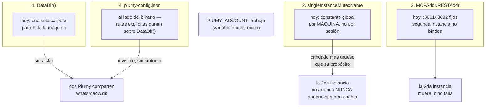
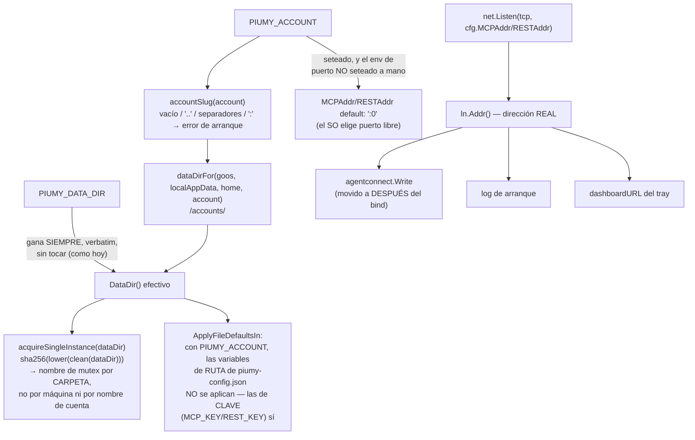

# S1 — Multi-cuenta: aislamiento por cuenta (ct-2026-09-20-1100)

Contrato madre: `ct-2026-07-19-0636-multi-cuenta-db-por-número-ui-selector-c`.
Solo el motor — sin distintivo visual, sin bandeja, sin selector de dashboard
(esos son peldaños posteriores).

## El problema — cuatro puntos donde dos instancias chocan hoy

Los primeros tres son visibles apenas se corre `go run` desde `coderoot`. El
cuarto (punto 4) es el que Citrino midió como el que no se ve: la instalación
real del boss tiene `piumy-config.json` con rutas explícitas al lado del
`.exe`, y una ruta explícita le gana a `DataDir()` — sin tocarlo, la cuenta
nueva volvería a caer en la sesión de WhatsApp de la instalación default, sin
ningún síntoma hasta que las dos cuentas se pisen de verdad.

## El fix — una sola entrada, se deriva todo

## Qué NO se toca

- `appMutexName`/`appmutex_windows.go` — del instalador, global, tiene que
  matchear `AppMutex` del `.iss` verbatim. Prohibido en el contrato.
- El fail-OPEN de `acquireSingleInstance` ante cualquier error de la API de
  Windows, y el uso de un mutex de SO (no un lock file/PID) — el kernel lo
  libera solo cuando el proceso muere, sea como sea.
- `agent-connect.json` como archivo de descubrimiento — ya asume que el
  puerto puede cambiar entre sesiones, no hace falta un registro nuevo.
- `PIUMY_DATA_DIR` sigue ganando por encima de todo, exactamente como hoy —
  ni siquiera se le agrega `accounts/<slug>` encima si está seteada.
- Sin `PIUMY_ACCOUNT`, cero cambio de comportamiento: misma carpeta, mismos
  puertos fijos, mismo `agent-connect.json` de siempre.

## Criterio de listo

- Sin `PIUMY_ACCOUNT`: `DataDir()`/puertos/`agent-connect.json` idénticos a
  hoy — probado con Y sin `piumy-config.json` al lado del binario.
- Dos instancias a la vez (`PIUMY_ACCOUNT=a`/`b`): las dos vivas, carpeta y
  `whatsmeow.db` propios, `agent-connect.json` con el puerto real bindeado.
- Mismo directorio, dos procesos: el segundo sale con el mensaje de hoy, sin
  tocar la sesión.
- Nombre de cuenta hostil (vacío, `..`, separadores) → error de arranque
  claro, nada escrito fuera de la carpeta.
- `go build ./... && go vet ./... && go test ./...` verde + cross-compiles.
- `MANUAL.md` actualizado.
