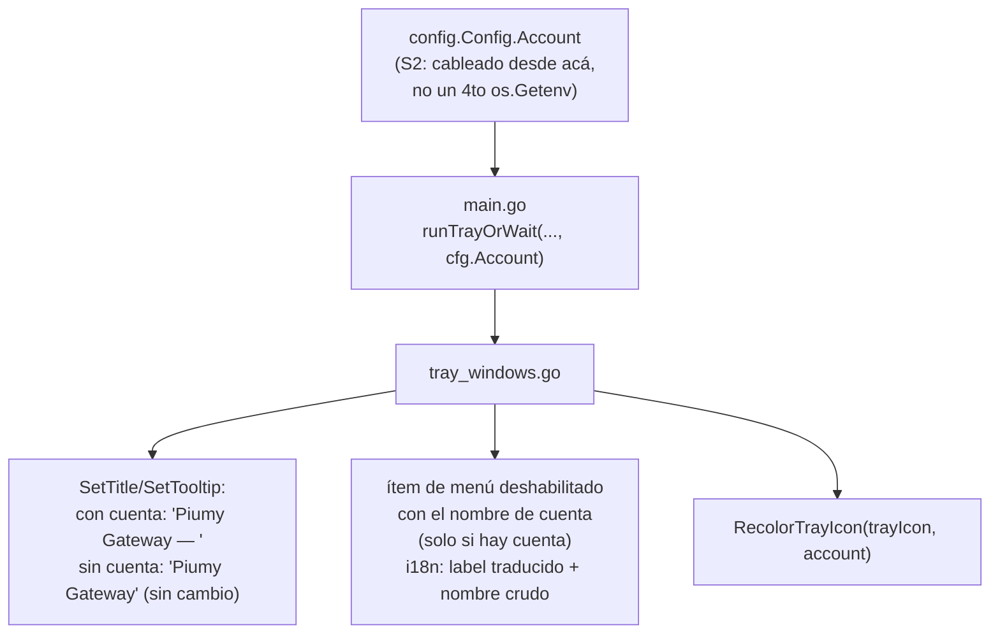
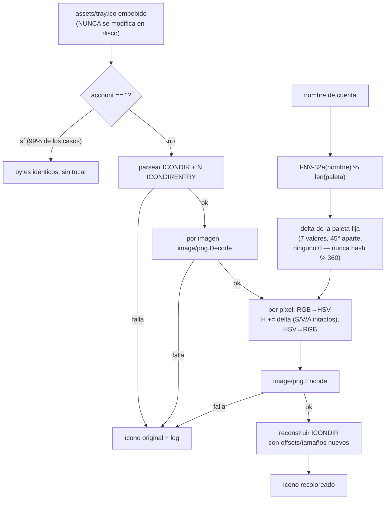

# S2 — Distintivo visual: logo de color por cuenta + nombre en la bandeja (ct-2026-09-20-1134)

Contrato madre: `ct-2026-07-19-0636-multi-cuenta-db-por-número-ui-selector-c`.
Continuación de S1 (aislamiento del motor, ya cerrado). Este peldaño es
100% visual — dos íconos hoy son indistinguibles y "Salir" está al lado
del botón que uno quiere tocar.

## El nombre de cuenta — bandeja

**Tensión con T37 — decisión de Citrino, no un olvido.** T37 acotó la
VERSIÓN al ítem de menú únicamente (boss verbatim: "en el tray en el menú,
no al pasar el mouse") — tooltip/título quedan sin tocar para la versión.
Acá el nombre de cuenta va en **título + tooltip + ítem de menú**, las tres
partes, a propósito: la versión informa, el nombre de cuenta previene un
click equivocado — y el mouse pasa por encima ANTES del click. Mismo
patrón (`i18n.T` + dato crudo sin traducir), objetivo distinto. Comentario
en el código para que nadie "corrija" esto pensando que contradice T37.

## El color — recoloreo en memoria, nunca en disco

- **Por qué rotación de tono y no reemplazo plano:** el ícono tiene bordes
  suavizados. Rotar conservando S/V deja los píxeles de saturación cero
  (negro) y los transparentes (alfa 0) intactos SOLOS — no hace falta
  tratarlos aparte — y el borde suavizado sigue suavizado (su saturación
  más baja hace que el corrimiento de color sea proporcionalmente menor
  ahí). Un reemplazo de "todo lo que se parezca al verde" ensucia el borde.
- **Por qué una paleta fija de deltas y no `hash % 360`:** dos cuentas
  separadas por unos pocos grados son indistinguibles a simple vista —
  exactamente lo que este peldaño viene a evitar. 7 deltas, 45° aparte,
  ninguno en 0 (0 = el verde de marca sin cambios) garantiza distancia
  mínima entre cualquier par Y contra el original.
- **Cualquier fallo cae al ícono embebido intacto + una línea de log** —
  nunca un ícono roto, nunca un arranque que dependa de que el parseo salga
  bien.
- Archivo nuevo **sin build tag** (`trayicon_recolor.go`) — es aritmética
  de imagen pura, no toca Windows; su test corre en cualquier plataforma.

## Qué NO se toca

- `assets/tray.ico` en disco — prohibido explícito del contrato, es la
  fuente de verdad de la marca.
- `appmutex_windows.go`/`singleinstance_*.go` — S1, no este peldaño.
- El dashboard mostrando la cuenta activa / selector — S3.
- Nombres reservados de Windows (`CON`, `NUL`, …) en `PIUMY_ACCOUNT` —
  decisión de Citrino: queda para el peldaño donde el nombre lo escribe una
  persona en la UI, anotado en el contrato padre.

## Criterio de listo

- Sin `PIUMY_ACCOUNT`: ícono embebido **byte a byte**, tooltip exactamente
  `"Piumy Gateway"`, sin ítem de cuenta.
- Dos cuentas distintas a la vez: dos colores distintos, cada tooltip con
  su nombre — **verificado con captura**, no deducido del código.
- Misma cuenta, dos arranques: mismo color (determinista).
- ICO corrupto o recoloreo fallido: arranca igual, ícono normal + log.
- Los dos idiomas (es/en).
- `go build ./... && go vet ./... && go test ./...` verde + cross-compiles.
- `MANUAL.md` actualizado.
