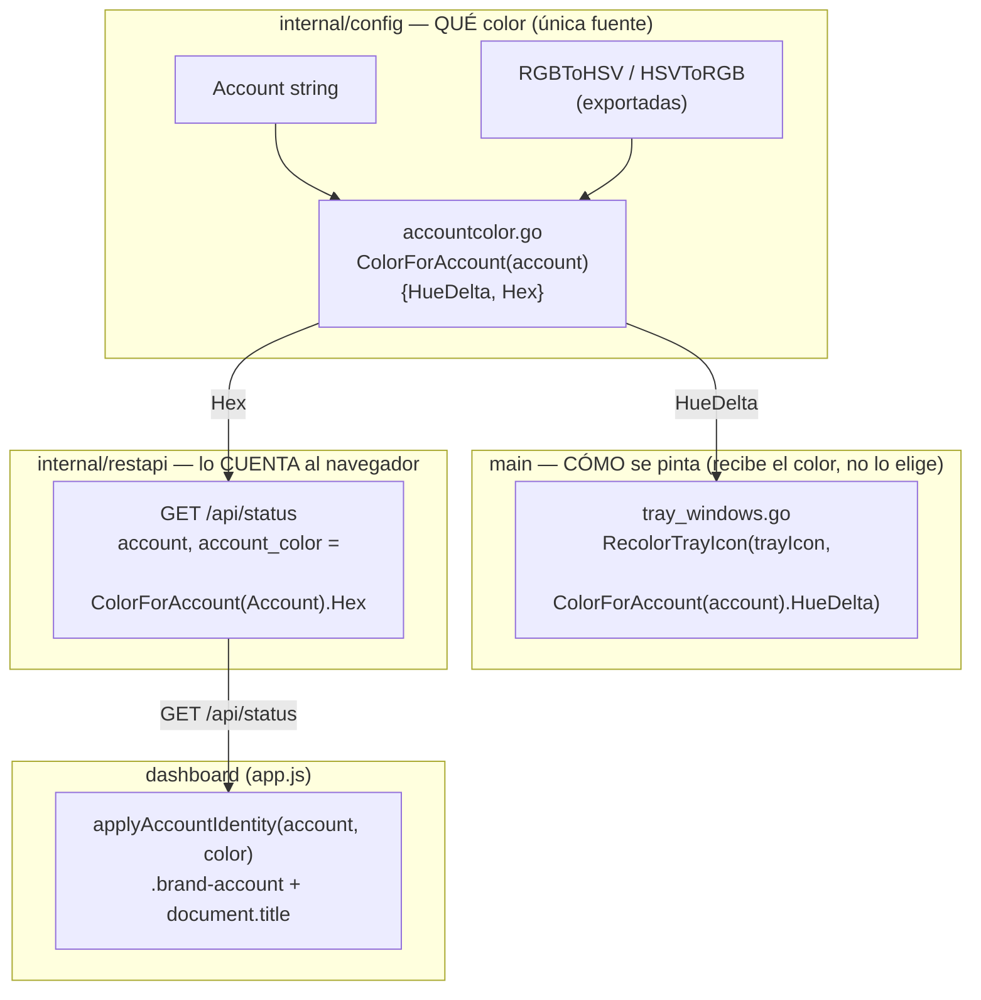
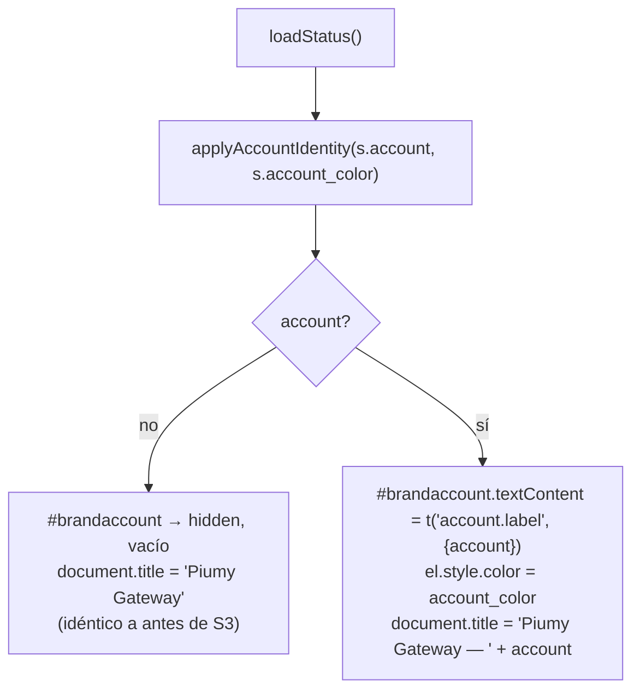

# S3 — El tablero dice de qué cuenta es, con el mismo color de la bandeja (ct-2026-09-20-1202)

Contrato madre: `ct-2026-07-19-0636-multi-cuenta-db-por-número-ui-selector-c`.
Continuación de S1 (aislamiento del motor) y S2 (distintivo visual en la
bandeja, ya cerrados). Mismo argumento de seguridad de S2, movido al
navegador: dos tableros en dos pestañas eran, antes de esto, tan
indistinguibles como los dos íconos antes de S2.

## La pieza de diseño: una sola fuente de color

El punto central del peldaño no es agregar campos — es que `internal/restapi`
**no puede importar `main`**, así que si el tablero calculara su propio
color, bandeja y tablero terminarían mostrando colores distintos para la
misma cuenta. Eso sería peor que no tener color: rompe la asociación que S2
acaba de construir.

- **Mudanza, no reescritura** (pedido explícito): `hueDeltas`/`hueIndex`/
  `rgbToHSV`/`hsvToRGB` se movieron de `trayicon_recolor.go` (S2) a
  `internal/config/accountcolor.go` **verbatim** — mismo algoritmo, mismos
  valores. `TestColorForAccountSurvivedTheMove` fija en duro los hex de
  "trabajo"/"personal" calculados ANTES de mover una línea; un valor
  distinto ahí es un bug de la mudanza, no una decisión de diseño.
- **El "verde de marca" para el hex del tablero está MEDIDO, no adivinado**:
  el píxel opaco más frecuente del PNG de 32×32 real (`#56f59f`,
  RGB 86/245/159) — así que rotar esa constante por el delta de una cuenta
  da el mismo resultado que rotar un píxel real del ícono. Es lo que hace
  que "el color del tablero es el MISMO que el de la bandeja" sea cierto
  por construcción.
- **`TestRecolorTrayIconMatchesConfigHex`** (`trayicon_recolor_test.go`) es
  la prueba cruzada de esa garantía: recolorea el píxel de marca exacto con
  el `HueDelta` de una cuenta y verifica que el resultado sea, byte a byte,
  el mismo `Hex` que `config.ColorForAccount` calculó.

## El tablero

- **`.brand-account`** vive dentro de `.brand` (el chip carita+"piumy" del
  encabezado), oculto por defecto vía el mismo utility `.hidden` que
  `factorypwalert`/`noterminalalert` ya usan.
- **`border: 1px solid currentColor`** en el CSS — un solo `style.color`
  puesto por JS pinta texto Y borde juntos, sin duplicar la propiedad.
- **`account.label`** (i18n) — renombrada desde `server.tray_account` (S2):
  ya no es solo de la bandeja, `app.js` pide la MISMA clave para su propio
  acento — mismo texto ("Cuenta: X") en los dos lugares, refuerza la
  asociación en vez de tener dos frases distintas para lo mismo.
- **`"Piumy Gateway"`/`"Piumy Gateway — "` nunca se traducen** — mismo
  criterio que `tray_windows.go` (T153 etapa 3c): es el nombre del
  producto, el nombre de cuenta es un dato. Declarados en
  `allowedNonProseLiterals` (`prose_sink_test.go`) con el motivo escrito,
  no un agujero silencioso en el escaneo automático de prosa sin traducir.

## Qué NO se toca

- `assets/tray.ico` — prohibido, igual que en S2.
- El favicon — fuera de alcance a propósito (pide un endpoint nuevo que
  sirva el PNG recoloreado por cuenta; el título de la pestaña ya resuelve
  la ambigüedad). Si en el uso real la pestaña sigue siendo ambigua sin él,
  es un peldaño aparte, no algo que este cierre decida solo.
- Crear cuentas / abrir otra desde el tablero, DB por número, selector
  histórico — peldaños posteriores, dependen de una respuesta del boss
  todavía pendiente.

## Criterio de listo

- Sin `PIUMY_ACCOUNT`: tablero pixel por pixel como hoy, título igual,
  `account`/`account_color` vacíos en `GET /api/status`.
- Con cuenta: nombre y acento en el encabezado, nombre en el título de la
  pestaña.
- **El color del tablero es el MISMO que el de la bandeja para esa
  cuenta** — verificado con las dos cosas a la vista en una sola captura,
  no deducido del código.
- La misma cuenta da el mismo color que antes de mover el código
  (`TestColorForAccountSurvivedTheMove`).
- Los dos idiomas (es/en).
- `go build ./... && go vet ./... && go test ./...` verde + cross-compiles.
