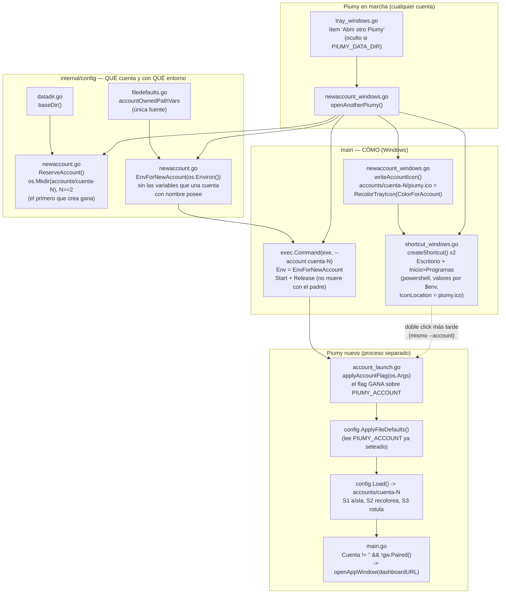

# S4 — Abrir otro Piumy desde la bandeja, con acceso directo (ct-2026-09-23-1908)

Contrato madre: `ct-2026-07-19-0636-multi-cuenta-db-por-número-ui-selector-c`.
Continuación de S1/S2/S3 (aislamiento por `PIUMY_ACCOUNT`, distintivo en la
bandeja, mismo color en el tablero). S4 no agrega aislamiento ni identidad:
agrega **la puerta** — hasta ahora abrir una 2ª cuenta exigía setear
`PIUMY_ACCOUNT` a mano.

## Flujo

## La pieza de diseño que no estaba en el contrato original

Un hijo lanzado desde la bandeja **hereda el entorno del padre**, y el
padre (cuenta por defecto) ya corrió `config.ApplyFileDefaults()`, que hizo
`os.Setenv` de `PIUMY_DB_PATH`/`WA_DB_PATH`/`ROUTER_PATH`/`STATUS_PATH`/
`MEDIA_DIR`/`BACKUP_DIR` desde `piumy-config.json`. En el hijo,
`envPath()` devuelve una variable explícita **verbatim**: el hijo abriría la
DB y la sesión de WhatsApp **vivas** del padre, no `accounts/cuenta-N`. El
mutex de instancia única no lo frena — se calcula sobre el directorio de
datos, y el del hijo es otro.

Un `.lnk` abierto desde el Explorador arranca con entorno limpio y no lo
sufre: solo el lanzamiento desde la bandeja. Por eso `EnvForNewAccount`
filtra al lanzar, con la misma lista (`accountOwnedPathVars`) que S1 ya usa
para no leer esas claves del archivo — una sola fuente de "qué posee una
cuenta con nombre". Además saca `PIUMY_DATA_DIR`, `PIUMY_MCP_ADDR` y
`PIUMY_REST_ADDR`: una carpeta o un puerto fijados en el padre nunca valen
para el hijo.

## Decisiones

- **El nombre lo elige Piumy** (`cuenta-N`, N>=2): sin diálogo de texto (un
  `.exe` windowsgui sin cgo no tiene uno barato). Decisión de Citrino,
  revisable por el boss.
- **El nombre se reserva con `os.Mkdir`**, no solo se "mira si no existe":
  con solo mirar, dos clics seguidos elegirían `cuenta-2` los dos (el hijo
  tarda en crear su carpeta). El primero que crea la carpeta gana.
- **La raíz de cuentas sale de la base del SO, no del `DataDir()` actual**:
  si el padre ya es `cuenta-2`, el siguiente es `cuenta-3`, no
  `accounts/cuenta-2/accounts/...`.
- **El ítem no aparece con `PIUMY_DATA_DIR` puesto**: `DataDir()` lo devuelve
  verbatim ignorando la cuenta — el hijo caería en la misma carpeta, chocaría
  con el mutex y saldría callado. Además una instancia de prueba
  (`PIUMY_DATA_DIR`) nunca puede tocar la raíz real.
- **`.lnk` con powershell y valores por variables de entorno**, no
  interpolados en el script: un usuario "O'Brien" (o una ruta con `'`)
  rompería o inyectaría. Sin dependencia nueva.
- **Cuenta con nombre + WhatsApp sin vincular al arrancar → el tablero se
  abre solo** (misma `openAppWindow` de la bandeja). Sin cuenta, nada cambia.
  Cubre también reabrir desde el `.lnk` antes de haber vinculado. La ronda
  de QR NO arranca sola: es la decisión P2 del boss (esperar el clic en
  "Conectar QR", sin rondas desperdiciadas).

## Invariante que no se negocia

Sin `--account` ni `PIUMY_ACCOUNT`, nada cambia: la instalación viva arranca
idéntica. `applyAccountFlag` con `[]` no toca el entorno;
`openDashboardAtStart("", ...)` es siempre `false`.

## Fuera de alcance (anotado, no hecho)

- Renombrar una cuenta; que el desinstalador borre los `.lnk` creados en
  runtime. (El ícono recoloreado del `.lnk` entró a S4 por pedido del boss —
  estaba excluido en el contrato original.)
- La cookie de sesión del tablero es la misma para todas las cuentas (mismo
  host, mismo nombre): entrar a una cuenta cierra la sesión de la otra.
- `PIUMY_REST_ADDR` fijado en `piumy-config.json` choca de puerto con toda
  cuenta con nombre (no está en `accountOwnedPathVars`) — hueco de S1, ticket
  aparte.
