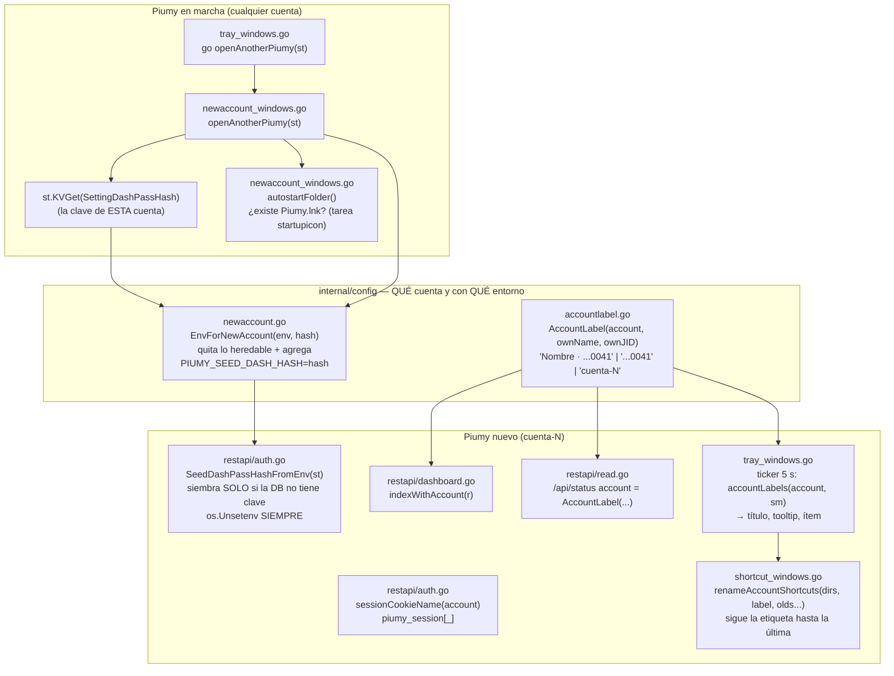

# S5 — Detalles de la segunda cuenta (ct-2026-09-23-2038)

Continuación de S4 (`S4-DIAGRAMA-ABRIR-OTRO-PIUMY.md`). Regla del boss: nada que
él tenga que **saber** y la pantalla no diga. S5 no agrega puertas nuevas:
cierra cinco costuras de la que S4 abrió.

## Flujo

## Decisiones

- **La siembra de la clave es eager, en el arranque** (mismo lugar y mismo
  molde que `SeedRecoveryEmailFromEnv`), no perezosa dentro de `passHash`.
  Razón: el contrato pide sacarla del entorno "apenas la lee", y solo un punto
  que corre SIEMPRE puede garantizarlo — si la DB ya tenía clave, `passHash`
  nunca la leería y el hash quedaría en el entorno para todo hijo (incluido el
  navegador que abre `openAppWindow`).
- **Prioridad de siembras**: la clave heredada gana siempre sobre
  `PIUMY_DASHBOARD_PASSWORD` (que el hijo puede heredar del padre si lo
  arrancó el instalador).
- **Padre sin clave todavía** (nadie inició sesión nunca): no manda semilla; el
  hijo cae en el mismo camino que el padre (default de fábrica / semilla del
  instalador) → misma clave igual.
- **Cookie**: sufijo = 8 hex de `sha256(account)`. `accountSlug` deja pasar
  espacios, `;`, `=` y unicode, y un nombre de cookie no. La principal (sin
  cuenta) conserva `piumy_session`: su sesión viva no se cae.
- **Etiqueta = decisión de Citrino** (2026-09-23): `"<PushName> · ...<últimos 4
  dígitos del número propio>"`; sin PushName `"...0041"`; sin vincular
  `"cuenta-N"`. Única por cuenta sin mirar las otras (dos cuentas pueden tener
  el mismo nombre de WhatsApp, no el mismo número). Una sola función que leen
  `/api/status`, el HTML del login, la bandeja y los `.lnk`. Sin cuenta
  devuelve `""` (la principal no cambia nunca). El color sigue saliendo del
  **id**. Techo: los 4 dígitos son un distinguidor, no una llave.
- **Puerta de la etiqueta en el código:** el `index.html` se sirve sin sesión y
  el puerto escucha en todas las interfaces (`:8092` / `:0`). Nombre y cola del
  número son datos personales, así que solo una petición desde esta misma
  máquina (la ventana de la app) los recibe; el resto de la red recibe el id.
  Tras iniciar sesión, `/api/status` da la etiqueta completa.
- **Bandeja: sondeo cada 5 s** de `state.Status`, no un canal de eventos: son
  dos campos que no avisan cambios y se mueven una vez en la vida de la cuenta.
  Techo: hasta 5 s de latencia; si se miran más campos, pasar a evento.
- **Renombrar `.lnk` sigue la etiqueta.** El número llega ANTES que el nombre
  (`recordOwnIdentity` escribe `OwnJID` siempre, `OwnName` cuando el
  `PushNameSetting` llega): la etiqueta va `cuenta-2` → `...0041` → `Nombre ·
  ...0041` en segundos y el archivo tiene que terminar en la última. Se busca
  por las etiquetas que pudo tener (`olds`), no solo por el id. Si el nombre
  nuevo ya existe en CUALQUIER carpeta no se renombra en ninguna (es el estado
  que la propia función deja → re-llamarla es no-op; y un nombre ajeno no separa
  Escritorio de Inicio).
- **Arranque con Windows**: solo si ya existe `{userstartup}\Piumy.lnk` — la
  marca de que el usuario eligió la tarea `startupicon`. Si no, no se crea.

## Invariante que no se negocia

Sin `--account` ni `PIUMY_ACCOUNT` nada cambia: misma cookie, mismo `<title>`
(`http.FileServer` sin tocar; test byte por byte contra el archivo embebido),
`account` vacío en `/api/status`, bandeja sin sondeo, sin siembra (no hay
`PIUMY_SEED_DASH_HASH`).

## Cómo se probó

Tests (`go test ./...`): cookie por cuenta (con sabotaje que reproduce el `401`
medido), siembra de clave (gana sobre la semilla del instalador, nunca pisa,
ignora un valor que no es bcrypt), etiqueta (dos cuentas, mismo nombre →
etiquetas distintas), HTML con etiqueta escapada y la puerta loopback, entorno
que `launchAccount` entrega de verdad (binario de test re-ejecutado como hijo,
con sabotaje), renombrado de `.lnk` paso a paso.
Smoke real con binario de prueba sin clics de escritorio: ver `MANUAL.md`.
