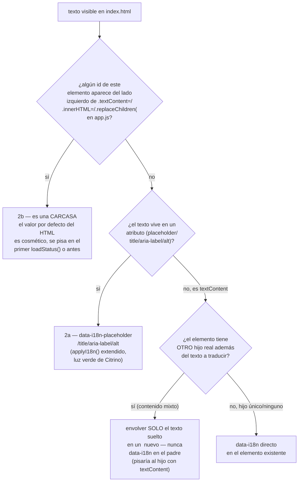
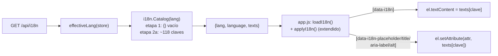

# T153 etapa 2a — index.html al catálogo (ct-2026-09-08-1656)

Diagrama hecho a mano, no vía `dflux_resolve` — el codemap todavía no indexa
`internal/i18n`/`internal/dashboard/web` para Go/JS (mismo gap que etapa 1).

## La costura real — no es "archivo vs. archivo", es "quién es dueño del texto"

Citrino cortó la etapa 2 en "`index.html` estático" (2a) vs. "`app.js`
runtime" (2b). El mapeo real, hecho con un grep exhaustivo de cada
`.textContent =`/`.innerHTML =`/`.replaceChildren(`/`.placeholder =`/
`.title =` de `app.js` contra cada id de `index.html`, mostró que la línea
divisoria no es el archivo — es si `app.js` vuelve a escribir ese elemento:

Ejemplos de C (2b, NO tocado en esta pasada): `#name`/`#num` (hero, pisado
por `loadStatus` con el string en español EN app.js), `#moodlabel`,
`#status`, todos los badges de valor (`#badgewa`.../`#badgehistory`),
`#more`, `#draftcount`, `#edittitle`/`#draftEditTitle`/`#draftRejectTitle`,
`#agentdelete_text`/`#approver_text`, `#qrnote` (con trampa: su default en
HTML es texto real, pero `loadStatus` lo reescribe con "Escaneá..." o
"Conectando…" según el estado — parece estático y no lo es), el placeholder
de `#search` (`SEARCHABLE_TABS`, vive en `app.js`), y `#herostatus_text` +
`#herostatus_pencil` (el caso más extremo: `renderHeroStatusView` los
destruye con `el.replaceChildren()` y los reconstruye desde cero en cada
render, con `title`/`aria-label` hardcodeados en el JS).

Ejemplo de G (contenido mixto, wrap mínimo): la barra de estado
(`Antena`/`Cifrado`/`Historial`/`Privacidad`, cada uno bare-text junto a un
`<b>` dinámico o un ícono), las 5 filas de la pestaña Reglas (label +
`` anidado), el mini-stats (`cola:`/`enviados:`/
`agentes:` junto a un `<b>` contador).

## El endpoint no cambió de forma, solo de contenido

Etapa 2b: sacar los ~40 puntos de texto que arma `app.js` (badges, hero,
títulos de modal dinámicos, estados vacíos, `SEARCHABLE_TABS`) a un
`t(clave)` propio, llamado donde ese texto se construye — no un sweep como
`applyI18n()`, porque el valor se arma junto con datos (nombres, contadores)
que sí cambian por chat/estado.
