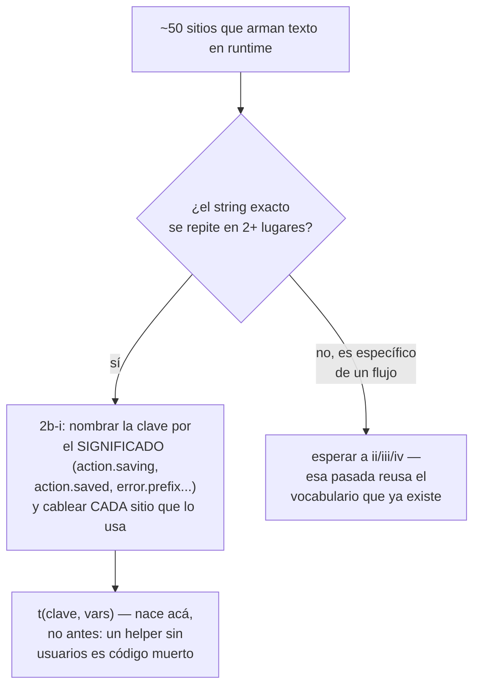
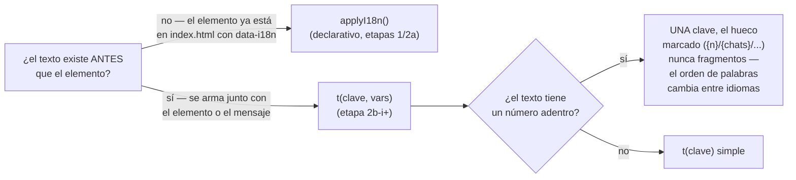
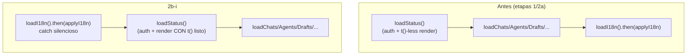

# T153 etapa 2b-i — el vocabulario compartido (ct-2026-09-08-1656)

Diagrama hecho a mano, no vía `dflux_resolve` — el codemap todavía no indexa
`internal/i18n`/`internal/dashboard/web` para Go/JS (mismo gap que las
etapas anteriores).

## Por qué 2b-i va primero: baja el costo de 2b-ii/iii/iv

De los ~50 sitios que arman texto en runtime, la mayoría repite el MISMO
puñado de strings ("Guardando…", "✓ Guardado.", "Error: "). 2b-i les da
nombre por lo que SON, no por dónde aparecen — así ii/iii/iv reusan en vez
de crear casi-duplicados (la desincronización que todo el catálogo vino a
evitar, esta vez adentro del catálogo mismo).

## t(clave, vars) vs. applyI18n() — cuándo usar cada uno

`badge.backup_summary` es el ejemplo de E: `"✅ chats {chats} · grupos
{groups} · Contactos {contacts} · Números {numbers}"` en español,
`"✅ chats {chats} · groups {groups} · Contacts {contacts} · Numbers
{numbers}"` en inglés — "groups" se movió de posición relativa a como se
leería si se hubiera partido en fragmentos y traducido cada palabra suelta.

## El bootstrap se reordenó — loadI18n() antes de loadStatus()

`loadStatus()` dobla como sonda de auth (fue así desde antes de T153) Y
ahora usa `t()` para armar el status/badges. Si corriera antes de que el
catálogo cargara, el primer pintado mostraría claves entre corchetes.

## El hallazgo fuera de index.html/app.js: texto escondido en CSS

`style.css`'s `.hero-status-text:empty::before { content: "Agregar
estado…"; }` — un tercer lugar donde vivía texto de interfaz, ni HTML ni
JS. Resuelto con `content: attr(data-placeholder)`, `app.js` pinta el
atributo en cada render de `renderHeroStatusView`.

## Lo que NO entra en 2b (ni en ninguna etapa de T153): el mensaje del servidor

`post()` (app.js) hace `throw new Error(data.error || ...)` — TODO
`.catch(function(e){...e.message...})` hereda el string que el BACKEND
mandó, que puede venir en español aunque el prefijo "Error: " ya esté
traducido. Corregir esto es tocar los mensajes de error del lado Go
(`internal/restapi/*.go`), otra superficie — Citrino amplió la etapa 3 para
absorberlo junto con los avisos automáticos. Esta pasada solo LISTA los 25
sitios donde pasa (ver la nota del contrato), sin traducir ni envolver
`e.message`.
