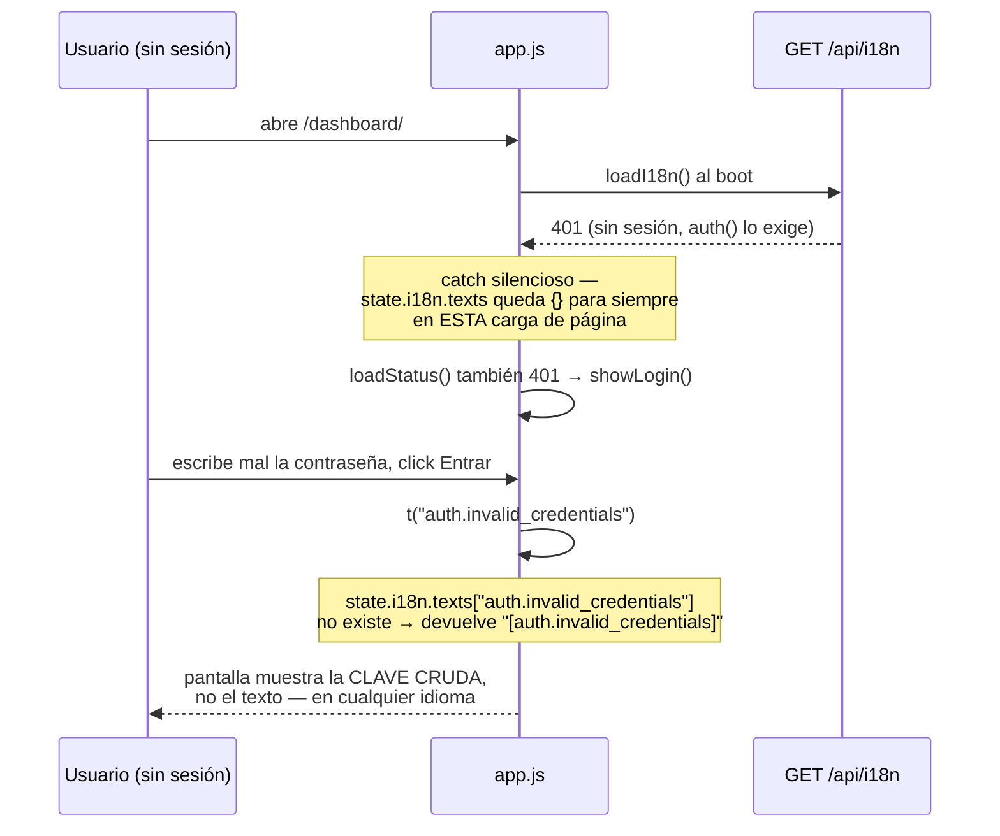
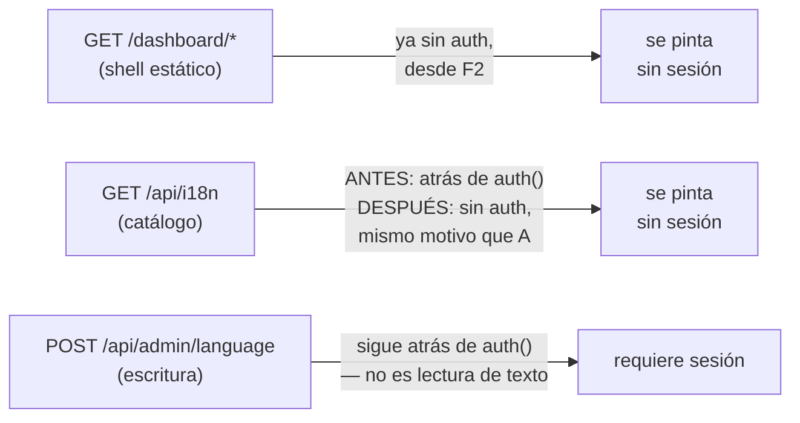

# T153 etapa 2b-ii — login/recuperación + el bug del catálogo tras auth (ct-2026-09-08-1656)

Diagrama hecho a mano, no vía `dflux_resolve` — mismo gap conocido de las
etapas anteriores.

## El bug: la pantalla que necesita el catálogo es la única que no puede pedirlo

`GET /api/i18n` nació atrás de `d.auth()` en la etapa 1, sin que nadie lo
notara — las pruebas y la verificación manual de 2a/2b-i corrían con
`PIUMY_REST_KEY` vacía (auth abierta de fábrica), así que el candado nunca
se probó cerrado. 2b-ii lo hizo, porque login/recuperación SON la pantalla
de antes-de-la-sesión, y ahí apareció:

## El arreglo: mismo precedente que el shell estático

`dashboard.go` ya resolvió este problema exacto para `index.html`/`app.js`
en la etapa F2: servirlo SIN auth porque "carries zero secrets... and its
own JS is what shows the login overlay, so it has to be reachable before a
session exists". El catálogo de i18n es el mismo caso — son 136 strings de
interfaz compilados en el binario, nada del dueño, nada de credenciales.

`TestGetI18nServedWithoutAuth` fija esto: arma un `Deps{APIKey: "..."}` (la
única forma de simular una instalación real en un test), pide el catálogo
SIN key, y exige 200. Revertir el fix hace fallar el test antes de que un
usuario real vea el bug.

## La precisión de seguridad de 2b-ii: traducir sin agregar un oráculo

Antes de tocar los 3 mensajes de login/recuperación, se verificó que
ninguno usa `e.message` (todos plantan un texto propio, ignoran lo que
diga el backend) y que el backend YA responde igual en éxito y error para
`requestRecoveryCode`. Eso significa: no hay nada que un idioma pueda
revelar de más que el otro no revele — la traducción es 1:1, sin necesidad
de re-diseñar ningún mensaje.

| Clave | Por qué es vago a propósito |
|---|---|
| `auth.invalid_credentials` | No dice si falló el usuario o la contraseña — no confirma que una cuenta existe |
| `auth.invalid_or_expired_code` | Un código vencido y uno inválido dan el mismo texto — no revela cuál pasó |
| `auth.code_sent_generic` | Mismo mensaje en `.then` y `.catch` de `requestRecoveryCode` — no confirma si el método (WhatsApp/correo) está configurado |
