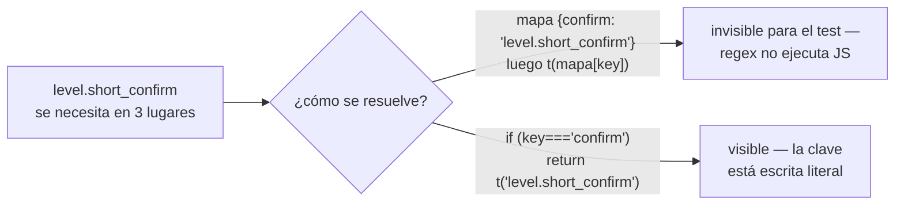
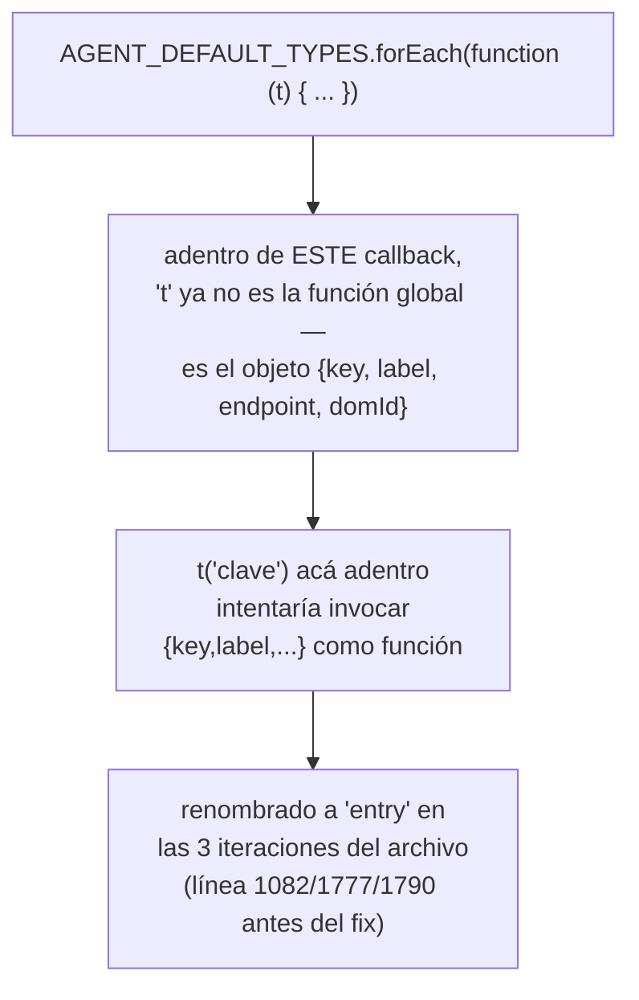

# T153 etapa 2b-iii — agentes + el cruce como test de repo (ct-2026-09-08-1656)

Diagrama hecho a mano, no vía `dflux_resolve` — mismo gap conocido de las
etapas anteriores.

## El cruce manual se convirtió en test — para que no dependa de que alguien se acuerde

Citrino corría un script a mano después de cada pasada. Con ~100 claves más
por delante (2b-iii + 2b-iv), automatizarlo era la única forma de que
siguiera pasando. `TestAllKeysMatchBetweenFrontendAndCatalog` lee
`app.js`/`index.html` con regex y los cruza contra `esCatalog`/`enCatalog`:

```mermaid
flowchart TD
    A["app.js: cada t(\"clave\")"] --> C{"¿existe en\nesCatalog Y enCatalog?"}
    B["index.html: cada data-i18n*=\"clave\""] --> C
    C -->|"no"| F1["FALLA: clave pedida, no existe\n(el bug '[clave]' en pantalla,\nde etapa 2b-ii, hecho visible ANTES\nde que un usuario lo vea)"]
    C -->|"sí"| D{"¿toda clave de\nesCatalog fue pedida?"}
    D -->|"no"| F2["FALLA: clave sobra,\nnadie la usa"]
    D -->|"sí"| OK["verde"]
```

**La trampa que el propio Citrino pisó escribiendo SU script, y que este
test evita a propósito:** una clave que solo existe como VALOR de un campo
de un objeto (`{key: "confirm", shortKey: "level.short_confirm"}`) es
invisible para un regex que solo busca `t("...")` literal — el test la
reporta "sin usar" aunque el JS la use en tiempo de ejecución. La
corrección NO fue mejorar el regex (frágil, cualquier forma nueva de
indirección lo vuelve a romper) sino no escribir la indirección: `app.js`
resuelve estos casos con un if-chain de `t("clave literal")`, nunca un
mapa `{key: "clave"}` — ver `agentTypeLabel`/`originLevelShort`.



Probado en rojo antes de darlo por bueno (dos veces, en las dos
direcciones): sacar `action.save` del catálogo — falla "falta"; agregar
una clave sin usar — falla "sobra". Restaurado y confirmado verde.

## El hallazgo de esta pasada: un parámetro de loop llamado igual que la función de traducción



Encontrado ANTES de escribir ninguna traducción rota — el grep
`\bfunction\s*\(\s*t\s*[,)]` sobre `app.js` completo, hecho por disciplina
antes de tocar código, no porque algo ya hubiera fallado.

## LEVELS: compartido con 2b-iv, tocado lo mínimo

`LEVELS`/`LEVEL_BY_KEY` alimenta `buildOriginLevelControl` (esta pasada,
agentes) Y `renderLevelCell`/la leyenda de la tabla de chats (2b-iv, sin
cerrar). Se tradujo SOLO `.short` — lo único que `buildOriginLevelControl`
lee — sin tocar `.label` ni el array en sí, para no meterse en código que
2b-iv todavía no cerró.
