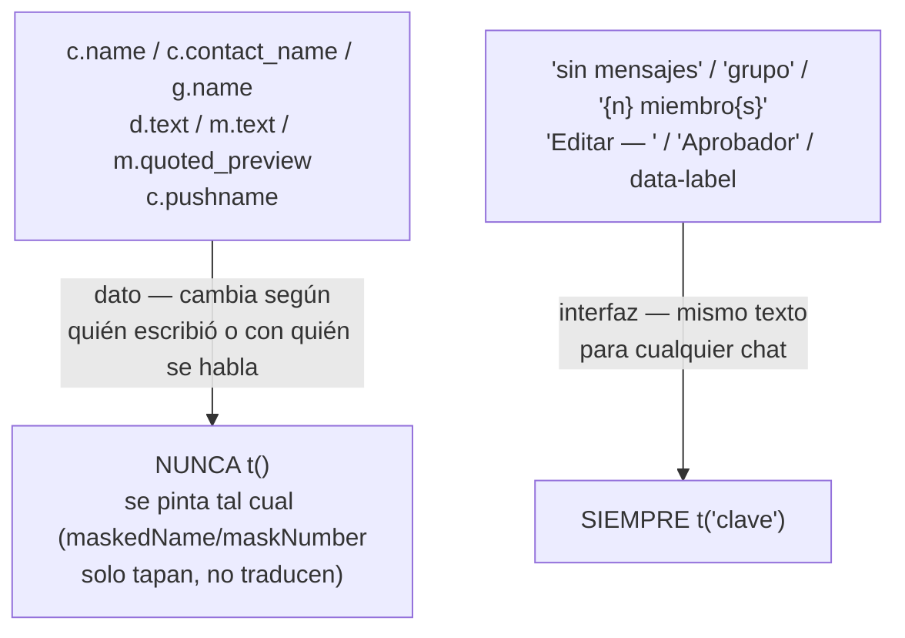
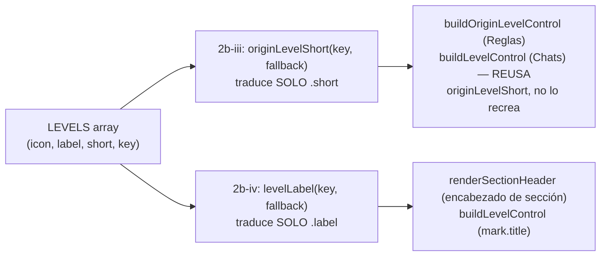
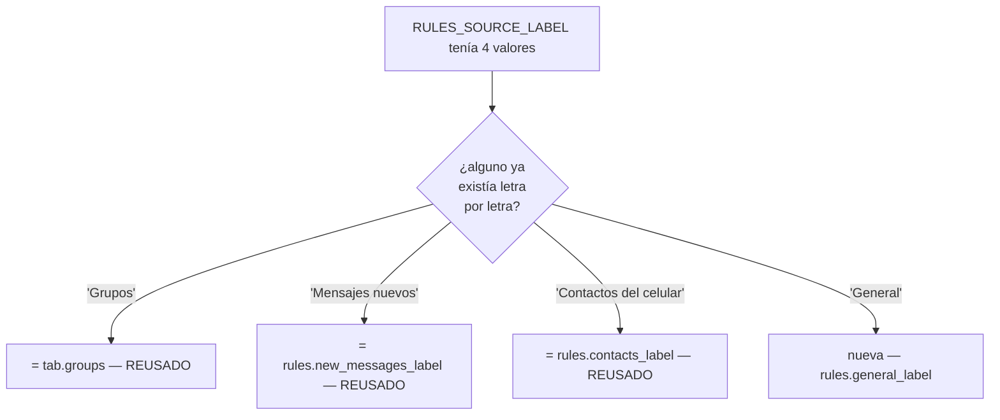

# T153 etapa 2b-iv — chats, grupos, contactos, drafts: última pasada del tablero (ct-2026-09-08-1656)

Diagrama hecho a mano, no vía `dflux_resolve` — mismo gap conocido de las
etapas anteriores.

## La frontera dato/interfaz, aplicada a cada función tocada

Precisión de Citrino, no negociable: "si cambia según quién escribió o con
quién se habla, es dato". Esta pasada es la que queda más cerca de esa
frontera — nombres de chat/grupo/contacto y texto de mensajes NUNCA pasan
por `t()`, solo lo que rodea al dato.



## LEVELS se termina acá

2b-iii tradujo solo `.short` (`originLevelShort`, consumido por
`buildOriginLevelControl` en la pestaña Reglas) y dejó `.label` sin tocar a
propósito, para no invadir esta pasada. Acá se completa con el mismo
patrón — otro if-chain, no un mapa `{key: "clave"}`:



`buildLevelControl` (el control de nivel de la tabla Chats — distinto de
`buildOriginLevelControl`, que es el de la pestaña Reglas) necesitaba el
mismo `.short` que 2b-iii ya resolvió — se llamó a `originLevelShort`
directo, sin duplicar la función ("reusá, no recrees", Citrino).

## Dos trampas de indirección más, mismo diagnóstico que 2b-iii

`RULES_SOURCE_LABEL` y `SEARCHABLE_TABS` eran mapas `{clave-de-dominio:
"texto"}` — invisibles para `TestAllKeysMatchBetweenFrontendAndCatalog`
porque el test lee `app.js` con regex, nunca ejecuta el JS:

```mermaid
flowchart TD
    A["RULES_SOURCE_LABEL['tipo:grupo'] = 'Grupos'"] -->|"el test busca\nt(\"...\") literal"| B["invisible — 'Grupos' nunca\naparece como t(\"clave\")"]
    C["rulesSourceLabel(source) {\n  if (source === 'tipo:grupo') return t('tab.groups')\n}"] -->|"clave escrita literal"| D["visible — el test la ve\ny la cruza contra el catálogo"]
```

Convertidos a `rulesSourceLabel(source)`/`searchPlaceholder(name)`, mismo
molde que `agentTypeLabel`/`originLevelShort` (2b-iii). Los objetos
originales (`HISTORY_BADGES` para `historyBadgeTitle`) se dejaron intactos
donde todavía guardan datos NO traducibles (`cls`/`glyph`) junto al texto
original — el texto original queda como documentación + fallback, la
traducción de verdad pasa siempre por la función.

## El cruce de valores que el test no puede hacer

Citrino, dispatch de 2b-iv: *"tu test acusa una clave que nadie usa, pero NO
acusa dos claves distintas con el mismo texto. Esa la tenés que mirar vos."*
Cada clave nueva candidata se comparó a mano contra el catálogo completo
ANTES de agregarla:



El mismo cruce, a la inversa, confirmó que `data-label` de las 4 `<td>`
(`Conversación`/`Nivel`/`Agente`/`Reglas` — el atributo que la vista
responsive/mobile pinta vía CSS `content: attr(data-label)`, el mismo tipo
de texto-escondido-en-CSS que el bug de `hero-status-text` en 2b-i) no
necesitaba NINGUNA clave nueva: los cuatro valores ya eran
`table.conversation`/`table.level`/`table.agent`/`tab.rules` letra por
letra.

Y el cruce contrario — dos conceptos parecidos que en realidad NO son el
mismo texto — para `timeAgo`: aunque `time.ago_seconds` ("hace {n}s") y
`time.ago_minutes` ("hace {n}m", 2b-i) ya existían, `timeAgo` arma "hace {n}
min" (con la unidad escrita, no la letra sola) — texto distinto, clave
nueva (`time.ago_minutes_verbose`), no una reutilización forzada de algo
que solo se parece.

## Verificación en vivo

Instancia aislada (DB/puertos propios, mutex temporal revertido antes de
commitear), `PIUMY_REST_KEY` SET (modo real de despliegue, no el candado
abierto): `GET /api/i18n` sirvió las 43 claves nuevas en español; `POST
/api/admin/language {"language":"en"}` + `GET /api/i18n` las sirvió en
inglés, con las 3 coincidencias ES=EN esperadas (`chat.alias_prefix`,
`rules.general_label`, `media.sticker_alt`) y ninguna más. `GET /api/chats`
sin la clave devolvió 401 — confirma que el candado estaba puesto durante
la prueba.
