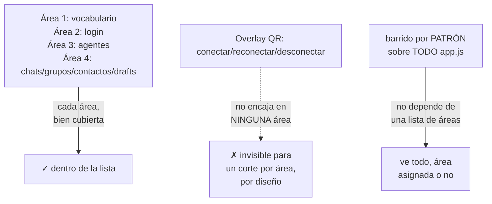
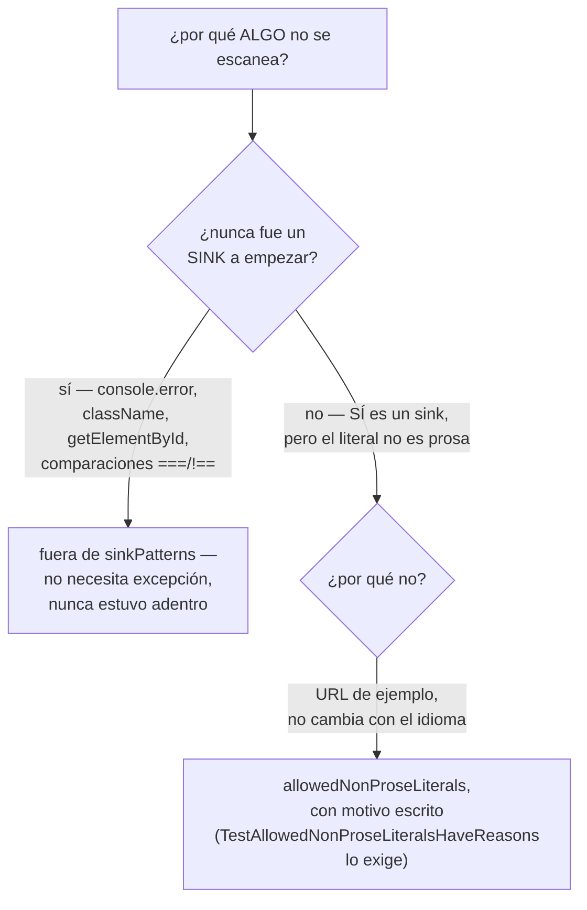
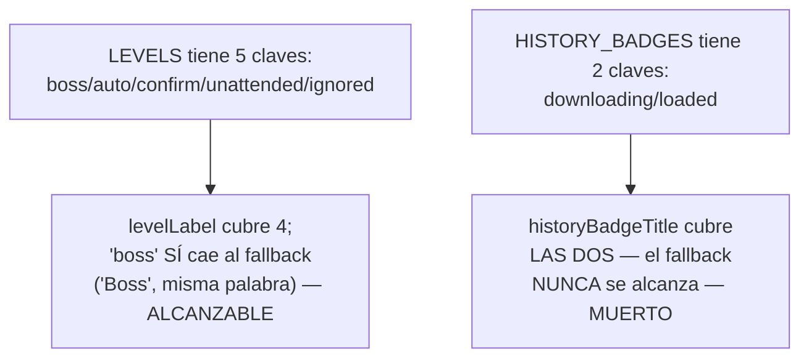

# T153 etapa 2b-v — el agujero era de área, no de traducción (ct-2026-09-08-1656)

Diagrama hecho a mano, no vía `dflux_resolve` — mismo gap conocido de las
etapas anteriores.

## Por qué el corte por área no podía cerrar solo

2b-i..iv se cortaron por ÁREA (vocabulario compartido, login, agentes,
chats/grupos/contactos/drafts). Citrino armó ese corte a partir de una
lista de áreas — y una lista, por diseño, no puede demostrar que no falta
nada: solo dice qué SÍ está cubierto. El overlay QR nunca encajó en
ninguna de las cuatro áreas, así que ninguna pasada lo tocó — no por un
error de traducción, sino porque el propio corte tenía una forma que no
podía verlo.



## Dos scripts de Citrino, dos generaciones de puntos ciegos

El propio Citrino documentó los agujeros de sus dos versiones al pedir
esta etapa — la base del pliego del test nuevo:

```mermaid
flowchart LR
    A["script v1"] -->|"no mira plantillas\ncon comillas invertidas"| M1["se le escapan backticks"]
    A -->|"no mira palabras\ncortas sin acento"| M2["se le escapa 'Guardar'"]
    B["script v2"] -->|"sigue sin ver texto\nDENTRO de una plantilla\ncon interpolación"| M3["`Hola ${name}` invisible"]
    B -->|"sigue sin ver\ncadenas con HTML"| M4["innerHTML mixto invisible"]
```

`TestNoUntranslatedProseInKnownSinks` (`internal/i18n/prose_sink_test.go`)
cierra los cuatro: `sinkLiteralPattern` matchea comillas dobles, simples Y
invertidas por igual; `looksLikeProse` nunca exige acento (2+ caracteres
con una sola letra latina alcanza); y al escanear el CONTENIDO completo de
cada literal capturado (sin distinguir si tiene interpolación o HTML
adentro), un backtick con `${...}` o un `innerHTML` con etiquetas mezcladas
con texto se ven igual que cualquier otro literal — ninguno de los dos
necesita tratamiento especial porque ninguno estaba excluido a propósito.

## El margen declarado, no un efecto lateral del regex

Citrino: *"va a necesitar un margen para lo que legítimamente no se
traduce... ese margen tiene que estar declarado y a la vista, no ser un
efecto lateral del regex."* Dos mecanismos distintos, cada uno para un tipo
de exclusión distinto:



La otra mitad del margen — LEVELS/AGENT_DEFAULT_TYPES/HISTORY_BADGES
guardando texto original como documentación/fallback — NO es una excepción
del regex: esos arrays quedan **fuera de `sinkPatterns` por diseño**,
verificado a mano (no por este test) que cada campo se lee siempre a
través de un resolver (`levelLabel`/`originLevelShort`/`agentTypeLabel`/
`historyBadgeTitle`) que traduce todo salvo lo que de verdad es la misma
palabra en los dos idiomas. Ese comentario, largo a propósito, vive al
principio de `prose_sink_test.go` — quien agregue un array parecido tiene
que rehacer esa verificación, no darla por sentada.

## Un hallazgo que dejó de necesitar margen: HISTORY_BADGES.title

2b-iv había dejado `HISTORY_BADGES.title` en español como fallback,
copiando el patrón de `LEVELS`. Pero hay una diferencia real entre los dos:



Un fallback que nunca se alcanza no es documentación, es texto en español
durmiendo sin ninguna función real — se sacó el campo del objeto en vez de
justificarlo como excepción (ver el comentario en `historyBadgeTitle`,
`app.js`).

## Verificación en vivo

Instancia aislada (DB/puertos propios en el scratchpad, mutex temporal
revertido antes de commitear), `PIUMY_REST_KEY` puesta: `GET /api/i18n`
sirvió las 13 claves nuevas en español; `POST /api/admin/language` a
inglés + `GET /api/i18n` de nuevo las confirmó en inglés, con las 6
coincidencias ES=EN esperadas (Endpoint/Terminal ID/PIN/ID/Ping/kill,
préstamos ingleses ya establecidos). `GET /api/chats` sin clave devolvió
401 durante toda la prueba.

`TestNoUntranslatedProseInKnownSinks` probado en rojo tres veces antes de
confiarlo: (1) un literal reintroducido a mano en `badgegovernor` — falla,
restaurado; (2) la excepción de la URL sacada de `allowedNonProseLiterals`
— el placeholder de ejemplo falla en sus 3 call sites, restaurada; (3) el
motivo de esa misma excepción vaciado — `TestAllowedNonProseLiteralsHaveReasons`
falla, restaurado. Las tres veces, verde confirmado después.
