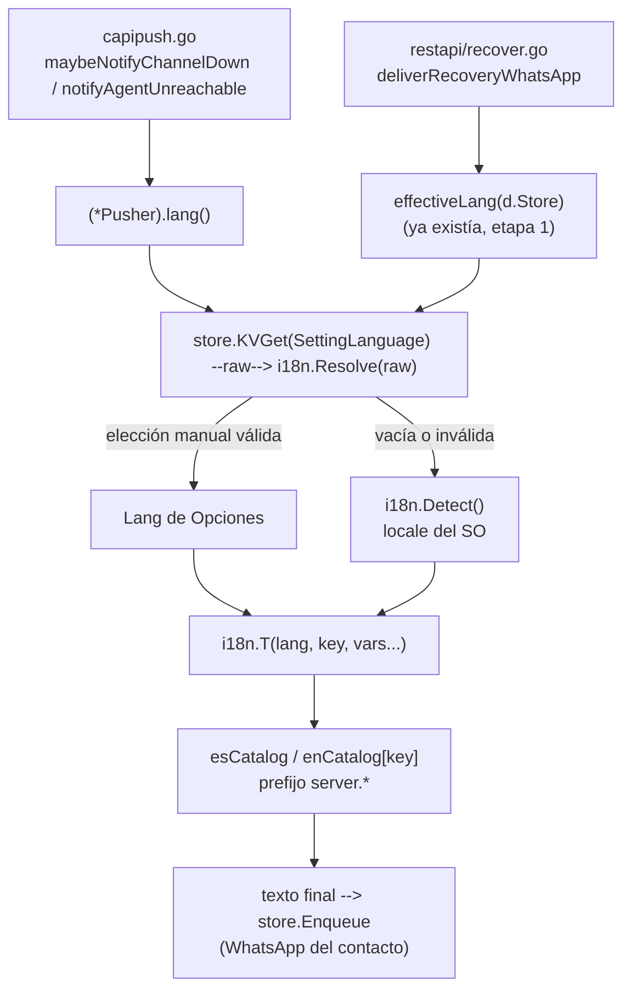
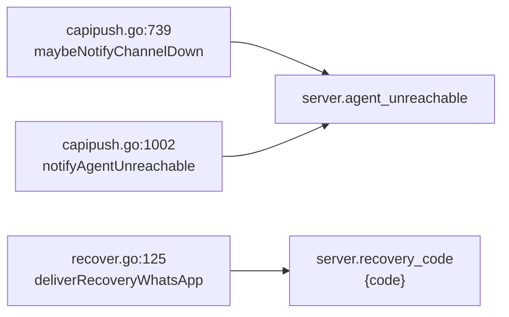

# T153 etapa 3a — mecanismo Go de textos + avisos automáticos (ct-2026-09-16-1803)

Diagrama hecho a mano, no vía `dflux_resolve` — mismo gap conocido de Go en
el codemap (`internal/i18n`/`internal/capipush` no indexados; solo `Store`
resolvió `grounded`, el resto `to-build` pese a existir).

## El mecanismo



`i18n` sigue siendo hoja: no importa `store`. El llamador (`capipush`/
`restapi`) lee `KVGet` y pasa el `raw` a `Resolve` — la misma regla que
`restapi.effectiveLang` usaba a mano, ahora una sola implementación.

## Por qué dos claves nuevas y no cuatro

Los 3 call sites medidos por Citrino son solo 2 mensajes distintos:



`server.agent_unreachable` es verbatim del dueño — sin hueco. `server.recovery_code`
es plantilla entera con `{code}` adentro (nunca `"...: " + code`, mismo criterio
que `badge.backup_summary` en el catálogo del tablero).

## La trampa: el string pineado sobrevive al catálogo

```mermaid
flowchart TD
    A["capipush_test.go:1257 / :1434 / :1585\nesperan Text == \"agente sin conexión\" literal"] -->|"sin override,\nDetect()=es en esta máquina"| B["Resolve(\"\") -> Detect() -> ES"]
    B --> C["T(ES, \"server.agent_unreachable\")\n= esCatalog[...] = \"agente sin conexión\""]
    C -->|"byte a byte igual"| A
```

Los tres tests corrieron sin tocarlos — confirmado (`go test ./internal/capipush/...`
verde, incluidas las tres funciones que citan el string). Riesgo señalado a
Citrino aparte: esos tests hoy son verdes SOLO porque `i18n.Detect()` en la
máquina que corre la suite devuelve `es` (registro `Control
Panel\International` de Windows) — antes del catálogo el string era un
literal Go, inmune al locale de la máquina. Con el catálogo de por medio,
una máquina cuyo Windows esté en inglés vería estos tres tests fallar aunque
ningún texto se haya movido. No es una regresión de este sub-cambio (el
mecanismo hace exactamente lo que el contrato pidió) — es una dependencia
nueva que antes no existía, y que solo se manifiesta en máquinas con otro
locale. Documentado, no resuelto acá — no estaba en el alcance de 3a y
tocar la resolución de idioma para los tests pineados excede lo pedido.

## El test hermano — mismo cruce que el front, del lado Go

```mermaid
flowchart TD
    A["i18n.T(lang, \"server.xxx\", ...)\nen TODO el árbol .go\n(salteando worktrees/.claude/etc.)"] --> B["TestServerKeysMatchGoCallSites"]
    B -->|"clave pedida"| C{"¿existe en\nesCatalog Y enCatalog?"}
    B -->|"clave server.* del catálogo"| D{"¿algún i18n.T(...)\nla pide?"}
    C -->|no| E["FALLA"]
    D -->|no| E
```

`TestAllKeysMatchBetweenFrontendAndCatalog` excluye `server.*` de su propio
barrido (motivo escrito ahí) — sin este hermano el lado Go quedaba sin
guardia, que es justo el hueco que el contrato pidió cerrar.

## Verificación

`go build ./... && go vet ./... && go test ./...` verde — incluye los tres
tests pineados de `capipush_test.go` (`agente sin conexión` intacto, sin
editarlos) y los dos tests nuevos (`TestServerKeysMatchGoCallSites`,
`TestResolve`/`TestT` en `lang_test.go`).
