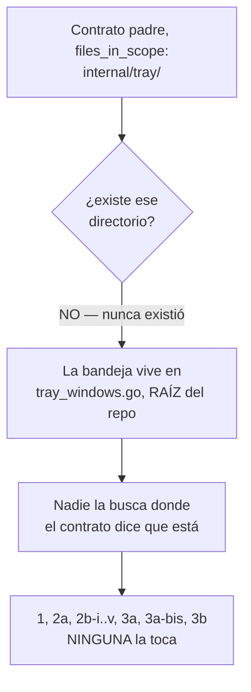
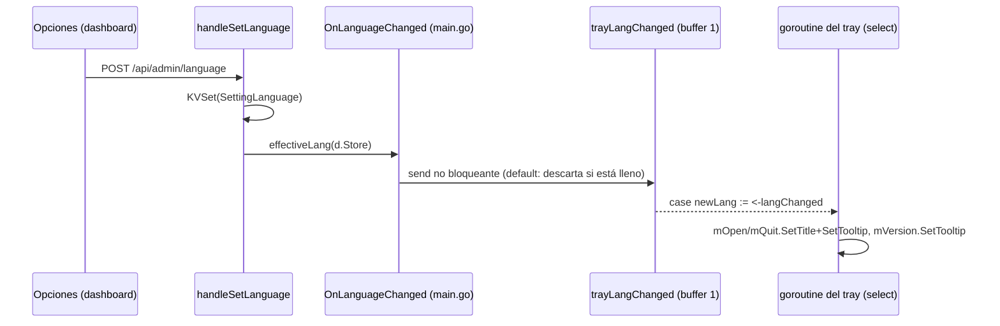

# T153 etapa 3c — la bandeja del sistema, el hueco que quedó (ct-2026-09-16-1854)

Diagrama hecho a mano, no vía `dflux_resolve` — mismo gap conocido de Go en
el codemap (ver etapas 3/3a/3b).

## Por qué el hueco existió seis etapas seguidas



Mismo patrón que el área de QR (2b-v) — enumerar por área deja huecos —
agravado: la enumeración apuntaba a una ruta que no existe.

## Paso 1 — los 5 textos, cableados

```mermaid
flowchart TD
    A["main.go: KVGet(SettingLanguage) → i18n.Resolve"] -->|"lang, resuelto\nUNA vez al arrancar"| B["runTrayOrWait(ctx, stop,\ndashboardURL, lang, langChanged)"]
    B --> C["mVersion: i18n.T(lang, tray_version_tooltip)"]
    B --> D["mOpen: i18n.T(lang, tray_open_dashboard[_tooltip])"]
    B --> E["mQuit: i18n.T(lang, tray_quit[_tooltip])"]
    F["\"Piumy Gateway\"\n(SetTitle/SetTooltip del ícono,\nprefijo del ítem de versión)"] -.->|"NUNCA i18n.T\nnombre del producto"| B
```

`tray_other.go` (el stub no-Windows) recibe el mismo `lang`/`langChanged`
en su firma, sin usarlos — un solo signature para los dos build tags,
verificado compilando los tres: `go build ./...` (Windows, real), más
`CGO_ENABLED=0 GOOS=linux go build ./...` y `GOOS=darwin` (cross-compile,
el pedido explícito de Citrino de no romper T113).

## La guardia: el barrido SÍ llega a la raíz — probado, no asumido

```mermaid
flowchart TD
    A["TestServerKeysMatchGoCallSites\nroot := \"../..\" desde internal/i18n"] -->|"../.. desde\ncoderoot/internal/i18n"| B["= coderoot\n(YA es la raíz del repo)"]
    B --> C["tray_windows.go, main.go\nya estaban adentro del barrido"]
```

Citrino pidió verificarlo, no asumirlo — confirmado dos veces:
1. `realpath` desde `internal/i18n`: `../..` resuelve a `coderoot` (la
   raíz), no a `internal/`.
2. **Rojo real:** renombré `server.tray_open_dashboard` a un nombre que no
   coincide con ningún call site, dejando el call site de
   `tray_windows.go` apuntando a la clave vieja → `TestServerKeysMatchGoCallSites`
   cayó señalando exactamente ese desfase (clave pedida por `i18n.T`
   faltante en el catálogo, clave del catálogo que nadie pide). Revertido
   después. El barrido ya alcanzaba la raíz — no hizo falta tocar
   `server_usage_test.go`.

## Paso 2 — medido antes de escribir, no adivinado

```mermaid
flowchart TD
    A["¿fyne.io/systray deja cambiar\ntítulo/tooltip de un ítem ya creado?"] -->|"leído el código fuente:\nSetTitle/SetTooltip existen,\nmismo update() que AddMenuItem\n(\"safely invoked from\ndifferent goroutines\")"| B["SÍ"]
    C["¿cuánto cuesta que\nPOST /api/admin/language\navise a la bandeja?"] --> D["mismo patrón YA existente\nen este main.go: OnAgentUpsert/\nOnAgentDelete (callback en Deps,\nwireado con una closure)"]
    D --> E["1 canal buffer=1 + 1 campo\nnuevo en restapi.Deps + 1 caso\nmás en el select ya existente\n≈ 20 líneas en 5 archivos"]
    E -->|"canal + ~15-20 líneas,\nSIN reestructurar main.go"| F["hacerlo en esta misma pasada\n(punto de corte de Citrino)"]
```

**El mecanismo, de punta a punta:**



Send no bloqueante con buffer 1: el handler HTTP nunca espera a la
bandeja. Si dos cambios de idioma llegan antes de que la bandeja drene el
primero, el segundo se pierde — la bandeja queda un paso atrás de
Opciones, nunca en el idioma ORIGINAL, y el próximo cambio la alcanza.
Caso de uso real (un clic humano en Opciones), no un hot path — la
pérdida teórica no importa en la práctica.

## Verificación

`go build ./...` (Windows), `CGO_ENABLED=0 GOOS=linux go build ./...`,
`CGO_ENABLED=0 GOOS=darwin go build ./...`, `go vet ./...`, `go test ./...`
— los cinco verdes. Tests nuevos: `TestSetLanguageNotifiesOnLanguageChanged`
(el hook recibe el idioma EFECTIVO, no el crudo del body) y
`TestSetLanguageWithoutHookDoesNotPanic` (el hook es opcional, mismo
criterio que `Bus`/`Store`/etc. en `restapi.Deps`).

## Otras superficies de texto — el pedido final de Citrino

Recorrido explícito buscando OTRA área que ninguna etapa haya tocado
(1, 2a, 2b-i..v, 3a, 3a-bis, 3b, 3c):

- **`main.go`/`config` (arranque, antes de cualquier servidor):** decenas
  de `log.Printf`/`log.Fatalf` en español — QR por consola (`qrterminal`),
  errores de config, etc. **Misma frontera que los `log.Printf` de
  `capipush` (3a) y los `err.Error()` (3b):** log de desarrollador, nunca
  llega a una persona por una pantalla — no es una superficie de texto,
  es diagnóstico. No entra.
- **`internal/dashboard/web/index.html`/`app.js`:** cubiertos por 2a/2b
  completos, con su propio barrido por patrón (`TestAllKeysMatchBetweenFrontendAndCatalog`,
  `TestNoUntranslatedProseInKnownSinks`) — no hay hueco conocido ahí.
- **Emails de recuperación (`recover.go`, `deliverRecoveryEmail`):**
  el asunto y cuerpo del correo de recuperación de contraseña SIGUEN en
  español, sin pasar por el catálogo — a diferencia del WhatsApp
  equivalente (`deliverRecoveryWhatsApp`, ya traducido en 3a). El
  contrato de 3a lo dejó explícitamente afuera ("3a es solo los avisos
  que salen por WhatsApp"), y ninguna etapa posterior lo retomó. **Esto
  SÍ es un hueco real, mismo patrón que la bandeja** — un canal de salida
  a una persona real, en español fijo, que ninguna etapa reclamó. Lo
  reporto, no lo toco: no estaba en el alcance de 3c y no quiero repetir
  el error de sumar de más sin que Citrino lo pida.
- **`internal/installer/`** (T113, instalador multiplataforma): no
  relevado en detalle — fuera del árbol que las 8 etapas de T153 tocaron,
  y el propio T113 sigue abierto como contrato aparte.

Reportado en el mensaje de cierre, no decidido acá.
