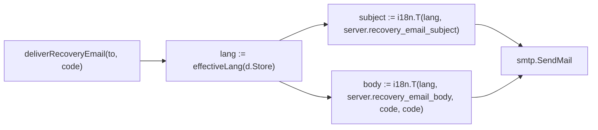
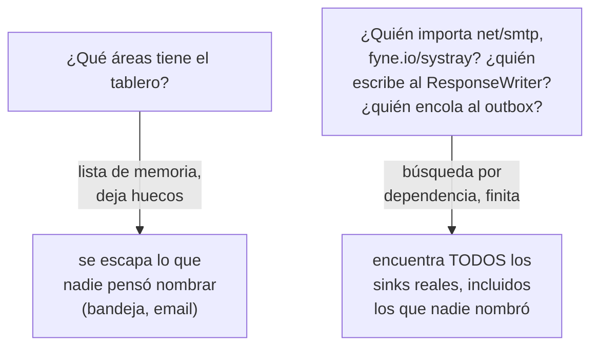
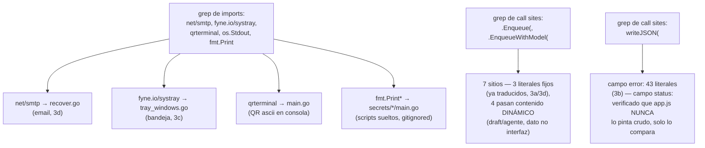
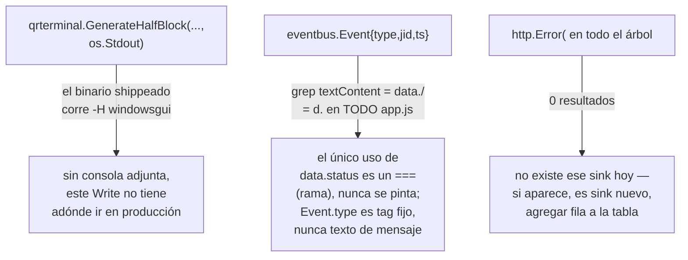

# T153 etapa 3d — el email de recuperación y el mapa de superficies (ct-2026-09-16-1916)

Diagrama hecho a mano, no vía `dflux_resolve` — mismo gap conocido de Go en
el codemap (ver etapas 3/3a/3b/3c).

## Parte 1 — el email, mismo molde que el WhatsApp de 3a

Mismo criterio que "bajá la espera o subí el techo" (3b): el español ya
tenía voseo (`ignorá`, `si no lo pediste vos`) — queda VERBATIM, sin tocar
una letra. El inglés es la traducción nueva. Plantilla entera con
`{code}` como hueco, nunca `"Tu código es: " + code` concatenado.

## Parte 2 — el mapa de superficies

El error que costó dos huecos: enumerar POR ÁREA (bandeja, email) en vez
de por MECANISMO de salida.

**El barrido real, uno por uno:**

## Los tres verificados "no aplica" — con evidencia, no supuesto

## El entregable: tabla en docs/MANUAL.md, no un test

Un test no puede fallar por un sink que todavía no existe (nadie puede
escribir hoy una aserción sobre un `import` que se agregará el mes que
viene). La tabla en `docs/MANUAL.md` ("Superficies de texto — mapa de
sinks") es lo que hace que el PRÓXIMO sink encuentre un lugar donde
sumarse, en vez de escaparse una tercera vez.

## Lo que se reportó y NO se tocó

`installer/windows/*.iss` (Inno Setup) — texto visible en español, pero
otra tecnología y otro ciclo de instalación. Ya verificado por Citrino que
`internal/installer/` no existe (mismo patrón que casi esconde la
bandeja) — está en `installer/windows/`. Escalado al dueño, no es parte
de T153.

## Verificación

`go build ./...` (Windows), `CGO_ENABLED=0 GOOS=linux go build ./...`,
`CGO_ENABLED=0 GOOS=darwin go build ./...`, `go vet ./...`,
`go test ./...` — los cinco verdes.
