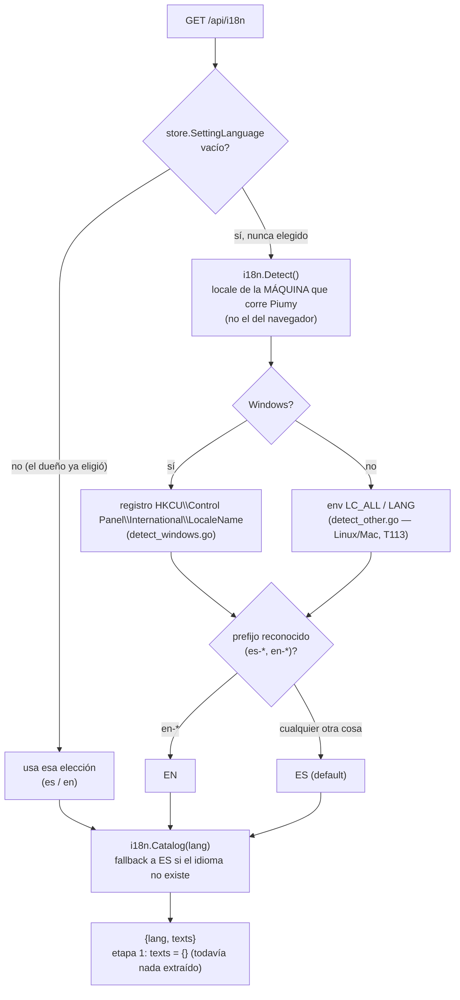
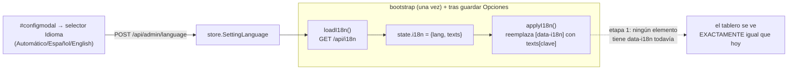

# T153 etapa 1 — el mecanismo de idioma, sin traducir nada (ct-2026-09-08-1656)

Diagrama hecho a mano, no vía `dflux_resolve` — el codemap todavía no indexa
`internal/i18n`/`internal/store`/`internal/restapi` para Go (gap ya conocido).

## Resolución del idioma efectivo — la elección manual siempre gana

## Front-end — mecanismo cableado, sin traducir nada todavía

Etapa 2 es sacar los textos de `index.html`/`app.js` al catálogo (poblar
`ES`/`EN` en `internal/i18n/lang.go`) y agregarles `data-i18n="clave"` a los
elementos — recién ahí `applyI18n()` empieza a traducir algo de verdad.
