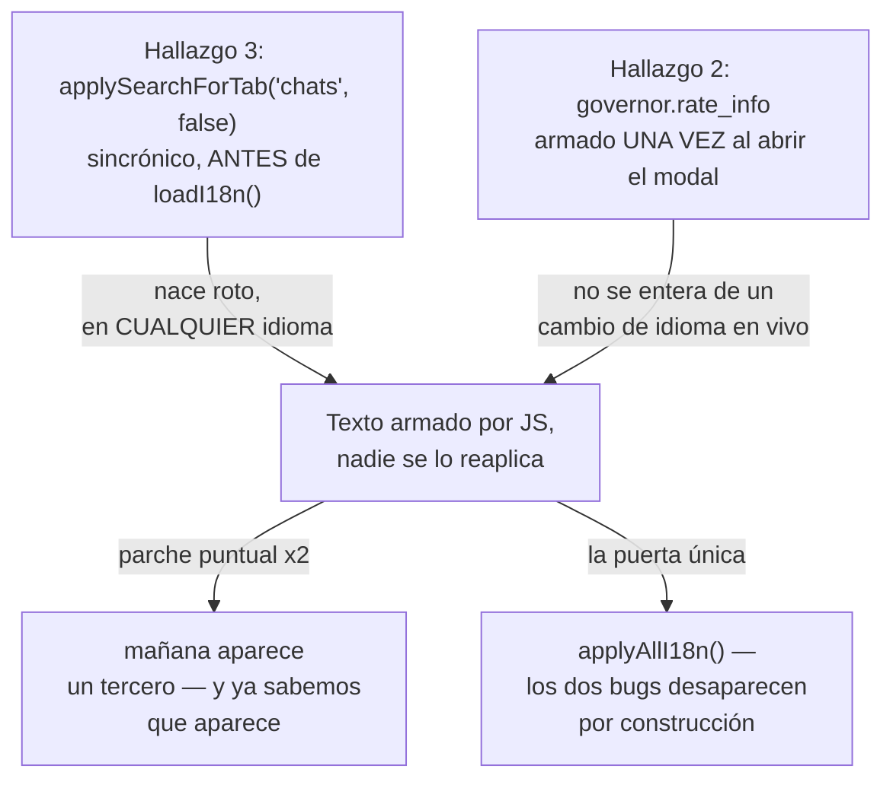
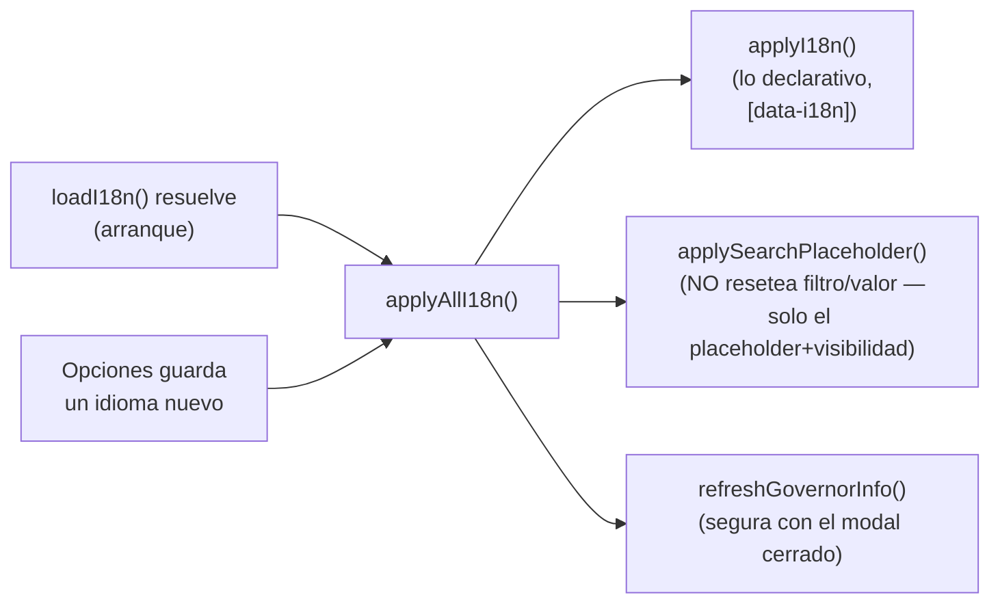
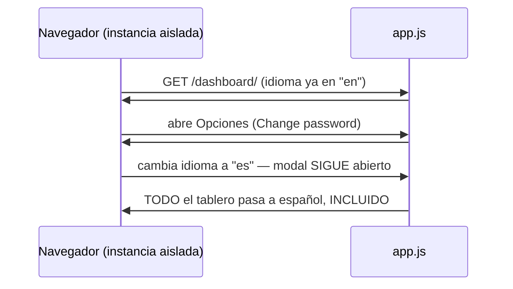
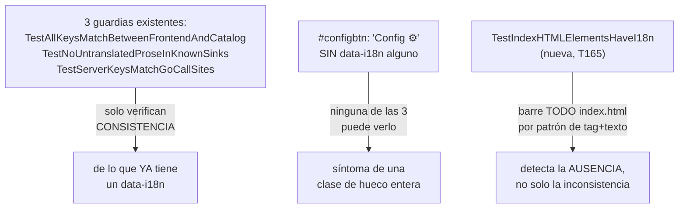

# T153 remate — los 3 hallazgos de la mirada visual, arreglados de raíz (ct-2026-09-16-2016)

Diagrama hecho a mano, no vía `dflux_resolve` — mismo gap conocido de Go/JS
en el codemap (ver etapas 3/3a/3b/3c/3d); acá además el archivo a evaluar es
`app.js`/`index.html`, ni siquiera Go.

## El defecto compartido de los hallazgos 2 y 3

## La puerta

`applySearchForTab(focusInput)` (el switch de pestaña real) sigue existiendo
aparte — resetea filtro/valor Y llama a `applySearchPlaceholder()` para no
duplicar el cálculo del placeholder. `loadChats`/`loadAgents`/
`loadPendingDrafts` quedan AFUERA de la puerta a propósito: ya se redibujan
solos cada 15s, con sus propios `t()` — meterlos adentro hubiera sido
alcance sin necesidad (evaluado, no descartado por costumbre).

## Verificado en vivo, no solo en el código

Instancia aislada, mismo binario (mutex temporal en el árbol de trabajo,
revertido antes de commitear — igual que T164), `PIUMY_REST_KEY` puesta.

## La guardia que faltaba

Probado en rojo dos veces: un `data-i18n` sacado a mano de `#configbtn`
(cayó señalando exactamente eso), un motivo vaciado en
`indexHTMLI18nExceptions` (cayó en el test hermano). Los comentarios HTML
del archivo se sacan ANTES de barrer — citan markup de ejemplo en su propia
prosa (`<button>`, ``) que el barrido leería como
elementos reales si no.

## Arreglos aplicados (no solo declarados)

- `#configbtn` → `data-i18n="modal.settings_title"` (reusa la clave del
  modal que abre — "Config ⚙" nunca decía "Configuración ⚙"/"Settings ⚙").
- `herostatus_pencil` → `data-i18n-title`/`data-i18n-aria-label` (la
  versión JS-armada ya usaba `t("hero.edit_status")`; el HTML estático se
  veía un instante sin eso antes de que loadProfileStatus() corriera).
- Pestaña "Chats" → `tab.chats` (nueva clave, idéntica en los dos idiomas,
  mismo criterio que Endpoint/PIN).
- Pestaña "Drafts" → `tab.drafts`, envuelta en su PROPIO `` — no
  `data-i18n` directo en el `<button>`: `applyI18n()` hace
  `el.textContent = text`, que hubiera borrado el ``
  vecino en cada pasada (mismo problema, mismo patrón de arreglo que
  `#privacybtn`, que ya envuelve su texto aparte del ícono).

## Lo que quedó declarado, no arreglado

`indexHTMLI18nExceptions` documenta 18 spots — nombres de marca (piumy,
WhatsApp, GitHub, Reddit), términos ya establecidos (BOSS/Boss, Governor,
Email, Español/English autónimos), y placeholders que JS reescribe al
vuelo (0 pendientes, Editar…, el hero desconectado, el QR). Uno de ellos es
un HALLAZGO nuevo sin cerrar, marcado como tal en el propio motivo:
`moodlabel`/"alive" muestran el valor crudo del backend
(`state.Status.Mood`) sin pasar nunca por `t()`. No se arregló acá — T165
no lo pidió y sumar alcance sin que se pida es exactamente lo que este
proyecto viene evitando. Reportado en el cierre del contrato.

## Verificación

`go build ./...` (Windows), `CGO_ENABLED=0 GOOS=linux go build ./...`,
`CGO_ENABLED=0 GOOS=darwin go build ./...`, `go vet ./...`,
`go test ./...` — los cinco verdes, incluidas las 4 guardias del catálogo.
`git status --short` limpio (mutex revertido) antes de commitear.
